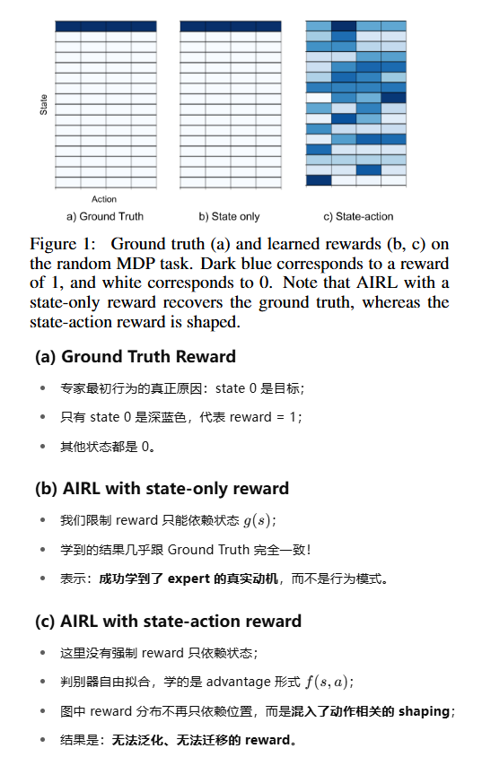

LEARNING ROBUST REWARDS WITH ADVERSARIAL INVERSE REINFORCEMENT LEARNING

通过对抗逆向RL，习得健壮的奖励

### 1、Introduction

RL是一个强大的工具，但它面临有两大挑战：

1. 复杂的特征工程。结合深度神经网络已经很大程度上缓解了人工特征提取的困难
2. 复杂的奖励工程。RL是对奖励敏感的技术，尤其是奖励稀疏或者幅度差异巨大的场景。

逆向RL（IRL）是一种奖励工程方法，它通过从专家演示中倒推成本函数，并依据成本函数构建奖励函数。这不是一件容易的事情。

直接模仿学习（IL）则会跳过倒推成本函数的环节，直接让agent学习专家演示中的状态到行为的映射，很多时候比IRL更直接有效。

In this paper, we propose adversarial inverse reinforcement learning (AIRL), an inverse reinforcement learning algorithm based on adversarial learning.

我们的实验评估表明，AIRL在动态未知的连续高维任务上优于先前的IRL方法。与不尝试直接恢复奖励的GAIL相比，我们的方法在不需要转移的任务上取得了相当的结果。而且，在演示环境中存在相当大的可变性的任务上，GAIL和其他IRL方法未能泛化。在这些环境中，我们的方法可以有效地将专家的目标与环境的动态性分开，取得了优异的结果。

### 2、Related Work

讲了一下IRL、GAIL

### 3、Background

讲了RL的目标函数、IRL的目标函数（最大似然问题）、借鉴GAN思路下reward函数 / 策略网络 与 D / G网络的对应关系：

### 4、ADVERSARIAL INVERSE REINFORCEMENT LEARNING

看不懂AIRL相比GAIL的优势，先摘抄着：

### 5、Experiments

In our experiments, we aim to answer two questions:
1. Can AIRL learn disentangled rewards that are robust to changes in environment dynamics?
2. Is AIRL efficient and scalable to high-dimensional continuous control tasks?

论文中Figure 3 4 5的中心思想：

