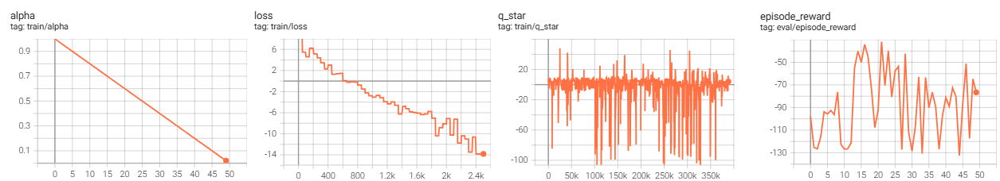
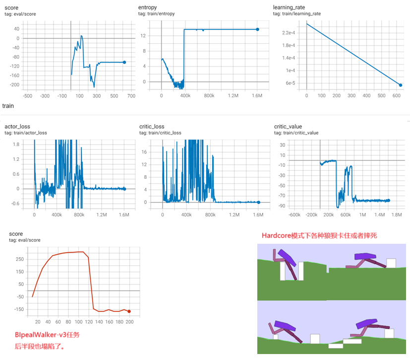

**Deeply AggreVaTeD: Differentiable Imitation Learning for Sequential Prediction**

### 1、Introduction

与 RL 不同的是，模仿学习（IL）把序列预测/决策问题简化为有监督学习：在训练阶段，通过我们会有一个最优的专家，它可以是一个策略函数Pi或者价值函数Q，任何时候它都能给出最优的动作。但这个专家只是在训练阶段存在，推理/测试阶段就要靠我们习得的agent自身的能力。

借助专家，IL通常比RL学的快很多。


模仿学习中的核心问题是：

- 一开始 agent 是跟专家学的，数据分布主要集中在 **专家访问过的状态**。
- 但当 agent 自己开始执行时，容易跑到训练时没见过的新状态，导致数据分布偏移（distribution mismatch）。

解决方案是“ interleave”，也就是：

- 训练的时候，也让 agent 自己测试，暴露它自己的错误状态，然后收集这些新状态的数据，继续学习。
- 相当于主动修正它自己会走偏的状态。

这正是 DAgger、AggreVaTe 这些算法的本质。一句话：一些交互式的模仿学习方法，例如 SEARN、DAgger 和 AggreVaTe，通过**交错地进行学习和测试的过程**，来解决训练和测试时状态分布不一致的问题。因此，这类方法在实际应用中通常效果更好。


本论文提出了AggreVaTeD方法，是AggreVaTe方法的改进版（而AggreVaTe又是DAgger的改进版）。实验证明AggreVaTeD方法可以获得专家级的效果，甚至超过专家，这是那些非交互式的模仿学习方法通常无法达到的性能。

这三者的一脉相承关系是这样的：

1. DAgger：数据集聚合，学专家的动作
2. 从纯行为模仿（DAgger）进化到 目标优化：学会最小化 future cost（更 RL 化的目标），就得到了AggreVaTe
3. 解决 AggreVaTe 可微和深度网络兼容问题，就得到了AggreVaTeD

这个鬼怎么读嘛？


### 2、Preliminaries

介绍了MDP和DRL的一些基础知识

### 3、Differentiable Imitation Learning

感觉这里的数学推导也没有什么新东西，有点故弄玄虚...


### 4、Sample-Based Practical Algorithms

#### 算法过程


#### 与DAgger的对比


#### 供参考的超参数清单

| **超参数**                 | **推荐取值**                              | **含义**                                                     |
| -------------------------- | ----------------------------------------- | ------------------------------------------------------------ |
| N（迭代次数）              | 50～200                                   | 算法主训练循环次数；每次迭代用混合策略采样新的轨迹并更新策略网络，直到策略收敛为止。 |
| α₀（初始专家权重）         | 1.0                                       | 初始混合权重；开始时完全依赖专家策略 π* 来指导 roll-in 行为。 |
| α_n（衰减策略）            | α_n = α₀ · (decay_rate)ⁿ 或 α_n = 1/(n+1) | 逐步减少专家权重；推荐使用指数衰减（decay_rate=0.99~0.995），保证算法渐进过渡到纯策略采样。 |
| decay_rate                 | 0.99~0.995                                | α_n 中的指数衰减速率，控制减少速度；值接近1意味着减少缓慢，值较小时意味着减少快。 |
| K（每次迭代采样轨迹数）    | 8～32                                     | 每次迭代中从环境中采集的新轨迹数量，用于更新策略网络。       |
| 轨迹步长 H                 | 环境的 episode 长度                       | 单个 episode 最大步数（任务相关），例如 BipedalWalkerHardcore 一集约 1600 步。 |
| γ（折扣因子）              | 0.99                                      | 折扣因子，用于计算轨迹回报时折扣未来奖励，标准 RL 折扣取法即可。 |
| lr（学习率）               | 3e-4                                      | 策略网络优化器学习率，建议用 Adam 优化器，开始用较小学习率减少梯度爆炸风险。 |
| batch_size（训练批大小）   | 64～256                                   | 用轨迹中采集到的所有 transition 训练策略网络时的批大小。     |
| clip_grad_norm（梯度裁剪） | 0.5～1.0                                  | 梯度裁剪范围，避免梯度过大导致网络权重更新过猛引发 NaN 或不稳定。 |
| log_std_min/max            | [-10, 1]                                  | 策略网络中 log_std 的取值范围，避免标准差过大过小导致数值不稳定。 |
| entropy_coeff（熵权重）    | 0.0~0.01                                  | 可以考虑添加小权重鼓励策略探索（与 PPO 类似），AggreVaTeD 中通常可以设为 0 或非常小。 |
| normalize_q_star           | True                                      | 是否对 Q*(s,a) 做 min-max 归一化或减去 baseline，减少梯度方差，提高稳定性。 |
| replay_buffer              | False                                     | AggreVaTeD 建议不使用 replay buffer，保证 roll-in 策略分布匹配理论假设。 |

#### 实现细节


#### 连续分布的熵可以为负数


### 5、Quantify the Gap: An Analysis of IL vs RL

从理论上量化模仿学习（Imitation Learning, IL）相较于强化学习（Reinforcement Learning, RL）的学习效率优势

### 6、Expertiments


### 7、 Bison的实验

#### BipedalWalker

##### REINFORCE（失败）

我需要稳打稳扎，我先搞定REINFORCE算法训练agent完成BipedalWalker任务。

搞不定，分别让两个顶尖的AI写代码实现，都不收敛。我怀疑REINFORCE算法就是搞不定BipedalWalker这样稍显复杂的任务。

```python
import datetime
import random

from stable_baselines3 import SAC

import gymnasium as gym
import torch
import torch.nn as nn
import torch.optim as optim
import numpy as np

from torch.utils.tensorboard import SummaryWriter
from tqdm import tqdm
import torch.nn.functional as F


writer = SummaryWriter(log_dir=f'logs/reinforce_BipedalWalker_{datetime.datetime.now().strftime("%m%d_%H%M%S")}')
device = 'cuda:0' if torch.cuda.is_available() else 'cpu'

class Config:
    max_iteration = 1000
    state_dim = 24
    action_dim = 4
    max_action = 1
    H = 1000

    #env_name = "BipedalWalkerHardcore-v3"
    env_name = "BipedalWalker-v3"
    hidden_dim = 128
    lr = 3e-4
    gamma = 0.99
    batch_sz = 128
    train_repeat = 4
    rollout_repeat = 1

# ----------------------------
# 1. 策略网络定义
# ----------------------------
class PolicyNetwork(nn.Module):
    def __init__(self, state_dim, action_dim, log_std_min=-10, log_std_max=2):
        super(PolicyNetwork, self).__init__()
        self.fc1 = nn.Linear(state_dim, Config.hidden_dim)
        self.fc2 = nn.Linear(Config.hidden_dim, Config.hidden_dim)
        self.fc3 = nn.Linear(Config.hidden_dim, Config.hidden_dim)

        self.mean = nn.Linear(Config.hidden_dim, action_dim)
        self.log_std = nn.Linear(Config.hidden_dim, action_dim)

        self.log_std_min = log_std_min
        self.log_std_max = log_std_max

    def forward(self, state):
        x = F.relu(self.fc1(state))
        x = F.relu(self.fc2(x))
        x = F.relu(self.fc3(x))

        mean = self.mean(x)
        log_std = self.log_std(x)
        log_std = torch.clamp(log_std, self.log_std_min, self.log_std_max)
        std = torch.exp(log_std)

        return mean, std

    # 带随机性的采样动作和该动作的log-prob值
    def sample(self, state):
        mean, std = self.forward(state)
        normal = torch.distributions.Normal(mean, std)
        x = normal.rsample()
        action = torch.tanh(x)

        log_prob = normal.log_prob(x)
        # This is the crucial part, known as the "log-derivative of the tanh transformation" or
        # the "correction term for squashing functions".
        # It help to get the log_prob of the squashed action (action) in the squashed space
        log_prob -= torch.log(1 - action.pow(2) + 1e-6)
        log_prob = log_prob.sum(1, keepdim=True)
        # todo：如果任务的action幅度不是+-1，还需要乘，并调整log_prob
        return action, log_prob
    # 确定性的返回最大概率的动作
    def predict(self, state):
        mean, std = self.forward(state)
        x = mean
        action = torch.tanh(x)
        return action
    # 根据state计算动作分布，返回old_action动作在该分布下的log_prob，
    # old_action是经过tanh rescaled了的
    def get_log_prob(self, state, old_action):
        #避免 后面 arctanh 返回的绝对值太大了，做稍微裁剪
        eps = 1e-6
        old_action = torch.clamp(old_action, -1 + eps, 1 - eps)

        mean, std = self.forward(state)
        assert (torch.abs(old_action) < 1).all(), f'invalid action:{old_action}'
        normal = torch.distributions.Normal(mean, std)
        unscaled_action = torch.arctanh(old_action)
        ent = normal.entropy()

        log_prob = normal.log_prob(unscaled_action)
        # This is the crucial part, known as the "log-derivative of the tanh transformation" or
        # the "correction term for squashing functions".
        # It help to get the log_prob of the squashed action (action) in the squashed space
        log_prob -= torch.log(1 - old_action.pow(2) + 1e-6)
        log_prob = log_prob.sum(1, keepdim=True)
        # todo：如果任务的action幅度不是+-1，还需要乘，并调整log_prob
        return  log_prob, ent.mean()


class AggreVateDAgent:
    def __init__(self):
        self.env = gym.make(Config.env_name, render_mode=None)  # 开启可视化

        self.policy = PolicyNetwork(Config.state_dim, Config.action_dim, Config.hidden_dim).to(device)
        self.optimizer = optim.Adam(self.policy.parameters(), lr=Config.lr)

    def compute_returns(self, rewards):
        returns = []
        R = 0
        for r in reversed(rewards):
            R = r + Config.gamma * R
            returns.insert(0, R)
        return returns

    def normalize_returns(self, return_list):
        return_list = np.array(return_list)
        return_list = (return_list - return_list.mean()) / (return_list.std() + 1e-8)
        #return_list = (return_list - return_list.min()) / (return_list.max() - return_list.min() + 1e-8)
        return return_list


    def update(self, states_list:np.ndarray, actions_list:np.ndarray, scale_factor:np.ndarray, epoch:int):
        total_loss = 0.0
        loss_cnt = 0
        sample_num = states_list.shape[0]
        indices = np.arange(sample_num)
        np.random.shuffle(indices)


        for start in range(0, sample_num, Config.batch_sz):
            end = min(start + Config.batch_sz, sample_num )

            batch_idx = indices[start:end]

            action = actions_list[batch_idx]
            state = states_list[batch_idx]
            q_star = scale_factor[batch_idx]


            obs_tensor = torch.from_numpy(state).float().to(device)
            action_tensor = torch.from_numpy(action).float().to(device)
            q_star_tensor = torch.from_numpy(q_star).float().unsqueeze(-1).to(device)


            log_prob, ent_mean = self.policy.get_log_prob(obs_tensor, action_tensor)
            loss = -log_prob * q_star_tensor - ent_mean * 0.01
            loss = loss.mean()
            total_loss += loss
            loss_cnt += 1

            self.optimizer.zero_grad()
            loss.backward()
            self.optimizer.step()
        return total_loss / (loss_cnt + 1e-8)


    def evaluate(self, mode=None):
        env = gym.make(Config.env_name, render_mode=mode)
        total_reward = 0
        for _ in range(5):
            state, _ = env.reset()
            for _ in range(1000):
                with torch.no_grad():
                    state_tensor = torch.FloatTensor(state).unsqueeze(0).to(device)
                    action = self.policy.predict(state_tensor)
                    action = action.squeeze(0).cpu().numpy()

                next_state, reward, done, _, _ = env.step(action)
                total_reward += reward
                state = next_state

                if done:
                    break

        env.close()
        return total_reward / 5


    def train(self):

        update_cnt = 0
        step_cnt = 0
        for epoch in tqdm(range(0, Config.max_iteration), 'trainning'):
            transition_list = []
            return_list = []
            episodes_per_rollout = 0
            #for _ in range(Config.rollout_repeat):
            while len(transition_list) < 2000:
                state,_ = self.env.reset()
                rewards = []
                episodes_per_rollout += 1
                for _ in range(Config.H):
                    state_tensor = torch.FloatTensor(state).to(device)
                    state_tensor = state_tensor.unsqueeze(0)
                    with torch.no_grad():
                        action, _ = self.policy.sample(state_tensor)
                        action = action.squeeze(0).cpu().numpy()
                    next_state, reward, done, _, _ = self.env.step(action)
                    step_cnt += 1
                    rewards.append(reward)

                    transition_list.append(
                                 (state,
                                  action,
                                  next_state,
                                  reward,
                                  done)
                                 )

                    state = next_state
                    if done:
                        break
                returns = self.compute_returns(rewards)
                return_list.extend(returns)
            writer.add_scalar('train/episodes_per_rollout', episodes_per_rollout, epoch)


            return_list = self.normalize_returns(return_list)
            states_list, actions_list, _, _, _ = zip(*transition_list)
            states_list = np.stack(states_list)
            actions_list = np.stack(actions_list)
            for _ in range(Config.train_repeat):
                update_cnt += 1
                loss = self.update(states_list, actions_list, return_list, epoch) # todo:从 REINFORCE 改回来
                writer.add_scalar('train/loss', loss.item(), update_cnt)

            if (epoch + 1) % 10 == 0:
                score = self.evaluate()
                writer.add_scalar('eval/episode_reward', score, epoch)


        self.evaluate('human')

# 6. 主函数（命令行参数解析）
# ----------------------------
def main(mode):
    agent = AggreVateDAgent()
    agent.train()


if __name__ == "__main__":
    main("train")
```


##### REINFORCE + AggreVateD （失败）

不收敛，啥都没有学到




代码如下：

```python
import datetime
import random

from stable_baselines3 import SAC

import gymnasium as gym
import torch
import torch.nn as nn
import torch.optim as optim
import numpy as np

from torch.utils.tensorboard import SummaryWriter
from tqdm import tqdm
import torch.nn.functional as F


writer = SummaryWriter(log_dir=f'logs/AggreVateD_BipedalWalker_{datetime.datetime.now().strftime("%m%d_%H%M%S")}')
device = 'cuda:0' if torch.cuda.is_available() else 'cpu'

class Config:
    max_iteration = 50
    state_dim = 24
    action_dim = 4
    max_action = 1
    K = 20
    H = 1000
    env_name = "BipedalWalkerHardcore-v3"
    hidden_dim = 128
    lr = 3e-4
    gamma = 0.99
    batch_sz = 128
    train_repeat = 30
# ----------------------------
# 1. 策略网络定义
# ----------------------------
class PolicyNetwork(nn.Module):
    def __init__(self, state_dim, action_dim, log_std_min=-10, log_std_max=2):
        super(PolicyNetwork, self).__init__()
        self.fc1 = nn.Linear(state_dim, Config.hidden_dim)
        self.fc2 = nn.Linear(Config.hidden_dim, Config.hidden_dim)
        self.fc3 = nn.Linear(Config.hidden_dim, Config.hidden_dim)

        self.mean = nn.Linear(Config.hidden_dim, action_dim)
        self.log_std = nn.Linear(Config.hidden_dim, action_dim)

        self.log_std_min = log_std_min
        self.log_std_max = log_std_max

    def forward(self, state):
        x = F.relu(self.fc1(state))
        x = F.relu(self.fc2(x))
        x = F.relu(self.fc3(x))

        mean = self.mean(x)
        log_std = self.log_std(x)
        log_std = torch.clamp(log_std, self.log_std_min, self.log_std_max)
        std = torch.exp(log_std)

        return mean, std

    # 带随机性的采样动作和该动作的log-prob值
    def sample(self, state):
        mean, std = self.forward(state)
        normal = torch.distributions.Normal(mean, std)
        x = normal.rsample()
        action = torch.tanh(x)

        log_prob = normal.log_prob(x)
        # This is the crucial part, known as the "log-derivative of the tanh transformation" or
        # the "correction term for squashing functions".
        # It help to get the log_prob of the squashed action (action) in the squashed space
        log_prob -= torch.log(1 - action.pow(2) + 1e-6)
        log_prob = log_prob.sum(1, keepdim=True)
        # todo：如果任务的action幅度不是+-1，还需要乘，并调整log_prob
        return action, log_prob
    # 确定性的返回最大概率的动作
    def predict(self, state):
        mean, std = self.forward(state)
        x = mean
        action = torch.tanh(x)
        return action
    # 根据state计算动作分布，返回old_action动作在该分布下的log_prob，
    # old_action是经过tanh rescaled了的
    def get_log_prob(self, state, old_action):
        #避免 后面 arctanh 返回的绝对值太大了，做稍微裁剪
        eps = 1e-6
        old_action = torch.clamp(old_action, -1 + eps, 1 - eps)

        mean, std = self.forward(state)
        assert (torch.abs(old_action) < 1).all(), f'invalid action:{old_action}'
        normal = torch.distributions.Normal(mean, std)
        unscaled_action = torch.arctanh(old_action)

        log_prob = normal.log_prob(unscaled_action)
        # This is the crucial part, known as the "log-derivative of the tanh transformation" or
        # the "correction term for squashing functions".
        # It help to get the log_prob of the squashed action (action) in the squashed space
        log_prob -= torch.log(1 - old_action.pow(2) + 1e-6)
        log_prob = log_prob.sum(1, keepdim=True)
        # todo：如果任务的action幅度不是+-1，还需要乘，并调整log_prob
        return  log_prob


class AggreVateDAgent:
    def __init__(self):
        self.env = gym.make(Config.env_name, render_mode=None)  # 开启可视化

        self.policy = PolicyNetwork(Config.state_dim, Config.action_dim, Config.hidden_dim).to(device)
        self.optimizer = optim.Adam(self.policy.parameters(), lr=Config.lr)

        # 加载专家模型，来自SB3存放在hugging face上的预训练模型
        self.expert = SAC.load('./rl-trained-agents/sac/BipedalWalkerHardcore-v3_1/BipedalWalkerHardcore-v3.zip')
        self.alpha = 1.0

    def mixed_policy(self, state:torch.Tensor):
        if random.random() < self.alpha:
            obs = state.squeeze().cpu().numpy()
            action, _ = self.expert.predict(obs, deterministic=True)
        else:
            action, _ = self.policy.sample(state)
            action = action.squeeze(0).cpu().numpy()
        return action

    def decay_alpha(self, epoch):
        slope = 1.0 / Config.max_iteration
        self.alpha = 1.0 - slope * epoch
        return self.alpha

    def compute_returns(self, rewards):
        returns = []
        R = 0
        for r in reversed(rewards):
            R = r + Config.gamma * R
            returns.insert(0, R)
        return returns

    def normalize_returns(self, return_list):
        return_list = np.array(return_list)
        return_list = (return_list - return_list.mean()) / (return_list.std() + 1e-8)
        return return_list


    def normalize_q_star(self, transition_list):
        q_star_list = []

        for timestep in transition_list:
            state, action, next_state, reward, done, q_star = timestep
            q_star_list.append(q_star)
        q_star_list = np.array(q_star_list) # type:np.ndarray
        q_star_list = (q_star_list - q_star_list.min()) / (q_star_list.max() - q_star_list.min() + 1e-8)
        #q_star_list -= 0.5
        #q_star_list = (q_star_list - q_star_list.mean()) / (q_star_list.std() + 1e-8)
        return q_star_list

    def update(self, states_list:np.ndarray, actions_list:np.ndarray, normalized_q_star_list:np.ndarray, epoch:int):
        total_loss = 0.0
        loss_cnt = 0
        sample_num = states_list.shape[0]
        indices = np.arange(sample_num)
        np.random.shuffle(indices)


        for start in range(0, sample_num, Config.batch_sz):
            end = min(start + Config.batch_sz, sample_num )

            batch_idx = indices[start:end]

            action = actions_list[batch_idx]
            state = states_list[batch_idx]
            q_star = normalized_q_star_list[batch_idx]


            obs_tensor = torch.from_numpy(state).float().to(device)
            action_tensor = torch.from_numpy(action).float().to(device)
            q_star_tensor = torch.from_numpy(q_star).float().unsqueeze(-1).to(device)


            log_prob = self.policy.get_log_prob(obs_tensor, action_tensor)
            loss = -log_prob * q_star_tensor
            loss = loss.mean()
            total_loss += loss
            loss_cnt += 1

            self.optimizer.zero_grad()
            loss.backward()
            self.optimizer.step()
        return total_loss / (loss_cnt + 1e-8)


    def evaluate(self, mode=None):
        env = gym.make(Config.env_name, render_mode=mode)
        total_reward = 0
        for _ in range(5):
            state, _ = env.reset()
            for _ in range(1000):
                with torch.no_grad():
                    state_tensor = torch.FloatTensor(state).unsqueeze(0).to(device)
                    action = self.policy.predict(state_tensor)
                    action = action.squeeze(0).cpu().numpy()

                next_state, reward, done, _, _ = env.step(action)
                total_reward += reward
                state = next_state

                if done:
                    break

        env.close()
        return total_reward / 5

    def get_q_star(self, state, action):
        obs_tensor = torch.tensor(state).float().unsqueeze(0).to(device)
        action_tensor = torch.tensor(action).float().unsqueeze(0).to(device)
        q1, q2 = self.expert.critic.forward(obs_tensor, action_tensor)
        q_star = torch.min(q1, q2)  # type:torch.Tensor
        q_star = q_star.squeeze(0)
        return q_star.item()

    def train(self):

        update_cnt = 0
        step_cnt = 0
        for epoch in tqdm(range(0, Config.max_iteration), 'trainning'):
            transition_list = []
            return_list = []
            for _ in range(Config.K):
                state,_ = self.env.reset()
                rewards = []
                for _ in range(Config.H):
                    state_tensor = torch.FloatTensor(state).to(device)
                    state_tensor = state_tensor.unsqueeze(0)
                    with torch.no_grad():
                        action = self.mixed_policy(state_tensor) #type:torch.Tensor
                    next_state, reward, done, _, _ = self.env.step(action)
                    q_star = self.get_q_star(state, action)
                    step_cnt += 1
                    writer.add_scalar('train/q_star', q_star, step_cnt)
                    rewards.append(reward)

                    transition_list.append(
                                 (state,
                                  action,
                                  next_state,
                                  reward,
                                  done,
                                  q_star)
                                 )

                    state = next_state
                    if done:
                        break
                returns = self.compute_returns(rewards)
                return_list.extend(returns)


            q_star_list = self.normalize_q_star(transition_list)  # type:np.ndarray
            return_list = self.normalize_returns(return_list)
            states_list, actions_list, _, _, _, _ = zip(*transition_list)
            states_list = np.stack(states_list)
            actions_list = np.stack(actions_list)
            for _ in range(Config.train_repeat):
                update_cnt += 1
                loss = self.update(states_list, actions_list, q_star_list, epoch)
                writer.add_scalar('train/loss', loss.item(), update_cnt)

            score = self.evaluate()
            writer.add_scalar('eval/episode_reward', score, epoch)

            self.decay_alpha(epoch)
            writer.add_scalar('train/alpha', self.alpha, epoch)

        self.evaluate('human')

# 6. 主函数（命令行参数解析）
# ----------------------------
def main(mode):
    agent = AggreVateDAgent()
    agent.train()


if __name__ == "__main__":
    main("train")
```


##### PPO

还是先退而求其次的搞定纯PPO算法再说，任务也退而求其次挑选容易的BipedalWalker-v3：

能够收敛：

```
eval episode reward:265.42669677734375, episode len:1600
eval episode reward:261.82794189453125, episode len:1600
eval episode reward:278.5479431152344, episode len:1600
eval episode reward:272.2469482421875, episode len:1600
```


```python
import datetime
import gymnasium as gym
import numpy as np
import torch
import torch.nn as nn
import torch.optim as optim
import torch.nn.functional as F
from torch.utils.tensorboard import SummaryWriter
from tqdm import tqdm

# ----------------------------
# ✅ Config 配置超参数
# ----------------------------
class Config:
    env_name = "BipedalWalker-v3"
    state_dim = 24
    action_dim = 4
    hidden_dim = 128

    min_rollout_steps = 3000
    max_episode_length = 3000
    gamma = 0.99
    lam = 0.95  # GAE lambda
    train_iters = 10

    clip_ratio = 0.2
    entropy_coef = 0.001 #这个值很敏感，稍微大一点就不收敛了
    lr = 3e-4
    batch_size = 128
    max_iters = 600

    device = torch.device("cuda" if torch.cuda.is_available() else "cpu")
    log_dir = f'logs/PPO_{datetime.datetime.now().strftime("%m%d_%H%M%S")}'
    obs_scale = torch.tensor([
        3.1415927, 5., 5., 5., 3.1415927, 5., 3.1415927, 5., 5., 3.1415927,
        5., 3.1415927, 5., 5., 1., 1., 1., 1., 1., 1., 1., 1., 1., 1.
    ], dtype=torch.float32)  # shape: [24]

# ----------------------------
# ✅ 策略网络
# ----------------------------
class PolicyNet(nn.Module):
    def __init__(self):
        super().__init__()
        self.fc1 = nn.Linear(Config.state_dim, Config.hidden_dim)
        self.fc2 = nn.Linear(Config.hidden_dim, Config.hidden_dim)
        self.mean = nn.Linear(Config.hidden_dim, Config.action_dim)
        self.log_std = nn.Linear(Config.hidden_dim, Config.action_dim)
        self.log_std_min = -10
        self.log_std_max = 2

    def forward(self, state):
        state = state / Config.obs_scale.to(Config.device)
        x = F.relu(self.fc1(state))
        x = F.relu(self.fc2(x))
        mean = self.mean(x)
        log_std = torch.clamp(self.log_std(x), self.log_std_min, self.log_std_max)
        std = torch.exp(log_std)
        return mean, std

    def sample(self, state):
        mean, std = self.forward(state)
        dist = torch.distributions.Normal(mean, std)
        raw_action = dist.rsample()
        action = torch.tanh(raw_action)
        log_prob = dist.log_prob(raw_action) - torch.log(1 - action.pow(2) + 1e-6)
        log_prob = log_prob.sum(-1, keepdim=True)
        entropy = dist.entropy().sum(-1, keepdim=True)
        return action, log_prob, entropy

    def get_log_prob(self, state, action):
        mean, std = self.forward(state)
        dist = torch.distributions.Normal(mean, std)
        raw_action = torch.atanh(action.clamp(-0.999999, 0.999999))
        log_prob = dist.log_prob(raw_action) - torch.log(1 - action.pow(2) + 1e-6)
        return log_prob.sum(-1, keepdim=True)

# ----------------------------
# ✅ 值函数网络
# ----------------------------
class ValueNet(nn.Module):
    def __init__(self):
        super().__init__()
        self.fc1 = nn.Linear(Config.state_dim, Config.hidden_dim)
        self.fc2 = nn.Linear(Config.hidden_dim, Config.hidden_dim)
        self.v = nn.Linear(Config.hidden_dim, 1)

    def forward(self, state):
        state = state / Config.obs_scale.to(Config.device)
        x = F.relu(self.fc1(state))
        x = F.relu(self.fc2(x))
        return self.v(x)

# ----------------------------
# ✅ PPO Agent
# ----------------------------
class PPOAgent:
    def __init__(self):
        self.env = gym.make(Config.env_name)
        self.policy = PolicyNet().to(Config.device)
        self.value = ValueNet().to(Config.device)

        self.optimizer_policy = optim.Adam(self.policy.parameters(), lr=Config.lr)
        self.optimizer_value = optim.Adam(self.value.parameters(), lr=Config.lr)
        self.writer = SummaryWriter(Config.log_dir)

        self.actor_update_cnt = 0
        self.critic_update_cnt = 0

    def rollout(self):
        buffer = []
        while len(buffer) < Config.min_rollout_steps:
            state, _ = self.env.reset()
            for _ in range(Config.max_episode_length):
                s = torch.FloatTensor(state).unsqueeze(0).to(Config.device)
                with torch.no_grad():
                    action, log_prob, entropy = self.policy.sample(s)
                    value = self.value(s)
                action_np = action.cpu().numpy().squeeze(0)
                next_state, reward, term, truncated, _ = self.env.step(action_np)
                done = term or truncated

                buffer.append((state, action_np, log_prob.item(),
                               reward, value.item(), done))  # ✅ 多存done
                state = next_state
                if done:
                    break
        return buffer, next_state

    def compute_gae(self, rewards, values, dones, next_state):
        advantages = []
        gae = 0
        for t in reversed(range(len(rewards))):
            if t == len(rewards) - 1:
                next_value = 0 if dones[t] else self.value(
                    torch.FloatTensor(next_state).unsqueeze(0).to(Config.device)).item()
            else:
                next_value = 0 if dones[t] else values[t + 1]

            delta = rewards[t] + Config.gamma * next_value - values[t]
            gae = delta + Config.gamma * Config.lam * (1 - dones[t]) * gae
            advantages.insert(0, gae)
        advantages = torch.tensor(advantages, dtype=torch.float32).to(Config.device)
        returns = advantages + torch.tensor(values, dtype=torch.float32).to(Config.device)
        return advantages, returns

    def update(self, buffer, next_state):
        states, actions, old_log_probs, rewards, values, dones = zip(*buffer)
        states = torch.FloatTensor(np.array(states)).to(Config.device)
        actions = torch.FloatTensor(np.array(actions)).to(Config.device)
        old_log_probs = torch.FloatTensor(old_log_probs).unsqueeze(-1).to(Config.device)
        rewards = list(rewards)
        dones = list(dones)
        values = list(values)

        advantages, returns = self.compute_gae(rewards, values, dones, next_state)
        advantages = (advantages - advantages.mean()) / (advantages.std() + 1e-8)

        # Critic
        for _ in range(Config.train_iters):
            perm = np.random.permutation(len(states))
            for start in range(0, len(perm), Config.batch_size):
                idx = perm[start:start + Config.batch_size]
                self.critic_update_cnt += 1
                v_pred = self.value(states[idx])
                v_target = returns[idx].unsqueeze(-1)
                value_loss = F.mse_loss(v_pred, v_target)
                self.optimizer_value.zero_grad()
                value_loss.backward()
                self.optimizer_value.step()
                self.writer.add_scalar('train/critic_loss', value_loss.item(), self.critic_update_cnt)
                self.writer.add_scalar('train/critic_value', v_pred.mean().item(), self.critic_update_cnt)

        # Actor
        for _ in range(Config.train_iters):
            perm = np.random.permutation(len(states))
            for start in range(0, len(perm), Config.batch_size):
                idx = perm[start:start + Config.batch_size]
                self.actor_update_cnt += 1
                new_logp = self.policy.get_log_prob(states[idx], actions[idx])
                ratio = torch.exp(new_logp - old_log_probs[idx])
                surr1 = ratio * advantages[idx].unsqueeze(-1)
                surr2 = torch.clamp(ratio, 1-Config.clip_ratio, 1+Config.clip_ratio) * advantages[idx].unsqueeze(-1)
                policy_loss = - torch.min(surr1, surr2).mean()
                _, _, entropy = self.policy.sample(states[idx])
                loss = policy_loss - Config.entropy_coef * entropy.mean()
                self.optimizer_policy.zero_grad()
                loss.backward()
                self.optimizer_policy.step()
                self.writer.add_scalar('train/entropy', entropy.mean().item(), self.actor_update_cnt)
                self.writer.add_scalar('train/actor_loss', loss.item(), self.actor_update_cnt)

    def evaluate(self, num_episodes=5):
        env = gym.make(Config.env_name)
        rewards = []
        for _ in range(num_episodes):
            state, _ = env.reset()
            total = 0
            episode_len = 0
            for _ in range(Config.max_episode_length):
                with torch.no_grad():
                    s = torch.FloatTensor(state).unsqueeze(0).to(Config.device)
                    action, _, _ = self.policy.sample(s)
                state, reward, term, truncated, _ = env.step(action.cpu().numpy().squeeze(0))
                done = term or truncated
                total += reward
                episode_len += 1
                if done:
                    break
            print(f'eval episode reward:{total}, episode len:{episode_len}')
            rewards.append(total)
        return np.mean(rewards)

    def train(self):
        for epoch in tqdm(range(Config.max_iters), desc="Training"):
            buffer, next_state = self.rollout()
            self.update(buffer, next_state)
            if (epoch+1) % 20 == 0:
                avg_ret = self.evaluate()
                self.writer.add_scalar("eval/score", avg_ret, epoch)
                print(f"[Iter {epoch}] Avg Return: {avg_ret:.2f}")

# ----------------------------
# ✅ 主入口
# ----------------------------
if __name__ == "__main__":
    agent = PPOAgent()
    agent.train()

```


##### PPO + AggreVateD（失败）

我本着尽量少改的原则，只修改：

1. 使用混合策略收集轨迹
2. 只在actor的update中使用Q*， value网路更新不用

不收敛：


```python
import datetime
import gymnasium as gym
import numpy as np
import torch
import torch.nn as nn
import torch.optim as optim
import torch.nn.functional as F
from torch.utils.tensorboard import SummaryWriter
from tqdm import tqdm
import random
from stable_baselines3 import SAC
# ----------------------------
# ✅ Config 配置超参数
# ----------------------------
class Config:
    env_name = "BipedalWalker-v3"
    state_dim = 24
    action_dim = 4
    hidden_dim = 128

    min_rollout_steps = 3000
    max_episode_length = 3000
    gamma = 0.99
    lam = 0.95  # GAE lambda
    train_iters = 10
    alpha_start = 1.0

    clip_ratio = 0.2
    entropy_coef = 0.001 #这个值很敏感，稍微大一点就不收敛了
    lr = 3e-4
    batch_size = 128
    max_iters = 600

    device = torch.device("cuda" if torch.cuda.is_available() else "cpu")
    log_dir = f'logs/PPO_{datetime.datetime.now().strftime("%m%d_%H%M%S")}'
    obs_scale = torch.tensor([
        3.1415927, 5., 5., 5., 3.1415927, 5., 3.1415927, 5., 5., 3.1415927,
        5., 3.1415927, 5., 5., 1., 1., 1., 1., 1., 1., 1., 1., 1., 1.
    ], dtype=torch.float32)  # shape: [24]

# ----------------------------
# ✅ 策略网络
# ----------------------------
class PolicyNet(nn.Module):
    def __init__(self):
        super().__init__()
        self.fc1 = nn.Linear(Config.state_dim, Config.hidden_dim)
        self.fc2 = nn.Linear(Config.hidden_dim, Config.hidden_dim)
        self.mean = nn.Linear(Config.hidden_dim, Config.action_dim)
        self.log_std = nn.Linear(Config.hidden_dim, Config.action_dim)
        self.log_std_min = -10
        self.log_std_max = 2

    def forward(self, state):
        state = state / Config.obs_scale.to(Config.device)
        x = F.relu(self.fc1(state))
        x = F.relu(self.fc2(x))
        mean = self.mean(x)
        log_std = torch.clamp(self.log_std(x), self.log_std_min, self.log_std_max)
        std = torch.exp(log_std)
        return mean, std

    def sample(self, state):
        mean, std = self.forward(state)
        dist = torch.distributions.Normal(mean, std)
        raw_action = dist.rsample()
        action = torch.tanh(raw_action)
        log_prob = dist.log_prob(raw_action) - torch.log(1 - action.pow(2) + 1e-6)
        log_prob = log_prob.sum(-1, keepdim=True)
        entropy = dist.entropy().sum(-1, keepdim=True)
        return action, log_prob, entropy

    def get_log_prob(self, state, action):
        mean, std = self.forward(state)
        dist = torch.distributions.Normal(mean, std)
        raw_action = torch.atanh(action.clamp(-0.999999, 0.999999))
        log_prob = dist.log_prob(raw_action) - torch.log(1 - action.pow(2) + 1e-6)
        return log_prob.sum(-1, keepdim=True)

# ----------------------------
# ✅ 值函数网络
# ----------------------------
class ValueNet(nn.Module):
    def __init__(self):
        super().__init__()
        self.fc1 = nn.Linear(Config.state_dim, Config.hidden_dim)
        self.fc2 = nn.Linear(Config.hidden_dim, Config.hidden_dim)
        self.v = nn.Linear(Config.hidden_dim, 1)

    def forward(self, state):
        state = state / Config.obs_scale.to(Config.device)
        x = F.relu(self.fc1(state))
        x = F.relu(self.fc2(x))
        return self.v(x)

# ----------------------------
# ✅ PPO Agent
# ----------------------------
class PPOAgent:
    def __init__(self):
        self.env = gym.make(Config.env_name)
        self.policy = PolicyNet().to(Config.device)
        self.value = ValueNet().to(Config.device)

        self.optimizer_policy = optim.Adam(self.policy.parameters(), lr=Config.lr)
        self.optimizer_value = optim.Adam(self.value.parameters(), lr=Config.lr)
        self.writer = SummaryWriter(Config.log_dir)

        self.actor_update_cnt = 0
        self.critic_update_cnt = 0
        self.expert = SAC.load('./rl-trained-agents/sac/BipedalWalkerHardcore-v3_1/BipedalWalkerHardcore-v3.zip')
        self.alpha = Config.alpha_start

    def decay_alpha(self, epoch):
        self.alpha = max(0, Config.alpha_start - epoch / Config.max_iters*2)
        return self.alpha

    def mixed_policy(self, state: torch.Tensor):
        if random.random() < self.alpha:
            mean_actions, log_std, _ = self.expert.policy.actor.get_action_dist_params(state)
            std = torch.exp(log_std)
            dist = torch.distributions.Normal(mean_actions, std)
            x = dist.rsample()
            action = torch.tanh(x)
            log_prob = dist.log_prob(x) - torch.log(1 - action.pow(2) + 1e-6)
            log_prob = log_prob.sum(-1, keepdim=True)
            entropy = dist.entropy().sum(-1, keepdim=True)
            return action, log_prob, entropy
        else:
            action, log_prob, entropy = self.policy.sample(state)

        return action, log_prob, entropy

    def get_q_star(self, s, a):
        q1, q2 = self.expert.critic.forward(s, a)
        return torch.min(q1, q2)

    def rollout(self):
        buffer = []
        while len(buffer) < Config.min_rollout_steps:
            state, _ = self.env.reset()
            for _ in range(Config.max_episode_length):
                s = torch.FloatTensor(state).unsqueeze(0).to(Config.device)
                with torch.no_grad():
                    #action, log_prob, entropy = self.policy.sample(s)
                    action, log_prob, entropy = self.mixed_policy(s)
                    value = self.value(s)
                action_np = action.cpu().numpy().squeeze(0)
                next_state, reward, term, truncated, _ = self.env.step(action_np)
                done = term or truncated

                buffer.append((state, action_np, log_prob.item(),
                               reward, value.item(), done))  # ✅ 多存done
                state = next_state
                if done:
                    break
        return buffer, next_state

    def compute_gae(self, rewards, values, dones, next_state):
        advantages = []
        gae = 0
        for t in reversed(range(len(rewards))):
            if t == len(rewards) - 1:
                next_value = 0 if dones[t] else self.value(
                    torch.FloatTensor(next_state).unsqueeze(0).to(Config.device)).item()
            else:
                next_value = 0 if dones[t] else values[t + 1]

            delta = rewards[t] + Config.gamma * next_value - values[t]
            gae = delta + Config.gamma * Config.lam * (1 - dones[t]) * gae
            advantages.insert(0, gae)
        advantages = torch.tensor(advantages, dtype=torch.float32).to(Config.device)
        returns = advantages + torch.tensor(values, dtype=torch.float32).to(Config.device)
        return advantages, returns

    def update(self, buffer, next_state):
        states, actions, old_log_probs, rewards, values, dones = zip(*buffer)
        states = torch.FloatTensor(np.array(states)).to(Config.device)
        actions = torch.FloatTensor(np.array(actions)).to(Config.device)
        old_log_probs = torch.FloatTensor(old_log_probs).unsqueeze(-1).to(Config.device)
        rewards = list(rewards)
        dones = list(dones)
        values = list(values)

        advantages, returns = self.compute_gae(rewards, values, dones, next_state)
        advantages = (advantages - advantages.mean()) / (advantages.std() + 1e-8)

        # Critic
        for _ in range(Config.train_iters):
            perm = np.random.permutation(len(states))
            for start in range(0, len(perm), Config.batch_size):
                idx = perm[start:start + Config.batch_size]
                self.critic_update_cnt += 1
                v_pred = self.value(states[idx])
                v_target = returns[idx].unsqueeze(-1)
                value_loss = F.mse_loss(v_pred, v_target)
                self.optimizer_value.zero_grad()
                value_loss.backward()
                self.optimizer_value.step()
                self.writer.add_scalar('train/critic_loss', value_loss.item(), self.critic_update_cnt)
                self.writer.add_scalar('train/critic_value', v_pred.mean().item(), self.critic_update_cnt)

        # Actor
        for _ in range(Config.train_iters):
            perm = np.random.permutation(len(states))
            for start in range(0, len(perm), Config.batch_size):
                idx = perm[start:start + Config.batch_size]
                self.actor_update_cnt += 1
                new_logp = self.policy.get_log_prob(states[idx], actions[idx])
                ratio = torch.exp(new_logp - old_log_probs[idx])

                ###############################  AggreVateD ################
                with torch.no_grad():
                    q_star = self.get_q_star(states[idx], actions[idx])
                    batch_values = np.array(values)[idx]
                    batch_values = torch.FloatTensor(batch_values).unsqueeze(-1).to(Config.device)
                    adv = q_star - batch_values
                surr1 = ratio * adv
                surr2 = torch.clamp(ratio, 1 - Config.clip_ratio, 1 + Config.clip_ratio) * adv

                '''surr1 = ratio * advantages[idx].unsqueeze(-1)
                surr2 = torch.clamp(ratio, 1-Config.clip_ratio, 1+Config.clip_ratio) * advantages[idx].unsqueeze(-1)'''
                policy_loss = - torch.min(surr1, surr2).mean()
                _, _, entropy = self.policy.sample(states[idx])
                loss = policy_loss - Config.entropy_coef * entropy.mean()
                self.optimizer_policy.zero_grad()
                loss.backward()
                self.optimizer_policy.step()
                self.writer.add_scalar('train/entropy', entropy.mean().item(), self.actor_update_cnt)
                self.writer.add_scalar('train/actor_loss', loss.item(), self.actor_update_cnt)

    def evaluate(self, num_episodes=5):
        env = gym.make(Config.env_name)
        rewards = []
        for _ in range(num_episodes):
            state, _ = env.reset()
            total = 0
            episode_len = 0
            for _ in range(Config.max_episode_length):
                with torch.no_grad():
                    s = torch.FloatTensor(state).unsqueeze(0).to(Config.device)
                    action, _, _ = self.policy.sample(s)
                state, reward, term, truncated, _ = env.step(action.cpu().numpy().squeeze(0))
                done = term or truncated
                total += reward
                episode_len += 1
                if done:
                    break
            print(f'eval episode reward:{total}, episode len:{episode_len}')
            rewards.append(total)
        return np.mean(rewards)

    def train(self):
        for epoch in tqdm(range(Config.max_iters), desc="Training"):
            buffer, next_state = self.rollout()
            self.update(buffer, next_state)
            self.decay_alpha(epoch)
            self.writer.add_scalar("train/alpha", self.alpha, epoch)
            if (epoch+1) % 20 == 0:
                avg_ret = self.evaluate()
                self.writer.add_scalar("eval/score", avg_ret, epoch)
                print(f"[Iter {epoch}] Avg Return: {avg_ret:.2f}")

# ----------------------------
# ✅ 主入口
# ----------------------------
if __name__ == "__main__":
    agent = PPOAgent()
    agent.train()

```

#### BipedalWalkerHardcore

##### 手搓的PPO

代码类似上面BipedalWalker任务的代码，稍作修改：

1. lr会做线性衰减
2. 每次rollout收集更多的时间步

有学到一些东西，但最终没有收敛到较好的效果：

```
eval episode reward:-18.36461067199707, episode len:2000
eval episode reward:1.397518515586853, episode len:2000
eval episode reward:8.410011291503906, episode len:2000
eval episode reward:6.883878707885742, episode len:2000
eval episode reward:-1.9226666688919067, episode len:2000
[Iter 799] Avg Return: -0.72
```


```python
import datetime
import gymnasium as gym
import numpy as np
import torch
import torch.nn as nn
import torch.optim as optim
import torch.nn.functional as F
from torch.utils.tensorboard import SummaryWriter
from tqdm import tqdm

# ----------------------------
# ✅ Config 配置超参数
# ----------------------------
class Config:
    env_name = "BipedalWalkerHardcore-v3"
    state_dim = 24
    action_dim = 4
    hidden_dim = 256

    min_rollout_steps = 32768
    max_episode_length = 3000
    gamma = 0.99
    lam = 0.95  # GAE lambda
    train_iters = 10

    clip_ratio = 0.2
    entropy_coef = 0.001 #这个值很敏感，稍微大一点就不收敛了
    lr = 2.5e-4
    batch_size = 128
    max_iters = 800

    device = torch.device("cuda" if torch.cuda.is_available() else "cpu")
    log_dir = f'logs/PPO_{datetime.datetime.now().strftime("%m%d_%H%M%S")}'
    obs_scale = torch.tensor([
        3.1415927, 5., 5., 5., 3.1415927, 5., 3.1415927, 5., 5., 3.1415927,
        5., 3.1415927, 5., 5., 1., 1., 1., 1., 1., 1., 1., 1., 1., 1.
    ], dtype=torch.float32)  # shape: [24]

# ----------------------------
# ✅ 策略网络
# ----------------------------
class PolicyNet(nn.Module):
    def __init__(self):
        super().__init__()
        self.fc1 = nn.Linear(Config.state_dim, Config.hidden_dim)
        self.fc2 = nn.Linear(Config.hidden_dim, Config.hidden_dim)
        self.mean = nn.Linear(Config.hidden_dim, Config.action_dim)
        self.log_std = nn.Linear(Config.hidden_dim, Config.action_dim)
        self.log_std_min = -10
        self.log_std_max = 2

    def forward(self, state):
        state = state / Config.obs_scale.to(Config.device)
        x = F.relu(self.fc1(state))
        x = F.relu(self.fc2(x))
        mean = self.mean(x)
        log_std = torch.clamp(self.log_std(x), self.log_std_min, self.log_std_max)
        std = torch.exp(log_std)
        return mean, std

    def sample(self, state):
        mean, std = self.forward(state)
        dist = torch.distributions.Normal(mean, std)
        raw_action = dist.rsample()
        action = torch.tanh(raw_action)
        log_prob = dist.log_prob(raw_action) - torch.log(1 - action.pow(2) + 1e-6)
        log_prob = log_prob.sum(-1, keepdim=True)
        entropy = dist.entropy().sum(-1, keepdim=True)
        return action, log_prob, entropy

    def get_log_prob(self, state, action):
        mean, std = self.forward(state)
        dist = torch.distributions.Normal(mean, std)
        raw_action = torch.atanh(action.clamp(-0.999999, 0.999999))
        log_prob = dist.log_prob(raw_action) - torch.log(1 - action.pow(2) + 1e-6)
        return log_prob.sum(-1, keepdim=True)

# ----------------------------
# ✅ 值函数网络
# ----------------------------
class ValueNet(nn.Module):
    def __init__(self):
        super().__init__()
        self.fc1 = nn.Linear(Config.state_dim, Config.hidden_dim)
        self.fc2 = nn.Linear(Config.hidden_dim, Config.hidden_dim)
        self.v = nn.Linear(Config.hidden_dim, 1)

    def forward(self, state):
        state = state / Config.obs_scale.to(Config.device)
        x = F.relu(self.fc1(state))
        x = F.relu(self.fc2(x))
        return self.v(x)

# ----------------------------
# ✅ PPO Agent
# ----------------------------
class PPOAgent:
    def __init__(self):
        self.env = gym.make(Config.env_name)
        self.policy = PolicyNet().to(Config.device)
        self.value = ValueNet().to(Config.device)


        # 创建线性调度函数：从 1 → 0
        lr_lambda = lambda current_iter: 1.0 - current_iter / float(Config.max_iters)

        self.optimizer_policy = optim.Adam(self.policy.parameters(), lr=Config.lr)
        self.optimizer_value = optim.Adam(self.value.parameters(), lr=Config.lr)

        self.scheduler_policy = torch.optim.lr_scheduler.LambdaLR(self.optimizer_policy, lr_lambda)
        self.scheduler_value = torch.optim.lr_scheduler.LambdaLR(self.optimizer_value, lr_lambda)

        self.writer = SummaryWriter(Config.log_dir)

        self.actor_update_cnt = 0
        self.critic_update_cnt = 0

    def rollout(self):
        buffer = []
        while len(buffer) < Config.min_rollout_steps:
            state, _ = self.env.reset()
            for _ in range(Config.max_episode_length):
                s = torch.FloatTensor(state).unsqueeze(0).to(Config.device)
                with torch.no_grad():
                    action, log_prob, entropy = self.policy.sample(s)
                    value = self.value(s)
                action_np = action.cpu().numpy().squeeze(0)
                next_state, reward, term, truncated, _ = self.env.step(action_np)
                done = term or truncated

                buffer.append((state, action_np, log_prob.item(),
                               reward, value.item(), done))  # ✅ 多存done
                state = next_state
                if done:
                    break
        return buffer, next_state

    def compute_gae(self, rewards, values, dones, next_state):
        advantages = []
        gae = 0
        for t in reversed(range(len(rewards))):
            if t == len(rewards) - 1:
                next_value = 0 if dones[t] else self.value(
                    torch.FloatTensor(next_state).unsqueeze(0).to(Config.device)).item()
            else:
                next_value = 0 if dones[t] else values[t + 1]

            delta = rewards[t] + Config.gamma * next_value - values[t]
            gae = delta + Config.gamma * Config.lam * (1 - dones[t]) * gae
            advantages.insert(0, gae)
        advantages = torch.tensor(advantages, dtype=torch.float32).to(Config.device)
        returns = advantages + torch.tensor(values, dtype=torch.float32).to(Config.device)
        return advantages, returns

    def update(self, buffer, next_state):
        states, actions, old_log_probs, rewards, values, dones = zip(*buffer)
        states = torch.FloatTensor(np.array(states)).to(Config.device)
        actions = torch.FloatTensor(np.array(actions)).to(Config.device)
        old_log_probs = torch.FloatTensor(old_log_probs).unsqueeze(-1).to(Config.device)
        rewards = list(rewards)
        dones = list(dones)
        values = list(values)

        advantages, returns = self.compute_gae(rewards, values, dones, next_state)
        advantages = (advantages - advantages.mean()) / (advantages.std() + 1e-8)

        # Critic
        for _ in range(Config.train_iters):
            perm = np.random.permutation(len(states))
            for start in range(0, len(perm), Config.batch_size):
                idx = perm[start:start + Config.batch_size]
                self.critic_update_cnt += 1
                v_pred = self.value(states[idx])
                v_target = returns[idx].unsqueeze(-1)
                value_loss = F.mse_loss(v_pred, v_target)
                self.optimizer_value.zero_grad()
                value_loss.backward()
                self.optimizer_value.step()
                if self.critic_update_cnt % 100 == 0:
                    self.writer.add_scalar('train/critic_loss', value_loss.item(), self.critic_update_cnt)
                    self.writer.add_scalar('train/critic_value', v_pred.mean().item(), self.critic_update_cnt)

        # Actor
        for _ in range(Config.train_iters):
            perm = np.random.permutation(len(states))
            for start in range(0, len(perm), Config.batch_size):
                idx = perm[start:start + Config.batch_size]
                self.actor_update_cnt += 1
                new_logp = self.policy.get_log_prob(states[idx], actions[idx])
                ratio = torch.exp(new_logp - old_log_probs[idx])
                surr1 = ratio * advantages[idx].unsqueeze(-1)
                surr2 = torch.clamp(ratio, 1-Config.clip_ratio, 1+Config.clip_ratio) * advantages[idx].unsqueeze(-1)
                policy_loss = - torch.min(surr1, surr2).mean()
                _, _, entropy = self.policy.sample(states[idx])
                loss = policy_loss - Config.entropy_coef * entropy.mean()
                self.optimizer_policy.zero_grad()
                loss.backward()
                self.optimizer_policy.step()
                if self.actor_update_cnt % 100 == 0:
                    self.writer.add_scalar('train/entropy', entropy.mean().item(), self.actor_update_cnt)
                    self.writer.add_scalar('train/actor_loss', loss.item(), self.actor_update_cnt)

    def evaluate(self, num_episodes=5):
        env = gym.make(Config.env_name)
        rewards = []
        for _ in range(num_episodes):
            state, _ = env.reset()
            total = 0
            episode_len = 0
            for _ in range(Config.max_episode_length):
                with torch.no_grad():
                    s = torch.FloatTensor(state).unsqueeze(0).to(Config.device)
                    action, _, _ = self.policy.sample(s)
                state, reward, term, truncated, _ = env.step(action.cpu().numpy().squeeze(0))
                done = term or truncated
                total += reward
                episode_len += 1
                if done:
                    break
            print(f'eval episode reward:{total}, episode len:{episode_len}')
            rewards.append(total)
        return np.mean(rewards)

    def train(self):
        for epoch in tqdm(range(Config.max_iters), desc="Training"):
            buffer, next_state = self.rollout()
            self.update(buffer, next_state)

            self.scheduler_policy.step()
            self.scheduler_value.step()

            current_lr = self.scheduler_policy.get_last_lr()[0]
            self.writer.add_scalar("train/learning_rate", current_lr, epoch)
            if (epoch+1) % 20 == 0:
                avg_ret = self.evaluate()
                self.writer.add_scalar("eval/score", avg_ret, epoch)
                print(f"[Iter {epoch}] Avg Return: {avg_ret:.2f}")
                if (epoch+1) % 100 == 0:
                    filename = f'./checkpoints/ppo_bwhc_{epoch}_{avg_ret:.2f}.pth'
                    torch.save(self.policy, filename)

# ----------------------------
# ✅ 主入口
# ----------------------------
if __name__ == "__main__":
    agent = PPOAgent()
    agent.train()

```

##### SB3的PPO

超参数来自：https://huggingface.co/sb3/ppo-BipedalWalkerHardcore-v3， 居然也没有收敛...


代码：

```python
from mpmath.libmp import normalize
from stable_baselines3 import PPO
import gymnasium as gym
from stable_baselines3.common.vec_env import VecNormalize
from stable_baselines3.common.env_util import make_vec_env

#超参数来自：https://huggingface.co/sb3/ppo-BipedalWalkerHardcore-v3

env = make_vec_env("BipedalWalkerHardcore-v3", n_envs=16)
env = VecNormalize(env, norm_obs=True, norm_reward=False)

def linear_schedule(initial_value):
    def func(progress_remaining):
        return progress_remaining * initial_value  # 从 initial_value 衰减到 0
    return func

model = PPO(
    "MlpPolicy",
    env,
    learning_rate=linear_schedule(2.5e-4),
    n_steps=2048,
    batch_size=64,
    n_epochs=10,
    gamma=0.99,
    gae_lambda=0.95,
    clip_range=0.2,
    ent_coef=0.001,
    vf_coef=0.5,
    max_grad_norm=0.5,
    policy_kwargs=dict(net_arch=[dict(pi=[256,256], vf=[256,256])]),
    tensorboard_log="./logs/",
    verbose=1,
)

model.learn(total_timesteps=int(1e7))
model.save("ppo_bwhc_best")
env.save('VecNormalize')
```

##### 手搓的并发多环境的PPO

算法实现应该没有太大问题，BipedalWalker-v3任务可以收敛。但Hardcore版本不收敛



```python
import datetime
import gymnasium as gym
import numpy as np
import torch
import torch.nn as nn
import torch.optim as optim
import torch.nn.functional as F
from torch.utils.tensorboard import SummaryWriter
from tqdm import tqdm
from stable_baselines3.common.vec_env import SubprocVecEnv
from stable_baselines3.common.buffers import RolloutBuffer
def make_env(seed, index):
    def _init():
        env = gym.make(Config.env_name) #max_episode_steps这样修改没有用，内部还是500步最大，需要继续研究
        return env
    return _init

# ----------------------------
# ✅ Config 配置超参数
# ----------------------------
class Config:
    env_name = "BipedalWalkerHardcore-v3"
    state_dim = 24
    action_dim = 4
    hidden_dim = 256
    n_envs = 16

    min_rollout_steps = 2048
    max_episode_length = 3000
    gamma = 0.99
    lam = 0.95  # GAE lambda
    train_iters = 10

    clip_ratio = 0.2
    entropy_coef = 0.001 #这个值很敏感，稍微大一点就不收敛了
    lr = 2.5e-4
    batch_size = 128
    max_iters = 800

    device = torch.device("cuda" if torch.cuda.is_available() else "cpu")
    log_dir = f'logs/PPO_{datetime.datetime.now().strftime("%m%d_%H%M%S")}'
    obs_scale = torch.tensor([
        3.1415927, 5., 5., 5., 3.1415927, 5., 3.1415927, 5., 5., 3.1415927,
        5., 3.1415927, 5., 5., 1., 1., 1., 1., 1., 1., 1., 1., 1., 1.
    ], dtype=torch.float32)  # shape: [24]

# ----------------------------
# ✅ 策略网络
# ----------------------------
class PolicyNet(nn.Module):
    def __init__(self):
        super().__init__()
        self.fc1 = nn.Linear(Config.state_dim, Config.hidden_dim)
        self.fc2 = nn.Linear(Config.hidden_dim, Config.hidden_dim)
        self.mean = nn.Linear(Config.hidden_dim, Config.action_dim)
        self.log_std = nn.Linear(Config.hidden_dim, Config.action_dim)
        self.log_std_min = -10
        self.log_std_max = 2

    def forward(self, state):
        state = state / Config.obs_scale.to(Config.device)
        x = F.relu(self.fc1(state))
        x = F.relu(self.fc2(x))
        mean = self.mean(x)
        log_std = torch.clamp(self.log_std(x), self.log_std_min, self.log_std_max)
        std = torch.exp(log_std)
        return mean, std

    def sample(self, state):
        mean, std = self.forward(state)
        dist = torch.distributions.Normal(mean, std)
        raw_action = dist.rsample()
        action = torch.tanh(raw_action)
        log_prob = dist.log_prob(raw_action) - torch.log(1 - action.pow(2) + 1e-6)
        log_prob = log_prob.sum(-1, keepdim=True)
        entropy = dist.entropy().sum(-1, keepdim=True)
        return action, log_prob, entropy

    def get_log_prob(self, state, action):
        mean, std = self.forward(state)
        dist = torch.distributions.Normal(mean, std)
        raw_action = torch.atanh(action.clamp(-0.999999, 0.999999))
        log_prob = dist.log_prob(raw_action) - torch.log(1 - action.pow(2) + 1e-6)
        return log_prob.sum(-1, keepdim=True)

# ----------------------------
# ✅ 值函数网络
# ----------------------------
class ValueNet(nn.Module):
    def __init__(self):
        super().__init__()
        self.fc1 = nn.Linear(Config.state_dim, Config.hidden_dim)
        self.fc2 = nn.Linear(Config.hidden_dim, Config.hidden_dim)
        self.v = nn.Linear(Config.hidden_dim, 1)

    def forward(self, state):
        state = state / Config.obs_scale.to(Config.device)
        x = F.relu(self.fc1(state))
        x = F.relu(self.fc2(x))
        return self.v(x)

# ----------------------------
# ✅ PPO Agent
# ----------------------------
class PPOAgent:
    def __init__(self):
        #self.env = gym.make(Config.env_name)
        env_fns = [make_env(seed=i, index=i) for i in range(Config.n_envs)]
        self.env = SubprocVecEnv(env_fns)
        self.policy = PolicyNet().to(Config.device)
        self.value = ValueNet().to(Config.device)
        self.buffer = RolloutBuffer(Config.min_rollout_steps, self.env.observation_space, self.env.action_space, Config.device,
                                    Config.lam, Config.gamma, Config.n_envs)


        # 创建线性调度函数：从 1 → 0
        lr_lambda = lambda current_iter: 1.0 - current_iter / float(Config.max_iters)

        self.optimizer_policy = optim.Adam(self.policy.parameters(), lr=Config.lr)
        self.optimizer_value = optim.Adam(self.value.parameters(), lr=Config.lr)

        self.scheduler_policy = torch.optim.lr_scheduler.LambdaLR(self.optimizer_policy, lr_lambda)
        self.scheduler_value = torch.optim.lr_scheduler.LambdaLR(self.optimizer_value, lr_lambda)

        self.writer = SummaryWriter(Config.log_dir)

        self.actor_update_cnt = 0
        self.critic_update_cnt = 0


    def rollout(self):
        n_steps = 0
        state = self.env.reset()
        self.buffer.reset()
        episode_start = np.ones((Config.n_envs,))
        while n_steps < Config.min_rollout_steps:
            s = torch.FloatTensor(state).to(Config.device)
            with torch.no_grad():
                action, log_prob, entropy = self.policy.sample(s)
                value = self.value(s)
            action_np = action.cpu().numpy()
            next_state, reward, dones, infos = self.env.step(action_np)

            for idx, done in enumerate(dones):
                if (
                    done
                    and infos[idx].get("terminal_observation") is not None
                    and infos[idx].get("TimeLimit.truncated", False)
                ): #是真的回合结束，不是截断,
                    #取得真的回合最后一个观测和它的值，累加到当前时间步的reward里
                    terminal_obs = torch.FloatTensor(infos[idx]["terminal_observation"]).to(Config.device).unsqueeze(0)
                    with torch.no_grad():
                        terminal_value = self.value(terminal_obs)[0]
                    terminal_value = terminal_value.cpu().item()
                    reward[idx] += Config.gamma * terminal_value

            self.buffer.add(state, action_np, reward,episode_start, value, log_prob.sum(-1))
            state = next_state
            episode_start = dones
            n_steps += 1

        # rollout结束后，如果dones标记为0，也就是回合没有结束，那么下一个状态的价值要计算出来，用于GAE计算
        with torch.no_grad():
            # Compute value for the last timestep
            next_state_tensor = torch.FloatTensor(next_state).to(Config.device)
            last_values = self.value(next_state_tensor)

        self.buffer.compute_returns_and_advantage(last_values, dones=dones)

        return

    def update(self):

        # Critic
        for _ in range(Config.train_iters):
            for rollout_data in self.buffer.get(Config.batch_size):

                self.critic_update_cnt += 1
                v_pred = self.value(rollout_data.observations).squeeze(-1)
                v_target = rollout_data.returns
                value_loss = F.mse_loss(v_pred, v_target)
                self.optimizer_value.zero_grad()
                value_loss.backward()
                self.optimizer_value.step()
                if self.critic_update_cnt % 100 == 0:
                    self.writer.add_scalar('train/critic_loss', value_loss.item(), self.critic_update_cnt)
                    self.writer.add_scalar('train/critic_value', v_pred.mean().item(), self.critic_update_cnt)

        # Actor
        for _ in range(Config.train_iters):
            for rollout_data in self.buffer.get(Config.batch_size):
                self.actor_update_cnt += 1
                new_logp = self.policy.get_log_prob(rollout_data.observations, rollout_data.actions)
                ratio = torch.exp(new_logp - rollout_data.old_log_prob.unsqueeze(-1))
                surr1 = ratio * rollout_data.advantages.unsqueeze(-1)
                surr2 = torch.clamp(ratio, 1-Config.clip_ratio, 1+Config.clip_ratio) * rollout_data.advantages.unsqueeze(-1)
                policy_loss = - torch.min(surr1, surr2).mean()
                _, _, entropy = self.policy.sample(rollout_data.observations)
                loss = policy_loss - Config.entropy_coef * entropy.mean()
                self.optimizer_policy.zero_grad()
                loss.backward()
                self.optimizer_policy.step()
                if self.actor_update_cnt % 100 == 0:
                    self.writer.add_scalar('train/entropy', entropy.mean().item(), self.actor_update_cnt)
                    self.writer.add_scalar('train/actor_loss', loss.item(), self.actor_update_cnt)

    def evaluate(self, num_episodes=5):
        env = gym.make(Config.env_name)
        rewards = []
        for _ in range(num_episodes):
            state, _ = env.reset()
            total = 0
            episode_len = 0
            for _ in range(Config.max_episode_length):
                with torch.no_grad():
                    s = torch.FloatTensor(state).unsqueeze(0).to(Config.device)
                    action, _, _ = self.policy.sample(s)
                state, reward, term, truncated, _ = env.step(action.cpu().numpy().squeeze(0))
                done = term or truncated
                total += reward
                episode_len += 1
                if done:
                    break
            print(f'eval episode reward:{total}, episode len:{episode_len}, term:{term}, trunc:{truncated}')
            rewards.append(total)
        return np.mean(rewards)

    def train(self):
        for epoch in tqdm(range(Config.max_iters), desc="Training"):
            self.rollout()
            self.update()

            self.scheduler_policy.step()
            self.scheduler_value.step()

            current_lr = self.scheduler_policy.get_last_lr()[0]
            self.writer.add_scalar("train/learning_rate", current_lr, epoch)
            if (epoch+1) % 10 == 0:
                avg_ret = self.evaluate()
                self.writer.add_scalar("eval/score", avg_ret, epoch)
                print(f"[Iter {epoch}] Avg Return: {avg_ret:.2f}")
                if (epoch+1) % 100 == 0:
                    filename = f'./checkpoints/ppo_bwhc_{epoch}_{avg_ret:.2f}.pth'
                    torch.save(self.policy, filename)

# ----------------------------
# ✅ 主入口
# ----------------------------
if __name__ == "__main__":
    agent = PPOAgent()
    agent.train()
```