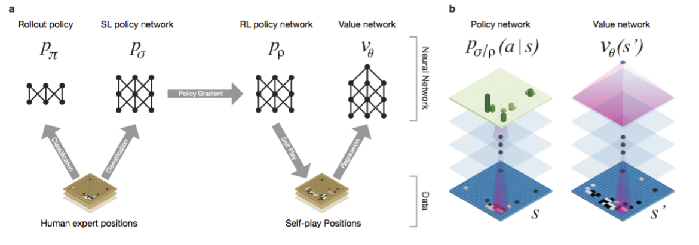
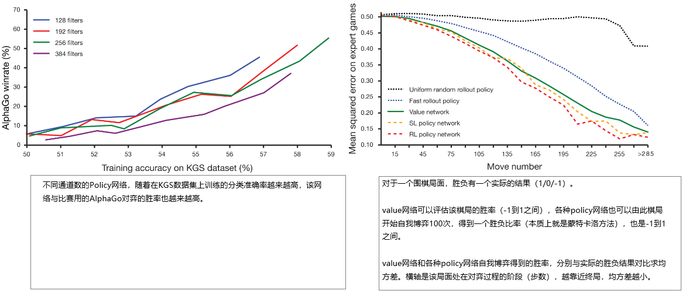
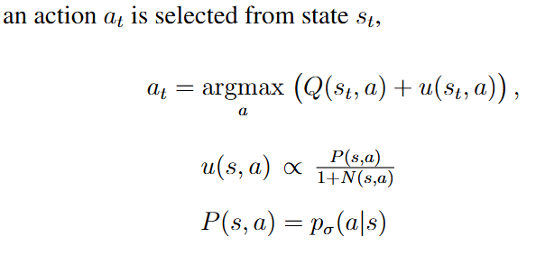
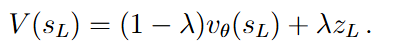
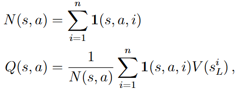
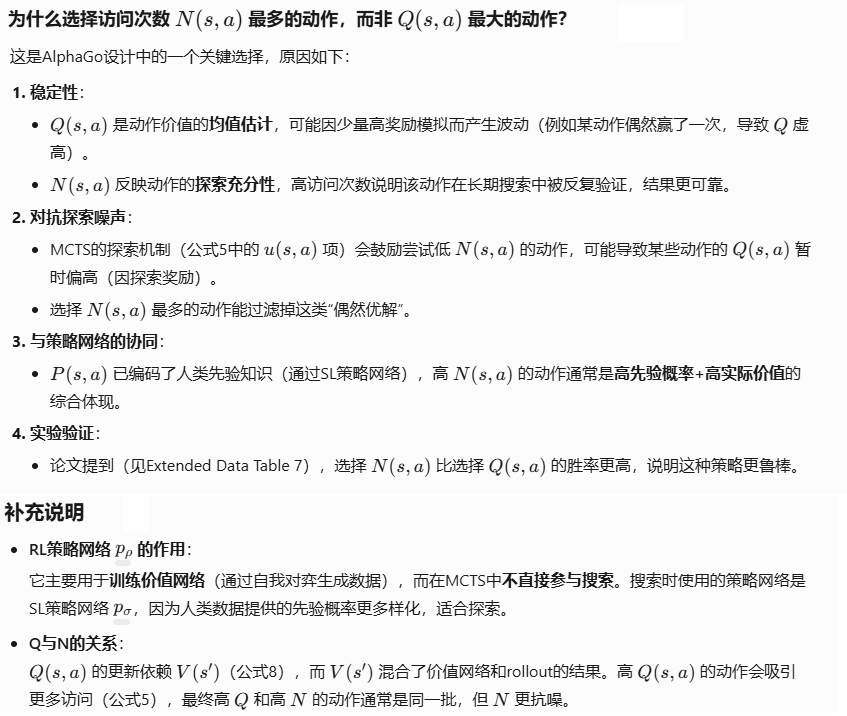
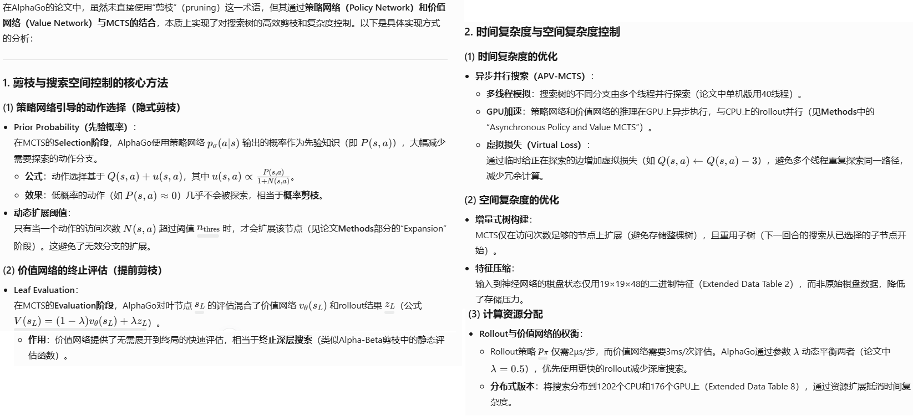
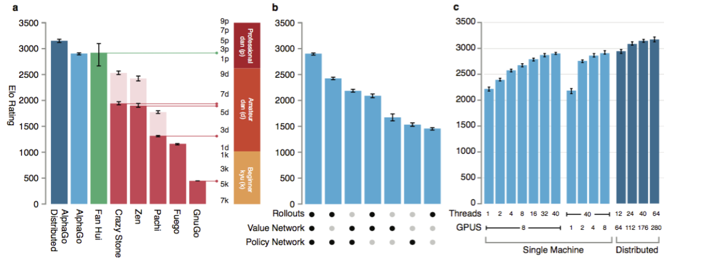
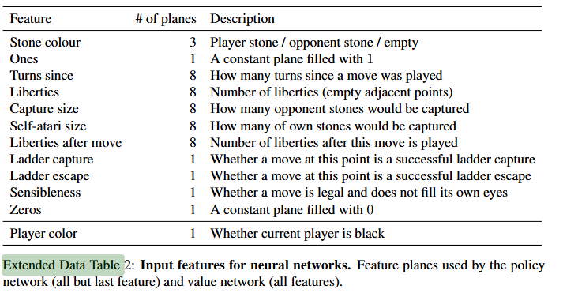

**Mastering the Game of Go with Deep Neural Networks and Tree Search**

### 概述

1. 由于其巨大的搜索空间和棋局/棋着的判断难度，围棋一直以来被视作人工智能最具挑战的任务。
2. 我们创新性的把神经网络、监督学习、强化学习、蒙特卡洛树搜索结合在一起，打败了最先进的围棋程序和人类围棋大师。
3. 我的的方法主要构成有：
   1. 使用value网络对MCTS的深度做剪枝（更深的棋局的价值用v(s)函数评估），使用policy网络对MCTS的广度做剪枝（回报不高的动作不展开）
   2. 先使用人类大师的棋谱，有监督的训练Policy网络pσ，让他跟随人类大师学习下一棋着的预测（典型的分类问题）。并且训练一个policy网络pπ用于后续RL中与环境交互。
   3. 在上一步的基础上，再使用RL的self-play（自我博弈）的方式，训练出policy网络pρ，让其目的更着眼于最后的赢，而不是每一步的预测更符合人类大师的动作
   4. 最后，训练value网络vθ ，用于评估self-play过程中的棋局。
4. 我们的程序AlphaGo有效的组合了上述策略网络、价值网络和蒙特卡洛树搜索

### 监督学习训练策略网络

输入为一个 19×19×48 的图像张量，。

第一层使用了 `5×5` 的卷积核，其余为 `3×3`。

网络总共有 13 层卷积层（用于监督学习的 policy 网络），每一层后跟随一个 ReLU 激活函数。

最后一层使用一个 `1×1` 卷积核，然后接 softmax 输出分类的概率

如上图a：

1. 使用人类大师的棋谱训练Rollout Policy（用于RL中与环境交互）和SL policy
2. SL Policy用于MCTS算法中expand node时只扩展动作概率大的分支，且作为后面RL训练环节的基础
3. Rollout Policy用于MCTS算法中模拟快速对局，因为是用于（实时）决策时规划，推理要快。
4. RL policy network拷贝SL policy network的参数后，继续用RL 自我博弈的方式训练对最后赢的目标的关注

如上图b所示的语义表示结构：

1. 用很多卷积层，每一层的宽高不变，到最上层policy网络对19x19棋盘中的可落子位置做softmax求概率，value网络则是输出一个价值标量，他们不共用卷积层参数

| 网络名称               | 用途                                                | 特点                                                         | 训练方法                                                     |
| ---------------------- | --------------------------------------------------- | ------------------------------------------------------------ | ------------------------------------------------------------ |
| **pσ（SL Policy）**    | 预测人类专家的落子，用来初始化pρ                    | 13层卷积神经网络；输出每个合法落子的概率分布；以专家棋局为训练集 | **监督学习**：最大化专家落子概率对数似然；从KGS服务器采样3000万局面；使用SGD训练 |
| **pπ（Fast Rollout）** | 快速采样落子以用于MCTS中推演                        | 使用简单局部模式特征的线性Softmax策略；极快（2µs/次），但准确率低（24.2%） | **监督学习**：基于模式特征，使用线性Softmax训练；目标是提高MCTS中rollout速度 |
| **pρ（RL Policy）**    | 通过自我博弈产生数据，优化价值网络V、MCTS中扩展节点 | 网络结构与pσ相同；在pσ基础上初始化，并通过优化最终胜负而非专家动作 | **强化学习**：使用策略梯度（Policy Gradient）从自我博弈中学习，最大化胜率 |
| **vθ（Value Net）**    | MCTS中估计当前位置的胜率                            | 卷积网络输出单一标量（胜率）；评估来自RL策略下自我博弈产生的局面 | **回归训练**：以自我博弈产生的局面与结果对为数据，最小化预测值与真实胜负的均方误差（MSE） |

### 策略网络的强化学习

训练：

1. 使用训练好的SL policy初始化 RL policy
2. 自博弈，对手来自随机从RL policy的历史版本中选取
3. Reward在博弈过程中都是0，终局胜负得1/-1
4. 随机梯度上升，最大化期望回报

评估：

1. 对RL policy对SL policy，胜率80%
2. 完全不使用前瞻搜索，对Pachi 85%得胜率（Pachi是蒙特卡洛树搜索法实现得Go程序，每一步都进行10万次推演）

### 价值网络的强化学习

价值网络对一个局面判断胜负，输出一个标量。

训练：

1. 使用梯度下降回归拟合棋局的实际结果z（-1/0/1）
2. 使用完整棋局的连续局面进行训练，会导致过拟合（Test MSE 0.37 vs Train MSE 0.19）。我们用30万个完全不同的来自 不同自博弈的棋局的局面数据训练，这些自博弈是由RL Policy网络完成的，缓解了过拟合的问题（0.226 vs 0.234）

评估：

见上图右侧的均方差曲线

### 使用策略网络和价值网络进行MCTS

bison: 前面都是说训练，现在要说如何下棋了。

AlphaGo使用MCTS进行前瞻性搜索。树的每条边存储Q(s, a) 、访问次数 N(s, a)、优先级概率 P(s, a)（就是策略网络输出的动作概率）。

【step1】：

每次落子前先进行推演，推演的时候需要从当前局面对应的节点作为根节点开始搜索这棵树，每一步都根据下面公式选择动作：

上面公式里的u:

1. 与优先级概率成正比例
2. 随着访问次数的增大，减少u，鼓励探索

【step2】：

当树推演到达叶子节点后，用两个不同的方法评估叶子节点（并非终局，而是没有expand的节点）的价值并加权求和：

1. 使用价值网络进行评估
2. 使用**pπ（Fast Rollout）**策略从该节点的局面开始，进行一次快速的自博弈，分出胜负，得到一个价值z

【step3】：

叶子节点也可能被展开（expand）,根据**pρ（RL Policy）**来决定新生成的子节点的优先级概率P(s, a)。

Q(s,a)则是跟踪记录 r + V(s')的期望。见下一步的更新公式里的Q。

【step4】：

如此进行n次推演后，对涉及到的边更新它的Q和N：

【step5】：选择根节点下访问最多的action作为真正落子的选择。（bison: 为什么是访问最多的，不应该是Q+u最大的吗？）

引入了策略网络和价值网络的MCTS比传统的启发式搜索高好几个量级的计算量，AlphaGo使用多线程和分布式多机技术进行推演，充分利用多cpu和多GPU。

### AlphaGo的能力评估

如上图：

1. a：与各种开源或者商业的Go计算机程序还有人类2段棋手樊辉对弈，胜出
2. b：Rollouts/价值网络/策略网络是否在MCTS中采用对能力的影响
3. c：并行度对能力的影响

### 讨论

与国际象棋程序深蓝对比：

1. 依托于价值网络和策略网络的更准确的判断，AlphaGo比深蓝的推演要少
2. 深蓝依赖的是手工开发的评估函数，类似启发式的规划算法，依赖领域专家经验的启发函数；而AlphaGo是使用通过监督学习和强化学习训练的深度网络

围棋是一个典型的人工智能难题：

1. 棘手的搜索空间
2. 无法直接用深度神经网络等近似函数拟合的最优解决方案

MCTS则是一个很强的的算法，在很多领域有突破性的进展：

1. 游戏
2. 经典规划问题
3. 部分可见的规划问题
4. 受约束的满足问题

通过把深度神经网络和MCTS结合起来，AlphaGo终于达到了专业棋手的水平，也为其他类似棘手的人工智能领域难题实现人类水平的智能带来了希望。

### 工程细节方法

其他略，专门贴一下输入的每个通道分别表示什么：

AI帮我翻译如下，我不会下围棋，不确定是否都正确：

|       **特征名称**       | **通道数** |                         **详细描述**                         |
| :----------------------: | :--------: | :----------------------------------------------------------: |
|     **Stone color**      |     3      |     当前玩家的棋子（黑/白）、对手的棋子、空点（无子）。      |
|         **Ones**         |     1      |               全1的常数平面（用于网络偏置）。                |
|     **Turns since**      |     8      | 某位置最近一次落子的回合数（分8档，如1步前、2步前…≥8步前）。 |
|      **Liberties**       |     8      |     棋子串的“气”（相邻空点数），分8档（1气、2气…≥8气）。     |
|     **Capture size**     |     8      |             落子后能提掉的对手棋子数（分8档）。              |
|   **Self-atari size**    |     8      |            落子后自己棋子被提掉的数量（分8档）。             |
| **Liberties after move** |     8      |               落子后该位置的“气”数（分8档）。                |
|    **Ladder capture**    |     1      |             落子是否能形成“征子”吃棋（是/否）。              |
|    **Ladder escape**     |     1      |               落子是否能逃脱“征子”（是/否）。                |
|     **Sensibleness**     |     1      |            落子是否合法且不填自己的眼（是/否）。             |
|        **Zeros**         |     1      |               全0的常数平面（辅助网络结构）。                |
|     **Player color**     |     1      |            当前玩家是否为黑棋（仅用于价值网络）。            |

其中全1全0的通道的意义，我想不明白，问了AI我也看不懂解答，可能和围棋本身业务相关。