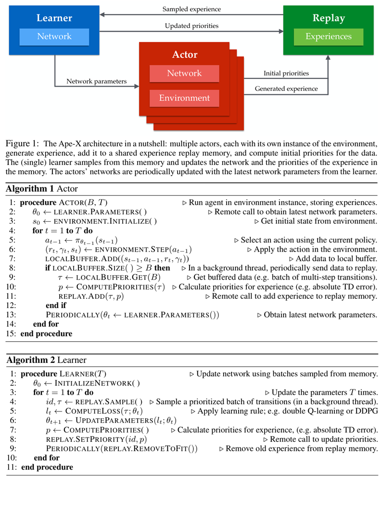

**DISTRIBUTED PRIORITIZED EXPERIENCE REPLAY**

ICLR‘2018  google

## 0. 一句话总结

Ape-X 将“与环境交互（acting）”和“参数学习（learning）”解耦：大量 Actor 并行产生经验，统一写入共享的集中式优先级回放池；单个 GPU Learner 按 TD 误差等优先级反复抽取最有价值的经验并更新网络。它的核心收益来自更多、更丰富的经验和更有效的数据选择，而不仅是更快地计算梯度。

## 1. 摘要（Abstract）

- 目标：让智能体能够利用比以往多几个数量级的数据进行有效学习。
- 架构：Actor 在各自环境实例中按共享网络选动作，将轨迹写入共享经验回放；Learner 从回放中采样并更新网络。
- 关键机制：优先级经验回放（Prioritized Experience Replay, PER），集中学习最重要的数据。
- 结果：在 Arcade Learning Environment（Atari）上达到新的状态最好性能，并以更短的墙钟时间取得更高最终分数。

## 2. 引言（Introduction）

### 2.1 研究动机

- 深度学习通常受益于更多计算、更强模型和更大数据集；深度强化学习也应遵循这一规律。
- 过去的分布式强化学习（如 Gorila、A3C）主要并行化梯度更新或参数更新；论文转而关注**并行生成和筛选经验数据**。
- 高亮重点：论文强调，单独分布式经验生成与选择就足以改善结果；它与分布式梯度计算互补，二者可组合，但本文只研究前者。

### 2.2 贡献与评估

- 将 PER 扩展到分布式场景，提出 Ape-X（Distributed Prioritized Experience Replay）。
- 将框架用于 DQN 和 DDPG/DPG，并在 Atari 与连续控制任务中验证。
- 系统研究 Actor 数量、回放容量、经验新鲜度和不同数据生成策略的影响。

## 3. 背景（Background）

### 3.1 分布式随机梯度下降

- 在监督学习中，多个 Worker 并行计算梯度，可同步或异步更新参数。
- Nair 等将异步参数更新与分布式数据生成用于深度强化学习；A3C、GA3C、PAAC 等也利用并行交互提高吞吐。
- Ape-X 的区别：不把重点放在并行梯度，而是把计算资源投入到经验生成，并由 Learner 集中利用这些经验。

### 3.2 分布式重要性采样

- 非均匀采样并按采样概率加权，可降低梯度方差、加速收敛。
- 典型做法是按样本对应梯度的 L2 范数采样，或按最近损失值排序后采样。
- PER 属于更一般的有偏采样：优先选择“出乎意料”或当前学习价值高的经验。

### 3.3 优先级经验回放（PER）

- 经验回放可提高数据利用率，并让智能体从旧策略生成的数据中学习，减少过拟合。
- PER 用 TD 误差等信号衡量经验重要性；强化学习中奖励稀疏、数据分布随策略变化，因此有偏采样尤其有用。
- 高亮重点：PER 已被用于 Prioritized Dueling DQN、UNREAL、DQfD、Rainbow 等多种算法；Rainbow 的消融实验显示，**优先级机制是最重要的性能组成之一**。

## 4. Ape-X 总体贡献与架构（Section 3）

### 4.1 系统组成

```text
多个 Actor + 各自环境
        | 经验与初始优先级
        v
共享集中式 Replay Memory <---- Learner 更新后的优先级
        | 按优先级采样
        v
单个 GPU Learner 更新网络参数
        | 周期性同步参数
        v
各 Actor 的本地策略副本
```

- Acting：Actor 获取最新参数，在环境中执行策略，收集转移/多步转移，并计算初始优先级后批量写入回放。
- Learning：Learner 从共享回放池优先采样，计算损失、更新参数，再把新 TD 误差写回对应样本的优先级。
- Actor 的参数只周期性更新，不与 Learner 做高层同步，因此二者可以异步运行。
- 实验中使用数百个 CPU Actor 和一个 GPU Learner。



### 4.2 与 Gorila/Prioritized DQN 的关键差异

- **共享集中式回放**：任一 Actor 发现的高优先级数据都能被整个系统利用。
- **在线计算初始优先级**：传统 Prioritized DQN 将新样本优先级设为当前最大值，Actor 多时会造成 Learner 只盯着最新数据。Ape-X 让 Actor 在已有策略评估计算上顺便计算 TD 误差，样本进入回放时就具有更准确的优先级。
- **通信可批量化、允许延迟**：经验比梯度更不易快速过时；只要学习算法能处理离策略数据，Actor 与 Learner 甚至可位于不同数据中心。
- **异质探索策略**：不同 Actor 使用不同探索强度，联合经验覆盖更广的行为分布。
- 高亮重点：低 epsilon 策略有机会在环境中探索得更深；高 epsilon 策略可防止过度专门化。多策略经验由 PER 筛选，能帮助解决困难探索问题。
- 高亮重点：相比共享梯度，共享经验对低延迟通信要求更低；代价是经验传输/回放存在一定延迟。

### 4.3 Actor / Learner 伪代码要点

**Actor：**

1. 从 Learner 拉取网络参数并初始化环境。
2. 按当前策略执行动作，将 `(state, action, reward, discount)` 放入本地缓冲区。
3. 缓冲区达到批量大小后，计算每条经验的初始优先级（例如绝对 TD 误差），批量发送给 Replay。
4. 周期性刷新网络参数。

**Learner：**

1. 从 Replay 按优先级采样一批转移。
2. 用 Double Q-learning、DDPG 等规则计算损失并更新网络。
3. 重新计算这些样本的优先级并回写。
4. 定期清理超过容量的旧经验。

## 5. Ape-X DQN（Section 3.1）

### 5.1 使用的 DQN 组件

- Double Q-learning：降低 Q 值过估计。
- 多步 bootstrap target：结合 n 步回报和目标网络，提高信用分配速度。
- Dueling network：将状态价值与动作优势分开建模。
- 这是一个吸收 Rainbow 部分组件的 DQN 变体，并非完整 Rainbow。

### 5.2 损失与目标

对回放中的样本，损失为：

`L_t(theta) = 1/2 * (G_t - q(S_t, A_t, theta))^2`

其中 n 步 Double-Q 目标为：

`G_t = R_{t+1} + gamma R_{t+2} + ... + gamma^(n-1) R_{t+n} + gamma^n q(S_{t+n}, argmax_a q(S_{t+n}, a, theta), theta-)`

- `theta-` 是缓慢更新的目标网络参数。
- 若回合在 n 步前结束，则截断多步回报。

### 5.3 行为策略与探索

- 虽然 Q-learning 理论上是离策略的，但行为策略仍会影响探索和函数逼近质量。
- Ape-X DQN 的每个 Actor 使用不同 epsilon 的 epsilon-greedy 策略；epsilon 在训练期间固定。
- 多步回报未使用离策略修正，因此行为策略多样性与 PER 的筛选作用尤其重要。

## 6. Ape-X DPG（Section 3.2）

### 6.1 结构

- Actor 使用显式策略网络 `pi(s, phi)`，Critic 使用 Q 网络 `q(s, a, psi)`。
- 两个网络在 Learner 上用不同损失分别优化；Actor 仍由大量环境 Actor 并行采样数据。

### 6.2 Critic 更新

`L_t(psi) = 1/2 * (G_t - q(S_t, A_t, psi))^2`

`G_t = R_{t+1} + ... + gamma^(n-1) R_{t+n} + gamma^n q(S_{t+n}, pi(S_{t+n}, phi-), psi-)`

- 使用多步 TD 目标；`phi-`、`psi-` 分别为目标 Actor/Critic 参数。

### 6.3 Actor 更新

- 策略网络输出连续动作 `A_t = pi(S_t, phi)`。
- 采用确定性策略梯度上升：最大化 `q(S_t, pi(S_t, phi), psi)`，梯度通过动作输入传回策略网络。
- 论文用 DeepMind Control Suite 的连续控制任务验证框架通用性。

## 7. 实验（Section 4）

### 7.1 Atari 实验设置与结果

- 360 个 Actor，每个约 139 FPS，总计约 50K FPS（动作重复 4 次后约 12.5K transitions/s）。
- Actor 本地最多缓存 100 条转移，以批量 B=50 异步写入 Replay。
- Learner 预取最多 16 个 batch，每秒处理约 19 个 batch，每批 512 条，约 9.7K transitions/s。
- 回放容量软上限 2M transitions；每 100 个学习步骤按 FIFO 批量移除超限数据。
- 按比例 PER：优先级指数 `alpha=0.6`，重要性采样指数 `beta=0.4`。
- Actor 每 400 帧（约 2.8 秒）同步一次参数；epsilon 从 0.4 到接近 0 的范围按幂函数分布，形成不同探索强度。
- 使用 PNG 压缩观测，降低网络和内存开销。

**主要结果：**

| 方法            | 训练时间 | Atari 57 游戏中位人类归一化分数（no-op） |
| --------------- | -------: | ---------------------------------------: |
| Ape-X DQN       |     5 天 |                                     434% |
| Rainbow         |    10 天 |                                     223% |
| C51             |    10 天 |                                     178% |
| Prioritized DQN |   9.5 天 |                                     172% |
| DQN             |   9.5 天 |                                      79% |

- Ape-X DQN 在 no-op starts 和更具挑战性的 human starts 两种评估下均优于表中基线；对应中位分数为 434% 和 358%。
- 高亮重点：Ape-X 不仅训练更快，最终性能也显著更高；优势不能简单归因于“使用了更多计算”。

### 7.2 连续控制实验

- 任务：Manipulator（Bring Ball）以及 Humanoid 的 Stand、Walk、Run。
- 64 个 Actor 约产生 14K FPS；Learner 每秒处理约 86 个 256 样本 batch（约 22K transitions/s）。
- 随 Actor 数增加，学习更快、更稳定；在不到标准 DDPG 训练时间十分之一的情况下超过其最好表现。
- 说明 Ape-X 不依赖离散动作或像素输入，能够迁移到连续动作策略梯度方法。

## 8. 分析（Section 5）

### 8.1 Actor 数量的可扩展性

- 在固定回放容量和固定 Learner 更新速率下，将 Actor 从 8 增加到 256，性能持续提升。
- 解释：大量不同探索策略提高发现新行为的概率；PER 随后把高价值经验集中用于学习。
- 这表明收益来自数据质量、覆盖度和选择机制，而非改变网络结构或更新规则。

### 8.2 回放容量

- 在 256 Actor 设置下，较大的回放容量通常带来小幅但稳定的收益。
- 可能原因：高优先级经验能在回放中保留更久并被多次重放。
- 容量过小可能导致训练不稳定或发散（论文在部分设置中观察到）。

### 8.3 新鲜度（Recency）与多样性（Diversity）

- Actor 越多，在固定容量下回放内容更新越快，经验更接近当前策略，可能看起来更“on-policy”。
- 对照实验用 32 Actor 将每条转移复制 8 次，使经验新鲜度接近 256 Actor，但性能没有复现 256 Actor 的结果。
- 结论：新鲜度本身不足以解释性能；重复数据会牺牲多样性，甚至伤害性能。
- 因此，性能提升主要来自更多真实交互带来的探索覆盖和多样性，并辅以 PER 的聚焦学习。

### 8.4 数据生成策略的多样性

- 比较“完整 epsilon 范围”和“仅 6 个固定 epsilon 值”。完整范围整体略好，但固定集合仍能取得良好结果。
- 结论：异质行为策略有帮助，但不是 Ape-X 成功的唯一必要条件；核心仍是大规模数据生成与优先选择。

### 8.5 PER 对扩展性的作用

- 优先回放和均匀回放都能从更多 Actor 中获益，但 PER 更能利用新增数据；256 Actor 时，PER 在 9 个游戏中的 7 个不差于或优于均匀回放。
- 高亮重点：共享优先级使任一 Actor 发现的关键经验都可被全局 Learner 使用，这是分布式 PER 的核心协同效应。

## 9. 结论与适用范围（Section 6）

- Ape-X 在离散和连续任务上同时提升墙钟学习速度与最终性能，证明了分布式优先回放框架的实用性。
- 可与任意离策略强化学习更新结合；若算法处理时间扩展序列，可把优先级单位从单条转移改为整段序列。
- 适用场景：可并行生成大量数据的模拟环境，以及机器人群、自驾车、多用户推荐等多实例环境。
- 不适用或收益有限的场景：经验采集成本极高、无法并行产生大量数据的任务。
- 论文观点：在强函数逼近器下，过拟合是重要问题；增加训练数据是直接的缓解办法，也可能启发更高数据效率的方法。
- 探索启示：Ape-X 用“生成多样经验 + 识别并学习重要事件”的简单机制缓解大规模环境探索困难，说明直接的探索策略也可能有效。
- 高亮重点：框架对使用长时序经验的方法仍可扩展，关键是对序列而不是单个 transition 进行优先级管理；大量并行数据生成是 Ape-X 成立的前提。

## 10. 附录中的复现与实现要点

### 10.1 Atari 预处理与训练

- 灰度化、帧堆叠、动作重复 4 次、奖励裁剪到 `[-1, 1]`。
- 回放积累至少 50,000 条转移后才开始学习。
- Centered RMSProp，学习率 `0.00025/4`，衰减 `0.95`，epsilon `1.5e-7`，梯度范数裁剪到 40。
- 多步长度 `n=3`；目标网络每 2,500 个训练 batch 更新一次。

### 10.2 连续控制实现

- Critic 网络：400 单元层 + tanh + 300 单元层。
- Actor 网络：300 单元层 + tanh + 200 单元层。
- Adam 学习率 `1e-4`；Actor 梯度逐元素裁剪到 `[-1,1]`；目标网络每 100 个 batch 更新。
- 采样优先级为绝对 TD 误差，比例采样指数 `alpha_sample=0.6`；容量固定为 `10^6`，淘汰采用另一个比例优先级指数 `alpha_evict=0.4`。
- 探索噪声为标准差 `sigma=0.3` 的高斯噪声，评估时使用无噪声确定性策略。

### 10.3 优先采样公式与工程实现

- 转移 k 的采样概率：`P(k) = p_k^alpha / sum_j p_j^alpha`；`alpha=0` 时退化为均匀采样。
- 比例 PER 通常取 `p_k = |delta_k|`，其中 `delta_k` 是 TD 误差。
- Replay 是分布式内存键值存储，使用高效批量读写和优先级分布维护。
- Actor 用本地循环缓冲区构造 n 步转移，在本地队列积累后批量发送，降低网络请求数。
- 共享服务的主要瓶颈是 CPU；增大请求/响应批量可缓解竞争。还需关注网络带宽和锁。
- 评估异步系统时，必须同时报告环境交互速度、Learner 更新速度和总数据量；仅比较其中一个指标会误导。
- 故障容忍：Actor 中断只会暂时降低数据进入速率；Replay 中断后数据可丢弃并由 Actor 快速重填，Learner 应等待最小数据量后再恢复；Learner 中断会使训练停滞。

## 11. 黄底重点汇总（按论文标注归纳）

1. **分布式的对象是经验数据，而非梯度**：并行生成和优先选择经验本身即可改善结果，且可与梯度并行互补。
2. **Ape-X 将 PER 扩展到分布式设置**：大量 Actor + 单个 Learner + 共享集中式回放，是高可扩展性的基本架构。
3. **优先级是 Rainbow 等系统中最关键的成分之一**：它让学习集中在最“惊讶”、最有信息量的经验上。
4. **集中式共享优先级带来全局协同**：任何 Actor 发现的高价值数据都能服务于整个 Learner。
5. **经验通信允许较高延迟**：经验比梯度更耐过时，批量通信可提升吞吐，甚至支持跨数据中心部署。
6. **异质 epsilon 策略扩大探索覆盖**：低 epsilon 深入探索，高 epsilon 防止策略过度专门化。
7. **性能提升不是新鲜度单独造成的**：复制旧数据虽提高 recency，却损害 diversity；真实并行交互产生的多样性不可替代。
8. **Ape-X 的泛化性**：不仅适用于 DQN/DPG，也可与其他离策略更新或按序列优先的算法组合。
9. **前提条件**：必须能够并行地产生大量数据；在数据昂贵且难以扩展的任务上不一定适用。

## 12. 个人理解与可迁移启示

- Ape-X 的“算法增益”可以拆成三部分：数据吞吐（更多样本）、行为多样性（更广探索）、数据选择（PER 聚焦）。三者缺一可能都会削弱效果。
- 在实现上，Actor 端提前计算初始优先级是关键细节，它避免了新样本统一使用最大优先级造成的“只学最新数据”偏置。
- 经验回放容量需要与数据生成速率、Learner 消费速率共同设计；固定容量下增加 Actor 会加快样本淘汰，因此应同时做容量和新鲜度分析。
- 评估分布式强化学习系统时，应同时记录 wall-clock time、环境 frames、Learner 更新数和吞吐，不能只报告“训练了多少帧”。

## 13. 术语速查

| 术语            | 含义                                        |
| --------------- | ------------------------------------------- |
| Actor           | 与环境交互、生成经验的工作进程/机器         |
| Learner         | 从回放采样并更新网络参数的学习进程          |
| Replay Memory   | 存储历史转移并供重复采样的经验池            |
| PER             | 按 TD 误差等优先级非均匀采样的经验回放      |
| TD error        | 当前估计与 bootstrap 目标之间的时间差分误差 |
| off-policy      | 行为策略与学习目标策略可以不同              |
| wall-clock time | 现实经过时间，用于衡量分布式训练速度        |

## 14. 参考文献（笔记中涉及的核心工作）

- Horgan et al.，*Distributed Prioritized Experience Replay*，ICLR 2018。
- Schaul et al.，*Prioritized Experience Replay*，ICLR 2016。
- Mnih et al.，*Human-level control through deep reinforcement learning*，Nature 2015。
- Hessel et al.，*Rainbow: Combining Improvements in Deep Reinforcement Learning*，2017。
- Lillicrap et al.，*Continuous control with deep reinforcement learning*，2016。