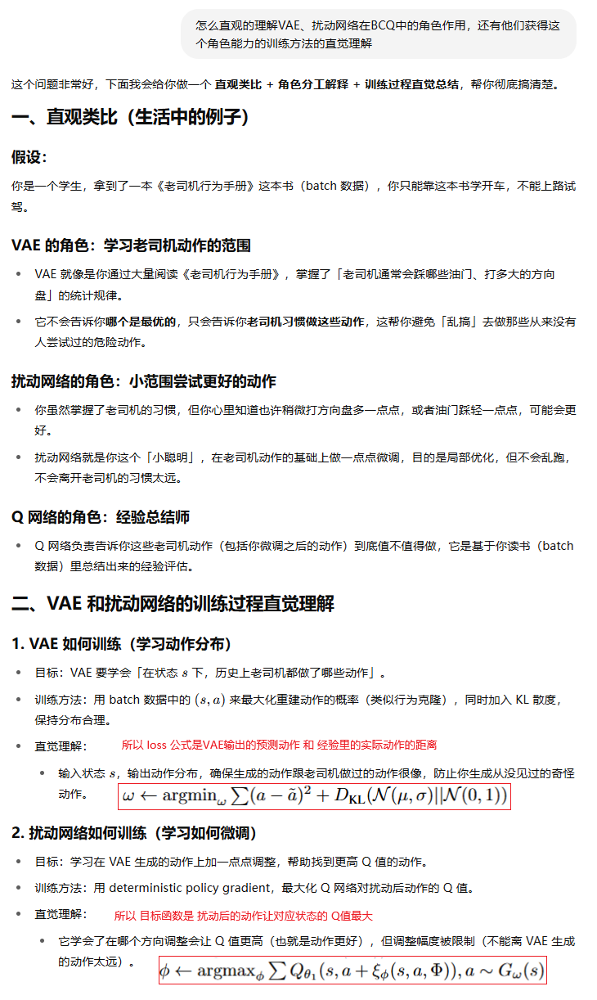
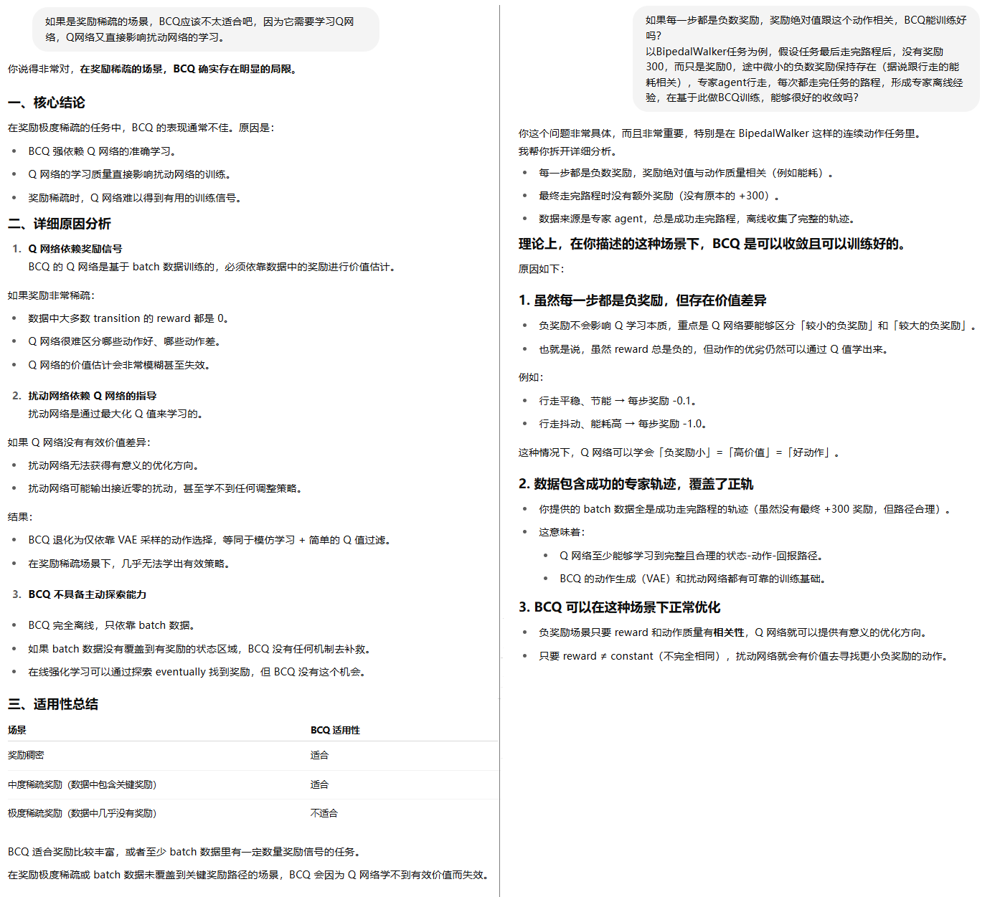
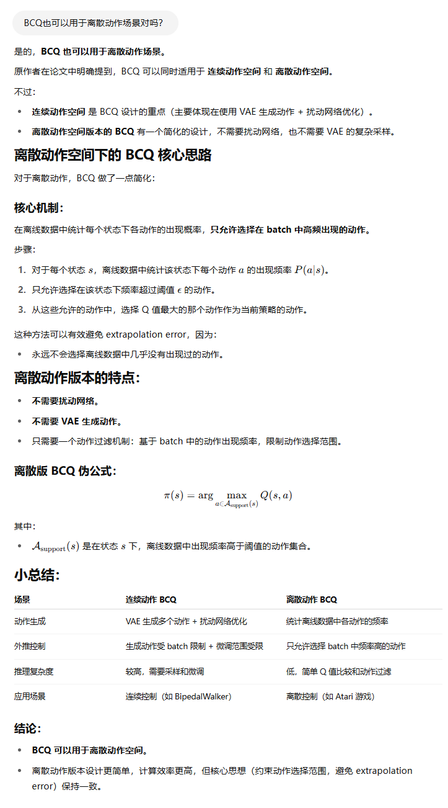
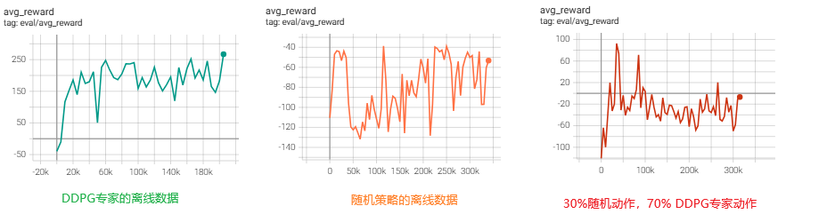

**Off-Policy Deep Reinforcement Learning without Exploration**

### 1、Introduction

作者表达能力还是比较臭的（可能论文比较久远了），几经和AI讨论，终于搞明白了：

1. off-policy算法，在线场景下（online RL），由于持续和环境交互，数据分布不断刷新，策略会探索，Replay Buffer 会动态包含新策略的数据，即使用了历史数据，Replay Buffer 总有数据来自当前策略附近，Q 网络更新的动作-状态分布不会漂太远。
2. 但off-policy 算法，在离线场景下（offline RL），如果只使用历史数据（离线场景可不就只能使用历史数据嘛），即只有一个固定数据集，不能再交互，容易产生外推错误（extrapolation error），Q 网络会给出完全不可信的估计（因为 Q 网络本质是函数拟合，评估的（s，a）在训练数据集从没有出现过，只能“插值”估计），不能收敛。不比在线场景，环境反馈告诉你 在该状态下执行某个动作 其实价值很差 ， Q 函数会修正

我们提出了一种新的 off-policy 强化学习的离线RL算法，称为 **batch-constrained reinforcement learning（批约束强化学习）**，它通过限制动作空间，强制 agent 行为尽量接近批数据中的行为。

我们提出了第一个可以在连续动作空间、任意离线数据集上有效学习的深度强化学习算法，并在多个任务中验证了它的效果。

我看官方的开源实现也提供了离散动作空间的版本。


Extrapolation error, a phenomenon in which unseen state-action pairs are erroneously estimated to have unrealistic values. Extrapolation error can be attributed to a mismatch in the distribution of data induced by the policy and the distribution of data contained in the batch. As a result, it may be impossible to learn a value function for a policy which selects actions not contained in the batch.

Batch-Constrained deep Q-learning (BCQ), uses a state-conditioned generative model to produce only previously seen action.

This generative model is combined with a Q-network, to select the highest valued action which is similar to the data in the batch.

AI：BCQ 不是只允许数据集里完全出现过的 (s, a) pair，而是通过 VAE 学习生成 **在当前状态下、历史数据中可能的动作分布。**

### 2、Background

介绍了RL、贝尔曼方程、Actor-Critic方法

### 3、Extrapolation Error


### 4、Batch-Constrained Reinforcement Learning

We propose a conceptually simple idea: to avoid extrapolation error a policy should induce a similar state-action visitation to the batch. We denote policies which satisfy this notion as batch-constrained. 

#### 4.1  Addressing Extrapolation Error in Finite MDPs


#### 4.2. Batch-Constrained Deep Reinforcement Learning


##### 推理的时候怎么使用agent

1. VAE对状态s采样n次动作
2. 扰动网络（actor）对每个采样得到的动作施加扰动，得到扰动后的动作actions
3. Q网络对（state，actions）评估价值，取价值最大的动作

代码如下：

```python
def select_action(self, state):
    with torch.no_grad():
        state = torch.FloatTensor(state.reshape(1, -1)).repeat(100, 1).to(self.device)
        action = self.actor(state, self.vae.decode(state))
        q1 = self.critic.q1(state, action)
        ind = q1.argmax(0)
    return action[ind].cpu().data.numpy().flatten()
```

##### 怎么理解VAE和扰动网络



##### 能用于奖励稀疏的场景吗？

即使有高质量的专家数据，BCQ也不能用于奖励稀疏的任务，它需要使用专家数据里的奖励来训练Q网络。



##### 能用于离散动作场景

官方的离散动作场景的实现：

```
https://github.com/sfujim/BCQ/blob/master/discrete_BCQ/discrete_BCQ.py
```




### 5、Experiments


上图中的Final buffer / Concurent / Imitation / Imperfect demon是四种不同的离线数据收集方式，细节有点多，不摘录。

可以看到BCQ在其中三种超越其他几个算法的性能。

其中一组离线数据质量很差，但BCQ也有不错的回报：


### 6、Related Work

### 7、Conclusion

### 8、bison的实验

BCQ实现还是比较麻烦的，我准备先用开源的实现搞一波

```shell
https://github.com/sfujim/BCQ

https://d3rlpy.readthedocs.io/en/v2.8.1/references/algos.html#bcq

https://github.com/tinkoff-ai/CORL #这里没有实现BCQ，但有其他较多offline RL算法的实现
```

#### BipedalWalker

分别使用专家(sb3提供的预训练的DDPG)的经验数据和随机action的经验数据 学习：



可以看到，对于高质量的专家离线数据，BCQ学习得不错，不过距离专家的水平有一定的差距（专家通常回合奖励累计280左右）

代码如下，来自论文作者，我改改后适配我的理解和任务：

```python
import datetime

from stable_baselines3 import DDPG
from huggingface_hub import hf_hub_download
import gymnasium as gym
import torch
import torch.nn as nn
import torch.optim as optim
import numpy as np
from typing import Callable, List
from torch.utils.tensorboard import SummaryWriter
import argparse
import os
import BCQ
import utils
from utils import BCQReplayBuffer

writer = SummaryWriter(log_dir=f'logs/BCQ_BipedalWalker_{datetime.datetime.now().strftime("%m%d_%H%M%S")}')
DEVICE = 'cuda:0' if torch.cuda.is_available() else 'cpu'

class Config:
    max_iteration = 30
    max_experience_len = 100_000
    state_dim = 24
    action_dim = 4
    max_action = 1
    experience_filename = './rl-trained-agents/expert_experience_BipedalWalker.pth'

def interact_with_environment():
    env = gym.make("BipedalWalker-v3", render_mode=None)
    # 加载模型
    model = DDPG.load('./rl-trained-agents/ddpg/BipedalWalker-v3_1/BipedalWalker-v3.zip')

    buffer = BCQReplayBuffer(Config.state_dim, Config.action_dim, DEVICE, Config.max_experience_len)

    while len(buffer) < Config.max_experience_len:
        obs, _ = env.reset()
        done = False

        while not done:
            action,_ = model.predict(obs, deterministic=True)
            next_obs, r, term, trunc, info = env.step(action)
            done = term or trunc

            buffer.add(obs, action, next_obs, r, done)

            obs = next_obs
        print(f"buffer len:{len(buffer)}")
    env.close()
    torch.save(buffer, Config.experience_filename)
    return buffer

# Trains BCQ offline
def train_BCQ(state_dim, action_dim, max_action, device, args):
    # For saving files
    setting = f"{args.env}_{args.seed}"
    buffer_name = f"{args.buffer_name}_{setting}"

    # Initialize policy
    policy = BCQ.BCQ(state_dim, action_dim, max_action, device, args.discount, args.tau, args.lmbda, args.phi,writer)

    # Load buffer
    replay_buffer = torch.load(Config.experience_filename, weights_only=False)


    episode_num = 0
    done = True
    training_iters = 0

    while training_iters < args.max_timesteps:
        pol_vals = policy.train(replay_buffer, iterations=int(args.eval_freq), batch_size=args.batch_size)

        eval_policy(policy, args.env, args.seed, training_iters)

        training_iters += args.eval_freq
        print(f"Training iterations: {training_iters}")


# Runs policy for X episodes and returns average reward
# A fixed seed is used for the eval environment
def eval_policy(policy, env_name, seed, it, eval_episodes=10):
    eval_env = gym.make(env_name)
    #eval_env.reset(seed=seed + 100)

    avg_reward = 0.
    for _ in range(eval_episodes):
        state, _ = eval_env.reset(seed=seed + 100)
        done = False
        while not done:
            action = policy.select_action(np.array(state))
            state, reward, term, trunc, _ = eval_env.step(action)
            done = term or trunc
            avg_reward += reward

    avg_reward /= eval_episodes
    eval_env.close()

    print("---------------------------------------")
    print(f"Evaluation over {eval_episodes} episodes: {avg_reward:.3f}")
    print("---------------------------------------")
    writer.add_scalar('eval/avg_reward', avg_reward, it )
    return avg_reward


if __name__ == "__main__":

    parser = argparse.ArgumentParser()
    parser.add_argument("--env", default="BipedalWalker-v3")  # OpenAI gym environment name
    parser.add_argument("--seed", default=0, type=int)  # Sets Gym, PyTorch and Numpy seeds
    parser.add_argument("--buffer_name", default="Robust")  # Prepends name to filename
    parser.add_argument("--eval_freq", default=5e3, type=float)  # How often (time steps) we evaluate
    parser.add_argument("--max_timesteps", default=1e6,
                        type=int)  # Max time steps to run environment or train for (this defines buffer size)
    parser.add_argument("--start_timesteps", default=25e3,
                        type=int)  # Time steps initial random policy is used before training behavioral
    parser.add_argument("--rand_action_p", default=0.3,
                        type=float)  # Probability of selecting random action during batch generation
    parser.add_argument("--gaussian_std", default=0.3,
                        type=float)  # Std of Gaussian exploration noise (Set to 0.1 if DDPG trains poorly)
    parser.add_argument("--batch_size", default=100, type=int)  # Mini batch size for networks
    parser.add_argument("--discount", default=0.99)  # Discount factor
    parser.add_argument("--tau", default=0.005)  # Target network update rate
    parser.add_argument("--lmbda", default=0.75)  # Weighting for clipped double Q-learning in BCQ
    parser.add_argument("--phi", default=0.05)  # Max perturbation hyper-parameter for BCQ
    parser.add_argument("--train_behavioral", action="store_true")  # If true, train behavioral (DDPG)
    parser.add_argument("--generate_buffer", action="store_true")  # If true, generate buffer
    args = parser.parse_args()

    print("---------------------------------------")
    if args.train_behavioral:
        print(f"Setting: Training behavioral, Env: {args.env}, Seed: {args.seed}")
    elif args.generate_buffer:
        print(f"Setting: Generating buffer, Env: {args.env}, Seed: {args.seed}")
    else:
        print(f"Setting: Training BCQ, Env: {args.env}, Seed: {args.seed}")
    print("---------------------------------------")

    if args.train_behavioral and args.generate_buffer:
        print("Train_behavioral and generate_buffer cannot both be true.")
        exit()


    torch.manual_seed(args.seed)
    np.random.seed(args.seed)

    state_dim = Config.state_dim
    action_dim = Config.action_dim
    max_action = Config.max_action

    device = DEVICE

    if args.train_behavioral or args.generate_buffer:
        interact_with_environment()
    else:
        train_BCQ(state_dim, action_dim, max_action, device, args)
```

