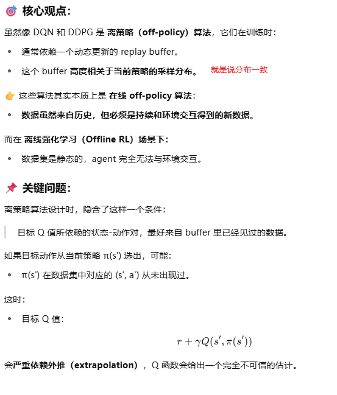
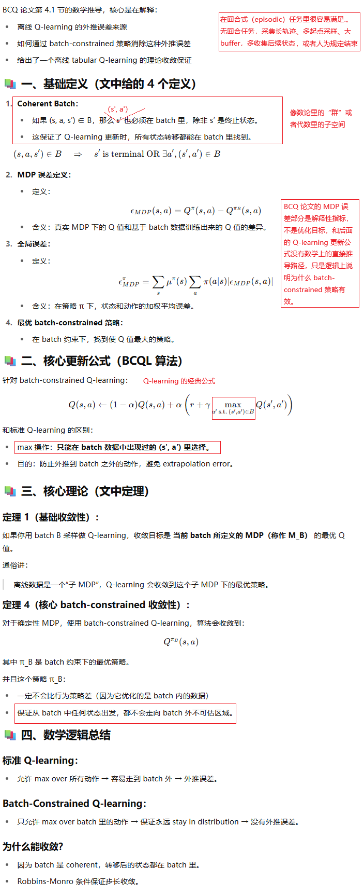
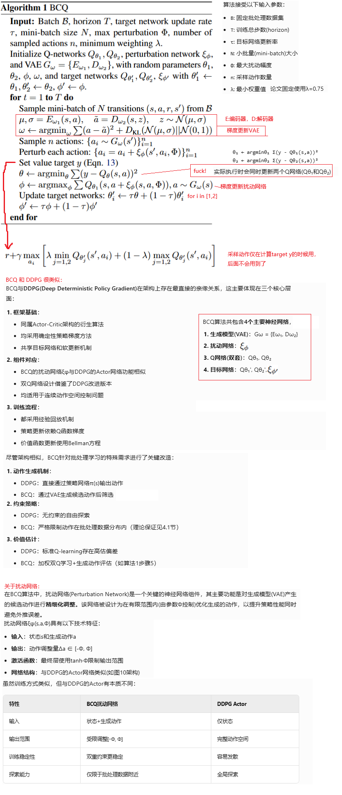
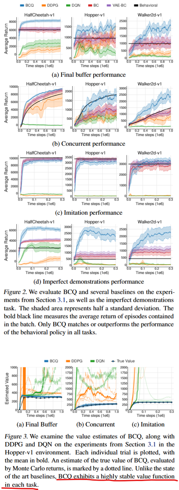
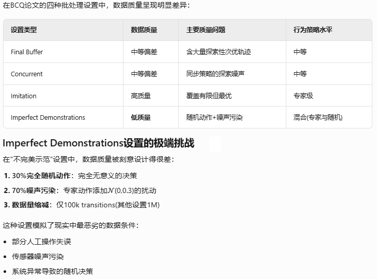

**Off-Policy Deep Reinforcement Learning without Exploration**

### 1、Introduction

作者表达能力还是比较臭的（可能论文比较久远了），几经和AI讨论，终于搞明白了：

1. off-policy算法，在线场景下（online RL），由于持续和环境交互，数据分布不断刷新，策略会探索，Replay Buffer 会动态包含新策略的数据，即使用了历史数据，Replay Buffer 总有数据来自当前策略附近，Q 网络更新的动作-状态分布不会漂太远。
2. 但off-policy 算法，在离线场景下（offline RL），如果只使用历史数据（离线场景可不就只能使用历史数据嘛），即只有一个固定数据集，不能再交互，容易产生外推错误（extrapolation error），Q 网络会给出完全不可信的估计（因为 Q 网络本质是函数拟合，评估的（s，a）在训练数据集从没有出现过，只能“插值”估计），不能收敛。不比在线场景，环境反馈告诉你 在该状态下执行某个动作 其实价值很差 ， Q 函数会修正

我们提出了一种新的 off-policy 强化学习的离线RL算法，称为 **batch-constrained reinforcement learning（批约束强化学习）**，它通过限制动作空间，强制 agent 行为尽量接近批数据中的行为（也就是逼近 on-policy）。

我们提出了第一个可以在连续动作空间、任意离线数据集上有效学习的深度强化学习算法，并在多个任务中验证了它的效果。


Extrapolation error, a phenomenon in which unseen state-action pairs are erroneously estimated to have unrealistic values. Extrapolation error can be attributed to a mismatch in the distribution of data induced by the policy and the distribution of data contained in the batch. As a result, it may be impossible to learn a value function for a policy which selects actions not contained in the batch.

Batch-Constrained deep Q-learning (BCQ), uses a state-conditioned generative model to produce only previously seen action.

This generative model is combined with a Q-network, to select the highest valued action which is similar to the data in the batch.

AI：BCQ 不是只允许数据集里完全出现过的 (s, a) pair，而是通过 VAE 学习生成 **在当前状态下、历史数据中可能的动作分布。**

### 2、Background

介绍了RL、贝尔曼方程、Actor-Critic方法

### 3、Extrapolation Error



### 4、Batch-Constrained Reinforcement Learning

We propose a conceptually simple idea: to avoid extrapolation error a policy should induce a similar state-action visitation to the batch. We denote policies which satisfy this notion as batch-constrained. 

#### 4.1  Addressing Extrapolation Error in Finite MDPs



#### 4.2. Batch-Constrained Deep Reinforcement Learning



### 5、Experiments



上图中的Final buffer / Concurent / Imitation / Imperfect demon是四种不同的离线数据收集方式，细节有点多，不摘录。

可以看到BCQ在其中三种超越其他几个算法的性能。

其中一组离线数据质量很差，但BCQ也有不错的回报：



### 6、Related Work

### 7、Conclusion

### 8、bison的实验

BCQ实现还是比较麻烦的，我准备先用开源的实现搞一波

```shell
https://github.com/sfujim/BCQ

https://d3rlpy.readthedocs.io/en/v2.8.1/references/algos.html#bcq

https://github.com/tinkoff-ai/CORL #这里没有实现BCQ，但有其他较多offline RL算法的实现
```

