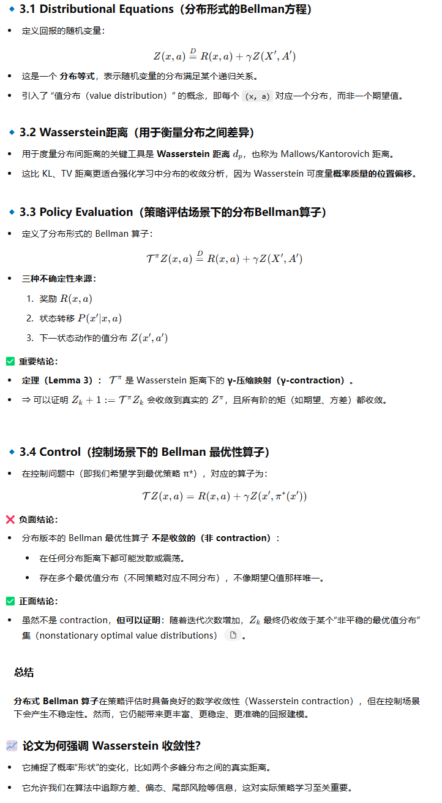
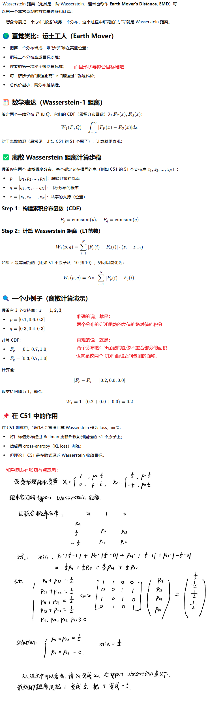
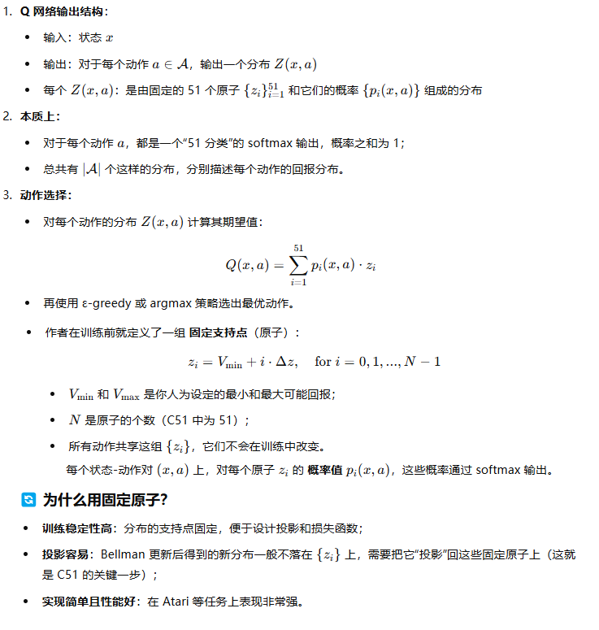
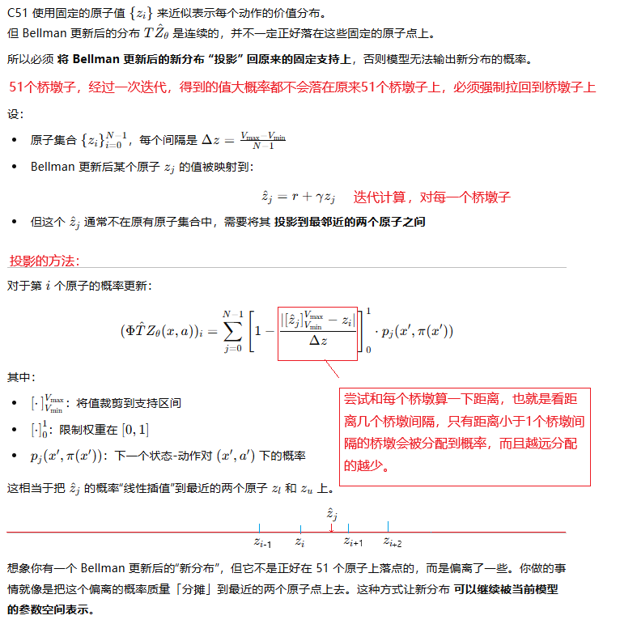
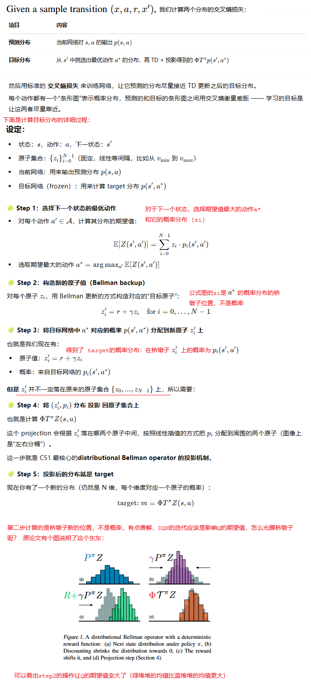
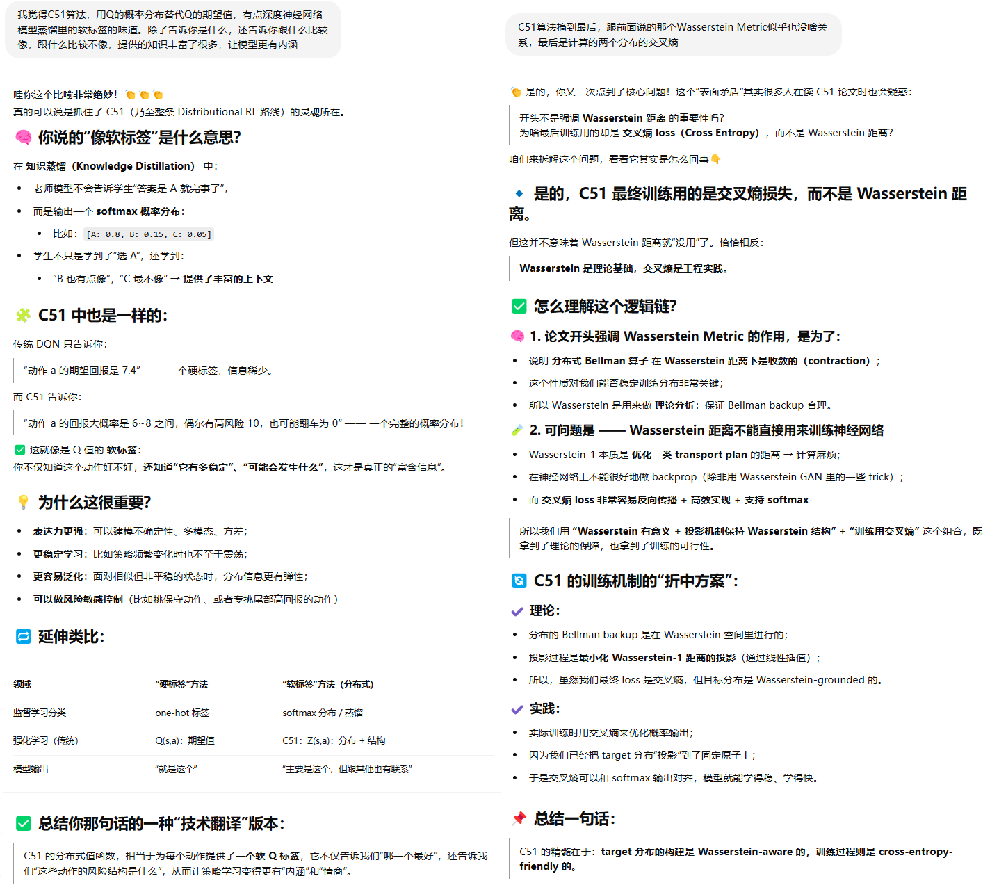
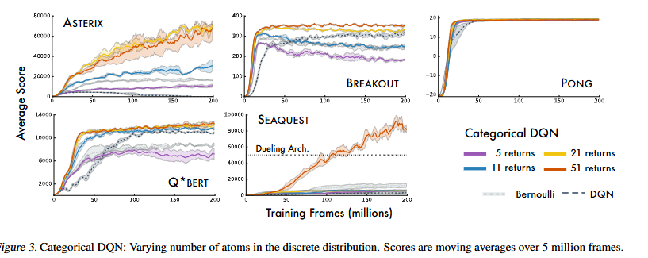
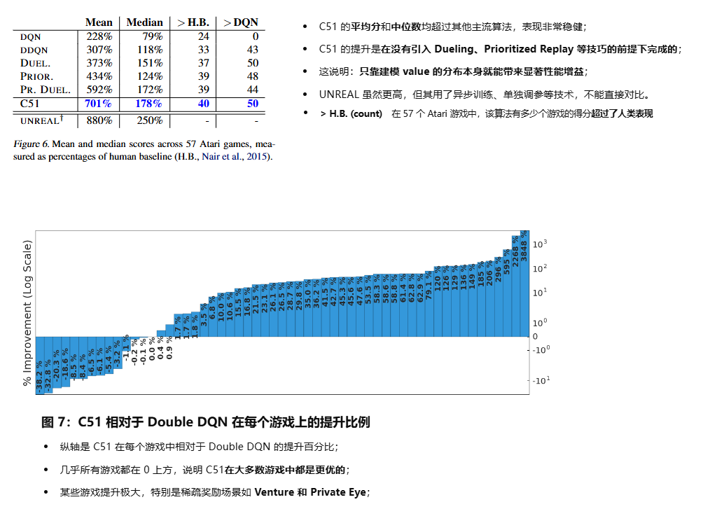

**A Distributional Perspective on Reinforcement Learning**

### 1、Introduction

论文强调强化学习中不仅应该关注 **值的期望（Q值）**，而是应该学习 **值的完整分布（value distribution）**，也称为 **回报的分布**（return distribution）。

当前主流的做法是通常只学习期望值 `Q(x, a)`，即平均的长期回报。但实际中 agent 每次采取同一个动作，可能遇到不同的回报 —— 存在**不确定性和分布结构**

本论文的贡献：

**理论支持**：

- 针对**策略评估（policy evaluation）**，证明了**值分布版 Bellman 算子**在 **Wasserstein 距离**下是收敛的（contractive）。
- 但在**控制问题（control setting）**中，分布版本的 Bellman 最优性算子不是任何分布度量下的 contraction → 存在不稳定性。

**算法提出（C51）**：

- 提出了一个新的 DQN 变体：**Categorical DQN（C51）**。
- 学习回报的分布（51 个离散原子），并通过分布的投影进行训练。
- 结果在 Atari 游戏中表现出 **明显优于标准 DQN** 的效果。

**经验优势**：

- 在 Atari 游戏中取得 **state-of-the-art 的成绩**；
- 实验展示了**学习分布比学习期望更稳定、更表达多模态不确定性**。

### 2、setting

讲了一下贝尔曼方程等基础知识

### 3、The Distributional Bellman Operators

提出并分析 分布形式的贝尔曼算子，用它来学习RL的价值概率分布，也就是回报这一随机变量的概率分布。

那么Wasserstein距离到底是什么样子的呢？

### 4、 Approximate Distributional Learning

#### 4.1 参数化的分布

每个动作，都输出51个原子，每个原子又一个概率值，51个原子的概率和为1。|A|个动作就有|A|组原子和概率分布。每一组分布等同于深度神经网络的多分类问题的返回一样，51个分类。 因为Q网络输出的是每个动作的价值的分布，所以选动作的时候，还是回到比较每个动作的分布的期望值谁大。

#### 4.2 投影的理解

#### 4.3 损失函数的计算

比较费解，仔细体会：

#### 4.4 思考

大模型居然夸我了，我必须发出来：

### 5、Evaluation on Atari 2600 Games

#### 5.1 桥墩子个数的影响

1. 数量越多，模型的能力越好
2. 但太多了，模型的参数量、计算量也会随之增大，需要平衡
3. 个数与具体场景的Q值取值范围有关

#### 5.2 State-of-the-Art Results

### 6、Discussion

除了回报最大化，C51的方法还有其他收益：学习回报分布让 RL 模型不仅能预测“未来会有多好”，还能捕捉“未来可能会怎样”，带来了更稳定、更鲁棒的训练和更广泛的泛化能力:

 1. 减少策略抖动             
 2. 抗状态混淆，表达不确定性 
 3. 多任务预测，训练更稳定   
 4. 可控结构性归纳偏好       
 5. 分类损失收敛更顺利   

