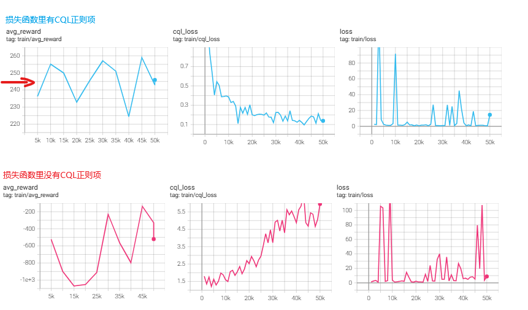

Conservative Q-Learning for Offline Reinforcement Learning

### 1、Introduction

现有的离线强化学习（Offline RL）方法直接应用标准的 off-policy RL 算法会导致性能很差，主要是因为：

- 会从分布外（out-of-distribution, OOD）动作上 bootstrap，带来错误的乐观估计（过高的 Q 值）。其他论文里叫extrapolation error，老生常谈的问题
- 过拟合问题，过拟合到经验数据上，一旦用于实际环境交互下，就失效。

这两个问题最终表现为：错误地高估了价值函数。

作者认为：如果我们能学到一个保守（conservative）的价值函数估计，也就是它给出的 Q 值是对真实 Q 值的下界（lower bound），那么就能有效缓解这种过估计的问题。

方法的核心是通过简单修改标准的 value-based RL 算法来最小化 Q 值（使 Q 值偏保守），并结合一个基于数据分布的最大化项来收紧这个下界。

原文有一小段不好理解，特意问了AI：


### 2、Preliminaries

### 3、CQL

给出了数学基础：


### 4、Practical Algorithm and Implementation Details


### 5、Related Work

### 6、Experiments


论文中还有很多实验数据的展示，不一一誊录了。

### 7、Discussion

While we prove that CQL learns lower bounds on the Q-function in the tabular, linear, and a subset of non-linear function approximation cases, a rigorous theoretical analysis of CQL with deep neural nets, is left for future work. 

Additionally, offline RL methods are liable to suffer from overfitting in the same way as standard supervised methods, so another important challenge for future work is to devise simple and effective early stopping methods, analogous to validation error in supervised learning.

1. 需要针对深度神经网络拟合的CQL算法的进一步的理论分析
2. 需要解决过拟合到离线经验数据上的问题

### 8、Bison的实验

论文作者的代码实现：

```
https://github.com/aviralkumar2907/CQL
#上面的代码大量的用到rlkit这个库，所以不够一目了然
https://github.com/rail-berkeley/rlkit
```

#### LunarLander

效果很好：



按照lunarlander的官方描述：An episode is considered a solution if it scores at least 200 points.

这是[evaluate的录像](img/lunarlander_cql.mp4)

```python
import datetime
from collections import deque

from stable_baselines3 import PPO
from huggingface_hub import hf_hub_download
import gym #对，要用gym不能用gymnasium，否则LunarLander-v2不能用，提示要用v3
import torch
import torch.nn as nn
import torch.optim as optim
import numpy as np
from typing import Callable, List
from torch.utils.tensorboard import SummaryWriter
import argparse
import os
import BCQ
import utils
from utils import BCQReplayBuffer
import torch.nn.functional as F
import random

writer = SummaryWriter(log_dir=f'logs/CQL_LunarLander_{datetime.datetime.now().strftime("%m%d_%H%M%S")}')
device = 'cuda:0' if torch.cuda.is_available() else 'cpu'

class Config:
    max_iteration = 50_000
    experience_filename = './rl-trained-agents/expert_experience_lunarlander.pth'
    task_id = "LunarLander-v2"
    max_experience_len = 200_000

    # 超参数
    gamma = 0.99  # 折扣因子
    learning_rate = 1e-3  # 学习率
    batch_size = 64  # 经验回放的批量大小
    target_update_freq = 1000  # 目标网络更新频率
    n_state = 8
    n_action = 4
    alpha = 1.0

# 收集专家经验数据，用来离线训练agent
def prepare_expert_data():
    env = gym.make(Config.task_id, render_mode=None)
    # 加载模型
    model = PPO.load('./rl-trained-agents/ppo/LunarLander-v2_1/LunarLander-v2.zip')

    buffer = deque(maxlen=Config.max_experience_len)

    while len(buffer) < Config.max_experience_len:
        obs, _ = env.reset()
        done = False

        while not done:
            action,_ = model.predict(obs, deterministic=True)
            next_obs, r, term, trunc, info = env.step(action)
            done = term or trunc

            buffer.append( (obs, action, next_obs, r, done) )

            obs = next_obs
        print(f"buffer len:{len(buffer)}")
    env.close()
    torch.save(buffer, Config.experience_filename)
    return buffer

# DQN 网络定义
class DQN(nn.Module):
    def __init__(self, state_dim, action_dim):
        super(DQN, self).__init__()
        self.fc1 = nn.Linear(state_dim, 256)
        self.fc2 = nn.Linear(256, 256)
        self.fc3 = nn.Linear(256, action_dim)

    def forward(self, x):
        x = F.relu(self.fc1(x))
        x = F.relu(self.fc2(x))
        return self.fc3(x)


class CQLAgent:
    def __init__(self, experience_filename=Config.experience_filename):
        # 初始化网络
        self.model = DQN(Config.n_state, Config.n_action).to(device)
        self.target_model = DQN(Config.n_state, Config.n_action).to(device)
        self.target_model.load_state_dict(self.model.state_dict())
        self.optimizer = optim.Adam(self.model.parameters(), lr=Config.learning_rate)
        self.memory = torch.load(experience_filename, weights_only=False)
        self.iter_cnt = 0

    def select_action(self,state, epsilon):
        """基于 ε-greedy 选择动作"""
        if random.random() < epsilon:
            return random.randint(0, Config.n_action - 1)  # 随机选择
        else:
            state = torch.FloatTensor(state).unsqueeze(0).to(device)  # 变换前：[4] -> 变换后：[1, 4]
            return self.model(state).argmax(1).item()  # 选取 Q 值最大的动作

    # 计算cql loss，顺带返回q_values
    def calc_cql_loss(self, states: torch.Tensor, actions: torch.Tensor):
        """
        计算 CQL Loss，使用数值稳定的 log-sum-exp 分解写法
        :param states: shape (batch_size, state_dim)
        :param actions: shape (batch_size, 1)
        """
        # 计算所有动作的 Q 值
        qvalue_per_action = self.model(states)  # shape: (batch_size, n_action)

        # 取出实际动作对应的 Q 值
        q_values = qvalue_per_action.gather(1, actions)  # shape: (batch_size, 1)

        # ========================== 数值稳定版 log-sum-exp ==========================
        # 1. 找每个样本的最大 Q 值
        max_q, _ = qvalue_per_action.max(dim=1, keepdim=True)  # shape: (batch_size, 1)

        # 2. 每个 Q 减去当前样本的最大值，防止 exp 爆炸
        stable_q = qvalue_per_action - max_q  # shape: (batch_size, n_action)

        # 3. 计算 exp 并按动作求和
        sum_exp = torch.exp(stable_q).sum(dim=1, keepdim=True)  # shape: (batch_size, 1)

        # 4. 计算 log-sum-exp
        logsumexp = max_q.squeeze(1) + torch.log(sum_exp.squeeze(1))  # shape: (batch_size,)
        # ============================================================================

        # 计算 CQL Loss
        cql_loss = (logsumexp - q_values.squeeze(1)).mean() * Config.alpha

        return q_values, cql_loss

    def train(self, iter_times:int):

        for _ in range(iter_times):
            self.iter_cnt += 1
            batch = random.sample(self.memory, Config.batch_size)
            states, actions,  next_states, rewards, dones = zip(*batch)
            actions = [a.item() for a in actions]
            states = torch.FloatTensor(states).to(device)  # (batch_size, 4)
            actions = torch.LongTensor(actions).unsqueeze(1).to(device)  # (batch_size,) -> (batch_size, 1)
            rewards = torch.FloatTensor(rewards).unsqueeze(1).to(device)  # (batch_size,) -> (batch_size, 1)
            next_states = torch.FloatTensor(next_states).to(device)  # (batch_size, 4)
            dones = torch.FloatTensor(dones).unsqueeze(1).to(device)  # (batch_size,) -> (batch_size, 1)

            # 计算当前 Q 值
            q_values, cql_loss = self.calc_cql_loss(states, actions)

            # 计算目标 Q 值

            next_q_values = self.target_model(next_states).max(1, keepdim=True)[0]  # 选取 Q(s', a') 的最大值
            target_q_values = rewards + Config.gamma * next_q_values * (1 - dones)  # TD 目标

            # 计算损失
            loss = F.mse_loss(q_values, target_q_values.detach()) + cql_loss
            self.optimizer.zero_grad()
            loss.backward()
            self.optimizer.step()

            if self.iter_cnt % 5000 == 0:
                self.evaluate()
        writer.add_scalar('train/loss', loss.item(), self.iter_cnt)
        writer.add_scalar('train/cql_loss', cql_loss.item(), self.iter_cnt)
        return loss.item()

    def evaluate(self, render_mode=None):
        print("begin evaluate...")
        env = gym.make(Config.task_id, render_mode=render_mode)
        episode_num = 5
        total_reward = 0
        self.model.eval()
        for _ in range(episode_num):
            state,_ = env.reset()
            step_cnt = 0
            while True:
                env.render()
                with torch.no_grad():
                    action = self.select_action(state, 0)  # 纯利用，epsilon=0
                state, reward, done, _, _ = env.step(action)
                step_cnt += 1
                total_reward += reward

                if done or step_cnt>500:
                    break
        avg_reward = total_reward / episode_num
        print(f"evaluate finished, avg_episode_reward: {avg_reward}, iter:{self.iter_cnt}")
        writer.add_scalar('train/avg_reward', avg_reward, self.iter_cnt)
        self.model.train()
        env.close()
        return avg_reward


    def learn(self):
        while self.iter_cnt < Config.max_iteration:
                loss = self.train(Config.target_update_freq)
                self.target_model.load_state_dict(self.model.state_dict())
        self.evaluate('human')


if __name__ == "__main__":
    agent = CQLAgent()
    agent.learn()
```

