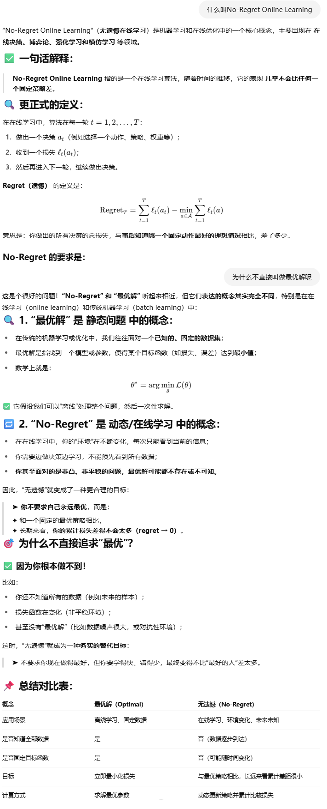
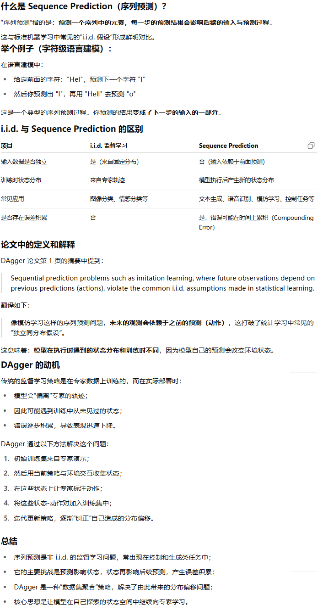
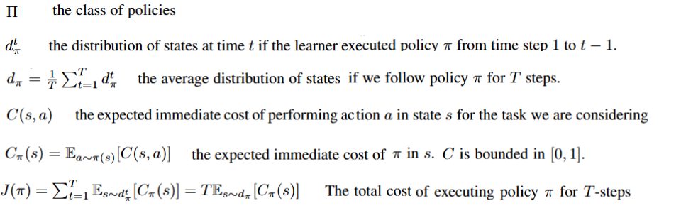
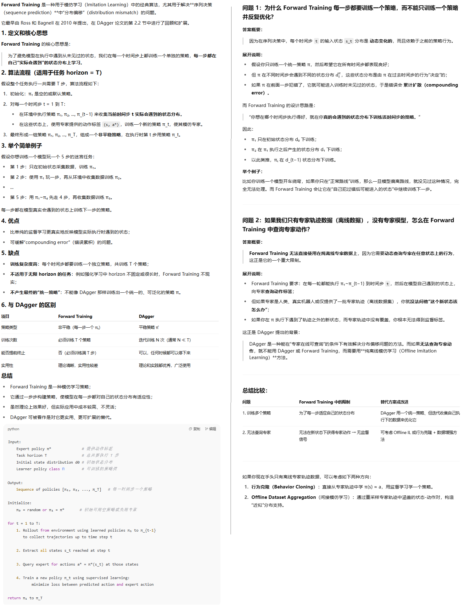
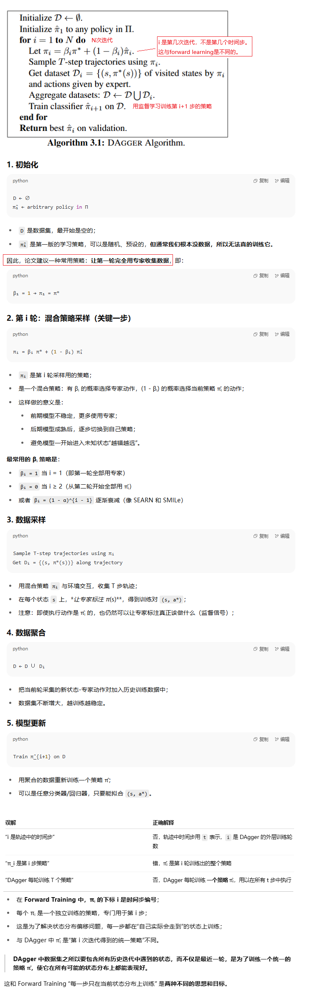
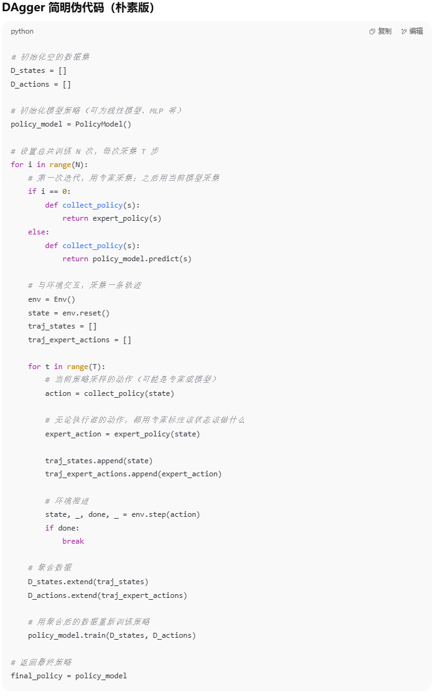
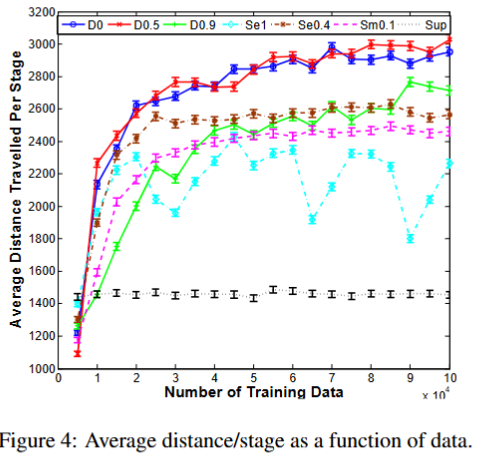
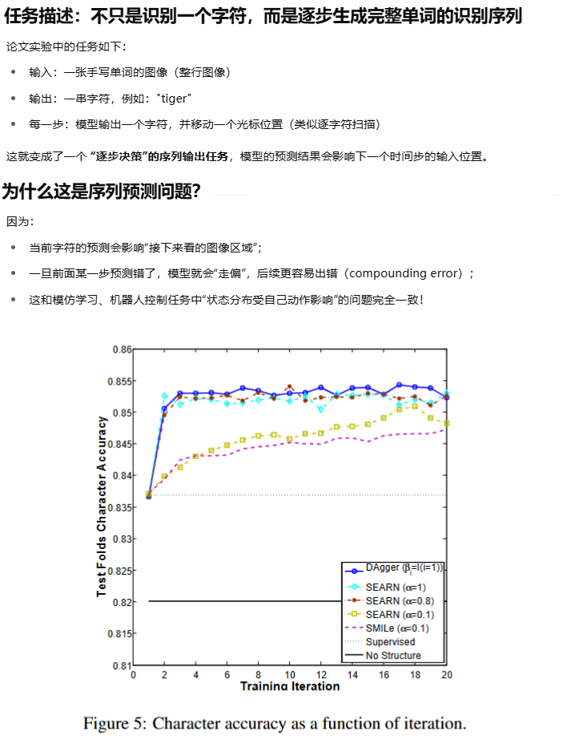
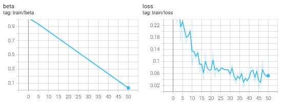

**A Reduction of Imitation Learning and Structured Prediction to No-Regret Online Learning**

### 1、Introduction

#### No-Regret Online Learning和Sequential Prediction






问题：

Sequential prediction problems such as imitation learning, where future observations depend on previous predictions (actions), violate the common i.i.d. assumptions made in statistical learn-ing. This leads to poor performance in theory and often in practice.

#### 我们的方法

We propose a new meta-algorithm for imitation learning：

1. learns a stationary deterministic policy guaranteed to perform well under its induced distribution of states（专家样本分布以外的状态上也表现良好）
2. reuses existing supervised learning algorithms
3. simple to implement
4. handles continuous as well as discrete prediction
5. closely related to no regret online learning algorithm but better leverages the expert in our setting

### 2、Preliminaries

#### 符号约定：



#### 怎么理解cost（成本/损失）


#### Forward Learning



### 3、DATASET AGGREGATION





### 4、THEORETICAL ANALYSIS

理论性太强了，看不懂，跳过

### 5、Experiments

#### 超级马里奥

We used the simulator from a recent Mario Bros.

 Our expert in this scenario is a near-optimal planning algorithm that has full access to the game’s internal state and can
simulate exactly the consequence of future actions

We compare performance of DAgger, SMILe and SEARN6 to the supervised approach (Sup).



#### 手写字识别



### 6、Future Work

在未来的工作中，我们将考虑更复杂的策略，而不是简单的贪婪前向解码进行结构化预测，以及使用依赖于逆最优控制的基础分类器技术来学习计划者的代价函数，以帮助模仿学习中的预测。

此外，我们相信类似于预先提出的技术，通过利用成本估算，可以提供对在线强化学习方法成功的理解，并建议一种类似的数据聚合方法，可以保证在这种环境中的性能。

### 7、bison的实验

使用hugging face里sb3账号下已经训练好的agent作为expert：

```shell
https://huggingface.co/sb3/ddpg-BipedalWalker-v3
python -m rl_zoo3.load_from_hub --algo ddpg --env BipedalWalker-v3 -orga sb3 -f rl-trained-agents/
python enjoy.py --algo ddpg --env BipedalWalker-v3  -f rl-trained-agents/
```

有一定的效果：



最后的测试结果，有两次能跑到终点，有两次中途摔倒了：

```
total_reward=288.8277282714844
total_reward=-31.038467407226562
total_reward=147.829345703125
total_reward=288.4337463378906
```

代码：

```python
import datetime

from stable_baselines3 import DDPG
from huggingface_hub import hf_hub_download
import gymnasium as gym
import torch
import torch.nn as nn
import torch.optim as optim
import numpy as np
from typing import Callable, List
from torch.utils.tensorboard import SummaryWriter

writer = SummaryWriter(log_dir=f'logs/DAgger_bipedalwaler_{datetime.datetime.now().strftime("%m%d_%H%M%S")}')

class Config:
    max_iteration = 50

def expert_show_case():
    env = gym.make("BipedalWalker-v3", render_mode='human')
    # 加载模型
    model = DDPG.load('./rl-trained-agents/ddpg/BipedalWalker-v3_1/BipedalWalker-v3.zip')
    obs = env.observation_space.sample()
    action = model.predict(obs)
    print(action)
    obs, _  = env.reset()
    done = False
    total_reward = 0
    while not done:
        action,_ = model.predict(obs, deterministic=True)
        obs, r, term, trunc, info = env.step(action)
        done = term or trunc
        total_reward += r

    print(f'total_reward={total_reward}')
    env.close()

def load_expert():
    model = DDPG.load('./rl-trained-agents/ddpg/BipedalWalker-v3_1/BipedalWalker-v3.zip')
    print('load expert successfully')
    return model


# 策略网络：多层感知机，输入状态输出动作
class PolicyNetwork(nn.Module):
    def __init__(self, state_dim, action_dim):
        super().__init__()
        self.net = nn.Sequential(
            nn.Linear(state_dim, 128),
            nn.ReLU(),
            nn.Linear(128, 64),
            nn.ReLU(),
            nn.Linear(64, action_dim),
            nn.Tanh()  # BipedalWalker 的动作在 [-1, 1]
        )

    def forward(self, x):
        return self.net(x)


# 核心：DAgger 算法的实现类
class DAggerAgent:
    def __init__(
        self,
        env: gym.Env,
        expert_policy: nn.Module,
        policy_network: nn.Module,
        beta_schedule: Callable[[int], float],
        device="cpu"
    ):
        self.env = env
        self.expert = expert_policy
        self.policy = policy_network.to(device)
        self.optimizer = optim.Adam(self.policy.parameters(), lr=1e-3)
        self.beta_schedule = beta_schedule
        self.device = device
        self.dataset = []

    def collect_trajectory(self, n_steps: int, iteration: int):
        beta = self.beta_schedule(iteration)
        writer.add_scalar('train/beta', beta, iteration)
        obs,_ = self.env.reset()
        traj = []

        for _ in range(n_steps):

            expert_action,_ = self.expert.predict(obs)
            # 混合执行策略（用于 early stage）
            use_expert = np.random.rand() < beta
            if use_expert:
                action = expert_action
            else:
                obs_tensor = torch.FloatTensor(obs).unsqueeze(0).to(self.device)
                action = self.policy(obs_tensor).squeeze(0).detach().cpu().numpy()

            traj.append((obs, expert_action))  # 数据用 expert label
            obs, _, term, trunc, _ = self.env.step(action)
            done = term or trunc
            if done:
                obs,_ = self.env.reset()

        return traj

    def update_policy(self, iteration, batch_size: int = 64, epochs: int = 5):
        if not self.dataset:
            return

        states = torch.FloatTensor([x[0] for x in self.dataset]).to(self.device)
        actions = torch.FloatTensor([x[1] for x in self.dataset]).to(self.device)

        for _ in range(epochs):
            indices = torch.randperm(len(states))
            for i in range(0, len(states), batch_size):
                idx = indices[i:i + batch_size]
                batch_states = states[idx]
                batch_actions = actions[idx]

                pred_actions = self.policy(batch_states)
                loss = nn.MSELoss()(pred_actions, batch_actions)

                self.optimizer.zero_grad()
                loss.backward()
                self.optimizer.step()
        writer.add_scalar('train/loss', loss.item(), iteration)
        return loss.item()

    def train(self, iterations: int, steps_per_iter: int):
        for i in range(1, iterations + 1):
            traj = self.collect_trajectory(steps_per_iter, i)
            self.dataset.extend(traj)
            loss = self.update_policy(iteration=i)
            print(f"[DAgger] Iteration {i}/{iterations} complete, dataset size = {len(self.dataset)}, loss:{loss}")


# 示例用法
def train_dagger():
    env = gym.make("BipedalWalker-v3")
    state_dim = env.observation_space.shape[0]
    action_dim = env.action_space.shape[0]

    # 假设传入的专家策略（这里写一个 dummy expert 作为占位）
    expert_policy = load_expert()


    # β_i = 1 for i = 1, else 0：只在第一轮用 expert（最常见选择）
    def beta_schedule(i):
        return 1.0 - 1.0 / Config.max_iteration * (i-1)

    policy = PolicyNetwork(state_dim, action_dim)
    dagger = DAggerAgent(env, expert_policy, policy, beta_schedule, device="cpu")

    dagger.train(iterations=Config.max_iteration, steps_per_iter=2000)

    env.close()
    env = gym.make("BipedalWalker-v3", render_mode='human')
    # 测试
    for _ in range(4):
        obs,_ = env.reset()
        done = False
        total_reward = 0
        while not done:
            obs_tensor = torch.FloatTensor(obs).unsqueeze(0)
            action = policy(obs_tensor).squeeze(0).detach().numpy()
            obs, r, term, trunc, _ = env.step(action)
            done = term or trunc
            total_reward += r
        print(f'total_reward={total_reward}')
    env.close()


if __name__ == "__main__":
    train_dagger()

```

