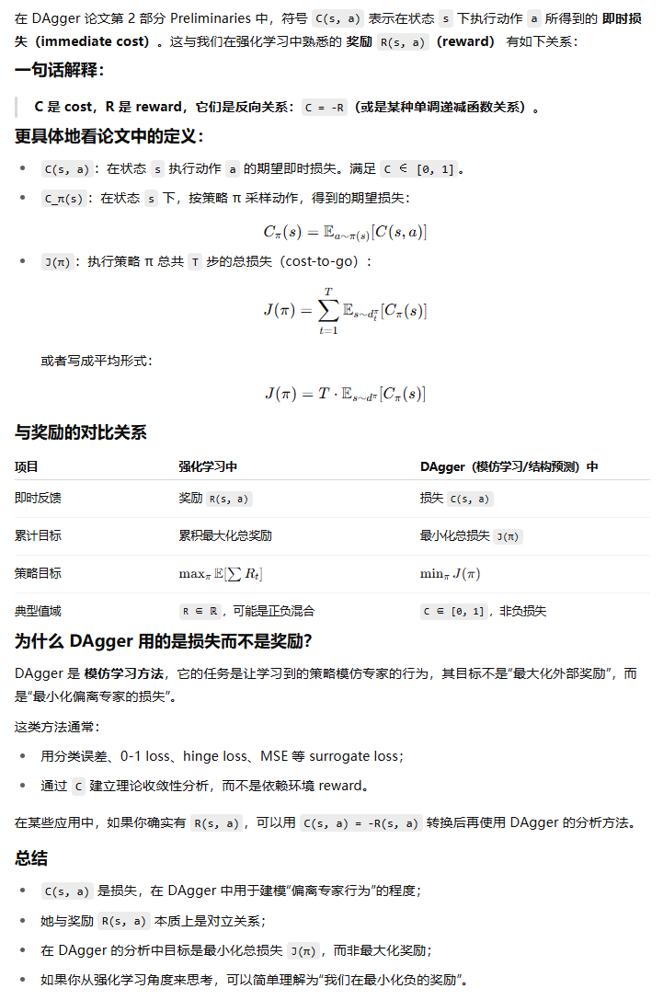

**A Reduction of Imitation Learning and Structured Prediction to No-Regret Online Learning**

### 1、Introduction

#### No-Regret Online Learning和Sequential Prediction

问题：

Sequential prediction problems such as imitation learning, where future observations depend on previous predictions (actions), violate the common i.i.d. assumptions made in statistical learn-ing. This leads to poor performance in theory and often in practice.

#### 我们的方法

We propose a new meta-algorithm for imitation learning：

1. learns a stationary deterministic policy guaranteed to perform well under its induced distribution of states（专家样本分布以外的状态上也表现良好）
2. reuses existing supervised learning algorithms
3. simple to implement
4. handles continuous as well as discrete prediction
5. closely related to no regret online learning algorithm but better leverages the expert in our setting

### 2、Preliminaries

#### 符号约定：

#### 怎么理解cost（成本/损失）

#### Forward Learning

### 3、DATASET AGGREGATION

### 4、THEORETICAL ANALYSIS

理论性太强了，看不懂，跳过

### 5、Experiments

#### 超级马里奥

We used the simulator from a recent Mario Bros.

 Our expert in this scenario is a near-optimal planning algorithm that has full access to the game’s internal state and can
simulate exactly the consequence of future actions

We compare performance of DAgger, SMILe and SEARN6 to the supervised approach (Sup).

#### 手写字识别

### 6、Future Work

在未来的工作中，我们将考虑更复杂的策略，而不是简单的贪婪前向解码进行结构化预测，以及使用依赖于逆最优控制的基础分类器技术来学习计划者的代价函数，以帮助模仿学习中的预测。

此外，我们相信类似于预先提出的技术，通过利用成本估算，可以提供对在线强化学习方法成功的理解，并建议一种类似的数据聚合方法，可以保证在这种环境中的性能。