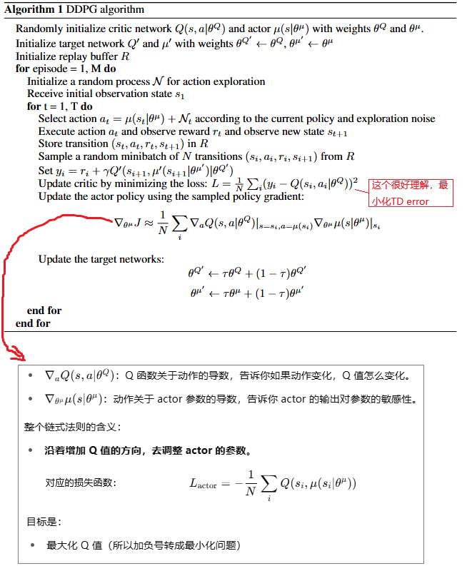
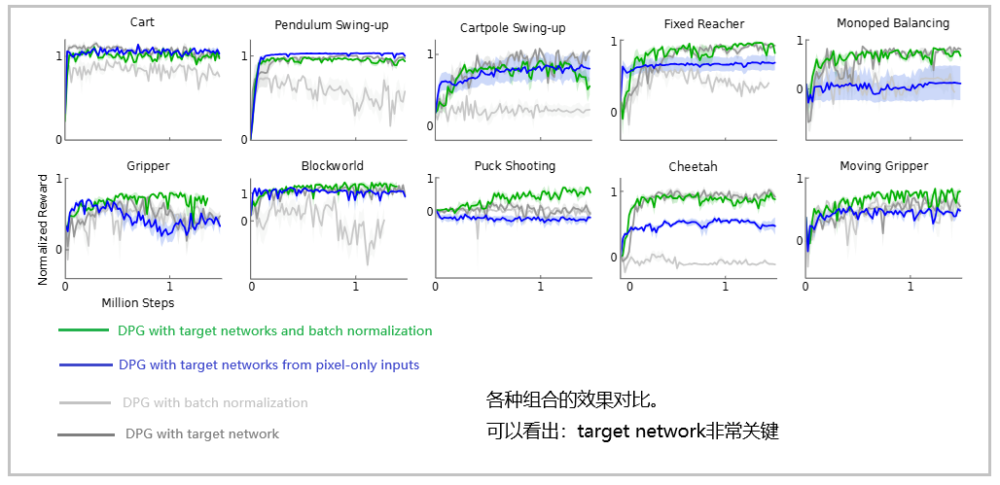
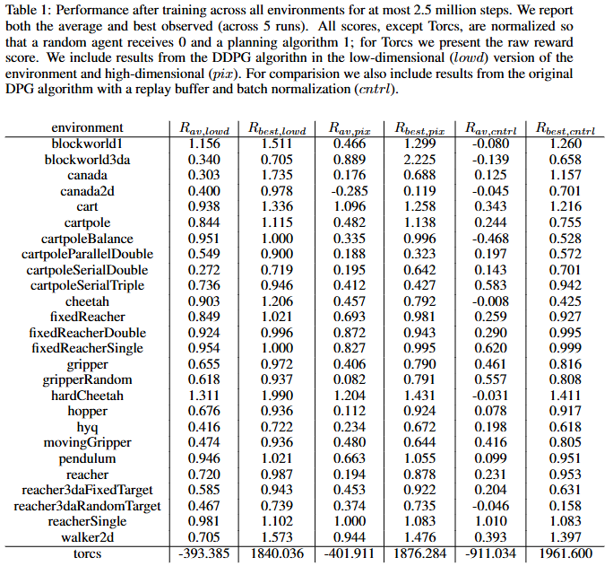

**CONTINUOUS CONTROL WITH DEEP REINFORCEMENT LEARNING**

### Introduction

DQN只适合低维离散的动作空间。想要把DQN用于连续的高维动作空间的任务，一个浅显的办法就是把连续动作离散化，但这样有两个问题：

1. 离散化得到的动作量会指数增长最后爆炸：假设机器人的手臂有7个自由度，就算每个自由度粗糙的离散化为3个值，那也有2187个动作，对于需要精细化控制动作的场景会更糟糕
2. 动作空间的朴素离散化不必要地丢弃了关于动作域结构的信息，这对于解决许多问题可能是必不可少的。

我们的工作提出了一种可用于连续高维动作空间的模型无关、异策略（off-policy）、使用深度神经网络的Actor-Critic算法。我们的工作基于DPG（确定性策略梯度）算法。但简单的把DPG加上深度神经网络并不能解决有挑战性的问题。

我们的工作结合了DQN网络的思想：

1. 通过replay buffer来消除样本之间的强相关性，使用异策略训练动作价值网络
2. 使用延迟更新的target Q network来提供稳定的标注价值（有监督学习中的target）用于TD
3. 我们还使用了深度学习中常用的mini-batch方式来训练

为了评估我们的算法，我们构建了很多有挑战的物理控制问题，包括：

1. 复杂的多关节运动
2. 不稳定的多接触点的动力学和步态行为
3. 机器人控制

我们的DDPG算法，能够在不修改超参数和网络结构的前提下，在低维的（结构化的）状态输入（例如直接输入笛卡尔坐标和关节角度）场景和 原始感官像素输入场景都训练出竞争力的动作策略。

我们的方法的特点是简单、容易实现和扩展。在物理控制问题场景中，我们与那种能白盒访问模拟器内部信息的planner做了比较，DDPG有时候能找到性能超过planner的策略，即使有时候输入是原始的感官像素信息。

### Background

...此处省略大量RL有关概念和交互过程的介绍...

我们的算法是收到DQN的启发，把深度神经网络和DPG算法结合起来，所以叫做深度确定性策略梯度网络（DDPG）。

### Algorithm

一个大的挑战是，深度神经网络的训练，通常要求样本是独立同分布的。而强化学习中的环境探索/交互序列明显不满足I.I.D.的要求。而且，为了利用硬件加速进行高效率的训练，必须使用mini-batch的方式。

在DQN中，通常使用固定大小的回放buffer，满了的时候，旧的四元组（s, a, r, s'）被挤出buffer。而且buffer相比mini-batch很大，每次进行随机抽样形成一个batch，可以把sample之间的相关性去除。

直接对神经网络使用Q learning算法，一直被认为是不稳定的。Q网络即被用于更新又被用于计算target，这个过程通常是发散而不会收敛。我们的解决方案是使用滞后更新的target网络和软更新算法，每次只很低比例的从当前网络拷贝参数到target网络，而不是直接拷贝当前网络的参数到target网络（bison：见代码就行然大悟了）。这样，target网络更新很慢，保持稳定。这样可能会让训练变慢，但是对于稳定性和收敛性帮助很大。

环境观测（Observation）中的各个物理特征量在绝对值范围上可能相差很大，例如位置和速度，这样会影响训练速度和模型收敛，所以我们需要对这些物理量做归一化处理，让他们在同一个数量级范围内。这个技术叫做 batch normalization，也是从深度学习中习得的。通过在神经网络各层添加batch normalization，我们不需要手动处理物理量的归一化。

在连续的动作空间中做有效的探索是一个挑战。我们通过对策略网络产生的动作叠加一个噪声来解决。具体的，我们使用Ornstein-Uhlenbeck 过程来对动作叠加时间相关的噪声。

### Results

在所有任务中，我们分别使用低维状态描述（如关节角度和位置）和环境的髙维渲染图像进行实验。

在智能体的每个时间步长中，我们让仿真环境推进3个时间步长，期间重复使用智能体的动作并每次进行渲染。因此，智能体接收的观测包含9个特征图（即3次渲染的RGB图像），使其能够通过帧间差异推断速度信息。每个帧被下采样到 64x64像素，每个像素8bit位深数据被转换为[0,1]之间的浮点数。

训练的时候，我们会定时通过不带探索噪声的测试来评估策略模型。

让人惊讶的是：在一些简单场景中，使用高维度的原始感官像素，与使用低纬度的人工特征工程相比，训练一样快。可能是因为动作的重复让问题变简单了，或者是因为卷积层提供了状态空间的一种易分离表征（easily separable representation），这种表征能够使更高层的网络快速有效地学习。

我们也评估了去掉一些机制（例如target网络、mini-batch）后的结果，发现这些机制都是有必要的。尤其是：去掉target网络，在很多环境下表现效果非常差。

下面的表格，是我们的方法和两个基准方法的对比：

1. 随机均匀抽样动作的朴素策略
2. iLOG，一种洞悉模拟器内部状态和物理模型的

我们把得分归一化，使得朴素策略平均得分为0，而iLOG的平均得分为1。

结果显示，DDPG可以学习到很好的策略，在很多案例中，甚至比iLOG表现更优，即使是使用原始感官像素作为输入。

为了展示我们方法的泛化能力，我们也在竞速游戏Torcs里进行了测试，动作包括加速、刹车、转向。我们使用了相同的网络结构和超参数，但是修改了探索噪声的生成方式。在低维输入和高维像素输出两种方式下，**多次独立训练运行的实例** 可以学习到很好的策略来完成跑圈，也有一些实例没有能够学习到有效的策略。

### Conclusion

我们的方法结合了深度学习和RL的最新进展，取得了一个稳定的多领域下的连续动作空间的算法。

有意思的是：我们所有的实验在Atari游戏中训练最优策略，需要的步骤比DQN少很多，几乎所有的问题都在2.5百万步内解决，是DQN步骤的1/20。这表明，给足够多的模拟时间，DDPG可以解决更复杂的问题。

我们的方法也有局限性：DDPG需要大量的训练回合（episode），我们相信一种稳健的model-free方法可能是更大系统的重要组成部分，这些系统可能会攻克这些局限性。

bison:   在深度强化学习（Deep Reinforcement Learning, DRL）中，**Model-free** 意味着智能体（agent）对马尔可夫决策过程（MDP）的**转移概率矩阵 P(s′∣s,a)** 和**奖励函数 R(s,a,s′)** 完全未知，只能通过与环境的交互来学习策略或价值函数。与之对应的是 **Mode-Based**

