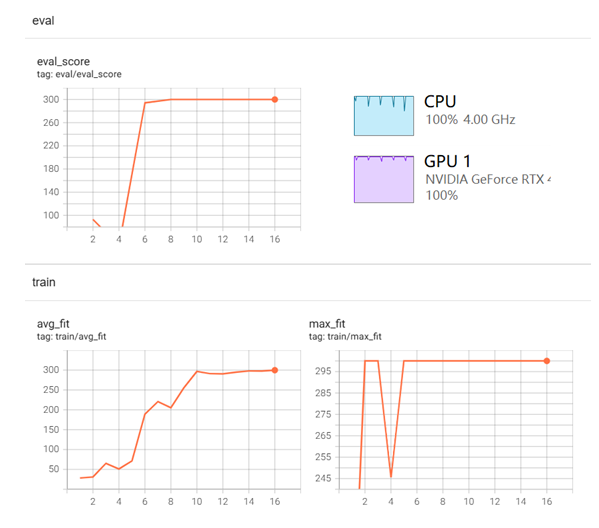
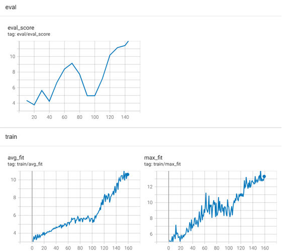

**Evolution Strategies as a Scalable Alternative to Reinforcement Learning**

### 1 Introduction

本论文的主要三个贡献：

1. 在使用 Evolution Strategies（ES）优化策略网络时，作者发现**虚拟批归一化（virtual batch normalization）**以及其他**网络参数重构方法（reparameterizations）**显著提升了算法的稳定性和可靠性。否则，ES 在某些环境中会表现得非常脆弱，难以收敛或探索。
2. 通过创新的引入一种**基于共享随机数（common random numbers）**的进程间通信方式，可以极大的提高ES方法的并行性。
3. 在 Evolution Strategies 这种完全无梯度、黑盒优化的框架下，居然只用了 3–10 倍的数据就能达到 A3C 的性能，这已经比预期好得多了。虽然数据用得多，但**每条数据的处理成本低**，整体计算量反而更小。1小时的ES训练效果相当于1天的A3C的训练效果
4.  Evolution Strategies方法 比策略梯度方法（例如TRPO）有更好的探索能力
5.  Evolution Strategies方法有很好的鲁棒性。ES 在 Atari 的所有环境中都用了同一组固定超参数（如学习率、噪声尺度、种群大小等），在 MuJoCo 中也用了另一组固定超参数（除了一个二值参数），但**没有针对每个任务做精细调参**，仍然能跑出不错的结果。


下面具体解释前三个贡献


黑盒优化方法（ES方法）有以下优点：

1. 对奖励不敏感。无论奖励是稠密的（每步都有反馈）还是稀疏的（只有终点才有奖励），黑盒方法都可以工作。因为它们只关心最终回报，不依赖梯度或 TD 误差。
2. 不需要后向传播计算梯度
3. 可以容忍很长的回合。即使任务很长（如数千步），也不会像 TD 方法那样出现梯度爆炸或消失。

尽管黑盒方法有上述优点，但在解决复杂强化学习任务时，它们通常被认为**不如 Q-learning 或 policy gradient 方法有效**。原因包括：

1. **样本效率低**：黑盒方法通常需要大量环境交互才能找到好的策略。
2. **探索效率低**：没有 value function 或策略梯度引导探索，容易陷入局部最优。
3. **缺乏结构利用**：无法利用 Bellman 方程、状态转移结构、TD 误差等强化学习特有的信息。

bison：样本效率比RL还低，那就真的太低了。

### 2 Evolution Strategies

可以看到，ES算法，一定程度上也输入Gradient-Base算法，因为它是通过计算参数的梯度并据此修改参数来实现的。只是说没有用后向传播这样的求导数的方式。不是一个完全Gradient-Free算法。


### 3 Smoothing in parameter space versus smoothing in action space

ES 和 PG 都是通过“加噪声”来让目标函数变得可优化，但一个是在动作空间加噪声（PG），一个是在参数空间加噪声（ES）。在长时间任务、稀疏奖励、不可微环境中，ES 的参数空间平滑更稳定、更鲁棒。


### 4 Experiments


### 5、Related Work

### 6、Conclusion

The main contribution in our work is in showing that this class of algorithms（ES） is extremely scalable and efficient to use on distributed hardware. We have shown that ES, when carefully implemented, is competitive with competing RL algorithms in terms of performance on the hardest problems solvable today, and is surprisingly close in terms of data efficiency, while taking less wallclock time to train.

We have explored Evolution Strategies, a class of black-box optimization algorithms, as an alternative to popular MDP-based RL techniques such as Q-learning and policy gradients. Experiments on Atari and MuJoCo show that it is a viable option with some attractive features: 

1. it is invariant to action frequency and delayed rewards, 
2. and it does not need temporal discounting or value function approximation. 
3. Most importantly, ES is highly parallelizable, which allows us to make up for a decreased data efficiency by scaling to more parallel workers. 

In future work, we plan to apply evolution strategies to those problems for which MDP-based reinforcement learning is less well-suited: 

1. problems with long time horizons and complicated reward structure. 
2. We are particularly interested in meta-learning, or learning-to-learn. A proof of concept for meta-learning in an RL setting was given by Duan et al. [2016b]: Using black-box optimization we hope to be able to extend these results. 
3. We also plan to examine combining ES with fast low precision neural network implementations to fully make use of the gradient-free nature of ES.

### 7、bison的实验

#### 7.1 CartPole

关于antithetic sampling和centered-rank fitness shaping

```python
    # -------------------------------------------------------------------------
    # Antithetic (mirrored) sampling
    # -------------------------------------------------------------------------
    # 在进化策略 (ES) 里，我们需要对参数向量 θ 进行高斯扰动：
    #     θ' = θ + σ * ε
    # 其中 ε ~ N(0, I)。
    #
    # 为了降低梯度估计的方差，我们使用 **镜像采样 (antithetic sampling)**：
    # - 对于每一个随机噪声向量 ε，我们不仅评估 θ + σ * ε，
    #   还评估 θ - σ * ε。
    # - 这样形成一对对称的候选解。
    #
    # 好处：
    # 1. 对称性会抵消掉一部分噪声，降低梯度估计的方差；
    # 2. 能在相同的种群规模下提升采样效率。
    #
    # 实现上：
    # - 种群大小必须为偶数；
    # - 一半的个体使用 +ε，另一半使用 -ε。
    #
    # -------------------------------------------------------------------------
    # Centered-rank fitness shaping
    # -------------------------------------------------------------------------
    # 直接使用 raw fitness (例如平均回合长度) 更新参数，可能导致：
    # - 极端分数主导更新；
    # - 不同任务之间的奖励尺度不一致，训练不稳定。
    #
    # 我们采用 **居中排序 (centered ranks)** 来对分数做标准化：
    # 1. 将所有个体的 fitness 排序，得到 rank；
    # 2. 将 rank 映射到 [0, 1] 区间；
    # 3. 再减去 0.5，使其落在 [-0.5, 0.5] 区间。
    #
    # 这样做的好处：
    # - 去除了奖励的尺度影响，使优化过程更稳健；
    # - 更新只依赖个体之间的相对优劣，而不是绝对分数；
    # - 提高算法在不同任务中的泛化能力。
    #
    # 总结：
    # - Antithetic sampling: 降低梯度方差；
    # - Centered-rank shaping: 稳定更新，提高鲁棒性。
    # -------------------------------------------------------------------------

```

收敛非常快, 10代就收敛了，cpu和GPU利用率也非常充分



代码：

```python
"""
Evolution Strategies (ES) for CartPole-v1
- Policy: MLP (PyTorch). All parameters flattened; perturb/update in parameter space.
- Fitness: average episode length over 5 episodes.
- Parallelization: multiprocessing with common random numbers (seeds) — workers only return scalars.
- CUDA support: inference and parameter tensors can run on CUDA if available (set Config.device).
- Clean modular structure with comments for clarity.

Tested with: Python 3.10+, gym==0.26+/gymnasium, PyTorch 2.x

Usage (single file):
    python es_cartpole.py

Notes:
- To keep communication light, each worker receives only a (seed, sign) tuple and reconstructs its
  own perturbation using the shared base parameters and the agreed-upon RNG rule.
- We use antithetic (mirrored) sampling and centered-rank fitness shaping.
- If you run with many workers on a single GPU, consider setting device="cpu" for stability, since
  Gym env steps are CPU-bound and small MLPs are cheap. CUDA is still supported for completeness.
"""
from __future__ import annotations

import os
import math
import time
import random
import dataclasses
from dataclasses import dataclass
from typing import Tuple, List, Iterable

import numpy as np
import torch
import torch.nn as nn
import torch.multiprocessing as mp
from torch.utils.tensorboard import SummaryWriter
import datetime

# Try gym first; fall back to gymnasium if needed
try:
    import gym
except Exception:  # pragma: no cover
    import gymnasium as gym


writer = SummaryWriter(log_dir=f'logs/es_cartpole_{datetime.datetime.now().strftime("%y%m%d_%H%M%S")}')


# =============================
# Config & Utilities
# =============================
@dataclass
class Config:
    env_id: str = "CartPole-v1"
    seed: int = 42

    # ES hyperparams
    population_size: int = 64   # must be even for antithetic sampling
    sigma: float = 0.02         # noise std for parameter perturbation
    lr: float = 0.02            # learning rate for updating theta
    weight_decay: float = 0.0   # L2 decay applied directly to theta update (optional)

    # Optimizer for theta vector (Adam recommended)
    use_adam: bool = True
    adam_beta1: float = 0.9
    adam_beta2: float = 0.999
    adam_eps: float = 1e-8

    # Evaluation settings
    episodes_per_candidate: int = 5
    max_steps_per_episode: int = 300

    # Parallelism
    num_workers: int = max(1, os.cpu_count()-2 )

    # Device control
    device: str = "cuda" if torch.cuda.is_available() else "cpu"
    dtype: torch.dtype = torch.float32

    # Training loop
    generations: int = 300
    print_every: int = 2
    target_score: float = 1000.0  # CartPole-v1 solves at 475+ typically; 500 is max

    # Logging / saving
    save_path: str = "es_cartpole_policy.pt"

    def validate(self):
        assert self.population_size % 2 == 0, "population_size must be even (for antithetic sampling)"
        assert self.sigma > 0
        assert self.episodes_per_candidate >= 1
        assert self.num_workers >= 1


# =============================
# Policy: simple MLP for discrete actions
# =============================
class MLPPolicy(nn.Module):
    def __init__(self, obs_dim: int, act_dim: int, hidden_sizes: Tuple[int, int] = (64, 64)):
        super().__init__()
        h1, h2 = hidden_sizes
        self.net = nn.Sequential(
            nn.Linear(obs_dim, h1), nn.Tanh(),
            nn.Linear(h1, h2), nn.Tanh(),
            nn.Linear(h2, act_dim)
        )

    def forward(self, x: torch.Tensor) -> torch.Tensor:
        return self.net(x)

    @torch.no_grad()
    def act(self, obs: np.ndarray, device: str = "cpu") -> int:
        # obs: shape (obs_dim,)
        x = torch.as_tensor(obs, dtype=torch.float32, device=device).unsqueeze(0)
        logits = self.forward(x)
        action = torch.argmax(logits, dim=-1).item()
        return int(action)


# =============================
# Parameter flattening helpers
# =============================
class FlatParams:
    """Helper to flatten/unflatten model parameters into a single 1D vector.
    This allows ES to sample in parameter space easily.
    """
    def __init__(self, model: nn.Module):
        self.shapes = [p.data.shape for p in model.parameters()]
        self.sizes = [p.numel() for p in model.parameters()]
        self.total = sum(self.sizes)

    def get(self, model: nn.Module) -> torch.Tensor:
        with torch.no_grad():
            flats = [p.data.view(-1) for p in model.parameters()]
            return torch.cat(flats, dim=0).clone()

    def set_(self, model: nn.Module, flat: torch.Tensor):
        with torch.no_grad():
            assert flat.numel() == self.total
            idx = 0
            for p, sz in zip(model.parameters(), self.sizes):
                p.data.copy_(flat[idx: idx + sz].view_as(p.data))
                idx += sz


# =============================
# Centered rank shaping (robust fitness shaping)
# =============================

def centered_ranks(x: np.ndarray) -> np.ndarray:
    """Compute centered ranks in [-0.5, 0.5]."""
    ranks = np.argsort(np.argsort(x))
    ranks = ranks.astype(np.float64)
    ranks = ranks / (len(x) - 1) if len(x) > 1 else ranks
    return ranks - 0.5


# =============================
# Worker: evaluate a single (seed, sign) candidate using shared base theta
# =============================

def _make_env(env_id: str, seed: int) -> gym.Env:
    env = gym.make(env_id)
    try:
        env.reset(seed=seed)
    except TypeError:
        env.seed(seed)  # older gym
    return env


# imap_unordered over starmap by unpacking tuple in a small wrapper
def _call(args):
    return evaluate_candidate(*args)

def evaluate_candidate(
    shared_theta: torch.Tensor,
    obs_dim: int,
    act_dim: int,
    conf: Config,
    seed: int,
    sign: int,
) -> Tuple[int, int, float]:
    """Worker function: given (seed, sign), reconstruct epsilon, build perturbed theta, evaluate.
    Returns: (seed, sign, fitness)
    """
    assert sign in (-1, 1)

    # Local RNGs: reproducible & independent
    # - eps_rng generates perturbation epsilon
    # - env_rng seeds env rollouts deterministically per candidate
    eps_rng = np.random.RandomState(seed)
    env_base_seed = (conf.seed * 1000003 + seed * 97) & 0x7FFFFFFF
    env_seeds = [env_base_seed + i for i in range(conf.episodes_per_candidate)]

    # Copy shared base params to local flat vector (CPU tensor -> numpy)
    with torch.no_grad():
        base = shared_theta.cpu().numpy().copy()

    # Reconstruct epsilon with the *same* dimensionality
    eps = eps_rng.randn(base.size).astype(np.float32)
    perturbed = base + (conf.sigma * sign) * eps

    # Build a lightweight policy and load params
    policy = MLPPolicy(obs_dim, act_dim)
    flat = torch.from_numpy(perturbed)
    FlatParams(policy).set_(policy, flat)

    device = conf.device
    if device.startswith("cuda") and torch.cuda.is_available():
        policy = policy.to(device)
    policy.eval()

    # Evaluate fitness = average episode length
    total_steps = 0
    for ep_idx in range(conf.episodes_per_candidate):
        env = _make_env(conf.env_id, env_seeds[ep_idx])
        try:
            obs, _ = env.reset()
        except Exception:
            obs = env.reset()

        ep_steps = 0
        for _ in range(conf.max_steps_per_episode):
            action = policy.act(obs, device=device)
            # Handle both gym and gymnasium APIs
            step_out = env.step(action)
            if len(step_out) == 5:
                obs, reward, terminated, truncated, info = step_out
                done = terminated or truncated
            else:
                obs, reward, done, info = step_out
            ep_steps += 1
            if done:
                break
        total_steps += ep_steps
        env.close()

    fitness = float(total_steps / conf.episodes_per_candidate)
    return (seed, sign, fitness)


# =============================
# ES Trainer
# =============================
class ESTrainer:
    def __init__(self, conf: Config):
        self.conf = conf
        self.conf.validate()

        # Build a temp env to inspect spaces
        env = gym.make(conf.env_id)
        obs_dim = int(np.array(env.observation_space.shape).prod())
        if hasattr(env.action_space, "n"):
            act_dim = env.action_space.n
        else:
            raise ValueError("This example expects a discrete action space.")
        env.close()

        self.obs_dim = obs_dim
        self.act_dim = act_dim

        # Model & flat params
        self.policy = MLPPolicy(obs_dim, act_dim)
        self.flat_helper = FlatParams(self.policy)

        # Theta (flat) in shared memory so workers can read without pickling
        theta = self.flat_helper.get(self.policy).to(conf.dtype)
        self.shared_theta = theta.clone().detach()
        # 让这个张量放到 PyTorch 的共享内存 (shared memory) 里，这样在多进程 (torch.multiprocessing) 环境中，子进程就能直接访问同一块内存，而不用通过 pickle/拷贝 的方式传输参数。
        self.shared_theta.share_memory_()  # torch shared memory tensor


        # Optional optimizer on theta
        if conf.use_adam:
            # We keep theta as nn.Parameter for optimizer compatibility
            self.theta_param = nn.Parameter(self.shared_theta)
            self.optimizer = torch.optim.Adam(
                [self.theta_param], lr=conf.lr,
                betas=(conf.adam_beta1, conf.adam_beta2), eps=conf.adam_eps,
                weight_decay=conf.weight_decay,
            )
        else:
            self.theta_param = None
            self.optimizer = None

        # Multiprocessing pool
        mp.set_start_method("spawn", force=True)
        self.pool = mp.Pool(processes=conf.num_workers)

        # For reproducibility
        random.seed(conf.seed)
        np.random.seed(conf.seed)
        torch.manual_seed(conf.seed)

    def _ask(self) -> List[Tuple[int, int]]:
        """Sample a set of (seed, sign) jobs for one generation with antithetic pairs."""
        half = self.conf.population_size // 2
        seeds = np.random.randint(0, 2**31 - 1, size=half, dtype=np.int64).tolist()
        jobs: List[Tuple[int, int]] = []
        for s in seeds:
            jobs.append((int(s), +1))
            jobs.append((int(s), -1))
        return jobs

    def _tell_and_update(self, results: List[Tuple[int, int, float]]):
        """Reconstruct epsilons from seeds, compute ES gradient, and update theta."""
        # results aligned arbitrarily; we will process all and rebuild eps table once
        fitness = np.array([r[2] for r in results], dtype=np.float64)
        shaped = centered_ranks(fitness)

        # Map (seed, sign) -> shaped_fitness
        # (seed, sign)重复出现问题不大，以重复项对应的最后一个fitness为value。map里的项会少一点，累加的g会偏小
        utilities = {(int(seed), int(sign)): float(u) for (seed, sign, _), u in zip(results, shaped)}

        # Reconstruct gradient estimate: g = sum_i u_i * sign_i * eps_i
        # We'll accumulate in numpy then convert to torch tensor
        dim = self.shared_theta.numel()
        g = np.zeros(dim, dtype=np.float32)

        # To avoid regenerating eps twice for antithetic pairs, iterate by seeds
        # Build dict: seed -> {+1: u, -1: u} ，转变为以seed为key ，就能做到一个seed只计算一次扰动而不是两次
        by_seed = {}
        for (seed, sign), u in utilities.items():
            by_seed.setdefault(seed, {})[sign] = u

        for seed, sign_dict in by_seed.items():
            eps_rng = np.random.RandomState(seed)
            eps = eps_rng.randn(dim).astype(np.float32)
            u_pos = float(sign_dict.get(+1, 0.0))
            u_neg = float(sign_dict.get(-1, 0.0))
            # Combined contribution from mirrored pair: (u_pos * +eps) + (u_neg * -eps)
            g += (u_pos - u_neg) * eps

        # Scale according to ES estimator
        scale = 1.0 / (self.conf.population_size * self.conf.sigma)
        g *= scale

        g_tensor = torch.from_numpy(g).to(self.shared_theta.device, dtype=self.shared_theta.dtype)

        if self.optimizer is not None:
            # Adam step on theta_param
            self.optimizer.zero_grad(set_to_none=True)
            # Manually set grad on theta_param
            self.theta_param.grad = -g_tensor.clone()  # ascent on reward -> minimize -reward
            self.optimizer.step()
            with torch.no_grad():
                self.shared_theta.copy_(self.theta_param.data)
        else:
            with torch.no_grad():
                if self.conf.weight_decay > 0.0:
                    g_tensor.add_(self.conf.weight_decay * self.shared_theta)
                self.shared_theta.add_(self.conf.lr * g_tensor)

    def _evaluate_current(self, episodes: int = 10) -> float:
        """Evaluate the unperturbed current policy for monitoring."""
        # Load theta into local policy and run deterministic episodes
        local = MLPPolicy(self.obs_dim, self.act_dim)
        self.flat_helper.set_(local, self.shared_theta.cpu())
        local.eval()

        total = 0
        for i in range(episodes):
            env = _make_env(self.conf.env_id, self.conf.seed + 1000 + i)
            try:
                obs, _ = env.reset()
            except Exception:
                obs = env.reset()
            steps = 0
            for _ in range(self.conf.max_steps_per_episode):
                a = local.act(obs)
                step_out = env.step(a)
                if len(step_out) == 5:
                    obs, r, terminated, truncated, info = step_out
                    done = terminated or truncated
                else:
                    obs, r, done, info = step_out
                steps += 1
                if done:
                    break
            total += steps
            env.close()
        return total / episodes

    def train(self):
        print(f"Starting ES on {self.conf.env_id} with {self.conf.num_workers} workers, device={self.conf.device}")
        start_time = time.time()

        for gen in range(1, self.conf.generations + 1):
            jobs = self._ask() # # 生成一批候选解 (population)，即要评估的参数

            # Dispatch to pool; each worker reads shared_theta and computes its fitness
            worker_args = [
                (self.shared_theta, self.obs_dim, self.act_dim, self.conf, seed, sign)
                for (seed, sign) in jobs
            ]


            # list()使得阻塞等待所有worker完成扰动和评估工作
            results = list(self.pool.imap_unordered(_call, worker_args))

            avg_fit = float(np.mean([f for _, _, f in results]))
            max_fit = float(np.max([f for _, _, f in results]))

            writer.add_scalar('train/avg_fit', avg_fit, gen)
            writer.add_scalar('train/max_fit', max_fit, gen)

            # Update theta using reconstructed Gaussian directions
            #  # 把评估结果告诉优化器，用来更新内部状态
            self._tell_and_update(results)

            if gen % self.conf.print_every == 0:
                eval_score = self._evaluate_current(episodes=5)
                elapsed = time.time() - start_time
                print(
                    f"Gen {gen:04d} | pop_avg={avg_fit:.1f} pop_max={max_fit:.1f} | eval={eval_score:.1f} | elapsed={elapsed/60:.1f}m"
                )

                writer.add_scalar('eval/eval_score', eval_score, gen)

                # Early stop
                if eval_score >= self.conf.target_score - 1e-6:
                    print("Reached target score. Stopping.")
                    break

        # Save final policy parameters
        self._save_policy()

    def _save_policy(self):
        # Load theta into policy and save state_dict
        self.flat_helper.set_(self.policy, self.shared_theta.cpu())
        torch.save(self.policy.state_dict(), self.conf.save_path)
        print(f"Saved policy to: {self.conf.save_path}")


# =============================
# Main
# =============================
if __name__ == "__main__":
    conf = Config()

    # Example tweaks (optional):
    # conf.population_size = 128
    # conf.num_workers = 8
    # conf.sigma = 0.03
    # conf.lr = 0.02
    # conf.device = "cpu"  # Use CPU if GPU contention across processes

    trainer = ESTrainer(conf)
    trainer.train()

```

#### 7.2 疯狂的赛车

健康评价是距离出发点的距离。训练了4个多小时，1400多代。能走的比较远，从距离估算应该过了最后一个拐弯，前方就是终点了。进一步训练需要使用RL算法。



代码如下：

```python
"""
Evolution Strategies (ES) for CartPole-v1
- Policy: MLP (PyTorch). All parameters flattened; perturb/update in parameter space.
- Fitness: average episode length over 5 episodes.
- Parallelization: multiprocessing with common random numbers (seeds) — workers only return scalars.
- CUDA support: inference and parameter tensors can run on CUDA if available (set Config.device).
- Clean modular structure with comments for clarity.

Tested with: Python 3.10+, gym==0.26+/gymnasium, PyTorch 2.x

Usage (single file):
    python es_cartpole.py

Notes:
- To keep communication light, each worker receives only a (seed, sign) tuple and reconstructs its
  own perturbation using the shared base parameters and the agreed-upon RNG rule.
- We use antithetic (mirrored) sampling and centered-rank fitness shaping.
- If you run with many workers on a single GPU, consider setting device="cpu" for stability, since
  Gym env steps are CPU-bound and small MLPs are cheap. CUDA is still supported for completeness.
"""
from __future__ import annotations

import os
import math
import time
import random
import dataclasses
from dataclasses import dataclass
from importlib.metadata import Distribution
from typing import Tuple, List, Iterable

import numpy as np
import torch
import torch.nn as nn
import torch.multiprocessing as mp
from torch.utils.tensorboard import SummaryWriter
import datetime
from racecar_env import RaceCarEnv

# Try gym first; fall back to gymnasium if needed
try:
    import gym
except Exception:  # pragma: no cover
    import gymnasium as gym


# 全局环境变量，每个进程会在initializer里创建一次
_global_env = None

def _init_worker():
    """Pool worker initializer: create one RaceCarEnv per process"""
    global _global_env
    _global_env = RaceCarEnv()


# =============================
# Config & Utilities
# =============================
@dataclass
class Config:
    #env_id: str = "CartPole-v1"
    seed: int = 42

    # ES hyperparams
    population_size: int = 64   # must be even for antithetic sampling
    sigma: float = 0.02         # noise std for parameter perturbation
    lr: float = 0.02            # learning rate for updating theta
    weight_decay: float = 0.0   # L2 decay applied directly to theta update (optional)

    # Optimizer for theta vector (Adam recommended)
    use_adam: bool = True
    adam_beta1: float = 0.9
    adam_beta2: float = 0.999
    adam_eps: float = 1e-8

    # Evaluation settings
    episodes_per_candidate: int = 5
    max_steps_per_episode: int = 2000

    # Parallelism
    num_workers: int = max(1, os.cpu_count() // 2 )

    # Device control
    device: str = "cuda" if torch.cuda.is_available() else "cpu"
    dtype: torch.dtype = torch.float32

    # Training loop
    generations: int = 300
    print_every: int = 10
    target_score: float = 1000.0  # CartPole-v1 solves at 475+ typically; 500 is max

    # Logging / saving
    save_path: str = "es_racecar_policy.pt"

    obs_dim:int = 17
    act_dim:int = 1

    def validate(self):
        assert self.population_size % 2 == 0, "population_size must be even (for antithetic sampling)"
        assert self.sigma > 0
        assert self.episodes_per_candidate >= 1
        assert self.num_workers >= 1


# =============================
# Policy: simple MLP for discrete actions
# =============================
class MLPPolicy(nn.Module):
    def __init__(self, obs_dim: int, action_dim:int,  hidden_sizes: Tuple[int, int] = (128, 128)):
        super().__init__()
        h1, h2 = hidden_sizes
        self.net = nn.Sequential(
            nn.Linear(obs_dim, h1), nn.Tanh(),
            nn.Linear(h1, h2), nn.Tanh(),

        )
        self.mean = nn.Linear(h2, action_dim)
        self.logstd = nn.Linear(h2, action_dim)


    def forward(self, x: torch.Tensor) -> torch.Tensor:
        x = self.net(x)
        m = self.mean(x)
        logstd = self.logstd(x)
        logstd = torch.clamp(logstd, -10, 2)
        std = torch.exp(logstd)

        return m, std

    @torch.no_grad()
    def act(self, obs: np.ndarray, device: str = "cpu") -> float:
        # obs: shape (obs_dim,)
        x = torch.as_tensor(obs, dtype=torch.float32, device=device).unsqueeze(0)
        mean, std = self.forward(x)
        dist = torch.distributions.Normal(mean, std)
        action = dist.rsample()
        action = torch.tanh(action)
        return action.squeeze(0).cpu().item()


# =============================
# Parameter flattening helpers
# =============================
class FlatParams:
    """Helper to flatten/unflatten model parameters into a single 1D vector.
    This allows ES to sample in parameter space easily.
    """
    def __init__(self, model: nn.Module):
        self.shapes = [p.data.shape for p in model.parameters()]
        self.sizes = [p.numel() for p in model.parameters()]
        self.total = sum(self.sizes)

    def get(self, model: nn.Module) -> torch.Tensor:
        with torch.no_grad():
            flats = [p.data.view(-1) for p in model.parameters()]
            return torch.cat(flats, dim=0).clone()

    def set_(self, model: nn.Module, flat: torch.Tensor):
        with torch.no_grad():
            assert flat.numel() == self.total
            idx = 0
            for p, sz in zip(model.parameters(), self.sizes):
                p.data.copy_(flat[idx: idx + sz].view_as(p.data))
                idx += sz


# =============================
# Centered rank shaping (robust fitness shaping)
# =============================

def centered_ranks(x: np.ndarray) -> np.ndarray:
    """Compute centered ranks in [-0.5, 0.5]."""
    ranks = np.argsort(np.argsort(x))
    ranks = ranks.astype(np.float64)
    ranks = ranks / (len(x) - 1) if len(x) > 1 else ranks
    return ranks - 0.5


# =============================
# Worker: evaluate a single (seed, sign) candidate using shared base theta
# =============================

def _make_env(seed: int) -> gym.Env:
    env = RaceCarEnv()
    try:
        env.reset(seed=seed)
    except TypeError:
        env.seed(seed)  # older gym
    return env


# imap_unordered over starmap by unpacking tuple in a small wrapper
def _call(args):
    return evaluate_candidate(*args)

def evaluate_candidate(
    shared_theta: torch.Tensor,
    obs_dim: int,
    act_dim: int,
    conf: Config,
    seed: int,
    sign: int,
) -> Tuple[int, int, float]:
    """Worker function: given (seed, sign), reconstruct epsilon, build perturbed theta, evaluate.
    Returns: (seed, sign, fitness)
    """
    assert sign in (-1, 1)
    # 改成复用 _global_env，而不是每次都 _make_env()
    global _global_env
    env = _global_env

    # Local RNGs: reproducible & independent
    # - eps_rng generates perturbation epsilon
    # - env_rng seeds env rollouts deterministically per candidate
    eps_rng = np.random.RandomState(seed)
    env_base_seed = (conf.seed * 1000003 + seed * 97) & 0x7FFFFFFF
    env_seeds = [env_base_seed + i for i in range(conf.episodes_per_candidate)]

    # Copy shared base params to local flat vector (CPU tensor -> numpy)
    with torch.no_grad():
        base = shared_theta.cpu().numpy().copy()

    # Reconstruct epsilon with the *same* dimensionality
    eps = eps_rng.randn(base.size).astype(np.float32)
    perturbed = base + (conf.sigma * sign) * eps

    # Build a lightweight policy and load params
    policy = MLPPolicy(obs_dim, act_dim)
    flat = torch.from_numpy(perturbed)
    FlatParams(policy).set_(policy, flat)

    device = conf.device
    if device.startswith("cuda") and torch.cuda.is_available():
        policy = policy.to(device)
    policy.eval()

    # Evaluate fitness = average episode length
    total_steps = 0
    longest_x = []
    for ep_idx in range(conf.episodes_per_candidate):
        obs, _ = env.reset()

        ep_steps = 0
        for _ in range(conf.max_steps_per_episode):
            action = policy.act(obs, device=device)
            # Handle both gym and gymnasium APIs
            step_out = env.step(action)
            if len(step_out) == 5:
                obs, reward, terminated, truncated, info = step_out
                done = terminated or truncated
            else:
                obs, reward, done, info = step_out
            ep_steps += 1
            if done:
                longest_x.append( np.linalg.norm(info['position']) )
                break
        total_steps += ep_steps

    fitness = np.mean(longest_x)
    return (seed, sign, fitness)


# =============================
# ES Trainer
# =============================
class ESTrainer:
    def __init__(self, conf: Config):
        self.conf = conf
        self.conf.validate()


        self.obs_dim = Config.obs_dim
        self.act_dim = Config.act_dim

        # Model & flat params
        self.policy = MLPPolicy(self.obs_dim, self.act_dim)
        self.flat_helper = FlatParams(self.policy)

        # Theta (flat) in shared memory so workers can read without pickling
        theta = self.flat_helper.get(self.policy).to(conf.dtype)
        self.shared_theta = theta.clone().detach()
        # 让这个张量放到 PyTorch 的共享内存 (shared memory) 里，这样在多进程 (torch.multiprocessing) 环境中，子进程就能直接访问同一块内存，而不用通过 pickle/拷贝 的方式传输参数。
        self.shared_theta.share_memory_()  # torch shared memory tensor


        # Optional optimizer on theta
        if conf.use_adam:
            # We keep theta as nn.Parameter for optimizer compatibility
            self.theta_param = nn.Parameter(self.shared_theta)
            self.optimizer = torch.optim.Adam(
                [self.theta_param], lr=conf.lr,
                betas=(conf.adam_beta1, conf.adam_beta2), eps=conf.adam_eps,
                weight_decay=conf.weight_decay,
            )
        else:
            self.theta_param = None
            self.optimizer = None

        # Multiprocessing pool
        mp.set_start_method("spawn", force=True)
        self.pool = mp.Pool(processes=conf.num_workers, initializer=_init_worker)

        # For reproducibility
        random.seed(conf.seed)
        np.random.seed(conf.seed)
        torch.manual_seed(conf.seed)

    def _ask(self) -> List[Tuple[int, int]]:
        """Sample a set of (seed, sign) jobs for one generation with antithetic pairs."""
        half = self.conf.population_size // 2
        seeds = np.random.randint(0, 2**31 - 1, size=half, dtype=np.int64).tolist()
        jobs: List[Tuple[int, int]] = []
        for s in seeds:
            jobs.append((int(s), +1))
            jobs.append((int(s), -1))
        return jobs

    def _tell_and_update(self, results: List[Tuple[int, int, float]]):
        """Reconstruct epsilons from seeds, compute ES gradient, and update theta."""
        # results aligned arbitrarily; we will process all and rebuild eps table once
        fitness = np.array([r[2] for r in results], dtype=np.float64)
        shaped = centered_ranks(fitness)

        # Map (seed, sign) -> shaped_fitness
        # (seed, sign)重复出现问题不大，以重复项对应的最后一个fitness为value。map里的项会少一点，累加的g会偏小
        utilities = {(int(seed), int(sign)): float(u) for (seed, sign, _), u in zip(results, shaped)}

        # Reconstruct gradient estimate: g = sum_i u_i * sign_i * eps_i
        # We'll accumulate in numpy then convert to torch tensor
        dim = self.shared_theta.numel()
        g = np.zeros(dim, dtype=np.float32)

        # To avoid regenerating eps twice for antithetic pairs, iterate by seeds
        # Build dict: seed -> {+1: u, -1: u} ，转变为以seed为key ，就能做到一个seed只计算一次扰动而不是两次
        by_seed = {}
        for (seed, sign), u in utilities.items():
            by_seed.setdefault(seed, {})[sign] = u

        for seed, sign_dict in by_seed.items():
            eps_rng = np.random.RandomState(seed)
            eps = eps_rng.randn(dim).astype(np.float32)
            u_pos = float(sign_dict.get(+1, 0.0))
            u_neg = float(sign_dict.get(-1, 0.0))
            # Combined contribution from mirrored pair: (u_pos * +eps) + (u_neg * -eps)
            g += (u_pos - u_neg) * eps

        # Scale according to ES estimator
        scale = 1.0 / (self.conf.population_size * self.conf.sigma)
        g *= scale

        g_tensor = torch.from_numpy(g).to(self.shared_theta.device, dtype=self.shared_theta.dtype)

        if self.optimizer is not None:
            # Adam step on theta_param
            self.optimizer.zero_grad(set_to_none=True)
            # Manually set grad on theta_param
            self.theta_param.grad = -g_tensor.clone()  # ascent on reward -> minimize -reward
            self.optimizer.step()
            with torch.no_grad():
                self.shared_theta.copy_(self.theta_param.data)
        else:
            with torch.no_grad():
                if self.conf.weight_decay > 0.0:
                    g_tensor.add_(self.conf.weight_decay * self.shared_theta)
                self.shared_theta.add_(self.conf.lr * g_tensor)

    def _evaluate_current(self, episodes: int = 10) -> float:
        """Evaluate the unperturbed current policy for monitoring."""
        # Load theta into local policy and run deterministic episodes
        local = MLPPolicy(self.obs_dim, self.act_dim)
        self.flat_helper.set_(local, self.shared_theta.cpu())
        local.eval()
        env = _make_env(self.conf.seed + 1000)

        total = 0
        longest_x = []
        for i in range(episodes):
            try:
                obs, _ = env.reset()
            except Exception:
                obs = env.reset()
            steps = 0
            for _ in range(self.conf.max_steps_per_episode):
                a = local.act(obs)
                step_out = env.step(a)
                if len(step_out) == 5:
                    obs, r, terminated, truncated, info = step_out
                    done = terminated or truncated
                else:
                    obs, r, done, info = step_out
                steps += 1
                if done:
                    longest_x.append( np.linalg.norm(info['position']) )
                    break
            total += steps
        env.close()
        return np.mean(longest_x)

    def train(self):
        print(f"Starting ES with {self.conf.num_workers} workers, device={self.conf.device}")
        start_time = time.time()
        writer = SummaryWriter(log_dir=f'logs/es_racecar_{datetime.datetime.now().strftime("%y%m%d_%H%M%S")}')

        for gen in range(1, self.conf.generations + 1):
            jobs = self._ask() # # 生成一批候选解 (population)，即要评估的参数

            # Dispatch to pool; each worker reads shared_theta and computes its fitness
            worker_args = [
                (self.shared_theta, self.obs_dim, self.act_dim, self.conf, seed, sign)
                for (seed, sign) in jobs
            ]


            # list()使得阻塞等待所有worker完成扰动和评估工作
            results = list(self.pool.imap_unordered(_call, worker_args))

            avg_fit = float(np.mean([f for _, _, f in results]))
            max_fit = float(np.max([f for _, _, f in results]))

            writer.add_scalar('train/avg_fit', avg_fit, gen)
            writer.add_scalar('train/max_fit', max_fit, gen)

            # Update theta using reconstructed Gaussian directions
            #  # 把评估结果告诉优化器，用来更新内部状态
            self._tell_and_update(results)

            if gen % self.conf.print_every == 0:
                eval_score = self._evaluate_current(episodes=5)
                elapsed = time.time() - start_time
                print(
                    f"Gen {gen:04d} | pop_avg={avg_fit:.1f} pop_max={max_fit:.1f} | eval={eval_score:.1f} | elapsed={elapsed/60:.1f}m"
                )

                writer.add_scalar('eval/eval_score', eval_score, gen)

                # Early stop
                if eval_score >= self.conf.target_score - 1e-6:
                    print("Reached target score. Stopping.")
                    break

        # Save final policy parameters
        self._save_policy()

    def _save_policy(self):
        # Load theta into policy and save state_dict
        self.flat_helper.set_(self.policy, self.shared_theta.cpu())
        torch.save(self.policy.state_dict(), self.conf.save_path)
        print(f"Saved policy to: {self.conf.save_path}")


# =============================
# Main
# =============================
if __name__ == "__main__":
    conf = Config()

    # Example tweaks (optional):
    # conf.population_size = 128
    # conf.num_workers = 8
    # conf.sigma = 0.03
    # conf.lr = 0.02
    # conf.device = "cpu"  # Use CPU if GPU contention across processes

    trainer = ESTrainer(conf)
    trainer.train()

```

