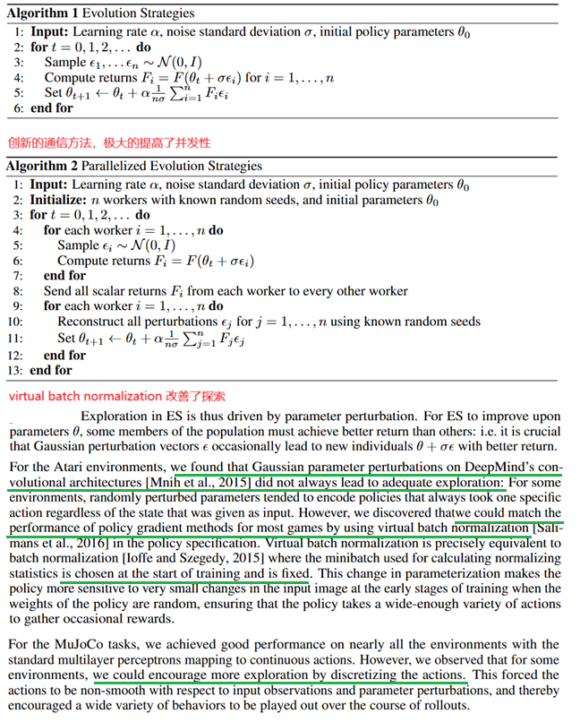

**Evolution Strategies as a Scalable Alternative to Reinforcement Learning**

### 1 Introduction

本论文的主要三个贡献：

1. 在使用 Evolution Strategies（ES）优化策略网络时，作者发现**虚拟批归一化（virtual batch normalization）**以及其他**网络参数重构方法（reparameterizations）**显著提升了算法的稳定性和可靠性。否则，ES 在某些环境中会表现得非常脆弱，难以收敛或探索。
2. 通过创新的引入一种**基于共享随机数（common random numbers）**的进程间通信方式，可以极大的提高ES方法的并行性。
3. 在 Evolution Strategies 这种完全无梯度、黑盒优化的框架下，居然只用了 3–10 倍的数据就能达到 A3C 的性能，这已经比预期好得多了。虽然数据用得多，但**每条数据的处理成本低**，整体计算量反而更小。1小时的ES训练效果相当于1天的A3C的训练效果
4.  Evolution Strategies方法 比策略梯度方法（例如TRPO）有更好的探索能力
5.  Evolution Strategies方法有很好的鲁棒性。ES 在 Atari 的所有环境中都用了同一组固定超参数（如学习率、噪声尺度、种群大小等），在 MuJoCo 中也用了另一组固定超参数（除了一个二值参数），但**没有针对每个任务做精细调参**，仍然能跑出不错的结果。

下面具体解释前三个贡献

黑盒优化方法（ES方法）有以下优点：

1. 对奖励不敏感。无论奖励是稠密的（每步都有反馈）还是稀疏的（只有终点才有奖励），黑盒方法都可以工作。因为它们只关心最终回报，不依赖梯度或 TD 误差。
2. 不需要后向传播计算梯度
3. 可以容忍很长的回合。即使任务很长（如数千步），也不会像 TD 方法那样出现梯度爆炸或消失。

尽管黑盒方法有上述优点，但在解决复杂强化学习任务时，它们通常被认为**不如 Q-learning 或 policy gradient 方法有效**。原因包括：

1. **样本效率低**：黑盒方法通常需要大量环境交互才能找到好的策略。
2. **探索效率低**：没有 value function 或策略梯度引导探索，容易陷入局部最优。
3. **缺乏结构利用**：无法利用 Bellman 方程、状态转移结构、TD 误差等强化学习特有的信息。

bison：样本效率比RL还低，那就真的太低了。

### 2 Evolution Strategies

### 3 Smoothing in parameter space versus smoothing in action space

ES 和 PG 都是通过“加噪声”来让目标函数变得可优化，但一个是在动作空间加噪声（PG），一个是在参数空间加噪声（ES）。在长时间任务、稀疏奖励、不可微环境中，ES 的参数空间平滑更稳定、更鲁棒。

### 4 Experiments

### 5、Related Work

### 6、Conclusion

The main contribution in our work is in showing that this class of algorithms（ES） is extremely scalable and efficient to use on distributed hardware. We have shown that ES, when carefully implemented, is competitive with competing RL algorithms in terms of performance on the hardest problems solvable today, and is surprisingly close in terms of data efficiency, while taking less wallclock time to train.

We have explored Evolution Strategies, a class of black-box optimization algorithms, as an alternative to popular MDP-based RL techniques such as Q-learning and policy gradients. Experiments on Atari and MuJoCo show that it is a viable option with some attractive features: 

1. it is invariant to action frequency and delayed rewards, 
2. and it does not need temporal discounting or value function approximation. 
3. Most importantly, ES is highly parallelizable, which allows us to make up for a decreased data efficiency by scaling to more parallel workers. 

In future work, we plan to apply evolution strategies to those problems for which MDP-based reinforcement learning is less well-suited: 

1. problems with long time horizons and complicated reward structure. 
2. We are particularly interested in meta-learning, or learning-to-learn. A proof of concept for meta-learning in an RL setting was given by Duan et al. [2016b]: Using black-box optimization we hope to be able to extend these results. 
3. We also plan to examine combining ES with fast low precision neural network implementations to fully make use of the gradient-free nature of ES.