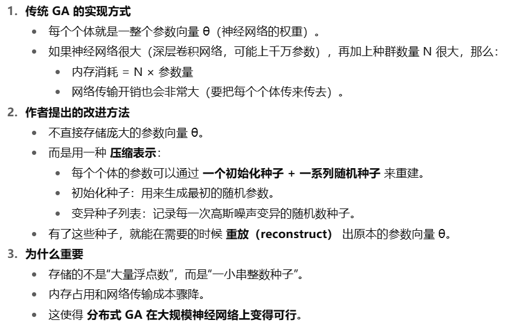
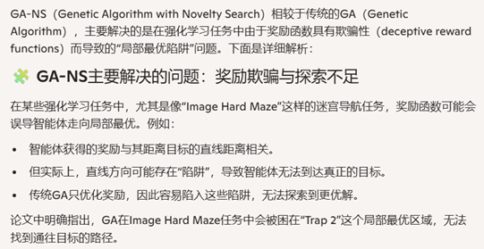
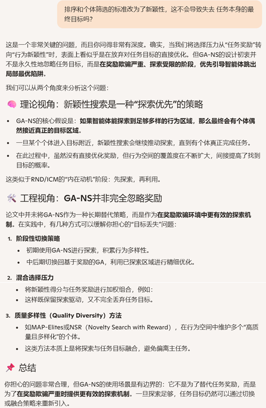

**Genetic Algorithms are a Competitive Alternative for Training Deep Neural Networks for Reinforcement Learning**

### 1 Introduction

在墙上时间方面，GA算法比Evolutionary Strategy算法还要快一点，比DQN、A3C这些标准RL算法要快很多。

同样的一台桌面服务器的硬件条件下，GA训练Atari任务需要4个小时，而同样的硬件和任务，DQN需要7-10天，A3C需要4天。

在720个CPU核的集群中，使用GA和ES训练Atari任务只需要1小时。

### 2 Background

简单介绍了DQN等RL算法和ES算法。

### 3 Method

#### 3.1 Genetic Algorithm（GA，截断选择+高斯变异+精英保留）

比较费解需要注意的是精英这个概念：

- **直观理解**：精英就是“当前最强的个体”。
- **为什么要保留精英？**
  - 如果完全依赖随机变异，有可能把当前最好的个体丢掉，导致训练倒退。
  - 所以算法规定：**每一代必须保留一个精英个体，直接复制到下一代，不做变异**。
- **怎么选精英？**
  - 精英的选择有点讲究，因为环境奖励有噪声。
  - 论文做法是：对“精英候选集”（比如当前前 9 名 + 上一代精英），再额外评估 30 次，取平均分最高的，作为“真正的精英”。
  - 这样能避免因为一次高分的偶然性把“水货”当成精英。

算法的简述：

1. **第一代**：所有个体随机初始化。
2. **评估**：每个个体跑环境，得到分数。
3. **排序**：按照分数高低排序。
4. **构造精英候选集：**
5. **精英挑选**：从精英候选集里额外测 30 次，平均分最高的作为“精英”，它直接进入下一代。
6. **父代选择**：取前 T 名作为父代。
7. **生成后代**：从父代里随机挑一个，加上高斯噪声，生成新的个体。重复直到凑满 N−1 个。再加上精英，总共 N 个体，构成新一代。
8. **进入下一代**，重复步骤 2–7。

```python
# ---------------------------
# 输入参数：
# N : 种群大小（每一代有 N 个个体）
# T : 父代数量（每一代前 T 名可作为父母）
# σ : 变异强度（高斯噪声的标准差）
# G : 最大迭代代数
# φ : 初始化方法（例如 Xavier 初始化网络参数）
# F(θ) : 评估函数，返回个体 θ 的奖励（fitness）
# ---------------------------

GA(N, T, σ, G, φ, F):

    # ---------- 第 1 代：随机初始化 ----------
    Population ← []
    for i in 1..N:
        θ_i ← φ()                # 随机初始化一个个体
        f_i ← F(θ_i)             # 评估奖励
        Population.append( (θ_i, f_i) )

    Elite ← None   # 精英初始化为空

    # ---------- 迭代多个世代 ----------
    for g in 1..G:

        # --- 1. 排序：按照奖励从高到低排序 ---
        sort Population by descending fitness

        # --- 2. 精英挑选 ---
        if g == 1:
            Candidates ← top 10 individuals in Population
        else:
            Candidates ← (top 9 individuals in Population) ∪ {Elite}
        
        # 对候选集中的每个体，额外评估 30 次，取平均值
        best_candidate ← argmax_{θ ∈ Candidates} ( average_{30 runs} F(θ) )
        Elite ← best_candidate    # 精英保留到下一代

        # --- 3. 父代选择 ---
        Parents ← top T individuals in Population

        # --- 4. 生成新一代 ---
        NewPopulation ← [Elite]   # 精英直接进入新一代（保证不会丢掉最好解）

        while len(NewPopulation) < N:
            # 随机挑选一个父代
            parent ← random choice from Parents
            # 变异（高斯噪声扰动）
            noise ← Normal(0, I)
            child ← parent + σ * noise
            # 评估奖励
            f_child ← F(child)
            NewPopulation.append( (child, f_child) )

        # --- 5. 更新种群 ---
        Population ← NewPopulation

    # ---------- 返回最终精英 ----------
    return Elite

```


**如何压缩GA算法对内存的占用？时间换空间：** 




#### 3.2 GA-NS(Novelty Search) 算法



算法描述：

1. **第一代**：所有个体随机初始化。
2. **计算行为特征 (Behavior Characterization, BC)**：每个个体运行环境，得到一个“行为特征向量”（例如走过的路径、最后位置等）。
3. **计算新颖性分数 (Novelty score)**：对每个体，找出它与 **(档案 A ∪ 当前种群)** 中最近的 k 个个体的行为特征之间的平均距离，作为新颖性。直观上：行为和别人越不一样，新颖性越高。
4. **更新档案 (Archive A)**：除精英外，每个体有概率 p=0.01 把自己的行为特征加入档案，用来鼓励多样性。
5. **排序**：按照新颖性分数从高到低排序。
6. **精英挑选**：新颖性最高的个体直接进入下一代（精英保留）。
7. **父代选择**：前 T 名作为父代。
8. **生成后代**：从父代中随机挑一个，加上高斯噪声变异，形成新的个体。重复直到凑满 N−1 个，加上精英，总共 N 个个体，构成新一代。
9. **进入下一代**：重复步骤 2–8。

伪代码：

```python
# ---------------------------
# 输入参数：
# N : 种群大小
# T : 父代数量
# σ : 变异强度（高斯噪声）
# G : 最大代数
# φ : 初始化方法
# BC(θ) : 行为特征函数（运行环境得到一个行为向量）
# η(b, S) : 新颖性函数，= b 与集合 S 中最近 k 个的平均距离
# k : 近邻数（论文常用 k=25）
# p : 将个体行为写入档案的概率（论文用 p=0.01）
# ---------------------------

GA_NS(N, T, σ, G, φ, BC, η, k, p):

    # 初始化
    Population ← []
    for i in 1..N:
        θ_i ← φ()                  # 随机初始化
        b_i ← BC(θ_i)              # 行为特征
        Population.append( (θ_i, b_i) )

    A ← ∅       # 行为档案
    Elite ← None

    # ---------- 迭代多个世代 ----------
    for g in 1..G:

        # --- 1. 计算新颖性分数 ---
        for each (θ_i, b_i) in Population:
            # 近邻集合 = 档案 ∪ 当前代所有个体（去掉自己）
            S ← (A ∪ {所有 b_j in Population}) \ {b_i}
            novelty_i ← η(b_i, S)    # 计算与最近 k 个的平均距离
            assign novelty_i to θ_i

            # 非精英个体有小概率写入档案
            if θ_i != Elite:
                with probability p:
                    A ← A ∪ {b_i}

        # --- 2. 排序 ---
        sort Population by descending novelty score

        # --- 3. 精英保留 ---
        Elite ← Population[0]   # 新颖性最高的个体，直接进入下一代

        # --- 4. 父代选择 ---
        Parents ← top T individuals in Population

        # --- 5. 生成新一代 ---
        NewPopulation ← [Elite]   # 精英直接晋级

        while len(NewPopulation) < N:
            parent ← random choice from Parents
            noise ← Normal(0, I)
            child ← parent + σ * noise
            b_child ← BC(child)        # 计算行为特征
            NewPopulation.append( (child, b_child) )

        # --- 6. 更新种群 ---
        Population ← NewPopulation

    return Elite   # 返回最后的精英个体

```

【思考】

