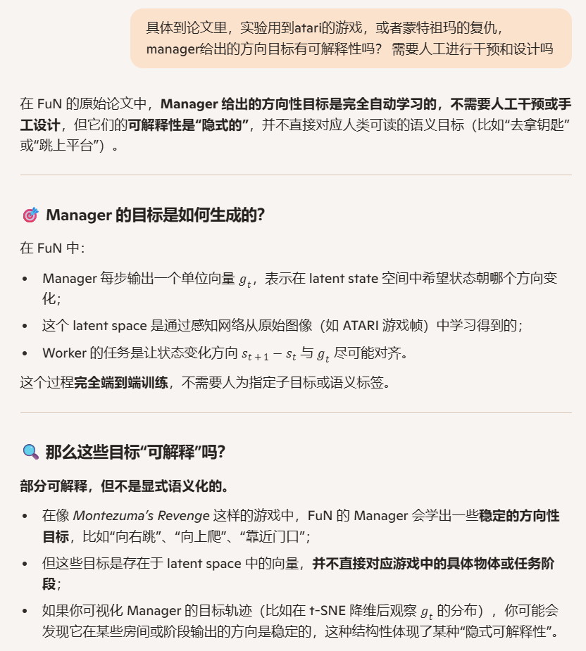

**FeUdal Networks for Hierarchical Reinforcement Learning**

### 1、Introduction


我们提出的框架受到 Dayan 和 Hinton（1993）提出的封建式强化学习（Feudal Reinforcement Learning, FRL）的启发，在该框架中，智能体内部的不同层级通过显式且明确的目标进行通信。

FRL 的一些关键思想包括：目标可以**自上而下地生成**，并且**目标的设定可以与目标的实现解耦**；也就是说，层级中的某一层只告诉下一层“要达成什么”，但**不规定“怎么做”**。让高层以**较低的时间分辨率**进行推理，会自然地将智能体的行为组织成**时间上延展的子策略（sub-policies）**。   高层不需要每一步都做决策，而是每隔一段时间设定一个方向。这样就形成了“一个目标 + 一段执行”的结构，便于学习长期策略：

1. 顶层模块 Manager 在一个由其自身学习得到的潜在状态空间中，以较低的时间分辨率设定目标。这个状态空间不是直接观察的，而是通过学习得到的内部表示
2. 底层模块 Worker 以更高的时间分辨率运行，根据从 Manager 接收到的目标来生成原始动作。
3. Worker 受到一种内在奖励的激励，以实现这些目标。
4. 然而，重要的是，Worker 和 Manager 之间**没有**梯度传播；Manager 只从环境中获取学习信号。换句话说，Manager 学习如何选择那些能最大化外部奖励的潜在目标。

我们提出的方法的主要贡献包括：

1. 一个一致的、端到端可微的模型，它体现并推广了封建式强化学习（FRL）的基本原理。
2. 一种新颖的、近似的转移策略梯度更新方法，用于训练 Manager，该方法利用了其生成目标的语义含义。
3. 所使用的目标具有方向性而非绝对性。
4. 为 Manager 设计了一种新颖的循环神经网络结构——扩张 LSTM（dilated LSTM），它延长了循环状态记忆的持续时间，并允许梯度在时间上跨越较大的跳跃，从而实现对数百步的有效反向传播。

我们的消融分析（第 5.4 节）证实，转移策略梯度和方向性目标对于获得最佳性能至关重要。我们在一系列 ATARI 游戏（包括臭名昭著的 Montezuma’s Revenge）以及多个 3D DeepMind Lab 环境中的记忆任务上进行的实验表明，FuN 在长期归因和记忆能力方面有显著提升。


### 2、Related Work

介绍了Sutton提出的options架构、FUN HRL相比option方法的优势；也提到了构造辅助的内部奖励的方法（例如ICM、RND），并提到FUN HRL和这些辅助的内部奖励方法是正交的，他们可以一起用

### 3、Method


#### 算法理解

##### 任务类型

连续动作空间 / 离散动作空间？ on-policy / off-policy ?


##### g 的可解释性



##### 内部奖励的计算方法


##### 不是插拔式的外接算法


#### 3.1 Goal Embedding

Goal的嵌入编码维度 k 远低于 内部表示的维度 d

#### 3.2 Learning


#### 3.3 Transition Policy Gradients


### 4、Architecture details

1. f_percept 由 CNN + FCN 构成，每一层都跟了非线性层
2. f_Mspace 是FCN构成，每一层都跟了非线性层
3. 为了鼓励探索，Manager每一步都有小的概率 ε 产生一个随机的goal，这个goal从高斯分布中采样
4. f_Wrnn是一个标准的LSTM网络
5. f_Mrnn是一个扩展的LSTM网络，延迟更新隐藏层，这两个rnn网络的隐藏层的维度是256
6. 在本论文的实验里，r和c都被设置为10

#### 4.1 dilated LSTM


### 5、Experiments

Baseline

1. Our main baseline is a recurrent LSTM network on top of a representation learned by a CNN. 
2. It was demonstrated to perform very well on a suite of reinforcement learning problem. 
3. LSTM uses 316 hidden units and its inputs are the feature representation of an observation and the previous action of the agent. 
4. Action probabilities and the value function estimate are regressed from its hidden state. 
5. All the methods the same CNN architecture, input pre-processing, and an action repeat of 4. 这句的意思是：
   1. 实验中所有的方法，用了相同的CNN网络结构和输入预处理方法（通道数、是否归一化、堆叠帧）
   2. 动作重复四次，这个是atari任务中常见的处理技巧，这样可以减少决策频率、加快训练速度，同时也能平滑动作效果。
6. We use the A3C method (Mnih et al.,2016) for all reinforcement learning experiments. 

补充一下RL中使用LSTM的知识：


实验效果（之一）：


### 6、Discussion and future work

训练agent 让它学会把自己的行为解构为有语义的原语并加以复用、组合成新的行为并解决问题，是一个长期的研究过程。

本论文提出的FuN HRL方法：

1. 把sub goal定义为隐藏的状态空间中的变化方向，是一种有意义的原语。
2. 把发现和设定方向的模块与执行原子动作的模块分开，形成了一种自然稳定且相互补充的层次式RL架构
3. 实验显示我们的方法在长时间轴上的归因（credit assignment）和记忆更好驾驭

这个工作为未来进一步的研究带来了很多好处，例如更深的层次架构，以应对更复杂的低奖励和部分观测的环境

### 7、Bison的实验

#### MountainCar

以为是个简单的任务，结果发现不是这样的，这个任务是每一步到奖励-1（包括即使是最后一步成功也是返回-1奖励），达到目的地就提前结束，或者最大200步的时候截断结束。

我先用PPO搞定它。

##### SB3 PPO

用默认的PPO超参数设置不能收敛，参考了SB3在hugging face上的预训练模型的参数，可以收敛到110步成功：


代码如下：

```python
from stable_baselines3 import PPO
from stable_baselines3.common.env_util import make_vec_env
from stable_baselines3.common.monitor import Monitor
import gymnasium as gym
from stable_baselines3.common.vec_env import SubprocVecEnv, VecNormalize, VecMonitor, DummyVecEnv

class MountainCarSuccessReward(gym.Wrapper):
    def __init__(self, env):
        super().__init__(env)

    def step(self, action):
        obs, reward, terminated, truncated, info = self.env.step(action)

        if terminated and obs[0] >= 0.5:
            info['is_success'] = True
            #reward = 1.0  # 成功回合最后一步奖励设为 1
        else:
            info['is_success'] = False
            #reward = 0.0
        return obs, reward, terminated, truncated, info

global_render_mode=None

def make_env(seed):
    global  global_render_mode
    def _init():
        env = MountainCarSuccessReward(gym.make("MountainCar-v0", render_mode=global_render_mode))
        env = Monitor(env)  # 单环境监控
        env.reset(seed=seed)
        return env
    return _init

if __name__ == '__main__':

    n_envs = 16
    env = SubprocVecEnv([make_env(i) for i in range(n_envs)])
    env = VecMonitor(env)  #
    env = VecNormalize(env, norm_obs=True, norm_reward=False)  # 和 Hugging Face 模型一致

    # 创建 agent
    model = PPO("MlpPolicy", env, verbose=1, tensorboard_log='logs/',
                learning_rate=3e-4,
                n_steps=16,           # rollout 长度,出乎意料的短
                batch_size=256,
                n_epochs=4,
                gamma=0.99,
                gae_lambda=0.98,
                clip_range=0.2,
                ent_coef=0.00)
    model.learn(total_timesteps=2_000_000)
    env.save('./checkpoints/vec_normalize.pkl')
    env.close()

    global_render_mode = 'human'
    env = DummyVecEnv([make_env(0)])

    # === Step 3: 加载训练期间保存的 VecNormalize 参数 ===
    # 假设你之前保存了 VecNormalize 到路径 './vec_normalize.pkl'
    env = VecNormalize.load("./checkpoints/vec_normalize.pkl", env)

    # === Step 4: 设置为评估模式，不再更新 running stats ===
    env.training = False
    env.norm_reward = False  # 根据需要关闭 reward normalization
    env.norm_obs = True
    obs = env.reset()
    for _ in range(200):
        action, _ = model.predict(obs)
        obs, reward, done, info = env.step(action)
```

##### 手搓PPO

可以收敛，

1. 收敛的其中的关键是对obs进行归一化，也就是代码里的NormalizeWrapper。 ppo_epoch, entropy_coef等参数不是最关键的。我以为除以每个维度的最大值就可以实现归一化，试了发现没有效果，纠正了我一个认知错误。
2. 对reward做reshape：成功返回1，其他情况都返回0，也可以收敛


```python
import datetime

import gym
import torch
import torch.nn as nn
import torch.optim as optim
from torch.distributions import Categorical
from torch.utils.tensorboard import SummaryWriter
import numpy as np
from collections import deque
import random
import gymnasium as gym
import numpy as np
import pickle

class NormalizeWrapper(gym.Wrapper):
    def __init__(self, env, norm_obs=True, norm_reward=False, clip_obs=10.0, clip_reward=10.0, epsilon=1e-8):
        super().__init__(env)
        self.norm_obs = norm_obs
        self.norm_reward = norm_reward
        self.clip_obs = clip_obs
        self.clip_reward = clip_reward
        self.epsilon = epsilon

        obs_shape = self.observation_space.shape
        self.obs_rms_count = 0
        self.obs_mean = np.zeros(obs_shape, dtype=np.float32)
        self.obs_var = np.ones(obs_shape, dtype=np.float32)

        self.ret_rms_count = 0
        self.ret_mean = 0.0
        self.ret_var = 1.0

        self.ret = 0.0  # running return
        self.training = True  # if False, stop updating statistics

    def reset(self, **kwargs):
        self.ret = 0.0
        obs, info = self.env.reset(**kwargs)
        if self.norm_obs:
            self._update_obs_rms(obs)
            obs = self._normalize_obs(obs)
        return obs, info

    def step(self, action):
        obs, reward, terminated, truncated, info = self.env.step(action)
        done = terminated or truncated

        if self.norm_obs:
            self._update_obs_rms(obs)
            obs = self._normalize_obs(obs)

        if self.norm_reward:
            self.ret = self.ret * self.env.spec.reward_threshold + reward
            self._update_ret_rms(self.ret)
            reward = self._normalize_reward(reward)

        if done:
            self.ret = 0.0

        return obs, reward, terminated, truncated, info

    def _update_obs_rms(self, obs):
        if not self.training:
            return
        self.obs_rms_count += 1
        delta = obs - self.obs_mean
        self.obs_mean += delta / self.obs_rms_count
        self.obs_var += (obs - self.obs_mean) * delta

    def _update_ret_rms(self, ret):
        if not self.training:
            return
        self.ret_rms_count += 1
        delta = ret - self.ret_mean
        self.ret_mean += delta / self.ret_rms_count
        self.ret_var += (ret - self.ret_mean) * delta

    def _normalize_obs(self, obs):
        std = np.sqrt(self.obs_var / (self.obs_rms_count + 1e-8)) + self.epsilon
        obs_normalized = (obs - self.obs_mean) / std
        return np.clip(obs_normalized, -self.clip_obs, self.clip_obs)

    def _normalize_reward(self, reward):
        std = np.sqrt(self.ret_var / (self.ret_rms_count + 1e-8)) + self.epsilon
        reward_normalized = (reward - self.ret_mean) / std
        return np.clip(reward_normalized, -self.clip_reward, self.clip_reward)

    def save_stats(self, path):
        data = {
            "obs_mean": self.obs_mean,
            "obs_var": self.obs_var,
            "obs_rms_count": self.obs_rms_count,
            "ret_mean": self.ret_mean,
            "ret_var": self.ret_var,
            "ret_rms_count": self.ret_rms_count
        }
        with open(path, "wb") as f:
            pickle.dump(data, f)

    def load_stats(self, path):
        with open(path, "rb") as f:
            data = pickle.load(f)
        self.obs_mean = data["obs_mean"]
        self.obs_var = data["obs_var"]
        self.obs_rms_count = data["obs_rms_count"]
        self.ret_mean = data["ret_mean"]
        self.ret_var = data["ret_var"]
        self.ret_rms_count = data["ret_rms_count"]

# ============================ 超参数配置 ============================
class Args:
    env_id = "MountainCar-v0"
    device = torch.device("cuda:0" if torch.cuda.is_available() else "cpu")
    seed = 42

    hidden_dim = 128
    lr = 3e-4
    gamma = 0.99
    gae_lambda = 0.98
    eps_clip = 0.20
    entropy_coef = 0.01
    vf_coef = 0.5
    max_grad_norm = 0.5

    rollout_steps = 1024 # 更快的更新
    mini_batch_size = 256
    ppo_epochs = 10

    max_rollout_num = 2000
    eval_every = 100
    eval_episodes = 10


    log_dir = f"./logs/ppo_mountaincar_{datetime.datetime.now().strftime('%m%d_%H%M%S')}"

args = Args()
writer = SummaryWriter(args.log_dir)
random.seed(args.seed)
np.random.seed(args.seed)
torch.manual_seed(args.seed)

# ============================ Actor-Critic 网络 ============================
class ActorCritic(nn.Module):
    def __init__(self, obs_dim, action_dim):
        super().__init__()
        self.shared = nn.Sequential(
            nn.Linear(obs_dim, args.hidden_dim),
            nn.Tanh(),
        )
        self.actor = nn.Sequential(
            nn.Linear(args.hidden_dim, args.hidden_dim),
            nn.Tanh(),
            nn.Linear(args.hidden_dim, action_dim),
        )
        self.critic = nn.Sequential(
            nn.Linear(args.hidden_dim, args.hidden_dim),
            nn.Tanh(),
            nn.Linear(args.hidden_dim, 1),
        )

    def forward(self, x):
        x = self.shared(x)
        logits = self.actor(x)
        value = self.critic(x)
        return logits, value

# ============================ PPO Agent 封装 ============================
class PPOAgent:
    def __init__(self, obs_dim, action_dim):
        self.net = ActorCritic(obs_dim, action_dim).to(args.device)
        self.optimizer = optim.Adam(self.net.parameters(), lr=args.lr)

    def get_action(self, obs):
        obs = torch.tensor(obs, dtype=torch.float32).to(args.device)
        logits, value = self.net(obs)
        probs = torch.softmax(logits, dim=-1)
        dist = Categorical(probs)
        action = dist.sample()
        return action.item(), dist.log_prob(action), dist.entropy(), value.squeeze()

    def evaluate(self, obs, actions):
        logits, values = self.net(obs)
        probs = torch.softmax(logits, dim=-1)
        dist = Categorical(probs)
        log_probs = dist.log_prob(actions)
        entropy = dist.entropy()
        return log_probs, entropy, values.squeeze()

# ============================ GAE Advantage 计算 ============================
def compute_gae(rewards, values, dones, next_value):
    advantages = []
    gae = 0
    values = values + [next_value]
    for t in reversed(range(len(rewards))):
        delta = rewards[t] + args.gamma * values[t + 1] * (1 - dones[t]) - values[t]
        gae = delta + args.gamma * args.gae_lambda * (1 - dones[t]) * gae
        advantages.insert(0, gae)
    returns = [adv + val for adv, val in zip(advantages, values[:-1])]
    return advantages, returns

# ============================ 评估函数 ============================
def evaluate(agent, env):
    total_rewards = []
    success = 0
    for _ in range(args.eval_episodes):
        obs, _ = env.reset()
        total = 0
        for _ in range(200):
            obs_tensor = torch.tensor(obs, dtype=torch.float32).unsqueeze(0).to(args.device)
            with torch.no_grad():
                logits, _ = agent.net(obs_tensor)
            action = torch.argmax(logits, dim=-1).item()
            obs, reward, term, trunc, _ = env.step(action)
            total += reward
            if term or trunc:
                break
        total_rewards.append(total)
        if obs[0] >= 0.5:
            success += 1
    return np.mean(total_rewards), success / args.eval_episodes

# ============================ 主训练循环 ============================
def train():
    env = gym.make(args.env_id)
    env = NormalizeWrapper(env)
    obs_dim = env.observation_space.shape[0]
    action_dim = env.action_space.n
    agent = PPOAgent(obs_dim, action_dim)

    obs, _ = env.reset()
    rollout_num = 0
    episode_num = 0
    ep_reward = 0

    while rollout_num < args.max_rollout_num:
        # rollout buffer
        obs_buf, act_buf, logp_buf, rew_buf, val_buf, done_buf, ent_buf = [], [], [], [], [], [], []

        for _ in range(args.rollout_steps):
            action, logp, entropy, value = agent.get_action(obs)
            next_obs, reward, term, trunc, _ = env.step(action)
            ep_reward += reward

            obs_buf.append(obs)
            act_buf.append(action)
            logp_buf.append(logp)
            rew_buf.append(reward)
            val_buf.append(value.item())
            done_buf.append(term or trunc)
            ent_buf.append(entropy.item())

            obs = next_obs
            if term or trunc:
                obs, _ = env.reset()
                episode_num += 1
                writer.add_scalar("train/ep_reward", ep_reward, episode_num)
                ep_reward = 0

        rollout_num += 1

        with torch.no_grad():
            obs_tensor = torch.tensor(obs, dtype=torch.float32).unsqueeze(0).to(args.device)
            _, next_value = agent.net(obs_tensor)

        advs, rets = compute_gae(rew_buf, val_buf, done_buf, next_value.item())
        advs = torch.tensor(advs, dtype=torch.float32).to(args.device)
        advs = (advs - advs.mean()) / (advs.std() + 1e-8)
        rets = torch.tensor(rets, dtype=torch.float32).to(args.device)

        obs_tensor = torch.tensor(obs_buf, dtype=torch.float32).to(args.device)
        act_tensor = torch.tensor(act_buf, dtype=torch.int64).to(args.device)
        old_logp_tensor = torch.stack(logp_buf).detach().to(args.device)

        for _ in range(args.ppo_epochs):
            idxs = np.arange(len(obs_buf))
            np.random.shuffle(idxs)
            for start in range(0, len(obs_buf), args.mini_batch_size):
                end = start + args.mini_batch_size
                mb_idx = idxs[start:end]

                mb_obs = obs_tensor[mb_idx]
                mb_act = act_tensor[mb_idx]
                mb_adv = advs[mb_idx]
                mb_ret = rets[mb_idx]
                mb_old_logp = old_logp_tensor[mb_idx]

                logp, entropy, value = agent.evaluate(mb_obs, mb_act)
                ratio = torch.exp(logp - mb_old_logp)
                surr1 = ratio * mb_adv
                surr2 = torch.clamp(ratio, 1 - args.eps_clip, 1 + args.eps_clip) * mb_adv
                policy_loss = -torch.min(surr1, surr2).mean()
                value_loss = ((mb_ret - value) ** 2).mean()
                entropy_bonus = entropy.mean()

                loss = policy_loss + args.vf_coef * value_loss - args.entropy_coef * entropy_bonus

                agent.optimizer.zero_grad()
                loss.backward()
                nn.utils.clip_grad_norm_(agent.net.parameters(), args.max_grad_norm)
                agent.optimizer.step()

        writer.add_scalar("train/loss_policy", policy_loss.item(), rollout_num)
        writer.add_scalar("train/loss_value", value_loss.item(), rollout_num)
        writer.add_scalar("train/entropy", np.mean(ent_buf), rollout_num)

        if rollout_num % args.eval_every == 0:
            avg_rew, success = evaluate(agent, env)
            print(f"[Ep {rollout_num}] Eval Reward: {avg_rew:.2f} | Success Rate: {success:.1%}")
            writer.add_scalar("eval/avg_reward", avg_rew, rollout_num)
            writer.add_scalar("eval/success_rate", success, rollout_num)

    env.close()
    writer.close()

# ============================ 程序入口 ============================
if __name__ == "__main__":
    train()
```

##### FuN HRL

这里的FuN实现，Manager和Worker都只用了朴素的REINFORCE算法。受限于REINFORCE算法本身的局限性（高方差不稳定、样本效率低等），训练的效果并不好。可能需要把PPO等算法更好的实践融汇进来，例如实现：

1.  Manager 使用 TD-style 更新（带 value 网络）

2.  Worker 使用 PPO（含 clipped surrogate objective）

3.  内部结构保持感知模块共享

4.  reward shaping 沿用可调的 intrinsic/extrinsic 模块

5.  保留 GRU 结构，兼容 goal stacking

   

有一些成功的回合，但是效果明显不好：


```python
import datetime

import gymnasium as gym
import numpy as np
import torch
import torch.nn as nn
import torch.optim as optim
from torch.utils.tensorboard import SummaryWriter
import torch.nn.functional as F
from collections import deque
import random
import time
class NormalizeWrapper(gym.Wrapper):
    def __init__(self, env, norm_obs=True, norm_reward=False, clip_obs=10.0, clip_reward=10.0, epsilon=1e-8):
        super().__init__(env)
        self.norm_obs = norm_obs
        self.norm_reward = norm_reward
        self.clip_obs = clip_obs
        self.clip_reward = clip_reward
        self.epsilon = epsilon

        obs_shape = self.observation_space.shape
        self.obs_rms_count = 0
        self.obs_mean = np.zeros(obs_shape, dtype=np.float32)
        self.obs_var = np.ones(obs_shape, dtype=np.float32)

        self.ret_rms_count = 0
        self.ret_mean = 0.0
        self.ret_var = 1.0

        self.ret = 0.0  # running return
        self.training = True  # if False, stop updating statistics

    def reset(self, **kwargs):
        self.ret = 0.0
        obs, info = self.env.reset(**kwargs)
        if self.norm_obs:
            self._update_obs_rms(obs)
            obs = self._normalize_obs(obs)
        return obs, info

    def step(self, action):
        obs, reward, terminated, truncated, info = self.env.step(action)
        done = terminated or truncated

        if self.norm_obs:
            self._update_obs_rms(obs)
            obs = self._normalize_obs(obs)

        if self.norm_reward:
            self.ret = self.ret * self.env.spec.reward_threshold + reward
            self._update_ret_rms(self.ret)
            reward = self._normalize_reward(reward)

        if done:
            self.ret = 0.0

        return obs, reward, terminated, truncated, info

    def _update_obs_rms(self, obs):
        if not self.training:
            return
        self.obs_rms_count += 1
        delta = obs - self.obs_mean
        self.obs_mean += delta / self.obs_rms_count
        self.obs_var += (obs - self.obs_mean) * delta

    def _update_ret_rms(self, ret):
        if not self.training:
            return
        self.ret_rms_count += 1
        delta = ret - self.ret_mean
        self.ret_mean += delta / self.ret_rms_count
        self.ret_var += (ret - self.ret_mean) * delta

    def _normalize_obs(self, obs):
        std = np.sqrt(self.obs_var / (self.obs_rms_count + 1e-8)) + self.epsilon
        obs_normalized = (obs - self.obs_mean) / std
        return np.clip(obs_normalized, -self.clip_obs, self.clip_obs)

    def _normalize_reward(self, reward):
        std = np.sqrt(self.ret_var / (self.ret_rms_count + 1e-8)) + self.epsilon
        reward_normalized = (reward - self.ret_mean) / std
        return np.clip(reward_normalized, -self.clip_reward, self.clip_reward)


# ===== Config and Device =====
class Args:
    env_id = 'MountainCar-v0'
    max_episodes = 2000
    max_steps = 200
    manager_interval = 10  # c in the paper
    dilated_interval = 10
    gamma_worker = 0.99
    gamma_manager = 0.99
    intrinsic_reward_weight = 100 #根据对内外returns的值的观察，得出这样一个weight，让他们两者的值在同一个量级
    lr_worker = 1e-3
    lr_manager = 5e-4
    eval_every = 50
    eval_episodes = 5
    hidden_dim = 128
    embed_dim = 16
    seed = 42
    device = torch.device('cuda:0' if torch.cuda.is_available() else 'cpu')


writer = SummaryWriter(f"logs/MountainCar_FuN_{datetime.datetime.now().strftime('%m%d_%H%M%S')}")


# ===== Utils =====
def cosine_similarity(a, b):
    a_norm = F.normalize(a, dim=-1)
    b_norm = F.normalize(b, dim=-1)
    return torch.sum(a_norm * b_norm, dim=-1)


def discount_rewards(rewards, gamma):
    R = 0
    returns = []
    for r in reversed(rewards):
        R = r + gamma * R
        returns.insert(0, R)
    return returns


# ===== Modules =====
class PerceptualModule(nn.Module):
    def __init__(self, input_dim, hidden_dim):
        super().__init__()
        self.fc = nn.Sequential(
            nn.Linear(input_dim, hidden_dim),
            nn.ReLU()
        )

    def forward(self, x):
        return self.fc(x)


class Manager(nn.Module):
    def __init__(self, hidden_dim):
        super().__init__()
        self.f_mspace = nn.Linear(hidden_dim, hidden_dim)
        self.rnn = nn.GRUCell(hidden_dim, hidden_dim)
        self.goal_fc = nn.Linear(hidden_dim, hidden_dim)

    def forward(self, z, h):
        assert z.shape[0] == 1, "batch size should be 1 exactly."
        s = F.relu(self.f_mspace(z))
        h = self.rnn(s, h)
        g_hat = self.goal_fc(h)
        g = F.normalize(g_hat, dim=-1)
        return g, h, s


class Worker(nn.Module):
    def __init__(self, hidden_dim, action_dim, embed_dim):
        super().__init__()
        self.rnn = nn.GRUCell(hidden_dim, hidden_dim)
        self.embed = nn.Linear(hidden_dim, embed_dim, bias=False)
        self.U = nn.Linear(hidden_dim, action_dim * embed_dim, bias=False)
        self.action_dim = action_dim
        self.embed_dim = embed_dim
        self.hidden_dim = hidden_dim

    def forward(self, z, h, goal_stack):
        assert z.shape[0] == 1, "batch size should be 1 exactly."
        h = self.rnn(z, h)
        g_sum = torch.sum(goal_stack, dim=0)
        w = self.embed(g_sum)
        U_out = self.U(h).view(self.action_dim, self.embed_dim)
        logits = torch.matmul(U_out, w)
        probs = F.softmax(logits, dim=-1)
        return probs, h


# ===== Agent =====
class FuNAgent:
    def __init__(self, env):
        obs_dim = env.observation_space.shape[0]
        action_dim = env.action_space.n

        self.percept = PerceptualModule(obs_dim, Args.hidden_dim).to(Args.device)
        self.manager = Manager(Args.hidden_dim).to(Args.device)
        self.worker = Worker(Args.hidden_dim, action_dim, Args.embed_dim).to(Args.device)

        self.optim_manager = optim.Adam(self.manager.parameters(), lr=Args.lr_manager)
        self.optim_worker = optim.Adam(list(self.worker.parameters()) + list(self.percept.parameters()),
                                       lr=Args.lr_worker)

    # manager内部的前向传播已经完成，并把g保存到goal_stack了，
    # 也完成了obs到z的转换
    def select_action(self, z, h_worker, goal_stack):
        probs, h_new = self.worker(z, h_worker, goal_stack)
        dist = torch.distributions.Categorical(probs)
        action = dist.sample()
        return action.item(), dist.log_prob(action), h_new

    def compute_manager_loss(self, s_list, g_list, R_list):
        losses = []
        for t in range(len(g_list)):
            if t + Args.manager_interval >= len(s_list):
                continue
            st = s_list[t]
            st_c = s_list[t + Args.manager_interval]
            gt = g_list[t]
            cos_sim = cosine_similarity(st_c - st, gt)
            advantage = R_list[t]  # using REINFORCE style, baseline omitted
            losses.append(-advantage * cos_sim)
        return torch.stack(losses).mean()

    def compute_worker_loss(self, log_probs, advantages):
        log_probs = torch.stack(log_probs)
        return -(log_probs * advantages).mean()

    def reshape_external_reward(self, reward):
        '''if reward == -1:
            reward = 0
        else:
            reward = 1'''
        return reward

    def evaluate(self, env):
        rewards = []
        for _ in range(Args.eval_episodes):
            obs, _ = env.reset()
            done = False
            total = 0
            step = 0
            h = torch.zeros(1, Args.hidden_dim).to(Args.device)
            dilated_h = torch.zeros(Args.dilated_interval, Args.hidden_dim).to(Args.device)
            goal_stack = deque([torch.zeros(Args.hidden_dim).to(Args.device)] * Args.manager_interval,
                               maxlen=Args.manager_interval)
            while not done:
                with torch.no_grad():
                    obs_tensor = torch.FloatTensor(obs).unsqueeze(0).to(Args.device)
                    z = self.percept(obs_tensor)

                    h_M = dilated_h[step % Args.dilated_interval]
                    g, h_M, st = self.manager(z, h_M.unsqueeze(0))
                    g = g.squeeze(0)
                    h_M = h_M.squeeze(0)
                    st = st.squeeze(0)
                    dilated_h[step % Args.dilated_interval] = h_M

                    goal_stack.append(g.detach().clone())
                    action, _, h = self.select_action(z, h, torch.stack(list(goal_stack)))
                obs, reward, term, trunc, _ = env.step(action)
                reward = self.reshape_external_reward(reward)
                done = term or trunc
                step += 1
                total += reward
            rewards.append(total)
        return np.mean(rewards)


# ===== Main Training Loop =====
def train():
    env = gym.make(Args.env_id)
    env = NormalizeWrapper(env)
    torch.manual_seed(Args.seed)
    np.random.seed(Args.seed)
    random.seed(Args.seed)
    agent = FuNAgent(env)

    for episode in range(Args.max_episodes):
        obs, _ = env.reset()
        h = torch.zeros(1, Args.hidden_dim).to(Args.device)
        dilated_h = torch.zeros(Args.dilated_interval, Args.hidden_dim).to(Args.device)
        done = False
        step = 0
        # last c goal smoothing window 滑动窗口
        goal_stack = deque([torch.zeros(Args.hidden_dim).to(Args.device)] * Args.manager_interval,
                           maxlen=Args.manager_interval)

        s_list, g_list, r_list = [], [], []
        log_probs = []
        intrinsic_rewards = []

        while not done and step < Args.max_steps:

            # f_percept前向传播
            obs_tensor = torch.FloatTensor(obs).unsqueeze(0).to(Args.device)
            z = agent.percept(obs_tensor)

            # manager内部的前向传播
            h_M = dilated_h[step % Args.dilated_interval]
            g, h_M, st = agent.manager(z.detach(), h_M.unsqueeze(0))  # z前面的梯度不归manager管，所以用detach截断
            g = g.squeeze(0)
            h_M = h_M.squeeze(0)
            st = st.squeeze(0)
            # 为了避免破坏梯度计算图，复制一份dilated_h用于更新
            new_dilated_h = dilated_h.clone()
            new_dilated_h[step % Args.dilated_interval] = h_M
            dilated_h = new_dilated_h

            goal_stack.append(g.detach().clone())

            action, log_prob, h = agent.select_action(z, h, torch.stack(list(goal_stack)))
            next_obs, reward, term, trunc, _ = env.step(action)
            reward = agent.reshape_external_reward(reward)
            done = term or trunc

            s_list.append(st)
            g_list.append(g)
            log_probs.append(log_prob)

            # compute intrinsic reward
            # 当前 step 是否已经超过 manager 的时间分辨率（c步）
            if step >= Args.manager_interval:
                # 取当前状态的嵌入向量 z（即 s_t），以及 c 步前的状态 s_{t-c}
                # 再构造方向向量：s_t - s_{t-c}
                direction = st - s_list[step - Args.manager_interval]

                # 取 c 步前的目标向量 g_{t-c}
                goal = g_list[step - Args.manager_interval]

                # 计算这个方向向量与目标 g 之间的余弦相似度，作为“是否遵循目标方向”的指标
                # cosine_similarity 越大，说明 Worker 的轨迹越符合 Manager 当时设定的目标方向
                cos = cosine_similarity(direction, goal)
            else:
                # 前期步数不足，无法计算方向和目标之间的一致性，所以设为0
                cos = torch.tensor(0.0).to(Args.device)
            intrinsic_rewards.append(cos.item())
            r_list.append(reward)

            obs = next_obs
            step += 1
        #######################################################
        # 更新worker
        # worker 的 Advantage来自外部奖励和内部奖励, loss= -A*log_prob
        ext_returns = discount_rewards(r_list, Args.gamma_worker)
        int_returns = discount_rewards(intrinsic_rewards, Args.gamma_worker)
        worker_returns = [er + Args.intrinsic_reward_weight * ir for er, ir in zip(ext_returns, int_returns)]
        # 归一化
        worker_returns = torch.FloatTensor(worker_returns).to(Args.device)
        worker_returns = (worker_returns - worker_returns.mean()) / (worker_returns.std() + 1e-8)
        worker_loss = agent.compute_worker_loss(log_probs, worker_returns)

        agent.optim_worker.zero_grad()
        worker_loss.backward()
        agent.optim_worker.step()

        #######################################################
        # 更新manager
        # manager 的 Advantage来自外部奖励， loss = - cos() * A
        manager_returns = discount_rewards(r_list, Args.gamma_manager)
        manager_returns = torch.FloatTensor(manager_returns).to(Args.device)
        manager_returns = (manager_returns - manager_returns.mean()) / (manager_returns.std() + 1e-8)
        manager_loss = agent.compute_manager_loss(s_list, g_list, manager_returns)

        agent.optim_manager.zero_grad()
        manager_loss.backward()
        agent.optim_manager.step()

        writer.add_scalar("train/loss_manager", manager_loss.item(), episode)
        writer.add_scalar("train/loss_worker", worker_loss.item(), episode)
        writer.add_scalar("train/episode_total_reward", sum(r_list), episode)
        writer.add_scalar("train/intrinsic_rew_mean", np.mean(intrinsic_rewards), episode)
        writer.add_scalar("train/episode_len", step, episode)

        if episode % Args.eval_every == 0:
            avg_reward = agent.evaluate(env)
            print(f"[Episode {episode}] Eval reward: {avg_reward}")
            writer.add_scalar("eval/avg_reward", avg_reward, episode)

    env.close()
    writer.close()


if __name__ == "__main__":
    train()

```

