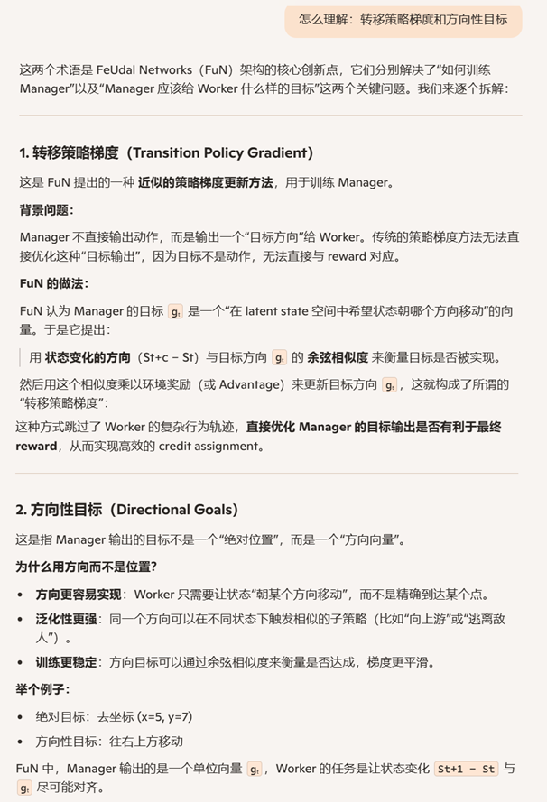

**FeUdal Networks for Hierarchical Reinforcement Learning**

### 1、Introduction

我们提出的框架受到 Dayan 和 Hinton（1993）提出的封建式强化学习（Feudal Reinforcement Learning, FRL）的启发，在该框架中，智能体内部的不同层级通过显式且明确的目标进行通信。

FRL 的一些关键思想包括：目标可以**自上而下地生成**，并且**目标的设定可以与目标的实现解耦**；也就是说，层级中的某一层只告诉下一层“要达成什么”，但**不规定“怎么做”**。让高层以**较低的时间分辨率**进行推理，会自然地将智能体的行为组织成**时间上延展的子策略（sub-policies）**。   高层不需要每一步都做决策，而是每隔一段时间设定一个方向。这样就形成了“一个目标 + 一段执行”的结构，便于学习长期策略：

1. 顶层模块 Manager 在一个由其自身学习得到的潜在状态空间中，以较低的时间分辨率设定目标。这个状态空间不是直接观察的，而是通过学习得到的内部表示
2. 底层模块 Worker 以更高的时间分辨率运行，根据从 Manager 接收到的目标来生成原始动作。
3. Worker 受到一种内在奖励的激励，以实现这些目标。
4. 然而，重要的是，Worker 和 Manager 之间**没有**梯度传播；Manager 只从环境中获取学习信号。换句话说，Manager 学习如何选择那些能最大化外部奖励的潜在目标。

我们提出的方法的主要贡献包括：

1. 一个一致的、端到端可微的模型，它体现并推广了封建式强化学习（FRL）的基本原理。
2. 一种新颖的、近似的转移策略梯度更新方法，用于训练 Manager，该方法利用了其生成目标的语义含义。
3. 所使用的目标具有方向性而非绝对性。
4. 为 Manager 设计了一种新颖的循环神经网络结构——扩张 LSTM（dilated LSTM），它延长了循环状态记忆的持续时间，并允许梯度在时间上跨越较大的跳跃，从而实现对数百步的有效反向传播。

我们的消融分析（第 5.4 节）证实，转移策略梯度和方向性目标对于获得最佳性能至关重要。我们在一系列 ATARI 游戏（包括臭名昭著的 Montezuma’s Revenge）以及多个 3D DeepMind Lab 环境中的记忆任务上进行的实验表明，FuN 在长期归因和记忆能力方面有显著提升。

### 2、Related Work

介绍了Sutton提出的options架构、FUN HRL相比option方法的优势；也提到了构造辅助的内部奖励的方法（例如ICM、RND），并提到FUN HRL和这些辅助的内部奖励方法是正交的，他们可以一起用

### 3、Method

#### 3.1 Goal Embedding

Goal的嵌入编码维度 k 远低于 内部表示的维度 d

#### 3.2 Learning

#### 3.3 Transition Policy Gradients

