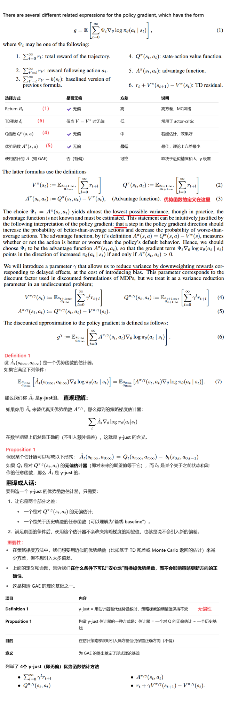
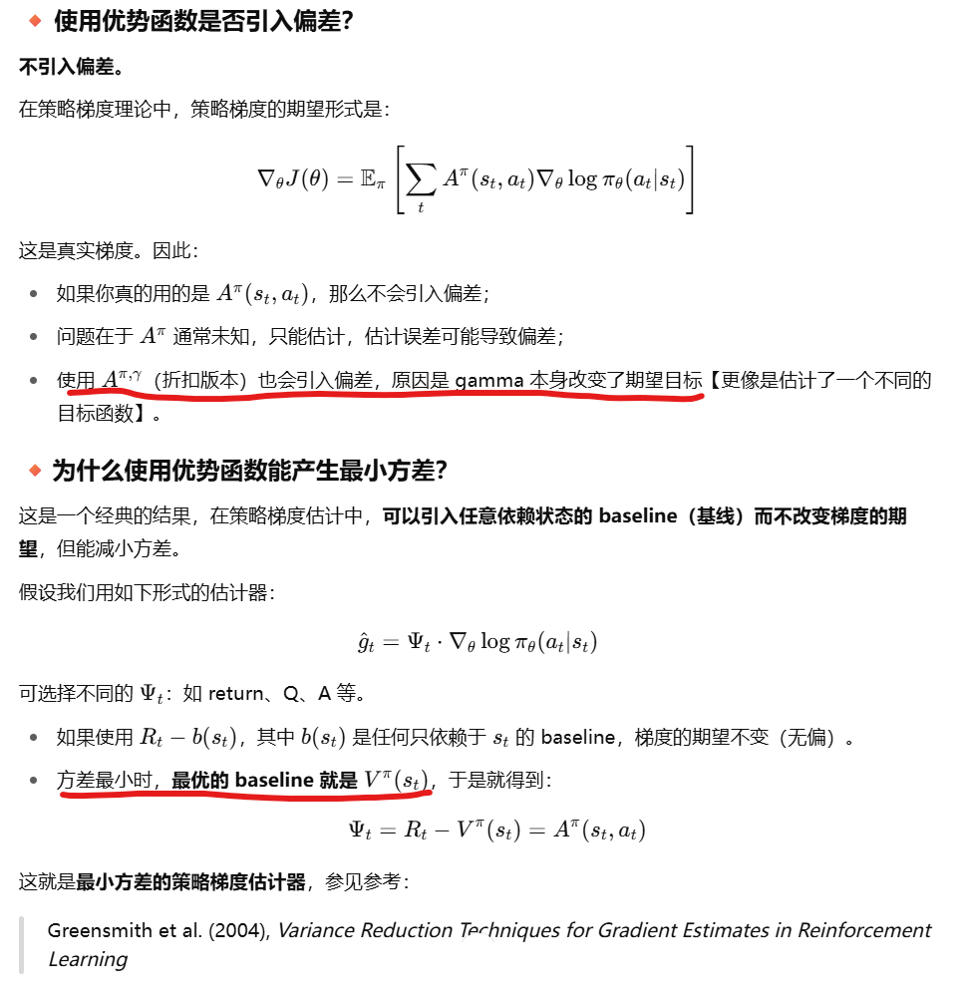
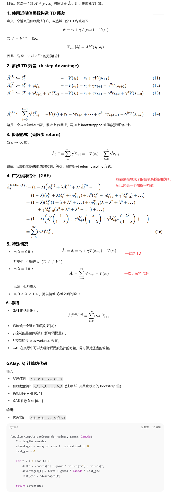
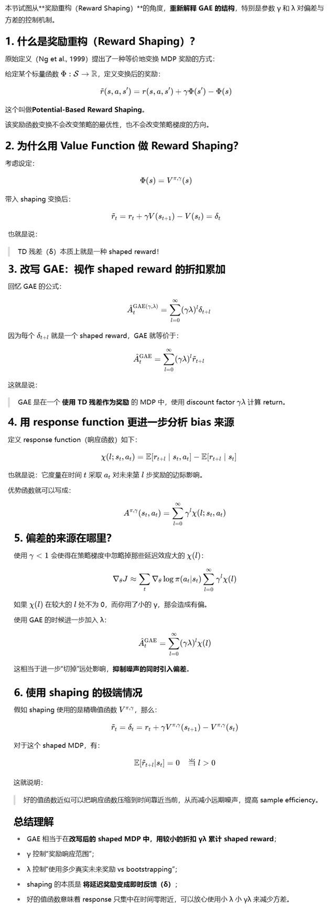
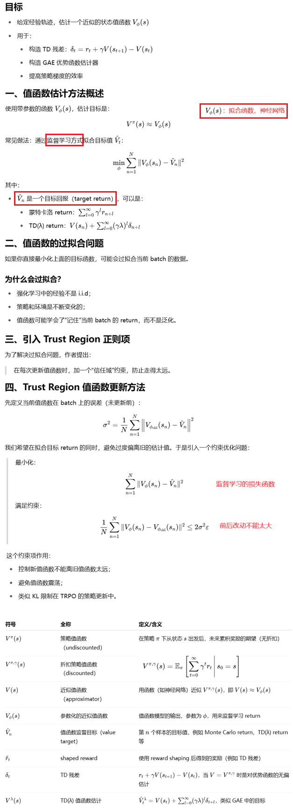
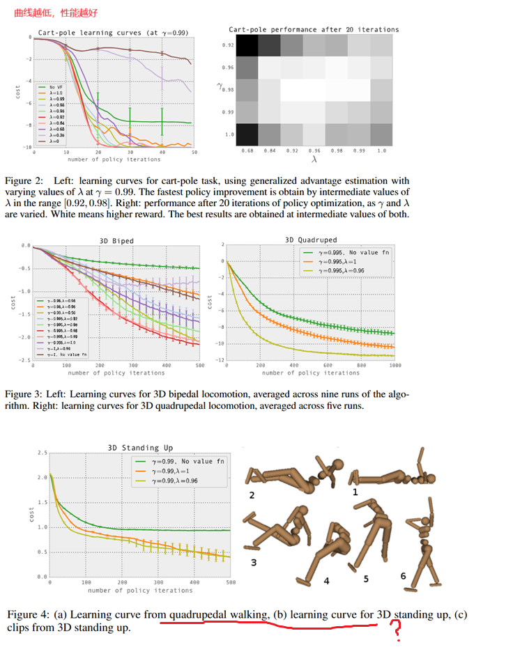

**HIGH-DIMENSIONAL CONTINUOUS CONTROL USING GENERALIZED ADVANTAGE ESTIMATION**

### 1、Introduction

1. A key source of difficulty is the long time delay between actions and their positive or negative effect on rewards; this issue is called the credit assignment problem in the reinforcement learning literature.
2. Value functions offer an elegant solution to the credit assignment problem—they allow us to estimate the goodness of an action before the delayed reward arrives.
3. When using a parameterized stochastic policy, it is possible to obtain an unbiased estimate of the gradient of the expected total returns. Unfortunately,the variance of the gradient estimator scales unfavorably with the time horizon.
4.  Another class of policy gradient algorithms, called actor-critic methods, use a value function rather than the empirical returns, obtaining an estimator with lower variance at the cost of introducing bias. But while high variance necessitates using more samples, bias is more pernicious(有害)—even with an unlimited number of samples, bias can cause the algorithm to fail to con-
   verge, or to converge to a poor solution that is not even a local optimum.
5. We propose a family of policy gradient estimators that significantly reduce variance while maintaining a tolerable level of bias. We call this estimation scheme the generalized advantage estimator (GAE),  which is applicable in both the online and batch settings.

### 2、Preliminaries

1. 使用优势函数产生最少的方差，但在实际操作中不可知只能靠估计。（折扣gamma引入的本意也是减少方差，但它是有偏的）
2. 只能对优势函数做各种估计，达到平衡 方差和偏差的目的

### 3、ADVANTAGE FUNCTION ESTIMATION

### 4、INTERPRETATION AS REWARD SHAPING

这章节没有怎么看懂

### 5、 VALUE FUNCTION ESTIMATION

### 6、Expertiments

重要结论：

1. **λ 和 γ 都取中高值时效果最佳**：
   1. 最优区域大约集中在 λ ≈ 0.92 ~ 0.98，γ ≈ 0.97 ~ 0.995；
   2. λ 太小（如 0）或太大（如 1）性能下降；
2. **方差 vs 偏差折中非常明显**：
   1. λ = 1（即纯 Monte Carlo return）方差大，效果不如中等 λ；
   2. λ = 0（纯 TD）偏差大，也学不好；
3. γ 的影响也类似，γ 太小会忽略远期奖励，性能下降。

### 7、Discussion