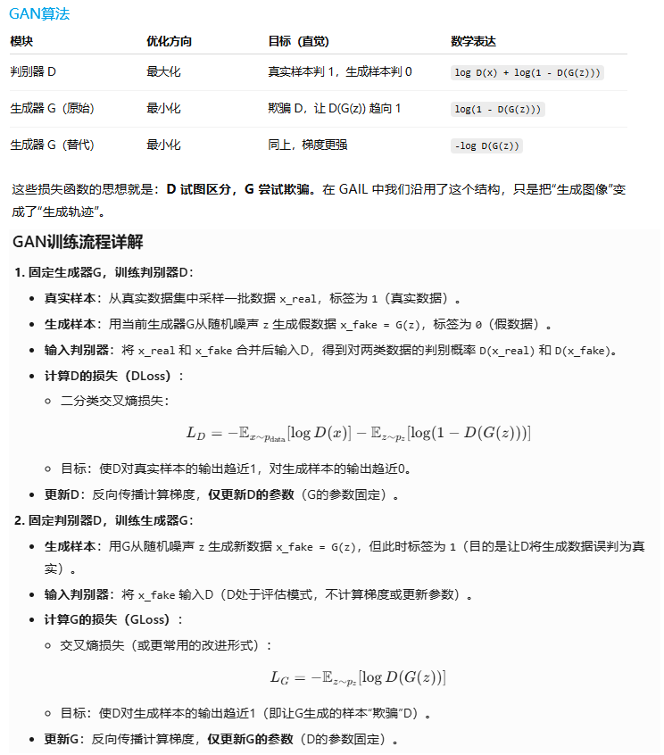
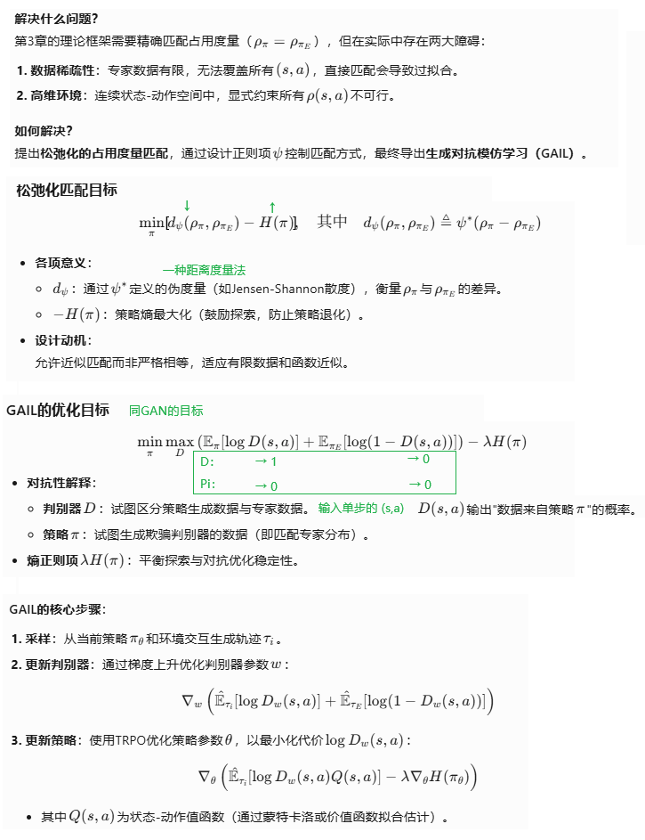
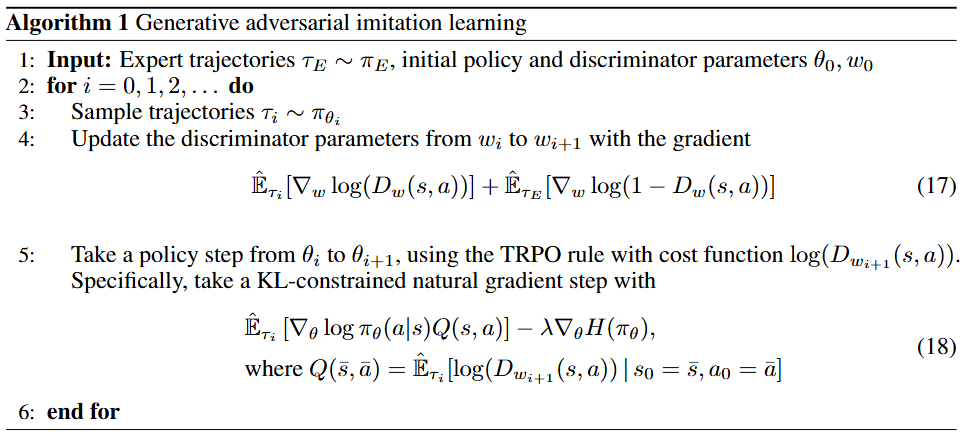
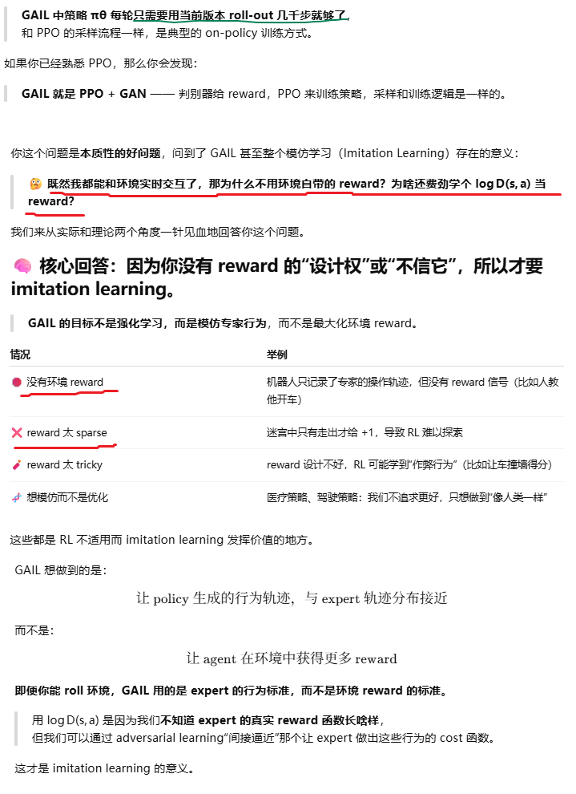
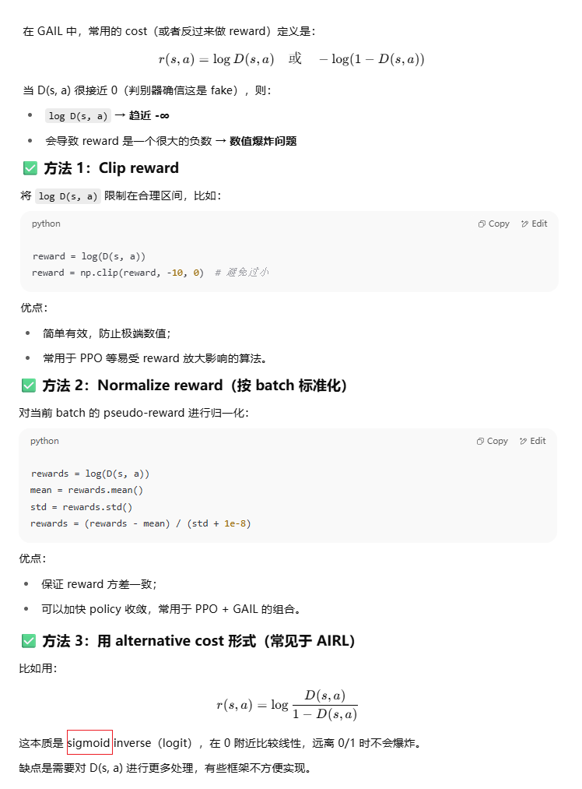
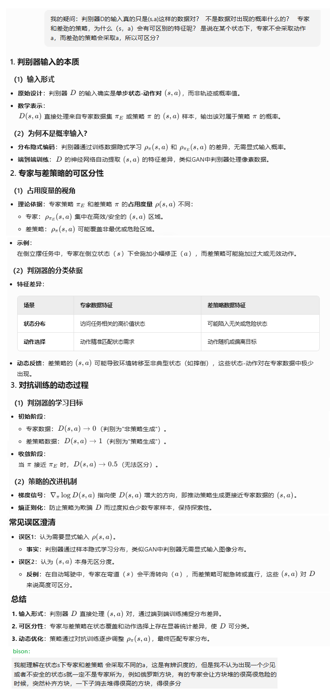
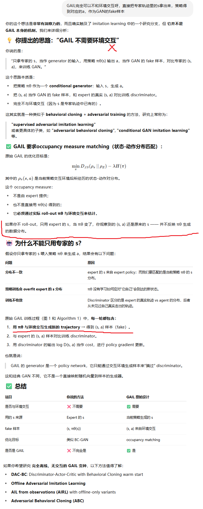
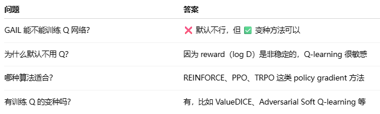
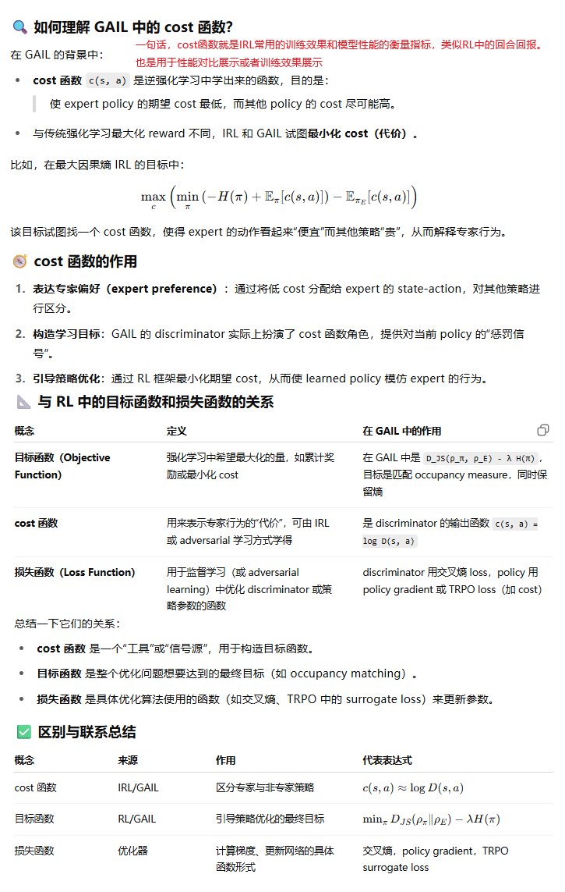
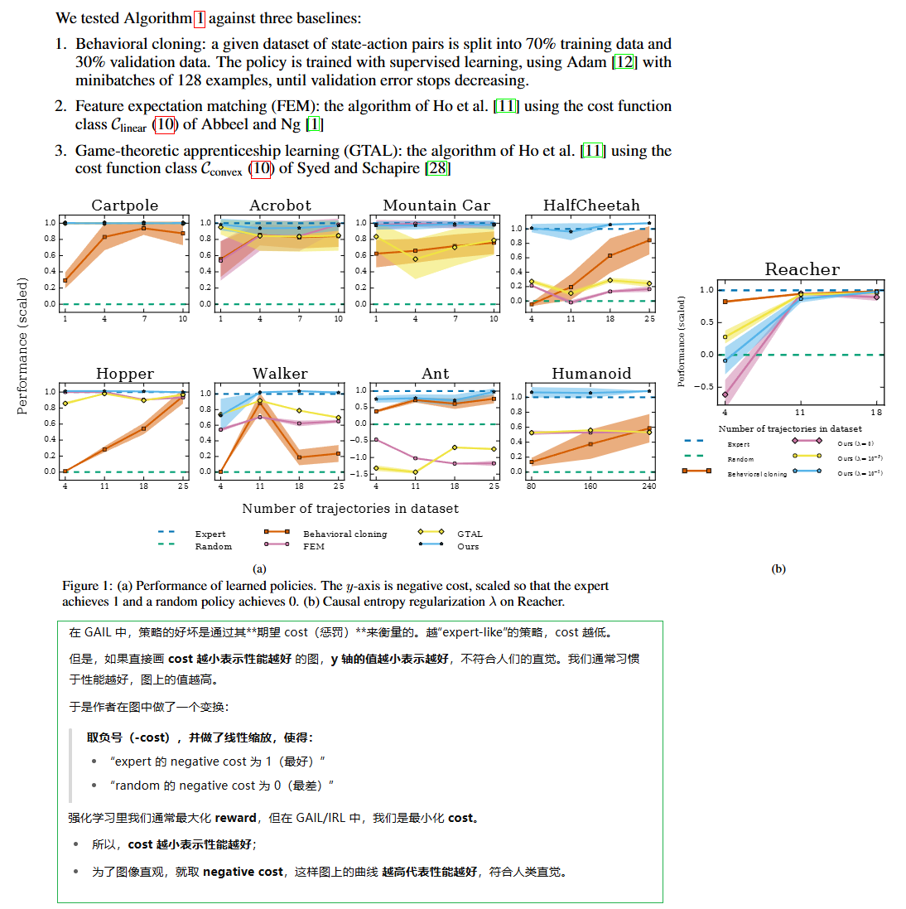

**Generative Adversarial Imitation Learning**

### Introduction

先了解一下预备知识和相关概念

在强化学习（RL）中，策略是根据一个“奖励函数”或“代价函数”优化出来的。这个函数告诉 agent 哪些行为好、哪些不好。

恢复专家的代价函数，意思是：你观察一个专家（比如人类司机、下棋高手、机器人的演示轨迹），并试图推断出那个让专家选择这些行为的代价函数。

这个 cost 函数是通过 IRL 算法学到的，它解释了专家为什么选择某些动作而不是其他动作。逆向强化学习（IRL）是这样一种过程：给定专家的演示行为（比如状态-动作轨迹），你要反推出他们是根据什么代价函数做决策的。

IRL 的步骤通常是：

1. 输入：专家的轨迹（状态序列 + 动作序列）。
2. 优化：寻找一个 cost function，使得专家的行为在这个代价下是最优的。
3. 然后，你可以用普通 RL 方法（如 TRPO、PPO）在这个 cost function 上优化出一套自己的策略。


论文提出了一个新的通用框架，可以直接从数据中提取策略。将模仿学习与生成对抗网络（GAN）进行类比。基于这一类比，我们设计出一个无需环境模型的模仿学习算法，它在各种复杂、高维环境中模仿专家行为时，性能明显优于现有的无模型方法。


The learner is given only samples of trajectories from the expert, is not allowed to query the expert for more data while training, and is not provided
reinforcement signal of any kind. 

There are two main approaches suitable for this setting: 

1. behavioral cloning, which learns a policy as a supervised learning problem over state-action pairs from expert trajectories; 
2. inverse reinforcement learning, which finds a cost function under which the expert is uniquely optimal.

Our characterization introduces a framework for directly learning policies from data, bypassing any intermediate IRL step.

### Background

论文在这部分介绍了IRL什么的，我倒是觉得需要帮我复习一下GAN



### 诱导最优策略的表征

看不太懂，大概摘录一下我认为重要的内容：


### 实用的占用度量匹配



### 生成对抗模仿学习（GAIL）



#### 说人话

```python
# 初始化策略 πθ 和判别器 Dω
initialize_policy_network()
initialize_discriminator_network()

# 准备专家数据 (s, a) 对
expert_dataset = load_expert_trajectories()

for iteration in range(num_iterations):

    # === 1. 用当前策略 πθ 跑环境，采样一批 trajectory ===
    fake_trajectories = rollout_policy(policy=πθ, env, num_steps)
    fake_batch = extract_state_action_pairs(fake_trajectories)

    # === 2. 训练判别器 Dω，判断 expert / agent ===
    for _ in range(num_discriminator_steps):
        expert_batch = sample_batch(expert_dataset)
        fake_batch = sample_batch(fake_batch)

        # 判别器 loss: 二分类交叉熵
        D_loss = -mean(log(D(s,a)) for (s,a) in expert_batch) \
                 -mean(log(1 - D(s,a)) for (s,a) in fake_batch)

        update_discriminator(D_loss)

    # === 3. 把 log D(s, a) 当作 reward，训练策略 πθ ===
    for _ in range(num_policy_update_steps):

        # 用 log D(s, a) 当 reward，计算 return / advantage
        rewards = [log(D(s, a)) for (s, a) in fake_trajectories]
        returns, advantages = estimate_advantage(rewards)

        # 用 PPO / REINFORCE / TRPO 更新策略
        policy_loss = -log_prob * advantage (with clipping if PPO)
        update_policy(policy_loss)

    # === 4. 日志输出（可选）===
    print(f"Iter {iteration}: avg_reward = ..., D_acc = ...")

```



#### fake reward绝对值很大怎么办

用log D(s,a)做为reward，负值的绝对值可能很大，这种情况下推荐怎么做？还是说不需要额外处理？



#### 输入只是(s,a)数据对？



#### GAIL一定要与环境交互吗？



#### GAIL只能训练策略网络吗？



#### cost函数就是一个度量指标

cost函数这个概念感觉有点奇奇怪怪的：



### Experiments



### bison的实验

实验设计：

1. 训练一个DQN作为专家，与CartPole环境交互，得到一系列离线的专家经验
2. 使用GAIL训练G和D，RL算法采用REINFORCE算法