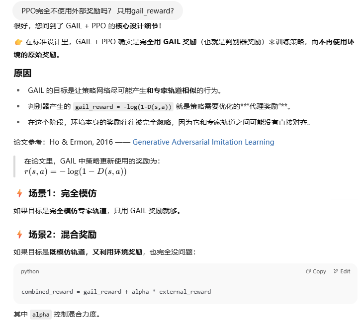
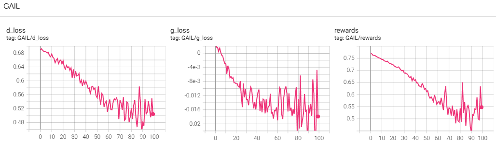
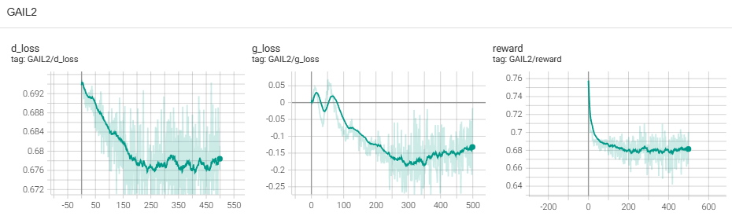

**Generative Adversarial Imitation Learning**

### Introduction

先了解一下预备知识和相关概念

在强化学习（RL）中，策略是根据一个“奖励函数”或“代价函数”优化出来的。这个函数告诉 agent 哪些行为好、哪些不好。

恢复专家的代价函数，意思是：你观察一个专家（比如人类司机、下棋高手、机器人的演示轨迹），并试图推断出那个让专家选择这些行为的代价函数。

这个 cost 函数是通过 IRL 算法学到的，它解释了专家为什么选择某些动作而不是其他动作。逆向强化学习（IRL）是这样一种过程：给定专家的演示行为（比如状态-动作轨迹），你要反推出他们是根据什么代价函数做决策的。

IRL 的步骤通常是：

1. 输入：专家的轨迹（状态序列 + 动作序列）。
2. 优化：寻找一个 cost function，使得专家的行为在这个代价下是最优的。
3. 然后，你可以用普通 RL 方法（如 TRPO、PPO）在这个 cost function 上优化出一套自己的策略。


论文提出了一个新的通用框架，可以直接从数据中提取策略。将模仿学习与生成对抗网络（GAN）进行类比。基于这一类比，我们设计出一个无需环境模型的模仿学习算法，它在各种复杂、高维环境中模仿专家行为时，性能明显优于现有的无模型方法。


The learner is given only samples of trajectories from the expert, is not allowed to query the expert for more data while training, and is not provided
reinforcement signal of any kind. 

There are two main approaches suitable for this setting: 

1. behavioral cloning, which learns a policy as a supervised learning problem over state-action pairs from expert trajectories; 
2. inverse reinforcement learning, which finds a cost function under which the expert is uniquely optimal.

Our characterization introduces a framework for directly learning policies from data, bypassing any intermediate IRL step.

### Background

论文在这部分介绍了IRL什么的，我倒是觉得需要帮我复习一下GAN


### 诱导最优策略的表征

看不太懂，大概摘录一下我认为重要的内容：


### 实用的占用度量匹配


### 生成对抗模仿学习（GAIL）


#### 说人话

```python
# 初始化策略 πθ 和判别器 Dω
initialize_policy_network()
initialize_discriminator_network()

# 准备专家数据 (s, a) 对
expert_dataset = load_expert_trajectories()

for iteration in range(num_iterations):

    # === 1. 用当前策略 πθ 跑环境，采样一批 trajectory ===
    fake_trajectories = rollout_policy(policy=πθ, env, num_steps)
    fake_batch = extract_state_action_pairs(fake_trajectories)

    # === 2. 训练判别器 Dω，判断 expert / agent ===
    for _ in range(num_discriminator_steps):
        expert_batch = sample_batch(expert_dataset)
        fake_batch = sample_batch(fake_batch)

        # 判别器 loss: 二分类交叉熵
        D_loss = -mean(log(D(s,a)) for (s,a) in expert_batch) \
                 -mean(log(1 - D(s,a)) for (s,a) in fake_batch)

        update_discriminator(D_loss)

    # === 3. 把 log D(s, a) 当作 reward，训练策略 πθ ===
    for _ in range(num_policy_update_steps):

        # 用 log D(s, a) 当 reward，计算 return / advantage
        rewards = [log(D(s, a)) for (s, a) in fake_trajectories]
        returns, advantages = estimate_advantage(rewards)

        # 用 PPO / REINFORCE / TRPO 更新策略
        policy_loss = -log_prob * advantage (with clipping if PPO)
        update_policy(policy_loss)

    # === 4. 日志输出（可选）===
    print(f"Iter {iteration}: avg_reward = ..., D_acc = ...")

```


#### fake reward绝对值很大怎么办

用log D(s,a)做为reward，负值的绝对值可能很大，这种情况下推荐怎么做？还是说不需要额外处理？


#### 只使用gail奖励不使用外部奖励吗？



#### 输入只是(s,a)数据对？


#### GAIL一定要与环境交互吗？


#### GAIL只能训练策略网络吗？


#### cost函数就是一个度量指标

cost函数这个概念感觉有点奇奇怪怪的：


### Experiments


### bison的实验

#### cartpole（结果不错）

实验设计：

1. 训练一个DQN作为专家，与CartPole环境交互，得到一系列离线的专家经验
2. 使用GAIL训练G和D，RL算法采用REINFORCE算法

结果：能学到不错的策略，show_case的输出：

```shell
episode len:500
episode len:500
episode len:500
episode len:500
episode len:500
episode len:500
episode len:500
episode len:500
episode len:500
episode len:500
```



```python
import datetime
import random
import gym
import torch
import torch.nn as nn
import torch.optim as optim
import torch.nn.functional as F
from collections import deque
from torch.utils.tensorboard import SummaryWriter
from torch.distributions import Categorical

# 设备选择
device = torch.device("cuda" if torch.cuda.is_available() else "cpu")
env = gym.make("CartPole-v1", render_mode=None, max_episode_steps=500)
n_state = env.observation_space.shape[0]  # 状态维度
n_action = env.action_space.n  # 动作数量
writer = SummaryWriter(log_dir=f'./logs/GAIL_{datetime.datetime.now().strftime("%m%d_%H%M%S")}')


# DQN 网络定义，作为专家提供经验
class DQN(nn.Module):
    def __init__(self, state_dim, action_dim):
        super(DQN, self).__init__()
        self.fc1 = nn.Linear(state_dim, 128)
        self.fc2 = nn.Linear(128, 128)
        self.fc3 = nn.Linear(128, action_dim)

    def forward(self, x):
        x = F.relu(self.fc1(x))
        x = F.relu(self.fc2(x))
        return self.fc3(x)

# GAIL训练的策略网络，也是生成器
class Policy(nn.Module):
    def __init__(self, state_dim, action_dim):
        super(Policy, self).__init__()
        self.fc1 = nn.Linear(state_dim, 128)
        self.fc2 = nn.Linear(128, 128)
        self.fc3 = nn.Linear(128, action_dim)

    def forward(self, x):
        x = F.relu(self.fc1(x))
        x = F.relu(self.fc2(x))
        x = self.fc3(x)
        return F.softmax(x, dim=1)

#判别器定义
class Discriminator(nn.Module):
    def __init__(self, state_dim, action_dim):
        super(Discriminator, self).__init__()
        self.fc1 = nn.Linear(state_dim+action_dim, 128)
        self.fc2 = nn.Linear(128, 64)
        self.fc3 = nn.Linear(64, 1)

    def forward(self, states, actions):
        actions_one_hot = F.one_hot(actions.to(torch.long), num_classes=n_action)
        x = torch.concatenate([states, actions_one_hot], dim=1)
        x = F.relu(self.fc1(x))
        x = F.relu(self.fc2(x))
        x = self.fc3(x)
        return F.sigmoid(x) # 0-1的概率

# 待训练的策略网络与环境交互，获得rollout数据
def interact_with_env(g:Policy):
    fake_samples = []
    traj_lens = []
    g.eval()
    while len(fake_samples) < 2048:
        state = env.reset()
        state = state[0]
        ep_len = 0
        for _ in range(500):
            with torch.no_grad():
                stateTensor = torch.FloatTensor(state).unsqueeze(0).to(device)
                action = g(stateTensor) # type:torch.Tensor
                dist = Categorical(action)
                action = dist.sample().item()
                #action = action.argmax(dim=1)[0].cpu().item()

            fake_samples.append((state, action))
            ep_len += 1
            state, reward, done, _, _ = env.step(action)

            if done:
                traj_lens.append(ep_len)
                break
        if not done: #不是因为终止而退出上述循环
            traj_lens.append(ep_len)
    g.train()
    return fake_samples, traj_lens

# 根据奖励计算累计回报
def compute_returns(rewards, traj_lens:list, gamma=0.99):
    returns = []
    # assert sum(traj_lens) == rewards.shape[0], f"sum {traj_lens}  != {rewards.shape[0]}"
    # split rewards as trajectory
    reward_seg = []
    start = 0
    for l in traj_lens:
        end = start + l
        reward_seg.append( rewards[start:end] )
        start = end

    # calc returns for each segment
    for seg in reward_seg:
        R = 0
        returns_seg = []
        for r in reversed(seg):
            R = r + gamma * R
            returns_seg.insert(0, R)
        returns.extend(returns_seg)

    return torch.tensor(returns, device=device)

#利用样本数据，REINFORCE算法更新策略网络
def update_policy_network(policy, optimizer, states, actions, returns):

    # 1. 通过策略网络计算动作概率
    probs = policy(states)  # [T, action_dim]
    # 2. 创建分类分布（用于采样和计算对数概率）
    m = Categorical(probs)
    # 3. 计算所选动作的对数概率
    log_probs = m.log_prob(actions)  # [T,]
    # 4. 因为基于策略的强化学习要使用梯度上升使得state-value函数的期望最大化，所以损失函数是期望值的负数
    # returns已经在函数外面进行了带折扣的汇总运算，也就是已经是U了，不是每一步的r
    loss = -(log_probs * returns).mean()
    optimizer.zero_grad()
    loss.backward()
    optimizer.step()
    return loss

def show_case(policy:Policy):
    eval_env = gym.make("CartPole-v1", render_mode="human", max_episode_steps=500)
    policy.eval()
    for _ in range(10):
        state = eval_env.reset()
        state = state[0]
        ep_len = 0
        for _ in range(500):
            with torch.no_grad():
                stateTensor = torch.FloatTensor(state).unsqueeze(0).to(device)
                action = policy(stateTensor)  # type:torch.Tensor
                action = action.argmax(dim=1)[0].cpu().item()
            ep_len += 1
            state, reward, done, _, _ = eval_env.step(action)

            if done:
                break
        print(f"episode len:{ep_len}")
    policy.train()


# 利用GAIL算法训练策略网络
def GAIL_train_policy(experiments_file='./expert_trajectory.pth'):
    max_epoches = 200
    lr_g = 1e-4
    lr_d = 1e-4
    batch_size = 128
    gamma = 0.99

    true_samples = torch.load(experiments_file, weights_only=False) #type:list
    generator = Policy(n_state, n_action).to(device)
    discriminator = Discriminator(n_state, n_action).to(device)
    optimizer_g = torch.optim.Adam(generator.parameters(), lr=lr_g)
    optimizer_d = torch.optim.Adam(discriminator.parameters(), lr=lr_d)

    for ep in range(max_epoches):
        fake_samples, traj_lens = interact_with_env(generator)

        #训练判别器
        for _ in range(4):
            batch_size_hf = batch_size // 2
            inputs = random.sample(true_samples, batch_size_hf) + random.sample(fake_samples, batch_size_hf)
            labels = [1] * batch_size_hf + [0] * batch_size_hf # 很有意思，这里如果1/0搞反了，最后也能收敛，就是要训练epoch多一些，因为1/0影响的是下面生成器训练时候得到的reward值，只要是正的，cartpole这个任务都能收敛
            # 1. 打包成 (input, label) 对
            combined = list(zip(inputs, labels))
            # 2. shuffle 整体顺序
            random.shuffle(combined)
            # 3. 解包回来
            inputs, labels = zip(*combined)
            states, actions = zip(*inputs)

            states = torch.tensor(states, dtype=torch.float32).to(device)
            actions = torch.tensor(actions, dtype=torch.float32).to(device)
            labels = torch.tensor(labels, dtype=torch.long).to(device)
            outputs = discriminator(states, actions) #输出的是(B,)的0-1概率， 1表示是专家
            d_loss = nn.functional.binary_cross_entropy(outputs.squeeze(1), labels.float())
            optimizer_d.zero_grad()
            d_loss.backward()
            optimizer_d.step()

        #训练生成器
        for _ in range(2):
            inputs = fake_samples
            states, actions = zip(*inputs)

            states = torch.tensor(states, dtype=torch.float32).to(device)
            actions = torch.tensor(actions, dtype=torch.float32).to(device)
            with torch.no_grad():
                outputs = discriminator(states, actions)# type:torch.Tensor
            rewards = -torch.log( 1 - outputs + (1e-8) ) # 1e-8, 一方面防止log(0)导致无穷小，一方面防止reward绝对值太大
            # 计算回报
            returns = compute_returns(rewards, traj_lens, gamma)
            # 让权重有正有负，如果正的，我们就要增大在这个状态采取这个动作的概率；如果是负的，我们就要减小在这个状态采取这个动作的概率
            returns = (returns - returns.mean()) / (returns.std() + 1e-9)
            # assert actions.shape == returns.shape
            # 更新策略
            g_loss = update_policy_network(generator, optimizer_g, states, actions, returns)

        writer.add_scalar('GAIL/d_loss', d_loss.item(), ep)
        writer.add_scalar('GAIL/g_loss', g_loss.item(), ep)
        writer.add_scalar('GAIL/rewards', rewards.mean().cpu().item(), ep)
    show_case(generator)


# 训练专家网络过程中，与环境交互
def select_action_from_expert(model, state, epsilon):
    """基于 ε-greedy 选择动作"""
    if random.random() < epsilon:
        return random.randint(0, n_action - 1)  # 随机选择
    else:
        state = torch.FloatTensor(state).unsqueeze(0).to(device)  # 变换前：[4] -> 变换后：[1, 4]
        return model(state).argmax(1).item()  # 选取 Q 值最大的动作

# 训练专家网络过程中，更新其参数
def update_expert(model, target_model, memory, batch_size, gamma, optimizer):
    if len(memory) < batch_size:
        return 9999.0  # 经验池数据不足时不训练

    batch = random.sample(memory, batch_size)
    states, actions, rewards, next_states, dones = zip(*batch)

    states = torch.FloatTensor(states).to(device)  # (batch_size, 4)
    actions = torch.LongTensor(actions).unsqueeze(1).to(device)  # (batch_size,) -> (batch_size, 1)
    rewards = torch.FloatTensor(rewards).unsqueeze(1).to(device)  # (batch_size,) -> (batch_size, 1)
    next_states = torch.FloatTensor(next_states).to(device)  # (batch_size, 4)
    dones = torch.FloatTensor(dones).unsqueeze(1).to(device)  # (batch_size,) -> (batch_size, 1)

    # 计算当前 Q 值
    q_values = model(states).gather(1, actions)  # 从 Q(s, a) 选取执行的动作 Q 值

    # 计算目标 Q 值
    next_q_values = target_model(next_states).max(1, keepdim=True)[0]  # 选取 Q(s', a') 的最大值
    target_q_values = rewards + gamma * next_q_values * (1 - dones)  # TD 目标

    # 计算损失
    loss = F.mse_loss(q_values, target_q_values.detach())
    optimizer.zero_grad()
    loss.backward()
    optimizer.step()

    return loss.item()

# 训练expert网络，并获得专家交互经验
def get_expert_trajectory():
    # 超参数
    gamma = 0.99  # 折扣因子
    epsilon = 1.0  # 初始探索率
    epsilon_min = 0.01  # 最低探索率
    epsilon_decay = 0.995  # 探索率衰减
    learning_rate = 1e-3  # 学习率
    batch_size = 128  # 经验回放的批量大小
    memory_size = 200_000  # 经验池大小
    target_update_freq = 10  # 目标网络更新频率
    episode_max_steps = 800

    # 初始化网络
    model = DQN(n_state, n_action).to(device)
    target_model = DQN(n_state, n_action).to(device)
    target_model.load_state_dict(model.state_dict())
    optimizer = optim.Adam(model.parameters(), lr=learning_rate)
    memory = deque(maxlen=memory_size)

    episodes = 500
    for episode in range(episodes):
        state = env.reset()
        state = state[0]  # 适配 Gym v26
        total_reward = 0

        for _ in range(episode_max_steps):
            action = select_action_from_expert(model, state, epsilon)
            next_state, reward, done, _, _ = env.step(action)

            # 经验回放缓存
            memory.append((state, action, reward, next_state, done))
            state = next_state
            total_reward += reward

            # 训练 DQN
            loss = update_expert(model, target_model, memory, batch_size, gamma, optimizer)

            if done:
                break

        # 逐步降低 epsilon，减少随机探索，提高利用率
        epsilon = max(epsilon_min, epsilon * epsilon_decay)

        # 定期更新目标网络，提高稳定性
        if episode % target_update_freq == 0:
            target_model.load_state_dict(model.state_dict())

        writer.add_scalar('expert/episode_rew', total_reward, episode)
        writer.add_scalar('expert/epsilon', epsilon, episode)
        writer.add_scalar('expert/loss', loss, episode)
        print(f"Episode {episode}, Reward: {total_reward}, Epsilon: {epsilon:.3f}, loss:{loss}")

    # generate expert trajectory
    expert_experience = []
    model.eval()
    while len(expert_experience) < 200_000:
        state = env.reset()
        state = state[0]
        total_reward = 0


        for _ in range(episode_max_steps):
            with torch.no_grad():
                action = select_action_from_expert(model, state, 0)  # 纯利用，epsilon=0
            expert_experience.append( (state, action) )
            state, reward, done, _, _ = env.step(action)
            total_reward += reward

            if done:
                break
        print(f"Total reward: {total_reward}")
        writer.add_scalar('expert/experience', total_reward, len(expert_experience))

    torch.save(expert_experience, './expert_trajectory.pth')


if __name__ == "__main__":
    #get_expert_trajectory()
    GAIL_train_policy()

```

#### 完全离线的变种GAIL（结果不错）

完全不与环境交互，只用 专家数据（expert trajectories）作为正样本**，**生成器采样 fake 样本，通过 GAN 式对抗训练生成器。

这本质上是一个 **“行为克隆 + GAN”** 的 GAIL 简化版本，也可以理解为 **offline GAIL / imitation learning**。我们用 policy 网络采样动作，并用专家数据+生成器数据训练判别器，再通过判别器的 reward 更新 policy。

结果：

也能学习到一定的能力，但加大训练的epoches的时候，能力反而下降了。

下面是show_case的输出

```shell
episode len:172
episode len:189
episode len:157
episode len:281
episode len:229
episode len:186
episode len:205
episode len:216
episode len:262
episode len:203
```




```python
import datetime
import random
import gym
import torch
import torch.nn as nn
import torch.optim as optim
import torch.nn.functional as F
from collections import deque
from torch.utils.tensorboard import SummaryWriter
from torch.distributions import Categorical

# 设备选择
device = torch.device("cuda" if torch.cuda.is_available() else "cpu")
env = gym.make("CartPole-v1", render_mode=None, max_episode_steps=500)
n_state = env.observation_space.shape[0]  # 状态维度
n_action = env.action_space.n  # 动作数量
writer = SummaryWriter(log_dir=f'./logs/GAIL_offline_{datetime.datetime.now().strftime("%m%d_%H%M%S")}')


# DQN 网络定义，作为专家提供经验
class DQN(nn.Module):
    def __init__(self, state_dim, action_dim):
        super(DQN, self).__init__()
        self.fc1 = nn.Linear(state_dim, 128)
        self.fc2 = nn.Linear(128, 128)
        self.fc3 = nn.Linear(128, action_dim)

    def forward(self, x):
        x = F.relu(self.fc1(x))
        x = F.relu(self.fc2(x))
        return self.fc3(x)

# GAIL训练的策略网络，也是生成器
class Policy(nn.Module):
    def __init__(self, state_dim, action_dim):
        super(Policy, self).__init__()
        self.fc1 = nn.Linear(state_dim, 128)
        self.fc2 = nn.Linear(128, 128)
        self.fc3 = nn.Linear(128, action_dim)

    def forward(self, x):
        x = F.relu(self.fc1(x))
        x = F.relu(self.fc2(x))
        x = self.fc3(x)
        return F.softmax(x, dim=1)

#判别器定义
class Discriminator(nn.Module):
    def __init__(self, state_dim, action_dim):
        super(Discriminator, self).__init__()
        self.fc1 = nn.Linear(state_dim+action_dim, 128)
        self.fc2 = nn.Linear(128, 64)
        self.fc3 = nn.Linear(64, 1)

    def forward(self, states, actions):
        actions_one_hot = F.one_hot(actions.to(torch.long), num_classes=n_action)
        x = torch.concatenate([states, actions_one_hot], dim=1)
        x = F.relu(self.fc1(x))
        x = F.relu(self.fc2(x))
        x = self.fc3(x)
        return F.sigmoid(x) # 0-1的概率


def show_case(policy:Policy):
    eval_env = gym.make("CartPole-v1", render_mode="human", max_episode_steps=500)
    policy.eval()
    for _ in range(10):
        state = eval_env.reset()
        state = state[0]
        ep_len = 0
        for _ in range(500):
            with torch.no_grad():
                stateTensor = torch.FloatTensor(state).unsqueeze(0).to(device)
                action = policy(stateTensor)  # type:torch.Tensor
                action = action.argmax(dim=1)[0].cpu().item()
            ep_len += 1
            state, reward, done, _, _ = eval_env.step(action)

            if done:
                break
        print(f"episode len:{ep_len}")
    policy.train()


# 利用GAIL算法训练策略网络
def GAIL_train_policy(
    experiments_file='./expert_trajectory.pth',
    max_epochs=500,
    d_steps=5,
    g_steps=1,
    batch_size=128,
    gamma=0.99,
    lr_d=1e-4,
    lr_g=1e-4
):
    # 加载专家数据 [(state, action)]
    expert_data = torch.load(experiments_file, weights_only=False)
    expert_states, expert_actions = zip(*expert_data)
    expert_states = torch.tensor(expert_states, dtype=torch.float32).to(device)
    expert_actions = torch.tensor(expert_actions, dtype=torch.long).to(device)

    # 初始化网络
    generator = Policy(n_state, n_action).to(device)
    discriminator = Discriminator(n_state, n_action).to(device)
    optimizer_g = torch.optim.Adam(generator.parameters(), lr=lr_g)
    optimizer_d = torch.optim.Adam(discriminator.parameters(), lr=lr_d)

    for ep in range(max_epochs):
        # ============ 1. 判别器训练 ============
        for _ in range(d_steps):
            idx_exp = torch.randint(0, expert_states.shape[0], (batch_size,))
            states_exp = expert_states[idx_exp]
            actions_exp = expert_actions[idx_exp]

            idx_fake = torch.randint(0, expert_states.shape[0], (batch_size,))
            states_fake = expert_states[idx_fake]
            with torch.no_grad():
                probs = generator(states_fake)
                dist = Categorical(probs)
                actions_fake = dist.sample()

            # 构造混合数据
            states_all = torch.cat([states_exp, states_fake], dim=0)
            actions_all = torch.cat([actions_exp, actions_fake], dim=0)
            labels = torch.cat([
                torch.ones(batch_size),  # expert: 1
                torch.zeros(batch_size)  # fake: 0
            ]).to(device)

            preds = discriminator(states_all, actions_all).squeeze()
            loss_d = F.binary_cross_entropy(preds, labels)
            optimizer_d.zero_grad()
            loss_d.backward()
            optimizer_d.step()

        # ============ 2. 生成器训练 ============
        for _ in range(g_steps):
            idx_fake = torch.randint(0, expert_states.shape[0], (batch_size,))
            states_fake = expert_states[idx_fake]

            with torch.no_grad():
                # === rollout ===
                old_probs = generator(states_fake)
                old_dist = Categorical(old_probs)
                old_actions = old_dist.sample()

                # === reward ===
                d_pred = discriminator(states_fake, old_actions).squeeze()
                rewards = -torch.log(1 - d_pred + 1e-8)

            # === 训练阶段，用相同的动作 ===
            new_probs = generator(states_fake)
            new_dist = Categorical(new_probs)
            log_probs = new_dist.log_prob(old_actions)  # ✅ 注意：不是重新采样

            # === 策略梯度更新 ===
            returns = (rewards - rewards.mean()) / (rewards.std() + 1e-9)
            loss_g = -(log_probs * returns).mean()
            optimizer_g.zero_grad()
            loss_g.backward()
            optimizer_g.step()

        # 日志记录
        writer.add_scalar('GAIL2/d_loss', loss_d.item(), ep)
        writer.add_scalar('GAIL2/g_loss', loss_g.item(), ep)
        writer.add_scalar('GAIL2/reward', rewards.mean().item(), ep)

        if ep % 20 == 0 or ep == max_epochs - 1:
            print(f"[Epoch {ep}] d_loss: {loss_d.item():.4f} | g_loss: {loss_g.item():.4f} | avg_reward: {rewards.mean().item():.4f}")

    # 可视化展示
    show_case(generator)


# 训练专家网络过程中，与环境交互
def select_action_from_expert(model, state, epsilon):
    """基于 ε-greedy 选择动作"""
    if random.random() < epsilon:
        return random.randint(0, n_action - 1)  # 随机选择
    else:
        state = torch.FloatTensor(state).unsqueeze(0).to(device)  # 变换前：[4] -> 变换后：[1, 4]
        return model(state).argmax(1).item()  # 选取 Q 值最大的动作

# 训练专家网络过程中，更新其参数
def update_expert(model, target_model, memory, batch_size, gamma, optimizer):
    if len(memory) < batch_size:
        return 9999.0  # 经验池数据不足时不训练

    batch = random.sample(memory, batch_size)
    states, actions, rewards, next_states, dones = zip(*batch)

    states = torch.FloatTensor(states).to(device)  # (batch_size, 4)
    actions = torch.LongTensor(actions).unsqueeze(1).to(device)  # (batch_size,) -> (batch_size, 1)
    rewards = torch.FloatTensor(rewards).unsqueeze(1).to(device)  # (batch_size,) -> (batch_size, 1)
    next_states = torch.FloatTensor(next_states).to(device)  # (batch_size, 4)
    dones = torch.FloatTensor(dones).unsqueeze(1).to(device)  # (batch_size,) -> (batch_size, 1)

    # 计算当前 Q 值
    q_values = model(states).gather(1, actions)  # 从 Q(s, a) 选取执行的动作 Q 值

    # 计算目标 Q 值
    next_q_values = target_model(next_states).max(1, keepdim=True)[0]  # 选取 Q(s', a') 的最大值
    target_q_values = rewards + gamma * next_q_values * (1 - dones)  # TD 目标

    # 计算损失
    loss = F.mse_loss(q_values, target_q_values.detach())
    optimizer.zero_grad()
    loss.backward()
    optimizer.step()

    return loss.item()

# 训练expert网络，并获得专家交互经验
def get_expert_trajectory():
    # 超参数
    gamma = 0.99  # 折扣因子
    epsilon = 1.0  # 初始探索率
    epsilon_min = 0.01  # 最低探索率
    epsilon_decay = 0.995  # 探索率衰减
    learning_rate = 1e-3  # 学习率
    batch_size = 128  # 经验回放的批量大小
    memory_size = 200_000  # 经验池大小
    target_update_freq = 10  # 目标网络更新频率
    episode_max_steps = 800

    # 初始化网络
    model = DQN(n_state, n_action).to(device)
    target_model = DQN(n_state, n_action).to(device)
    target_model.load_state_dict(model.state_dict())
    optimizer = optim.Adam(model.parameters(), lr=learning_rate)
    memory = deque(maxlen=memory_size)

    episodes = 500
    for episode in range(episodes):
        state = env.reset()
        state = state[0]  # 适配 Gym v26
        total_reward = 0

        for _ in range(episode_max_steps):
            action = select_action_from_expert(model, state, epsilon)
            next_state, reward, done, _, _ = env.step(action)

            # 经验回放缓存
            memory.append((state, action, reward, next_state, done))
            state = next_state
            total_reward += reward

            # 训练 DQN
            loss = update_expert(model, target_model, memory, batch_size, gamma, optimizer)

            if done:
                break

        # 逐步降低 epsilon，减少随机探索，提高利用率
        epsilon = max(epsilon_min, epsilon * epsilon_decay)

        # 定期更新目标网络，提高稳定性
        if episode % target_update_freq == 0:
            target_model.load_state_dict(model.state_dict())

        writer.add_scalar('expert/episode_rew', total_reward, episode)
        writer.add_scalar('expert/epsilon', epsilon, episode)
        writer.add_scalar('expert/loss', loss, episode)
        print(f"Episode {episode}, Reward: {total_reward}, Epsilon: {epsilon:.3f}, loss:{loss}")

    # generate expert trajectory
    expert_experience = []
    model.eval()
    while len(expert_experience) < 200_000:
        state = env.reset()
        state = state[0]
        total_reward = 0


        for _ in range(episode_max_steps):
            with torch.no_grad():
                action = select_action_from_expert(model, state, 0)  # 纯利用，epsilon=0
            expert_experience.append( (state, action) )
            state, reward, done, _, _ = env.step(action)
            total_reward += reward

            if done:
                break
        print(f"Total reward: {total_reward}")
        writer.add_scalar('expert/experience', total_reward, len(expert_experience))

    torch.save(expert_experience, './expert_trajectory.pth')


if __name__ == "__main__":
    #get_expert_trajectory()
    GAIL_train_policy()

```

#### Racecar（GAIL + REINFORCE）

专家经验数据的采集代码见[TD3+BC的论文笔记](./TD3+BC.md)

不能收敛，效果很差，差到图都懒得贴。

```python
import datetime
import random
import sys

import gymnasium as gym
from gymnasium import spaces
import torch
import torch.nn as nn
import torch.optim as optim
import torch.nn.functional as F
from collections import deque
import signal
from torch.utils.tensorboard import SummaryWriter
import numpy as np
import numpy
import pybullet as p
import pybullet_data
import math
import imageio
import cProfile
import pstats

writer = SummaryWriter(log_dir=f'./logs/GAIL_{datetime.datetime.now().strftime("%m%d_%H%M%S")}')
profiler = cProfile.Profile()
profiler.disable()

def normalize_state(state:numpy.ndarray):
    if len(state.shape) == 1: # 一维的 (9,)
        result = np.concatenate( (state, [14.5/15.0, 7.5/15.0]), dtype=np.float32) #把目标位置也追加进去
        result[0] = state[0] / 15.0
        result[1] = state[1] / 15.0
        return result
    elif len(state.shape) == 2: # 一维的 (B,9)
        B = state.shape[0]
        goal = np.zeros(shape=(B,2), dtype=state.dtype)
        goal[:,0] = 14.5/15.0
        goal[:,1] = 7.5/15.0
        result = np.concatenate((state, goal), dtype=state.dtype, axis=1)
        result[:, 0] /= 15.0
        result[:, 1] /= 15.0
        return result
    else:
        assert False, 'invalid shape'


class RaceCarEnv(gym.Env):
    """
    赛车强化学习环境，基于PyBullet和PyTorch实现
    环境特点：
    - 包含一个封闭赛道，有墙壁边界
    - 赛车需要从起点到终点，避免撞墙
    - 奖励设计：撞墙惩罚-1，移动距离负奖励，到达终点+3
    - 状态空间：车辆位置
    - 动作空间：转向和油门控制
    """

    def __init__(self, writer:SummaryWriter, render=False,fps=20):
        # 检测是否在并行环境中运行
        if hasattr(self, 'metadata') and 'is_vector_env' in self.metadata and self.metadata['is_vector_env']:
            raise RuntimeError(
                "RaceCarEnv does not support parallel execution with SB3 VecEnv. "
                "Please use a single instance of the environment."
            )
        super(RaceCarEnv, self).__init__()
        self.writer = writer


        # 连接物理引擎
        if render:
            self.physicsClient = p.connect(p.GUI)
        else:
            self.physicsClient = p.connect(p.DIRECT)

        p.configureDebugVisualizer(p.COV_ENABLE_GUI, 0)  # 关闭 GUI 控件
        p.configureDebugVisualizer(p.COV_ENABLE_RENDERING, 1)
        p.configureDebugVisualizer(p.COV_ENABLE_TINY_RENDERER, 1)  # <<<<<< 强制使用 CPU 渲染器

        # 设置搜索路径
        p.setAdditionalSearchPath(pybullet_data.getDataPath())
        self.fps = Config.FPS
        p.setTimeStep(1/self.fps, physicsClientId=self.physicsClient)
        p.setRealTimeSimulation(0, physicsClientId=self.physicsClient)

        # 定义动作空间和状态空间
        self.action_space = spaces.Box(
            low=np.array([-1, 0]),  # 转向, 油门
            high=np.array([1, 1]),
            dtype=np.float32
        )

        self.observation_space = spaces.Box(
            low=np.array([-np.inf, -np.inf, -np.inf, -np.inf, -np.pi, -np.pi, -np.pi, -np.inf, -np.inf]),
            high=np.array([np.inf, np.inf, np.inf, np.inf, np.pi,   np.pi, np.pi, np.inf, np.inf]),
            dtype=np.float32
        )

        # 环境参数
        self.max_steps = 2_000  # 最大步数
        self.current_step = 0 #每一回合里的步数计数器
        self.total_step = 0  #环境运行过程中一直累加的计数器
        self.car = None
        self.walls = []
        self.finish_line = None
        self.start_pos = [0.5, 0.5,0.1]  # 起点位置
        self.finish_pos = [14.5, 7.5, 0.1]  # 终点位置
        self.last_pos = None  # 上一步的位置
        self.recordVedio = False
        self.frames = []
        self.prev_state = None

        self.coins = [] #中途奖励的金币
        # 重置环境
        self.reset()

    def _create_track(self):
        """创建封闭的S型赛道"""
        p.resetSimulation()
        p.setGravity(0, 0, -10)

        # 加载地面和赛车
        p.loadURDF("plane.urdf")
        self.car = p.loadURDF("racecar/racecar.urdf", self.start_pos)

        if self.total_step == 3:
            for j in range(p.getNumJoints(self.car)):
                info = p.getJointInfo(self.car, j)
                print(f"Joint {j}: Name={info[1]}, Type={info[2]}, range:{info[8]} to {info[9]}")

        self._add_wall(0,0, 2,0)
        self._add_wall(0, 0, 0, 4)
        self._add_wall(2, 0, 2, 2)
        self._add_wall(0,4, 8,4)
        self._add_wall(2, 2, 10, 2)
        self._add_wall(10, 2, 10, 6)
        self._add_wall(10,6, 15,6)

        self._add_wall(8, 4, 8, 8)
        self._add_wall(8, 8, 15, 8)
        self._add_wall(15, 6, 15, 8)

        #赛道中间还有金币，鼓励探索
        self.coins.append([3 ,3])
        self.coins.append([9, 5])
        self.coins.append([11, 7])

    def _add_wall(self, startx, starty, endx, endy):
        """
        在(startx,starty)到(endx,endy)之间创建一堵物理墙
        参数:
            startx, starty: 起点坐标 (x,y)
            endx, endy: 终点坐标 (x,y)
        返回:
            wall_id: 创建的墙体ID
        """
        # 墙体参数
        thickness = 0.3  # 厚度0.3米
        height = 0.5  # 高度0.5米
        mass = 100  # 质量100kg

        # 计算墙体中心位置和长度
        center_x = (startx + endx) / 2
        center_y = (starty + endy) / 2
        length = math.sqrt((endx - startx) ** 2 + (endy - starty) ** 2)

        # 计算墙体朝向角度（弧度）
        angle = math.atan2(endy - starty, endx - startx)

        # 创建碰撞形状（长方体）
        wall_collision = p.createCollisionShape(
            p.GEOM_BOX,
            halfExtents=[length / 2, thickness / 2, height / 2]
        )

        # 创建视觉形状（灰色半透明）
        wall_visual = p.createVisualShape(
            p.GEOM_BOX,
            halfExtents=[length / 2, thickness / 2, height / 2],
            rgbaColor=[0.5, 0.5, 0.5, 0.8]
        )

        # 创建墙体刚体
        wall_id = p.createMultiBody(
            baseMass=mass,
            baseCollisionShapeIndex=wall_collision,
            baseVisualShapeIndex=wall_visual,
            basePosition=[center_x, center_y, height / 2],
            baseOrientation=p.getQuaternionFromEuler([0, 0, angle])
        )

        # 设置物理参数（静态墙体）
        p.changeDynamics(
            wall_id,
            -1,
            lateralFriction=1.0,
            restitution=0.7,
            linearDamping=0.5,
            angularDamping=0.5
        )
        self.walls.append(wall_id)

        return wall_id


    def reset(self, seed=None, rv=False):
        """重置环境到初始状态"""
        p.resetSimulation()
        self._create_track()

        # 重置赛车位置和速度
        p.resetBasePositionAndOrientation(
            self.car,
            self.start_pos,
            p.getQuaternionFromEuler([0, 0, math.pi/2])
        )
        p.resetBaseVelocity(
            self.car,
            linearVelocity=[0, 0, 0],
            angularVelocity=[0, 0, 0]
        )

        self.current_step = 0
        self.last_pos = np.array(self.start_pos[:2])  # 只记录x,y坐标

        #抽样录一个回合视频
        if self.recordVedio and len(self.frames) > 10:
            imageio.mimsave(f"./logs/racecar_{datetime.datetime.now().strftime('%H%M%S')}.mp4", self.frames, format='FFMPEG', fps=self.fps)
            self.writer.add_scalar("steps/saveMP4", 1, self.total_step)

        self.frames = []
        if rv:
            self.recordVedio = True
        else:
            self.recordVedio = False


        # 获取初始状态
        state = self._get_state()
        self.prev_state = state
        return state,{}

    def step(self, action):
        """
        执行一个动作
        Args:
            action: [转向, 油门], 值在[-1, 1]之间
        Returns:
            state: 新状态
            reward: 奖励值
            done: 是否结束
            info: 额外信息
        """
        # 解析动作
        steer = action[0]  # 转向 -1(左)到1(右)
        throttle = action[1]  # 油门 -1(倒车)到1(前进)

        # 设置赛车控制
        self._apply_action(steer, throttle)

        # 步进模拟
        p.stepSimulation()
        self.current_step += 1
        self.total_step += 1

        # 获取新状态
        state = self._get_state()

        # 计算奖励
        external_reward, done = self._compute_reward(state)
        #记录回合结束的时候的位置
        if done:
            self.writer.add_scalar("steps/pos_x", state[0], self.total_step)
            self.writer.add_scalar("steps/pos_y", state[1], self.total_step)

        # 检查是否超过最大步数
        truncated = False
        if self.current_step >= self.max_steps:
            truncated = True

        if self.recordVedio:
            # 录制视频
            rgb = self._render_camera_frame()
            self.frames.append(rgb)


        reward = external_reward
        if self.total_step % 100 == 0:
            self.writer.add_scalar("steps/external_reward", external_reward, self.total_step)


        info = {
            "steps": self.current_step,
            "position": state[:2],
            "is_success": done and external_reward > 0
        }

        self.prev_state = state
        # 更新最后位置
        self.last_pos = state[:2]

        return state, reward, done, truncated, info

    def _apply_action(self, steer, throttle):
        '''
Joint 0: Name=b'base_link_joint', Type=4, range:0.0 to -1.0
Joint 1: Name=b'chassis_inertia_joint', Type=4, range:0.0 to -1.0
Joint 2: Name=b'left_rear_wheel_joint', Type=0, range:0.0 to -1.0
Joint 3: Name=b'right_rear_wheel_joint', Type=0, range:0.0 to -1.0
        Joint 4: Name=b'left_steering_hinge_joint', Type=0, range:-1.0 to 1.0
Joint 5: Name=b'left_front_wheel_joint', Type=0, range:0.0 to -1.0
        Joint 6: Name=b'right_steering_hinge_joint', Type=0, range:-1.0 to 1.0
Joint 7: Name=b'right_front_wheel_joint', Type=0, range:0.0 to -1.0
Joint 8: Name=b'hokuyo_joint', Type=4, range:0.0 to -1.0
Joint 9: Name=b'zed_camera_joint', Type=4, range:0.0 to -1.0
Joint 10: Name=b'zed_camera_left_joint', Type=4, range:0.0 to -1.0
Joint 11: Name=b'zed_camera_right_joint', Type=4, range:0.0 to -1.0

AI说：
若关节名义范围是[0.0, -1.0]（即默认负向旋转），但设置target_vel=2.0（正值）时：
物理引擎会尝试按正向旋转驱动关节。
实际能否达到目标速度取决于max_force和物理约束（如惯性、摩擦等）。
        '''
        """应用控制动作到赛车"""
        # 前轮转向
        steering_angle = steer   # 限制转向角度

        # 设置转向
        p.setJointMotorControl2(
            self.car,
            4,
            p.POSITION_CONTROL,
            targetPosition=-steering_angle
        )
        p.setJointMotorControl2(
            self.car,
            6,
            p.POSITION_CONTROL,
            targetPosition=-steering_angle
        )

        # 设置驱动轮速度
        max_force = 100
        target_vel = throttle * 50  # 控制速度


        for wheel in [2, 3, 5,7]:
            p.setJointMotorControl2(
                self.car,
                wheel,
                p.VELOCITY_CONTROL,
                targetVelocity=target_vel,
                force=max_force
            )

    def _render_camera_frame(self):
        car_pos, _ = p.getBasePositionAndOrientation(self.car)
        x, y = car_pos[0], car_pos[1]

        view_matrix = p.computeViewMatrix(
            cameraEyePosition=[x - 5, y - 5, 5],
            cameraTargetPosition=[x, y, 0],
            cameraUpVector=[0, 0, 1]
        )

        projection_matrix = p.computeProjectionMatrixFOV(
            fov=60,
            aspect=320 / 240,
            nearVal=0.1,
            farVal=100.0
        )

        width, height, rgb, _, _ = p.getCameraImage(
            width=320,
            height=240,
            viewMatrix=view_matrix,
            projectionMatrix=projection_matrix,
            renderer=p.ER_BULLET_HARDWARE_OPENGL
        )

        rgb_array = np.reshape(rgb, (height, width, 4))[:, :, :3].astype(np.uint8)
        return rgb_array

    def _get_state(self):
        """获取当前状态（车辆位置、速度和转向关节状态）"""
        # 1. 获取车辆位置（x,y）
        pos, _ = p.getBasePositionAndOrientation(self.car)
        position = np.array(pos[:2])  # 只取x,y坐标

        # 2. 获取车辆速度（x,y方向）
        linear_vel, _ = p.getBaseVelocity(self.car)
        velocity = np.array(linear_vel[:2])  # 只取x,y方向速度

        # 3 获取小车的朝向：
        pos, orn = p.getBasePositionAndOrientation(self.car)
        euler = p.getEulerFromQuaternion(orn)
        heading = euler[2]

        # 4. 获取转向关节状态（前轮两个关节）
        # 获取转向关节角度（前轮两个关节）
        steering_angle1 = p.getJointState(self.car, 4)[0]  # 第一个转向关节
        steering_angle2 = p.getJointState(self.car, 6)[0]  # 第二个转向关节

        # 获取转向关节角速度
        steering_vel1 = p.getJointState(self.car, 4)[1]  # 第一个转向关节角速度
        steering_vel2 = p.getJointState(self.car, 6)[1]  # 第二个转向关节角速度

        # 合并所有状态信息
        state = np.concatenate([
            position,  # 车辆位置 (x,y)
            velocity,  # 车辆速度 (vx,vy)
            [heading],
            [steering_angle1],  # 第一个转向关节角度
            [steering_angle2],  # 第二个转向关节角度
            [steering_vel1],  # 第一个转向关节角速度
            [steering_vel2]  # 第二个转向关节角速度
        ], dtype=np.float32)

        #抽样打印一下状态信息，以观察值的范围
        if self.total_step > 1000 and self.total_step < 1002:
            print("state sample:", state)

        return state

    def _compute_reward(self, state):
        """计算奖励"""
        # 参考 bipedalwalker的设计，因为 bipedalwalker 这个task能够很好的收敛，所以参考它比较有信心

        done = False
        reward = 0

        # 1. 检查是否撞墙
        contact_points = p.getContactPoints(self.car)
        if contact_points:
            for point in contact_points:
                if point[2] in self.walls:  # 检查是否与墙壁碰撞, point[2]:body unique id of body B
                    reward =  -1 # 撞墙惩罚
                    done = True
                    self.writer.add_scalar("steps/hitWall", 1, self.total_step)
                    return reward, done

        # 2. 检查是否到达终点
        finish_distance = np.linalg.norm(state[:2] - np.array(self.finish_pos[:2]))
        if finish_distance < 1.0:  # 接近终点
            reward = +3  # 到达终点奖励
            done = True
            self.writer.add_scalar("steps/reachGoal", 1, self.total_step)
            return  reward, done


        return reward, done

    def render(self, mode='human'):
        """渲染环境"""
        pass  # PyBullet会自动处理渲染

    def close(self):
        """关闭环境"""
        p.disconnect()


# 设置随机种子保证可复现性
SEED = 42
random.seed(SEED)
np.random.seed(SEED)
torch.manual_seed(SEED)
torch.cuda.manual_seed(SEED)
torch.backends.cudnn.deterministic = True


# 超参数配置
class Config:
    DEVICE = torch.device("cuda" if torch.cuda.is_available() else "cpu")
    ENV_NAME = "Pendulum-v1"
    MAX_EPOCHS = 1000  # 最大训练回合数
    MAX_STEPS = 2500  # 每回合最大步数
    BATCH_SIZE = 256  # 从经验池采样的批次大小
    GAMMA = 0.99  # 折扣因子
    TAU = 0.005  # 目标网络软更新系数
    LR_ACTOR = 1e-4  # Actor学习率
    LR_CRITIC = 1e-3  # Critic学习率
    REPLAY_BUFFER_SIZE = 100_000  # 经验回放池大小
    EXPLORATION_NOISE = 0.1  # 探索噪声标准差
    POLICY_NOISE = 0.1  # 目标策略平滑噪声标准差
    NOISE_CLIP = 0.3  # 噪声截断范围
    POLICY_UPDATE_FREQ = 2  # 策略网络延迟更新频率
    CHECKPOINT_DIR = "./td3_checkpoints"  # 模型保存目录
    CHECKPOINT_INTERVAL = 50  # 每隔多少回合保存一次模型
    LOGS_DIR = "./logs"

    n_state, n_action, max_action = 11, 2, 1
    FPS = 20


# GAIL训练的策略网络，也是生成器
class Policy(nn.Module):
    def __init__(self, state_dim, action_dim, log_std_bounds=(-20, 2)):
        super(Policy, self).__init__()

        self.fc1 = nn.Linear(state_dim, 128)
        self.fc2 = nn.Linear(128, 128)
        self.mu = nn.Linear(128, action_dim)
        self.log_sigma = nn.Linear(128, action_dim)

        self.LOG_STD_MIN, self.LOG_STD_MAX = log_std_bounds

    def forward(self, state, old_action=None):
        # 网络结构
        x = F.relu(self.fc1(state))
        x = F.relu(self.fc2(x))

        mu = self.mu(x)
        log_sigma = self.log_sigma(x).clamp(self.LOG_STD_MIN, self.LOG_STD_MAX)
        sigma = torch.exp(log_sigma)

        # 创建高斯分布
        dist = torch.distributions.Normal(mu, sigma)

        # 可重参数化采样
        u = dist.rsample()

        # 用tanh限制到 [-1,1]
        action = torch.tanh(u)

        # 计算log_prob
        # 原本高斯的对数概率
        raw_log_prob = dist.log_prob(u).sum(axis=-1)

        # 加上tanh导数对数项: -sum(log(1-a^2))
        correction = torch.sum(torch.log(1 - action.pow(2) + 1e-6), dim=-1)

        log_prob = raw_log_prob - correction

        old_log_prob = None
        if old_action is not None:
            # old_action已是tanh后的，需要先atanh
            old_u = torch.atanh(torch.clamp(old_action, -0.999999, 0.999999))
            old_raw_log_prob = dist.log_prob(old_u).sum(axis=-1)
            old_correction = torch.sum(torch.log(1 - old_action.pow(2) + 1e-6), dim=-1)
            old_log_prob = old_raw_log_prob - old_correction

        return action, log_prob, old_log_prob, mu
#判别器定义
class Discriminator(nn.Module):
    def __init__(self, state_dim, action_dim):
        super(Discriminator, self).__init__()
        self.fc1 = nn.Linear(state_dim+action_dim, 128)
        self.fc2 = nn.Linear(128, 64)
        self.fc3 = nn.Linear(64, 1)

    def forward(self, states, actions):

        x = torch.concatenate([states, actions], dim=1)
        x = F.relu(self.fc1(x))
        x = F.relu(self.fc2(x))
        x = self.fc3(x)
        return F.sigmoid(x) # 0-1的概率

# 待训练的策略网络与环境交互，获得rollout数据
def interact_with_env(g:Policy, env:RaceCarEnv):
    fake_samples = []
    traj_lens = []
    g.eval()
    while len(fake_samples) < 2048:
        rv = random.random() < 0.001 # 一定概率录制视频
        state = env.reset(rv=rv)
        state = state[0]
        ep_len = 0
        for _ in range(500):
            with torch.no_grad():
                state = normalize_state(state)
                stateTensor = torch.FloatTensor(state).unsqueeze(0).to(Config.DEVICE)
                action, _, _, _ = g(stateTensor) # type:torch.Tensor
                action = action.squeeze().cpu().numpy()

            fake_samples.append((state, action))
            ep_len += 1
            state, reward, done, _, _ = env.step(action)

            if done:
                traj_lens.append(ep_len)
                break
        if not done: #不是因为终止而退出上述循环
            traj_lens.append(ep_len)
    g.train()
    return fake_samples, traj_lens

# 根据奖励计算累计回报
def compute_returns(rewards, traj_lens:list, gamma=0.99):
    returns = []
    # assert sum(traj_lens) == rewards.shape[0], f"sum {traj_lens}  != {rewards.shape[0]}"
    # split rewards as trajectory
    reward_seg = []
    start = 0
    for l in traj_lens:
        end = start + l
        reward_seg.append( rewards[start:end] )
        start = end

    # calc returns for each segment
    for seg in reward_seg:
        R = 0
        returns_seg = []
        for r in reversed(seg):
            R = r + gamma * R
            returns_seg.insert(0, R)
        returns.extend(returns_seg)

    return torch.tensor(returns, device=Config.DEVICE)

#利用样本数据，REINFORCE算法更新策略网络
def update_policy_network(policy, optimizer, states, actions, returns):

    # 1. 通过策略网络计算动作概率
    action,_,log_probs,_ = policy(states, actions)  # [T, action_dim]
    # 4. 因为基于策略的强化学习要使用梯度上升使得state-value函数的期望最大化，所以损失函数是期望值的负数
    # returns已经在函数外面进行了带折扣的汇总运算，也就是已经是U了，不是每一步的r
    loss = -(log_probs * returns).mean()
    optimizer.zero_grad()
    loss.backward()
    optimizer.step()
    return loss

def show_case(policy:Policy):
    eval_env = RaceCarEnv(writer, False, Config.FPS)
    policy.eval()
    for _ in range(5):
        state = eval_env.reset(rv=True)
        state = state[0]
        ep_len = 0
        for _ in range(Config.MAX_STEPS):
            with torch.no_grad():
                state = normalize_state(state)
                stateTensor = torch.FloatTensor(state).unsqueeze(0).to(Config.DEVICE)
                _,_,_,mu = policy(stateTensor)  # type:torch.Tensor
                action = mu.squeeze().cpu().numpy() #直接取概率密度最大的均值作为动作
            ep_len += 1
            state, reward, done, _, _ = eval_env.step(action)

            if done:
                break
        print(f"episode len:{ep_len}")
    policy.train()

def load_true_sample(experiments_file):
    traj_list = torch.load(experiments_file, weights_only=False)
    result = []
    for traj in traj_list:
        for one_step in traj:
            state, action, reward, termination, truncation, info, next_state = one_step

            state = normalize_state(state)
            result.append( (state, action))
    return result


# 利用GAIL算法训练策略网络
def GAIL_train_policy(experiments_file='./expert_racecar_traj.pth'):

    lr_g = 1e-4
    lr_d = 1e-4
    batch_size = 128
    gamma = 0.99
    env = RaceCarEnv(writer, False, Config.FPS)
    true_samples = load_true_sample(experiments_file)
    generator = Policy(Config.n_state, Config.n_action).to(Config.DEVICE)
    discriminator = Discriminator(Config.n_state, Config.n_action).to(Config.DEVICE)
    optimizer_g = torch.optim.Adam(generator.parameters(), lr=lr_g)
    optimizer_d = torch.optim.Adam(discriminator.parameters(), lr=lr_d)

    for ep in range(Config.MAX_EPOCHS):
        fake_samples, traj_lens = interact_with_env(generator, env)

        #训练判别器
        for _ in range(4):
            batch_size_hf = batch_size // 2
            inputs = random.sample(true_samples, batch_size_hf) + random.sample(fake_samples, batch_size_hf)
            labels = [1] * batch_size_hf + [0] * batch_size_hf
            # 1. 打包成 (input, label) 对
            combined = list(zip(inputs, labels))
            # 2. shuffle 整体顺序
            random.shuffle(combined)
            # 3. 解包回来
            inputs, labels = zip(*combined)
            states, actions = zip(*inputs)

            states = torch.tensor(states, dtype=torch.float32).to(Config.DEVICE)
            actions = torch.tensor(actions, dtype=torch.float32).to(Config.DEVICE)
            labels = torch.tensor(labels, dtype=torch.long).to(Config.DEVICE)
            outputs = discriminator(states, actions) #输出的是(B,)的0-1概率， 1表示是专家
            d_loss = nn.functional.binary_cross_entropy(outputs.squeeze(1), labels.float())
            optimizer_d.zero_grad()
            d_loss.backward()
            optimizer_d.step()

        #训练生成器
        for _ in range(2):
            inputs = fake_samples
            states, actions = zip(*inputs)

            states = torch.tensor(states, dtype=torch.float32).to(Config.DEVICE)
            actions = torch.tensor(actions, dtype=torch.float32).to(Config.DEVICE)
            with torch.no_grad():
                outputs = discriminator(states, actions)# type:torch.Tensor
            rewards = -torch.log( 1 - outputs + (1e-8) ) # 1e-8, 一方面防止0导致无穷小，一方面防止reward绝对值太大
            # 计算回报
            returns = compute_returns(rewards, traj_lens, gamma)
            # 让权重有正有负，如果正的，我们就要增大在这个状态采取这个动作的概率；如果是负的，我们就要减小在这个状态采取这个动作的概率
            returns = (returns - returns.mean()) / (returns.std() + 1e-9)
            # assert actions.shape == returns.shape
            # 更新策略
            g_loss = update_policy_network(generator, optimizer_g, states, actions, returns)

        writer.add_scalar('GAIL/d_loss', d_loss.item(), ep)
        writer.add_scalar('GAIL/g_loss', g_loss.item(), ep)
        writer.add_scalar('GAIL/rewards', rewards.mean().cpu().item(), ep)
    show_case(generator)


def myexit(sig, frame):
    profiler.disable()
    profiler.dump_stats("result.prof")  # 手工保存
    sys.exit(0)


if __name__ == "__main__":
    signal.signal(signal.SIGINT, myexit)
    signal.signal(signal.SIGTERM, myexit)
    GAIL_train_policy()

```


#### Racecar（GAIL + PPO）

收敛个屁，做这个事情的收获是：

1. 认识到GAIL + PPO，不是完全实现PPO，PPO的critic网络就不需要，只比REINFORCE算法复杂一点点
2. PPO也不一定非要rollout固定步数，每次rollout一个完整的episode也可以
3. 可以完全不使用外部奖励，只使用gail奖励


```python
import datetime
import random
import sys

import gymnasium as gym
from gymnasium import spaces
import torch
import torch.nn as nn
import torch.optim as optim
import torch.nn.functional as F
from collections import deque
import signal
from torch.utils.tensorboard import SummaryWriter
import numpy as np
import numpy
import pybullet as p
import pybullet_data
import math
import imageio
import cProfile
import pstats

writer = SummaryWriter(log_dir=f'./logs/GAIL_{datetime.datetime.now().strftime("%m%d_%H%M%S")}')
profiler = cProfile.Profile()
profiler.disable()

def normalize_state(state:numpy.ndarray):
    if len(state.shape) == 1: # 一维的 (9,)
        result = np.concatenate( (state, [14.5/15.0, 7.5/15.0]), dtype=np.float32) #把目标位置也追加进去
        result[0] = state[0] / 15.0
        result[1] = state[1] / 15.0
        return result
    elif len(state.shape) == 2: # 一维的 (B,9)
        B = state.shape[0]
        goal = np.zeros(shape=(B,2), dtype=state.dtype)
        goal[:,0] = 14.5/15.0
        goal[:,1] = 7.5/15.0
        result = np.concatenate((state, goal), dtype=state.dtype, axis=1)
        result[:, 0] /= 15.0
        result[:, 1] /= 15.0
        return result
    else:
        assert False, 'invalid shape'


class RaceCarEnv(gym.Env):
    """
    赛车强化学习环境，基于PyBullet和PyTorch实现
    环境特点：
    - 包含一个封闭赛道，有墙壁边界
    - 赛车需要从起点到终点，避免撞墙
    - 奖励设计：撞墙惩罚-1，移动距离负奖励，到达终点+3
    - 状态空间：车辆位置
    - 动作空间：转向和油门控制
    """

    def __init__(self, writer:SummaryWriter, render=False,fps=20):
        # 检测是否在并行环境中运行
        if hasattr(self, 'metadata') and 'is_vector_env' in self.metadata and self.metadata['is_vector_env']:
            raise RuntimeError(
                "RaceCarEnv does not support parallel execution with SB3 VecEnv. "
                "Please use a single instance of the environment."
            )
        super(RaceCarEnv, self).__init__()
        self.writer = writer


        # 连接物理引擎
        if render:
            self.physicsClient = p.connect(p.GUI)
        else:
            self.physicsClient = p.connect(p.DIRECT)

        p.configureDebugVisualizer(p.COV_ENABLE_GUI, 0)  # 关闭 GUI 控件
        p.configureDebugVisualizer(p.COV_ENABLE_RENDERING, 1)
        p.configureDebugVisualizer(p.COV_ENABLE_TINY_RENDERER, 1)  # <<<<<< 强制使用 CPU 渲染器

        # 设置搜索路径
        p.setAdditionalSearchPath(pybullet_data.getDataPath())
        self.fps = Config.FPS
        p.setTimeStep(1/self.fps, physicsClientId=self.physicsClient)
        p.setRealTimeSimulation(0, physicsClientId=self.physicsClient)

        # 定义动作空间和状态空间
        self.action_space = spaces.Box(
            low=np.array([-1, 0]),  # 转向, 油门
            high=np.array([1, 1]),
            dtype=np.float32
        )

        self.observation_space = spaces.Box(
            low=np.array([-np.inf, -np.inf, -np.inf, -np.inf, -np.pi, -np.pi, -np.pi, -np.inf, -np.inf]),
            high=np.array([np.inf, np.inf, np.inf, np.inf, np.pi,   np.pi, np.pi, np.inf, np.inf]),
            dtype=np.float32
        )

        # 环境参数
        self.max_steps = 2_000  # 最大步数
        self.current_step = 0 #每一回合里的步数计数器
        self.total_step = 0  #环境运行过程中一直累加的计数器
        self.car = None
        self.walls = []
        self.finish_line = None
        self.start_pos = [0.5, 0.5,0.1]  # 起点位置
        self.finish_pos = [14.5, 7.5, 0.1]  # 终点位置
        self.last_pos = None  # 上一步的位置
        self.recordVedio = False
        self.frames = []
        self.prev_state = None

        self.coins = [] #中途奖励的金币
        # 重置环境
        self.reset()

    def _create_track(self):
        """创建封闭的S型赛道"""
        p.resetSimulation()
        p.setGravity(0, 0, -10)

        # 加载地面和赛车
        p.loadURDF("plane.urdf")
        self.car = p.loadURDF("racecar/racecar.urdf", self.start_pos)

        if self.total_step == 3:
            for j in range(p.getNumJoints(self.car)):
                info = p.getJointInfo(self.car, j)
                print(f"Joint {j}: Name={info[1]}, Type={info[2]}, range:{info[8]} to {info[9]}")

        self._add_wall(0,0, 2,0)
        self._add_wall(0, 0, 0, 4)
        self._add_wall(2, 0, 2, 2)
        self._add_wall(0,4, 8,4)
        self._add_wall(2, 2, 10, 2)
        self._add_wall(10, 2, 10, 6)
        self._add_wall(10,6, 15,6)

        self._add_wall(8, 4, 8, 8)
        self._add_wall(8, 8, 15, 8)
        self._add_wall(15, 6, 15, 8)

        #赛道中间还有金币，鼓励探索
        self.coins.append([3 ,3])
        self.coins.append([9, 5])
        self.coins.append([11, 7])

    def _add_wall(self, startx, starty, endx, endy):
        """
        在(startx,starty)到(endx,endy)之间创建一堵物理墙
        参数:
            startx, starty: 起点坐标 (x,y)
            endx, endy: 终点坐标 (x,y)
        返回:
            wall_id: 创建的墙体ID
        """
        # 墙体参数
        thickness = 0.3  # 厚度0.3米
        height = 0.5  # 高度0.5米
        mass = 100  # 质量100kg

        # 计算墙体中心位置和长度
        center_x = (startx + endx) / 2
        center_y = (starty + endy) / 2
        length = math.sqrt((endx - startx) ** 2 + (endy - starty) ** 2)

        # 计算墙体朝向角度（弧度）
        angle = math.atan2(endy - starty, endx - startx)

        # 创建碰撞形状（长方体）
        wall_collision = p.createCollisionShape(
            p.GEOM_BOX,
            halfExtents=[length / 2, thickness / 2, height / 2]
        )

        # 创建视觉形状（灰色半透明）
        wall_visual = p.createVisualShape(
            p.GEOM_BOX,
            halfExtents=[length / 2, thickness / 2, height / 2],
            rgbaColor=[0.5, 0.5, 0.5, 0.8]
        )

        # 创建墙体刚体
        wall_id = p.createMultiBody(
            baseMass=mass,
            baseCollisionShapeIndex=wall_collision,
            baseVisualShapeIndex=wall_visual,
            basePosition=[center_x, center_y, height / 2],
            baseOrientation=p.getQuaternionFromEuler([0, 0, angle])
        )

        # 设置物理参数（静态墙体）
        p.changeDynamics(
            wall_id,
            -1,
            lateralFriction=1.0,
            restitution=0.7,
            linearDamping=0.5,
            angularDamping=0.5
        )
        self.walls.append(wall_id)

        return wall_id


    def reset(self, seed=None, rv=False):
        """重置环境到初始状态"""
        p.resetSimulation()
        self._create_track()

        # 重置赛车位置和速度
        p.resetBasePositionAndOrientation(
            self.car,
            self.start_pos,
            p.getQuaternionFromEuler([0, 0, math.pi/2])
        )
        p.resetBaseVelocity(
            self.car,
            linearVelocity=[0, 0, 0],
            angularVelocity=[0, 0, 0]
        )

        self.current_step = 0
        self.last_pos = np.array(self.start_pos[:2])  # 只记录x,y坐标

        #抽样录一个回合视频
        if self.recordVedio and len(self.frames) > 10:
            imageio.mimsave(f"./logs/racecar_{datetime.datetime.now().strftime('%H%M%S')}.mp4", self.frames, format='FFMPEG', fps=self.fps)
            self.writer.add_scalar("steps/saveMP4", 1, self.total_step)

        self.frames = []
        if rv:
            self.recordVedio = True
        else:
            self.recordVedio = False


        # 获取初始状态
        state = self._get_state()
        self.prev_state = state
        return state,{}

    def step(self, action):
        """
        执行一个动作
        Args:
            action: [转向, 油门], 值在[-1, 1]之间
        Returns:
            state: 新状态
            reward: 奖励值
            done: 是否结束
            info: 额外信息
        """
        # 解析动作
        steer = action[0]  # 转向 -1(左)到1(右)
        throttle = action[1]  # 油门 -1(倒车)到1(前进)

        # 设置赛车控制
        self._apply_action(steer, throttle)

        # 步进模拟
        p.stepSimulation()
        self.current_step += 1
        self.total_step += 1

        # 获取新状态
        state = self._get_state()

        # 计算奖励
        external_reward, done = self._compute_reward(state)
        #记录回合结束的时候的位置
        if done:
            self.writer.add_scalar("steps/pos_x", state[0], self.total_step)
            self.writer.add_scalar("steps/pos_y", state[1], self.total_step)

        # 检查是否超过最大步数
        truncated = False
        if self.current_step >= self.max_steps:
            truncated = True

        if self.recordVedio:
            # 录制视频
            rgb = self._render_camera_frame()
            self.frames.append(rgb)


        reward = external_reward
        if self.total_step % 100 == 0:
            self.writer.add_scalar("steps/external_reward", external_reward, self.total_step)


        info = {
            "steps": self.current_step,
            "position": state[:2],
            "is_success": done and external_reward > 0
        }

        self.prev_state = state
        # 更新最后位置
        self.last_pos = state[:2]

        return state, reward, done, truncated, info

    def _apply_action(self, steer, throttle):
        '''
Joint 0: Name=b'base_link_joint', Type=4, range:0.0 to -1.0
Joint 1: Name=b'chassis_inertia_joint', Type=4, range:0.0 to -1.0
Joint 2: Name=b'left_rear_wheel_joint', Type=0, range:0.0 to -1.0
Joint 3: Name=b'right_rear_wheel_joint', Type=0, range:0.0 to -1.0
        Joint 4: Name=b'left_steering_hinge_joint', Type=0, range:-1.0 to 1.0
Joint 5: Name=b'left_front_wheel_joint', Type=0, range:0.0 to -1.0
        Joint 6: Name=b'right_steering_hinge_joint', Type=0, range:-1.0 to 1.0
Joint 7: Name=b'right_front_wheel_joint', Type=0, range:0.0 to -1.0
Joint 8: Name=b'hokuyo_joint', Type=4, range:0.0 to -1.0
Joint 9: Name=b'zed_camera_joint', Type=4, range:0.0 to -1.0
Joint 10: Name=b'zed_camera_left_joint', Type=4, range:0.0 to -1.0
Joint 11: Name=b'zed_camera_right_joint', Type=4, range:0.0 to -1.0

AI说：
若关节名义范围是[0.0, -1.0]（即默认负向旋转），但设置target_vel=2.0（正值）时：
物理引擎会尝试按正向旋转驱动关节。
实际能否达到目标速度取决于max_force和物理约束（如惯性、摩擦等）。
        '''
        """应用控制动作到赛车"""
        # 前轮转向
        steering_angle = steer   # 限制转向角度

        # 设置转向
        p.setJointMotorControl2(
            self.car,
            4,
            p.POSITION_CONTROL,
            targetPosition=-steering_angle
        )
        p.setJointMotorControl2(
            self.car,
            6,
            p.POSITION_CONTROL,
            targetPosition=-steering_angle
        )

        # 设置驱动轮速度
        max_force = 100
        target_vel = throttle * 50  # 控制速度


        for wheel in [2, 3, 5,7]:
            p.setJointMotorControl2(
                self.car,
                wheel,
                p.VELOCITY_CONTROL,
                targetVelocity=target_vel,
                force=max_force
            )

    def _render_camera_frame(self):
        car_pos, _ = p.getBasePositionAndOrientation(self.car)
        x, y = car_pos[0], car_pos[1]

        view_matrix = p.computeViewMatrix(
            cameraEyePosition=[x - 5, y - 5, 5],
            cameraTargetPosition=[x, y, 0],
            cameraUpVector=[0, 0, 1]
        )

        projection_matrix = p.computeProjectionMatrixFOV(
            fov=60,
            aspect=320 / 240,
            nearVal=0.1,
            farVal=100.0
        )

        width, height, rgb, _, _ = p.getCameraImage(
            width=320,
            height=240,
            viewMatrix=view_matrix,
            projectionMatrix=projection_matrix,
            renderer=p.ER_BULLET_HARDWARE_OPENGL
        )

        rgb_array = np.reshape(rgb, (height, width, 4))[:, :, :3].astype(np.uint8)
        return rgb_array

    def _get_state(self):
        """获取当前状态（车辆位置、速度和转向关节状态）"""
        # 1. 获取车辆位置（x,y）
        pos, _ = p.getBasePositionAndOrientation(self.car)
        position = np.array(pos[:2])  # 只取x,y坐标

        # 2. 获取车辆速度（x,y方向）
        linear_vel, _ = p.getBaseVelocity(self.car)
        velocity = np.array(linear_vel[:2])  # 只取x,y方向速度

        # 3 获取小车的朝向：
        pos, orn = p.getBasePositionAndOrientation(self.car)
        euler = p.getEulerFromQuaternion(orn)
        heading = euler[2]

        # 4. 获取转向关节状态（前轮两个关节）
        # 获取转向关节角度（前轮两个关节）
        steering_angle1 = p.getJointState(self.car, 4)[0]  # 第一个转向关节
        steering_angle2 = p.getJointState(self.car, 6)[0]  # 第二个转向关节

        # 获取转向关节角速度
        steering_vel1 = p.getJointState(self.car, 4)[1]  # 第一个转向关节角速度
        steering_vel2 = p.getJointState(self.car, 6)[1]  # 第二个转向关节角速度

        # 合并所有状态信息
        state = np.concatenate([
            position,  # 车辆位置 (x,y)
            velocity,  # 车辆速度 (vx,vy)
            [heading],
            [steering_angle1],  # 第一个转向关节角度
            [steering_angle2],  # 第二个转向关节角度
            [steering_vel1],  # 第一个转向关节角速度
            [steering_vel2]  # 第二个转向关节角速度
        ], dtype=np.float32)

        #抽样打印一下状态信息，以观察值的范围
        if self.total_step > 1000 and self.total_step < 1002:
            print("state sample:", state)

        return state

    def _compute_reward(self, state):
        """计算奖励"""
 
        done = False
        reward = 0

        # 1. 检查是否撞墙
        contact_points = p.getContactPoints(self.car)
        if contact_points:
            for point in contact_points:
                if point[2] in self.walls:  # 检查是否与墙壁碰撞, point[2]:body unique id of body B
                    reward =  -1 # 撞墙惩罚
                    done = True
                    self.writer.add_scalar("steps/hitWall", 1, self.total_step)
                    return reward, done

        # 2. 检查是否到达终点
        finish_distance = np.linalg.norm(state[:2] - np.array(self.finish_pos[:2]))
        if finish_distance < 1.0:  # 接近终点
            reward = +3  # 到达终点奖励
            done = True
            self.writer.add_scalar("steps/reachGoal", 1, self.total_step)
            return  reward, done


        return reward, done

    def render(self, mode='human'):
        """渲染环境"""
        pass  # PyBullet会自动处理渲染

    def close(self):
        """关闭环境"""
        p.disconnect()


# 设置随机种子保证可复现性
SEED = 42
random.seed(SEED)
np.random.seed(SEED)
torch.manual_seed(SEED)
torch.cuda.manual_seed(SEED)
torch.backends.cudnn.deterministic = True


# 超参数配置
# ==========================================================
# 配置
# ==========================================================
class Config:
    DEVICE = torch.device("cuda" if torch.cuda.is_available() else "cpu")
    MAX_EPOCHS = 5000
    MAX_STEPS = 2500
    GAMMA = 0.99
    LR_POLICY = 1e-4
    LR_DISCRIMINATOR = 1e-4
    CLIP_RANGE = 0.2
    LAMBDA = 0.95
    PPO_EPOCHS = 4
    PPO_BATCH_SIZE = 64
    D_BATCH_SZ = 128
    N_STATE = 11
    N_ACTION = 2
    MAX_ACTION = 1
    FPS = 20


# GAIL训练的策略网络，也是生成器
class Policy(nn.Module):
    def __init__(self, state_dim, action_dim, log_std_bounds=(-20, 2)):
        super(Policy, self).__init__()

        self.fc1 = nn.Linear(state_dim, 128)
        self.fc2 = nn.Linear(128, 128)
        self.mu = nn.Linear(128, action_dim)
        self.log_sigma = nn.Linear(128, action_dim)

        self.LOG_STD_MIN, self.LOG_STD_MAX = log_std_bounds

    def forward(self, state, old_action=None):
        # 网络结构
        x = F.relu(self.fc1(state))
        x = F.relu(self.fc2(x))

        mu = self.mu(x)
        log_sigma = self.log_sigma(x).clamp(self.LOG_STD_MIN, self.LOG_STD_MAX)
        sigma = torch.exp(log_sigma)

        # 创建高斯分布
        dist = torch.distributions.Normal(mu, sigma)

        # 可重参数化采样
        u = dist.rsample()

        # 用tanh限制到 [-1,1]
        action = torch.tanh(u)

        # 计算log_prob
        # 原本高斯的对数概率
        raw_log_prob = dist.log_prob(u).sum(axis=-1)

        # 加上tanh导数对数项: -sum(log(1-a^2))
        correction = torch.sum(torch.log(1 - action.pow(2) + 1e-6), dim=-1)

        log_prob = raw_log_prob - correction

        old_log_prob = None
        if old_action is not None:
            # old_action已是tanh后的，需要先atanh
            old_u = torch.atanh(torch.clamp(old_action, -0.999999, 0.999999))
            old_raw_log_prob = dist.log_prob(old_u).sum(axis=-1)
            old_correction = torch.sum(torch.log(1 - old_action.pow(2) + 1e-6), dim=-1)
            old_log_prob = old_raw_log_prob - old_correction

        return action, log_prob, old_log_prob, mu
#判别器定义
class Discriminator(nn.Module):
    def __init__(self, state_dim, action_dim):
        super(Discriminator, self).__init__()
        self.fc1 = nn.Linear(state_dim+action_dim, 128)
        self.fc2 = nn.Linear(128, 64)
        self.fc3 = nn.Linear(64, 1)

    def forward(self, states, actions):

        x = torch.concatenate([states, actions], dim=1)
        x = F.relu(self.fc1(x))
        x = F.relu(self.fc2(x))
        x = self.fc3(x)
        return F.sigmoid(x) # 0-1的概率


def show_case(policy:Policy):
    eval_env = RaceCarEnv(writer, False, Config.FPS)
    policy.eval()
    for _ in range(5):
        state = eval_env.reset(rv=True)
        state = state[0]
        ep_len = 0
        for _ in range(Config.MAX_STEPS):
            with torch.no_grad():
                state = normalize_state(state)
                stateTensor = torch.FloatTensor(state).unsqueeze(0).to(Config.DEVICE)
                _,_,_,mu = policy(stateTensor)  # type:torch.Tensor
                action = mu.squeeze().cpu().numpy() #直接取概率密度最大的均值作为动作
            ep_len += 1
            state, reward, done, _, _ = eval_env.step(action)

            if done:
                break
        print(f"episode len:{ep_len}")
    policy.train()

def load_true_sample(experiments_file):
    traj_list = torch.load(experiments_file, weights_only=False)
    result = []
    for traj in traj_list:
        for one_step in traj:
            state, action, reward, termination, truncation, info, next_state = one_step

            state = normalize_state(state)
            result.append( (state, action))
    return result


def myexit(sig, frame):
    profiler.disable()
    profiler.dump_stats("result.prof")  # 手工保存
    sys.exit(0)


# ==========================================================
# PPO Trainer
# ==========================================================
class PPOTrainer:
    """封装 PPO 更新过程"""
    def __init__(self, policy, lr, clip_range, gamma, lam, epochs, batch_size, device):
        self.policy = policy
        self.optimizer = torch.optim.Adam(self.policy.parameters(), lr=lr)
        self.clip_range = clip_range
        self.gamma = gamma
        self.lam = lam
        self.epochs = epochs
        self.batch_size = batch_size
        self.device = device
        self.reset_buffers()

    def reset_buffers(self):
        """清空轨道片段"""
        self.states, self.actions = [], []
        self.rewards, self.dones = [], []
        self.log_probs, self.values, self.next_values = [], [], []
        self.advantages, self.returns = [], []
        self.old_log_probs = []

    def add(self, state, action, reward, done, log_prob, value, next_value):
        """收集轨道片段中的每步"""
        self.states.append(torch.tensor(state, device=self.device))
        self.actions.append(torch.tensor(action, device=self.device))
        self.rewards.append(reward)
        self.dones.append(done)
        self.log_probs.append(log_prob.detach())
        self.values.append(value.detach())
        self.next_values.append(next_value.detach())

    def compute_gae(self):
        """计算GAE优势和折扣回报"""
        advantages, returns, gae = [], [], 0
        for t in reversed(range(len(self.rewards))):
            mask = 1.0 - float(self.dones[t])
            delta = self.rewards[t] + self.gamma * self.next_values[t] * mask - self.values[t]
            gae = delta + self.gamma * self.lam * mask * gae
            advantages.insert(0, gae)
            returns.insert(0, gae + self.values[t])

        self.advantages = torch.tensor(advantages, device=self.device).float()
        self.returns = torch.tensor(returns, device=self.device).float()
        self.old_log_probs = torch.stack(self.log_probs)

    def update(self):
        """PPO 策略更新"""
        self.compute_gae()
        states = torch.stack(self.states)
        actions = torch.stack(self.actions)

        for _ in range(self.epochs):
            indices = torch.randperm(len(states))
            for start in range(0, len(states), self.batch_size):
                end = start + self.batch_size
                batch_indices = indices[start:end]
                batch_states = states[batch_indices]
                batch_actions = actions[batch_indices]
                batch_advantages = self.advantages[batch_indices]
                batch_returns = self.returns[batch_indices]
                batch_old_log_probs = self.old_log_probs[batch_indices]

                _, new_log_probs, _, _ = self.policy(batch_states, batch_actions)

                ratio = torch.exp(new_log_probs - batch_old_log_probs)

                surr1 = ratio * batch_advantages
                surr2 = torch.clamp(ratio, 1.0 - self.clip_range, 1.0 + self.clip_range) * batch_advantages
                loss = -torch.min(surr1, surr2).mean()

                self.optimizer.zero_grad()
                loss.backward()
                self.optimizer.step()
        self.reset_buffers()


# ==========================================================
# 修改过的 GAIL + PPO 训练主循环
# ==========================================================
def GAIL_train_policy(experiments_file='./expert_racecar_traj.pth', writer=None):
    """GAIL + PPO 完整训练过程"""
    batch_size = Config.D_BATCH_SZ
    gamma = Config.GAMMA
    clip_range = Config.CLIP_RANGE

    env = RaceCarEnv(writer, False, Config.FPS)
    true_samples = load_true_sample(experiments_file)

    generator = Policy(Config.N_STATE, Config.N_ACTION).to(Config.DEVICE)
    discriminator = Discriminator(Config.N_STATE, Config.N_ACTION).to(Config.DEVICE)

    optimizer_d = torch.optim.Adam(discriminator.parameters(), lr=Config.LR_DISCRIMINATOR)
    ppo_trainer = PPOTrainer(generator, Config.LR_POLICY, clip_range, gamma,
                             Config.LAMBDA, Config.PPO_EPOCHS,
                             Config.PPO_BATCH_SIZE, Config.DEVICE)

    fake_samples = deque(maxlen=batch_size)

    gail_reward_list = []

    for ep in range(Config.MAX_EPOCHS):
        state, _ = env.reset()
        ep_len = 0
        while ep_len < Config.MAX_STEPS:
            norm_state = normalize_state(state)
            stateTensor = torch.FloatTensor(norm_state).unsqueeze(0).to(Config.DEVICE)
            with torch.no_grad():
                action, log_prob, _, _ = generator(stateTensor)
                value = torch.zeros(1).to(Config.DEVICE)  # 可修改为额外价值网络
                next_value = torch.zeros(1).to(Config.DEVICE)

            state_np = stateTensor.cpu().numpy()
            action_np = action.cpu().numpy()

            fake_samples.append((state_np.squeeze(), action_np.squeeze()))
            state, reward, done, _, _ = env.step(action_np.squeeze())
            ep_len += 1

            with torch.no_grad():
                d_score = discriminator(torch.tensor(state_np, device=Config.DEVICE),
                                        torch.tensor(action_np, device=Config.DEVICE))
                gail_reward = -torch.log(1.0 - d_score + 1e-8).squeeze()
                gail_reward_list.append(gail_reward)

            ppo_trainer.add(stateTensor.squeeze(0), action.squeeze(0),
                            reward+gail_reward.item(), done, log_prob, value, next_value)

            if done:
                break
        writer.add_scalar('GAIL/gail_reward', sum(gail_reward_list) / (len(gail_reward_list) + (1e-8)),ep),
        ppo_trainer.update()

        if len(fake_samples) >= batch_size:
            # 判别器更新
            for _ in range(1):
                batch_size_hf = batch_size // 2
                inputs = random.sample(true_samples, batch_size_hf) + random.sample(fake_samples, batch_size_hf)
                labels = [1] * batch_size_hf + [0] * batch_size_hf
                combined = list(zip(inputs, labels))
                random.shuffle(combined)
                inputs, labels = zip(*combined)

                states, actions = zip(*inputs)
                states = torch.tensor(states, dtype=torch.float32).to(Config.DEVICE)
                actions = torch.tensor(actions, dtype=torch.float32).to(Config.DEVICE)
                labels = torch.tensor(labels, dtype=torch.long).to(Config.DEVICE)

                outputs = discriminator(states, actions)
                d_loss = F.binary_cross_entropy(outputs.squeeze(1), labels.float())
                optimizer_d.zero_grad()
                d_loss.backward()
                optimizer_d.step()

            if writer:
                writer.add_scalar('GAIL/d_loss', d_loss.item(), ep)

    # 完成训练，展示效果
    show_case(generator)


# ==========================================================
# 脚本主程序
# ==========================================================
if __name__ == '__main__':
    signal.signal(signal.SIGINT, lambda s, f: sys.exit(0))
    signal.signal(signal.SIGTERM, lambda s, f: sys.exit(0))

    GAIL_train_policy('./expert_racecar_traj.pth', writer=writer)

```

