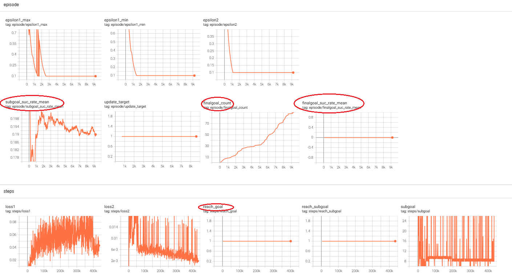
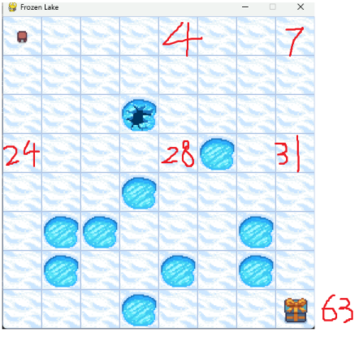
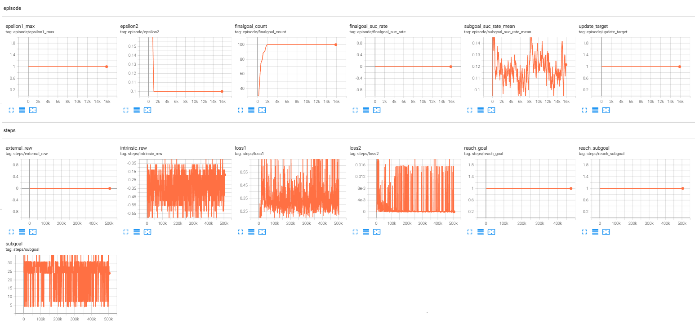

**Hierarchical Deep Reinforcement Learning: integrating Temporal Abstraction and Intrinsic Motivation**

### Introduction

还是老生常谈的稀疏奖励带来的挑战问题。

我们提出了一个框架，分层组织的深度强化学习模块在不同的时间尺度上工作。模型在两个层次上做出决策

1. 顶层模块（元控制器）接受状态并选择一个新目标
2. 低层模块（控制器）使用状态和选择的目标来选择动作，直到达到目标或情节终止。然后元控制器选择另一个目标并重复这两个步骤。

我们在不同的时间尺度上使用随机梯度下降来训练我们的模型，以优化预期的未来内在奖励（控制器）和外在奖励（元控制器）。

我们的方法在两个典型的奖励大范围延迟的任务上表现突出：

1. 一个离散的随机决策过程，在这个决策过程里，在获得最佳的外部奖励之前，须经过一长串状态转换
2. 一个典型的ATARI 游戏：蒙特祖玛的复仇

### Literature Review

提到了Sutton提出的options框架。Options框架为强化学习中的时间抽象提供了严谨的数学基础，同时也启发了后续许多分层强化学习方法的发展，包括h-DQN在内。

论文中提到的多时间尺度，可以这样理解，多时间尺度抽象与人类决策机制高度吻合：

1. **战略层**：规划未来几周/月的目标(极慢时间尺度)
2. **战术层**：制定每日计划(中等时间尺度)
3. **执行层**：完成具体动作(快速时间尺度)

论文提出的方法，没有为每个options训练一个Q function网络，而是只训练一个Q function网络，options作为该网络的一个输入以应对多个options的需要。

这样做有两个好处：

1. 在不同的options间可以共享训练
2. 对于大量的options的场景，该方法有更好的扩展性

论文又扯了一下 内在激励RL（我理解例如 RND、ICM）、面向对象的RL、DRL、认知科学与神经科学 等相关概念和子领域。

### Model

#### 原理


#### 伪代码


#### 可以用于连续动作空间吗？


#### 如何推理

训练收敛后，推理不是只使用Q1网络，必须同时使用 Q2（选 subgoal）+ Q1（执行 subgoal）

### Experiments


第二个任务，蒙特祖玛的复仇，设计细节就很复杂，不摘抄了，贴一下结果：


### Conclusion

### bison的实验

#### frozen lake

[该任务的官方文档在这里](https://gymnasium.farama.org/environments/toy_text/frozen_lake/)

##### 第一版

很仓促的跑起来了，没收敛：

1. 子目标有一定的成功率（平均20%左右）,**但实际上都是agent位置和子目标位置挨着的时候才成功，稍微远一点都失败的。不值得乐观**

2. **最终目标**（位于7,7处）也近百次的以子目标的形式出现，但作为子目标从来没有成功过。但在与环境交互的过程中，有较多次数的达成。这怎么理解呢？可能是在达成另外一个子目标的时候，达成了最终目标

   

改进想法：

1. 子目标集合可能要精挑细选精心设计一下，而不是像现在把所有可能的位置都作为子目标；
2. critic网络的奖励还得稠密，可能距离是一个办法，虽然说最短路径未必不会掉到冰洞里
3. h-DQN比较复杂，需要更详尽的监控信息，对训练过程做深入分析

还有个问题：到底怎么才算收敛？

1. 是子目标的成功率90%+？
2.  是最终目标作为子目标的成功率90%+？
3. 还是最终目标顺便完成的成功率90%+？

   



代码如下：

```python
import copy
import datetime
import random
import time
from typing import SupportsFloat, Any
import numpy as np
import torch.nn as nn
import torch
import gymnasium as gym
from gymnasium.core import ActType, ObsType
from collections import deque, namedtuple
from torch.optim import Adam
from torch.utils.tensorboard import  SummaryWriter

device="cpu"
writer = SummaryWriter(log_dir=f'./logs/hDQN_FrozenLake_{datetime.datetime.now().strftime("%m%d_%H%M%S")}')

class CustomFrozenLake(gym.Env):
    def __init__(self, render_mode=None):
        super().__init__()
        self.map_size = 8
        mapname = f'{self.map_size}x{self.map_size}'
        self.env = gym.make('FrozenLake-v1', desc=None, map_name=mapname, is_slippery=True, render_mode=render_mode)
        self.map = copy.deepcopy(self.env.unwrapped.desc) #type:np.ndarray
        print(self.map)
        self.map[0,0] = b'F'
        self.agent_pos = None

    def pos2xy(self, pos:int):
        row = pos // self.map_size
        col = pos - row * self.map_size
        return row, col

    def _add_agent_chn(self, state:np.ndarray):

        if len(state.shape) == 2:
            state = np.expand_dims(state, axis=0)

        newchn = np.zeros_like(state, dtype=np.float32)
        row, col = self.pos2xy(self.agent_pos)
        newchn[0, row, col] = 1.0
        result =  np.concatenate([state, newchn], axis=0)
        return result
    def hasReachGoal(self):
        row, col = self.pos2xy(self.agent_pos)
        if row == self.map_size-1 and col == self.map_size-1:
            return True
        else:
            return False
    def hasReachSubgoal(self, subgoal:int):
        row, col = self.pos2xy(self.agent_pos)
        gr, gc = self.pos2xy(subgoal)
        if row == gr and col == gc:
            return True
        else:
            return False


    def step(
        self, action: ActType
    ) -> tuple[ObsType, SupportsFloat, bool, bool, dict[str, Any]]:
        next_obs, reward, terminated, truncated, info = self.env.step(action)
        self.agent_pos = next_obs
        row, col = self.pos2xy(next_obs)
        next_state = copy.deepcopy(self.map)
        next_state[row, col] = b'A' # agent
        next_state = next_state.view(np.uint8) / 255.0
        next_state = self._add_agent_chn(next_state)
        return next_state, reward, terminated, truncated, info

    def reset(
        self,
        *,
        seed: int | None = None,
        options: dict[str, Any] | None = None,
    ) -> tuple[ObsType, dict[str, Any]]:
        obs, info = self.env.reset(seed=seed, options=options)
        self.agent_pos = obs
        row, col = self.pos2xy(obs)
        state = copy.deepcopy(self.map)
        state[row, col] = b'A'  # agent
        state = state.view(np.uint8) / 255.0
        state = self._add_agent_chn(state)


        return state, info

    # 得到可以作为子目标的位置
    def get_valid_subgoal(self):
        subgoal = copy.deepcopy(self.map)
        return (subgoal != b'H').astype(np.int32)

def orthogonal_layer_init(layer, std=np.sqrt(2), bias_const=0.0):
    torch.nn.init.orthogonal_(layer.weight, std)
    torch.nn.init.constant_(layer.bias, bias_const)
    return layer

'''
输入 B x c x h x w形状的地图和 B x 2形状的subgoal
会给地图拼接一个单独的通道，用来表示subgoal的空间信息
经过各自的特征提取层后，拼接特征，然后经过全连接层输出每个动作的Q值
'''
class Q1Network(nn.Module):
    def __init__(self, c:int, h:int, w:int, subgoal_dim:int, action_dim:int):
        super().__init__()

        self.action_dim = action_dim

        self.map_feat = nn.Sequential(
            orthogonal_layer_init(nn.Conv2d(c+1, 16, kernel_size=3, padding=1)),
            nn.ReLU(),
            orthogonal_layer_init(nn.Conv2d(16, 32, kernel_size=3, padding=1)),
            nn.ReLU(),
            nn.Flatten()
        )

        # 测试获得输出featuremap的尺寸
        with torch.no_grad():
            dummy = torch.zeros(1, c + 1, h, w)
            dummy_feat = self.map_feat(dummy)
            feature_dim1 = dummy_feat.shape[1]

        feature_dim2 = 32

        self.subgoal_feat = nn.Sequential(
            orthogonal_layer_init(nn.Linear(subgoal_dim, 32)),
            nn.ReLU(),
            orthogonal_layer_init(nn.Linear(32, feature_dim2)),
            nn.ReLU(),
        )


        self.out =  nn.Sequential(
            orthogonal_layer_init(nn.Linear(feature_dim1+feature_dim2, action_dim)),
        )

    def _add_subgoal_chn(self, map: torch.Tensor, subgoal: torch.Tensor) -> torch.Tensor:
        """
        给输入 map 添加一个子目标通道，子目标由 subgoal 坐标指定。

        参数:
            map (Tensor): 输入地图张量，形状为 (B, C, H,W)
            subgoal (Tensor): 子目标坐标，形状为 (B, 2)，每行为 (y, x)

        返回:
            Tensor: 形状为 (B, C+1, H, W)，在末尾添加了子目标 mask 通道
        """
        B, C, H,W = map.shape
        assert subgoal.shape == (B, 2), f"Expected subgoal shape (B, 2), got {subgoal.shape}"

        # 初始化子目标 mask
        goal_mask = torch.zeros(B, 1, H,W, device=map.device, dtype=map.dtype)

        x = subgoal[:, 1]  # 列
        y = subgoal[:, 0]  # 行

        # 生成 batch 索引
        batch_idx = torch.arange(B, device=map.device)

        # 设置目标位置为 1（每个样本的目标位置）
        goal_mask[batch_idx, 0, y, x] = 1.0

        # 拼接通道：在 dim=1 上拼接
        map_with_goal = torch.cat([map, goal_mask], dim=1)

        return map_with_goal
    def forward(self, state:torch.Tensor, subgoal:torch.Tensor):

        x = self._add_subgoal_chn(state, subgoal)

        B, C, H,W = state.shape
        assert subgoal.shape == (B, 2), f"Expected subgoal shape (B, 2), got {subgoal.shape}"
        WH = max(H,W)
        feat1 = self.map_feat(x)
        feat2 = self.subgoal_feat(subgoal / WH)
        feat = torch.cat([feat1, feat2], dim=1)
        qvalue = self.out(feat)
        return qvalue
    def epsGreedy(self, state:torch.Tensor, subgoal:torch.Tensor, epsilon):
        if random.random() < epsilon:
            B, C, H, W = state.shape
            qvalue = torch.rand((B,self.action_dim), dtype=torch.float32, device=state.device)
        else:
            qvalue = self.forward(state, subgoal) #type:torch.Tensor
        return qvalue.argmax(dim=1)

'''
输入一个地图，其中一个通道包含了agent所在的位置信息，经过特征提取和转换，得到每个可能的位置的Q值
'''
class Q2Network(nn.Module):
    def __init__(self, c, h, w, valid_position_mask: np.ndarray):
        super().__init__()


        self.map_feat = nn.Sequential(
            orthogonal_layer_init(nn.Conv2d(c, 16, kernel_size=3, padding=1)),
            nn.ReLU(),
            orthogonal_layer_init(nn.Conv2d(16, 32, kernel_size=3, padding=1)),
            nn.ReLU(),
            nn.Flatten()
        )
        self.valid_position_mask = torch.tensor(valid_position_mask, dtype=torch.bool)
        #print(f'{self.valid_position_mask}')
        assert len(valid_position_mask.shape) == 2 and valid_position_mask.shape[0] == h and \
               valid_position_mask.shape[1] == w

        # 测试获得输出featuremap的尺寸
        with torch.no_grad():
            dummy = torch.zeros(1, c, h, w)
            dummy_feat = self.map_feat(dummy)
            feature_dim = dummy_feat.shape[1]


        self.out = nn.Sequential(
            orthogonal_layer_init(nn.Linear(feature_dim,  h*w)),
        )
    def forward(self, state:torch.Tensor):
        B, C, H, W = state.shape

        mask = self.valid_position_mask.unsqueeze(0).expand(B, -1, -1).to(device)


        x = self.map_feat(state)
        x = self.out(x) #type:torch.Tensor
        x = x.reshape((B,  H, W))
        assert not torch.any(torch.isinf(x) & (x < 0)), "forward cause -inf"
        assert x.shape == mask.shape, f'shape mismatch:{x.shape}, {mask.shape}'
        neg_inf = float('-inf')
        x = torch.where(mask == True, x, neg_inf)#对每个元素：如果mask取true，就返回x的元素，否则就返回neg_inf

        return x #返回的是一个二维的对应地图形状的 Q值

    def epsGreedy(self, state:torch.Tensor, epsilon, agent_pos:tuple):
        B, C, H, W = state.shape
        assert B == 1 #确保当前agent的位置是有意义的。
        if random.random() < epsilon:
            x = torch.rand((B,H,W), dtype=torch.float32, device=state.device)
            mask = self.valid_position_mask.unsqueeze(0).expand(B, -1, -1).to(device)
            neg_inf = float('-inf')
            x = torch.where(mask == True, x, neg_inf) #对每个元素：如果mask取true，就返回x的元素，否则就返回neg_inf
        else:
            x = self.forward(state)

        # 不希望 把agent当前的位置作为sub goal
        row, col = agent_pos
        x[:, row, col] = float('-inf')

        x = x.reshape((B, -1)) #统一展平,方便计算argmax
        pos = x.argmax(dim=1)
        return pos # shape:(B,)

# 经验回放缓冲区
Transition = namedtuple('Transition', ('input', 'output', 'reward', 'next_input', 'done'))

class ReplayBuffer:
    def __init__(self, capacity):
        self.capacity = capacity
        self.buffer = []
        self.position = 0

    def push(self, *args):
        if len(self.buffer) < self.capacity:
            self.buffer.append(None)
        self.buffer[self.position] = Transition(*args)
        self.position = int(  (self.position + 1) % self.capacity  )

    def sample(self, batch_size):
        return random.sample(self.buffer, batch_size)

    def __len__(self):
        return len(self.buffer)

class Args:
    lr = 1e-3
    gamma = 0.999
    eps1_start = 1.0
    eps1_decay = 0.99
    eps1_end = 0.1

    eps2_start = 1.0
    eps2_decay = 0.99
    eps2_end = 0.1

    num_episodes = 10000

    buf_size = 1e6
    batch_sz = 64

    map_w = 8
    map_h = 8
    map_c = 2
    subgoal_dim = 2
    action_dim = 4

    update_target_network_interval = 2000

class Critic:
    def __init__(self, env:CustomFrozenLake):
        self.env = env
    # todo:内部激励还是比较稀疏的，可能不太好...
    def getIntrinsicReward(self, subgoalInt):
        if self.env.agent_pos == subgoalInt:
            return 1
        else:
            return 0

class hDQNAgent:
    def __init__(self):
        self.env = CustomFrozenLake()
        valid_subgoal = self.env.get_valid_subgoal()
        self.q1 = Q1Network(Args.map_c,Args.map_h, Args.map_w,   Args.subgoal_dim, Args.action_dim).to(device)
        self.q2 = Q2Network(Args.map_c,Args.map_h, Args.map_w,   valid_subgoal).to(device)

        self.target_q1 = Q1Network(Args.map_c, Args.map_h, Args.map_w,   Args.subgoal_dim, Args.action_dim).to(device)
        self.target_q2 = Q2Network(Args.map_c, Args.map_h, Args.map_w,  valid_subgoal).to(device)
        self.target_q1.load_state_dict(self.q1.state_dict())
        self.target_q2.load_state_dict(self.q2.state_dict())
        self.optimizer1 = Adam(self.q1.parameters(), lr=Args.lr)
        self.optimizer2 = Adam(self.q2.parameters(), lr=Args.lr)

        self.D1 = ReplayBuffer(Args.buf_size)
        self.D2 = ReplayBuffer(Args.buf_size)

        self.epsilon2 = Args.eps2_start
        self.epsilon1_dict = dict()
        self.subgoal_record = dict() # 每个subgoal 对应一个deque(maxlen=100)，里面是成功还是失败的结果 1/0

        self.critic = Critic(self.env)
        self.episode = 0
        self.total_step = 0
        self.final_goal = Args.map_w * Args.map_h - 1

    def decay_epsilon(self, episode):
        self.epsilon2 = max(Args.eps2_end, self.epsilon2*Args.eps2_decay)
        writer.add_scalar('episode/epsilon2', self.epsilon2, self.episode)
        keys = self.epsilon1_dict.keys()

        minV, minV_updated = 1.0, False
        maxV, maxV_updated = float('-inf'), False
        rates = []
        for g in keys:
            suc_rate = 0
            if self.subgoal_record.__contains__(g):
                record = self.subgoal_record[g] #type:deque
                suc_rate = record.count(1) / (len(record)+1e-8)
            else:
                self.subgoal_record[g] = deque(maxlen=100)
            rates.append(suc_rate)
            if suc_rate > 0.8:
                self.epsilon1_dict[g] = max(Args.eps1_end, self.epsilon1_dict[g] * Args.eps1_decay)
                
            if self.epsilon1_dict[g] > maxV:
                maxV = self.epsilon1_dict[g]
                maxV_updated = True
            if self.epsilon1_dict[g] < minV:
                minV = self.epsilon1_dict[g]
                minV_updated = True
        if minV_updated:
            writer.add_scalar('episode/epsilon1_min', minV, self.episode)
        if maxV_updated:
            writer.add_scalar('episode/epsilon1_max', maxV, self.episode)
        writer.add_scalar('episode/subgoal_suc_rate_mean', sum(rates) / (len(rates)+(1e-8)), self.episode)


    def get_epsilon1(self, subgoalInt):
        if self.epsilon1_dict.__contains__(subgoalInt):
            return self.epsilon1_dict[subgoalInt]
        else:
            self.epsilon1_dict[subgoalInt] = Args.eps1_start
            return Args.eps1_start

    def save_subgoal_result(self, reached, subgoalInt):
        if self.subgoal_record.__contains__(subgoalInt):
            record = self.subgoal_record[subgoalInt]  # type:deque
            record.append(1 if reached else 0)
        else:
            record = deque(maxlen=100)
            record.append(1 if reached else 0)
            self.subgoal_record[subgoalInt] = record

        if subgoalInt == self.final_goal:  # 如果最终的目标以 sub goal的方式出现了，上报它的成功率,顺便的事
            suc_rate = record.count(1) / (len(record) + 1e-8)
            writer.add_scalar('episode/finalgoal_suc_rate_mean', suc_rate, self.episode)
            writer.add_scalar('episode/finalgoal_count', len(record), self.episode)

    def update_target_network(self):
        self.target_q1.load_state_dict(self.q1.state_dict())
        self.target_q2.load_state_dict(self.q2.state_dict())
        writer.add_scalar('episode/update_target', 1, self.episode)


    def train(self):

        for i in range(Args.num_episodes):
            self.episode = i+1

            # state和stateTensorshi一对，只要修改state，就一定初始化stateTensor
            state, _ = self.env.reset()
            stateTensor = torch.FloatTensor(state).unsqueeze(0).to(device)

            # subgoal, subgoalTensor,subgoalInt是绑定的，修改subgoal一定要修改其他两个
            current_agent_pos = self.env.pos2xy(self.env.agent_pos)
            subgoal = self.q2.epsGreedy(stateTensor, self.epsilon2, current_agent_pos ) # type:torch.Tensor  (1,)
            subgoalInt = subgoal.cpu().item()
            row,col = self.env.pos2xy(subgoalInt)
            subgoalTensor = torch.tensor([[row, col]], dtype=torch.int32, device=device) # shape: (1,2)

            print(f'begin train sub goal {subgoalInt} from {self.env.agent_pos}, ', end='')
            writer.add_scalar('steps/subgoal', subgoalInt, self.total_step)

            done = False
            while not done:
                F = 0
                s0 =  copy.deepcopy(stateTensor)
                subgoalReached = False
                while not (done or self.env.hasReachGoal() or self.env.hasReachSubgoal(subgoalInt)):
                    eps1 = self.get_epsilon1(subgoalInt)
                    a = self.q1.epsGreedy(stateTensor, subgoalTensor, eps1)
                    a = a.squeeze(0).cpu().item()
                    next_state, f, terminated, truncated, info = self.env.step(a)
                    self.total_step += 1
                    nextStateTensor = torch.FloatTensor(next_state).unsqueeze(0).to(device)
                    done = terminated or truncated
                    r = self.critic.getIntrinsicReward(subgoalInt)

                    if self.env.hasReachSubgoal(subgoalInt):
                        subgoalReached = True
                        writer.add_scalar('steps/reach_subgoal', 1, self.total_step)
                    if self.env.hasReachGoal():
                        writer.add_scalar('steps/reach_goal', 1, self.total_step)

                    self.D1.push( (stateTensor.squeeze(0), subgoalTensor.squeeze(0)), a, r, (nextStateTensor.squeeze(0), subgoalTensor.squeeze(0)), done )

                    loss1 = self.update_q1()
                    loss2 = self.update_q2()
                    if self.total_step % 200 == 0:
                        writer.add_scalar('steps/loss1', loss1, self.total_step)
                        writer.add_scalar('steps/loss2', loss2, self.total_step)
                        #print(f'log loss2={loss2} at {self.total_step}')

                    F += f
                    state = next_state
                    stateTensor = torch.FloatTensor(state).unsqueeze(0).to(device)

                self.save_subgoal_result(subgoalReached, subgoalInt)
                print(f'subgoal {subgoalInt} reached? {subgoalReached}')

                assert self.env.map[subgoalTensor[0, 0].cpu().item(), subgoalTensor[0, 1].cpu().item()] != b'H', \
                    print(f'{subgoalTensor},{self.env.map[subgoalTensor[0, 0].cpu().item(), subgoalTensor[0, 1].cpu().item()]}')

                self.D2.push( s0.squeeze(0), subgoalTensor.squeeze(0), F, nextStateTensor.squeeze(0), done) #如果只是达到子目标，done是false，如果达到最终目标或者回合长度超时，done是true
                if not done:
                    current_agent_pos = self.env.pos2xy(self.env.agent_pos)
                    subgoal = self.q2.epsGreedy(stateTensor, self.epsilon2, current_agent_pos)  # type:torch.Tensor
                    subgoalInt = subgoal.cpu().item()
                    row, col = self.env.pos2xy(subgoalInt)
                    subgoalTensor = torch.tensor([[row, col]], dtype=torch.int32, device=device)
                    writer.add_scalar('steps/subgoal', subgoalInt, self.total_step)
                    print(f'begin train sub goal {subgoalInt} from {self.env.agent_pos}, ', end='')
            if (i+1)%5 == 0: #慢慢衰减
                self.decay_epsilon(episode=i)
            if (self.total_step) % Args.update_target_network_interval == 0:
                self.update_target_network()

    def update_q1(self):
        if len(self.D1) < Args.batch_sz:
            return 0
        batch = self.D1.sample(Args.batch_sz)
        inputs, actions, rewards, next_states, dones = zip(*batch)
        stateTensors, subgoalTensor = zip(*inputs)
        nextStateTensor, _ = zip(*next_states)

        stateTensors = torch.stack(stateTensors)
        subgoalTensor = torch.stack(subgoalTensor)
        nextStateTensor = torch.stack(nextStateTensor)
        actions = torch.LongTensor(actions).unsqueeze(1).to(device)  # (batch_size,) -> (batch_size, 1)
        rewards = torch.FloatTensor(rewards).unsqueeze(1).to(device)  # (batch_size,) -> (batch_size, 1)
        dones = torch.FloatTensor(dones).unsqueeze(1).to(device)  # (batch_size,) -> (batch_size, 1)

        # 计算当前 Q 值
        q_values = self.q1.forward(stateTensors, subgoalTensor).gather(1, actions)  # 从 Q(s, a) 选取执行的动作 Q 值

        # 计算目标 Q 值
        next_q_values = self.target_q1.forward(nextStateTensor, subgoalTensor).max(1, keepdim=True)[0]  # 选取 Q(s', a') 的最大值
        target_q_values = rewards + Args.gamma * next_q_values * (1 - dones)  # TD 目标

        # 计算损失
        loss = nn.functional.mse_loss(q_values, target_q_values.detach())
        self.optimizer1.zero_grad()
        loss.backward()
        self.optimizer1.step()

        return loss.item()

    def update_q2(self):
        if len(self.D2) < Args.batch_sz:
            return 0

        W = Args.map_w

        batch = self.D2.sample(Args.batch_sz)
        stateTensors, subgoalTensors, rewards, nextStateTensors, dones = zip(*batch)
        stateTensors = torch.stack(stateTensors)
        subgoalTensors = torch.stack(subgoalTensors)
        nextStateTensors = torch.stack(nextStateTensors)
        rewards = torch.FloatTensor(rewards).unsqueeze(1).to(device)  # (batch_size,) -> (batch_size, 1)
        dones = torch.FloatTensor(dones).unsqueeze(1).to(device)  # (batch_size,) -> (batch_size, 1)

        # 计算当前 Q 值
        q_values = self.q2.forward(stateTensors) #计算子目标
        q_values = q_values.reshape((Args.batch_sz,-1)) #展平
        row = subgoalTensors[:, 0]  # shape: (B,)
        col = subgoalTensors[:, 1]  # shape: (B,)
        indexTensor = row * W + col  # shape: (B,)
        indexTensor = indexTensor.to(torch.int64).unsqueeze(1)
        q_values = q_values.gather(1, indexTensor)  # 从 Q(s, a) 选取执行的动作 Q 值

        if  torch.any(torch.isinf(q_values) & (q_values < 0)):
            for index in range(Args.batch_sz):
                if torch.isinf(q_values[index]):
                    row, col = subgoalTensors[index]
                    print(f">>{index} {subgoalTensors[index]}\n{q_values}  \n  mask={self.q2.valid_position_mask}")
                    exit(-1)

        # 计算目标 Q 值
        next_q_values = self.target_q2.forward(nextStateTensors)
        next_q_values = next_q_values.reshape((Args.batch_sz,-1))
        next_q_values = next_q_values.max(1, keepdim=True)[0]  # 选取 Q(s', a') 的最大值
        target_q_values = rewards + Args.gamma * next_q_values * (1 - dones)  # TD 目标

        # 计算损失
        loss = nn.functional.mse_loss(q_values, target_q_values.detach())
        self.optimizer2.zero_grad()
        loss.backward()
        self.optimizer2.step()

        return loss.item()

def main():
    agent = hDQNAgent()
    agent.train()


main()

```

##### 第二版

两个改动

1. 把sub goal可能的取值限制在如下图的6个位置中，修改CustomFrozenLake类的get_valid_subgoal()成员函数即可
2. critic返回的内部奖励，更加稠密，把agent当前位置到子目标的位置相关信息作为奖励
3. 加更多的tb上报



1万个episode下来，运行效果如下，没有收敛。得益于详细的监控上报，结合tb上报和[标准输出上的文本日志](models/hDQN-subgoal-activity.txt)，观察到下面的现象：

1. 各子目标的成功率波动很大，趋势上没有上涨，所以不会收敛
2. 子目标的成功率从未有到过80%，最高是子目标24，50%。所以eps 1从未衰减，一直是1，q1网络从未参与轨迹收集，收集到的动作都是随机的...
3. 最终目标63作为子目标没有被达成。达成的子目标范围主要限于出发点附近，达成成功率：
   1. 目标24， 50%
   2. 目标4， 30%
   3. 目标28，13%
4. 很少有连续达成三个子目标形成多段路径的情况，训练主要就是agent从0出发去某个子目标，偶尔达成附近的一个子目标，继续下一个子目标的时候成功率较低，掉到冰洞里，然后又从头开始。如此反复，没有长进。第二个子目标达成概率由高到低：
   1. 从7到31，28%
   2. 从4到7，24%
   3. 从4到28，20%
5. meta control的规划能力观察：
   1. 第一步子目标**做的不好**，选择次数从高到低：
      1. 目标24：7080次
      2. 目标7：1250次 
      3. 目标28：866次
      4. 目标4：346次  
   2. 第二步子目标规划：
      1. 如果第一步达成了24，下一个子目标最可能是28，其次是4，**（做的好）**
      2. 如果第一步达成了7，下一个子目标压倒性的选28（**做的不好**）
      3. 如果第一步达成了28，下一个子目标大概率选择24和7（**做的好**）


**综上：我觉得关键问题还是在于Q1的子目标达成能力太差。**




```python
import copy
import datetime
import random
import time
from typing import SupportsFloat, Any
import numpy as np
import torch.nn as nn
import torch
import gymnasium as gym
from gymnasium.core import ActType, ObsType
from collections import deque, namedtuple

from torch.distributed.elastic.multiprocessing.errors import record
from torch.optim import Adam
from torch.utils.tensorboard import  SummaryWriter

device="cpu"
writer = SummaryWriter(log_dir=f'./logs/hDQN_FrozenLake_{datetime.datetime.now().strftime("%m%d_%H%M%S")}')

class CustomFrozenLake(gym.Env):
    def __init__(self, render_mode=None):
        super().__init__()
        self.map_size = 8
        mapname = f'{self.map_size}x{self.map_size}'
        self.env = gym.make('FrozenLake-v1', desc=None, map_name=mapname, is_slippery=True, render_mode=render_mode)
        self.map = copy.deepcopy(self.env.unwrapped.desc) #type:np.ndarray
        print(self.map)
        self.map[0,0] = b'F'
        self.agent_pos = None

    def pos2xy(self, pos:int):
        row = pos // self.map_size
        col = pos - row * self.map_size
        return row, col

    def _add_agent_chn(self, state:np.ndarray):

        if len(state.shape) == 2:
            state = np.expand_dims(state, axis=0)

        newchn = np.zeros_like(state, dtype=np.float32)
        row, col = self.pos2xy(self.agent_pos)
        newchn[0, row, col] = 1.0
        result =  np.concatenate([state, newchn], axis=0)
        return result
    def hasReachGoal(self):
        row, col = self.pos2xy(self.agent_pos)
        if row == self.map_size-1 and col == self.map_size-1:
            return True
        else:
            return False
    def hasReachSubgoal(self, subgoal:int):
        row, col = self.pos2xy(self.agent_pos)
        gr, gc = self.pos2xy(subgoal)
        if row == gr and col == gc:
            return True
        else:
            return False


    def step(
        self, action: ActType
    ) -> tuple[ObsType, SupportsFloat, bool, bool, dict[str, Any]]:
        next_obs, reward, terminated, truncated, info = self.env.step(action)
        self.agent_pos = next_obs
        row, col = self.pos2xy(next_obs)
        next_state = copy.deepcopy(self.map)
        next_state[row, col] = b'A' # agent
        next_state = next_state.view(np.uint8) / 255.0
        next_state = self._add_agent_chn(next_state)
        return next_state, reward, terminated, truncated, info

    def reset(
        self,
        *,
        seed: int | None = None,
        options: dict[str, Any] | None = None,
    ) -> tuple[ObsType, dict[str, Any]]:
        obs, info = self.env.reset(seed=seed, options=options)
        self.agent_pos = obs
        row, col = self.pos2xy(obs)
        state = copy.deepcopy(self.map)
        state[row, col] = b'A'  # agent
        state = state.view(np.uint8) / 255.0
        state = self._add_agent_chn(state)


        return state, info

    # 得到可以作为子目标的位置
    def get_valid_subgoal(self):
        '''subgoal = copy.deepcopy(self.map)
        return (subgoal != b'H').astype(np.int32)'''
        result = np.zeros_like(self.map, dtype=np.int32)
        result[0, 4] = 1
        result[0, 7] = 1
        result[3, 0] = 1
        result[3, 4] = 1
        result[3, 7] = 1
        result[7, 7] = 1
        return result

def orthogonal_layer_init(layer, std=np.sqrt(2), bias_const=0.0):
    torch.nn.init.orthogonal_(layer.weight, std)
    torch.nn.init.constant_(layer.bias, bias_const)
    return layer

'''
输入 B x c x h x w形状的地图和 B x 2形状的subgoal
会给地图拼接一个单独的通道，用来表示subgoal的空间信息
经过各自的特征提取层后，拼接特征，然后经过全连接层输出每个动作的Q值
'''
class Q1Network(nn.Module):
    def __init__(self, c:int, h:int, w:int, subgoal_dim:int, action_dim:int):
        super().__init__()

        self.action_dim = action_dim

        self.map_feat = nn.Sequential(
            orthogonal_layer_init(nn.Conv2d(c+1, 16, kernel_size=3, padding=1)),
            nn.ReLU(),
            orthogonal_layer_init(nn.Conv2d(16, 32, kernel_size=3, padding=1)),
            nn.ReLU(),
            nn.Flatten()
        )

        # 测试获得输出featuremap的尺寸
        with torch.no_grad():
            dummy = torch.zeros(1, c + 1, h, w)
            dummy_feat = self.map_feat(dummy)
            feature_dim1 = dummy_feat.shape[1]

        feature_dim2 = 32

        self.subgoal_feat = nn.Sequential(
            orthogonal_layer_init(nn.Linear(subgoal_dim, 32)),
            nn.ReLU(),
            orthogonal_layer_init(nn.Linear(32, feature_dim2)),
            nn.ReLU(),
        )


        self.out =  nn.Sequential(
            orthogonal_layer_init(nn.Linear(feature_dim1+feature_dim2, action_dim)),
        )

    def _add_subgoal_chn(self, map: torch.Tensor, subgoal: torch.Tensor) -> torch.Tensor:
        """
        给输入 map 添加一个子目标通道，子目标由 subgoal 坐标指定。

        参数:
            map (Tensor): 输入地图张量，形状为 (B, C, H,W)
            subgoal (Tensor): 子目标坐标，形状为 (B, 2)，每行为 (y, x)

        返回:
            Tensor: 形状为 (B, C+1, H, W)，在末尾添加了子目标 mask 通道
        """
        B, C, H,W = map.shape
        assert subgoal.shape == (B, 2), f"Expected subgoal shape (B, 2), got {subgoal.shape}"

        # 初始化子目标 mask
        goal_mask = torch.zeros(B, 1, H,W, device=map.device, dtype=map.dtype)

        x = subgoal[:, 1]  # 列
        y = subgoal[:, 0]  # 行

        # 生成 batch 索引
        batch_idx = torch.arange(B, device=map.device)

        # 设置目标位置为 1（每个样本的目标位置）
        goal_mask[batch_idx, 0, y, x] = 1.0

        # 拼接通道：在 dim=1 上拼接
        map_with_goal = torch.cat([map, goal_mask], dim=1)

        return map_with_goal
    def forward(self, state:torch.Tensor, subgoal:torch.Tensor):

        x = self._add_subgoal_chn(state, subgoal)

        B, C, H,W = state.shape
        assert subgoal.shape == (B, 2), f"Expected subgoal shape (B, 2), got {subgoal.shape}"
        WH = max(H,W)
        feat1 = self.map_feat(x)
        feat2 = self.subgoal_feat(subgoal / WH)
        feat = torch.cat([feat1, feat2], dim=1)
        qvalue = self.out(feat)
        return qvalue
    def epsGreedy(self, state:torch.Tensor, subgoal:torch.Tensor, epsilon):
        if random.random() < epsilon:
            B, C, H, W = state.shape
            qvalue = torch.rand((B,self.action_dim), dtype=torch.float32, device=state.device)
        else:
            qvalue = self.forward(state, subgoal) #type:torch.Tensor
        return qvalue.argmax(dim=1)

'''
输入一个地图，其中一个通道包含了agent所在的位置信息，经过特征提取和转换，得到每个可能的位置的Q值
'''
class Q2Network(nn.Module):
    def __init__(self, c, h, w, valid_position_mask: np.ndarray):
        super().__init__()


        self.map_feat = nn.Sequential(
            orthogonal_layer_init(nn.Conv2d(c, 16, kernel_size=3, padding=1)),
            nn.ReLU(),
            orthogonal_layer_init(nn.Conv2d(16, 32, kernel_size=3, padding=1)),
            nn.ReLU(),
            nn.Flatten()
        )
        self.valid_position_mask = torch.tensor(valid_position_mask, dtype=torch.bool)
        #print(f'{self.valid_position_mask}')
        assert len(valid_position_mask.shape) == 2 and valid_position_mask.shape[0] == h and \
               valid_position_mask.shape[1] == w

        # 测试获得输出featuremap的尺寸
        with torch.no_grad():
            dummy = torch.zeros(1, c, h, w)
            dummy_feat = self.map_feat(dummy)
            feature_dim = dummy_feat.shape[1]


        self.out = nn.Sequential(
            orthogonal_layer_init(nn.Linear(feature_dim,  h*w)),
        )
    def forward(self, state:torch.Tensor):
        B, C, H, W = state.shape

        mask = self.valid_position_mask.unsqueeze(0).expand(B, -1, -1).to(device)


        x = self.map_feat(state)
        x = self.out(x) #type:torch.Tensor
        x = x.reshape((B,  H, W))
        assert not torch.any(torch.isinf(x) & (x < 0)), "forward cause -inf"
        assert x.shape == mask.shape, f'shape mismatch:{x.shape}, {mask.shape}'
        neg_inf = float('-inf')
        x = torch.where(mask == True, x, neg_inf)#对每个元素：如果mask取true，就返回x的元素，否则就返回neg_inf

        return x #返回的是一个二维的对应地图形状的 Q值

    def epsGreedy(self, state:torch.Tensor, epsilon, agent_pos:tuple):
        B, C, H, W = state.shape
        assert B == 1 #确保当前agent的位置是有意义的。
        if random.random() < epsilon:
            x = torch.rand((B,H,W), dtype=torch.float32, device=state.device)
            mask = self.valid_position_mask.unsqueeze(0).expand(B, -1, -1).to(device)
            neg_inf = float('-inf')
            x = torch.where(mask == True, x, neg_inf) #对每个元素：如果mask取true，就返回x的元素，否则就返回neg_inf
        else:
            x = self.forward(state)

        # 不希望 把agent当前的位置作为sub goal
        row, col = agent_pos
        x[:, row, col] = float('-inf')

        x = x.reshape((B, -1)) #统一展平,方便计算argmax
        pos = x.argmax(dim=1)
        return pos # shape:(B,)

# 经验回放缓冲区
Transition = namedtuple('Transition', ('input', 'output', 'reward', 'next_input', 'done'))

class ReplayBuffer:
    def __init__(self, capacity):
        self.capacity = capacity
        self.buffer = []
        self.position = 0

    def push(self, *args):
        if len(self.buffer) < self.capacity:
            self.buffer.append(None)
        self.buffer[self.position] = Transition(*args)
        self.position = int(  (self.position + 1) % self.capacity  )

    def sample(self, batch_size):
        return random.sample(self.buffer, batch_size)

    def __len__(self):
        return len(self.buffer)

class Args:
    lr = 1e-3
    gamma = 0.999
    eps1_start = 1.0
    eps1_decay = 0.99
    eps1_end = 0.1

    eps2_start = 1.0
    eps2_decay = 0.99
    eps2_end = 0.1

    num_episodes = 50000

    buf_size = 1e6
    batch_sz = 64

    map_w = 8
    map_h = 8
    map_c = 2
    subgoal_dim = 2
    action_dim = 4

    update_target_network_interval = 30

class Critic:
    def __init__(self, env:CustomFrozenLake):
        self.env = env

    def getIntrinsicReward(self, subgoalInt):
        if self.env.agent_pos == subgoalInt:
            return 1
        else:
            distance = abs(self.env.agent_pos - subgoalInt)
            row_dist = distance // Args.map_w
            col_dist = distance - row_dist * Args.map_w
            distance = (row_dist + col_dist) / (Args.map_w + Args.map_h)

            return -distance

class hDQNAgent:
    def __init__(self):
        self.env = CustomFrozenLake()
        valid_subgoal = self.env.get_valid_subgoal()
        self.q1 = Q1Network(Args.map_c,Args.map_h, Args.map_w,   Args.subgoal_dim, Args.action_dim).to(device)
        self.q2 = Q2Network(Args.map_c,Args.map_h, Args.map_w,   valid_subgoal).to(device)

        self.target_q1 = Q1Network(Args.map_c, Args.map_h, Args.map_w,   Args.subgoal_dim, Args.action_dim).to(device)
        self.target_q2 = Q2Network(Args.map_c, Args.map_h, Args.map_w,  valid_subgoal).to(device)
        self.target_q1.load_state_dict(self.q1.state_dict())
        self.target_q2.load_state_dict(self.q2.state_dict())
        self.optimizer1 = Adam(self.q1.parameters(), lr=Args.lr)
        self.optimizer2 = Adam(self.q2.parameters(), lr=Args.lr)

        self.D1 = ReplayBuffer(Args.buf_size)
        self.D2 = ReplayBuffer(Args.buf_size)

        self.epsilon2 = Args.eps2_start
        self.epsilon1_dict = dict()
        self.subgoal_record = dict() # 每个subgoal 对应一个deque(maxlen=100)，里面是成功还是失败的结果 1/0
        self.route_suc_rate = dict() #每段路径的是否成功的记录，路径由start-end标识，对应一个deque(maxlen=100)，里面是成功还是失败的结果 1/0
        self.route_counter = dict() #每段路径被规划出来的次数，路径由start-end标识，对应一个计数

        self.critic = Critic(self.env)
        self.episode = 0
        self.total_step = 0
        self.final_goal = Args.map_w * Args.map_h - 1

    def decay_epsilon(self, episode):
        self.epsilon2 = max(Args.eps2_end, self.epsilon2*Args.eps2_decay)
        writer.add_scalar('episode/epsilon2', self.epsilon2, self.episode)
        keys = self.epsilon1_dict.keys()

        for g in keys:
            # 统计各subgoal平均的成功率
            suc_rate = 0
            if self.subgoal_record.__contains__(g):
                record = self.subgoal_record[g] #type:deque
                suc_rate = record.count(1) / (len(record)+1e-8)
            else:
                self.subgoal_record[g] = deque(maxlen=100)
            #顺便上报每个子目标的达成成功率
            writer.add_scalar(f'suc_rate/reach_{g}', suc_rate, self.episode)
            if suc_rate > 0.8: # 当满足一定成功率的时候，就衰减对应的epsilon
                self.epsilon1_dict[g] = max(Args.eps1_end, self.epsilon1_dict[g] * Args.eps1_decay)

    # 统计路径达成成功率
    def update_route_suc_rate(self, start:int, end:int, sucflag):
        key = f'route_{start}_{end}'
        if self.route_suc_rate.__contains__(key):
            record = self.route_suc_rate[key]
            record.append(1 if sucflag else 0)
        else:
            record = deque(maxlen=100)
            record.append(1 if sucflag else 0)
            self.route_suc_rate[key] = record
        writer.add_scalar(f'suc_rate/{key}', record.count(1) / (len(record)+(1e-8)), self.episode)

        if self.route_counter.__contains__(key):
            cnt = self.route_counter[key]
            cnt += 1
        else:
            cnt = 1
        self.route_counter[key] = cnt
        writer.add_scalar(f'route_counter/{key}', cnt, self.episode)


    def get_epsilon1(self, subgoalInt):
        if self.epsilon1_dict.__contains__(subgoalInt):
            return self.epsilon1_dict[subgoalInt]
        else:
            self.epsilon1_dict[subgoalInt] = Args.eps1_start
            return Args.eps1_start

    def update_subgoal_result(self, reached, subgoalInt):
        if self.subgoal_record.__contains__(subgoalInt):
            record = self.subgoal_record[subgoalInt]  # type:deque
            record.append(1 if reached else 0)
        else:
            record = deque(maxlen=100)
            record.append(1 if reached else 0)
            self.subgoal_record[subgoalInt] = record

        if subgoalInt == self.final_goal:  # 如果最终的目标以 sub goal的方式出现了，上报它的成功率,顺便的事
            suc_rate = record.count(1) / (len(record) + 1e-8)
            writer.add_scalar('episode/finalgoal_suc_rate', suc_rate, self.episode)
            writer.add_scalar('episode/finalgoal_count', len(record), self.episode)

    def update_target_network(self):
        self.target_q1.load_state_dict(self.q1.state_dict())
        self.target_q2.load_state_dict(self.q2.state_dict())
        writer.add_scalar('episode/update_target', 1, self.episode)

    def get_sub_goal(self, stateTensor:torch.Tensor):
        current_agent_pos = self.env.pos2xy(self.env.agent_pos)
        subgoal = self.q2.epsGreedy(stateTensor, self.epsilon2, current_agent_pos)  # type:torch.Tensor  (1,)
        subgoalInt = subgoal.cpu().item()
        row, col = self.env.pos2xy(subgoalInt)
        subgoalTensor = torch.tensor([[row, col]], dtype=torch.int32, device=device)  # shape: (1,2)
        return subgoalInt, subgoalTensor


    def train(self):

        start, end = 0, 0
        for i in range(Args.num_episodes):
            self.episode = i+1

            # state和stateTensorshi一对，只要修改state，就一定初始化stateTensor
            state, _ = self.env.reset()
            stateTensor = torch.FloatTensor(state).unsqueeze(0).to(device)

            # subgoal, subgoalTensor,subgoalInt是绑定的，修改subgoal一定要修改其他两个
            subgoalInt, subgoalTensor = self.get_sub_goal(stateTensor)


            print(f'begin train sub goal {subgoalInt} from {self.env.agent_pos}, ', end='')
            writer.add_scalar('steps/subgoal', subgoalInt, self.total_step)
            start = self.env.agent_pos
            end = subgoalInt

            done = False
            while not done:
                F = 0
                s0 =  copy.deepcopy(stateTensor)
                subgoalReached = False
                while not (done or self.env.hasReachGoal() or self.env.hasReachSubgoal(subgoalInt)):
                    eps1 = self.get_epsilon1(subgoalInt)
                    a = self.q1.epsGreedy(stateTensor, subgoalTensor, eps1)
                    a = a.squeeze(0).cpu().item()
                    next_state, f, terminated, truncated, info = self.env.step(a)
                    self.total_step += 1
                    nextStateTensor = torch.FloatTensor(next_state).unsqueeze(0).to(device)
                    done = terminated or truncated
                    r = self.critic.getIntrinsicReward(subgoalInt)

                    if self.env.hasReachSubgoal(subgoalInt):
                        subgoalReached = True
                        writer.add_scalar('steps/reach_subgoal', 1, self.total_step)
                    if self.env.hasReachGoal():
                        writer.add_scalar('steps/reach_goal', 1, self.total_step)

                    self.D1.push( (stateTensor.squeeze(0), subgoalTensor.squeeze(0)), a, r, (nextStateTensor.squeeze(0), subgoalTensor.squeeze(0)), done )

                    loss1 = self.update_q1()
                    loss2 = self.update_q2()
                    if self.total_step % 200 == 0:
                        writer.add_scalar('steps/loss1', loss1, self.total_step)
                        writer.add_scalar('steps/loss2', loss2, self.total_step)
                        writer.add_scalar('steps/intrinsic_rew', r, self.total_step)
                        writer.add_scalar('steps/external_rew', f, self.total_step)


                    F += f
                    state = next_state
                    stateTensor = torch.FloatTensor(state).unsqueeze(0).to(device)


                print(f'subgoal {subgoalInt} reached? {subgoalReached}')
                self.update_subgoal_result(subgoalReached, subgoalInt)  # 统计以终点为key的成功率
                self.update_route_suc_rate(start, end, subgoalReached) # 统计路径达成成功率

                assert self.env.map[subgoalTensor[0, 0].cpu().item(), subgoalTensor[0, 1].cpu().item()] != b'H', \
                    print(f'{subgoalTensor},{self.env.map[subgoalTensor[0, 0].cpu().item(), subgoalTensor[0, 1].cpu().item()]}')

                self.D2.push( s0.squeeze(0), subgoalTensor.squeeze(0), F, nextStateTensor.squeeze(0), done) #如果只是达到子目标，done是false，如果达到最终目标或者回合长度超时，done是true
                if not done:
                    subgoalInt, subgoalTensor = self.get_sub_goal(stateTensor)
                    writer.add_scalar('steps/subgoal', subgoalInt, self.total_step)
                    print(f'begin train sub goal {subgoalInt} from {self.env.agent_pos}, ', end='')
                    start = self.env.agent_pos
                    end = subgoalInt
            if (i+1)%5 == 0: #慢慢衰减
                self.decay_epsilon(episode=i)
            if (i+1) % Args.update_target_network_interval == 0:
                self.update_target_network()

    def update_q1(self):
        if len(self.D1) < Args.batch_sz:
            return 0
        batch = self.D1.sample(Args.batch_sz)
        inputs, actions, rewards, next_states, dones = zip(*batch)
        stateTensors, subgoalTensor = zip(*inputs)
        nextStateTensor, _ = zip(*next_states)

        stateTensors = torch.stack(stateTensors)
        subgoalTensor = torch.stack(subgoalTensor)
        nextStateTensor = torch.stack(nextStateTensor)
        actions = torch.LongTensor(actions).unsqueeze(1).to(device)  # (batch_size,) -> (batch_size, 1)
        rewards = torch.FloatTensor(rewards).unsqueeze(1).to(device)  # (batch_size,) -> (batch_size, 1)
        dones = torch.FloatTensor(dones).unsqueeze(1).to(device)  # (batch_size,) -> (batch_size, 1)

        # 计算当前 Q 值
        q_values = self.q1.forward(stateTensors, subgoalTensor).gather(1, actions)  # 从 Q(s, a) 选取执行的动作 Q 值

        # 计算目标 Q 值
        next_q_values = self.target_q1.forward(nextStateTensor, subgoalTensor).max(1, keepdim=True)[0]  # 选取 Q(s', a') 的最大值
        target_q_values = rewards + Args.gamma * next_q_values * (1 - dones)  # TD 目标

        # 计算损失
        loss = nn.functional.mse_loss(q_values, target_q_values.detach())
        self.optimizer1.zero_grad()
        loss.backward()
        self.optimizer1.step()

        return loss.item()

    def update_q2(self):
        if len(self.D2) < Args.batch_sz:
            return 0

        W = Args.map_w

        batch = self.D2.sample(Args.batch_sz)
        stateTensors, subgoalTensors, rewards, nextStateTensors, dones = zip(*batch)
        stateTensors = torch.stack(stateTensors)
        subgoalTensors = torch.stack(subgoalTensors)
        nextStateTensors = torch.stack(nextStateTensors)
        rewards = torch.FloatTensor(rewards).unsqueeze(1).to(device)  # (batch_size,) -> (batch_size, 1)
        dones = torch.FloatTensor(dones).unsqueeze(1).to(device)  # (batch_size,) -> (batch_size, 1)

        # 计算当前 Q 值
        q_values = self.q2.forward(stateTensors) #计算子目标
        q_values = q_values.reshape((Args.batch_sz,-1)) #展平
        row = subgoalTensors[:, 0]  # shape: (B,)
        col = subgoalTensors[:, 1]  # shape: (B,)
        indexTensor = row * W + col  # shape: (B,)
        indexTensor = indexTensor.to(torch.int64).unsqueeze(1)
        q_values = q_values.gather(1, indexTensor)  # 从 Q(s, a) 选取执行的动作 Q 值

        if  torch.any(torch.isinf(q_values) & (q_values < 0)):
            for index in range(Args.batch_sz):
                if torch.isinf(q_values[index]):
                    row, col = subgoalTensors[index]
                    print(f">>{index} {subgoalTensors[index]}\n{q_values}  \n  mask={self.q2.valid_position_mask}")
                    exit(-1)

        # 计算目标 Q 值
        next_q_values = self.target_q2.forward(nextStateTensors)
        next_q_values = next_q_values.reshape((Args.batch_sz,-1))
        next_q_values = next_q_values.max(1, keepdim=True)[0]  # 选取 Q(s', a') 的最大值
        target_q_values = rewards + Args.gamma * next_q_values * (1 - dones)  # TD 目标

        # 计算损失
        loss = nn.functional.mse_loss(q_values, target_q_values.detach())
        self.optimizer2.zero_grad()
        loss.backward()
        self.optimizer2.step()

        return loss.item()

def main():
    agent = hDQNAgent()
    agent.train()


main()

```

##### 第三版

一步一步稳打稳扎：

第一步：先把subgoal固定为28，从位置0开始，确保Q1是可以收敛的。发现一个问题：

eps1一直不能得到衰减，不符合常规DQN的算法。应该是判断每个subgoal走了多少各回合来进行对应的eps1的衰减

掉冰洞里没有负向惩罚，可能不利于收敛。在intrinsic reward获取的时候，加上这个惩罚