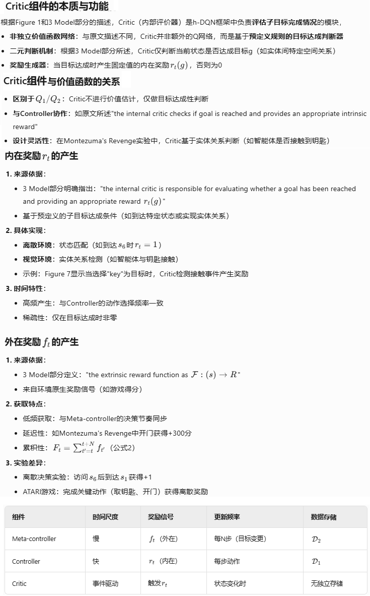

**Hierarchical Deep Reinforcement Learning: integrating Temporal Abstraction and Intrinsic Motivation**

### Introduction

还是老生常谈的稀疏奖励带来的挑战问题。

我们提出了一个框架，分层组织的深度强化学习模块在不同的时间尺度上工作。模型在两个层次上做出决策

1. 顶层模块（元控制器）接受状态并选择一个新目标
2. 低层模块（控制器）使用状态和选择的目标来选择动作，直到达到目标或情节终止。然后元控制器选择另一个目标并重复这两个步骤。

我们在不同的时间尺度上使用随机梯度下降来训练我们的模型，以优化预期的未来内在奖励（控制器）和外在奖励（元控制器）。

我们的方法在两个典型的奖励大范围延迟的任务上表现突出：

1. 一个离散的随机决策过程，在这个决策过程里，在获得最佳的外部奖励之前，须经过一长串状态转换
2. 一个典型的ATARI 游戏：蒙特祖玛的复仇

### Literature Review

提到了Sutton提出的options框架。Options框架为强化学习中的时间抽象提供了严谨的数学基础，同时也启发了后续许多分层强化学习方法的发展，包括h-DQN在内。

论文中提到的多时间尺度，可以这样理解，多时间尺度抽象与人类决策机制高度吻合：

1. **战略层**：规划未来几周/月的目标(极慢时间尺度)
2. **战术层**：制定每日计划(中等时间尺度)
3. **执行层**：完成具体动作(快速时间尺度)

论文提出的方法，没有为每个options训练一个Q function网络，而是只训练一个Q function网络，options作为该网络的一个输入以应对多个options的需要。

这样做有两个好处：

1. 在不同的options间可以共享训练
2. 对于大量的options的场景，该方法有更好的扩展性

论文又扯了一下 内在激励RL（我理解例如 RND、ICM）、面向对象的RL、DRL、认知科学与神经科学 等相关概念和子领域。

### Model

#### 原理




#### 伪代码


#### 可以用于连续动作空间吗？


### Experiments


第二个任务，蒙特祖玛的复仇，设计细节就很复杂，不摘抄了，贴一下结果：


### Conclusion

### bison的实验

#### frozen lake

[官方文档在这里](https://gymnasium.farama.org/environments/toy_text/frozen_lake/)

先二次包装一个适合h-DQN算法的frozen lake的环境：

```python
import copy
import random
import time
from typing import SupportsFloat, Any
import numpy as np

import gymnasium as gym
from gymnasium.core import ActType, ObsType

class CustomFrozenLake(gym.Env):
    def __init__(self, render_mode=None):
        super().__init__()
        self.map_size = 8
        mapname = f'{self.map_size}x{self.map_size}'
        self.env = gym.make('FrozenLake-v1', desc=None, map_name=mapname, is_slippery=True, render_mode=render_mode)
        self.map = self.env.unwrapped.desc #type:np.ndarray
        #print(f"map type:{type(self.map)}")
        self.map[0,0] = b'F'

    def pos2xy(self, pos:int):
        row = pos // self.map_size
        col = pos - row * self.map_size
        return row, col

    def step(
        self, action: ActType
    ) -> tuple[ObsType, SupportsFloat, bool, bool, dict[str, Any]]:
        next_obs, reward, terminated, truncated, info = self.env.step(action)
        row, col = self.pos2xy(next_obs)
        next_state = copy.copy(self.map)
        next_state[row, col] = b'A' # agent
        next_state = next_state.view(np.uint8) / 255.0
        return next_state, reward, terminated, truncated, info

    def reset(
        self,
        *,
        seed: int | None = None,
        options: dict[str, Any] | None = None,
    ) -> tuple[ObsType, dict[str, Any]]:
        obs, info = self.env.reset(seed=seed, options=options)
        row, col = self.pos2xy(obs)
        state = copy.copy(self.map)
        state[row, col] = b'A'  # agent
        state = state.view(np.uint8) / 255.0
        return state, info
    # 得到可以作为子目标的位置
    def get_valid_subgoal(self):
        subgoal = copy.copy(self.map)
        return (subgoal == b'F').astype(np.int32)


# 测试代码
env = CustomFrozenLake()
env.reset()
print(env.get_valid_subgoal())
while True:
    action = random.randint(0,3)
    array, r, terminated, truncated, info = env.step(action)
    print(array)

    time.sleep(2)

```

