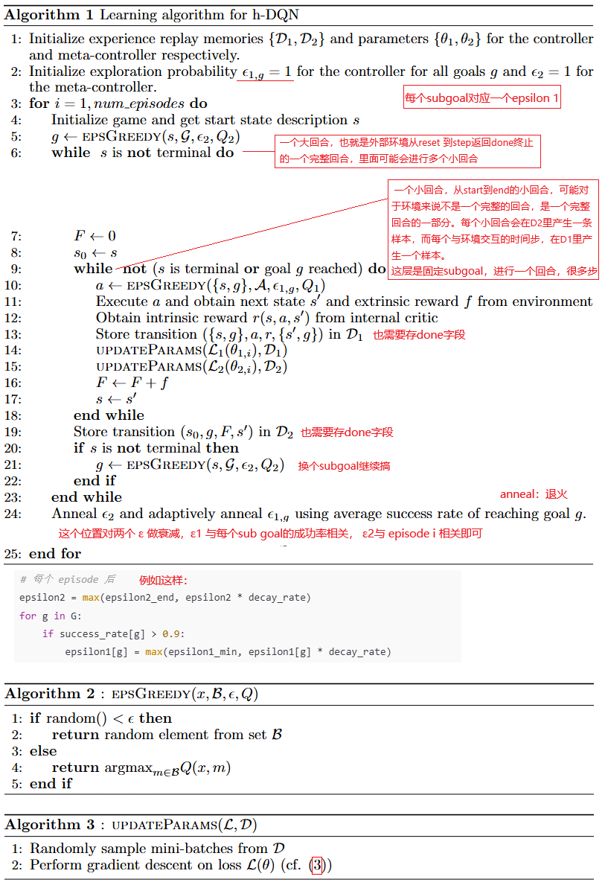

**Hierarchical Deep Reinforcement Learning: integrating Temporal Abstraction and Intrinsic Motivation**

### Introduction

还是老生常谈的稀疏奖励带来的挑战问题。

我们提出了一个框架，分层组织的深度强化学习模块在不同的时间尺度上工作。模型在两个层次上做出决策

1. 顶层模块（元控制器）接受状态并选择一个新目标
2. 低层模块（控制器）使用状态和选择的目标来选择动作，直到达到目标或情节终止。然后元控制器选择另一个目标并重复这两个步骤。

我们在不同的时间尺度上使用随机梯度下降来训练我们的模型，以优化预期的未来内在奖励（控制器）和外在奖励（元控制器）。

我们的方法在两个典型的奖励大范围延迟的任务上表现突出：

1. 一个离散的随机决策过程，在这个决策过程里，在获得最佳的外部奖励之前，须经过一长串状态转换
2. 一个典型的ATARI 游戏：蒙特祖玛的复仇

### Literature Review

提到了Sutton提出的options框架。Options框架为强化学习中的时间抽象提供了严谨的数学基础，同时也启发了后续许多分层强化学习方法的发展，包括h-DQN在内。

论文中提到的多时间尺度，可以这样理解，多时间尺度抽象与人类决策机制高度吻合：

1. **战略层**：规划未来几周/月的目标(极慢时间尺度)
2. **战术层**：制定每日计划(中等时间尺度)
3. **执行层**：完成具体动作(快速时间尺度)

论文提出的方法，没有为每个options训练一个Q function网络，而是只训练一个Q function网络，options作为该网络的一个输入以应对多个options的需要。

这样做有两个好处：

1. 在不同的options间可以共享训练
2. 对于大量的options的场景，该方法有更好的扩展性

论文又扯了一下 内在激励RL（我理解例如 RND、ICM）、面向对象的RL、DRL、认知科学与神经科学 等相关概念和子领域。

### Model

### Experiments

第二个任务，蒙特祖玛的复仇，设计细节就很复杂，不摘抄了，贴一下结果：

### Conclusion

### bison的实验