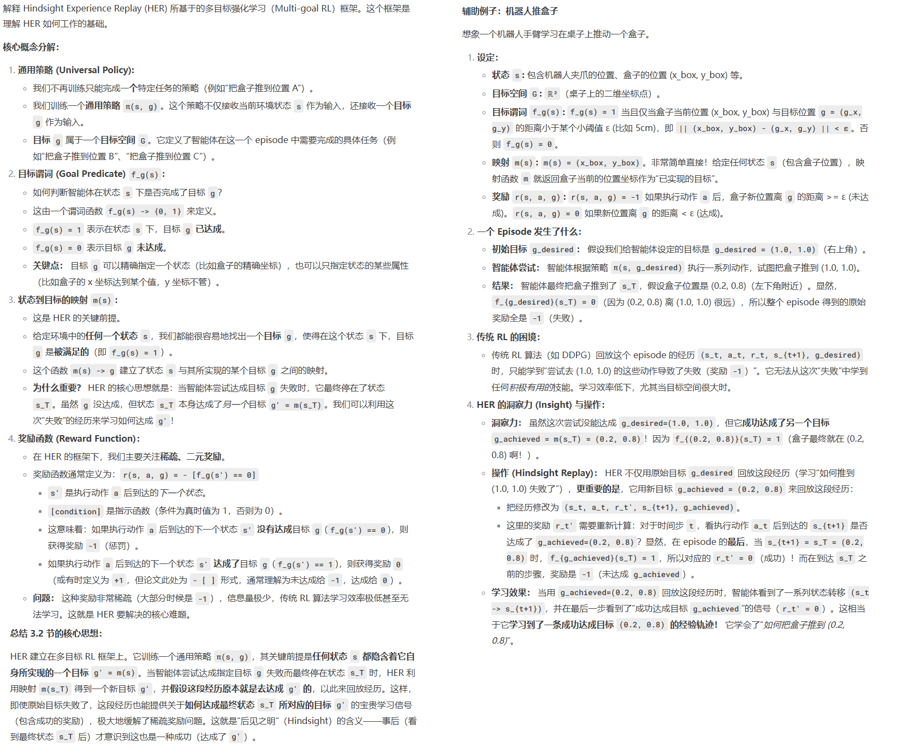

**Hindsight Experience Replay**

### Introduction

RL面临很大的一个挑战是奖励稀疏的问题，而人工设计episode中间的reward值也是很有挑战的，需要精通RL领域和业务领域的知识，同时还需要反复调试reward值才能使得RL收敛（RL对reward是出了名的敏感）。

本论文贡献的HER方法，是一种通用的、可以和任何off-policy方法结合的reward shaping方法，用于处理稀疏的二值奖励（任务要么完成了，要么没有完整，没有更多的奖励信息）的任务。

我理解HER的主要思想就是：

1. 通常的off-policy方法是训练在确定目标g 下的策略 Pi(state) --> action，而对于HER训练的策略，输入参数不只有state，还有目标g'，也就是HER训练策略 Pi(state, g')-->action，通过深度神经网络的泛化能力，策略网络能学会不同目标下的行为映射。训练收敛后，输入desired goal的时候，策略网络能够指挥agent执行正确的动作，到达desired goal
2. HER 会将一个 episode 中实际达到的某些状态（比如最终状态 sTs_TsT）**当作目标**，将这条本来以“失败”告终的轨迹转化为“成功”轨迹来训练策略。也就是说，在经验回放时，不仅使用原始目标 ggg，还使用替换后的目标 g′=m(sT)g' = m(s_T)g′=m(sT)，从而增强经验多样性和可学习性
3. HER 是一种数据增强方式，本质上是通过**目标的替换**，来增加有效的训练样本数量，提升样本效率。

### Background

简单介绍了RL、DQN、DDPG、Universal Value Function Approximator

其中UVFA方法我比较陌生，所以专门摘抄一下:


### Hindsight Experience Replay

一个典型的任务是比特翻转，当比特位数 n 大于13的时候，传统的DQN方法已经无法让agent收敛了，但是DQN+HER可以做到 n 为40的时候还能收敛。

#### HER的思路：



#### 算法：


#### 如何直观的理解HER


### Expertiments


关于多目标和单目标：

From Fig. 4 it is clear that DDPG+HER performs much better than pure DDPG even if the goal state is identical in all episodes. More importantly, comparing Fig.3 and Fig.4 we can also notice that HER learns faster if training episodes contain multiple goals, so in practice it is advisable to train on multiple goals even if we care only about one of them

### Conclusion

在**Hindsight Experience Replay (HER)** 的论文中，**奖励通常是稀疏且二元的**（如成功/失败），但**HER的核心思想并不严格依赖二元奖励**，而是适用于**稀疏奖励**的场景。

### bison的实验

#### 疯狂的赛车

环境的定义：

```python
import datetime
import random
import time

import numpy as np
import pybullet as p
import pybullet_data
import torch
import gym
from gym import spaces
import gymnasium as gym
import numpy as np
from gymnasium import spaces
from torch.utils.tensorboard import SummaryWriter
import math
import imageio


class RaceCarEnv(gym.Env ):
    """
    赛车强化学习环境，基于PyBullet和PyTorch实现
    环境特点：
    - 包含一个封闭赛道，有墙壁边界
    - 赛车需要从起点到终点，避免撞墙
    - 奖励设计：撞墙惩罚-1，移动距离负奖励，到达终点+3
    - 状态空间：车辆位置
    - 动作空间：转向和油门控制
    """

    def __init__(self, render=False,fps=100, rank=0):
        """
        初始化环境
        Args:
            render (bool): 是否开启GUI渲染
        """
        super(RaceCarEnv, self).__init__()
        if rank == 0:
            self.writer  = SummaryWriter(log_dir=f"logs/RaceCarEnv_{datetime.datetime.now().strftime('%y%m%d_%H%M%S')}")
        else:
            self.writer = None
        self.rank = rank

        # 连接物理引擎
        if render:
            self.physicsClient = p.connect(p.GUI)
        else:
            self.physicsClient = p.connect(p.DIRECT)

        # 设置搜索路径
        p.setAdditionalSearchPath(pybullet_data.getDataPath())
        self.fps = 100
        p.setTimeStep(1/self.fps, physicsClientId=self.physicsClient)
        p.setRealTimeSimulation(0, physicsClientId=self.physicsClient)

        # 定义动作空间
        self.action_space = spaces.Box(
            low=np.array([-1, 0]),  # 转向, 油门
            high=np.array([1, 1]),
            dtype=np.float32
        )

        # 定义 observation_space（Dict 格式）
        self.single_state_space = spaces.Box(
            low=-np.inf, high=np.inf, shape=(9,), dtype=np.float32
        )
        self.goal_space = spaces.Box(
            low=np.array([-np.inf, -np.inf]), high=np.array([np.inf, np.inf]), dtype=np.float32
        )
        self.observation_space = spaces.Dict({
            'observation': self.single_state_space,
            'achieved_goal': self.goal_space,
            'desired_goal': self.goal_space
        })
        '''
        上面很多维度都是实数域，范围太大，直接输入到神经网络会导致梯度异常。常用的归一化/标准化方法：
        1. 在线统计观测值的均值和标准差，实现自适应标准化
        2. 神经网络内部添加归一化层，自动适应输入分布
        3. 值截断（如限制到[-10, 10]），但可能损失信息
        4. 对无界值通过tanh压缩到(-1, 1)，需根据物理意义调整缩放系数：
        '''

        # 环境参数
        self.max_steps = 10000  # 最大步数
        self.current_step = 0 #每一回合里的步数计数器
        self.total_step = 0  #环境运行过程中一直累加的计数器
        self.car = None
        self.walls = []
        self.finish_line = None
        self.start_pos = [0.5, 0.5,0.1]  # 起点位置
        self.finish_pos = [14.5, 7.5, 0.1]  # 终点位置
        self.goal = np.array(self.finish_pos[:2].copy(), dtype=np.float32)
        self.last_pos = None  # 上一步的位置
        self.recordVedio = False
        self.frames = []
        self.prng = random.Random()  # 创建实例

        self.coins = [] #中途奖励的金币
        # 重置环境
        self.reset()

    def _create_track(self):
        """创建封闭的S型赛道"""
        p.resetSimulation()
        p.setGravity(0, 0, -10)

        # 加载地面和赛车
        p.loadURDF("plane.urdf")
        self.car = p.loadURDF("racecar/racecar.urdf", self.start_pos)

        if self.total_step == 3:
            for j in range(p.getNumJoints(self.car)):
                info = p.getJointInfo(self.car, j)
                print(f"Joint {j}: Name={info[1]}, Type={info[2]}, range:{info[8]} to {info[9]}")

        self._add_wall(0,0, 2,0)
        self._add_wall(0, 0, 0, 4)
        self._add_wall(2, 0, 2, 2)
        self._add_wall(0,4, 8,4)
        self._add_wall(2, 2, 10, 2)
        self._add_wall(10, 2, 10, 6)
        self._add_wall(10,6, 15,6)

        self._add_wall(8, 4, 8, 8)
        self._add_wall(8, 8, 15, 8)
        self._add_wall(15, 6, 15, 8)

        #赛道中间还有金币，鼓励探索
        self.coins.append([3 ,3])
        self.coins.append([9, 5])
        self.coins.append([11, 7])

    def _add_wall(self, startx, starty, endx, endy):
        """
        在(startx,starty)到(endx,endy)之间创建一堵物理墙
        参数:
            startx, starty: 起点坐标 (x,y)
            endx, endy: 终点坐标 (x,y)
        返回:
            wall_id: 创建的墙体ID
        """
        # 墙体参数
        thickness = 0.3  # 厚度0.3米
        height = 0.5  # 高度0.5米
        mass = 100  # 质量100kg

        # 计算墙体中心位置和长度
        center_x = (startx + endx) / 2
        center_y = (starty + endy) / 2
        length = math.sqrt((endx - startx) ** 2 + (endy - starty) ** 2)

        # 计算墙体朝向角度（弧度）
        angle = math.atan2(endy - starty, endx - startx)

        # 创建碰撞形状（长方体）
        wall_collision = p.createCollisionShape(
            p.GEOM_BOX,
            halfExtents=[length / 2, thickness / 2, height / 2]
        )

        # 创建视觉形状（灰色半透明）
        wall_visual = p.createVisualShape(
            p.GEOM_BOX,
            halfExtents=[length / 2, thickness / 2, height / 2],
            rgbaColor=[0.5, 0.5, 0.5, 0.8]
        )

        # 创建墙体刚体
        wall_id = p.createMultiBody(
            baseMass=mass,
            baseCollisionShapeIndex=wall_collision,
            baseVisualShapeIndex=wall_visual,
            basePosition=[center_x, center_y, height / 2],
            baseOrientation=p.getQuaternionFromEuler([0, 0, angle])
        )

        # 设置物理参数（静态墙体）
        p.changeDynamics(
            wall_id,
            -1,
            lateralFriction=1.0,
            restitution=0.7,
            linearDamping=0.5,
            angularDamping=0.5
        )
        self.walls.append(wall_id)

        return wall_id

    def reset(self, seed=None, options=None, **kwargs):
        super().reset(seed=seed)

        """重置环境到初始状态"""
        p.resetSimulation()

        # 随机选择赛道上的某个点作为目标（而不仅是终点）

        self.prng.seed(seed if seed else 42)  # 设置种子
        possible_goals = [[3, 3], [9, 5], [11, 7], [14.5, 7.5]]  # 金币位置+终点
        self.goal = self.prng.choice(possible_goals) # 使用固定seed的随机选择

        self._create_track()

        # 重置赛车位置和速度
        p.resetBasePositionAndOrientation(
            self.car,
            self.start_pos,
            p.getQuaternionFromEuler([0, 0, math.pi/2])
        )
        p.resetBaseVelocity(
            self.car,
            linearVelocity=[0, 0, 0],
            angularVelocity=[0, 0, 0]
        )

        self.current_step = 0
        self.last_pos = np.array(self.start_pos[:2])  # 只记录x,y坐标

        #抽样录一个回合视频
        if self.recordVedio and len(self.frames) > 10:
            imageio.mimsave(f"./racecar_{datetime.datetime.now().strftime('%H%M%S')}.mp4", self.frames, format='FFMPEG', fps=self.fps)
            if self.writer: self.writer.add_scalar("steps/saveMP4", 1, self.total_step)

        self.frames = []
        if self.rank == 0 and random.randint(0, 25) < 1:
            self.recordVedio = True
        else:
            self.recordVedio = False

        # 获取初始状态
        state = self._get_state()
        return  {
                'observation': state,
                'achieved_goal': state[:2],
                'desired_goal': self.goal,
                },{}
    def _check_hit_wall(self):
        for cp in p.getContactPoints(self.car):
            if cp[2] in self.walls:
                if self.writer: self.writer.add_scalar("steps/hitWall", 1, self.total_step)
                return True
        return False
    def step(self, action):
        self._apply_action(action[0], action[1])
        p.stepSimulation()
        self.current_step += 1
        self.total_step += 1
        state = self._get_state()
        # 0表示成功 -1表示失败
        reward = self.compute_reward(state[:2], self.goal, {})
        done = (reward >= 0)
        if self._check_hit_wall():
            done = True
            reward = -1
        truncated = self.current_step >= self.max_steps

        if self.recordVedio:
            self.frames.append(self._render_camera_frame())

        self.last_pos = state[:2]
        obs = {
            "observation": state,
            "achieved_goal": state[:2],
            "desired_goal": self.goal
        }
        return obs, reward, done, truncated, {}

    def _apply_action(self, steer, throttle):
        '''
Joint 0: Name=b'base_link_joint', Type=4, range:0.0 to -1.0
Joint 1: Name=b'chassis_inertia_joint', Type=4, range:0.0 to -1.0
Joint 2: Name=b'left_rear_wheel_joint', Type=0, range:0.0 to -1.0
Joint 3: Name=b'right_rear_wheel_joint', Type=0, range:0.0 to -1.0
        Joint 4: Name=b'left_steering_hinge_joint', Type=0, range:-1.0 to 1.0
Joint 5: Name=b'left_front_wheel_joint', Type=0, range:0.0 to -1.0
        Joint 6: Name=b'right_steering_hinge_joint', Type=0, range:-1.0 to 1.0
Joint 7: Name=b'right_front_wheel_joint', Type=0, range:0.0 to -1.0
Joint 8: Name=b'hokuyo_joint', Type=4, range:0.0 to -1.0
Joint 9: Name=b'zed_camera_joint', Type=4, range:0.0 to -1.0
Joint 10: Name=b'zed_camera_left_joint', Type=4, range:0.0 to -1.0
Joint 11: Name=b'zed_camera_right_joint', Type=4, range:0.0 to -1.0

AI说：
若关节名义范围是[0.0, -1.0]（即默认负向旋转），但设置target_vel=2.0（正值）时：
物理引擎会尝试按正向旋转驱动关节。
实际能否达到目标速度取决于max_force和物理约束（如惯性、摩擦等）。
        '''
        """应用控制动作到赛车"""
        # 前轮转向
        steering_angle = steer   # 限制转向角度

        # 设置转向
        p.setJointMotorControl2(
            self.car,
            4,
            p.POSITION_CONTROL,
            targetPosition=-steering_angle
        )
        p.setJointMotorControl2(
            self.car,
            6,
            p.POSITION_CONTROL,
            targetPosition=-steering_angle
        )

        # 设置驱动轮速度
        max_force = 100
        target_vel = throttle * 50  # 控制速度


        for wheel in [2, 3, 5,7]:
            p.setJointMotorControl2(
                self.car,
                wheel,
                p.VELOCITY_CONTROL,
                targetVelocity=target_vel,
                force=max_force
            )

    def _render_camera_frame(self):
        car_pos, _ = p.getBasePositionAndOrientation(self.car)
        x, y = car_pos[0], car_pos[1]

        view_matrix = p.computeViewMatrix(
            cameraEyePosition=[x - 5, y - 5, 5],
            cameraTargetPosition=[x, y, 0],
            cameraUpVector=[0, 0, 1]
        )

        projection_matrix = p.computeProjectionMatrixFOV(
            fov=60,
            aspect=320 / 240,
            nearVal=0.1,
            farVal=100.0
        )

        width, height, rgb, _, _ = p.getCameraImage(
            width=320,
            height=240,
            viewMatrix=view_matrix,
            projectionMatrix=projection_matrix,
            renderer=p.ER_BULLET_HARDWARE_OPENGL
        )

        rgb_array = np.reshape(rgb, (height, width, 4))[:, :, :3].astype(np.uint8)
        return rgb_array

    def _get_state(self):
        """获取当前状态（车辆位置、速度和转向关节状态）"""
        # 1. 获取车辆位置（x,y）
        pos, _ = p.getBasePositionAndOrientation(self.car)
        position = np.array(pos[:2])  # 只取x,y坐标

        # 2. 获取车辆速度（x,y方向）
        linear_vel, _ = p.getBaseVelocity(self.car)
        velocity = np.array(linear_vel[:2])  # 只取x,y方向速度

        # 3 获取小车的朝向：
        pos, orn = p.getBasePositionAndOrientation(self.car)
        euler = p.getEulerFromQuaternion(orn)
        heading = euler[2]

        # 4. 获取转向关节状态（前轮两个关节）
        # 获取转向关节角度（前轮两个关节）
        steering_angle1 = p.getJointState(self.car, 4)[0]  # 第一个转向关节
        steering_angle2 = p.getJointState(self.car, 6)[0]  # 第二个转向关节

        # 获取转向关节角速度
        steering_vel1 = p.getJointState(self.car, 4)[1]  # 第一个转向关节角速度
        steering_vel2 = p.getJointState(self.car, 6)[1]  # 第二个转向关节角速度

        # 合并所有状态信息
        state = np.concatenate([
            position,  # 车辆位置 (x,y)
            velocity,  # 车辆速度 (vx,vy)
            [heading],
            [steering_angle1],  # 第一个转向关节角度
            [steering_angle2],  # 第二个转向关节角度
            [steering_vel1],  # 第一个转向关节角速度
            [steering_vel2]  # 第二个转向关节角速度
        ], dtype=np.float32)

        #抽样打印一下状态信息，以观察值的范围
        if self.total_step > 1000 and self.total_step < 1002:
            print("state sample:", state)

        return state

    def compute_reward(self, achieved_goal, desired_goal, info):

        if achieved_goal.ndim > 1:
            # 广播 desired_goal 自动匹配 achieved_goal 的维度，然后按行计算距离
            distances = np.linalg.norm(achieved_goal - desired_goal, axis=1)
            rewards = np.where(distances < 1.0, 0.0, -1.0).astype(np.float32)
            return rewards
        else:
            distance = np.linalg.norm(achieved_goal - desired_goal)
            reward = 0 if distance < 1.0 else -1.0
            return np.array(reward, dtype=np.float32)


    def render(self, mode='human'):
        """渲染环境"""
        pass  # PyBullet会自动处理渲染

    def close(self):
        """关闭环境"""
        p.disconnect()

```

SB3极简的训练代码：

```python
import datetime
from stable_baselines3.common.vec_env import DummyVecEnv, SubprocVecEnv, VecNormalize, VecMonitor
#from stable_baselines3.common.env_checker import check_env
from gymnasium.utils.env_checker import check_env
from racecar_env import RaceCarEnv
from stable_baselines3 import HerReplayBuffer,SAC,HER
from torch.utils.tensorboard import SummaryWriter

def make_env(rank, writer=None, render=False):
    """
    创建一个环境构造函数，供 SubprocVecEnv 使用
    """
    def _init():
        env = RaceCarEnv(render=render, rank=rank)
        return env
    return _init

if __name__ == '__main__':

    # 创建 4 个并行环境
    num_envs = 4
    env_fns = [make_env(i, writer=None, render=False) for i in range(num_envs)]
    env = SubprocVecEnv(env_fns)

    env = VecNormalize(env, norm_obs=True, norm_reward=False, clip_obs=10.0) #对环境的输出（观测、奖励）进行归一化标准化
    env = VecMonitor(env)

    # Initialize the model
    # 在 SB3 中，"future" 策略会从当前 transition 之后的 k 个时间步中随机选择一个状态作为替代目标（k 由 n_sampled_goal 参数控制）。
    # 相比 "final"（仅用 episode 的最终状态作为替代目标），"future" 能提供更多样化的目标，通常效果更好。
    # 定义 HER 的关键参数
    model = SAC(
        policy="MultiInputPolicy",  # 因为 observation 是 Dict
        env=env,
        replay_buffer_class=HerReplayBuffer,
        replay_buffer_kwargs=dict(
            n_sampled_goal=4,  # 每条经验额外采样几个 g'
            goal_selection_strategy="future",  # 可选 final / future / episode
        ),
        learning_starts=10000,
        verbose=1,
        batch_size=256,
        learning_rate=3e-4,
        gamma=0.98,
        buffer_size=int(1e6),
        train_freq=1,
        gradient_steps=1,
        policy_kwargs=dict(net_arch=[256, 256]),
        tensorboard_log='logs/'
    )


    # 3. 训练
    model.learn(total_timesteps=2_000_000)

    env.close()
```

不能收敛，不知道问题出在哪里