**Data-Efficient Hierarchical Reinforcement Learning**

### 1、Introduction

DRL在机械手臂控制等场景表现突出，但它只能完成一些原子的、简单的任务，例如移动一个零件，极少涉及到复杂的任务，例如在一个maze游戏里，蚂蚁需要跑到到绿色的终点位置，它除了需要规划线路，还需要找到钥匙打开门，或者推动方块填充沟壑铺路。

层级RL方法，有多层策略网络，分别负责决策和执行，很有希望搞定上述复杂任务。先前的HRL研究确实取得了一些鼓舞人心的成果。然而，许多方法缺乏通用性，往往需要一定程度的手工设计以适配具体任务，而且常常依赖昂贵的on-policy训练方式，无法充分利用近年来在off-policy无模型强化学习方面的进展——这些进展已经显著降低了样本复杂度要求。


在HRL中，在构造低层策略时，**能否区分出语义不同的行为模块**，是能否充分发挥 HRL 优势的关键。下面举个例子说明这个观点：


我们提出了一种HIRO算法，它的设计核心和动机要点：

- 目标：构建一种通用且高效的HRL算法，避免以往方法中过于依赖任务特定设计和昂贵的on-policy训练。

------

1、通用性设计（Generality）

- 传统HRL方法通常需要手工设计低层行为空间或子任务结构，不具有普适性。
- HIRO不依赖任务特定的结构或人为设定的子技能库，而是让高层输出“目标状态”作为指令。
- 低层策略的目标是使 agent 的状态靠近这个目标状态，且这一过程不依赖于外部任务结构。
- 所用的目标直接来自环境的原始状态观测（raw state observation），比如位置、姿态、关节角度等，而不是经过神经网络或其他方法变换过的抽象表示（embedding）。当然这点在很多物理控制类任务中很有效，但并不是在所有场景下都适用

------

2、样本效率提升（Sample Efficiency）

- 为了能在实际场景（如机器人控制）中使用，样本效率成为关键。
- HIRO在高层和低层都采用off-policy训练方法，可以利用已有的经验数据，不需每次都重新交互。
- 这样能利用近年来off-policy RL方法（如TD3）带来的采样效率提升。
- 相比需要on-policy策略梯度的旧HRL方法，大大减少了环境交互次数。

------

3、低层策略变化带来的非平稳性问题（Non-Stationarity Issue）

- 在HRL中，高层策略选择的是“目标”或“子任务”，由低层策略去执行。
- 然而低层策略在训练过程中会持续变化，导致同一个高层目标对应的实际行为也在变。
- 这会造成高层观察到的“状态—目标—结果”的经验样本变得不稳定（non-stationary），影响高层训练。例如：高层训练时复用旧数据（如旧的“往前走3米” → 早期低层策略还不完善，所以没怎么移动），在当前低层下却完全不成立，导致高层经验“失真”，训练变得不稳定。
- HIRO引入**off-policy修正机制（off-policy correction）**，通过“重标定”历史高层动作来解决这个问题：
  - 将历史高层经验中的目标，替换为在当前低层策略下更可能产生相同行为的目标；
  - 保证这些经验在当前策略下仍是有效的，从而可以被用于训练。

总之：HIRO通过通用的目标指令机制、off-policy双层训练架构和重标定技巧，解决了传统HRL中通用性差、样本效率低和高层训练不稳定的问题。

### 2、Background

介绍了RL、off-policy RL、TD Learning，这个比较熟悉，不赘述。

### 3、General and Efficient Hierarchical Reinforcement Learning

 HIRO: **HI**erarchical **R**einforcement learning with **O**ff-policy correction.

#### 算法原理

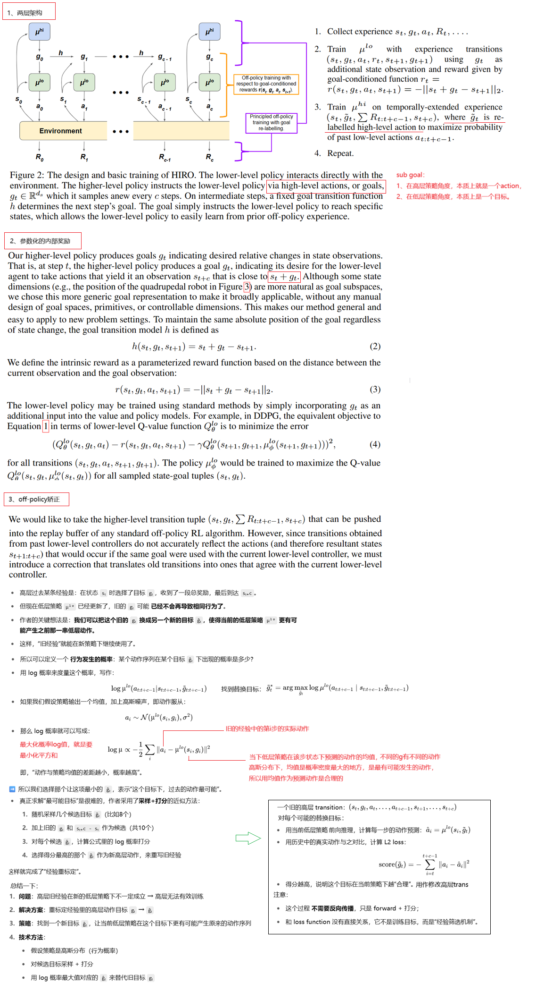

#### 深入的理解算法

##### 打分的函数实现

特别注意：高层的replaybuffer里的一次trainsition，不止记录 s, g, s', R， 要把整个低层的完整轨迹都要记录下来，从s, a..... s'。

高层的一次transition包括：

| 项目          | 说明                                                  |
| ------------- | ----------------------------------------------------- |
| `s_hi`        | 高层起始状态（如第 0 步）                             |
| `g`           | 高层指令（goal 向量）                                 |
| `R_sum`       | 在该高层指令下，累计的环境奖励（∑_{t=0}^{c-1} R_t）   |
| `s_hi_prime`  | 高层终止状态（例如第 c 步时的状态）                   |
| `a_{t:t+c-1`} | **完整的低层动作序列**，用于做 off-policy correction  |
| `s_{t:t+c`}   | **完整的低层状态序列**，配合动作才能做目标 relabeling |

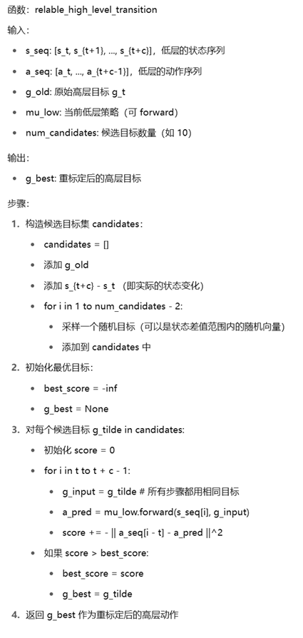

##### 什么时候做矫正操作

论文中明确说了：

> 每次训练高层 Q 网络时，从高层 buffer 中采样 batch，然后**在使用前对每条 transition 的 goal 进行 re-labeling**，选出一个最可能造成原来 low-level action 序列的 `g̃`（goal relabeling）。因为底层策略在不断更新。
>
> 

##### 算法的伪代码，以DQN为例

```python
# 初始化高层Q函数 Q_hi(s, g)，目标网络 Q_hi_target
# 初始化低层Q函数 Q_lo(s, g, a)，目标网络 Q_lo_target
# 初始化 replay buffer：RB_hi 和 RB_lo
# 初始化 epsilon_hi, epsilon_lo（用于 ε-greedy）

for episode in range(max_episodes):
    s = env.reset()
    t = 0

    while not done:
        # === 每 c 步高层给出一个新的 goal ===
        if t % c == 0:
            # ε-greedy 选择 goal：g ∈ G
            if random() < epsilon_hi:
                g = random_goal()  # 随机采样一个目标向量
            else:
                g = argmax_g Q_hi(s, g)

            s_hi = s
            low_states = []
            low_actions = []
            env_rewards = []

        # === 低层执行动作 ===
        if random() < epsilon_lo:
            a = random_action()
        else:
            a = argmax_a Q_lo(s, g, a)

        s_next, R_env, done, _ = env.step(a)

        # 内在奖励：r = -||s + g - s_next||²
        r_intr = -np.linalg.norm((s + g - s_next)) ** 2

        # 存入低层 replay buffer
        RB_lo.append((s, g, a, r_intr, s_next))

        # 记录高层轨迹用
        low_states.append(s)
        low_actions.append(a)
        env_rewards.append(R_env)

        t += 1
        s = s_next

        # === 每 c 步或 episode 结束时，高层存经验 ===
        if t % c == 0 or done:
            s_hi_next = s
            R_sum = sum(env_rewards)
            low_states.append(s)  # 加入最后的 s_t+c
            RB_hi.append((s_hi, g, R_sum, s_hi_next, low_states, low_actions))

    # === 训练低层 Q 网络 ===
    for _ in range(lo_update_steps):
        (s, g, a, r, s_next) = sample_batch(RB_lo)
        a_next = argmax_a Q_lo(s_next, g, a)
        y = r + γ * Q_lo_target(s_next, g, a_next)
        loss = (Q_lo(s, g, a) - y)²
        update Q_lo to minimize loss

    # === 训练高层 Q 网络（含 relabel） ===
    for _ in range(hi_update_steps):
        (s_hi, g_old, R_sum, s_hi_next, low_states, low_actions) = sample_batch(RB_hi)

        # --- Off-policy correction: goal relabel ---
        candidate_goals = sample_10_goals(s_hi, s_hi_next)
        best_g = argmin_g [
            ∑_{i=0}^{c-1} ||a_i - argmax_a Q_lo(low_states[i], g_i, a)||²
        ]
        # g_i 用 h: g_{i+1} = s_i + g_i - s_{i+1}

        # --- Q_hi 训练 ---
        g_next = argmax_g Q_hi(s_hi_next, g)
        y = R_sum + γ * Q_hi_target(s_hi_next, g_next)
        loss = (Q_hi(s_hi, best_g) - y)²
        update Q_hi to minimize loss

    # === 软更新目标网络 ===
    soft_update(Q_lo, Q_lo_target, τ)
    soft_update(Q_hi, Q_hi_target, τ)

```


### 4、Related Work

提到了一些HRL框架：

1. options framework
2. option-critic framework
3. auxiliary rewards for the low-level policies
4.  FeUdal Networks（FuN）

并简单的比对了HIRO的优势

### 5、Experiments

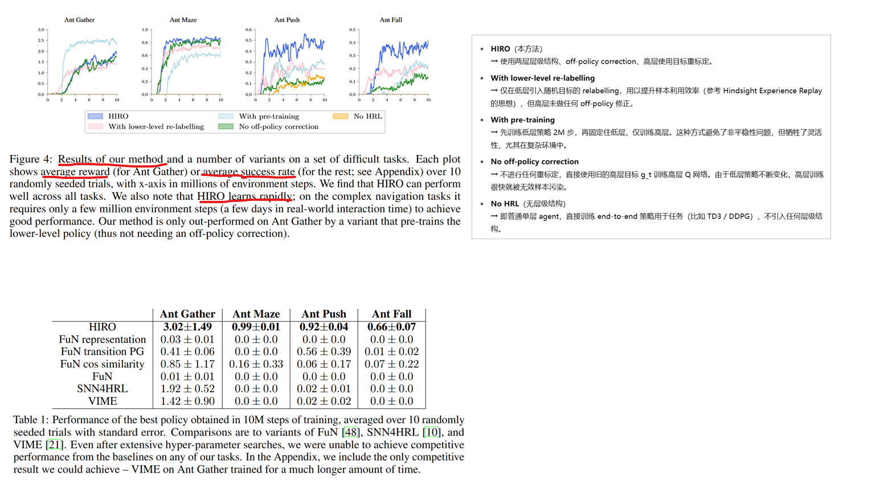

### 6、Conclusion

We have presented a method:

1. training a two-layer hierarchical policy. 
2. be general, using learned goals to pass instructions from the higher-level policy to the lower-level one. 
3. be trained in an off-policy manner concurrently for highly sample-efficient learning. 
4. our method outperforms prior HRL algorithms and can solve exceedingly complex tasks 

Our results are still far from perfect, and there is much work left for future research to improve the stability and performance of HRL methods on these tasks.

### 7、Bison的实验

可以参考的开源实现，可读性不是很好：

```
https://github.com/watakandai/hiro_pytorch
```

#### 预备知识

HRL的工程通常会比其他基础RL算法实现要复杂一些，至少涉及到两层策略/价值网络，所以代码的模块化要求高一些，例如我的这个实验，准备基于SAC算法，就会有两个基础模块 low_sac和hi_sac，他们都是我拷贝的之前SAC的实现代码，他们包含很多相同名字的全局变量和类名，那么怎么使用才能避免冲突呢：


#### FetchReach任务

##### 定义任务

```python
import gymnasium as gym
import numpy as np
from sqlalchemy.testing.exclusions import succeeds_if


# 环境的再封装
# 环境返回的state里要包含desired_goal
# 环境的observation_space需要相应的改动
# 手动构造reward，根据举例desired_goal的距离变化，返回reward，这个没必要，我暂时只需要稀疏奖励
# sparse: the returned reward can have two values:
#         -1 if the end effector hasn’t reached its final target position,
#         and 0 if the end effector is in the final target position (the robot is considered to have reached the goal
#         if the Euclidean distance between the end effector and the goal is lower than 0.05 m).
class CustomFetchReachEnv(gym.Env):
    """
    自定义封装 FetchReach-v3 环境，符合 Gymnasium 接口规范。
    兼容 SB3 训练，支持 TensorBoard 记录 success_rate。
    """

    def __init__(self, render_mode=None):
        """
        初始化环境。
        Args:
            render_mode (str, optional): 渲染模式，支持 "human" 或 "rgb_array"。
        """
        super().__init__()


        # 创建原始 FetchReach-v3 环境
        self._env = gym.make("FetchReach-v3", render_mode=render_mode, max_episode_steps=100)

        # 继承原始的动作和观测空间
        self.action_space = self._env.action_space
        self.observation_space = gym.spaces.Box(-np.inf, np.inf, shape=(10+3,))  # 简化后的状态, 10个observe，3个desired_goal，一起拼接为state返回

        self.total_step = 0

        # 初始化渲染模式
        self.render_mode = render_mode
        self.desired_goal = None


    def reset(self, seed=None, options=None):
        """
        重置环境，返回初始观测和 info。
        """
        obs, info = self._env.reset(seed=seed, options=options)
        '''
        #尝试固定目标位置进行训练，结果显示可以到达100%成功率
        if self.desired_goal is None:
            self.desired_goal = obs['desired_goal']
            print(f"desired:{self.desired_goal}")
            writer.add_text('desired_goal', f"{self.desired_goal}", 1)'''

        self.desired_goal = obs['desired_goal']


        state = np.concatenate( [obs['observation'],self.desired_goal ] )

        info['desired_goal'] = self.desired_goal


        return state, info

    def step(self, action):
        """
        执行动作，返回 (obs, reward, done, truncated, info)。
        注意：Gymnasium 的 step() 返回 5 个值（包括 truncated）。
        """
        obs, external_reward, terminated, truncated, info = self._env.step(action)
        self.total_step += 1
        state = np.concatenate( [obs['observation'],self.desired_goal ] )
        info['desired_goal'] = self.desired_goal

        # 确保 info 包含 is_success（SB3 的 success_rate 依赖此字段）
        if external_reward >= 0.0 and terminated:
            success = True
        else:
            success = False

        info["is_success"] = success

        return state, external_reward, terminated, truncated, info

    def render(self):
        """
        渲染环境（可选）。
        """
        return self._env.render()

    def close(self):
        """
        关闭环境，释放资源。
        """
        self._env.close()

    @property
    def unwrapped(self):
        """
        返回原始环境（用于访问原始方法）。
        """
        return self._env
```

##### 定义低层SAC

```python
import os
import random
import numpy as np
import gym
import torch
import torch.nn as nn
import torch.optim as optim
import torch.nn.functional as F
from torch.utils.tensorboard import SummaryWriter
from collections import deque, namedtuple
from datetime import datetime

# 设备配置
device = torch.device("cuda" if torch.cuda.is_available() else "cpu")

# 经验回放缓冲区
Transition = namedtuple('Transition', ('state', 'action', 'reward', 'next_state', 'done'))


class ReplayBuffer:
    def __init__(self, capacity):
        self.buffer = deque(maxlen=capacity)

    def push(self, *args):
        """保存一个transition到buffer"""
        self.buffer.append(Transition(*args))

    def sample(self, batch_size):
        """随机采样一个batch的transition"""
        transitions = random.sample(self.buffer, batch_size)
        # 将batch的transitions转换为Transition的batch
        batch = Transition(*zip(*transitions))

        # 转换为tensor并指定设备
        # state: (batch_size, state_dim) -> (batch_size, state_dim)
        state = torch.FloatTensor(np.array(batch.state)).to(device)
        # action: (batch_size, action_dim) -> (batch_size, action_dim)
        action = torch.FloatTensor(np.array(batch.action)).to(device)
        # reward: (batch_size,) -> (batch_size, 1)
        reward = torch.FloatTensor(np.array(batch.reward)).unsqueeze(1).to(device)
        # next_state: (batch_size, state_dim) -> (batch_size, state_dim)
        next_state = torch.FloatTensor(np.array(batch.next_state)).to(device)
        # done: (batch_size,) -> (batch_size, 1)
        done = torch.FloatTensor(np.array(batch.done)).unsqueeze(1).to(device)

        return state, action, reward, next_state, done

    def __len__(self):
        return len(self.buffer)


# 策略网络 (Actor)
class GaussianPolicy(nn.Module):
    def __init__(self, state_dim, action_dim, hidden_dim=256, max_action=1.0):
        super(GaussianPolicy, self).__init__()
        self.max_action = max_action
        self.norm = nn.LayerNorm(state_dim)
        # 特征提取层
        self.fc1 = nn.Linear(state_dim, hidden_dim)
        self.fc2 = nn.Linear(hidden_dim, hidden_dim)

        # 输出均值和log标准差
        self.mean = nn.Linear(hidden_dim, action_dim)
        self.log_std = nn.Linear(hidden_dim, action_dim)

    def forward(self, state):
        """前向传播，返回动作的均值和log标准差"""
        # state: (batch_size, state_dim) -> (batch_size, hidden_dim)
        state = self.norm(state)
        x = F.relu(self.fc1(state))
        x = F.relu(self.fc2(x))

        # mean: (batch_size, action_dim)
        mean = self.mean(x)
        # log_std: (batch_size, action_dim)
        log_std = self.log_std(x)
        # 限制log_std的范围
        log_std = torch.clamp(log_std, min=-20, max=2)

        return mean, log_std

    def sample(self, state):
        """从策略中采样动作，并计算对数概率"""
        mean, log_std = self.forward(state)
        std = log_std.exp()

        # 采样动作
        normal_noise = torch.randn_like(mean)
        raw_action = mean + normal_noise * std  # 未被 clamp 的原始 action

        # 计算原始对数概率
        log_prob = -0.5 * (normal_noise.pow(2) + 2 * log_std + np.log(2 * np.pi))
        log_prob = log_prob.sum(dim=-1, keepdim=True)

        # 🔧 ⚠️ 修正 tanh 的 log_prob BEFORE clamp
        correction = 2 * (np.log(2) - raw_action - F.softplus(-2 * raw_action))
        log_prob -= correction.sum(dim=-1, keepdim=True)

        # 最后才执行 clamp（用于稳定 backward，不影响 log_prob 计算）
        raw_action = torch.clamp(raw_action, -20, 20)

        # 输出最终 action
        action = torch.tanh(raw_action) * self.max_action

        return action, log_prob


# Q网络 (Critic)
class QNetwork(nn.Module):
    def __init__(self, state_dim, action_dim, hidden_dim=256):
        super(QNetwork, self).__init__()
        self.norm = nn.LayerNorm(state_dim+action_dim)
        # Q1网络
        self.fc1 = nn.Linear(state_dim + action_dim, hidden_dim)
        self.fc2 = nn.Linear(hidden_dim, hidden_dim)
        self.fc3 = nn.Linear(hidden_dim, 1)

        # Q2网络
        self.fc4 = nn.Linear(state_dim + action_dim, hidden_dim)
        self.fc5 = nn.Linear(hidden_dim, hidden_dim)
        self.fc6 = nn.Linear(hidden_dim, 1)

    def forward(self, state, action):
        """前向传播，返回两个Q值"""
        # state: (batch_size, state_dim)
        # action: (batch_size, action_dim)
        sa = torch.cat([state, action], dim=-1)
        sa = self.norm(sa)

        # Q1网络
        q1 = F.relu(self.fc1(sa))
        q1 = F.relu(self.fc2(q1))
        q1 = self.fc3(q1)

        # Q2网络
        q2 = F.relu(self.fc4(sa))
        q2 = F.relu(self.fc5(q2))
        q2 = self.fc6(q2)

        return q1, q2


# SAC算法主体
class HIRO_LOW_SAC:
    def __init__(self, state_dim, action_dim, max_action, writer):
        # 超参数
        self.gamma = 0.97
        self.tau = 0.005
        self.alpha = 0.2
        self.lr = 3e-4
        self.batch_size = 256
        self.buffer_size = 100000
        self.target_entropy = -action_dim
        self.automatic_entropy_tuning = True
        self.step_cnt = 0
        self.writer = writer

        # 网络初始化
        self.actor = GaussianPolicy(state_dim, action_dim, max_action=max_action).to(device)
        self.critic = QNetwork(state_dim, action_dim).to(device)
        self.critic_target = QNetwork(state_dim, action_dim).to(device)
        self.critic_target.load_state_dict(self.critic.state_dict())

        # 优化器
        self.actor_optimizer = optim.Adam(self.actor.parameters(), lr=self.lr)
        self.critic_optimizer = optim.Adam(self.critic.parameters(), lr=self.lr)

        # 自动调节温度系数alpha
        if self.automatic_entropy_tuning:
            self.log_alpha = torch.zeros(1, requires_grad=True, device=device)
            self.alpha_optimizer = optim.Adam([self.log_alpha], lr=self.lr)

        # 经验回放缓冲区
        self.replay_buffer = ReplayBuffer(self.buffer_size)

    def select_action(self, state, evaluate=False):
        """选择动作"""
        state = torch.FloatTensor(state).unsqueeze(0).to(device)
        if evaluate:
            # 评估时不添加噪声
            with torch.no_grad():
                mean, _ = self.actor(state)
                # 评估时希望表现稳定，因此直接使用均值（概率密度最大的点）.  tanh后把值映射到[-1,1]， 乘以max_action就 映射到环境动作空间
                action = torch.tanh(mean) * self.actor.max_action
        else:
            # 训练时采样动作
            action, _ = self.actor.sample(state)

        return action.detach().cpu().numpy()[0]

    def update_parameters(self):
        """更新网络参数"""
        if len(self.replay_buffer) < self.batch_size*10:
            return None,None,None
        self.step_cnt += 1

        # 从缓冲区采样一个batch
        state, action, reward, next_state, done = self.replay_buffer.sample(self.batch_size)

        with torch.no_grad():
            # 采样下一个动作并计算其对数概率
            next_action, next_log_prob = self.actor.sample(next_state)

            # 计算目标Q值
            q1_next, q2_next = self.critic_target(next_state, next_action)
            min_q_next = torch.min(q1_next, q2_next) - self.alpha * next_log_prob
            min_q_next = min_q_next.view(-1,1)
            target_q = reward + (1 - done) * self.gamma * min_q_next

        # 更新Critic网络
        current_q1, current_q2 = self.critic(state, action)
        critic_loss = F.mse_loss(current_q1, target_q) + F.mse_loss(current_q2, target_q)

        self.critic_optimizer.zero_grad()
        critic_loss.backward()
        self.critic_optimizer.step()

        # 更新Actor网络
        new_action, log_prob = self.actor.sample(state)
        q1, q2 = self.critic(state, new_action)
        min_q = torch.min(q1, q2)
        # 最大化熵和最大化min_q，因为是梯度下降，要实现梯度上升，所以min_q前面有负号， 熵是 -log_prob，负负得正
        actor_loss = (self.alpha * log_prob - min_q).mean()

        self.actor_optimizer.zero_grad()
        actor_loss.backward()
        torch.nn.utils.clip_grad_norm_(self.actor.parameters(), max_norm=5.0)
        self.actor_optimizer.step()

        # 自动调节alpha
        if self.automatic_entropy_tuning:
            alpha_loss = -(self.log_alpha * (log_prob + self.target_entropy).detach()).mean()

            self.alpha_optimizer.zero_grad()
            alpha_loss.backward()
            self.alpha_optimizer.step()
            self.alpha = self.log_alpha.exp().item()

        # 软更新目标网络
        with torch.no_grad():
            for param, target_param in zip(self.critic.parameters(), self.critic_target.parameters()):
                target_param.data.copy_(self.tau * param.data + (1 - self.tau) * target_param.data)


        self.writer.add_scalar('lo/critic_loss', critic_loss.item(), self.step_cnt)
        self.writer.add_scalar('lo/actor_loss',  actor_loss.item(), self.step_cnt)
        self.writer.add_scalar('lo/alpha', self.alpha, self.step_cnt)

        return critic_loss.item(), actor_loss.item(), self.alpha


```

##### 定义高层SAC

```python
import os
import random
import numpy as np
import gym
import torch
import torch.nn as nn
import torch.optim as optim
import torch.nn.functional as F
from torch.utils.tensorboard import SummaryWriter
from collections import deque, namedtuple
from datetime import datetime

# 设备配置
device = torch.device("cuda" if torch.cuda.is_available() else "cpu")

# 经验回放缓冲区
Transition = namedtuple('Transition', ('state', 'action', 'reward', 'next_state', 'done',
                                       'low_states', 'low_actions'))


class ReplayBuffer:
    def __init__(self, capacity):
        self.buffer = deque(maxlen=capacity)

    def push(self, *args):
        """保存一个transition到buffer"""
        self.buffer.append(Transition(*args))

    def sample(self, batch_size):
        """随机采样一个batch的transition"""
        transitions = random.sample(self.buffer, batch_size)
        # 将batch的transitions转换为Transition的batch
        batch = Transition(*zip(*transitions))

        # 转换为tensor并指定设备
        # state: (batch_size, state_dim) -> (batch_size, state_dim)
        state = torch.FloatTensor(np.array(batch.state)).to(device)
        # action: (batch_size, action_dim) -> (batch_size, action_dim)
        action = torch.FloatTensor(np.array(batch.action)).to(device)
        # reward: (batch_size,) -> (batch_size, 1)
        reward = torch.FloatTensor(np.array(batch.reward)).unsqueeze(1).to(device)
        # next_state: (batch_size, state_dim) -> (batch_size, state_dim)
        next_state = torch.FloatTensor(np.array(batch.next_state)).to(device)
        # done: (batch_size,) -> (batch_size, 1)
        done = torch.FloatTensor(np.array(batch.done)).unsqueeze(1).to(device)

        # low_states: (batch_size, num, state_dim)
        low_states = list(batch.low_states)
        # low_actions: (batch_size, num, action_dim)
        low_actions = list(batch.low_actions)

        return state, action, reward, next_state, done, low_states, low_actions

    def __len__(self):
        return len(self.buffer)


# 策略网络 (Actor)
class GaussianPolicy(nn.Module):
    def __init__(self, state_dim, action_dim, hidden_dim=256, max_action=2.0):
        super(GaussianPolicy, self).__init__()
        self.max_action = max_action

        # 共享的特征提取层
        self.fc1 = nn.Linear(state_dim, hidden_dim)
        self.fc2 = nn.Linear(hidden_dim, hidden_dim)

        # 输出均值和log标准差
        self.mean = nn.Linear(hidden_dim, action_dim)
        self.log_std = nn.Linear(hidden_dim, action_dim)

    def forward(self, state):
        """前向传播，返回动作的均值和log标准差"""
        # state: (batch_size, state_dim) -> (batch_size, hidden_dim)
        x = F.relu(self.fc1(state))
        x = F.relu(self.fc2(x))

        # mean: (batch_size, action_dim)
        mean = self.mean(x)
        # log_std: (batch_size, action_dim)
        log_std = self.log_std(x)
        # 限制log_std的范围
        log_std = torch.clamp(log_std, min=-20, max=2)

        return mean, log_std

    def sample(self, state):
        """从策略中采样动作，并计算对数概率"""
        # 获取均值和log标准差
        # mean: (batch_size, action_dim)
        # log_std: (batch_size, action_dim)
        mean, log_std = self.forward(state)
        std = log_std.exp()

        # 重参数化技巧采样动作
        # normal_noise: (batch_size, action_dim)
        normal_noise = torch.randn_like(mean)
        # action: (batch_size, action_dim)
        raw_action = mean + normal_noise * std

        # 计算tanh变换前的对数概率
        log_prob = -0.5 * (normal_noise.pow(2) + 2 * log_std + np.log(2 * np.pi))
        log_prob = log_prob.sum(dim=-1, keepdim=True)

        # 应用tanh变换
        action = torch.tanh(raw_action) * self.max_action

        # 添加tanh的Jacobian修正
        log_prob -= (2 * (np.log(2) - raw_action - F.softplus(-2 * raw_action))).sum(dim=-1, keepdim=True)

        return action, log_prob


# Q网络 (Critic)
class QNetwork(nn.Module):
    def __init__(self, state_dim, action_dim, hidden_dim=256):
        super(QNetwork, self).__init__()

        # Q1网络
        self.fc1 = nn.Linear(state_dim + action_dim, hidden_dim)
        self.fc2 = nn.Linear(hidden_dim, hidden_dim)
        self.fc3 = nn.Linear(hidden_dim, 1)

        # Q2网络
        self.fc4 = nn.Linear(state_dim + action_dim, hidden_dim)
        self.fc5 = nn.Linear(hidden_dim, hidden_dim)
        self.fc6 = nn.Linear(hidden_dim, 1)

    def forward(self, state, action):
        """前向传播，返回两个Q值"""
        # state: (batch_size, state_dim)
        # action: (batch_size, action_dim)
        sa = torch.cat([state, action], dim=-1)

        # Q1网络
        q1 = F.relu(self.fc1(sa))
        q1 = F.relu(self.fc2(q1))
        q1 = self.fc3(q1)

        # Q2网络
        q2 = F.relu(self.fc4(sa))
        q2 = F.relu(self.fc5(q2))
        q2 = self.fc6(q2)

        return q1, q2


# SAC算法主体
class HIRO_HI_SAC:
    def __init__(self, state_dim, action_dim, max_action, writer):
        # 超参数
        self.gamma = 0.99
        self.tau = 0.005
        self.alpha = 0.2
        self.lr = 3e-4
        self.batch_size = 128
        self.buffer_size = 100000
        self.target_entropy = -action_dim
        self.automatic_entropy_tuning = True
        self.step_cnt = 0
        self.writer = writer

        # 网络初始化
        self.actor = GaussianPolicy(state_dim, action_dim, max_action=max_action).to(device)
        self.critic = QNetwork(state_dim, action_dim).to(device)
        self.critic_target = QNetwork(state_dim, action_dim).to(device)
        self.critic_target.load_state_dict(self.critic.state_dict())

        # 优化器
        self.actor_optimizer = optim.Adam(self.actor.parameters(), lr=self.lr)
        self.critic_optimizer = optim.Adam(self.critic.parameters(), lr=self.lr)

        # 自动调节温度系数alpha
        if self.automatic_entropy_tuning:
            self.log_alpha = torch.zeros(1, requires_grad=True, device=device)
            self.alpha_optimizer = optim.Adam([self.log_alpha], lr=self.lr)

        # 经验回放缓冲区
        self.replay_buffer = ReplayBuffer(self.buffer_size)

    def select_action(self, state, evaluate=False):
        """选择动作"""
        state = torch.FloatTensor(state).unsqueeze(0).to(device)
        if evaluate:
            # 评估时不添加噪声
            with torch.no_grad():
                mean, _ = self.actor(state)
                # 评估时希望表现稳定，因此直接使用均值（概率密度最大的点）.  tanh后把值映射到[-1,1]， 乘以max_action就 映射到环境动作空间
                action = torch.tanh(mean) * self.actor.max_action
        else:
            # 训练时采样动作
            action, _ = self.actor.sample(state)

        return action.detach().cpu().numpy()

    # 对高层策略的单条transition进行矫正重标注
    def relabel_trainsitions(self, lo_policy,
                             action: torch.Tensor,  # (action_dim,) 高层动作，需要重新标注
                             low_states: torch.Tensor,  # (seq_len+1, state_dim)，低层的状态序列
                             low_actions: torch.Tensor,  # (seq_len, action_dim)，低层的动作序列
                             state_diff,  # 计算两个状态的差值函数，允许开发者自定义
                             state_modify, # 修改低层策略的输入，让它组合的是可能的candidate
                             candidate_num=10):
        """
        对单个高层 transition，基于当前 lo_policy 重新标注高层动作（goal）
        low_states的长度比low_actions的长度大 1

        返回:
            best_goal: (action_dim,) tensor, 表示新的高层动作
        """
        seq_len = low_actions.shape[0]
        state_dim = low_states.shape[1]
        action_dim = low_actions.shape[1]
        device = action.device

        # 生成候选高层动作 g~：共 candidate_num 个
        s_0 = low_states[0]  # (state_dim,)
        s_c = low_states[-1]  # (state_dim,)
        diff = state_diff(s_c,s_0)  # 用作采样中心
        diff = torch.tensor(diff, device=device, dtype=torch.float32)
        candidates = [action, diff]  # 原始 action、diff 都加入
        for _ in range(candidate_num - 2):
            noise = torch.randn_like(diff, device=device, dtype=torch.float32) * 0.5  # 可根据动作范围调整
            candidates.append(diff + noise)

        scores = []
        for g0 in candidates: #对每一各候选高层动作，计算低层对应的动作序列
            score = 0
            for t in range(seq_len):
                lo_policy_input = state_modify( np.array( [low_states[t] ] ), np.array( [g0.cpu().numpy()] ))
                lo_policy_input = lo_policy_input[0]
                new_low_action = lo_policy(lo_policy_input)
                loss = -F.mse_loss(torch.FloatTensor(low_actions[t]), torch.FloatTensor(new_low_action)).item()
                score += loss
            scores.append(score/(seq_len+1e-8))


        # 找出使 loss 最小的 g
        best_idx = torch.argmax(torch.tensor(scores,device=device))
        best_goal = candidates[best_idx.cpu().item()].detach()
        return best_goal

    def update_parameters(self, lo_policy, state_diff, state_modify):
        """更新网络参数"""
        if len(self.replay_buffer) < self.batch_size:
            return None,None,None
        self.step_cnt += 1

        # 从缓冲区采样一个batch
        state, action, reward, next_state, done, low_states, low_actions = self.replay_buffer.sample(self.batch_size)
        # low_states, low_actions 这两个是list，元素是低层的序列，长度不一，大多数时候等于Config.new_g_interval，但有时候由于回合结束，长度不足Config.new_g_interval
        B = state.shape[0]
        relabeled_action = torch.zeros_like(action)
        for sample_idx in range(B):
            best_goal = self.relabel_trainsitions(lo_policy, action[sample_idx], low_states[sample_idx], low_actions[sample_idx], state_diff, state_modify)
            relabeled_action[sample_idx] = best_goal

        action = relabeled_action

        with torch.no_grad():
            # 采样下一个动作并计算其对数概率
            next_action, next_log_prob = self.actor.sample(next_state)

            # 计算目标Q值
            q1_next, q2_next = self.critic_target(next_state, next_action)
            min_q_next = torch.min(q1_next, q2_next) - self.alpha * next_log_prob
            target_q = reward + (1 - done) * self.gamma * min_q_next

        # 更新Critic网络
        current_q1, current_q2 = self.critic(state, action)
        critic_loss = F.mse_loss(current_q1, target_q) + F.mse_loss(current_q2, target_q)

        self.critic_optimizer.zero_grad()
        critic_loss.backward()
        self.critic_optimizer.step()

        # 更新Actor网络
        new_action, log_prob = self.actor.sample(state)
        q1, q2 = self.critic(state, new_action)
        min_q = torch.min(q1, q2)
        # 最大化熵和最大化min_q，因为是梯度下降，要实现梯度上升，所以min_q前面有符号， 熵是 -log_prob，负负得正
        actor_loss = (self.alpha * log_prob - min_q).mean()

        self.actor_optimizer.zero_grad()
        actor_loss.backward()
        self.actor_optimizer.step()

        # 自动调节alpha
        if self.automatic_entropy_tuning:
            alpha_loss = -(self.log_alpha * (log_prob + self.target_entropy).detach()).mean()

            self.alpha_optimizer.zero_grad()
            alpha_loss.backward()
            self.alpha_optimizer.step()

            self.alpha = self.log_alpha.exp()

        # 软更新目标网络
        for param, target_param in zip(self.critic.parameters(), self.critic_target.parameters()):
            target_param.data.copy_(self.tau * param.data + (1 - self.tau) * target_param.data)


        self.writer.add_scalar('hi/critic_loss', critic_loss.item(), self.step_cnt)
        self.writer.add_scalar('hi/actor_loss',  actor_loss.item(), self.step_cnt)
        self.writer.add_scalar('hi/alpha', self.alpha.item(), self.step_cnt)

        return critic_loss.item(), actor_loss.item(), self.alpha.item()
```

##### 训练

不能收敛，需要分段训练，见下面稳打稳扎的详细过程。

```python
import datetime

import numpy
import numpy as np

import my_hi_sac
import my_low_sac
import my_fetchreach_env
import os
import torch
from torch.utils.tensorboard import SummaryWriter

class Config:
    max_episodes = 1000
    pretrain_lo_episodes = 1000
    max_episode_steps = 100
    new_g_interval = 20

def encode_g_in_state(state:numpy.ndarray, g:numpy.ndarray):
    assert state.shape[0] == 1 and g.shape[0] == 1, ""
    newstate = numpy.concat( [ state[:, 0:10], g] , axis=-1)
    return newstate

def state_diff(b:torch.Tensor, a:torch.Tensor): # env返回的状态，前三个元素是手臂末段的x,y,z坐标，我们的低层目标也是移动这个差值
    return b[:3] - a[:3]

def intrinsic_reward(state:numpy.ndarray, g:numpy.ndarray, next_state: numpy.ndarray):
    diff = state_diff(torch.FloatTensor(next_state), torch.FloatTensor(state) )
    dist = torch.nn.functional.mse_loss(diff, torch.FloatTensor(g))
    if dist <= 0.01:
        return 0, True
    else:
        return -dist.cpu().item(), False
    

def generate_zero_mean_g():
    # 随机采样前两个元素，范围是 [-0.2, -0.1] ∪ [0.1, 0.2]
    def sample_component():
        sign = np.random.choice([-1, 1])
        return sign * np.random.uniform(0.1, 0.2)

    x1 = sample_component()
    x2 = sample_component()
    x3 = sample_component()

    return np.array([[x1, x2, x3]])

def pretrain_low_policy(env, lo:my_low_sac.HIRO_LOW_SAC):
    lo_episode_cnt = 0
    for episode in range(1, Config.pretrain_lo_episodes):
        state, _ = env.reset()

        episode_reward = 0
        lo_episode_rewards = []
        lo_rw = 0
        lo_done = False
        step_cnt = 0 # 用来决定lo episode的起止
        g = None # 高层给到低层的子目标
        s_hi = None # lo episode的起始状态
        for i in range(Config.max_episode_steps):  # 一个回合最多与环境交互xx次

            if step_cnt % Config.new_g_interval == 0:
                # 固定长度的lo episode开始了
                lo_episode_cnt += 1
                g = generate_zero_mean_g()
                s_hi = state
                lo_done = False
                lo_episode_rewards = []
    
            assert g is not None, ""
            state = encode_g_in_state(numpy.array([state]), g) # 把g作为输入的一部分
            state = state[0]
            # 选择动作
            action = lo.select_action(state)

            # 执行动作
            next_state, env_reward, term, trunc, _ = env.step(action)
            done = term or trunc
            step_cnt += 1
            episode_reward += env_reward

            if not lo_done: #当前lo episode还没有结束，那么就要计算内部奖励、确定是否结束、存储时间步
                lo_rw, lo_done = intrinsic_reward(s_hi, g[0], next_state)
                lo_done = lo_done or done or (step_cnt % Config.new_g_interval == 0)  # 低层回合截断了,lo_done也必须设置为True
                # 存储transition
                lo.replay_buffer.push(state, action, lo_rw, next_state, lo_done)
                lo_episode_rewards.append( lo_rw)

            # 更新状态
            state = next_state

            # 更新网络参数
            lo.update_parameters()

            if done or step_cnt % Config.new_g_interval == 0:
                #固定长度的lo episode结束了， 主要是上报是否成功、内部奖励的均值
                if abs(lo_rw) <= 0.01:
                    lo.writer.add_scalar('lo/lo_episode_suc', 1, lo_episode_cnt)
                else:
                    lo.writer.add_scalar('lo/lo_episode_suc', 0, lo_episode_cnt)
                lo.writer.add_scalar('lo/avg_intrinsic_reward', np.mean(lo_episode_rewards), lo_episode_cnt)
            
            if done:
                break

        # 记录到TensorBoard
        lo.writer.add_scalar('lo/episode_reward', episode_reward, episode)


def train(env, hi:my_hi_sac.HIRO_HI_SAC, lo:my_low_sac.HIRO_LOW_SAC):

    def lo_policy(state):
        return lo.select_action(state, True)

    best_reward = -float('inf')
    lo_episode_cnt = 0
    for episode in range(1, Config.max_episodes + 1):
        state, _ = env.reset()
        episode_reward = 0
        lo_rw = 0
        step_cnt = 0 #一定要初始化为0，因为下面利用了这个值模c等于0产生g
        g = None
        low_states = []
        low_actions = []
        env_rewards = []

        s_hi = None
        for i in range(Config.max_episode_steps):  #一个回合最多与环境交互xx次


            if step_cnt % Config.new_g_interval == 0:
                lo_episode_cnt += 1
                if episode < Config.pretrain_lo_episodes:
                    g = generate_zero_mean_g()
                else:
                    g = hi.select_action(state)
                assert g.shape == (1,3), ""
                s_hi = state
                low_states = []
                low_actions = []
                env_rewards = []

            assert g is not None,  ""
            state = encode_g_in_state(numpy.array([state]), g)
            state = state[0]
            # 选择动作
            action = lo.select_action(state)

            # 执行动作
            next_state, reward, term, trunc,_ = env.step(action)
            done = term or trunc
            step_cnt += 1

            lo_rw, lo_done = intrinsic_reward(s_hi, g[0], next_state)
            lo_done = lo_done  or done or (step_cnt%Config.new_g_interval==0) #低层回合截断了,lo_done也必须设置为True

            low_states.append(state)
            low_actions.append(action)
            env_rewards.append(reward)

            # 存储transition
            lo.replay_buffer.push(state, action, lo_rw, next_state, lo_done)

            # 更新状态
            state = next_state
            episode_reward += reward

            # 更新网络参数
            critic_loss, actor_loss, alpha = critic_loss, actor_loss, alpha = lo.update_parameters()

            if lo_done:
                if abs(lo_rw) <= 0.01:
                    lo.writer.add_scalar('lo/lo_episode_suc', 1, lo_episode_cnt)
                else:
                    lo.writer.add_scalar('lo/lo_episode_suc', 0, lo_episode_cnt)
                s_hi_next = state
                r_sum = sum(env_rewards)
                low_states.append(state)  # 加入最后的 s_t+c
                low_states = numpy.array(low_states)
                low_actions = numpy.array(low_actions)
                hi.replay_buffer.push( s_hi, g[0], r_sum, s_hi_next, done, low_states, low_actions )
                if episode > Config.pretrain_lo_episodes:
                    critic_loss, actor_loss, alpha = hi.update_parameters(lo_policy, state_diff, encode_g_in_state)
                # begin a new lo_episode
                lo_episode_cnt += 1
                if episode < Config.pretrain_lo_episodes:
                    g = generate_zero_mean_g()
                else:
                    g = hi.select_action(state)
                assert g.shape == (1, 3), ""
                s_hi = state
                low_states = []
                low_actions = []
                env_rewards = []

            if done:
                break

        # 记录到TensorBoard
        lo.writer.add_scalar('lo/episode_reward', episode_reward, episode)
        lo.writer.add_scalar('lo/intrinsic_reward', lo_rw, episode)


# 评估函数
def evaluate(env, hi:my_hi_sac.HIRO_HI_SAC, lo:my_low_sac.HIRO_LOW_SAC, num_episodes=10):
    reward_list = []
    for episode in range(1, num_episodes + 1):
        state, _ = env.reset()
        episode_reward = 0
        done = False
        step_cnt = 0
        g = None
        for i in range(Config.max_episode_steps):
            if step_cnt % Config.new_g_interval == 0:
                g = hi.select_action(state, True)
                assert g.shape == (1, 3), ""

            assert g is not None, ""
            state = encode_g_in_state(numpy.array([state]), g)
            # 选择动作
            action = lo.select_action(state[0], True)

            # 执行动作
            next_state, reward, term, trunc, _ = env.step(action)
            done = term or trunc
            step_cnt += 1

            # 更新状态
            state = next_state
            episode_reward += reward

            if done:
                break
        reward_list.append(episode_reward)
        print(f"Evaluation Episode: {episode}, Reward: {episode_reward:.2f}")
    return numpy.mean(reward_list)

# 主函数
def main():
    # 创建环境
    env = my_fetchreach_env.CustomFetchReachEnv()
    state_dim = env.observation_space.shape[0]
    action_dim = env.action_space.shape[0]
    max_action = float(env.action_space.high[0])
    print(f"state_dim:{state_dim}, action_dim:{action_dim}, max_action:{max_action}")

    writer = SummaryWriter(log_dir=f'logs/HIRO_FetchReach_{datetime.datetime.now().strftime("%m%d_%H%M%S")}')
    # 创建SAC代理
    hi = my_hi_sac.HIRO_HI_SAC(state_dim, 3, 1, writer) # 高层策略输出的是g,相对于当前的位置的xyz偏移量，假设偏移量最多1米
    lo = my_low_sac.HIRO_LOW_SAC(state_dim, action_dim, max_action, writer)

    # 创建检查点目录
    os.makedirs("checkpoints", exist_ok=True)

    #train(env, hi, lo)
    pretrain_low_policy(env, lo)

    env.close()
    env = my_fetchreach_env.CustomFetchReachEnv('human')
    evaluate(env, hi, lo)


if __name__ == '__main__':
    main()
```

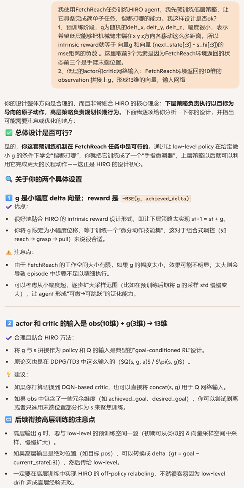

##### 稳打稳扎

上面的一气呵成的代码并不能收敛，那就一步一步来，慢慢上复杂度

###### step1：用SB3的SAC 搞定固定的短距离小目标

两个发现：

1. 我在这里踩了个坑：随便写了个小目标：在reset初始位置的基础上，再位移[0.1, 0.1, 0.1]，实际上是不可达的，因为reset后机械手臂伸直水平状，xyz三个方向都为正就表示目标位置在可达范围（半球）外面了。我在这里浪费了一整天。
2. 输入到深度网络里的状态，后面三个维度是目标位置的绝对位置，还是相对初始位置的位移，验证了都能收敛。但我觉得位置好一些，因为相对位置是相对初始位置的位移，网络还要记住初始位置...

env给出的几个可行的小目标 g，有的长度偏大的也不容易收敛，要挑绝对值小的做为小目标

```
# reset后立即执行 g = obs['desired_goal'] - obs['achieved_goal']，
# 可以得到有下面这些值：
g=[-0.05197624  0.41593705 -0.38898413]
g=[-0.08951826  0.62014015 -0.35802831]
g=[-0.16458111  0.42454838 -0.15700847]
g=[-0.21737     0.40604419 -0.16089385]
g=[ 0.03985209  0.4883993  -0.10840308]
g=[-0.00156387  0.57738327 -0.24667852]
g=[-0.08161544  0.4379823  -0.29055602]
g=[-0.05553611  0.60416518 -0.16857048]
g=[-0.14497306  0.63118409 -0.30566294]
g=[ 0.01801001  0.4210462  -0.22033174]
g=[ 0.04373577  0.39730558 -0.15274272]
g=[-0.20449369  0.4847844  -0.22082668]
g=[-0.16781741  0.61902692 -0.34448007]
g=[ 0.01637453  0.59159179 -0.15796917]
g=[ 0.00623025  0.44328504 -0.1904544 ]
g=[-0.03524174  0.57974617 -0.29795416]
```

小目标位移[-0.08951826,  0.12014015, +0.15802831]，收敛得很好

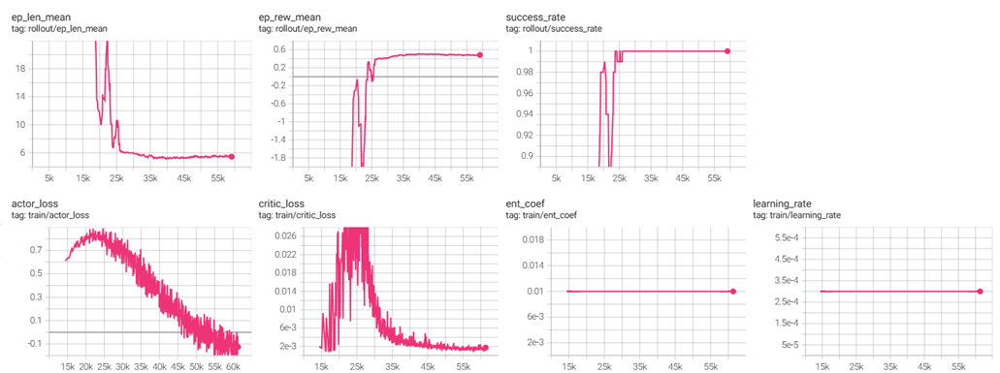

```python
import random
import time

import gymnasium as gym
from stable_baselines3 import SAC
from stable_baselines3.common.callbacks import EvalCallback, CheckpointCallback, BaseCallback
from stable_baselines3.common.vec_env import SubprocVecEnv, VecNormalize, VecMonitor
from stable_baselines3.common.monitor import Monitor
import numpy as np
import gymnasium_robotics
import math


# 环境的再封装
# 环境返回的state里要包含desired_goal
# 环境的observation_space需要相应的改动
# 手动构造reward，根据举例desired_goal的距离变化，返回reward
class CustomFetchReachEnv(gym.Env):
    """
    自定义封装 FetchReach-v3 环境，符合 Gymnasium 接口规范。
    兼容 SB3 训练，支持 TensorBoard 记录 success_rate。
    """

    def __init__(self, render_mode=None):
        """
        初始化环境。
        Args:
            render_mode (str, optional): 渲染模式，支持 "human" 或 "rgb_array"。
        """
        super().__init__()


        # 创建原始 FetchReach-v3 环境
        self._env = gym.make("FetchReach-v3", render_mode=render_mode, max_episode_steps=100)

        # 继承原始的动作和观测空间
        self.action_space = self._env.action_space
        self.observation_space = gym.spaces.Box(-np.inf, np.inf, shape=(10+3,))  # 简化后的状态, 10个observe，3个desired_goal，一起拼接为state返回


        self.total_step = 0

        # 初始化渲染模式
        self.render_mode = render_mode
        self.desired_goal = None
        self.g = None


    def reset(self, seed=None, options=None):
        """
        重置环境，返回初始观测和 info。
        """
        obs, info = self._env.reset(seed=seed, options=options)
		
        # 关键代码：
        #尝试固定目标位置进行训练，结果显示可以到达100%成功率
        # 这个位移p可不能乱写，血的教训。
        self.g = np.array( [-0.08951826,  0.12014015, +0.15802831] )
        self.desired_goal = obs['achieved_goal'] + self.g


        state = np.concatenate( [obs['observation'], self.desired_goal ] ) #这里把self.g编码进去也是可以的

        info['desired_goal'] = self.desired_goal


        return state, info

    def step(self, action):
        """
        执行动作，返回 (obs, reward, done, truncated, info)。
        注意：Gymnasium 的 step() 返回 5 个值（包括 truncated）。
        """
        obs, external_reward, terminated, truncated, info = self._env.step(action)
        self.total_step += 1
        state = np.concatenate( [obs['observation'], self.desired_goal ] )#这里把self.g编码进去也是可以的
        info['desired_goal'] = self.desired_goal

        # 获取 gripper 位置和目标位置（FetchReach 的 obs 包含这些信息）
        gripper_pos = obs["observation"][:3]  # 前 3 维是 gripper 的 (x, y, z)
        target_pos = self.desired_goal # 目标位置

        # 计算 gripper 到目标的欧氏距离
        distance = np.linalg.norm(gripper_pos - target_pos)

        success = np.linalg.norm(obs['achieved_goal'] - self.desired_goal) < 0.05
        if success:
            external_reward = 1
            terminated = True
        else:
            external_reward = -distance

        # 确保 info 包含 is_success（SB3 的 success_rate 依赖此字段）
        info["is_success"] = success

        return state, external_reward, terminated, truncated, info

    def render(self):
        """
        渲染环境（可选）。
        """
        return self._env.render()

    def close(self):
        """
        关闭环境，释放资源。
        """
        self._env.close()

    @property
    def unwrapped(self):
        """
        返回原始环境（用于访问原始方法）。
        """
        return self._env


# 1. 多进程环境创建
def make_env(seed):
    def _init():
        env = CustomFetchReachEnv()
        env = Monitor(env)  # 单环境监控
        env.reset(seed=seed)
        return env
    return _init

if __name__ == '__main__':
    n_envs = 16
    env = SubprocVecEnv([make_env(i) for i in range(n_envs)])
    env = VecMonitor(env)  # ➕ 记录每回合 reward/length
    env = VecNormalize(env, norm_obs=False, norm_reward=False)  # 和 Hugging Face 模型一致


    def linear_schedule(initial_value):
        def func(progress_remaining):
            return initial_value * progress_remaining  # 1 → 0
        return func


    policy_kwargs = dict(
        net_arch=dict(
            pi=[256, 256, 256],  # actor 网络结构
            qf=[256, 256, 256]  # critic (Q-network) 结构
        )
    )


    # 2. SAC 训练超参数（参考 RL Zoo）
    model = SAC(
        "MlpPolicy",
        env,
        batch_size=256,
        buffer_size=1_000_000,
        learning_starts=10_000,
        learning_rate=3e-4,
        tau=0.005,
        gamma=0.97,
        train_freq=1,
        gradient_steps=1,
        ent_coef=0.01,
        verbose=0,
        tensorboard_log='logs/',
        policy_kwargs=policy_kwargs,
    )

    #训练
    total_timesteps = int(1e6)
    model.learn(
        total_timesteps=total_timesteps,
    )
```

###### step2：用SB3的SAC搞定多个短距离小目标

这次 g 不是固定的，是变化的一批，能够收敛。

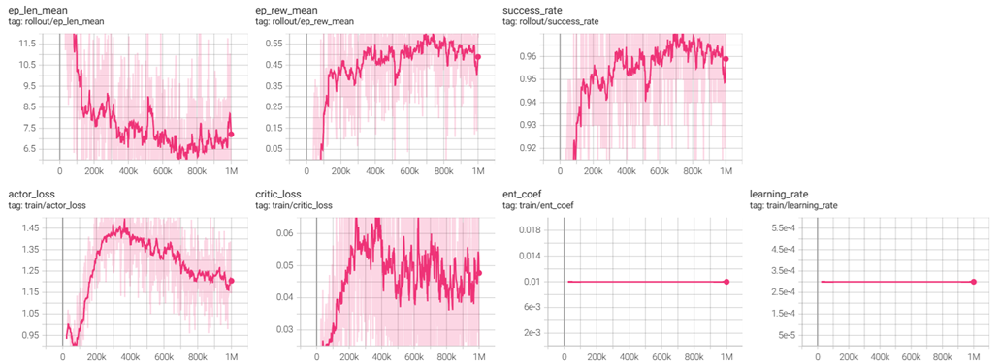

```python
import random
import time

import gymnasium as gym
from stable_baselines3 import SAC
from stable_baselines3.common.callbacks import EvalCallback, CheckpointCallback, BaseCallback
from stable_baselines3.common.vec_env import SubprocVecEnv, VecNormalize, VecMonitor
from stable_baselines3.common.monitor import Monitor
import numpy as np
import gymnasium_robotics
import math


# 环境的再封装
# 环境返回的state里要包含desired_goal
# 环境的observation_space需要相应的改动
# 手动构造reward，根据举例desired_goal的距离变化，返回reward
class CustomFetchReachEnv(gym.Env):
    """
    自定义封装 FetchReach-v3 环境，符合 Gymnasium 接口规范。
    兼容 SB3 训练，支持 TensorBoard 记录 success_rate。
    """

    def __init__(self, render_mode=None):
        """
        初始化环境。
        Args:
            render_mode (str, optional): 渲染模式，支持 "human" 或 "rgb_array"。
        """
        super().__init__()


        # 创建原始 FetchReach-v3 环境
        self._env = gym.make("FetchReach-v3", render_mode=render_mode, max_episode_steps=100)

        # 继承原始的动作和观测空间
        self.action_space = self._env.action_space
        self.observation_space = gym.spaces.Box(-np.inf, np.inf, shape=(10+3,))  # 简化后的状态, 10个observe，3个desired_goal，一起拼接为state返回


        self.total_step = 0

        # 初始化渲染模式
        self.render_mode = render_mode
        self.desired_goal = None
        self.g = None
        self.g_list = []
        self.generate_g()

    # 关键代码：
    # 产生随机的可达的10个位移很小的低层目标，用来训练
    def generate_g(self):
        self.g_list = []
        while len(self.g_list) < 10:
            obs, _ = self._env.reset()
            g = (obs["desired_goal"] - obs["achieved_goal"])
            while np.linalg.norm(g) > 0.15:
                g = g * random.uniform(0.7, 0.9)
            self.g_list.append(g)
        print(f"get {len(self.g_list)} little goals ")


    def reset(self, seed=None, options=None):
        """
        重置环境，返回初始观测和 info。
        """
        obs, info = self._env.reset(seed=seed, options=options)


        self.g = self.g_list[ random.randint(0, len(self.g_list)-1) ]
        self.desired_goal = obs['achieved_goal'] + self.g


        state = np.concatenate( [obs['observation'], self.desired_goal ] ) #这里把self.g编码进去也是可以的

        info['desired_goal'] = self.desired_goal


        return state, info

    def step(self, action):
        """
        执行动作，返回 (obs, reward, done, truncated, info)。
        注意：Gymnasium 的 step() 返回 5 个值（包括 truncated）。
        """
        obs, external_reward, terminated, truncated, info = self._env.step(action)
        self.total_step += 1
        state = np.concatenate( [obs['observation'], self.desired_goal ] )#这里把self.g编码进去也是可以的
        info['desired_goal'] = self.desired_goal

        # 获取 gripper 位置和目标位置（FetchReach 的 obs 包含这些信息）
        gripper_pos = obs["observation"][:3]  # 前 3 维是 gripper 的 (x, y, z)

        # 计算 gripper 到目标的欧氏距离
        distance = np.linalg.norm(gripper_pos - self.desired_goal)

        success = distance < 0.05
        if success:
            external_reward = 1
            terminated = True
        else:
            external_reward = -distance

        # 确保 info 包含 is_success（SB3 的 success_rate 依赖此字段）
        info["is_success"] = success

        return state, external_reward, terminated, truncated, info

    def render(self):
        """
        渲染环境（可选）。
        """
        return self._env.render()

    def close(self):
        """
        关闭环境，释放资源。
        """
        self._env.close()

    @property
    def unwrapped(self):
        """
        返回原始环境（用于访问原始方法）。
        """
        return self._env


# 1. 多进程环境创建
def make_env(seed):
    def _init():
        env = CustomFetchReachEnv()
        env = Monitor(env)  # 单环境监控
        env.reset(seed=seed)
        return env
    return _init

if __name__ == '__main__':
    n_envs = 16
    env = SubprocVecEnv([make_env(i) for i in range(n_envs)])
    env = VecMonitor(env)  # ➕ 记录每回合 reward/length
    env = VecNormalize(env, norm_obs=False, norm_reward=False)  # 和 Hugging Face 模型一致


    def linear_schedule(initial_value):
        def func(progress_remaining):
            return initial_value * progress_remaining  # 1 → 0
        return func


    policy_kwargs = dict(
        net_arch=dict(
            pi=[256, 256, 256],  # actor 网络结构
            qf=[256, 256, 256]  # critic (Q-network) 结构
        )
    )


    # 2. SAC 训练超参数（参考 RL Zoo）
    model = SAC(
        "MlpPolicy",
        env,
        batch_size=256,
        buffer_size=1_000_000,
        learning_starts=10_000,
        learning_rate=3e-4,
        tau=0.005,
        gamma=0.97,
        train_freq=1,
        gradient_steps=1,
        ent_coef=0.01,
        verbose=0,
        tensorboard_log='logs/',
        policy_kwargs=policy_kwargs,
    )

    #训练
    total_timesteps = int(1e6)
    model.learn(
        total_timesteps=total_timesteps,
    )
```

###### step3：用SB3的SAC搞定带固定目标的低层小回合

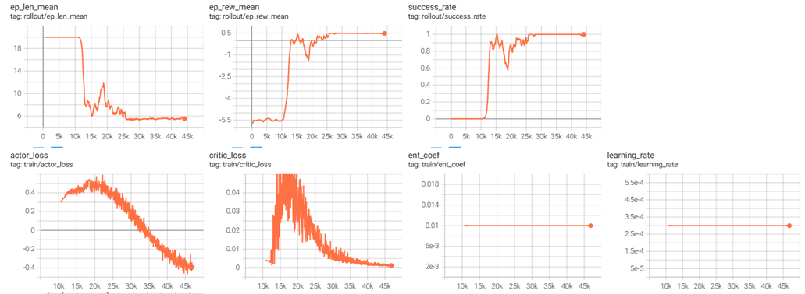

```python
import random
import time

import gymnasium as gym
from stable_baselines3 import SAC
from stable_baselines3.common.callbacks import EvalCallback, CheckpointCallback, BaseCallback
from stable_baselines3.common.vec_env import SubprocVecEnv, VecNormalize, VecMonitor
from stable_baselines3.common.monitor import Monitor
import numpy as np
import gymnasium_robotics
import math


class CustomFetchReachEnv_v2(gym.Env):
    """
    自定义封装 FetchReach-v3 环境，符合 Gymnasium 接口规范。
    兼容 SB3 训练，支持 TensorBoard 记录 success_rate。
    """

    def __init__(self, render_mode=None):
        """
        初始化环境。
        Args:
            render_mode (str, optional): 渲染模式，支持 "human" 或 "rgb_array"。
        """
        super().__init__()


        # 创建原始 FetchReach-v3 环境
        self._env = gym.make("FetchReach-v3", render_mode=render_mode, max_episode_steps=100)

        # 继承原始的动作和观测空间
        self.action_space = self._env.action_space
        #目前定义的 observation_space 为 shape=(13,)，实际由 10 维原始 observation + 3 维 desired_goal 拼接而成
        self.observation_space = gym.spaces.Box(-np.inf, np.inf, shape=(10+3,))

        self.total_step = 0

        # 初始化渲染模式
        self.render_mode = render_mode
        self.desired_goal = None

        # 记录一个小回合的相关信息，包括目标，开始的状态，步数
        self.g = None
        self.lo_episode_start_s = None
        self.lo_episode_step_cnt = 0


    def reset(self, seed=None, options=None):
        """
        重置环境，返回初始观测和 info。
        """

        # 关键代码：
        # 固定小目标为这么多，也就是希望手臂末端在x,y,z方向位移0.1m
        self.g = np.array([-0.08951826,  0.12014015, +0.15802831])
        obs, info = self._env.reset(seed=seed, options=options)

        init_pos = obs['achieved_goal']
        self.desired_goal = init_pos + self.g


        state = np.concatenate( [obs['observation'],self.desired_goal ] )
        self.lo_episode_start_s = state #记录小回合的开始状态
        self.lo_episode_step_cnt = 0 # 小回合步数清0
        info['desired_goal'] = self.desired_goal

        return state, info

    def step(self, action):

        """
        执行动作，返回 (obs, reward, done, truncated, info)。
        注意：Gymnasium 的 step() 返回 5 个值（包括 truncated）。
        """
        obs, external_reward, terminated, truncated, info = self._env.step(action)
        self.total_step += 1
        self.lo_episode_step_cnt += 1
        state = np.concatenate( [obs['observation'],self.desired_goal ] )
        info['desired_goal'] = self.desired_goal

        # 计算当前状态与小回合开始状态的差值
        dist = np.linalg.norm(self.desired_goal - obs['achieved_goal'])

        if dist < 0.05: #很接近小目标了，认为成功完成目标
            terminated = True
            success = True
            external_reward = 1
        else:
            success = False
            external_reward = -dist


        # 小回合允许的最大步数到了（20步）
        if self.lo_episode_step_cnt >=20 and not terminated:
            truncated = True

        info["is_success"] = success

        return state, external_reward, terminated, truncated, info

    def render(self):
        """
        渲染环境（可选）。
        """
        return self._env.render()

    def close(self):
        """
        关闭环境，释放资源。
        """
        self._env.close()

    @property
    def unwrapped(self):
        """
        返回原始环境（用于访问原始方法）。
        """
        return self._env


# 1. 多进程环境创建
def make_env(seed):
    def _init():
        env = CustomFetchReachEnv_v2()
        env = Monitor(env)  # 单环境监控
        env.reset(seed=seed)
        return env
    return _init

if __name__ == '__main__':
    n_envs = 16
    env = SubprocVecEnv([make_env(i) for i in range(n_envs)])
    env = VecMonitor(env)  # ➕ 记录每回合 reward/length
    env = VecNormalize(env, norm_obs=False, norm_reward=False)  # 和 Hugging Face 模型一致


    def linear_schedule(initial_value):
        def func(progress_remaining):
            return initial_value * progress_remaining  # 1 → 0
        return func


    policy_kwargs = dict(
        net_arch=dict(
            pi=[256, 256, 256],  # actor 网络结构
            qf=[256, 256, 256]  # critic (Q-network) 结构
        )
    )


    # 2. SAC 训练超参数（参考 RL Zoo）
    model = SAC(
        "MlpPolicy",
        env,
        batch_size=256,
        buffer_size=1_000_000,
        learning_starts=10_000,
        learning_rate=3e-4,
        tau=0.005,
        gamma=0.97,
        train_freq=1,
        gradient_steps=1,
        ent_coef=0.01,
        verbose=0,
        tensorboard_log='logs/',
        policy_kwargs=policy_kwargs,
    )

    #训练
    total_timesteps = int(1e6)
    model.learn(
        total_timesteps=total_timesteps,
    )
```

###### step4：用SB3的SAC搞定不同小目标的低层小回合

可以收敛：

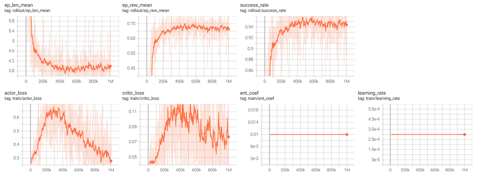

```python
import random
import time

import gymnasium as gym
from stable_baselines3 import SAC
from stable_baselines3.common.callbacks import EvalCallback, CheckpointCallback, BaseCallback
from stable_baselines3.common.vec_env import SubprocVecEnv, VecNormalize, VecMonitor
from stable_baselines3.common.monitor import Monitor
import numpy as np
import gymnasium_robotics
import math


class CustomFetchReachEnv_v2(gym.Env):
    """
    自定义封装 FetchReach-v3 环境，符合 Gymnasium 接口规范。
    兼容 SB3 训练，支持 TensorBoard 记录 success_rate。
    """

    def __init__(self, render_mode=None):
        """
        初始化环境。
        Args:
            render_mode (str, optional): 渲染模式，支持 "human" 或 "rgb_array"。
        """
        super().__init__()


        # 创建原始 FetchReach-v3 环境
        self._env = gym.make("FetchReach-v3", render_mode=render_mode, max_episode_steps=100)

        # 继承原始的动作和观测空间
        self.action_space = self._env.action_space
        #目前定义的 observation_space 为 shape=(13,)，实际由 10 维原始 observation + 3 维 desired_goal 拼接而成
        self.observation_space = gym.spaces.Box(-np.inf, np.inf, shape=(10+3,))

        self.total_step = 0

        # 初始化渲染模式
        self.render_mode = render_mode
        self.desired_goal = None

        # 记录一个小回合的相关信息，包括目标，开始的状态，步数
        self.g = None
        self.lo_episode_start_s = None
        self.lo_episode_step_cnt = 0
        self.g_list = []
        self.generate_g()

    # 关键代码
    # 产生随机的可达的10个位移很小的低层目标，用来训练
    def generate_g(self):
        self.g_list = []
        while len(self.g_list) < 10:
            obs, _ = self._env.reset()
            g = (obs["desired_goal"] - obs["achieved_goal"])
            while np.linalg.norm(g) > 0.15:
                g = g * random.uniform(0.7, 0.9)
            self.g_list.append(g)
        print(f"get {len(self.g_list)} little goals ")


    def reset(self, seed=None, options=None):
        """
        重置环境，返回初始观测和 info。
        """

        # 关键代码：
        # 固定小目标为这么多，也就是希望手臂末端在x,y,z方向位移0.1m
        self.g = self.g_list[ random.randint(0, len(self.g_list)-1) ]
        obs, info = self._env.reset(seed=seed, options=options)

        init_pos = obs['achieved_goal']
        self.desired_goal = init_pos + self.g


        state = np.concatenate( [obs['observation'],self.desired_goal ] )
        self.lo_episode_start_s = state #记录小回合的开始状态
        self.lo_episode_step_cnt = 0 # 小回合步数清0
        info['desired_goal'] = self.desired_goal

        return state, info

    def step(self, action):

        """
        执行动作，返回 (obs, reward, done, truncated, info)。
        注意：Gymnasium 的 step() 返回 5 个值（包括 truncated）。
        """
        obs, external_reward, terminated, truncated, info = self._env.step(action)
        self.total_step += 1
        self.lo_episode_step_cnt += 1
        state = np.concatenate( [obs['observation'],self.desired_goal ] )
        info['desired_goal'] = self.desired_goal

        # 计算当前状态与小回合开始状态的差值

        dist = np.linalg.norm(self.desired_goal - obs['achieved_goal'])

        if dist < 0.05: #很接近小目标了，认为成功完成目标
            terminated = True
            success = True
            external_reward = 1
        else:
            success = False
            external_reward = -dist


        # 小回合允许的最大步数到了（20步）
        if self.lo_episode_step_cnt >=20 and not terminated:
            truncated = True

        info["is_success"] = success

        return state, external_reward, terminated, truncated, info

    def render(self):
        """
        渲染环境（可选）。
        """
        return self._env.render()

    def close(self):
        """
        关闭环境，释放资源。
        """
        self._env.close()

    @property
    def unwrapped(self):
        """
        返回原始环境（用于访问原始方法）。
        """
        return self._env


# 1. 多进程环境创建
def make_env(seed):
    def _init():
        env = CustomFetchReachEnv_v2()
        env = Monitor(env)  # 单环境监控
        env.reset(seed=seed)
        return env
    return _init

if __name__ == '__main__':
    n_envs = 16
    env = SubprocVecEnv([make_env(i) for i in range(n_envs)])
    env = VecMonitor(env)  # ➕ 记录每回合 reward/length
    env = VecNormalize(env, norm_obs=False, norm_reward=False)  # 和 Hugging Face 模型一致


    def linear_schedule(initial_value):
        def func(progress_remaining):
            return initial_value * progress_remaining  # 1 → 0
        return func


    policy_kwargs = dict(
        net_arch=dict(
            pi=[256, 256, 256],  # actor 网络结构
            qf=[256, 256, 256]  # critic (Q-network) 结构
        )
    )


    # 2. SAC 训练超参数（参考 RL Zoo）
    model = SAC(
        "MlpPolicy",
        env,
        batch_size=256,
        buffer_size=1_000_000,
        learning_starts=10_000,
        learning_rate=3e-4,
        tau=0.005,
        gamma=0.97,
        train_freq=1,
        gradient_steps=1,
        ent_coef=0.01,
        verbose=0,
        tensorboard_log='logs/',
        policy_kwargs=policy_kwargs,
    )

    #训练
    total_timesteps = int(1e6)
    model.learn( total_timesteps=total_timesteps)
```

###### step5：开始上手搓SAC，搞定固定目标的大回合

后面各步骤都是手搓SAC代码。

一个完整的FetchReach回合，起始状态是确定的，目的位置也是确定的，且目的位置相比起始位置的位移是确定的小位移g。可以认为是最简单的连续动作任务。

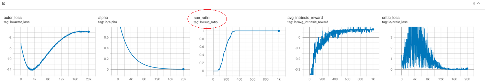

```python
import datetime
from collections import deque

import numpy
import numpy as np

import my_hi_sac
import my_low_sac
import my_fetchreach_env
import os
import torch
from torch.utils.tensorboard import SummaryWriter

class Config:
    max_episodes = 1000
    pretrain_lo_episodes = 1000
    max_episode_steps = 100
    #new_g_interval = 20

def modify_desired_in_state(state:numpy.ndarray, desired:numpy.ndarray):
    assert state.shape[0] ==13  and desired.shape[0] == 3, ""
    new_state = numpy.concat( [ state[0:10], desired] , axis=-1)
    return new_state


def intrinsic_reward(desired:numpy.ndarray, next_state: numpy.ndarray):

    diff = desired - next_state[:3]
    assert diff.shape==(3,), ""
    dist = np.linalg.norm(diff)
    if dist <= 0.05:
        return 1, True, dist
    else:
        return -dist, False, dist


def generate_g():
    return np.array([-0.08951826,  0.12014015, +0.15802831]) # todo:临时限制


def pretrain_low_policy(env, lo:my_low_sac.HIRO_LOW_SAC):
    lo_episode_cnt = 0 #低层回合个数，方便tb上报做横坐标
    lo_result=deque(maxlen=100)
    for episode in range(1, Config.pretrain_lo_episodes):
        state, _ = env.reset()
        g = generate_g()
        lo_desired = g + state[:3]

        lo_episode_rewards = [] #低层一个回合每个时间步的内部奖励

        lo_done = False # 标识低层回合是否结束
        step_cnt = 0 # 用来决定lo episode的起止
        for i in range(Config.max_episode_steps):  # 一个大回合最多与环境交互xx次

            assert lo_desired is not None, ""
            state = modify_desired_in_state(state, lo_desired) # 修改
            # 选择动作
            action = lo.select_action(state)

            # 执行动作
            next_state, env_reward, term, trunc, _ = env.step(action)
            # 确保写入buffer的数据严格统一,因为update的时候会用到。
            next_state = modify_desired_in_state(next_state, lo_desired)
            done = term or trunc
            step_cnt += 1

            # 可能出现低层已经完成了目标，但低层的回合长度还没有到换新目标的时候。
            # 这种情况下，继续与环境交互，但是不再计算内部奖励、不记录低层的时间步信息
            # 如果当前lo episode还没有结束，那么就要计算内部奖励、确定是否结束、存储时间步
            if not lo_done:
                lo_rw, lo_done, dist = intrinsic_reward(lo_desired, next_state)
                lo_done = (lo_done or done  ) # 低层回合截断了,lo_done也必须设置为True
                # 存储transition
                lo.replay_buffer.push(state, action, lo_rw, next_state, lo_done)
                #print(f"add transition:{state}, {action}, {lo_rw}, {next_state}, {lo_done}")
                # 更新网络参数
                lo.update_parameters()
                lo_episode_rewards.append( lo_rw)
                if lo_done:
                    # 固定长度的lo episode结束了， 主要是上报是否成功、内部奖励的均值
                    if lo_rw >= 0:
                        lo_result.append(1)
                    else:
                        lo_result.append(0)
                    lo.writer.add_scalar('lo/avg_intrinsic_reward', np.mean(lo_episode_rewards), episode)
            # 更新状态
            state = next_state
            if done:
                break

        lo.writer.add_scalar('lo/suc_ratio', np.mean(lo_result), episode)

# 主函数
def main():
    # 创建环境
    env = my_fetchreach_env.CustomFetchReachEnv()
    state_dim = env.observation_space.shape[0]
    action_dim = env.action_space.shape[0]
    max_action = float(env.action_space.high[0])
    print(f"state_dim:{state_dim}, action_dim:{action_dim}, max_action:{max_action}")

    writer = SummaryWriter(log_dir=f'logs/HIRO_FetchReach_{datetime.datetime.now().strftime("%m%d_%H%M%S")}')
    # 创建SAC代理
    hi = my_hi_sac.HIRO_HI_SAC(state_dim, 3, 1, writer) # 高层策略输出的是g,相对于当前的位置的xyz偏移量，假设偏移量最多1米
    lo = my_low_sac.HIRO_LOW_SAC(state_dim, action_dim, max_action, writer)

    # 创建检查点目录
    os.makedirs("checkpoints", exist_ok=True)

    pretrain_low_policy(env, lo)

if __name__ == '__main__':
    main()
```

###### step6：搞定固定位移的小回合

这个任务比step5要难，step5的任务的起始状态和目标都是固定的，是最简单的任务，且允许100步；step6的每个小回合的起始状态和目标都不是一样的（虽然目前位移g还是固定的），且小回合长度只有20步。本质上就是不同的低层目标的完成能力了。

加深了神经网络，成功率也没有提升，只能到40%的成功率。

**我百思不得其解，后来想明白了，同样的小位移g常量，在机械臂移动到某些状态下可能就是不可达的**，不能作为这个状态起始的小回合的目的位移。

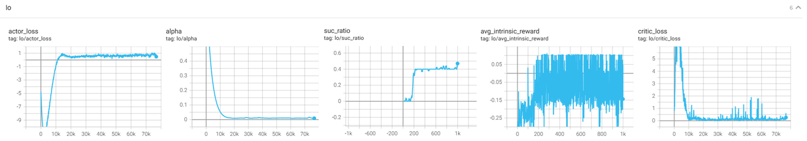

```python
import datetime
from collections import deque

import numpy
import numpy as np

import my_hi_sac
import my_low_sac
import my_fetchreach_env
import os
import torch
from torch.utils.tensorboard import SummaryWriter

class Config:
    max_episodes = 1000
    pretrain_lo_episodes = 1000
    max_episode_steps = 100
    new_g_interval = 20

def modify_desired_in_state(state:numpy.ndarray, desired:numpy.ndarray):
    assert state.shape[0] ==13  and desired.shape[0] == 3, ""
    new_state = numpy.concat( [ state[0:10], desired] , axis=-1)
    return new_state


def intrinsic_reward(desired:numpy.ndarray, next_state: numpy.ndarray):

    diff = desired - next_state[:3]
    assert diff.shape==(3,), ""
    dist = np.linalg.norm(diff)
    if dist <= 0.05:
        return 1, True, dist
    else:
        return -dist, False, dist


def generate_g():
    return np.array([-0.08951826,  0.12014015, +0.15802831]) # todo:临时限制


def pretrain_low_policy(env, lo:my_low_sac.HIRO_LOW_SAC):
    lo_episode_cnt = 0 #低层回合个数，方便tb上报做横坐标
    lo_result=deque(maxlen=100)
    for episode in range(1, Config.pretrain_lo_episodes):
        state, _ = env.reset()

        step_cnt = 0 # 用来决定lo episode的起止
        for i in range(Config.max_episode_steps):  # 一个大回合最多与环境交互xx次

            if step_cnt % Config.new_g_interval == 0:
                #开始一个小回合，应用固定位移后的位置作为目标，关键代码
                # 后来想明白了，这时候state不是机械臂的大回合起始位置，是中途某个位置 state+g可能是机械臂不可达的，操
                g = generate_g()
                lo_desired = g + state[:3]
                lo_episode_rewards = []  # 低层一个回合每个时间步的内部奖励
                lo_done = False  # 标识低层回合是否结束

            assert lo_desired is not None, ""
            state = modify_desired_in_state(state, lo_desired) # 修改
            # 选择动作
            action = lo.select_action(state)

            # 执行动作
            next_state, env_reward, term, trunc, _ = env.step(action)
            # 确保写入buffer的数据严格统一,因为update的时候会用到。
            next_state = modify_desired_in_state(next_state, lo_desired)
            done = term or trunc
            step_cnt += 1

            # 可能出现低层已经完成了目标，但低层的回合长度还没有到换新目标的时候。
            # 这种情况下，继续与环境交互，但是不再计算内部奖励、不记录低层的时间步信息
            # 如果当前lo episode还没有结束，那么就要计算内部奖励、确定是否结束、存储时间步
            assert lo_done is not None, ""
            if not lo_done:
                lo_rw, lo_done, dist = intrinsic_reward(lo_desired, next_state)
                lo_done = (lo_done or done or (step_cnt % Config.new_g_interval == 0) ) # 低层回合截断了,lo_done也必须设置为True
                # 存储transition
                lo.replay_buffer.push(state, action, lo_rw, next_state, lo_done)
                #print(f"add transition:{state}, {action}, {lo_rw}, {next_state}, {lo_done}")
                # 更新网络参数
                lo.update_parameters()
                assert lo_episode_rewards is not None, ""
                lo_episode_rewards.append( lo_rw)
                if lo_done:
                    # 固定长度的lo episode结束了， 主要是上报是否成功、内部奖励的均值
                    if lo_rw >= 0:
                        lo_result.append(1)
                    else:
                        lo_result.append(0)
                    lo.writer.add_scalar('lo/avg_intrinsic_reward', np.mean(lo_episode_rewards), episode)
            # 更新状态
            state = next_state
            if done:
                break

        lo.writer.add_scalar('lo/suc_ratio', np.mean(lo_result), episode)

# 主函数
def main():
    # 创建环境
    env = my_fetchreach_env.CustomFetchReachEnv()
    state_dim = env.observation_space.shape[0]
    action_dim = env.action_space.shape[0]
    max_action = float(env.action_space.high[0])
    print(f"state_dim:{state_dim}, action_dim:{action_dim}, max_action:{max_action}")

    writer = SummaryWriter(log_dir=f'logs/HIRO_FetchReach_{datetime.datetime.now().strftime("%m%d_%H%M%S")}')
    # 创建SAC代理
    hi = my_hi_sac.HIRO_HI_SAC(state_dim, 3, 1, writer) # 高层策略输出的是g,相对于当前的位置的xyz偏移量，假设偏移量最多1米
    lo = my_low_sac.HIRO_LOW_SAC(state_dim, action_dim, max_action, writer)

    # 创建检查点目录
    os.makedirs("checkpoints", exist_ok=True)

    pretrain_low_policy(env, lo)


if __name__ == '__main__':
    main()
```

###### step7： 搞定固定的路线中途小目标

基于step6的问题，我就挑一个大回合，把achieved_goal和desired goal之间的直线上的5个等距离的点作为小回合的目标，有5个目标，移动位移都是其中一个小段，尝试训练低层策略。

能够很好的收敛，且中途每个小目标都有较平衡的覆盖到：

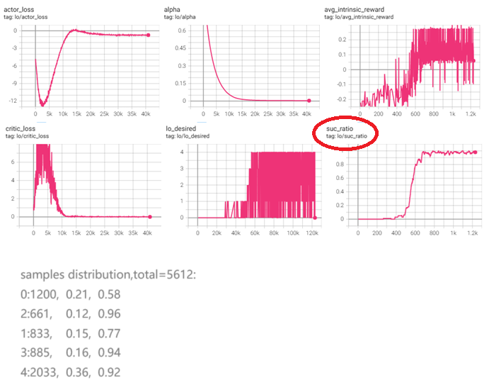

```python
import datetime
from collections import deque, defaultdict

import numpy
import numpy as np

import my_hi_sac
import my_low_sac
import my_fetchreach_env
import os
import torch
from torch.utils.tensorboard import SummaryWriter

class Config:
    max_episodes = 3000
    pretrain_lo_episodes = 3000
    max_episode_steps = 100
    new_g_interval = 20

def modify_desired_in_state(state:numpy.ndarray, desired:numpy.ndarray):
    assert state.shape[0] ==13  and desired.shape[0] == 3, ""
    new_state = numpy.concat( [ state[0:10], desired] , axis=-1)
    return new_state


def intrinsic_reward(desired:numpy.ndarray, next_state: numpy.ndarray):

    diff = desired - next_state[:3]
    assert diff.shape==(3,), ""
    dist = np.linalg.norm(diff)
    if dist <= 0.05:
        return 1, True, dist
    else:
        return -dist, False, dist

# 关键代码，取一条直线上的5个位置作为我们的固定的小目标
def generate_anchors(env):

    anchors=[]
    num = 5
    while True:
        state, _ = env.reset()
        start_pos = state[:3]
        end_pos = state[10:]
        diff = end_pos - start_pos

        if np.linalg.norm(diff / num) > 0.15:

            step = diff / num
            print(f'step:{step}, {np.linalg.norm(step)}')
            for i in range(num):
                a = start_pos + i * step
                b = a + step
                anchors.append( (a, b) )
                print(f'route:{a}->{b}')
            break

    return anchors
# 关键代码，根据当前位置，找可以作为小目标的anchor
def get_lo_desired(current_state:np.ndarray, anchors):
    idx = 0
    for (a, b) in anchors:
        if np.linalg.norm(a-current_state[:3]) < 0.05:
            return b, idx
        idx += 1
    return None, idx

def pretrain_low_policy(env, lo:my_low_sac.HIRO_LOW_SAC):
    lo_episode_cnt = 0 #低层回合个数，方便tb上报做横坐标
    lo_result=deque(maxlen=100)
    anchors = generate_anchors(env)
    total_steps = 0
    sample_num = defaultdict(int) #记录每一个lo_desire为目标的回合的次数
    sample_suc = defaultdict(int) #记录每一个lo_desire为目标的回合的成功次数
    for episode in range(1, Config.pretrain_lo_episodes):
        state, _ = env.reset()
        lo_step_cnt = 0 # 用来决定lo episode的起止
        lo_desired = None
        lo_done = True

        for i in range(Config.max_episode_steps):  # 一个大回合最多与环境交互xx次

            if lo_done: # low episode 结束了，或者没有开始
                lo_desired, anchor_idx = get_lo_desired(state, anchors)  # 看看有没有合适的锚点用作下一个低层目标
                if lo_desired is not None:
                    sample_num[anchor_idx] += 1
                    lo.writer.add_scalar('lo/lo_desired', anchor_idx, total_steps)
                    lo_episode_rewards = []  # 低层一个回合每个时间步的内部奖励
                    lo_done = False  # 标识低层回合是否结束
                    lo_step_cnt = 0 # 开始计步


            if lo_desired is not None:
                state = modify_desired_in_state(state, lo_desired) # 修改
            # 选择动作
            action = lo.select_action(state)

            # 执行动作
            next_state, env_reward, term, trunc, _ = env.step(action)
            # 确保写入buffer的数据严格统一,因为update的时候会用到。
            if lo_desired is not None:
                next_state = modify_desired_in_state(next_state, lo_desired)
            done = term or trunc
            lo_step_cnt += 1
            total_steps += 1

            # 可能出现低层已经完成了目标，但低层的回合长度还没有到换新目标的时候。
            # 这种情况下，继续与环境交互，但是不再计算内部奖励、不记录低层的时间步信息
            # 如果当前lo episode还没有结束，那么就要计算内部奖励、确定是否结束、存储时间步
            if not lo_done: #low episode 进行中
                lo_rw, lo_done, dist = intrinsic_reward(lo_desired, next_state)
                lo_done = (lo_done or done or (lo_step_cnt % Config.new_g_interval == 0) ) # 低层回合截断了,lo_done也必须设置为True
                # 存储transition
                lo.replay_buffer.push(state, action, lo_rw, next_state, lo_done)

                #print(f"add transition:{state}, {action}, {lo_rw}, {next_state}, {lo_done}")
                # 更新网络参数
                lo.update_parameters()
                assert lo_episode_rewards is not None, ""
                lo_episode_rewards.append( lo_rw)
                if lo_done:
                    # 固定长度的lo episode结束了， 主要是上报是否成功、内部奖励的均值
                    if lo_rw >= 0:
                        lo_result.append(1)
                        sample_suc[anchor_idx] += 1
                    else:
                        lo_result.append(0)
                    lo.writer.add_scalar('lo/avg_intrinsic_reward', np.mean(lo_episode_rewards), episode)

            # 更新状态
            state = next_state
            if done:
                break

        lo.writer.add_scalar('lo/suc_ratio', np.mean(lo_result), episode)
        if episode % 200 == 0:
            total = 1e-7
            for k, c in sample_num.items():
                total += c
            print(f"samples distribution,total={int(total)}:")
            for k, c in sample_num.items():
                print(f"{k}:{c},{c/total:.2f},{(sample_suc[k] / (c+1e-8)):.2f}")

# 主函数
def main():
    # 创建环境
    env = my_fetchreach_env.CustomFetchReachEnv()
    state_dim = env.observation_space.shape[0]
    action_dim = env.action_space.shape[0]
    max_action = float(env.action_space.high[0])
    print(f"state_dim:{state_dim}, action_dim:{action_dim}, max_action:{max_action}")

    writer = SummaryWriter(log_dir=f'logs/HIRO_FetchReach_{datetime.datetime.now().strftime("%m%d_%H%M%S")}')
    # 创建SAC代理
    hi = my_hi_sac.HIRO_HI_SAC(state_dim, 3, 1, writer) # 高层策略输出的是g,相对于当前的位置的xyz偏移量，假设偏移量最多1米
    lo = my_low_sac.HIRO_LOW_SAC(state_dim, action_dim, max_action, writer)

    # 创建检查点目录
    os.makedirs("checkpoints", exist_ok=True)

    pretrain_low_policy(env, lo)


if __name__ == '__main__':
    main()
```

###### step8：搞定各种线路中的中途小目标

基于step7，进一步的，挑20个大回合，

1. 对每个大回合，把achieved_goal和desired goal之间的直线上的5个等距离的点作为小回合的目标，有5个目标，移动位移都是其中一个小段，尝试训练低层策略。
2. 20个大回合，就得到100个小回合

结果如下：

```python
begin a trajectory...
	try sub gaol [1.38792137 0.38960179 0.7105527 ]...
	sub goal [1.38792137 0.38960179 0.7105527 ] reached!
	try sub gaol [1.34094274 0.51510359 0.6351054 ]...
	sub goal [1.34094274 0.51510359 0.6351054 ] reached!
	try sub gaol [1.29396411 0.64060538 0.5596581 ]...
	sub goal [1.29396411 0.64060538 0.5596581 ] reached!
	try sub gaol [1.24698547 0.76610717 0.4842108 ]...
	sub goal [1.24698547 0.76610717 0.4842108 ] reached!
	try sub gaol [1.20000684 0.89160897 0.4087635 ]...
	sub goal [1.20000684 0.89160897 0.4087635 ] missed! #奇怪，最后一站为什么大概率到不了...
```

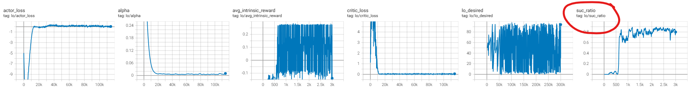

后来发现FetchReach环境有bug，红球的位置和 obs['desired_goal']对不上...

至此，至少证明了用手搓的SAC代码可以实现小位移的低层目标的goal conditional 达成。

下一步就是冻结低层模型，训练高层模型，使其具备规划的能力。对于FetchReach这样的简单任务，还可以直接求空间直线上的点的方式。

```python
import datetime
import random
from collections import deque, defaultdict

import numpy
import numpy as np

import my_hi_sac
import my_low_sac
import my_fetchreach_env
import os
import torch
from torch.utils.tensorboard import SummaryWriter


class Config:
    max_episodes = 3000
    pretrain_lo_episodes = 3000
    max_episode_steps = 100
    new_g_interval = 20

def modify_desired_in_state(state:numpy.ndarray, desired:numpy.ndarray):
    assert state.shape[0] ==13  and desired.shape[0] == 3, ""
    new_state = numpy.concat( [ state[0:10], desired] , axis=-1)
    return new_state


def intrinsic_reward(desired:numpy.ndarray, next_state: numpy.ndarray):

    diff = desired - next_state[:3]
    assert diff.shape==(3,), ""
    dist = np.linalg.norm(diff)
    if dist <= 0.05:
        return 1, True, dist
    else:
        return -dist, False, dist


def generate_anchors(env, repeat=20):
    anchors=[]
    num = 5
    rp_cnt = 0
    while rp_cnt < repeat:
        state, _ = env.reset()
        start_pos = state[:3]
        end_pos = state[10:]
        diff = end_pos - start_pos

        if np.linalg.norm(diff / num) > 0.15:
            rp_cnt += 1
            step = diff / num
            #print(f'step:{step}, {np.linalg.norm(step)}')
            for i in range(num):
                a = start_pos + i * step
                b = a + step
                anchors.append( (a, b) )
                #print(f'route:{a}->{b}')
    return anchors

def get_lo_desired(current_state:np.ndarray, anchors):
    # 从列表中的某个随机位置开始往后查找，这样有利于打散遇到不同大回合的起始位置
    start_index = random.randint(0, len(anchors)-1)
    for _ in range(len(anchors)):
        (a, b) = anchors[start_index]
        if np.linalg.norm(a-current_state[:3]) < 0.05:
            return b, start_index
        start_index = (start_index + 1) % len(anchors) #继续查找
    return None, -1

def show_case(env, lo:my_low_sac.HIRO_LOW_SAC):
    for _ in range(5):
        anchors = generate_anchors(env, 1)

        state, _ = env.reset()
        lo_step_cnt = 0  # 用来决定lo episode的起止
        lo_desired = None
        lo_done = True
        print("begin a trajectory...")

        for i in range(Config.max_episode_steps):  # 一个大回合最多与环境交互xx次

            if lo_done:  # low episode 结束了，或者没有开始
                lo_desired, anchor_idx = get_lo_desired(state, anchors)  # 看看有没有合适的锚点用作下一个低层目标
                if lo_desired is not None:
                    lo_done = False  # 标识低层回合是否结束
                    lo_step_cnt = 0  # 开始计步
                    print(f"\ttry sub gaol {lo_desired}...")

            if lo_desired is not None:
                state = modify_desired_in_state(state, lo_desired)  # 修改
            # 选择动作
            action = lo.select_action(state)

            # 执行动作
            next_state, env_reward, term, trunc, _ = env.step(action)
            # 确保写入buffer的数据严格统一,因为update的时候会用到。
            if lo_desired is not None:
                next_state = modify_desired_in_state(next_state, lo_desired)
            done = term or trunc
            lo_step_cnt += 1

            # 可能出现低层已经完成了目标，但低层的回合长度还没有到换新目标的时候。
            # 这种情况下，继续与环境交互，但是不再计算内部奖励、不记录低层的时间步信息
            # 如果当前lo episode还没有结束，那么就要计算内部奖励、确定是否结束、存储时间步
            if not lo_done:  # low episode 进行中
                lo_rw, lo_done, dist = intrinsic_reward(lo_desired, next_state)
                lo_done = (lo_done or done or (lo_step_cnt % Config.new_g_interval == 0))  # 低层回合截断了,lo_done也必须设置为True

                if lo_done:
                    # 固定长度的lo episode结束了， 主要是上报是否成功、内部奖励的均值
                    if lo_rw >= 0:
                        print(f"\tsub goal {lo_desired} reached!")
                    else:
                        print(f"\tsub goal {lo_desired} missed!")
                        break

            # 更新状态
            state = next_state
            if done:
                break


def pretrain_low_policy(env, lo:my_low_sac.HIRO_LOW_SAC):
    lo_episode_cnt = 0 #低层回合个数，方便tb上报做横坐标
    lo_result=deque(maxlen=100)
    anchors = generate_anchors(env)
    total_steps = 0
    sample_num = defaultdict(int) #记录每一个lo_desire为目标的回合的次数
    sample_suc = defaultdict(int) #记录每一个lo_desire为目标的回合的成功次数
    for episode in range(1, Config.pretrain_lo_episodes):
        state, _ = env.reset()
        lo_step_cnt = 0 # 用来决定lo episode的起止
        lo_desired = None
        lo_done = True

        for i in range(Config.max_episode_steps):  # 一个大回合最多与环境交互xx次

            if lo_done: # low episode 结束了，或者没有开始
                lo_desired, anchor_idx = get_lo_desired(state, anchors)  # 看看有没有合适的锚点用作下一个低层目标
                if lo_desired is not None:
                    sample_num[anchor_idx] += 1
                    lo.writer.add_scalar('lo/lo_desired', anchor_idx, total_steps)
                    lo_episode_rewards = []  # 低层一个回合每个时间步的内部奖励
                    lo_done = False  # 标识低层回合是否结束
                    lo_step_cnt = 0 # 开始计步


            if lo_desired is not None:
                state = modify_desired_in_state(state, lo_desired) # 修改
            # 选择动作
            action = lo.select_action(state)

            # 执行动作
            next_state, env_reward, term, trunc, _ = env.step(action)
            # 确保写入buffer的数据严格统一,因为update的时候会用到。
            if lo_desired is not None:
                next_state = modify_desired_in_state(next_state, lo_desired)
            done = term or trunc
            lo_step_cnt += 1
            total_steps += 1

            # 可能出现低层已经完成了目标，但低层的回合长度还没有到换新目标的时候。
            # 这种情况下，继续与环境交互，但是不再计算内部奖励、不记录低层的时间步信息
            # 如果当前lo episode还没有结束，那么就要计算内部奖励、确定是否结束、存储时间步
            if not lo_done: #low episode 进行中
                lo_rw, lo_done, dist = intrinsic_reward(lo_desired, next_state)
                lo_done = (lo_done or done or (lo_step_cnt % Config.new_g_interval == 0) ) # 低层回合截断了,lo_done也必须设置为True
                # 存储transition
                lo.replay_buffer.push(state, action, lo_rw, next_state, lo_done)

                #print(f"add transition:{state}, {action}, {lo_rw}, {next_state}, {lo_done}")
                # 更新网络参数
                lo.update_parameters()
                assert lo_episode_rewards is not None, ""
                lo_episode_rewards.append( lo_rw)
                if lo_done:
                    # 固定长度的lo episode结束了， 主要是上报是否成功、内部奖励的均值
                    if lo_rw >= 0:
                        lo_result.append(1)
                        sample_suc[anchor_idx] += 1
                    else:
                        lo_result.append(0)
                    lo.writer.add_scalar('lo/avg_intrinsic_reward', np.mean(lo_episode_rewards), episode)

            # 更新状态
            state = next_state
            if done:
                break

        lo.writer.add_scalar('lo/suc_ratio', np.mean(lo_result), episode)
        if episode % 200 == 0:
            total = 1e-7
            for k, c in sample_num.items():
                total += c
            print(f"\nsamples distribution,total={int(total)}:")
            for k, c in sample_num.items():
                print(f"{k}:\t{c},\t{c/total:.2f},\t{(sample_suc[k]*100 / (c+1e-8)):.1f}%")
    torch.save(lo.actor, './checkpoints/low_sac_actor.pth')
    show_case(env, lo)

# 主函数
def main():
    # 创建环境
    env = my_fetchreach_env.CustomFetchReachEnv()
    state_dim = env.observation_space.shape[0]
    action_dim = env.action_space.shape[0]
    max_action = float(env.action_space.high[0])
    print(f"state_dim:{state_dim}, action_dim:{action_dim}, max_action:{max_action}")

    writer = SummaryWriter(log_dir=f'logs/HIRO_FetchReach_{datetime.datetime.now().strftime("%m%d_%H%M%S")}')
    # 创建SAC代理
    hi = my_hi_sac.HIRO_HI_SAC(state_dim, 3, 1, writer) # 高层策略输出的是g,相对于当前的位置的xyz偏移量，假设偏移量最多1米
    lo = my_low_sac.HIRO_LOW_SAC(state_dim, action_dim, max_action, writer)

    # 创建检查点目录
    os.makedirs("checkpoints", exist_ok=True)

    pretrain_low_policy(env, lo)


if __name__ == '__main__':
    main()
```