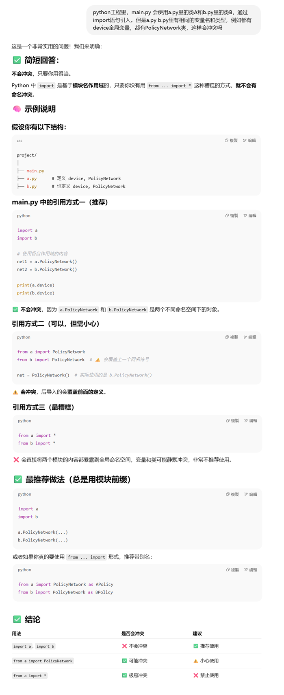

**Data-Efficient Hierarchical Reinforcement Learning**

### 1、Introduction

DRL在机械手臂控制等场景表现突出，但它只能完成一些原子的、简单的任务，例如移动一个零件，极少涉及到复杂的任务，例如在一个maze游戏里，蚂蚁需要跑到到绿色的终点位置，它除了需要规划线路，还需要找到钥匙打开门，或者推动方块填充沟壑铺路。

层级RL方法，有多层策略网络，分别负责决策和执行，很有希望搞定上述复杂任务。先前的HRL研究确实取得了一些鼓舞人心的成果。然而，许多方法缺乏通用性，往往需要一定程度的手工设计以适配具体任务，而且常常依赖昂贵的on-policy训练方式，无法充分利用近年来在off-policy无模型强化学习方面的进展——这些进展已经显著降低了样本复杂度要求。


在HRL中，在构造低层策略时，**能否区分出语义不同的行为模块**，是能否充分发挥 HRL 优势的关键。下面举个例子说明这个观点：


我们提出了一种HIRO算法，它的设计核心和动机要点：

- 目标：构建一种通用且高效的HRL算法，避免以往方法中过于依赖任务特定设计和昂贵的on-policy训练。

------

1、通用性设计（Generality）

- 传统HRL方法通常需要手工设计低层行为空间或子任务结构，不具有普适性。
- HIRO不依赖任务特定的结构或人为设定的子技能库，而是让高层输出“目标状态”作为指令。
- 低层策略的目标是使 agent 的状态靠近这个目标状态，且这一过程不依赖于外部任务结构。
- 所用的目标直接来自环境的原始状态观测（raw state observation），比如位置、姿态、关节角度等，而不是经过神经网络或其他方法变换过的抽象表示（embedding）。当然这点在很多物理控制类任务中很有效，但并不是在所有场景下都适用

------

2、样本效率提升（Sample Efficiency）

- 为了能在实际场景（如机器人控制）中使用，样本效率成为关键。
- HIRO在高层和低层都采用off-policy训练方法，可以利用已有的经验数据，不需每次都重新交互。
- 这样能利用近年来off-policy RL方法（如TD3）带来的采样效率提升。
- 相比需要on-policy策略梯度的旧HRL方法，大大减少了环境交互次数。

------

3、低层策略变化带来的非平稳性问题（Non-Stationarity Issue）

- 在HRL中，高层策略选择的是“目标”或“子任务”，由低层策略去执行。
- 然而低层策略在训练过程中会持续变化，导致同一个高层目标对应的实际行为也在变。
- 这会造成高层观察到的“状态—目标—结果”的经验样本变得不稳定（non-stationary），影响高层训练。例如：高层训练时复用旧数据（如旧的“往前走3米” → 早期低层策略还不完善，所以没怎么移动），在当前低层下却完全不成立，导致高层经验“失真”，训练变得不稳定。
- HIRO引入**off-policy修正机制（off-policy correction）**，通过“重标定”历史高层动作来解决这个问题：
  - 将历史高层经验中的目标，替换为在当前低层策略下更可能产生相同行为的目标；
  - 保证这些经验在当前策略下仍是有效的，从而可以被用于训练。

总之：HIRO通过通用的目标指令机制、off-policy双层训练架构和重标定技巧，解决了传统HRL中通用性差、样本效率低和高层训练不稳定的问题。

### 2、Background

介绍了RL、off-policy RL、TD Learning，这个比较熟悉，不赘述。

### 3、General and Efficient Hierarchical Reinforcement Learning

 HIRO: **HI**erarchical **R**einforcement learning with **O**ff-policy correction.

#### 算法原理


#### 深入的理解算法

##### 打分的函数实现

特别注意：高层的replaybuffer里的一次trainsition，不止记录 s, g, s', R， 要把整个低层的完整轨迹都要记录下来，从s, a..... s'。

高层的一次transition包括：

| 项目          | 说明                                                  |
| ------------- | ----------------------------------------------------- |
| `s_hi`        | 高层起始状态（如第 0 步）                             |
| `g`           | 高层指令（goal 向量）                                 |
| `R_sum`       | 在该高层指令下，累计的环境奖励（∑_{t=0}^{c-1} R_t）   |
| `s_hi_prime`  | 高层终止状态（例如第 c 步时的状态）                   |
| `a_{t:t+c-1`} | **完整的低层动作序列**，用于做 off-policy correction  |
| `s_{t:t+c`}   | **完整的低层状态序列**，配合动作才能做目标 relabeling |


##### 什么时候做矫正操作

论文中明确说了：

> 每次训练高层 Q 网络时，从高层 buffer 中采样 batch，然后**在使用前对每条 transition 的 goal 进行 re-labeling**，选出一个最可能造成原来 low-level action 序列的 `g̃`（goal relabeling）。因为底层策略在不断更新。
>
> 

##### 算法的伪代码，以DQN为例

```python
# 初始化高层Q函数 Q_hi(s, g)，目标网络 Q_hi_target
# 初始化低层Q函数 Q_lo(s, g, a)，目标网络 Q_lo_target
# 初始化 replay buffer：RB_hi 和 RB_lo
# 初始化 epsilon_hi, epsilon_lo（用于 ε-greedy）

for episode in range(max_episodes):
    s = env.reset()
    t = 0

    while not done:
        # === 每 c 步高层给出一个新的 goal ===
        if t % c == 0:
            # ε-greedy 选择 goal：g ∈ G
            if random() < epsilon_hi:
                g = random_goal()  # 随机采样一个目标向量
            else:
                g = argmax_g Q_hi(s, g)

            s_hi = s
            low_states = []
            low_actions = []
            env_rewards = []

        # === 低层执行动作 ===
        if random() < epsilon_lo:
            a = random_action()
        else:
            a = argmax_a Q_lo(s, g, a)

        s_next, R_env, done, _ = env.step(a)

        # 内在奖励：r = -||s + g - s_next||²
        r_intr = -np.linalg.norm((s + g - s_next)) ** 2

        # 存入低层 replay buffer
        RB_lo.append((s, g, a, r_intr, s_next))

        # 记录高层轨迹用
        low_states.append(s)
        low_actions.append(a)
        env_rewards.append(R_env)

        t += 1
        s = s_next

        # === 每 c 步或 episode 结束时，高层存经验 ===
        if t % c == 0 or done:
            s_hi_next = s
            R_sum = sum(env_rewards)
            low_states.append(s)  # 加入最后的 s_t+c
            RB_hi.append((s_hi, g, R_sum, s_hi_next, low_states, low_actions))

    # === 训练低层 Q 网络 ===
    for _ in range(lo_update_steps):
        (s, g, a, r, s_next) = sample_batch(RB_lo)
        a_next = argmax_a Q_lo(s_next, g, a)
        y = r + γ * Q_lo_target(s_next, g, a_next)
        loss = (Q_lo(s, g, a) - y)²
        update Q_lo to minimize loss

    # === 训练高层 Q 网络（含 relabel） ===
    for _ in range(hi_update_steps):
        (s_hi, g_old, R_sum, s_hi_next, low_states, low_actions) = sample_batch(RB_hi)

        # --- Off-policy correction: goal relabel ---
        candidate_goals = sample_10_goals(s_hi, s_hi_next)
        best_g = argmin_g [
            ∑_{i=0}^{c-1} ||a_i - argmax_a Q_lo(low_states[i], g_i, a)||²
        ]
        # g_i 用 h: g_{i+1} = s_i + g_i - s_{i+1}

        # --- Q_hi 训练 ---
        g_next = argmax_g Q_hi(s_hi_next, g)
        y = R_sum + γ * Q_hi_target(s_hi_next, g_next)
        loss = (Q_hi(s_hi, best_g) - y)²
        update Q_hi to minimize loss

    # === 软更新目标网络 ===
    soft_update(Q_lo, Q_lo_target, τ)
    soft_update(Q_hi, Q_hi_target, τ)

```


### 4、Related Work

提到了一些HRL框架：

1. options framework
2. option-critic framework
3. auxiliary rewards for the low-level policies
4.  FeUdal Networks（FuN）

并简单的比对了HIRO的优势

### 5、Experiments


### 6、Conclusion

We have presented a method:

1. training a two-layer hierarchical policy. 
2. be general, using learned goals to pass instructions from the higher-level policy to the lower-level one. 
3. be trained in an off-policy manner concurrently for highly sample-efficient learning. 
4. our method outperforms prior HRL algorithms and can solve exceedingly complex tasks 

Our results are still far from perfect, and there is much work left for future research to improve the stability and performance of HRL methods on these tasks.

### 7、Bison的实验

可以参考的开源实现，可读性不是很好：

```
https://github.com/watakandai/hiro_pytorch
```

#### 预备知识

HRL的工程通常会比其他基础RL算法实现要复杂一些，至少涉及到两层策略/价值网络，所以代码的模块化要求高一些，例如我的这个实验，准备基于SAC算法，就会有两个基础模块 low_sac和hi_sac，他们都是我拷贝的之前SAC的实现代码，他们包含很多相同名字的全局变量和类名，那么怎么使用才能避免冲突呢：



#### FetchReach任务

##### 定义任务

```python
import gymnasium as gym
import numpy as np
from sqlalchemy.testing.exclusions import succeeds_if


# 环境的再封装
# 环境返回的state里要包含desired_goal
# 环境的observation_space需要相应的改动
# 手动构造reward，根据举例desired_goal的距离变化，返回reward，这个没必要，我暂时只需要稀疏奖励
# sparse: the returned reward can have two values:
#         -1 if the end effector hasn’t reached its final target position,
#         and 0 if the end effector is in the final target position (the robot is considered to have reached the goal
#         if the Euclidean distance between the end effector and the goal is lower than 0.05 m).
class CustomFetchReachEnv(gym.Env):
    """
    自定义封装 FetchReach-v3 环境，符合 Gymnasium 接口规范。
    兼容 SB3 训练，支持 TensorBoard 记录 success_rate。
    """

    def __init__(self, render_mode=None):
        """
        初始化环境。
        Args:
            render_mode (str, optional): 渲染模式，支持 "human" 或 "rgb_array"。
        """
        super().__init__()


        # 创建原始 FetchReach-v3 环境
        self._env = gym.make("FetchReach-v3", render_mode=render_mode, max_episode_steps=100)

        # 继承原始的动作和观测空间
        self.action_space = self._env.action_space
        self.observation_space = gym.spaces.Box(-np.inf, np.inf, shape=(10+3,))  # 简化后的状态, 10个observe，3个desired_goal，一起拼接为state返回

        self.total_step = 0

        # 初始化渲染模式
        self.render_mode = render_mode
        self.desired_goal = None


    def reset(self, seed=None, options=None):
        """
        重置环境，返回初始观测和 info。
        """
        obs, info = self._env.reset(seed=seed, options=options)
        '''
        #尝试固定目标位置进行训练，结果显示可以到达100%成功率
        if self.desired_goal is None:
            self.desired_goal = obs['desired_goal']
            print(f"desired:{self.desired_goal}")
            writer.add_text('desired_goal', f"{self.desired_goal}", 1)'''

        self.desired_goal = obs['desired_goal']


        state = np.concatenate( [obs['observation'],self.desired_goal ] )

        info['desired_goal'] = self.desired_goal


        return state, info

    def step(self, action):
        """
        执行动作，返回 (obs, reward, done, truncated, info)。
        注意：Gymnasium 的 step() 返回 5 个值（包括 truncated）。
        """
        obs, external_reward, terminated, truncated, info = self._env.step(action)
        self.total_step += 1
        state = np.concatenate( [obs['observation'],self.desired_goal ] )
        info['desired_goal'] = self.desired_goal

        # 确保 info 包含 is_success（SB3 的 success_rate 依赖此字段）
        if external_reward >= 0.0 and terminated:
            success = True
        else:
            success = False

        info["is_success"] = success

        return state, external_reward, terminated, truncated, info

    def render(self):
        """
        渲染环境（可选）。
        """
        return self._env.render()

    def close(self):
        """
        关闭环境，释放资源。
        """
        self._env.close()

    @property
    def unwrapped(self):
        """
        返回原始环境（用于访问原始方法）。
        """
        return self._env
```

##### 定义低层SAC

```python
import os
import random
import numpy as np
import gym
import torch
import torch.nn as nn
import torch.optim as optim
import torch.nn.functional as F
from torch.utils.tensorboard import SummaryWriter
from collections import deque, namedtuple
from datetime import datetime

# 设备配置
device = torch.device("cuda" if torch.cuda.is_available() else "cpu")

# 经验回放缓冲区
Transition = namedtuple('Transition', ('state', 'action', 'reward', 'next_state', 'done'))


class ReplayBuffer:
    def __init__(self, capacity):
        self.buffer = deque(maxlen=capacity)

    def push(self, *args):
        """保存一个transition到buffer"""
        self.buffer.append(Transition(*args))

    def sample(self, batch_size):
        """随机采样一个batch的transition"""
        transitions = random.sample(self.buffer, batch_size)
        # 将batch的transitions转换为Transition的batch
        batch = Transition(*zip(*transitions))

        # 转换为tensor并指定设备
        # state: (batch_size, state_dim) -> (batch_size, state_dim)
        state = torch.FloatTensor(np.array(batch.state)).to(device)
        # action: (batch_size, action_dim) -> (batch_size, action_dim)
        action = torch.FloatTensor(np.array(batch.action)).to(device)
        # reward: (batch_size,) -> (batch_size, 1)
        reward = torch.FloatTensor(np.array(batch.reward)).unsqueeze(1).to(device)
        # next_state: (batch_size, state_dim) -> (batch_size, state_dim)
        next_state = torch.FloatTensor(np.array(batch.next_state)).to(device)
        # done: (batch_size,) -> (batch_size, 1)
        done = torch.FloatTensor(np.array(batch.done)).unsqueeze(1).to(device)

        return state, action, reward, next_state, done

    def __len__(self):
        return len(self.buffer)


# 策略网络 (Actor)
class GaussianPolicy(nn.Module):
    def __init__(self, state_dim, action_dim, hidden_dim=256, max_action=2.0):
        super(GaussianPolicy, self).__init__()
        self.max_action = max_action

        # 共享的特征提取层
        self.fc1 = nn.Linear(state_dim, hidden_dim)
        self.fc2 = nn.Linear(hidden_dim, hidden_dim)

        # 输出均值和log标准差
        self.mean = nn.Linear(hidden_dim, action_dim)
        self.log_std = nn.Linear(hidden_dim, action_dim)

    def forward(self, state):
        """前向传播，返回动作的均值和log标准差"""
        # state: (batch_size, state_dim) -> (batch_size, hidden_dim)
        x = F.relu(self.fc1(state))
        x = F.relu(self.fc2(x))

        # mean: (batch_size, action_dim)
        mean = self.mean(x)
        # log_std: (batch_size, action_dim)
        log_std = self.log_std(x)
        # 限制log_std的范围
        log_std = torch.clamp(log_std, min=-20, max=2)

        return mean, log_std

    def sample(self, state):
        """从策略中采样动作，并计算对数概率"""
        # 获取均值和log标准差
        # mean: (batch_size, action_dim)
        # log_std: (batch_size, action_dim)
        mean, log_std = self.forward(state)
        std = log_std.exp()

        # 重参数化技巧采样动作
        # normal_noise: (batch_size, action_dim)
        normal_noise = torch.randn_like(mean)
        # action: (batch_size, action_dim)
        raw_action = mean + normal_noise * std

        # 计算tanh变换前的对数概率
        log_prob = -0.5 * (normal_noise.pow(2) + 2 * log_std + np.log(2 * np.pi))
        log_prob = log_prob.sum(dim=-1, keepdim=True)

        # 应用tanh变换
        action = torch.tanh(raw_action) * self.max_action

        # 添加tanh的Jacobian修正
        log_prob -= (2 * (np.log(2) - raw_action - F.softplus(-2 * raw_action))).sum(dim=-1, keepdim=True)

        return action, log_prob


# Q网络 (Critic)
class QNetwork(nn.Module):
    def __init__(self, state_dim, action_dim, hidden_dim=256):
        super(QNetwork, self).__init__()

        # Q1网络
        self.fc1 = nn.Linear(state_dim + action_dim, hidden_dim)
        self.fc2 = nn.Linear(hidden_dim, hidden_dim)
        self.fc3 = nn.Linear(hidden_dim, 1)

        # Q2网络
        self.fc4 = nn.Linear(state_dim + action_dim, hidden_dim)
        self.fc5 = nn.Linear(hidden_dim, hidden_dim)
        self.fc6 = nn.Linear(hidden_dim, 1)

    def forward(self, state, action):
        """前向传播，返回两个Q值"""
        # state: (batch_size, state_dim)
        # action: (batch_size, action_dim)
        sa = torch.cat([state, action], dim=-1)

        # Q1网络
        q1 = F.relu(self.fc1(sa))
        q1 = F.relu(self.fc2(q1))
        q1 = self.fc3(q1)

        # Q2网络
        q2 = F.relu(self.fc4(sa))
        q2 = F.relu(self.fc5(q2))
        q2 = self.fc6(q2)

        return q1, q2


# SAC算法主体
class HIRO_LOW_SAC:
    def __init__(self, state_dim, action_dim, max_action, writer):
        # 超参数
        self.gamma = 0.99
        self.tau = 0.005
        self.alpha = 0.2
        self.lr = 3e-4
        self.batch_size = 128
        self.buffer_size = 100000
        self.target_entropy = -action_dim
        self.automatic_entropy_tuning = True
        self.step_cnt = 0
        self.writer = writer

        # 网络初始化
        self.actor = GaussianPolicy(state_dim, action_dim, max_action=max_action).to(device)
        self.critic = QNetwork(state_dim, action_dim).to(device)
        self.critic_target = QNetwork(state_dim, action_dim).to(device)
        self.critic_target.load_state_dict(self.critic.state_dict())

        # 优化器
        self.actor_optimizer = optim.Adam(self.actor.parameters(), lr=self.lr)
        self.critic_optimizer = optim.Adam(self.critic.parameters(), lr=self.lr)

        # 自动调节温度系数alpha
        if self.automatic_entropy_tuning:
            self.log_alpha = torch.zeros(1, requires_grad=True, device=device)
            self.alpha_optimizer = optim.Adam([self.log_alpha], lr=self.lr)

        # 经验回放缓冲区
        self.replay_buffer = ReplayBuffer(self.buffer_size)

    def select_action(self, state, evaluate=False):
        """选择动作"""
        state = torch.FloatTensor(state).unsqueeze(0).to(device)
        if evaluate:
            # 评估时不添加噪声
            with torch.no_grad():
                mean, _ = self.actor(state)
                # 评估时希望表现稳定，因此直接使用均值（概率密度最大的点）.  tanh后把值映射到[-1,1]， 乘以max_action就 映射到环境动作空间
                action = torch.tanh(mean) * self.actor.max_action
        else:
            # 训练时采样动作
            action, _ = self.actor.sample(state)

        return action.detach().cpu().numpy()[0]

    def update_parameters(self):
        """更新网络参数"""
        if len(self.replay_buffer) < self.batch_size:
            return None,None,None
        self.step_cnt += 1

        # 从缓冲区采样一个batch
        state, action, reward, next_state, done = self.replay_buffer.sample(self.batch_size)

        with torch.no_grad():
            # 采样下一个动作并计算其对数概率
            next_action, next_log_prob = self.actor.sample(next_state)

            # 计算目标Q值
            q1_next, q2_next = self.critic_target(next_state, next_action)
            min_q_next = torch.min(q1_next, q2_next) - self.alpha * next_log_prob
            target_q = reward + (1 - done) * self.gamma * min_q_next

        # 更新Critic网络
        current_q1, current_q2 = self.critic(state, action)
        critic_loss = F.mse_loss(current_q1, target_q) + F.mse_loss(current_q2, target_q)

        self.critic_optimizer.zero_grad()
        critic_loss.backward()
        self.critic_optimizer.step()

        # 更新Actor网络
        new_action, log_prob = self.actor.sample(state)
        q1, q2 = self.critic(state, new_action)
        min_q = torch.min(q1, q2)
        # 最大化熵和最大化min_q，因为是梯度下降，要实现梯度上升，所以min_q前面有符号， 熵是 -log_prob，负负得正
        actor_loss = (self.alpha * log_prob - min_q).mean()

        self.actor_optimizer.zero_grad()
        actor_loss.backward()
        self.actor_optimizer.step()

        # 自动调节alpha
        if self.automatic_entropy_tuning:
            alpha_loss = -(self.log_alpha * (log_prob + self.target_entropy).detach()).mean()

            self.alpha_optimizer.zero_grad()
            alpha_loss.backward()
            self.alpha_optimizer.step()

            self.alpha = self.log_alpha.exp()

        # 软更新目标网络
        for param, target_param in zip(self.critic.parameters(), self.critic_target.parameters()):
            target_param.data.copy_(self.tau * param.data + (1 - self.tau) * target_param.data)


        self.writer.add_scalar('lo/critic_loss', critic_loss.item(), self.step_cnt)
        self.writer.add_scalar('lo/actor_loss',  actor_loss.item(), self.step_cnt)
        self.writer.add_scalar('lo/alpha', self.alpha.item(), self.step_cnt)

        return critic_loss.item(), actor_loss.item(), self.alpha.item()
```

##### 定义高层SAC

```python
import os
import random
import numpy as np
import gym
import torch
import torch.nn as nn
import torch.optim as optim
import torch.nn.functional as F
from torch.utils.tensorboard import SummaryWriter
from collections import deque, namedtuple
from datetime import datetime

# 设备配置
device = torch.device("cuda" if torch.cuda.is_available() else "cpu")

# 经验回放缓冲区
Transition = namedtuple('Transition', ('state', 'action', 'reward', 'next_state', 'done',
                                       'low_states', 'low_actions'))


class ReplayBuffer:
    def __init__(self, capacity):
        self.buffer = deque(maxlen=capacity)

    def push(self, *args):
        """保存一个transition到buffer"""
        self.buffer.append(Transition(*args))

    def sample(self, batch_size):
        """随机采样一个batch的transition"""
        transitions = random.sample(self.buffer, batch_size)
        # 将batch的transitions转换为Transition的batch
        batch = Transition(*zip(*transitions))

        # 转换为tensor并指定设备
        # state: (batch_size, state_dim) -> (batch_size, state_dim)
        state = torch.FloatTensor(np.array(batch.state)).to(device)
        # action: (batch_size, action_dim) -> (batch_size, action_dim)
        action = torch.FloatTensor(np.array(batch.action)).to(device)
        # reward: (batch_size,) -> (batch_size, 1)
        reward = torch.FloatTensor(np.array(batch.reward)).unsqueeze(1).to(device)
        # next_state: (batch_size, state_dim) -> (batch_size, state_dim)
        next_state = torch.FloatTensor(np.array(batch.next_state)).to(device)
        # done: (batch_size,) -> (batch_size, 1)
        done = torch.FloatTensor(np.array(batch.done)).unsqueeze(1).to(device)

        # low_states: (batch_size, num, state_dim)
        low_states = list(batch.low_states)
        # low_actions: (batch_size, num, action_dim)
        low_actions = list(batch.low_actions)

        return state, action, reward, next_state, done, low_states, low_actions

    def __len__(self):
        return len(self.buffer)


# 策略网络 (Actor)
class GaussianPolicy(nn.Module):
    def __init__(self, state_dim, action_dim, hidden_dim=256, max_action=2.0):
        super(GaussianPolicy, self).__init__()
        self.max_action = max_action

        # 共享的特征提取层
        self.fc1 = nn.Linear(state_dim, hidden_dim)
        self.fc2 = nn.Linear(hidden_dim, hidden_dim)

        # 输出均值和log标准差
        self.mean = nn.Linear(hidden_dim, action_dim)
        self.log_std = nn.Linear(hidden_dim, action_dim)

    def forward(self, state):
        """前向传播，返回动作的均值和log标准差"""
        # state: (batch_size, state_dim) -> (batch_size, hidden_dim)
        x = F.relu(self.fc1(state))
        x = F.relu(self.fc2(x))

        # mean: (batch_size, action_dim)
        mean = self.mean(x)
        # log_std: (batch_size, action_dim)
        log_std = self.log_std(x)
        # 限制log_std的范围
        log_std = torch.clamp(log_std, min=-20, max=2)

        return mean, log_std

    def sample(self, state):
        """从策略中采样动作，并计算对数概率"""
        # 获取均值和log标准差
        # mean: (batch_size, action_dim)
        # log_std: (batch_size, action_dim)
        mean, log_std = self.forward(state)
        std = log_std.exp()

        # 重参数化技巧采样动作
        # normal_noise: (batch_size, action_dim)
        normal_noise = torch.randn_like(mean)
        # action: (batch_size, action_dim)
        raw_action = mean + normal_noise * std

        # 计算tanh变换前的对数概率
        log_prob = -0.5 * (normal_noise.pow(2) + 2 * log_std + np.log(2 * np.pi))
        log_prob = log_prob.sum(dim=-1, keepdim=True)

        # 应用tanh变换
        action = torch.tanh(raw_action) * self.max_action

        # 添加tanh的Jacobian修正
        log_prob -= (2 * (np.log(2) - raw_action - F.softplus(-2 * raw_action))).sum(dim=-1, keepdim=True)

        return action, log_prob


# Q网络 (Critic)
class QNetwork(nn.Module):
    def __init__(self, state_dim, action_dim, hidden_dim=256):
        super(QNetwork, self).__init__()

        # Q1网络
        self.fc1 = nn.Linear(state_dim + action_dim, hidden_dim)
        self.fc2 = nn.Linear(hidden_dim, hidden_dim)
        self.fc3 = nn.Linear(hidden_dim, 1)

        # Q2网络
        self.fc4 = nn.Linear(state_dim + action_dim, hidden_dim)
        self.fc5 = nn.Linear(hidden_dim, hidden_dim)
        self.fc6 = nn.Linear(hidden_dim, 1)

    def forward(self, state, action):
        """前向传播，返回两个Q值"""
        # state: (batch_size, state_dim)
        # action: (batch_size, action_dim)
        sa = torch.cat([state, action], dim=-1)

        # Q1网络
        q1 = F.relu(self.fc1(sa))
        q1 = F.relu(self.fc2(q1))
        q1 = self.fc3(q1)

        # Q2网络
        q2 = F.relu(self.fc4(sa))
        q2 = F.relu(self.fc5(q2))
        q2 = self.fc6(q2)

        return q1, q2


# SAC算法主体
class HIRO_HI_SAC:
    def __init__(self, state_dim, action_dim, max_action, writer):
        # 超参数
        self.gamma = 0.99
        self.tau = 0.005
        self.alpha = 0.2
        self.lr = 3e-4
        self.batch_size = 128
        self.buffer_size = 100000
        self.target_entropy = -action_dim
        self.automatic_entropy_tuning = True
        self.step_cnt = 0
        self.writer = writer

        # 网络初始化
        self.actor = GaussianPolicy(state_dim, action_dim, max_action=max_action).to(device)
        self.critic = QNetwork(state_dim, action_dim).to(device)
        self.critic_target = QNetwork(state_dim, action_dim).to(device)
        self.critic_target.load_state_dict(self.critic.state_dict())

        # 优化器
        self.actor_optimizer = optim.Adam(self.actor.parameters(), lr=self.lr)
        self.critic_optimizer = optim.Adam(self.critic.parameters(), lr=self.lr)

        # 自动调节温度系数alpha
        if self.automatic_entropy_tuning:
            self.log_alpha = torch.zeros(1, requires_grad=True, device=device)
            self.alpha_optimizer = optim.Adam([self.log_alpha], lr=self.lr)

        # 经验回放缓冲区
        self.replay_buffer = ReplayBuffer(self.buffer_size)

    def select_action(self, state, evaluate=False):
        """选择动作"""
        state = torch.FloatTensor(state).unsqueeze(0).to(device)
        if evaluate:
            # 评估时不添加噪声
            with torch.no_grad():
                mean, _ = self.actor(state)
                # 评估时希望表现稳定，因此直接使用均值（概率密度最大的点）.  tanh后把值映射到[-1,1]， 乘以max_action就 映射到环境动作空间
                action = torch.tanh(mean) * self.actor.max_action
        else:
            # 训练时采样动作
            action, _ = self.actor.sample(state)

        return action.detach().cpu().numpy()

    # 对高层策略的单条transition进行矫正重标注
    def relabel_trainsitions(self, lo_policy,
                             action: torch.Tensor,  # (action_dim,) 高层动作，需要重新标注
                             low_states: torch.Tensor,  # (seq_len+1, state_dim)，低层的状态序列
                             low_actions: torch.Tensor,  # (seq_len, action_dim)，低层的动作序列
                             state_diff,  # 计算两个状态的差值函数，允许开发者自定义
                             state_modify, # 修改低层策略的输入，让它组合的是可能的candidate
                             candidate_num=10):
        """
        对单个高层 transition，基于当前 lo_policy 重新标注高层动作（goal）
        low_states的长度比low_actions的长度大 1

        返回:
            best_goal: (action_dim,) tensor, 表示新的高层动作
        """
        seq_len = low_actions.shape[0]
        state_dim = low_states.shape[1]
        action_dim = low_actions.shape[1]
        device = action.device

        # 生成候选高层动作 g~：共 candidate_num 个
        s_0 = low_states[0]  # (state_dim,)
        s_c = low_states[-1]  # (state_dim,)
        diff = state_diff(s_c,s_0)  # 用作采样中心
        diff = torch.tensor(diff, device=device, dtype=torch.float32)
        candidates = [action, diff]  # 原始 action、diff 都加入
        for _ in range(candidate_num - 2):
            noise = torch.randn_like(diff, device=device, dtype=torch.float32) * 0.5  # 可根据动作范围调整
            candidates.append(diff + noise)

        scores = []
        for g0 in candidates: #对每一各候选高层动作，计算低层对应的动作序列
            score = 0
            for t in range(seq_len):
                lo_policy_input = state_modify( np.array( [low_states[t] ] ), np.array( [g0.cpu().numpy()] ))
                lo_policy_input = lo_policy_input[0]
                new_low_action = lo_policy(lo_policy_input)
                loss = -F.mse_loss(torch.FloatTensor(low_actions[t]), torch.FloatTensor(new_low_action)).item()
                score += loss
            scores.append(score/(seq_len+1e-8))


        # 找出使 loss 最小的 g
        best_idx = torch.argmax(torch.tensor(scores,device=device))
        best_goal = candidates[best_idx.cpu().item()].detach()
        return best_goal

    def update_parameters(self, lo_policy, state_diff, state_modify):
        """更新网络参数"""
        if len(self.replay_buffer) < self.batch_size:
            return None,None,None
        self.step_cnt += 1

        # 从缓冲区采样一个batch
        state, action, reward, next_state, done, low_states, low_actions = self.replay_buffer.sample(self.batch_size)
        # low_states, low_actions 这两个是list，元素是低层的序列，长度不一，大多数时候等于Config.new_g_interval，但有时候由于回合结束，长度不足Config.new_g_interval
        B = state.shape[0]
        relabeled_action = torch.zeros_like(action)
        for sample_idx in range(B):
            best_goal = self.relabel_trainsitions(lo_policy, action[sample_idx], low_states[sample_idx], low_actions[sample_idx], state_diff, state_modify)
            relabeled_action[sample_idx] = best_goal

        action = relabeled_action

        with torch.no_grad():
            # 采样下一个动作并计算其对数概率
            next_action, next_log_prob = self.actor.sample(next_state)

            # 计算目标Q值
            q1_next, q2_next = self.critic_target(next_state, next_action)
            min_q_next = torch.min(q1_next, q2_next) - self.alpha * next_log_prob
            target_q = reward + (1 - done) * self.gamma * min_q_next

        # 更新Critic网络
        current_q1, current_q2 = self.critic(state, action)
        critic_loss = F.mse_loss(current_q1, target_q) + F.mse_loss(current_q2, target_q)

        self.critic_optimizer.zero_grad()
        critic_loss.backward()
        self.critic_optimizer.step()

        # 更新Actor网络
        new_action, log_prob = self.actor.sample(state)
        q1, q2 = self.critic(state, new_action)
        min_q = torch.min(q1, q2)
        # 最大化熵和最大化min_q，因为是梯度下降，要实现梯度上升，所以min_q前面有符号， 熵是 -log_prob，负负得正
        actor_loss = (self.alpha * log_prob - min_q).mean()

        self.actor_optimizer.zero_grad()
        actor_loss.backward()
        self.actor_optimizer.step()

        # 自动调节alpha
        if self.automatic_entropy_tuning:
            alpha_loss = -(self.log_alpha * (log_prob + self.target_entropy).detach()).mean()

            self.alpha_optimizer.zero_grad()
            alpha_loss.backward()
            self.alpha_optimizer.step()

            self.alpha = self.log_alpha.exp()

        # 软更新目标网络
        for param, target_param in zip(self.critic.parameters(), self.critic_target.parameters()):
            target_param.data.copy_(self.tau * param.data + (1 - self.tau) * target_param.data)


        self.writer.add_scalar('hi/critic_loss', critic_loss.item(), self.step_cnt)
        self.writer.add_scalar('hi/actor_loss',  actor_loss.item(), self.step_cnt)
        self.writer.add_scalar('hi/alpha', self.alpha.item(), self.step_cnt)

        return critic_loss.item(), actor_loss.item(), self.alpha.item()
```

##### 训练

```python
import datetime

import numpy
import numpy as np

import my_hi_sac
import my_low_sac
import my_fetchreach_env
import os
import torch
from torch.utils.tensorboard import SummaryWriter

class Config:
    max_episodes = 1000
    pretrain_lo_episodes = 1000
    max_episode_steps = 100
    new_g_interval = 20

def encode_g_in_state(state:numpy.ndarray, g:numpy.ndarray):
    assert state.shape[0] == 1 and g.shape[0] == 1, ""
    newstate = numpy.concat( [ state[:, 0:10], g] , axis=-1)
    return newstate

def state_diff(b:torch.Tensor, a:torch.Tensor): # env返回的状态，前三个元素是手臂末段的x,y,z坐标，我们的低层目标也是移动这个差值
    return b[:3] - a[:3]

def intrinsic_reward(state:numpy.ndarray, g:numpy.ndarray, next_state: numpy.ndarray):
    diff = state_diff(torch.FloatTensor(next_state), torch.FloatTensor(state) )
    dist = torch.nn.functional.mse_loss(diff, torch.FloatTensor(g))
    if dist <= 0.01:
        return 0, True
    else:
        return -dist.cpu().item(), False
    

def generate_zero_mean_g():
    # 随机采样前两个元素，范围是 [-0.2, -0.1] ∪ [0.1, 0.2]
    def sample_component():
        sign = np.random.choice([-1, 1])
        return sign * np.random.uniform(0.1, 0.2)

    x1 = sample_component()
    x2 = sample_component()
    x3 = sample_component()

    return np.array([[x1, x2, x3]])

def pretrain_low_policy(env, lo:my_low_sac.HIRO_LOW_SAC):
    lo_episode_cnt = 0
    for episode in range(1, Config.pretrain_lo_episodes):
        state, _ = env.reset()

        episode_reward = 0
        lo_episode_rewards = []
        lo_rw = 0
        lo_done = False
        step_cnt = 0 # 用来决定lo episode的起止
        g = None # 高层给到低层的子目标
        s_hi = None # lo episode的起始状态
        for i in range(Config.max_episode_steps):  # 一个回合最多与环境交互xx次

            if step_cnt % Config.new_g_interval == 0:
                # 固定长度的lo episode开始了
                lo_episode_cnt += 1
                g = generate_zero_mean_g()
                s_hi = state
                lo_done = False
                lo_episode_rewards = []
    
            assert g is not None, ""
            state = encode_g_in_state(numpy.array([state]), g) # 把g作为输入的一部分
            state = state[0]
            # 选择动作
            action = lo.select_action(state)

            # 执行动作
            next_state, env_reward, term, trunc, _ = env.step(action)
            done = term or trunc
            step_cnt += 1
            episode_reward += env_reward

            if not lo_done: #当前lo episode还没有结束，那么就要计算内部奖励、确定是否结束、存储时间步
                lo_rw, lo_done = intrinsic_reward(s_hi, g[0], next_state)
                lo_done = lo_done or done or (step_cnt % Config.new_g_interval == 0)  # 低层回合截断了,lo_done也必须设置为True
                # 存储transition
                lo.replay_buffer.push(state, action, lo_rw, next_state, lo_done)
                lo_episode_rewards.append( lo_rw)

            # 更新状态
            state = next_state

            # 更新网络参数
            lo.update_parameters()

            if done or step_cnt % Config.new_g_interval == 0:
                #固定长度的lo episode结束了， 主要是上报是否成功、内部奖励的均值
                if abs(lo_rw) <= 0.01:
                    lo.writer.add_scalar('lo/lo_episode_suc', 1, lo_episode_cnt)
                else:
                    lo.writer.add_scalar('lo/lo_episode_suc', 0, lo_episode_cnt)
                lo.writer.add_scalar('lo/avg_intrinsic_reward', np.mean(lo_episode_rewards), lo_episode_cnt)
            
            if done:
                break

        # 记录到TensorBoard
        lo.writer.add_scalar('lo/episode_reward', episode_reward, episode)


def train(env, hi:my_hi_sac.HIRO_HI_SAC, lo:my_low_sac.HIRO_LOW_SAC):

    def lo_policy(state):
        return lo.select_action(state, True)

    best_reward = -float('inf')
    lo_episode_cnt = 0
    for episode in range(1, Config.max_episodes + 1):
        state, _ = env.reset()
        episode_reward = 0
        lo_rw = 0
        step_cnt = 0 #一定要初始化为0，因为下面利用了这个值模c等于0产生g
        g = None
        low_states = []
        low_actions = []
        env_rewards = []

        s_hi = None
        for i in range(Config.max_episode_steps):  #一个回合最多与环境交互xx次


            if step_cnt % Config.new_g_interval == 0:
                lo_episode_cnt += 1
                if episode < Config.pretrain_lo_episodes:
                    g = generate_zero_mean_g()
                else:
                    g = hi.select_action(state)
                assert g.shape == (1,3), ""
                s_hi = state
                low_states = []
                low_actions = []
                env_rewards = []

            assert g is not None,  ""
            state = encode_g_in_state(numpy.array([state]), g)
            state = state[0]
            # 选择动作
            action = lo.select_action(state)

            # 执行动作
            next_state, reward, term, trunc,_ = env.step(action)
            done = term or trunc
            step_cnt += 1

            lo_rw, lo_done = intrinsic_reward(s_hi, g[0], next_state)
            lo_done = lo_done  or done or (step_cnt%Config.new_g_interval==0) #低层回合截断了,lo_done也必须设置为True

            low_states.append(state)
            low_actions.append(action)
            env_rewards.append(reward)

            # 存储transition
            lo.replay_buffer.push(state, action, lo_rw, next_state, lo_done)

            # 更新状态
            state = next_state
            episode_reward += reward

            # 更新网络参数
            critic_loss, actor_loss, alpha = critic_loss, actor_loss, alpha = lo.update_parameters()

            if lo_done:
                if abs(lo_rw) <= 0.01:
                    lo.writer.add_scalar('lo/lo_episode_suc', 1, lo_episode_cnt)
                else:
                    lo.writer.add_scalar('lo/lo_episode_suc', 0, lo_episode_cnt)
                s_hi_next = state
                r_sum = sum(env_rewards)
                low_states.append(state)  # 加入最后的 s_t+c
                low_states = numpy.array(low_states)
                low_actions = numpy.array(low_actions)
                hi.replay_buffer.push( s_hi, g[0], r_sum, s_hi_next, done, low_states, low_actions )
                if episode > Config.pretrain_lo_episodes:
                    critic_loss, actor_loss, alpha = hi.update_parameters(lo_policy, state_diff, encode_g_in_state)
                # begin a new lo_episode
                lo_episode_cnt += 1
                if episode < Config.pretrain_lo_episodes:
                    g = generate_zero_mean_g()
                else:
                    g = hi.select_action(state)
                assert g.shape == (1, 3), ""
                s_hi = state
                low_states = []
                low_actions = []
                env_rewards = []

            if done:
                break

        # 记录到TensorBoard
        lo.writer.add_scalar('lo/episode_reward', episode_reward, episode)
        lo.writer.add_scalar('lo/intrinsic_reward', lo_rw, episode)


# 评估函数
def evaluate(env, hi:my_hi_sac.HIRO_HI_SAC, lo:my_low_sac.HIRO_LOW_SAC, num_episodes=10):
    reward_list = []
    for episode in range(1, num_episodes + 1):
        state, _ = env.reset()
        episode_reward = 0
        done = False
        step_cnt = 0
        g = None
        for i in range(Config.max_episode_steps):
            if step_cnt % Config.new_g_interval == 0:
                g = hi.select_action(state, True)
                assert g.shape == (1, 3), ""

            assert g is not None, ""
            state = encode_g_in_state(numpy.array([state]), g)
            # 选择动作
            action = lo.select_action(state[0], True)

            # 执行动作
            next_state, reward, term, trunc, _ = env.step(action)
            done = term or trunc
            step_cnt += 1

            # 更新状态
            state = next_state
            episode_reward += reward

            if done:
                break
        reward_list.append(episode_reward)
        print(f"Evaluation Episode: {episode}, Reward: {episode_reward:.2f}")
    return numpy.mean(reward_list)

# 主函数
def main():
    # 创建环境
    env = my_fetchreach_env.CustomFetchReachEnv()
    state_dim = env.observation_space.shape[0]
    action_dim = env.action_space.shape[0]
    max_action = float(env.action_space.high[0])
    print(f"state_dim:{state_dim}, action_dim:{action_dim}, max_action:{max_action}")

    writer = SummaryWriter(log_dir=f'logs/HIRO_FetchReach_{datetime.datetime.now().strftime("%m%d_%H%M%S")}')
    # 创建SAC代理
    hi = my_hi_sac.HIRO_HI_SAC(state_dim, 3, 1, writer) # 高层策略输出的是g,相对于当前的位置的xyz偏移量，假设偏移量最多1米
    lo = my_low_sac.HIRO_LOW_SAC(state_dim, action_dim, max_action, writer)

    # 创建检查点目录
    os.makedirs("checkpoints", exist_ok=True)

    #train(env, hi, lo)
    pretrain_low_policy(env, lo)

    env.close()
    env = my_fetchreach_env.CustomFetchReachEnv('human')
    evaluate(env, hi, lo)


if __name__ == '__main__':
    main()
```

