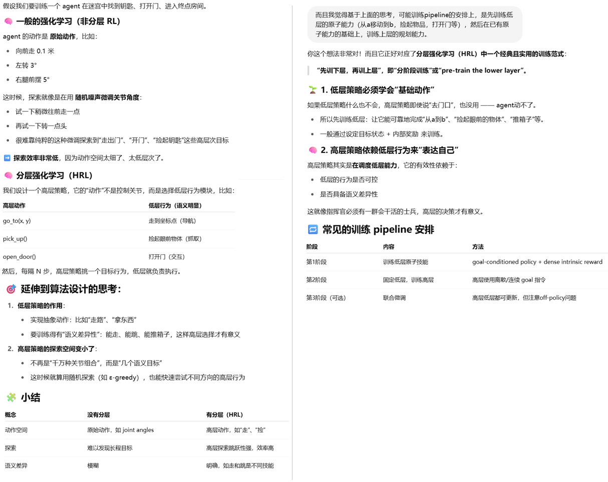

**Data-Efficient Hierarchical Reinforcement Learning**

### 1、Introduction

DRL在机械手臂控制等场景表现突出，但它只能完成一些原子的、简单的任务，例如移动一个零件，极少涉及到复杂的任务，例如在一个maze游戏里，蚂蚁需要跑到到绿色的终点位置，它除了需要规划线路，还需要找到钥匙打开门，或者推动方块填充沟壑铺路。

层级RL方法，有多层策略网络，分别负责决策和执行，很有希望搞定上述复杂任务。先前的HRL研究确实取得了一些鼓舞人心的成果。然而，许多方法缺乏通用性，往往需要一定程度的手工设计以适配具体任务，而且常常依赖昂贵的on-policy训练方式，无法充分利用近年来在off-policy无模型强化学习方面的进展——这些进展已经显著降低了样本复杂度要求。


在HRL中，在构造低层策略时，**能否区分出语义不同的行为模块**，是能否充分发挥 HRL 优势的关键。下面举个例子说明这个观点：



我们提出了一种HIRO算法，它的设计核心和动机要点：

- 目标：构建一种通用且高效的HRL算法，避免以往方法中过于依赖任务特定设计和昂贵的on-policy训练。

------

1、通用性设计（Generality）

- 传统HRL方法通常需要手工设计低层行为空间或子任务结构，不具有普适性。
- HIRO不依赖任务特定的结构或人为设定的子技能库，而是让高层输出“目标状态”作为指令。
- 低层策略的目标是使 agent 的状态靠近这个目标状态，且这一过程不依赖于外部任务结构。
- 所用的目标直接来自环境的原始状态观测（raw state observation），比如位置、姿态、关节角度等，而不是经过神经网络或其他方法变换过的抽象表示（embedding）。当然这点在很多物理控制类任务中很有效，但并不是在所有场景下都适用

------

2、样本效率提升（Sample Efficiency）

- 为了能在实际场景（如机器人控制）中使用，样本效率成为关键。
- HIRO在高层和低层都采用off-policy训练方法，可以利用已有的经验数据，不需每次都重新交互。
- 这样能利用近年来off-policy RL方法（如TD3）带来的采样效率提升。
- 相比需要on-policy策略梯度的旧HRL方法，大大减少了环境交互次数。

------

3、低层策略变化带来的非平稳性问题（Non-Stationarity Issue）

- 在HRL中，高层策略选择的是“目标”或“子任务”，由低层策略去执行。
- 然而低层策略在训练过程中会持续变化，导致同一个高层目标对应的实际行为也在变。
- 这会造成高层观察到的“状态—目标—结果”的经验样本变得不稳定（non-stationary），影响高层训练。例如：高层训练时复用旧数据（如旧的“往前走3米” → 早期低层策略还不完善，所以没怎么移动），在当前低层下却完全不成立，导致高层经验“失真”，训练变得不稳定。
- HIRO引入**off-policy修正机制（off-policy correction）**，通过“重标定”历史高层动作来解决这个问题：
  - 将历史高层经验中的目标，替换为在当前低层策略下更可能产生相同行为的目标；
  - 保证这些经验在当前策略下仍是有效的，从而可以被用于训练。

总之：HIRO通过通用的目标指令机制、off-policy双层训练架构和重标定技巧，解决了传统HRL中通用性差、样本效率低和高层训练不稳定的问题。

### 2、Background

介绍了RL、off-policy RL、TD Learning，这个比较熟悉，不赘述。

### 3、General and Efficient Hierarchical Reinforcement Learning

 HIRO: **HI**erarchical **R**einforcement learning with **O**ff-policy correction.


#### 深入的理解算法

##### 打分的函数实现

特别注意：高层的replaybuffer里的一次trainsition，不止记录 s, g, s', R， 要把整个低层的完整轨迹都要记录下来，从s, a..... s'。

高层的一次transition包括：

| 项目          | 说明                                                  |
| ------------- | ----------------------------------------------------- |
| `s_hi`        | 高层起始状态（如第 0 步）                             |
| `g`           | 高层指令（goal 向量）                                 |
| `R_sum`       | 在该高层指令下，累计的环境奖励（∑_{t=0}^{c-1} R_t）   |
| `s_hi_prime`  | 高层终止状态（例如第 c 步时的状态）                   |
| `a_{t:t+c-1`} | **完整的低层动作序列**，用于做 off-policy correction  |
| `s_{t:t+c`}   | **完整的低层状态序列**，配合动作才能做目标 relabeling |


##### 什么时候做矫正操作

论文中明确说了：

> 每次训练高层 Q 网络时，从高层 buffer 中采样 batch，然后**在使用前对每条 transition 的 goal 进行 re-labeling**，选出一个最可能造成原来 low-level action 序列的 `g̃`（goal relabeling）。因为底层策略在不断更新。
>
> 

##### 算法的伪代码，以DQN为例

```python
# 初始化高层Q函数 Q_hi(s, g)，目标网络 Q_hi_target
# 初始化低层Q函数 Q_lo(s, g, a)，目标网络 Q_lo_target
# 初始化 replay buffer：RB_hi 和 RB_lo
# 初始化 epsilon_hi, epsilon_lo（用于 ε-greedy）

for episode in range(max_episodes):
    s = env.reset()
    t = 0

    while not done:
        # === 每 c 步高层给出一个新的 goal ===
        if t % c == 0:
            # ε-greedy 选择 goal：g ∈ G
            if random() < epsilon_hi:
                g = random_goal()  # 随机采样一个目标向量
            else:
                g = argmax_g Q_hi(s, g)

            s_hi = s
            low_states = []
            low_actions = []
            env_rewards = []

        # === 低层执行动作 ===
        if random() < epsilon_lo:
            a = random_action()
        else:
            a = argmax_a Q_lo(s, g, a)

        s_next, R_env, done, _ = env.step(a)

        # 内在奖励：r = -||s + g - s_next||²
        r_intr = -np.linalg.norm((s + g - s_next)) ** 2

        # 存入低层 replay buffer
        RB_lo.append((s, g, a, r_intr, s_next))

        # 记录高层轨迹用
        low_states.append(s)
        low_actions.append(a)
        env_rewards.append(R_env)

        t += 1
        s = s_next

        # === 每 c 步或 episode 结束时，高层存经验 ===
        if t % c == 0 or done:
            s_hi_next = s
            R_sum = sum(env_rewards)
            low_states.append(s)  # 加入最后的 s_t+c
            RB_hi.append((s_hi, g, R_sum, s_hi_next, low_states, low_actions))

    # === 训练低层 Q 网络 ===
    for _ in range(lo_update_steps):
        (s, g, a, r, s_next) = sample_batch(RB_lo)
        a_next = argmax_a Q_lo(s_next, g, a)
        y = r + γ * Q_lo_target(s_next, g, a_next)
        loss = (Q_lo(s, g, a) - y)²
        update Q_lo to minimize loss

    # === 训练高层 Q 网络（含 relabel） ===
    for _ in range(hi_update_steps):
        (s_hi, g_old, R_sum, s_hi_next, low_states, low_actions) = sample_batch(RB_hi)

        # --- Off-policy correction: goal relabel ---
        candidate_goals = sample_10_goals(s_hi, s_hi_next)
        best_g = argmin_g [
            ∑_{i=0}^{c-1} ||a_i - argmax_a Q_lo(low_states[i], g_i, a)||²
        ]
        # g_i 用 h: g_{i+1} = s_i + g_i - s_{i+1}

        # --- Q_hi 训练 ---
        g_next = argmax_g Q_hi(s_hi_next, g)
        y = R_sum + γ * Q_hi_target(s_hi_next, g_next)
        loss = (Q_hi(s_hi, best_g) - y)²
        update Q_hi to minimize loss

    # === 软更新目标网络 ===
    soft_update(Q_lo, Q_lo_target, τ)
    soft_update(Q_hi, Q_hi_target, τ)

```


### 4、Related Work

提到了一些HRL框架：

1. options framework
2. option-critic framework
3. auxiliary rewards for the low-level policies
4.  FeUdal Networks（FuN）

并简单的比对了HIRO的优势

### 5、Experiments


### 6、Conclusion

We have presented a method:

1. training a two-layer hierarchical policy. 
2. be general, using learned goals to pass instructions from the higher-level policy to the lower-level one. 
3. be trained in an off-policy manner concurrently for highly sample-efficient learning. 
4. our method outperforms prior HRL algorithms and can solve exceedingly complex tasks 

Our results are still far from perfect, and there is much work left for future research to improve the stability and performance of HRL methods on these tasks.

### 7、Bison的实验

可以参考的开源实现，可读性不是很好：

```
https://github.com/watakandai/hiro_pytorch
```


