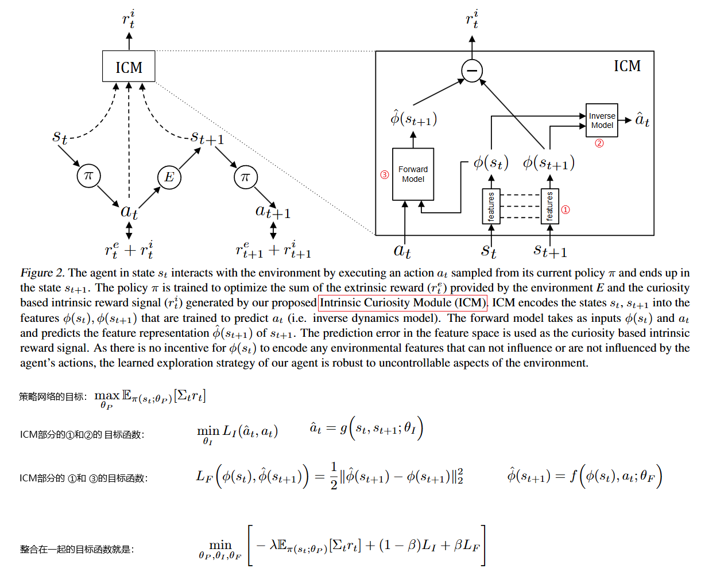
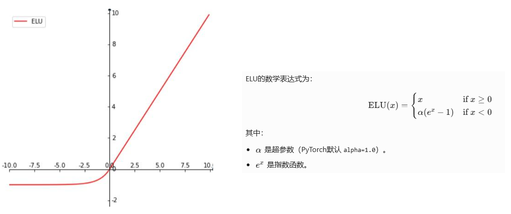
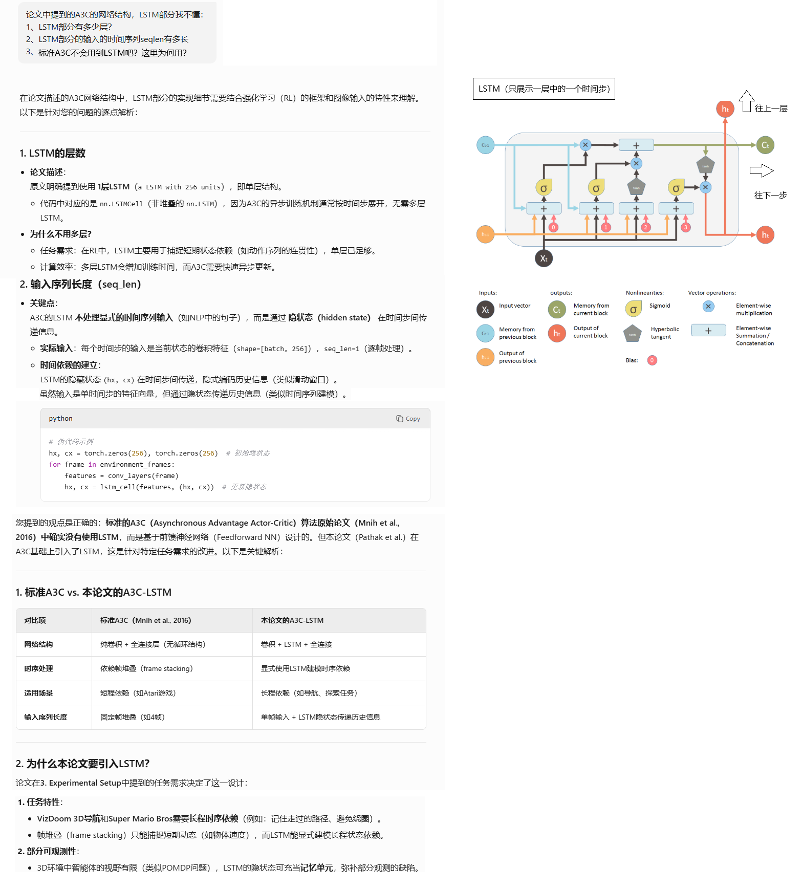
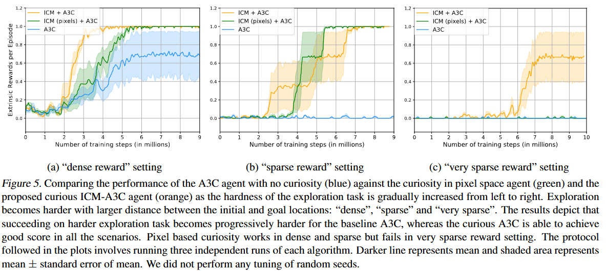
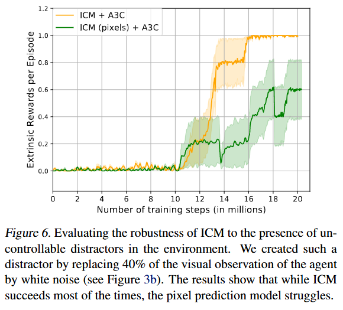
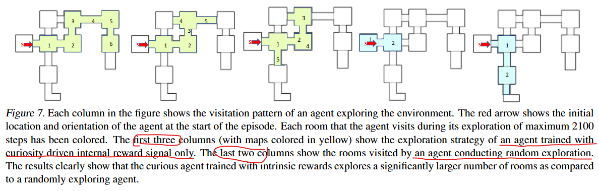

**Curiosity-driven Exploration by Self-supervised Prediction**

### Introduction

还是怎么解决奖励稀疏问题的老生常谈。

本论文提出一种类似RND的使用额外的深度神经网络 产生 内部奖励的方法，命名为 Intrinsic Curiosity Module (ICM)。

相比类似的方法，它有额外的优势：

1. As there is no incentive for this feature space to encode any environmental features that are not influenced by the agent’s actions, our agent will receive no rewards for reaching environmental states that are inherently unpredictable and its exploration strategy will be robust to the presence of distractor objects, changes in illumination, or other nuisance sources of variation in the environment.
2. Even in the absence of any extrinsic rewards, a curious agent learns good exploration policies.
3. the proposed method enables an agent to learn generalizable skills even in the absence of an explicit goal: the exploration policy learned in the first level of Mario helps the agent explore subsequent levels faster.

第一点比较费解，AI解释：

- 逆模型的训练目标仅仅是**准确预测动作**，因此它只会关注那些**与动作因果关联的状态变化**。
- 如果环境中的某些变化（如树叶摇动、光照变化）与Agent的动作无关，逆模型会**忽略这些变化**，不会将它们编码到 *ϕ*(*s*) 中。

### Curiosity-Driven Exploration

#### 算法原理

终于遇到一篇论文践行了“一图胜千言”的方法论：



#### 直观理解

RND作为一种内部激励的产生方式，从直觉上好理解：目标神经网络和预测神经网络的输出的差作为内部激励，由于目标网络是冻结参数的，而预测网络是会以目标网络的输出作为label来学习的，所以对于出现过的state，他们的预测会很接近，对于没有出现过的state，他们的预测会有差距。所以差距的大小会体现state的新奇程度。


ICM通过**预测环境动态的变化**来生成内在奖励，其核心是：

- **只关注与Agent动作相关的环境变化**，忽略无关因素（如风吹树叶、光照变化等）。
- 通过两个子模型实现：
  - **逆动力学模型（Inverse Model）**：学习从状态变化中反推动作（即“当前状态 + 下一状态 → 动作”）。
  - **前向动力学模型（Forward Model）**：预测下一状态的特征（即“当前状态 + 动作 → 预测下一状态”）。

**内在奖励**定义为前向模型的预测误差（预测状态与实际状态的差异）。误差越大，说明当前状态-动作对越“新奇”。


两者的直觉差异：

- **RND的直觉**：“没见过的东西就是新奇的。”
- **ICM的直觉**：“我无法预测我的动作会带来什么后果，所以我要探索。”
  → 更注重​**​动作的因果效应​**​，而非单纯的状态新奇性。


ICM适合需要**学习环境动态**的任务（如导航、交互），而RND更适合**覆盖未知状态空间**的任务（如开放世界探索）。两者本质都是“用预测误差驱动探索”，但ICM通过逆模型实现了更精准的因果关联。

#### 技术细节

Q：

ICM机制中，前向网络逆向网络特征提取网络，他们用来训练的样本就是state, next_state, action这样的三元组，ICM本身的学习是on-policy 还是off-policy呢？ 就是说环境reset开始一个新的轨迹的时候，历史上的轨迹还能否用来训练ICM？ 

A：

从论文的原文：“The learned function g is also known as the inverse dynamics model and the tuple (st, at, st+1) required to learn g is obtained while the agent interacts with the environment using its current policy π(s)” 看，是On-Policy的，也就是只用最新收集到的轨迹数据来训练ICM的深度网络。其实也好理解，毕竟ICM的逆向网络的动作是要和策略网络输出的动作做差来作为损失函数的。

官方源代码太难看了，看不懂，所以无从找到证据。


### Expertimental Setup

#### 环境

用的是VizDoom，也是一个DRL模拟环境。[详细文档在这里](https://vizdoom.farama.org/)

API大概是这样的风格：

```python
import vizdoom as vzd
game = vzd.DoomGame()
game.load_config(os.path.join(vzd.scenarios_path, "deadly_corridor.cfg"))
game.init()
for _ in range(1000):
   state = game.get_state()
   action = policy(state)  # this is where you would insert your policy
   reward = game.make_action(action)

   if game.is_episode_finished():
      game.new_episode()

game.close()
```

#### 网络结构

超参数：

```python
import torch
import torch.nn as nn
import torch.optim as optim
from torch.distributions import Categorical

# 全局超参数（来自论文Section 3）
class Config:
    # 输入预处理
    INPUT_SIZE = (42, 42)          # 输入图像resize尺寸
    INPUT_CHANNELS = 4             # 堆叠的帧数（当前帧 + 过去3帧）
    ACTION_REPEAT = 4              # VizDoom的动作重复次数
    GRAYSCALE = True               # 是否转为灰度图

    # A3C网络参数
    A3C_CONV_FILTERS = [32, 32, 32, 32]  # 4层卷积的滤波器数
    A3C_CONV_KERNEL = 3           # 卷积核大小
    A3C_CONV_STRIDE = 2           # 卷积步长
    A3C_CONV_PADDING = 1          # 卷积padding
    A3C_LSTM_UNITS = 256           # LSTM隐藏单元数

    # ICM网络参数
    ICM_FEATURE_DIM = 288          # 逆模型输出的特征维度
    ICM_FORWARD_FC_UNITS = 256    # 前向模型的FC层单元数
    ICM_INVERSE_FC_UNITS = 256    # 逆模型的FC层单元数
    ICM_BETA = 0.2                 # 前向/逆模型损失权重（Equation 7）
    ICM_LAMBDA = 0.1               # 策略梯度与ICM损失的权重（Equation 7）
    ICM_ETA = 1.0                  # 内在奖励缩放因子（Equation 6）

    # 训练参数
    LR = 1e-3                      # 学习率（ADAM优化器）
    GAMMA = 0.99                   # 奖励折扣因子
    ENTROPY_BETA = 0.01           # 熵正则化系数
```

RL部分是带LSTM的A3C架构

```python
class A3CNetwork(nn.Module):
    def __init__(self, num_actions):
        super(A3CNetwork, self).__init__()
        # 卷积层（4层，参数来自论文）
        self.conv = nn.Sequential(
            nn.Conv2d(Config.INPUT_CHANNELS, Config.A3C_CONV_FILTERS[0], 
                      kernel_size=Config.A3C_CONV_KERNEL, 
                      stride=Config.A3C_CONV_STRIDE, 
                      padding=Config.A3C_CONV_PADDING),
            nn.ELU(),
            nn.Conv2d(Config.A3C_CONV_FILTERS[0], Config.A3C_CONV_FILTERS[1], 
                      kernel_size=Config.A3C_CONV_KERNEL, 
                      stride=Config.A3C_CONV_STRIDE, 
                      padding=Config.A3C_CONV_PADDING),
            nn.ELU(),
            nn.Conv2d(Config.A3C_CONV_FILTERS[1], Config.A3C_CONV_FILTERS[2], 
                      kernel_size=Config.A3C_CONV_KERNEL, 
                      stride=Config.A3C_CONV_STRIDE, 
                      padding=Config.A3C_CONV_PADDING),
            nn.ELU(),
            nn.Conv2d(Config.A3C_CONV_FILTERS[2], Config.A3C_CONV_FILTERS[3], 
                      kernel_size=Config.A3C_CONV_KERNEL, 
                      stride=Config.A3C_CONV_STRIDE, 
                      padding=Config.A3C_CONV_PADDING),
            nn.ELU()
        )

        # LSTM层（256单元）
        self.lstm = nn.LSTMCell(Config.A3C_CONV_FILTERS[-1] * 6 * 6, Config.A3C_LSTM_UNITS)  # 6x6是卷积后的空间尺寸

        # 策略头（Actor）
        self.actor = nn.Linear(Config.A3C_LSTM_UNITS, num_actions)

        # 值函数头（Critic）
        self.critic = nn.Linear(Config.A3C_LSTM_UNITS, 1)

    def forward(self, x, hx, cx):
        # 输入x: [batch_size, 4, 42, 42]
        x = self.conv(x)
        x = x.view(x.size(0), -1)  # Flatten
        hx, cx = self.lstm(x, (hx, cx))
        action_probs = torch.softmax(self.actor(hx), dim=-1)
        value = self.critic(hx)
        return action_probs, value, hx, cx
```

ICM部分:

```python
class ICM(nn.Module):
    def __init__(self, num_actions):
        super(ICM, self).__init__()
        # 共享的特征编码器（4层卷积，与A3C相同但独立）
        self.feature_encoder = nn.Sequential(
            nn.Conv2d(Config.INPUT_CHANNELS, 32, kernel_size=3, stride=2, padding=1),
            nn.ELU(),
            nn.Conv2d(32, 32, kernel_size=3, stride=2, padding=1),
            nn.ELU(),
            nn.Conv2d(32, 32, kernel_size=3, stride=2, padding=1),
            nn.ELU(),
            nn.Conv2d(32, 32, kernel_size=3, stride=2, padding=1),
            nn.ELU()
        )

        # 逆模型（动作预测）
        self.inverse_model = nn.Sequential(
            nn.Linear(Config.ICM_FEATURE_DIM * 2, Config.ICM_INVERSE_FC_UNITS),
            nn.ELU(),
            nn.Linear(Config.ICM_INVERSE_FC_UNITS, num_actions)
        )

        # 前向模型（状态预测）
        self.forward_model = nn.Sequential(
            nn.Linear(Config.ICM_FEATURE_DIM + num_actions, Config.ICM_FORWARD_FC_UNITS),
            nn.ELU(),
            nn.Linear(Config.ICM_FORWARD_FC_UNITS, Config.ICM_FEATURE_DIM)
        )

    def forward(self, state, next_state, action):
        # 编码状态特征
        phi_state = self.feature_encoder(state)
        phi_state = phi_state.view(phi_state.size(0), -1)  # [batch, 288]
        phi_next_state = self.feature_encoder(next_state)
        phi_next_state = phi_next_state.view(phi_next_state.size(0), -1)

        # 逆模型损失
        inverse_input = torch.cat([phi_state, phi_next_state], dim=1)
        pred_action = self.inverse_model(inverse_input)
        inverse_loss = nn.CrossEntropyLoss()(pred_action, action)

        # 前向模型损失
        forward_input = torch.cat([phi_state, action], dim=1)
        pred_phi_next_state = self.forward_model(forward_input)
        forward_loss = 0.5 * (pred_phi_next_state - phi_next_state.detach()).pow(2).mean()

        # 内在奖励（特征空间的预测误差）
        intrinsic_reward = Config.ICM_ETA * 0.5 * (pred_phi_next_state - phi_next_state).pow(2).mean(dim=1)

        return intrinsic_reward, inverse_loss, forward_loss
```

优化器：

```python
def build_optimizers(a3c_net, icm_net):
    # A3C优化器（策略梯度 + 值函数损失）
    a3c_optimizer = optim.Adam(a3c_net.parameters(), lr=Config.LR)

    # ICM优化器（前向 + 逆模型损失）
    icm_optimizer = optim.Adam(icm_net.parameters(), lr=Config.LR)

    return a3c_optimizer, icm_optimizer
```

#### ELU激活函数

我是第一次接触到ELU激活函数：



#### LSTM的使用



#### Baseline方法

实验对比三者：

1. ICM + A3C：完整的ICM实现和A3C
2. A3C：普通的A3C，不带内部激励机制
3. ICM-pixels + A3C：ICM只使用forward网络，不使用逆向网络

### Experiments

#### 不同奖励密度程度下的表现



#### 对干扰因素的鲁棒性



#### 无奖励场景

A good exploration policy is one which allows the agent to visit as many states as possible even without any goals.In
the case of 3-D navigation, we expect a good exploration policy to cover as much of the map as possible; in the case of playing a game, we expect it to visit as many game states as possible. 



论文还提到：超级马里奥游戏里，完全没有外部奖励的情况下，agent只用ICM学会了杀敌，因为不杀敌会死，从而不能看到很多状态。

#### 泛化能力

### Related Work

列举了业界各种Curiosity-Driven Exploration的工作

### Conclusion

未来研究的一个有趣方向是将学习到的探索行为/技能作为更复杂、分层系统中的运动原始/低级策略。例如，我们的VizDoom代理学会沿着走廊行走，而不是撞到墙上。这可能是导航系统的有用基础。

### bison的实验

github上的有关ICM的开源实现：

```
# 官方实现
https://github.com/pathak22/noreward-rl

https://github.com/RLE-Foundation/RLeXplore

https://github.com/chagmgang/pytorch_ppo_rl
```


我希望ICM以插件的方式，能够很方便的跟SB3的SAC等算法的训练结合起来，我想到的几个方法

1. 把ICM封装成一个Env Wrapper，在step()的时候对ICM网络进行训练、并返回叠加了inner reward。缺点是本属于策略的代码侵入了环境的代码，而且若SB3启用`VecEnv`，需确保ICM模型的线程安全（如共享模型+锁机制）
2. 通过SB3的训练回调，应该不可行，毕竟不能影响训练的reward值，除非通过外部存储系统交换信息，这样不太优雅
3. 自定义Policy，也就是将ICM作为策略的一部分，通过重写`predict()`和`learn()`方法集成。适合与SAC等既有策略共享特征提取层
4. 直接继承Gym的Env类，定制化修改环境的reward，插入自己的ICM结构和训练过程，也是一个方案。但它类似1，在VecEnv下怎么搞？是一个环境一套ICM，还是要共用一套

#### 疯狂的赛车

修改环境的代码，把ICM机制嵌入进去：

```python
import datetime
import random
import time


import pybullet as p
import pybullet_data
import gymnasium as gym
import numpy as np
from gymnasium import spaces
from torch.utils.tensorboard import SummaryWriter
import math
import imageio
import torch
import torch.nn as nn
import torch.nn.functional as F
import torch.optim as optim
from torch.distributions import Categorical

# 全局超参数（来自论文Section 3）
class Config:
    # 输入预处理
    INPUT_SIZE = (42, 42)          # 输入图像resize尺寸
    INPUT_CHANNELS = 4             # 堆叠的帧数（当前帧 + 过去3帧）
    ACTION_REPEAT = 4              # VizDoom的动作重复次数
    GRAYSCALE = True               # 是否转为灰度图

    # A3C网络参数
    A3C_CONV_FILTERS = [32, 32, 32, 32]  # 4层卷积的滤波器数
    A3C_CONV_KERNEL = 3           # 卷积核大小
    A3C_CONV_STRIDE = 2           # 卷积步长
    A3C_CONV_PADDING = 1          # 卷积padding
    A3C_LSTM_UNITS = 256           # LSTM隐藏单元数

    # ICM网络参数
    ICM_FEATURE_DIM = 288          # 逆模型输出的特征维度
    ICM_FEATURE_FC_UNITS = 256      # 特征提取网络的FC单元数
    ICM_FORWARD_FC_UNITS = 256    # 前向模型的FC层单元数
    ICM_INVERSE_FC_UNITS = 256    # 逆模型的FC层单元数
    ICM_BETA = 0.2                 # 前向/逆模型损失权重（Equation 7）
    ICM_LAMBDA = 0.1               # 策略梯度与ICM损失的权重（Equation 7）
    ICM_ETA = 1.0                  # 内在奖励缩放因子（Equation 6）

    # 训练参数
    LR = 1e-3                      # 学习率（ADAM优化器）
    GAMMA = 0.99                   # 奖励折扣因子
    ENTROPY_BETA = 0.01           # 熵正则化系数

class InverseModel(nn.Module):
    def __init__(self):
        super(InverseModel, self).__init__()
        self.inverse_model = nn.Sequential(
            nn.Linear(Config.ICM_FEATURE_DIM * 2, Config.ICM_INVERSE_FC_UNITS),
            nn.ELU(),
            nn.Linear(Config.ICM_INVERSE_FC_UNITS, 2)
        )
    def forward(self, x):
        x = self.inverse_model(x)
        # 输出一个确定的动作，包括两个维度
        action1 = F.tanh(x[:, 0])
        action2 = F.sigmoid(x[:,1])
        return torch.cat([action1, action2], dim=1)


class ICM(nn.Module):
    def __init__(self):
        super(ICM, self).__init__()
        # 共享的特征编码器（4层卷积，与A3C相同但独立）
        self.feature_encoder = nn.Sequential(
            nn.Linear(9, Config.ICM_FEATURE_FC_UNITS),
            nn.ELU(),
            nn.Linear(Config.ICM_FEATURE_FC_UNITS, Config.ICM_FEATURE_DIM),
            nn.ELU()
        )

        # 逆模型（动作预测）
        self.inverse_model = InverseModel()

        # 前向模型（状态预测）
        self.forward_model = nn.Sequential(
            nn.Linear(Config.ICM_FEATURE_DIM + 2, Config.ICM_FORWARD_FC_UNITS),
            nn.ELU(),
            nn.Linear(Config.ICM_FORWARD_FC_UNITS, Config.ICM_FEATURE_DIM)
        )

    def forward(self, state, next_state, action):
        # 编码状态特征
        phi_state = self.feature_encoder(state)
        phi_state = phi_state.view(phi_state.size(0), -1)  # [batch, 288]
        phi_next_state = self.feature_encoder(next_state)
        phi_next_state = phi_next_state.view(phi_next_state.size(0), -1)

        # 逆模型损失
        inverse_input = torch.cat([phi_state, phi_next_state], dim=1)
        pred_action = self.inverse_model(inverse_input)
        inverse_loss = nn.CrossEntropyLoss()(pred_action, action)

        # 前向模型损失
        forward_input = torch.cat([phi_state, action], dim=1)
        pred_phi_next_state = self.forward_model(forward_input)
        forward_loss = 0.5 * (pred_phi_next_state - phi_next_state.detach()).pow(2).mean()

        # 内在奖励（特征空间的预测误差）
        intrinsic_reward = Config.ICM_ETA * 0.5 * (pred_phi_next_state - phi_next_state).pow(2).mean(dim=1)

        return intrinsic_reward, inverse_loss, forward_loss


class RaceCarEnv(gym.Env):
    """
    赛车强化学习环境，基于PyBullet和PyTorch实现
    环境特点：
    - 包含一个封闭赛道，有墙壁边界
    - 赛车需要从起点到终点，避免撞墙
    - 奖励设计：撞墙惩罚-1，移动距离负奖励，到达终点+3
    - 状态空间：车辆位置
    - 动作空间：转向和油门控制
    """

    def __init__(self, writer:SummaryWriter, render=False,fps=100):
        """
        初始化环境
        Args:
            render (bool): 是否开启GUI渲染
        """
        super(RaceCarEnv, self).__init__()
        self.writer = writer
        self.icm = ICM()
        self.buffer = []
        self.adm = torch.optim.Adam(self.icm.parameters(), lr=1e-4)

        # 连接物理引擎
        if render:
            self.physicsClient = p.connect(p.GUI)
        else:
            self.physicsClient = p.connect(p.DIRECT)

        # 设置搜索路径
        p.setAdditionalSearchPath(pybullet_data.getDataPath())
        self.fps = 100
        p.setTimeStep(1/self.fps, physicsClientId=self.physicsClient)
        p.setRealTimeSimulation(0, physicsClientId=self.physicsClient)

        # 定义动作空间和状态空间
        self.action_space = spaces.Box(
            low=np.array([-1, 0]),  # 转向, 油门
            high=np.array([1, 1]),
            dtype=np.float32
        )

        self.observation_space = spaces.Box(
            low=np.array([-np.inf, -np.inf, -np.inf, -np.inf, -np.pi, -np.pi, -np.pi, -np.inf, -np.inf]),
            high=np.array([np.inf, np.inf, np.inf, np.inf, np.pi,   np.pi, np.pi, np.inf, np.inf]),
            dtype=np.float32
        )

        # 环境参数
        self.max_steps = 10_000  # 最大步数
        self.current_step = 0 #每一回合里的步数计数器
        self.total_step = 0  #环境运行过程中一直累加的计数器
        self.car = None
        self.walls = []
        self.finish_line = None
        self.start_pos = [0.5, 0.5,0.1]  # 起点位置
        self.finish_pos = [14.5, 7.5, 0.1]  # 终点位置
        self.last_pos = None  # 上一步的位置
        self.recordVedio = False
        self.frames = []
        self.prev_state = None

        self.coins = [] #中途奖励的金币
        # 重置环境
        self.reset()

    def _create_track(self):
        """创建封闭的S型赛道"""
        p.resetSimulation()
        p.setGravity(0, 0, -10)

        # 加载地面和赛车
        p.loadURDF("plane.urdf")
        self.car = p.loadURDF("racecar/racecar.urdf", self.start_pos)

        if self.total_step == 3:
            for j in range(p.getNumJoints(self.car)):
                info = p.getJointInfo(self.car, j)
                print(f"Joint {j}: Name={info[1]}, Type={info[2]}, range:{info[8]} to {info[9]}")

        self._add_wall(0,0, 2,0)
        self._add_wall(0, 0, 0, 4)
        self._add_wall(2, 0, 2, 2)
        self._add_wall(0,4, 8,4)
        self._add_wall(2, 2, 10, 2)
        self._add_wall(10, 2, 10, 6)
        self._add_wall(10,6, 15,6)

        self._add_wall(8, 4, 8, 8)
        self._add_wall(8, 8, 15, 8)
        self._add_wall(15, 6, 15, 8)

        #赛道中间还有金币，鼓励探索
        self.coins.append([3 ,3])
        self.coins.append([9, 5])
        self.coins.append([11, 7])

    def _add_wall(self, startx, starty, endx, endy):
        """
        在(startx,starty)到(endx,endy)之间创建一堵物理墙
        参数:
            startx, starty: 起点坐标 (x,y)
            endx, endy: 终点坐标 (x,y)
        返回:
            wall_id: 创建的墙体ID
        """
        # 墙体参数
        thickness = 0.3  # 厚度0.3米
        height = 0.5  # 高度0.5米
        mass = 100  # 质量100kg

        # 计算墙体中心位置和长度
        center_x = (startx + endx) / 2
        center_y = (starty + endy) / 2
        length = math.sqrt((endx - startx) ** 2 + (endy - starty) ** 2)

        # 计算墙体朝向角度（弧度）
        angle = math.atan2(endy - starty, endx - startx)

        # 创建碰撞形状（长方体）
        wall_collision = p.createCollisionShape(
            p.GEOM_BOX,
            halfExtents=[length / 2, thickness / 2, height / 2]
        )

        # 创建视觉形状（灰色半透明）
        wall_visual = p.createVisualShape(
            p.GEOM_BOX,
            halfExtents=[length / 2, thickness / 2, height / 2],
            rgbaColor=[0.5, 0.5, 0.5, 0.8]
        )

        # 创建墙体刚体
        wall_id = p.createMultiBody(
            baseMass=mass,
            baseCollisionShapeIndex=wall_collision,
            baseVisualShapeIndex=wall_visual,
            basePosition=[center_x, center_y, height / 2],
            baseOrientation=p.getQuaternionFromEuler([0, 0, angle])
        )

        # 设置物理参数（静态墙体）
        p.changeDynamics(
            wall_id,
            -1,
            lateralFriction=1.0,
            restitution=0.7,
            linearDamping=0.5,
            angularDamping=0.5
        )
        self.walls.append(wall_id)

        return wall_id

    def _train_icm(self):
        batchsz = 64
        sample_num = len(self.buffer)
        random_indices = random.sample(range(sample_num), sample_num)  # 生成不重复的随机序列
        for i in range(0, sample_num, batchsz):
            start = i
            end = min(i+batchsz, sample_num)
            batch_idx = random_indices[start:end]
            batch = self.buffer[batch_idx]
            # 拆分三元组
            states, next_states, actions = zip(*batch)

            # 转换为NumPy数组（可选）
            states = np.stack(states)  # shape: (B, 9)
            next_states = np.stack(next_states)  # shape: (B, 9)
            actions = np.stack(actions)  # shape: (B, 1)

            states_tensor = torch.FloatTensor(states)
            next_states_tensor = torch.FloatTensor(next_states)
            actions_tensor = torch.FloatTensor(actions)

            intrinsic_reward, inverse_loss, forward_loss = self.icm.forward(states_tensor, next_states_tensor, actions_tensor)
            self.writer.add_scalar("steps/inverse_loss", inverse_loss.mean(), self.total_step)
            self.writer.add_scalar("steps/forward_loss", forward_loss.mean(), self.total_step)
            loss = (Config.ICM_BETA * inverse_loss + (1-Config.ICM_BETA) * forward_loss).mean()
            self.adm.zero_grad()
            loss.backward()
            self.adm.step()

    def _calc_inner_reward(self, state, next_state, action):
        state_tensor = torch.FloatTensor(state).unsqueeze(0)
        next_state_tensor = torch.FloatTensor(next_state).unsqueeze(0)
        action_tensor = torch.FloatTensor(action).unsqueeze(0)
        with torch.no_grad():
            intrinsic_reward, inverse_loss, forward_loss = self.icm.forward(state_tensor, next_state_tensor, action_tensor)
        return intrinsic_reward

    def reset(self, seed=None):
        """重置环境到初始状态"""
        p.resetSimulation()
        self._create_track()

        # 重置赛车位置和速度
        p.resetBasePositionAndOrientation(
            self.car,
            self.start_pos,
            p.getQuaternionFromEuler([0, 0, math.pi/2])
        )
        p.resetBaseVelocity(
            self.car,
            linearVelocity=[0, 0, 0],
            angularVelocity=[0, 0, 0]
        )

        self.current_step = 0
        self.last_pos = np.array(self.start_pos[:2])  # 只记录x,y坐标

        #抽样录一个回合视频
        if self.recordVedio and len(self.frames) > 10:
            imageio.mimsave(f"./racecar_{datetime.datetime.now().strftime('%H%M%S')}.mp4", self.frames, format='FFMPEG', fps=self.fps)
            self.writer.add_scalar("steps/saveMP4", 1, self.total_step)

        self.frames = []
        if random.randint(0, 10) < 1:
            self.recordVedio = True
        else:
            self.recordVedio = False


        if self.buffer:
            self.train_icm()
            self.buffer = []


        # 获取初始状态
        state = self._get_state()
        self.prev_state = state
        return state,{}

    def step(self, action):
        """
        执行一个动作
        Args:
            action: [转向, 油门], 值在[-1, 1]之间
        Returns:
            state: 新状态
            reward: 奖励值
            done: 是否结束
            info: 额外信息
        """
        # 解析动作
        steer = action[0]  # 转向 -1(左)到1(右)
        throttle = action[1]  # 油门 -1(倒车)到1(前进)

        # 设置赛车控制
        self._apply_action(steer, throttle)

        # 步进模拟
        p.stepSimulation()
        self.current_step += 1
        self.total_step += 1

        # 获取新状态
        state = self._get_state()

        # 计算奖励
        reward, done = self._compute_reward(state)
        #记录回合结束的时候的位置
        if done:
            self.writer.add_scalar("steps/pos_x", state[0], self.total_step)
            self.writer.add_scalar("steps/pos_y", state[1], self.total_step)

        # 检查是否超过最大步数
        truncated = False
        if self.current_step >= self.max_steps:
            truncated = True

        if self.recordVedio:
            # 录制视频
            rgb = self._render_camera_frame()
            self.frames.append(rgb)

        inner_reward = self._calc_inner_reward(self.prev_state, state, action)
        reward += inner_reward
        if self.total_step % 100 == 0:
            self.writer.add_scalar("steps/inner_reward", inner_reward, self.total_step)


        info = {
            "steps": self.current_step,
            "position": state,
            "is_success": done and reward > 0
        }

        # 更新最后位置
        self.last_pos = state[:2]


        self.buffer.append( (self.prev_state, state, action))
        self.prev_state = state

        return state, reward, done, truncated, info

    def _apply_action(self, steer, throttle):
        '''
Joint 0: Name=b'base_link_joint', Type=4, range:0.0 to -1.0
Joint 1: Name=b'chassis_inertia_joint', Type=4, range:0.0 to -1.0
Joint 2: Name=b'left_rear_wheel_joint', Type=0, range:0.0 to -1.0
Joint 3: Name=b'right_rear_wheel_joint', Type=0, range:0.0 to -1.0
        Joint 4: Name=b'left_steering_hinge_joint', Type=0, range:-1.0 to 1.0
Joint 5: Name=b'left_front_wheel_joint', Type=0, range:0.0 to -1.0
        Joint 6: Name=b'right_steering_hinge_joint', Type=0, range:-1.0 to 1.0
Joint 7: Name=b'right_front_wheel_joint', Type=0, range:0.0 to -1.0
Joint 8: Name=b'hokuyo_joint', Type=4, range:0.0 to -1.0
Joint 9: Name=b'zed_camera_joint', Type=4, range:0.0 to -1.0
Joint 10: Name=b'zed_camera_left_joint', Type=4, range:0.0 to -1.0
Joint 11: Name=b'zed_camera_right_joint', Type=4, range:0.0 to -1.0

AI说：
若关节名义范围是[0.0, -1.0]（即默认负向旋转），但设置target_vel=2.0（正值）时：
物理引擎会尝试按正向旋转驱动关节。
实际能否达到目标速度取决于max_force和物理约束（如惯性、摩擦等）。
        '''
        """应用控制动作到赛车"""
        # 前轮转向
        steering_angle = steer   # 限制转向角度

        # 设置转向
        p.setJointMotorControl2(
            self.car,
            4,
            p.POSITION_CONTROL,
            targetPosition=-steering_angle
        )
        p.setJointMotorControl2(
            self.car,
            6,
            p.POSITION_CONTROL,
            targetPosition=-steering_angle
        )

        # 设置驱动轮速度
        max_force = 100
        target_vel = throttle * 50  # 控制速度


        for wheel in [2, 3, 5,7]:
            p.setJointMotorControl2(
                self.car,
                wheel,
                p.VELOCITY_CONTROL,
                targetVelocity=target_vel,
                force=max_force
            )

    def _render_camera_frame(self):
        car_pos, _ = p.getBasePositionAndOrientation(self.car)
        x, y = car_pos[0], car_pos[1]

        view_matrix = p.computeViewMatrix(
            cameraEyePosition=[x - 5, y - 5, 5],
            cameraTargetPosition=[x, y, 0],
            cameraUpVector=[0, 0, 1]
        )

        projection_matrix = p.computeProjectionMatrixFOV(
            fov=60,
            aspect=320 / 240,
            nearVal=0.1,
            farVal=100.0
        )

        width, height, rgb, _, _ = p.getCameraImage(
            width=320,
            height=240,
            viewMatrix=view_matrix,
            projectionMatrix=projection_matrix,
            renderer=p.ER_BULLET_HARDWARE_OPENGL
        )

        rgb_array = np.reshape(rgb, (height, width, 4))[:, :, :3].astype(np.uint8)
        return rgb_array

    def _get_state(self):
        """获取当前状态（车辆位置、速度和转向关节状态）"""
        # 1. 获取车辆位置（x,y）
        pos, _ = p.getBasePositionAndOrientation(self.car)
        position = np.array(pos[:2])  # 只取x,y坐标

        # 2. 获取车辆速度（x,y方向）
        linear_vel, _ = p.getBaseVelocity(self.car)
        velocity = np.array(linear_vel[:2])  # 只取x,y方向速度

        # 3 获取小车的朝向：
        pos, orn = p.getBasePositionAndOrientation(self.car)
        euler = p.getEulerFromQuaternion(orn)
        heading = euler[2]

        # 4. 获取转向关节状态（前轮两个关节）
        # 获取转向关节角度（前轮两个关节）
        steering_angle1 = p.getJointState(self.car, 4)[0]  # 第一个转向关节
        steering_angle2 = p.getJointState(self.car, 6)[0]  # 第二个转向关节

        # 获取转向关节角速度
        steering_vel1 = p.getJointState(self.car, 4)[1]  # 第一个转向关节角速度
        steering_vel2 = p.getJointState(self.car, 6)[1]  # 第二个转向关节角速度

        # 合并所有状态信息
        state = np.concatenate([
            position,  # 车辆位置 (x,y)
            velocity,  # 车辆速度 (vx,vy)
            [heading],
            [steering_angle1],  # 第一个转向关节角度
            [steering_angle2],  # 第二个转向关节角度
            [steering_vel1],  # 第一个转向关节角速度
            [steering_vel2]  # 第二个转向关节角速度
        ], dtype=np.float32)

        #抽样打印一下状态信息，以观察值的范围
        if self.total_step > 1000 and self.total_step < 1002:
            print("state sample:", state)

        return state

    def _compute_reward(self, state):
        """计算奖励"""
        # 参考 bipedalwalker的设计，因为 bipedalwalker 这个task能够很好的收敛，所以参考它比较有信心

        done = False
        reward = 0

        # 1. 检查是否撞墙
        contact_points = p.getContactPoints(self.car)
        if contact_points:
            for point in contact_points:
                if point[2] in self.walls:  # 检查是否与墙壁碰撞, point[2]:body unique id of body B
                    reward =  -1 # 撞墙惩罚
                    done = True
                    self.writer.add_scalar("steps/hitWall", 1, self.total_step)
                    return reward, done

        # 2. 检查是否到达终点
        finish_distance = np.linalg.norm(state[:2] - np.array(self.finish_pos[:2]))
        if finish_distance < 1.0:  # 接近终点
            reward = +3  # 到达终点奖励
            done = True
            self.writer.add_scalar("steps/reachGoal", 1, self.total_step)
            return  reward, done

        '''# 3. 检查是否获得金币
        if self.coins:
            for coin in self.coins:
                distance = np.linalg.norm(state[:2] - np.array(coin))
                if distance <  1.0:
                    reward += 0.3
                    self.coins.remove(coin)
                    self.writer.add_scalar("steps/hitCoin", 1, self.total_step)
                    break'''

        # 4. 移动距离奖励 (鼓励远离出发点)
        # 这里的计算不具备普适性，是利用了地图上赛道的特别形状，只适用于特例
        distance_new = np.linalg.norm(state[:2] - np.array([0,0]) )
        distance_prev = np.linalg.norm(self.last_pos - np.array([0, 0]))
        if abs(distance_new - distance_prev) < (5e-3): #不动或者很低速度的移动，处罚
            distance_penalty = -0.1
        else:
            distance_penalty = (distance_new - distance_prev) #鼓励远离出发点
        reward += distance_penalty
        if self.total_step % 100 == 0:
            self.writer.add_scalar("steps/distancePenalty", distance_penalty, self.total_step)

        '''
        # 5. 耗时负奖励（鼓励最快到达终点，时间要短）
        # 60s内到达的话，那么每个step
        time_penalty = -3.0 / (60*self.fps)
        reward += time_penalty
        if self.total_step % 100 == 0:
            self.writer.add_scalar("steps/timePenalty", time_penalty, self.total_step)
        '''

        return reward, done

    def render(self, mode='human'):
        """渲染环境"""
        pass  # PyBullet会自动处理渲染

    def close(self):
        """关闭环境"""
        p.disconnect()

```

