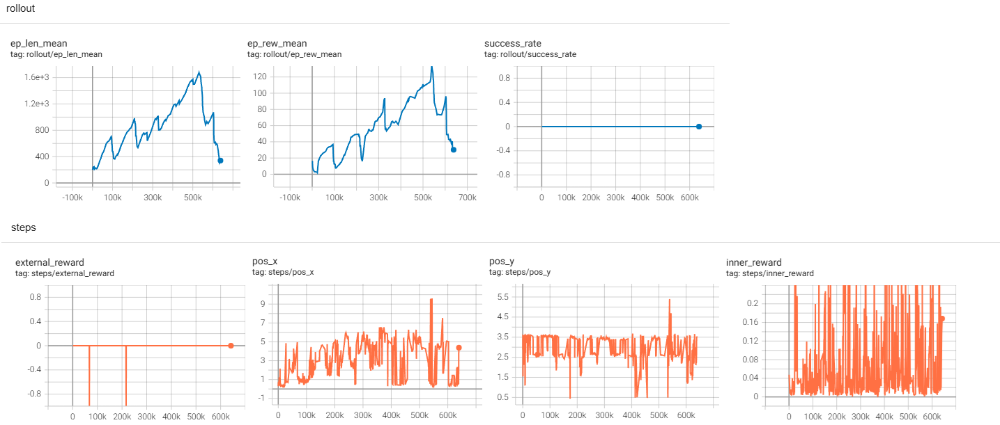
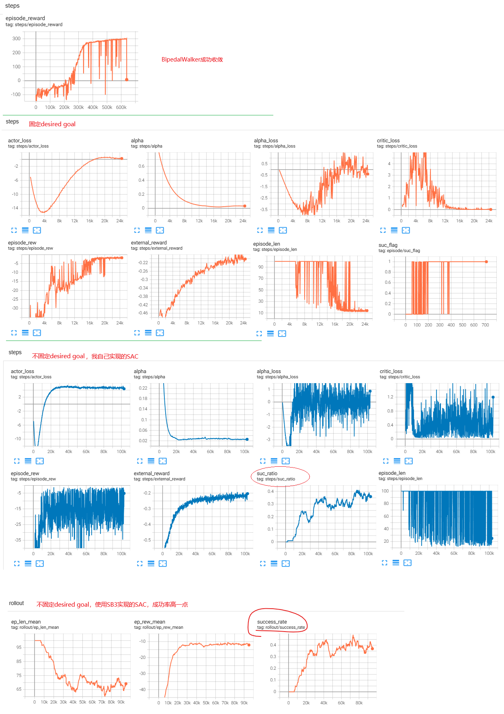
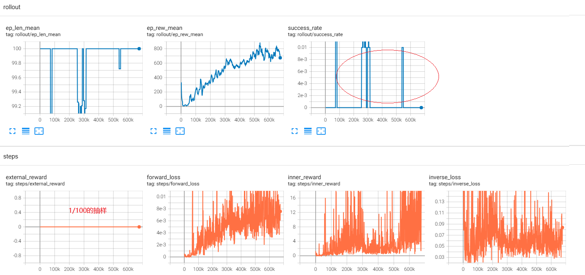
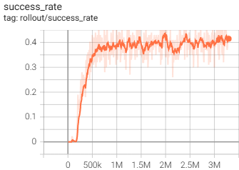

**Curiosity-driven Exploration by Self-supervised Prediction**

### Introduction

还是怎么解决奖励稀疏问题的老生常谈。

本论文提出一种类似RND的使用额外的深度神经网络 产生 内部奖励的方法，命名为 Intrinsic Curiosity Module (ICM)。

相比类似的方法，它有额外的优势：

1. As there is no incentive for this feature space to encode any environmental features that are not influenced by the agent’s actions, our agent will receive no rewards for reaching environmental states that are inherently unpredictable and its exploration strategy will be robust to the presence of distractor objects, changes in illumination, or other nuisance sources of variation in the environment.
2. Even in the absence of any extrinsic rewards, a curious agent learns good exploration policies.
3. the proposed method enables an agent to learn generalizable skills even in the absence of an explicit goal: the exploration policy learned in the first level of Mario helps the agent explore subsequent levels faster.

第一点比较费解，AI解释：

- 逆模型的训练目标仅仅是**准确预测动作**，因此它只会关注那些**与动作因果关联的状态变化**。
- 如果环境中的某些变化（如树叶摇动、光照变化）与Agent的动作无关，逆模型会**忽略这些变化**，不会将它们编码到 *ϕ*(*s*) 中。

### Curiosity-Driven Exploration

#### 算法原理

终于遇到一篇论文践行了“一图胜千言”的方法论：


#### 直观理解

RND作为一种内部激励的产生方式，从直觉上好理解：目标神经网络和预测神经网络的输出的差作为内部激励，由于目标网络是冻结参数的，而预测网络是会以目标网络的输出作为label来学习的，所以对于出现过的state，他们的预测会很接近，对于没有出现过的state，他们的预测会有差距。所以差距的大小会体现state的新奇程度。


ICM通过**预测环境动态的变化**来生成内在奖励，其核心是：

- **只关注与Agent动作相关的环境变化**，忽略无关因素（如风吹树叶、光照变化等）。
- 通过两个子模型实现：
  - **逆动力学模型（Inverse Model）**：学习从状态变化中反推动作（即“当前状态 + 下一状态 → 动作”）。
  - **前向动力学模型（Forward Model）**：预测下一状态的特征（即“当前状态 + 动作 → 预测下一状态”）。

**内在奖励**定义为前向模型的预测误差（预测状态与实际状态的差异）。误差越大，说明当前状态-动作对越“新奇”。


两者的直觉差异：

- **RND的直觉**：“没见过的东西就是新奇的。”
- **ICM的直觉**：“我无法预测我的动作会带来什么后果，所以我要探索。”
  → 更注重​**​动作的因果效应​**​，而非单纯的状态新奇性。


ICM适合需要**学习环境动态**的任务（如导航、交互），而RND更适合**覆盖未知状态空间**的任务（如开放世界探索）。两者本质都是“用预测误差驱动探索”，但ICM通过逆模型实现了更精准的因果关联。

#### 技术细节

Q：

ICM机制中，前向网络逆向网络特征提取网络，他们用来训练的样本就是state, next_state, action这样的三元组，ICM本身的学习是on-policy 还是off-policy呢？ 就是说环境reset开始一个新的轨迹的时候，历史上的轨迹还能否用来训练ICM？ 

A：

从论文的原文：“The learned function g is also known as the inverse dynamics model and the tuple (st, at, st+1) required to learn g is obtained while the agent interacts with the environment using its current policy π(s)” 看，是On-Policy的，也就是只用最新收集到的轨迹数据来训练ICM的深度网络。其实也好理解，毕竟ICM的逆向网络的动作是要和策略网络输出的动作做差来作为损失函数的。

官方源代码太难看了，看不懂，所以无从找到证据。


### Expertimental Setup

#### 环境

用的是VizDoom，也是一个DRL模拟环境。[详细文档在这里](https://vizdoom.farama.org/)

API大概是这样的风格：

```python
import vizdoom as vzd
game = vzd.DoomGame()
game.load_config(os.path.join(vzd.scenarios_path, "deadly_corridor.cfg"))
game.init()
for _ in range(1000):
   state = game.get_state()
   action = policy(state)  # this is where you would insert your policy
   reward = game.make_action(action)

   if game.is_episode_finished():
      game.new_episode()

game.close()
```

#### 网络结构

超参数：

```python
import torch
import torch.nn as nn
import torch.optim as optim
from torch.distributions import Categorical

# 全局超参数（来自论文Section 3）
class Config:
    # 输入预处理
    INPUT_SIZE = (42, 42)          # 输入图像resize尺寸
    INPUT_CHANNELS = 4             # 堆叠的帧数（当前帧 + 过去3帧）
    ACTION_REPEAT = 4              # VizDoom的动作重复次数
    GRAYSCALE = True               # 是否转为灰度图

    # A3C网络参数
    A3C_CONV_FILTERS = [32, 32, 32, 32]  # 4层卷积的滤波器数
    A3C_CONV_KERNEL = 3           # 卷积核大小
    A3C_CONV_STRIDE = 2           # 卷积步长
    A3C_CONV_PADDING = 1          # 卷积padding
    A3C_LSTM_UNITS = 256           # LSTM隐藏单元数

    # ICM网络参数
    ICM_FEATURE_DIM = 288          # 逆模型输出的特征维度
    ICM_FORWARD_FC_UNITS = 256    # 前向模型的FC层单元数
    ICM_INVERSE_FC_UNITS = 256    # 逆模型的FC层单元数
    ICM_BETA = 0.2                 # 前向/逆模型损失权重（Equation 7）
    ICM_LAMBDA = 0.1               # 策略梯度与ICM损失的权重（Equation 7）
    ICM_ETA = 1.0                  # 内在奖励缩放因子（Equation 6）

    # 训练参数
    LR = 1e-3                      # 学习率（ADAM优化器）
    GAMMA = 0.99                   # 奖励折扣因子
    ENTROPY_BETA = 0.01           # 熵正则化系数
```

RL部分是带LSTM的A3C架构

```python
class A3CNetwork(nn.Module):
    def __init__(self, num_actions):
        super(A3CNetwork, self).__init__()
        # 卷积层（4层，参数来自论文）
        self.conv = nn.Sequential(
            nn.Conv2d(Config.INPUT_CHANNELS, Config.A3C_CONV_FILTERS[0], 
                      kernel_size=Config.A3C_CONV_KERNEL, 
                      stride=Config.A3C_CONV_STRIDE, 
                      padding=Config.A3C_CONV_PADDING),
            nn.ELU(),
            nn.Conv2d(Config.A3C_CONV_FILTERS[0], Config.A3C_CONV_FILTERS[1], 
                      kernel_size=Config.A3C_CONV_KERNEL, 
                      stride=Config.A3C_CONV_STRIDE, 
                      padding=Config.A3C_CONV_PADDING),
            nn.ELU(),
            nn.Conv2d(Config.A3C_CONV_FILTERS[1], Config.A3C_CONV_FILTERS[2], 
                      kernel_size=Config.A3C_CONV_KERNEL, 
                      stride=Config.A3C_CONV_STRIDE, 
                      padding=Config.A3C_CONV_PADDING),
            nn.ELU(),
            nn.Conv2d(Config.A3C_CONV_FILTERS[2], Config.A3C_CONV_FILTERS[3], 
                      kernel_size=Config.A3C_CONV_KERNEL, 
                      stride=Config.A3C_CONV_STRIDE, 
                      padding=Config.A3C_CONV_PADDING),
            nn.ELU()
        )

        # LSTM层（256单元）
        self.lstm = nn.LSTMCell(Config.A3C_CONV_FILTERS[-1] * 6 * 6, Config.A3C_LSTM_UNITS)  # 6x6是卷积后的空间尺寸

        # 策略头（Actor）
        self.actor = nn.Linear(Config.A3C_LSTM_UNITS, num_actions)

        # 值函数头（Critic）
        self.critic = nn.Linear(Config.A3C_LSTM_UNITS, 1)

    def forward(self, x, hx, cx):
        # 输入x: [batch_size, 4, 42, 42]
        x = self.conv(x)
        x = x.view(x.size(0), -1)  # Flatten
        hx, cx = self.lstm(x, (hx, cx))
        action_probs = torch.softmax(self.actor(hx), dim=-1)
        value = self.critic(hx)
        return action_probs, value, hx, cx
```

ICM部分:

```python
class ICM(nn.Module):
    def __init__(self, num_actions):
        super(ICM, self).__init__()
        # 共享的特征编码器（4层卷积，与A3C相同但独立）
        self.feature_encoder = nn.Sequential(
            nn.Conv2d(Config.INPUT_CHANNELS, 32, kernel_size=3, stride=2, padding=1),
            nn.ELU(),
            nn.Conv2d(32, 32, kernel_size=3, stride=2, padding=1),
            nn.ELU(),
            nn.Conv2d(32, 32, kernel_size=3, stride=2, padding=1),
            nn.ELU(),
            nn.Conv2d(32, 32, kernel_size=3, stride=2, padding=1),
            nn.ELU()
        )

        # 逆模型（动作预测）
        self.inverse_model = nn.Sequential(
            nn.Linear(Config.ICM_FEATURE_DIM * 2, Config.ICM_INVERSE_FC_UNITS),
            nn.ELU(),
            nn.Linear(Config.ICM_INVERSE_FC_UNITS, num_actions)
        )

        # 前向模型（状态预测）
        self.forward_model = nn.Sequential(
            nn.Linear(Config.ICM_FEATURE_DIM + num_actions, Config.ICM_FORWARD_FC_UNITS),
            nn.ELU(),
            nn.Linear(Config.ICM_FORWARD_FC_UNITS, Config.ICM_FEATURE_DIM)
        )

    def forward(self, state, next_state, action):
        # 编码状态特征
        phi_state = self.feature_encoder(state)
        phi_state = phi_state.view(phi_state.size(0), -1)  # [batch, 288]
        phi_next_state = self.feature_encoder(next_state)
        phi_next_state = phi_next_state.view(phi_next_state.size(0), -1)

        # 逆模型损失
        inverse_input = torch.cat([phi_state, phi_next_state], dim=1)
        pred_action = self.inverse_model(inverse_input)
        inverse_loss = nn.CrossEntropyLoss()(pred_action, action)

        # 前向模型损失
        forward_input = torch.cat([phi_state, action], dim=1)
        pred_phi_next_state = self.forward_model(forward_input)
        forward_loss = 0.5 * (pred_phi_next_state - phi_next_state.detach()).pow(2).mean()

        # 内在奖励（特征空间的预测误差）
        intrinsic_reward = Config.ICM_ETA * 0.5 * (pred_phi_next_state - phi_next_state).pow(2).mean(dim=1)

        return intrinsic_reward, inverse_loss, forward_loss
```

优化器：

```python
def build_optimizers(a3c_net, icm_net):
    # A3C优化器（策略梯度 + 值函数损失）
    a3c_optimizer = optim.Adam(a3c_net.parameters(), lr=Config.LR)

    # ICM优化器（前向 + 逆模型损失）
    icm_optimizer = optim.Adam(icm_net.parameters(), lr=Config.LR)

    return a3c_optimizer, icm_optimizer
```

#### ELU激活函数

我是第一次接触到ELU激活函数：


#### LSTM的使用


#### Baseline方法

实验对比三者：

1. ICM + A3C：完整的ICM实现和A3C
2. A3C：普通的A3C，不带内部激励机制
3. ICM-pixels + A3C：ICM只使用forward网络，不使用逆向网络

### Experiments

#### 不同奖励密度程度下的表现


#### 对干扰因素的鲁棒性


#### 无奖励场景

A good exploration policy is one which allows the agent to visit as many states as possible even without any goals.In
the case of 3-D navigation, we expect a good exploration policy to cover as much of the map as possible; in the case of playing a game, we expect it to visit as many game states as possible. 


论文还提到：超级马里奥游戏里，完全没有外部奖励的情况下，agent只用ICM学会了杀敌，因为不杀敌会死，从而不能看到很多状态。

#### 泛化能力

### Related Work

列举了业界各种Curiosity-Driven Exploration的工作

### Conclusion

未来研究的一个有趣方向是将学习到的探索行为/技能作为更复杂、分层系统中的运动原始/低级策略。例如，我们的VizDoom代理学会沿着走廊行走，而不是撞到墙上。这可能是导航系统的有用基础。

### 内部奖励机制实现汇总

有网友把RND、ICM等内部奖励机制提炼出框架，统一实现了：

```
https://github.com/RLE-Foundation/RLeXplore
# 这个库很多bug，牛屎外面光
```


### bison的实验

github上的有关ICM的开源实现：

```
# 官方实现
https://github.com/pathak22/noreward-rl

https://github.com/RLE-Foundation/RLeXplore

https://github.com/chagmgang/pytorch_ppo_rl
```


我希望ICM以插件的方式，能够很方便的跟SB3的SAC等算法的训练结合起来，我想到的几个方法

1. 把ICM封装成一个Env Wrapper，在step()的时候对ICM网络进行训练、并返回叠加了inner reward。缺点是本属于策略的代码侵入了环境的代码，而且若SB3启用`VecEnv`，需确保ICM模型的线程安全（如共享模型+锁机制）
2. 通过SB3的训练回调，应该不可行，毕竟不能影响训练的reward值，除非通过外部存储系统交换信息，这样不太优雅
3. 自定义Policy，也就是将ICM作为策略的一部分，通过重写`predict()`和`learn()`方法集成。适合与SAC等既有策略共享特征提取层
4. 直接继承Gym的Env类，定制化修改环境的reward，插入自己的ICM结构和训练过程，也是一个方案。但它类似1，在VecEnv下怎么搞？是一个环境一套ICM，还是要共用一套


论文中，ICM搭配了A3C和TRPO（均为on-policy），我下面的实验是ICM搭配SAC算法（off-policy），论文中并未明确指出有什么限制，应该是可以这样做的。


#### 疯狂的赛车 （失败）

在鼓励探索方面有一定的帮助，x方向最远走到过9m，也就是第二个拐弯处，小车会拐入第二段直道。但后来情况似乎变糟糕了。



修改环境的代码，把ICM机制嵌入进去：

```python
import datetime
import random
import time


import pybullet as p
import pybullet_data
import gymnasium as gym
import numpy as np
from gymnasium import spaces
from torch.utils.tensorboard import SummaryWriter
import math
import imageio
import torch
import torch.nn as nn
import torch.nn.functional as F
import torch.optim as optim
from torch.distributions import Categorical

# 全局超参数（来自论文Section 3）
class Config:


    # ICM网络参数
    ICM_FEATURE_DIM = 288          # 逆模型输出的特征维度
    ICM_FEATURE_FC_UNITS = 256      # 特征提取网络的FC单元数
    ICM_FORWARD_FC_UNITS = 256    # 前向模型的FC层单元数
    ICM_INVERSE_FC_UNITS = 256    # 逆模型的FC层单元数
    ICM_BETA = 0.2                 # 前向/逆模型损失权重（Equation 7）
    ICM_LAMBDA = 0.1               # 策略梯度与ICM损失的权重（Equation 7）
    ICM_ETA = 1.0                  # 内在奖励缩放因子（Equation 6）

    # 训练参数
    LR = 1e-3                      # 学习率（ADAM优化器）
    GAMMA = 0.99                   # 奖励折扣因子
    ENTROPY_BETA = 0.01           # 熵正则化系数
    BATCH_SZ = 64

class InverseModel(nn.Module):
    def __init__(self):
        super(InverseModel, self).__init__()
        self.inverse_model = nn.Sequential(
            nn.Linear(Config.ICM_FEATURE_DIM * 2, Config.ICM_INVERSE_FC_UNITS),
            nn.ELU(),
            nn.Linear(Config.ICM_INVERSE_FC_UNITS, 2)
        )
    def forward(self, x):
        x = self.inverse_model(x)
        # 输出一个确定的动作，包括两个维度
        action1 = F.tanh(x[:, [0]])
        action2 = F.sigmoid(x[:,[1]])
        return torch.cat([action1, action2], dim=1)


class ICM(nn.Module):
    def __init__(self):
        super(ICM, self).__init__()
        # 共享的特征编码器
        self.feature_encoder = nn.Sequential(
            nn.LayerNorm(9),  # 输入标准化（可选）
            nn.Linear(9, Config.ICM_FEATURE_FC_UNITS),
            nn.LayerNorm(Config.ICM_FEATURE_FC_UNITS),
            nn.ELU(),
            nn.Linear(Config.ICM_FEATURE_FC_UNITS, Config.ICM_FEATURE_DIM),
            nn.ELU()
        )

        # 逆模型（动作预测）
        self.inverse_model = InverseModel()

        # 前向模型（状态预测）
        self.forward_model = nn.Sequential(
            nn.Linear(Config.ICM_FEATURE_DIM + 2, Config.ICM_FORWARD_FC_UNITS),
            nn.ELU(),
            nn.Linear(Config.ICM_FORWARD_FC_UNITS, Config.ICM_FEATURE_DIM)
        )

    def forward(self, state, next_state, action):
        # 编码状态特征
        phi_state = self.feature_encoder(state)
        phi_state = phi_state.view(phi_state.size(0), -1)  # [batch, 288]
        phi_next_state = self.feature_encoder(next_state)
        phi_next_state = phi_next_state.view(phi_next_state.size(0), -1)

        # 逆模型损失
        inverse_input = torch.cat([phi_state, phi_next_state], dim=1)
        pred_action = self.inverse_model(inverse_input)
        inverse_loss = nn.MSELoss()(pred_action, action)

        # 前向模型损失
        forward_input = torch.cat([phi_state, action], dim=1)
        pred_phi_next_state = self.forward_model(forward_input)
        forward_loss = 0.5 * (pred_phi_next_state - phi_next_state.detach()).pow(2).mean()

        # 内在奖励（特征空间的预测误差）
        intrinsic_reward = Config.ICM_ETA * 0.5 * (pred_phi_next_state - phi_next_state).pow(2).mean(dim=1)

        return intrinsic_reward, inverse_loss, forward_loss


class RaceCarEnv(gym.Env):
    """
    赛车强化学习环境，基于PyBullet和PyTorch实现
    环境特点：
    - 包含一个封闭赛道，有墙壁边界
    - 赛车需要从起点到终点，避免撞墙
    - 奖励设计：撞墙惩罚-1，移动距离负奖励，到达终点+3
    - 状态空间：车辆位置
    - 动作空间：转向和油门控制
    """

    def __init__(self, writer:SummaryWriter, render=False,fps=100):
        # 检测是否在并行环境中运行
        if hasattr(self, 'metadata') and 'is_vector_env' in self.metadata and self.metadata['is_vector_env']:
            raise RuntimeError(
                "RaceCarEnv does not support parallel execution with SB3 VecEnv. "
                "Please use a single instance of the environment."
            )
        super(RaceCarEnv, self).__init__()
        self.writer = writer
        self.icm = ICM()
        self.buffer = []
        self.adm = torch.optim.Adam(self.icm.parameters(), lr=Config.LR)

        # 连接物理引擎
        if render:
            self.physicsClient = p.connect(p.GUI)
        else:
            self.physicsClient = p.connect(p.DIRECT)

        # 设置搜索路径
        p.setAdditionalSearchPath(pybullet_data.getDataPath())
        self.fps = 100
        p.setTimeStep(1/self.fps, physicsClientId=self.physicsClient)
        p.setRealTimeSimulation(0, physicsClientId=self.physicsClient)

        # 定义动作空间和状态空间
        self.action_space = spaces.Box(
            low=np.array([-1, 0]),  # 转向, 油门
            high=np.array([1, 1]),
            dtype=np.float32
        )

        self.observation_space = spaces.Box(
            low=np.array([-np.inf, -np.inf, -np.inf, -np.inf, -np.pi, -np.pi, -np.pi, -np.inf, -np.inf]),
            high=np.array([np.inf, np.inf, np.inf, np.inf, np.pi,   np.pi, np.pi, np.inf, np.inf]),
            dtype=np.float32
        )

        # 环境参数
        self.max_steps = 10_000  # 最大步数
        self.current_step = 0 #每一回合里的步数计数器
        self.total_step = 0  #环境运行过程中一直累加的计数器
        self.car = None
        self.walls = []
        self.finish_line = None
        self.start_pos = [0.5, 0.5,0.1]  # 起点位置
        self.finish_pos = [14.5, 7.5, 0.1]  # 终点位置
        self.last_pos = None  # 上一步的位置
        self.recordVedio = False
        self.frames = []
        self.prev_state = None

        self.coins = [] #中途奖励的金币
        # 重置环境
        self.reset()

    def _create_track(self):
        """创建封闭的S型赛道"""
        p.resetSimulation()
        p.setGravity(0, 0, -10)

        # 加载地面和赛车
        p.loadURDF("plane.urdf")
        self.car = p.loadURDF("racecar/racecar.urdf", self.start_pos)

        if self.total_step == 3:
            for j in range(p.getNumJoints(self.car)):
                info = p.getJointInfo(self.car, j)
                print(f"Joint {j}: Name={info[1]}, Type={info[2]}, range:{info[8]} to {info[9]}")

        self._add_wall(0,0, 2,0)
        self._add_wall(0, 0, 0, 4)
        self._add_wall(2, 0, 2, 2)
        self._add_wall(0,4, 8,4)
        self._add_wall(2, 2, 10, 2)
        self._add_wall(10, 2, 10, 6)
        self._add_wall(10,6, 15,6)

        self._add_wall(8, 4, 8, 8)
        self._add_wall(8, 8, 15, 8)
        self._add_wall(15, 6, 15, 8)

        #赛道中间还有金币，鼓励探索
        self.coins.append([3 ,3])
        self.coins.append([9, 5])
        self.coins.append([11, 7])

    def _add_wall(self, startx, starty, endx, endy):
        """
        在(startx,starty)到(endx,endy)之间创建一堵物理墙
        参数:
            startx, starty: 起点坐标 (x,y)
            endx, endy: 终点坐标 (x,y)
        返回:
            wall_id: 创建的墙体ID
        """
        # 墙体参数
        thickness = 0.3  # 厚度0.3米
        height = 0.5  # 高度0.5米
        mass = 100  # 质量100kg

        # 计算墙体中心位置和长度
        center_x = (startx + endx) / 2
        center_y = (starty + endy) / 2
        length = math.sqrt((endx - startx) ** 2 + (endy - starty) ** 2)

        # 计算墙体朝向角度（弧度）
        angle = math.atan2(endy - starty, endx - startx)

        # 创建碰撞形状（长方体）
        wall_collision = p.createCollisionShape(
            p.GEOM_BOX,
            halfExtents=[length / 2, thickness / 2, height / 2]
        )

        # 创建视觉形状（灰色半透明）
        wall_visual = p.createVisualShape(
            p.GEOM_BOX,
            halfExtents=[length / 2, thickness / 2, height / 2],
            rgbaColor=[0.5, 0.5, 0.5, 0.8]
        )

        # 创建墙体刚体
        wall_id = p.createMultiBody(
            baseMass=mass,
            baseCollisionShapeIndex=wall_collision,
            baseVisualShapeIndex=wall_visual,
            basePosition=[center_x, center_y, height / 2],
            baseOrientation=p.getQuaternionFromEuler([0, 0, angle])
        )

        # 设置物理参数（静态墙体）
        p.changeDynamics(
            wall_id,
            -1,
            lateralFriction=1.0,
            restitution=0.7,
            linearDamping=0.5,
            angularDamping=0.5
        )
        self.walls.append(wall_id)

        return wall_id

    def _train_icm(self, it:int):
        batchsz = Config.BATCH_SZ
        sample_num = len(self.buffer)
        if batchsz > sample_num:
            return
        random_indices = random.sample(range(sample_num), sample_num)  # 生成不重复的随机序列
        for i in range(0, sample_num, batchsz):
            start = i
            end = min(i+batchsz, sample_num)

            batch_idx = random_indices[start:end]
            batch = [self.buffer[i] for i in batch_idx]
            # 拆分三元组
            states, next_states, actions = zip(*batch)

            # 转换为NumPy数组（可选）
            states = np.stack(states)  # shape: (B, 9)
            next_states = np.stack(next_states)  # shape: (B, 9)
            actions = np.stack(actions)  # shape: (B, 1)

            states_tensor = torch.FloatTensor(states)
            next_states_tensor = torch.FloatTensor(next_states)
            actions_tensor = torch.FloatTensor(actions)

            intrinsic_reward, inverse_loss, forward_loss = self.icm.forward(states_tensor, next_states_tensor, actions_tensor)
            if i == 0 and it == 0:
                self.writer.add_scalar("steps/inverse_loss", inverse_loss.mean(), self.total_step)
                self.writer.add_scalar("steps/forward_loss", forward_loss.mean(), self.total_step)
            loss = ( (1-Config.ICM_BETA) * inverse_loss + Config.ICM_BETA * forward_loss).mean()
            self.adm.zero_grad()
            loss.backward()
            self.adm.step()

    def _calc_inner_reward(self, state, next_state, action):
        state_tensor = torch.FloatTensor(state).unsqueeze(0)
        next_state_tensor = torch.FloatTensor(next_state).unsqueeze(0)
        action_tensor = torch.FloatTensor(action).unsqueeze(0)
        with torch.no_grad():
            intrinsic_reward, inverse_loss, forward_loss = self.icm.forward(state_tensor, next_state_tensor, action_tensor)
        return intrinsic_reward.item()


    def reset(self, seed=None):
        """重置环境到初始状态"""
        p.resetSimulation()
        self._create_track()

        # 重置赛车位置和速度
        p.resetBasePositionAndOrientation(
            self.car,
            self.start_pos,
            p.getQuaternionFromEuler([0, 0, math.pi/2])
        )
        p.resetBaseVelocity(
            self.car,
            linearVelocity=[0, 0, 0],
            angularVelocity=[0, 0, 0]
        )

        self.current_step = 0
        self.last_pos = np.array(self.start_pos[:2])  # 只记录x,y坐标

        #抽样录一个回合视频
        if self.recordVedio and len(self.frames) > 10:
            imageio.mimsave(f"./logs/racecar_{datetime.datetime.now().strftime('%H%M%S')}.mp4", self.frames, format='FFMPEG', fps=self.fps)
            self.writer.add_scalar("steps/saveMP4", 1, self.total_step)

        self.frames = []
        if random.randint(0, 40) < 1:
            self.recordVedio = True
        else:
            self.recordVedio = False

        # 训练ICM
        if len(self.buffer) > (Config.BATCH_SZ*2):
            for it in range(10):
                self._train_icm(it)
            self.buffer = []

        # 获取初始状态
        state = self._get_state()
        self.prev_state = state
        return state,{}

    def step(self, action):
        """
        执行一个动作
        Args:
            action: [转向, 油门], 值在[-1, 1]之间
        Returns:
            state: 新状态
            reward: 奖励值
            done: 是否结束
            info: 额外信息
        """
        # 解析动作
        steer = action[0]  # 转向 -1(左)到1(右)
        throttle = action[1]  # 油门 -1(倒车)到1(前进)

        # 设置赛车控制
        self._apply_action(steer, throttle)

        # 步进模拟
        p.stepSimulation()
        self.current_step += 1
        self.total_step += 1

        # 获取新状态
        state = self._get_state()

        # 计算奖励
        external_reward, done = self._compute_reward(state)
        #记录回合结束的时候的位置
        if done:
            self.writer.add_scalar("steps/pos_x", state[0], self.total_step)
            self.writer.add_scalar("steps/pos_y", state[1], self.total_step)

        # 检查是否超过最大步数
        truncated = False
        if self.current_step >= self.max_steps:
            truncated = True

        if self.recordVedio:
            # 录制视频
            rgb = self._render_camera_frame()
            self.frames.append(rgb)

        # 计算ICM的内部激励
        inner_reward = self._calc_inner_reward(self.prev_state, state, action)
        reward = external_reward + inner_reward
        if self.total_step % 100 == 0:
            self.writer.add_scalar("steps/inner_reward", inner_reward, self.total_step)
            self.writer.add_scalar("steps/external_reward", external_reward, self.total_step)


        info = {
            "steps": self.current_step,
            "position": state[:2],
            "is_success": done and external_reward > 0
        }

        # 累计轨迹信息用于ICM训练
        self.buffer.append( (self.prev_state, state, action))
        self.prev_state = state
        # 更新最后位置
        self.last_pos = state[:2]

        return state, reward, done, truncated, info

    def _apply_action(self, steer, throttle):
        '''
Joint 0: Name=b'base_link_joint', Type=4, range:0.0 to -1.0
Joint 1: Name=b'chassis_inertia_joint', Type=4, range:0.0 to -1.0
Joint 2: Name=b'left_rear_wheel_joint', Type=0, range:0.0 to -1.0
Joint 3: Name=b'right_rear_wheel_joint', Type=0, range:0.0 to -1.0
        Joint 4: Name=b'left_steering_hinge_joint', Type=0, range:-1.0 to 1.0
Joint 5: Name=b'left_front_wheel_joint', Type=0, range:0.0 to -1.0
        Joint 6: Name=b'right_steering_hinge_joint', Type=0, range:-1.0 to 1.0
Joint 7: Name=b'right_front_wheel_joint', Type=0, range:0.0 to -1.0
Joint 8: Name=b'hokuyo_joint', Type=4, range:0.0 to -1.0
Joint 9: Name=b'zed_camera_joint', Type=4, range:0.0 to -1.0
Joint 10: Name=b'zed_camera_left_joint', Type=4, range:0.0 to -1.0
Joint 11: Name=b'zed_camera_right_joint', Type=4, range:0.0 to -1.0

AI说：
若关节名义范围是[0.0, -1.0]（即默认负向旋转），但设置target_vel=2.0（正值）时：
物理引擎会尝试按正向旋转驱动关节。
实际能否达到目标速度取决于max_force和物理约束（如惯性、摩擦等）。
        '''
        """应用控制动作到赛车"""
        # 前轮转向
        steering_angle = steer   # 限制转向角度

        # 设置转向
        p.setJointMotorControl2(
            self.car,
            4,
            p.POSITION_CONTROL,
            targetPosition=-steering_angle
        )
        p.setJointMotorControl2(
            self.car,
            6,
            p.POSITION_CONTROL,
            targetPosition=-steering_angle
        )

        # 设置驱动轮速度
        max_force = 100
        target_vel = throttle * 50  # 控制速度


        for wheel in [2, 3, 5,7]:
            p.setJointMotorControl2(
                self.car,
                wheel,
                p.VELOCITY_CONTROL,
                targetVelocity=target_vel,
                force=max_force
            )

    def _render_camera_frame(self):
        car_pos, _ = p.getBasePositionAndOrientation(self.car)
        x, y = car_pos[0], car_pos[1]

        view_matrix = p.computeViewMatrix(
            cameraEyePosition=[x - 5, y - 5, 5],
            cameraTargetPosition=[x, y, 0],
            cameraUpVector=[0, 0, 1]
        )

        projection_matrix = p.computeProjectionMatrixFOV(
            fov=60,
            aspect=320 / 240,
            nearVal=0.1,
            farVal=100.0
        )

        width, height, rgb, _, _ = p.getCameraImage(
            width=320,
            height=240,
            viewMatrix=view_matrix,
            projectionMatrix=projection_matrix,
            renderer=p.ER_BULLET_HARDWARE_OPENGL
        )

        rgb_array = np.reshape(rgb, (height, width, 4))[:, :, :3].astype(np.uint8)
        return rgb_array

    def _get_state(self):
        """获取当前状态（车辆位置、速度和转向关节状态）"""
        # 1. 获取车辆位置（x,y）
        pos, _ = p.getBasePositionAndOrientation(self.car)
        position = np.array(pos[:2])  # 只取x,y坐标

        # 2. 获取车辆速度（x,y方向）
        linear_vel, _ = p.getBaseVelocity(self.car)
        velocity = np.array(linear_vel[:2])  # 只取x,y方向速度

        # 3 获取小车的朝向：
        pos, orn = p.getBasePositionAndOrientation(self.car)
        euler = p.getEulerFromQuaternion(orn)
        heading = euler[2]

        # 4. 获取转向关节状态（前轮两个关节）
        # 获取转向关节角度（前轮两个关节）
        steering_angle1 = p.getJointState(self.car, 4)[0]  # 第一个转向关节
        steering_angle2 = p.getJointState(self.car, 6)[0]  # 第二个转向关节

        # 获取转向关节角速度
        steering_vel1 = p.getJointState(self.car, 4)[1]  # 第一个转向关节角速度
        steering_vel2 = p.getJointState(self.car, 6)[1]  # 第二个转向关节角速度

        # 合并所有状态信息
        state = np.concatenate([
            position,  # 车辆位置 (x,y)
            velocity,  # 车辆速度 (vx,vy)
            [heading],
            [steering_angle1],  # 第一个转向关节角度
            [steering_angle2],  # 第二个转向关节角度
            [steering_vel1],  # 第一个转向关节角速度
            [steering_vel2]  # 第二个转向关节角速度
        ], dtype=np.float32)

        #抽样打印一下状态信息，以观察值的范围
        if self.total_step > 1000 and self.total_step < 1002:
            print("state sample:", state)

        return state

    def _compute_reward(self, state):
        """计算奖励"""
        # 参考 bipedalwalker的设计，因为 bipedalwalker 这个task能够很好的收敛，所以参考它比较有信心

        done = False
        reward = 0

        # 1. 检查是否撞墙
        contact_points = p.getContactPoints(self.car)
        if contact_points:
            for point in contact_points:
                if point[2] in self.walls:  # 检查是否与墙壁碰撞, point[2]:body unique id of body B
                    reward =  -1 # 撞墙惩罚
                    done = True
                    self.writer.add_scalar("steps/hitWall", 1, self.total_step)
                    return reward, done

        # 2. 检查是否到达终点
        finish_distance = np.linalg.norm(state[:2] - np.array(self.finish_pos[:2]))
        if finish_distance < 1.0:  # 接近终点
            reward = +3  # 到达终点奖励
            done = True
            self.writer.add_scalar("steps/reachGoal", 1, self.total_step)
            return  reward, done


        return reward, done

    def render(self, mode='human'):
        """渲染环境"""
        pass  # PyBullet会自动处理渲染

    def close(self):
        """关闭环境"""
        p.disconnect()

```

训练的代码：

```python
import datetime
from stable_baselines3.common.vec_env import DummyVecEnv, VecNormalize, VecMonitor
from stable_baselines3.common.env_checker import check_env
from racecar_env import RaceCarEnv
from stable_baselines3 import SAC
from torch.utils.tensorboard import SummaryWriter

writer = SummaryWriter(log_dir=f"logs/RaceCarEnv_{datetime.datetime.now().strftime('%y%m%d_%H%M%S')}")
env = RaceCarEnv(writer, render=False)
# It will check your custom environment and output additional warnings if needed
check_env(env)

env = DummyVecEnv([lambda: env])
env = VecNormalize(env, norm_obs=True, norm_reward=False, clip_obs=10.0) #对环境的输出（观测、奖励）进行归一化标准化
env = VecMonitor(env)

# 2. 初始化PPO算法
model = SAC("MlpPolicy", env, verbose=1, tensorboard_log=f"logs/", ent_coef='auto_0.3',
            policy_kwargs=dict( log_std_init=0.5) )

# 3. 训练10,000步
model.learn(total_timesteps=5_000_000)

env.close()
```


#### FetchReach 

##### 环境的特殊性

fetchReach这个任务，除了奖励稀疏，和以往的任务不同的地方在于：

1. 目标位置每个回合都随机的变化，所以RL的策略模型/价值模型是需要输入目标位置信息的，也就是目标位置信息要作为state的一部分输入，否则怎么可能指导agent把手臂移动到目标位置呢
2. reset()/step()函数以dict的形式，返回了通常的观测信息、achieved_goal、desired_goal

不注意上面这个特殊情况，很容易就实验失败而不自知原因。

##### 手动构造reward+SAC，不使用ICM （失败了）

环境的再封装，实现：

1. 环境返回的state里要包含desired_goal
2. 环境的observation_space需要相应的改动
3. 手动构造reward，根据到desired_goal的距离变化，返回reward


5000个回合下来，偶尔有零星的成功的回合，没有收敛，失败了。 **其中SAC的代码是没有明显问题的，因为我修改一下env就可以再BipedalWalker任务上很好的收敛，见下图右下角的橘色曲线**。



```python
import numpy as np
import torch
import torch.nn as nn
import torch.nn.functional as F
import torch.optim as optim
from torch.distributions import Normal
from collections import deque, namedtuple
import random
import gymnasium as gym
import gymnasium_robotics
from datetime import datetime
from torch.utils.tensorboard import SummaryWriter
from tqdm import tqdm

# 定义设备
device = torch.device("cuda" if torch.cuda.is_available() else "cpu")
writer = SummaryWriter(log_dir=f'logs/SAC_fetchreach_{datetime.now().strftime("%y%m%d_%H%M%S")}')

# 经验回放缓冲区
Transition = namedtuple('Transition', ('state', 'action', 'next_state', 'reward', 'done'))

# 环境的再封装
# 环境返回的state里要包含desired_goal
# 环境的observation_space需要相应的改动
# 手动构造reward，根据举例desired_goal的距离变化，返回reward
class CustomFetchReachEnv(gym.Env):
    """
    自定义封装 FetchReach-v3 环境，符合 Gymnasium 接口规范。
    兼容 SB3 训练，支持 TensorBoard 记录 success_rate。
    """

    def __init__(self, render_mode=None):
        """
        初始化环境。
        Args:
            render_mode (str, optional): 渲染模式，支持 "human" 或 "rgb_array"。
        """
        super().__init__()

        self.prev_achieved = None


        # 创建原始 FetchReach-v3 环境
        self._env = gym.make("FetchReach-v3", render_mode=render_mode, max_episode_steps=100)

        # 继承原始的动作和观测空间
        self.action_space = self._env.action_space
        self.observation_space = gym.spaces.Box(-np.inf, np.inf, shape=(10+3,))  # 简化后的状态, 10个observe，3个desired_goal，一起拼接为state返回


        self.total_step = 0

        # 初始化渲染模式
        self.render_mode = render_mode


    def reset(self, seed=None, options=None):
        """
        重置环境，返回初始观测和 info。
        """
        obs, info = self._env.reset(seed=seed, options=options)
        state = np.concat( [obs['observation'],obs['desired_goal'] ] )

        info['desired_goal'] = obs['desired_goal']

        self.prev_achieved = obs['achieved_goal']

        return state, info

    def step(self, action):
        """
        执行动作，返回 (obs, reward, done, truncated, info)。
        注意：Gymnasium 的 step() 返回 5 个值（包括 truncated）。
        """
        obs, external_reward, terminated, truncated, info = self._env.step(action)
        self.total_step += 1
        state = np.concat( [obs['observation'],obs['desired_goal'] ] )
        info['desired_goal'] = obs['desired_goal']

        # 获取 gripper 位置和目标位置（FetchReach 的 obs 包含这些信息）
        gripper_pos = obs["observation"][:3]  # 前 3 维是 gripper 的 (x, y, z)
        target_pos = obs["desired_goal"]  # 目标位置

        # 计算 gripper 到目标的欧氏距离
        distance = np.linalg.norm(gripper_pos - target_pos)

        # 设计密集奖励（距离越小，奖励越大）
        handcrafted_reward = -distance  # 可以加一个缩放系数，如 -0.1 * distance

		# 另外一种奖励方式我也有尝试：比较step前后两次对desired_goal的距离，
        # 如果缩小>=2cm就+0.3，变大>=2cm就-0.3，其他为0

        # 我自行判断是否成功了，并修改外部reward
        success = np.linalg.norm(obs['achieved_goal'] - obs['desired_goal']) < 0.05
        if success:
            external_reward = 1
            terminated = True
        else:
            external_reward = handcrafted_reward

        # 确保 info 包含 is_success（SB3 的 success_rate 依赖此字段）
        info["is_success"] = success

        self.prev_achieved = obs['achieved_goal'] # 记录这次到达的位置

        return state, external_reward, terminated, truncated, info

    def render(self):
        """
        渲染环境（可选）。
        """
        return self._env.render()

    def close(self):
        """
        关闭环境，释放资源。
        """
        self._env.close()

    @property
    def unwrapped(self):
        """
        返回原始环境（用于访问原始方法）。
        """
        return self._env


class ReplayBuffer:
    def __init__(self, capacity):
        self.capacity = capacity
        self.buffer = []
        self.position = 0

    def push(self, *args):
        if len(self.buffer) < self.capacity:
            self.buffer.append(None)
        self.buffer[self.position] = Transition(*args)
        self.position = (self.position + 1) % self.capacity

    def sample(self, batch_size):
        return random.sample(self.buffer, batch_size)

    def __len__(self):
        return len(self.buffer)


# SAC Actor网络
class Actor(nn.Module):
    def __init__(self, state_dim, action_dim, max_action, hidden_dim=256):
        super(Actor, self).__init__()
        self.max_action = max_action

        self.l1 = nn.Linear(state_dim, hidden_dim)
        self.l2 = nn.Linear(hidden_dim, hidden_dim)
        self.mean = nn.Linear(hidden_dim, action_dim)
        self.log_std = nn.Linear(hidden_dim, action_dim)

    def forward(self, state):
        x = F.relu(self.l1(state))
        x = F.relu(self.l2(x))

        mean = self.mean(x)
        log_std = self.log_std(x)
        log_std = torch.clamp(log_std, min=-20, max=2)

        return mean, log_std

    def sample(self, state):
        mean, log_std = self.forward(state)
        std = log_std.exp()
        normal = Normal(mean, std)

        # 重参数化技巧
        z = normal.rsample()
        action = torch.tanh(z)
        log_prob = normal.log_prob(z) - torch.log(1 - action.pow(2) + 1e-6)
        log_prob = log_prob.sum(1, keepdim=True)

        action = action * self.max_action

        return action, log_prob, z, mean, log_std


# SAC Critic网络
class Critic(nn.Module):
    def __init__(self, state_dim, action_dim, hidden_dim=256):
        super(Critic, self).__init__()

        # Q1网络
        self.l1 = nn.Linear(state_dim + action_dim, hidden_dim)
        self.l2 = nn.Linear(hidden_dim, hidden_dim)
        self.l3 = nn.Linear(hidden_dim, 1)

        # Q2网络
        self.l4 = nn.Linear(state_dim + action_dim, hidden_dim)
        self.l5 = nn.Linear(hidden_dim, hidden_dim)
        self.l6 = nn.Linear(hidden_dim, 1)

    def forward(self, state, action):
        sa = torch.cat([state, action], dim=1)

        q1 = F.relu(self.l1(sa))
        q1 = F.relu(self.l2(q1))
        q1 = self.l3(q1)

        q2 = F.relu(self.l4(sa))
        q2 = F.relu(self.l5(q2))
        q2 = self.l6(q2)

        return q1, q2


# SAC+ICM算法
class SAC:
    def __init__(self, state_dim, action_dim, max_action):
        self.max_action = max_action
        self.gamma = 0.98  # 折扣因子
        self.tau = 0.005  # 软更新系数
        self.alpha = 0.2  # 温度系数

        # 初始化网络
        self.actor = Actor(state_dim, action_dim, max_action).to(device)
        self.critic = Critic(state_dim, action_dim).to(device)
        self.critic_target = Critic(state_dim, action_dim).to(device)
        self.critic_target.load_state_dict(self.critic.state_dict())


        # 优化器
        self.actor_optimizer = optim.Adam(self.actor.parameters(), lr=3e-4)
        self.critic_optimizer = optim.Adam(self.critic.parameters(), lr=3e-4)


        # 经验回放
        self.replay_buffer = ReplayBuffer(1000000)

        # 自动调整温度系数
        self.target_entropy = -torch.prod(torch.Tensor(action_dim).to(device)).item()
        self.log_alpha = torch.zeros(1, requires_grad=True, device=device)
        self.alpha_optimizer = optim.Adam([self.log_alpha], lr=3e-4)
        self.total_step = 1

    def select_action(self, state, evaluate=False):
        state = torch.FloatTensor(state).to(device).unsqueeze(0)
        if evaluate:
            with torch.no_grad():
                _, _, action, _, _ = self.actor.sample(state)
            return action.cpu().data.numpy().flatten()
        else:
            with torch.no_grad():
                action, _, _, _, _ = self.actor.sample(state)
            return action.cpu().data.numpy().flatten()

    def update(self, batch_size):
        if len(self.replay_buffer) < batch_size:
            return

        # 从回放缓冲区采样
        transitions = self.replay_buffer.sample(batch_size)
        batch = Transition(*zip(*transitions))

        state = torch.FloatTensor(np.array(batch.state)).to(device)
        action = torch.FloatTensor(np.array(batch.action)).to(device)
        next_state = torch.FloatTensor(np.array(batch.next_state)).to(device)
        reward = torch.FloatTensor(np.array(batch.reward)).unsqueeze(1).to(device)
        done = torch.FloatTensor(np.array(batch.done)).unsqueeze(1).to(device)

        total_reward = reward
        if self.total_step % 100 == 0: writer.add_scalar('steps/external_reward', reward.mean().item(), self.total_step)


        # 更新Critic
        with torch.no_grad():
            next_action, next_log_prob, _, _, _ = self.actor.sample(next_state)
            q1_next, q2_next = self.critic_target(next_state, next_action)
            q_next = torch.min(q1_next, q2_next) - self.alpha * next_log_prob
            target_q = total_reward + (1 - done) * self.gamma * q_next

        current_q1, current_q2 = self.critic(state, action)
        critic_loss = F.mse_loss(current_q1, target_q) + F.mse_loss(current_q2, target_q)
        if self.total_step % 100 == 0: writer.add_scalar('steps/critic_loss', critic_loss.item(), self.total_step)

        self.critic_optimizer.zero_grad()
        critic_loss.backward()
        self.critic_optimizer.step()

        # 更新Actor
        pi, log_pi, _, _, _ = self.actor.sample(state)
        q1_pi, q2_pi = self.critic(state, pi)
        q_pi = torch.min(q1_pi, q2_pi)

        actor_loss = (self.alpha * log_pi - q_pi).mean()
        if self.total_step % 100 == 0: writer.add_scalar('steps/actor_loss', actor_loss.item(), self.total_step)

        self.actor_optimizer.zero_grad()
        actor_loss.backward()
        self.actor_optimizer.step()

        # 更新温度系数
        alpha_loss = -(self.log_alpha * (log_pi + self.target_entropy).detach()).mean()
        if self.total_step % 100 == 0: writer.add_scalar('steps/alpha_loss', alpha_loss.item(), self.total_step)

        self.alpha_optimizer.zero_grad()
        alpha_loss.backward()
        self.alpha_optimizer.step()

        self.alpha = self.log_alpha.exp()
        if self.total_step % 100 == 0: writer.add_scalar('steps/alpha', self.alpha, self.total_step)

        # 软更新目标网络
        for param, target_param in zip(self.critic.parameters(), self.critic_target.parameters()):
            target_param.data.copy_(self.tau * param.data + (1 - self.tau) * target_param.data)

    def save(self, filename):
        torch.save({
            'actor': self.actor.state_dict(),
            'critic': self.critic.state_dict(),
            'critic_target': self.critic_target.state_dict(),

            'actor_optimizer': self.actor_optimizer.state_dict(),
            'critic_optimizer': self.critic_optimizer.state_dict(),

            'log_alpha': self.log_alpha,
            'alpha_optimizer': self.alpha_optimizer.state_dict(),
        }, filename)

    def load(self, filename):
        checkpoint = torch.load(filename)
        self.actor.load_state_dict(checkpoint['actor'])
        self.critic.load_state_dict(checkpoint['critic'])
        self.critic_target.load_state_dict(checkpoint['critic_target'])

        self.actor_optimizer.load_state_dict(checkpoint['actor_optimizer'])
        self.critic_optimizer.load_state_dict(checkpoint['critic_optimizer'])

        self.log_alpha = checkpoint['log_alpha']
        self.alpha_optimizer.load_state_dict(checkpoint['alpha_optimizer'])


# 训练函数
def train(env, agent, max_episodes, max_steps, batch_size):
    episode_rewards = []

    results = deque(maxlen=100)

    for episode in tqdm(range(max_episodes), 'train'):
        state,_ = env.reset()
        episode_reward = 0
        episode_len = 0

        for step in range(max_steps):
            action = agent.select_action(state)
            next_state, reward, terminated, truncated, info = env.step(action)
            done = terminated or truncated
            agent.total_step += 1

            if info['is_success']:
                results.append(1)
                writer.add_scalar('steps/success', results.count(1), agent.total_step)
            else:
                results.append(0)

            # 存储经验
            agent.replay_buffer.push(state, action, next_state, reward, done)

            state = next_state
            episode_reward += reward
            episode_len += 1

            # 更新网络
            if len(agent.replay_buffer) > batch_size:
                agent.update(batch_size)

            if done:
                break

        episode_rewards.append(episode_reward)
        writer.add_scalar('steps/success_rate', results.count(1) / 100, agent.total_step)
        writer.add_scalar('steps/episode_rew', episode_reward, agent.total_step)
        writer.add_scalar('steps/episode_len', episode_len, agent.total_step)


        # 每100个episode保存一次模型
        if (episode + 1) % 1000 == 0:
            agent.save(f"sac_icm_checkpoint_{episode + 1}.pth")

    return episode_rewards


# 主函数
if __name__ == "__main__":
    # 创建环境
    env = CustomFetchReachEnv()

    # 获取环境参数
    state_dim = env.observation_space.shape[0]  # 13维状态
    action_dim = env.action_space.shape[0]  # 动作维度
    max_action = float(env.action_space.high[0])  # 最大动作值

    # 初始化SAC+ICM智能体
    agent = SAC(state_dim, action_dim, max_action)

    # 训练参数
    max_episodes = 5000  # 最大训练episode数
    max_steps = 100  # 每个episode最大步数
    batch_size = 256  # 批量大小

    # 开始训练
    episode_rewards = train(env, agent, max_episodes, max_steps, batch_size)

    # 保存最终模型
    agent.save("sac_icm_final.pth")

    # 关闭环境
    env.close()
```


##### ICM in Env + SAC in SB3 （失败了）

环境的再封装，实现：

1. 环境返回的state里要包含desired_goal
2. 环境的observation_space需要相应的改动
3. 使用ICM机制构造内部奖励

   

6800多个episode下来，success rate也没有起色，而HER算法在200多episode的时候成功率开始上升。



```python
import datetime

import gymnasium as gym
from gymnasium import spaces
import gymnasium_robotics
import numpy as np


from torch.utils.tensorboard import SummaryWriter
import math
import imageio
import torch
import torch.nn as nn
import torch.nn.functional as F
import torch.optim as optim
from torch.distributions import Categorical
import random

# 全局超参数（来自论文Section 3）
class Config:

    # ICM网络参数
    ICM_FEATURE_DIM = 288          # 逆模型输出的特征维度
    ICM_FEATURE_FC_UNITS = 256      # 特征提取网络的FC单元数
    ICM_FORWARD_FC_UNITS = 256    # 前向模型的FC层单元数
    ICM_INVERSE_FC_UNITS = 256    # 逆模型的FC层单元数
    ICM_BETA = 0.2                 # 前向/逆模型损失权重（Equation 7）
    ICM_LAMBDA = 0.1               # 策略梯度与ICM损失的权重（Equation 7）
    ICM_ETA = 1000                  # 内在奖励缩放因子（Equation 6）

    # 训练参数
    LR = 1e-3                      # 学习率（ADAM优化器）
    GAMMA = 0.99                   # 奖励折扣因子
    ENTROPY_BETA = 0.01           # 熵正则化系数
    BATCH_SZ = 64

class InverseModel(nn.Module):
    def __init__(self):
        super(InverseModel, self).__init__()
        self.inverse_model = nn.Sequential(
            nn.Linear(Config.ICM_FEATURE_DIM * 2, Config.ICM_INVERSE_FC_UNITS),
            nn.ELU(),
            nn.Linear(Config.ICM_INVERSE_FC_UNITS, 4)
        )
    def forward(self, x):
        x = self.inverse_model(x)
        x = F.tanh(x)
        return x


class ICM(nn.Module):
    def __init__(self):
        super(ICM, self).__init__()
        # 共享的特征编码器
        self.feature_encoder = nn.Sequential(
            nn.Linear(13, Config.ICM_FEATURE_FC_UNITS),
            nn.ELU(),
            nn.Linear(Config.ICM_FEATURE_FC_UNITS, Config.ICM_FEATURE_DIM),
            nn.ELU()
        )

        # 逆模型（动作预测）
        self.inverse_model = InverseModel()

        # 前向模型（状态预测）
        self.forward_model = nn.Sequential(
            nn.Linear(Config.ICM_FEATURE_DIM + 4, Config.ICM_FORWARD_FC_UNITS),
            nn.ELU(),
            nn.Linear(Config.ICM_FORWARD_FC_UNITS, Config.ICM_FEATURE_DIM)
        )

    def forward(self, state, next_state, action):
        # 编码状态特征
        phi_state = self.feature_encoder(state)
        phi_state = phi_state.view(phi_state.size(0), -1)  # [batch, 288]
        phi_next_state = self.feature_encoder(next_state)
        phi_next_state = phi_next_state.view(phi_next_state.size(0), -1)

        # 逆模型损失
        inverse_input = torch.cat([phi_state, phi_next_state], dim=1)
        pred_action = self.inverse_model(inverse_input)
        inverse_loss = nn.MSELoss()(pred_action, action)

        # 前向模型损失
        forward_input = torch.cat([phi_state, action], dim=1)
        pred_phi_next_state = self.forward_model(forward_input)
        forward_loss = 0.5 * (pred_phi_next_state - phi_next_state.detach()).pow(2).mean()

        # 内在奖励（特征空间的预测误差）
        intrinsic_reward = Config.ICM_ETA * 0.5 * (pred_phi_next_state - phi_next_state).pow(2).mean(dim=1)

        return intrinsic_reward, inverse_loss, forward_loss


class CustomFetchReachEnv(gym.Env):
    """
    自定义封装 FetchReach-v3 环境，符合 Gymnasium 接口规范。
    兼容 SB3 训练，支持 TensorBoard 记录 success_rate。
    """

    def __init__(self, render_mode=None):
        """
        初始化环境。
        Args:
            render_mode (str, optional): 渲染模式，支持 "human" 或 "rgb_array"。
        """
        # 检测是否在并行环境中运行
        if hasattr(self, 'metadata') and 'is_vector_env' in self.metadata and self.metadata['is_vector_env']:
            raise RuntimeError(
                "RaceCarEnv does not support parallel execution with SB3 VecEnv. "
                "Please use a single instance of the environment."
            )
        super().__init__()

        self.writer = SummaryWriter(log_dir=f'logs/fetchreach/fetchreach_env_{datetime.datetime.now().strftime("%y%m%d_%H%M%S")}')

        # 创建原始 FetchReach-v3 环境
        self._env = gym.make("FetchReach-v3", render_mode=render_mode, max_episode_steps=100)

        # 继承原始的动作和观测空间
        self.action_space = self._env.action_space
        self.observation_space = gym.spaces.Box(-np.inf, np.inf, shape=(13,)) # 简化后的状态

        self.icm = ICM()
        self.buffer = []
        self.adm = torch.optim.Adam(self.icm.parameters(), lr=Config.LR)

        self.total_step = 0

        # 初始化渲染模式
        self.render_mode = render_mode

    def _train_icm(self, it:int):
        batchsz = Config.BATCH_SZ
        sample_num = len(self.buffer)
        if sample_num <= 1:
            return
        random_indices = random.sample(range(sample_num), sample_num)  # 生成不重复的随机序列
        for i in range(0, sample_num, batchsz):
            start = i
            end = min(i+batchsz, sample_num)

            batch_idx = random_indices[start:end]
            batch = [self.buffer[i] for i in batch_idx]
            # 拆分三元组
            states, next_states, actions = zip(*batch)

            # 转换为NumPy数组（可选）
            states = np.stack(states)  # shape: (B, 9)
            next_states = np.stack(next_states)  # shape: (B, 9)
            actions = np.stack(actions)  # shape: (B, 1)

            states_tensor = torch.FloatTensor(states)
            next_states_tensor = torch.FloatTensor(next_states)
            actions_tensor = torch.FloatTensor(actions)

            intrinsic_reward, inverse_loss, forward_loss = self.icm.forward(states_tensor, next_states_tensor, actions_tensor)
            if i == 0 and it == 0:
                self.writer.add_scalar("steps/inverse_loss", inverse_loss.mean(), self.total_step)
                self.writer.add_scalar("steps/forward_loss", forward_loss.mean(), self.total_step)
            loss = ( (1-Config.ICM_BETA) * inverse_loss + Config.ICM_BETA * forward_loss).mean()
            self.adm.zero_grad()
            loss.backward()
            self.adm.step()

    def _calc_inner_reward(self, state, next_state, action):
        state_tensor = torch.FloatTensor(state).unsqueeze(0)
        next_state_tensor = torch.FloatTensor(next_state).unsqueeze(0)
        action_tensor = torch.FloatTensor(action).unsqueeze(0)
        with torch.no_grad():
            intrinsic_reward, inverse_loss, forward_loss = self.icm.forward(state_tensor, next_state_tensor, action_tensor)
        return intrinsic_reward.item()

    def reset(self, seed=None, options=None):
        """
        重置环境，返回初始观测和 info。
        """
        obs, info = self._env.reset(seed=seed, options=options)
        state = np.concat( [obs['observation'],obs['desired_goal'] ] )
        info['desired_goal'] = obs['desired_goal']

        # 训练ICM
        if len(self.buffer) > Config.BATCH_SZ*2:
            for it in range(10):
                self._train_icm(it)
            self.buffer = []

        self.prev_state = state

        return state, info

    def step(self, action):
        """
        执行动作，返回 (obs, reward, done, truncated, info)。
        注意：Gymnasium 的 step() 返回 5 个值（包括 truncated）。
        """
        obs, external_reward, terminated, truncated, info = self._env.step(action)
        self.total_step += 1
        state = np.concat( [obs['observation'],obs['desired_goal'] ] )
        info['desired_goal'] = obs['desired_goal']

        if self.total_step % 997 == 0:
            print(f"state sample:{state}")

        #我自行判断是否成功了，并修改外部reward
        success = np.linalg.norm(obs['achieved_goal'] - obs['desired_goal']) < 0.05
        if success:
            external_reward = 1
            terminated = True
        else:
            external_reward = 0

        # 确保 info 包含 is_success（SB3 的 success_rate 依赖此字段）
        info["is_success"] = success

        # 计算ICM的内部激励
        inner_reward = self._calc_inner_reward(self.prev_state, state, action)
        reward = external_reward + inner_reward
        if self.total_step % 100 == 0:
            self.writer.add_scalar("steps/inner_reward", inner_reward, self.total_step)
            self.writer.add_scalar("steps/external_reward", external_reward, self.total_step)

        # 累计轨迹信息用于ICM训练
        self.buffer.append( (self.prev_state, state, action))
        self.prev_state = state


        return state, reward, terminated, truncated, info

    def render(self):
        """
        渲染环境（可选）。
        """
        return self._env.render()

    def close(self):
        """
        关闭环境，释放资源。
        """
        self._env.close()

    @property
    def unwrapped(self):
        """
        返回原始环境（用于访问原始方法）。
        """
        return self._env


```

训练的代码：

```python

import gymnasium as gym
import torch

from CustomFetchReach import CustomFetchReachEnv
from stable_baselines3 import SAC


env = CustomFetchReachEnv()

model = SAC(
        policy="MlpPolicy",
        env=env,

        learning_starts=1000,
        tensorboard_log='logs/fetchreach',
        verbose=1,
        batch_size=256,
        gamma=0.98,
        learning_rate=3e-4,
        buffer_size=int(1e6),
        train_freq=1,
        gradient_steps=1,
        policy_kwargs=dict(net_arch=[256, 256]),
    )

model.learn(total_timesteps=1_000_000)

env.close()
test_env = CustomFetchReachEnv(render_mode='human')
obs, _ = test_env.reset()
done = False
torch.save(model, "./CustomFetchReach.pth")

while not done:
    action,_ = model.predict(observation=obs)
    obs, reward, terminated, truncated, info = test_env.step(action)
    test_env.render()
    done = terminated or truncated


```


##### ICM + SAC (失败了)

失败了，一次成功的回合都没有。


```python
import numpy as np
import torch
import torch.nn as nn
import torch.nn.functional as F
import torch.optim as optim
from torch.distributions import Normal
from collections import deque, namedtuple
import random
import gymnasium as gym
import gymnasium_robotics
from datetime import datetime
from torch.utils.tensorboard import SummaryWriter
from tqdm import tqdm

# 定义设备
device = torch.device("cuda" if torch.cuda.is_available() else "cpu")
writer = SummaryWriter(log_dir=f'logs/fetchreach2_{datetime.now().strftime("%y%m%d_%H%M%S")}')

# 经验回放缓冲区
Transition = namedtuple('Transition', ('state', 'action', 'next_state', 'reward', 'done'))

# 环境的再封装
class CustomFetchReachEnv(gym.Env):
    """
    自定义封装 FetchReach-v3 环境，符合 Gymnasium 接口规范。
    兼容 SB3 训练，支持 TensorBoard 记录 success_rate。
    """

    def __init__(self, render_mode=None):
        """
        初始化环境。
        Args:
            render_mode (str, optional): 渲染模式，支持 "human" 或 "rgb_array"。
        """
        super().__init__()


        # 创建原始 FetchReach-v3 环境
        self._env = gym.make("FetchReach-v3", render_mode=render_mode, max_episode_steps=100)

        # 继承原始的动作和观测空间
        self.action_space = self._env.action_space
        self.observation_space = gym.spaces.Box(-np.inf, np.inf, shape=(10,))  # 简化后的状态


        self.total_step = 0

        # 初始化渲染模式
        self.render_mode = render_mode


    def reset(self, seed=None, options=None):
        """
        重置环境，返回初始观测和 info。
        """
        obs, info = self._env.reset(seed=seed, options=options)
        state = obs['observation']
        info['desired_goal'] = obs['desired_goal']

        return state, info

    def step(self, action):
        """
        执行动作，返回 (obs, reward, done, truncated, info)。
        注意：Gymnasium 的 step() 返回 5 个值（包括 truncated）。
        """
        obs, external_reward, terminated, truncated, info = self._env.step(action)
        self.total_step += 1
        state = obs['observation']
        info['desired_goal'] = obs['desired_goal']


        # 我自行判断是否成功了，并修改外部reward
        success = np.linalg.norm(obs['achieved_goal'] - obs['desired_goal']) < 0.05
        if success:
            external_reward = 1
            terminated = True
        else:
            external_reward = 0

        # 确保 info 包含 is_success（SB3 的 success_rate 依赖此字段）
        info["is_success"] = success

        return state, external_reward, terminated, truncated, info

    def render(self):
        """
        渲染环境（可选）。
        """
        return self._env.render()

    def close(self):
        """
        关闭环境，释放资源。
        """
        self._env.close()

    @property
    def unwrapped(self):
        """
        返回原始环境（用于访问原始方法）。
        """
        return self._env


class ReplayBuffer:
    def __init__(self, capacity):
        self.capacity = capacity
        self.buffer = []
        self.position = 0

    def push(self, *args):
        if len(self.buffer) < self.capacity:
            self.buffer.append(None)
        self.buffer[self.position] = Transition(*args)
        self.position = (self.position + 1) % self.capacity

    def sample(self, batch_size):
        return random.sample(self.buffer, batch_size)

    def __len__(self):
        return len(self.buffer)


# ICM模块实现
class ICM(nn.Module):
    def __init__(self, state_dim, action_dim, hidden_dim=256, eta=1000):
        super(ICM, self).__init__()
        self.eta = eta  # 内在奖励缩放因子

        # 逆动力学模型: 预测动作 (phi(s_t), phi(s_t+1)) -> a_t
        self.inverse_model = nn.Sequential(
            nn.Linear(hidden_dim * 2, hidden_dim),
            nn.ReLU(),
            nn.Linear(hidden_dim, hidden_dim),
            nn.ReLU(),
            nn.Linear(hidden_dim, action_dim)
        )

        # 前向动力学模型: 预测下一状态特征 (phi(s_t), a_t) -> phi(s_t+1)
        self.forward_model = nn.Sequential(
            nn.Linear(hidden_dim + action_dim, hidden_dim),
            nn.ReLU(),
            nn.Linear(hidden_dim, hidden_dim),
            nn.ReLU(),
            nn.Linear(hidden_dim, hidden_dim)
        )

        # 状态编码器: s_t -> phi(s_t)
        self.state_encoder = nn.Sequential(
            nn.Linear(state_dim, hidden_dim),
            nn.ReLU(),
            nn.Linear(hidden_dim, hidden_dim),
            nn.ReLU(),
            nn.Linear(hidden_dim, hidden_dim)
        )

    def forward(self, state, next_state, action):
        # 编码状态
        phi_state = self.state_encoder(state)
        phi_next_state = self.state_encoder(next_state)

        # 逆动力学预测
        inverse_input = torch.cat([phi_state, phi_next_state], dim=1)
        pred_action = self.inverse_model(inverse_input)

        # 前向动力学预测
        forward_input = torch.cat([phi_state, action], dim=1)
        pred_next_state = self.forward_model(forward_input)

        return phi_state, phi_next_state, pred_action, pred_next_state

    def compute_intrinsic_reward(self, state, next_state, action):
        with torch.no_grad():
            # 编码状态
            phi_state = self.state_encoder(state)
            phi_next_state = self.state_encoder(next_state)

            # 前向预测
            forward_input = torch.cat([phi_state, action], dim=1)
            pred_next_state = self.forward_model(forward_input)

            # 计算内在奖励 (前向预测误差)
            intrinsic_reward = self.eta * 0.5 * F.mse_loss(pred_next_state, phi_next_state, reduction='none').mean(
                dim=1, keepdim=True)

        return intrinsic_reward


# SAC Actor网络
class Actor(nn.Module):
    def __init__(self, state_dim, action_dim, max_action, hidden_dim=256):
        super(Actor, self).__init__()
        self.max_action = max_action

        self.l1 = nn.Linear(state_dim, hidden_dim)
        self.l2 = nn.Linear(hidden_dim, hidden_dim)
        self.mean = nn.Linear(hidden_dim, action_dim)
        self.log_std = nn.Linear(hidden_dim, action_dim)

    def forward(self, state):
        x = F.relu(self.l1(state))
        x = F.relu(self.l2(x))

        mean = self.mean(x)
        log_std = self.log_std(x)
        log_std = torch.clamp(log_std, min=-20, max=2)

        return mean, log_std

    def sample(self, state):
        mean, log_std = self.forward(state)
        std = log_std.exp()
        normal = Normal(mean, std)

        # 重参数化技巧
        z = normal.rsample()
        action = torch.tanh(z)
        log_prob = normal.log_prob(z) - torch.log(1 - action.pow(2) + 1e-6)
        log_prob = log_prob.sum(1, keepdim=True)

        action = action * self.max_action

        return action, log_prob, z, mean, log_std


# SAC Critic网络
class Critic(nn.Module):
    def __init__(self, state_dim, action_dim, hidden_dim=256):
        super(Critic, self).__init__()

        # Q1网络
        self.l1 = nn.Linear(state_dim + action_dim, hidden_dim)
        self.l2 = nn.Linear(hidden_dim, hidden_dim)
        self.l3 = nn.Linear(hidden_dim, 1)

        # Q2网络
        self.l4 = nn.Linear(state_dim + action_dim, hidden_dim)
        self.l5 = nn.Linear(hidden_dim, hidden_dim)
        self.l6 = nn.Linear(hidden_dim, 1)

    def forward(self, state, action):
        sa = torch.cat([state, action], dim=1)

        q1 = F.relu(self.l1(sa))
        q1 = F.relu(self.l2(q1))
        q1 = self.l3(q1)

        q2 = F.relu(self.l4(sa))
        q2 = F.relu(self.l5(q2))
        q2 = self.l6(q2)

        return q1, q2


# SAC+ICM算法
class SAC_ICM:
    def __init__(self, state_dim, action_dim, max_action):
        self.max_action = max_action
        self.gamma = 0.99  # 折扣因子
        self.tau = 0.005  # 软更新系数
        self.alpha = 0.2  # 温度系数

        # 初始化网络
        self.actor = Actor(state_dim, action_dim, max_action).to(device)
        self.critic = Critic(state_dim, action_dim).to(device)
        self.critic_target = Critic(state_dim, action_dim).to(device)
        self.critic_target.load_state_dict(self.critic.state_dict())

        # ICM模块
        self.icm = ICM(state_dim, action_dim).to(device)

        # 优化器
        self.actor_optimizer = optim.Adam(self.actor.parameters(), lr=3e-4)
        self.critic_optimizer = optim.Adam(self.critic.parameters(), lr=3e-4)
        self.icm_optimizer = optim.Adam(self.icm.parameters(), lr=3e-4)

        # 经验回放
        self.replay_buffer = ReplayBuffer(1000000)

        # 自动调整温度系数
        self.target_entropy = -torch.prod(torch.Tensor(action_dim).to(device)).item()
        self.log_alpha = torch.zeros(1, requires_grad=True, device=device)
        self.alpha_optimizer = optim.Adam([self.log_alpha], lr=3e-4)
        self.total_step = 1

    def select_action(self, state, evaluate=False):
        state = torch.FloatTensor(state).to(device).unsqueeze(0)
        if evaluate:
            with torch.no_grad():
                _, _, action, _, _ = self.actor.sample(state)
            return action.cpu().data.numpy().flatten()
        else:
            with torch.no_grad():
                action, _, _, _, _ = self.actor.sample(state)
            return action.cpu().data.numpy().flatten()

    def update(self, batch_size):
        if len(self.replay_buffer) < batch_size:
            return

        # 从回放缓冲区采样
        transitions = self.replay_buffer.sample(batch_size)
        batch = Transition(*zip(*transitions))

        state = torch.FloatTensor(np.array(batch.state)).to(device)
        action = torch.FloatTensor(np.array(batch.action)).to(device)
        next_state = torch.FloatTensor(np.array(batch.next_state)).to(device)
        reward = torch.FloatTensor(np.array(batch.reward)).unsqueeze(1).to(device)
        done = torch.FloatTensor(np.array(batch.done)).unsqueeze(1).to(device)

        # 计算内在奖励
        intrinsic_reward = self.icm.compute_intrinsic_reward(state, next_state, action)
        total_reward = reward + intrinsic_reward
        if self.total_step % 100 == 0: writer.add_scalar('steps/intrinsic_reward', intrinsic_reward.mean().item(), self.total_step)
        if self.total_step % 100 == 0: writer.add_scalar('steps/external_reward', reward.mean().item(), self.total_step)


        # 更新ICM模块
        phi_state, phi_next_state, pred_action, pred_next_state = self.icm(state, next_state, action)

        # 逆动力学损失
        inverse_loss = F.mse_loss(pred_action, action)

        # 前向动力学损失
        forward_loss = F.mse_loss(pred_next_state, phi_next_state.detach())

        if self.total_step % 100 == 0: writer.add_scalar('steps/inverse_loss', inverse_loss.item(), self.total_step)
        if self.total_step % 100 == 0: writer.add_scalar('steps/forward_loss', forward_loss.item(), self.total_step)

        # 总ICM损失
        icm_loss = (1 - 0.2) * inverse_loss + 0.2 * forward_loss

        self.icm_optimizer.zero_grad()
        icm_loss.backward()
        self.icm_optimizer.step()

        # 更新Critic
        with torch.no_grad():
            next_action, next_log_prob, _, _, _ = self.actor.sample(next_state)
            q1_next, q2_next = self.critic_target(next_state, next_action)
            q_next = torch.min(q1_next, q2_next) - self.alpha * next_log_prob
            target_q = total_reward + (1 - done) * self.gamma * q_next

        current_q1, current_q2 = self.critic(state, action)
        critic_loss = F.mse_loss(current_q1, target_q) + F.mse_loss(current_q2, target_q)
        if self.total_step % 100 == 0: writer.add_scalar('steps/critic_loss', critic_loss.item(), self.total_step)

        self.critic_optimizer.zero_grad()
        critic_loss.backward()
        self.critic_optimizer.step()

        # 更新Actor
        pi, log_pi, _, _, _ = self.actor.sample(state)
        q1_pi, q2_pi = self.critic(state, pi)
        q_pi = torch.min(q1_pi, q2_pi)

        actor_loss = (self.alpha * log_pi - q_pi).mean()
        if self.total_step % 100 == 0: writer.add_scalar('steps/actor_loss', actor_loss.item(), self.total_step)

        self.actor_optimizer.zero_grad()
        actor_loss.backward()
        self.actor_optimizer.step()

        # 更新温度系数
        alpha_loss = -(self.log_alpha * (log_pi + self.target_entropy).detach()).mean()
        if self.total_step % 100 == 0: writer.add_scalar('steps/alpha_loss', alpha_loss.item(), self.total_step)

        self.alpha_optimizer.zero_grad()
        alpha_loss.backward()
        self.alpha_optimizer.step()

        self.alpha = self.log_alpha.exp()
        if self.total_step % 100 == 0: writer.add_scalar('steps/alpha', self.alpha, self.total_step)

        # 软更新目标网络
        for param, target_param in zip(self.critic.parameters(), self.critic_target.parameters()):
            target_param.data.copy_(self.tau * param.data + (1 - self.tau) * target_param.data)

    def save(self, filename):
        torch.save({
            'actor': self.actor.state_dict(),
            'critic': self.critic.state_dict(),
            'critic_target': self.critic_target.state_dict(),
            'icm': self.icm.state_dict(),
            'actor_optimizer': self.actor_optimizer.state_dict(),
            'critic_optimizer': self.critic_optimizer.state_dict(),
            'icm_optimizer': self.icm_optimizer.state_dict(),
            'log_alpha': self.log_alpha,
            'alpha_optimizer': self.alpha_optimizer.state_dict(),
        }, filename)

    def load(self, filename):
        checkpoint = torch.load(filename)
        self.actor.load_state_dict(checkpoint['actor'])
        self.critic.load_state_dict(checkpoint['critic'])
        self.critic_target.load_state_dict(checkpoint['critic_target'])
        self.icm.load_state_dict(checkpoint['icm'])
        self.actor_optimizer.load_state_dict(checkpoint['actor_optimizer'])
        self.critic_optimizer.load_state_dict(checkpoint['critic_optimizer'])
        self.icm_optimizer.load_state_dict(checkpoint['icm_optimizer'])
        self.log_alpha = checkpoint['log_alpha']
        self.alpha_optimizer.load_state_dict(checkpoint['alpha_optimizer'])


# 训练函数
def train(env, agent, max_episodes, max_steps, batch_size):
    episode_rewards = []

    results = deque(maxlen=100)

    for episode in tqdm(range(max_episodes), 'train'):
        state,_ = env.reset()
        episode_reward = 0

        for step in range(max_steps):
            action = agent.select_action(state)
            next_state, reward, terminated, truncated, _ = env.step(action)
            done = terminated or truncated
            agent.total_step += 1
            if reward > 0:
                results.append(1)
            else:
                results.append(0)

            # 存储经验
            agent.replay_buffer.push(state, action, next_state, reward, done)

            state = next_state
            episode_reward += reward

            # 更新网络
            if len(agent.replay_buffer) > batch_size:
                agent.update(batch_size)

            if done:
                break

        episode_rewards.append(episode_reward)
        writer.add_scalar('steps/success_rate', results.count(1) / 100, agent.total_step)


        # 每100个episode保存一次模型
        if (episode + 1) % 1000 == 0:
            agent.save(f"sac_icm_checkpoint_{episode + 1}.pth")

    return episode_rewards


# 主函数
if __name__ == "__main__":
    # 创建环境
    env = CustomFetchReachEnv()

    # 获取环境参数
    state_dim = env.observation_space.shape[0]  # 10维状态
    action_dim = env.action_space.shape[0]  # 动作维度
    max_action = float(env.action_space.high[0])  # 最大动作值

    # 初始化SAC+ICM智能体
    agent = SAC_ICM(state_dim, action_dim, max_action)

    # 训练参数
    max_episodes = 1000  # 最大训练episode数
    max_steps = 100  # 每个episode最大步数
    batch_size = 256  # 批量大小

    # 开始训练
    episode_rewards = train(env, agent, max_episodes, max_steps, batch_size)

    # 保存最终模型
    agent.save("sac_icm_final.pth")

    # 关闭环境
    env.close()
```

##### RLeXplore （失败了）

只能到40%左右的成功率，让我想起了HER算法的FetchReach任务，也是只有40%成功率




```python
import gymnasium as gym
import numpy as np
import torch as th


import gymnasium_robotics
from stable_baselines3.common.base_class import BaseAlgorithm
from stable_baselines3.common.callbacks import BaseCallback
from stable_baselines3.common.env_util import make_vec_env
from stable_baselines3 import PPO, SAC
from gymnasium.vector import AsyncVectorEnv, SyncVectorEnv

from rllte.xplore.reward import ICM
from stable_baselines3.common.vec_env import DummyVecEnv, SubprocVecEnv


# 环境的再封装
# 环境返回的state里要包含desired_goal
# 环境的observation_space需要相应的改动
# 手动构造reward，根据举例desired_goal的距离变化，返回reward
class CustomFetchReachEnv(gym.Env):
    """
    自定义封装 FetchReach-v3 环境，符合 Gymnasium 接口规范。
    兼容 SB3 训练，支持 TensorBoard 记录 success_rate。
    """

    def __init__(self, seed=73, render_mode=None):
        """
        初始化环境。
        Args:
            render_mode (str, optional): 渲染模式，支持 "human" 或 "rgb_array"。
        """

        super().__init__()

        # 创建原始 FetchReach-v3 环境
        self._env = gym.make("FetchReach-v3", render_mode=render_mode, max_episode_steps=100)
        self._env.reset(seed=seed)
        print(f"init env with seed {seed}")

        # 继承原始的动作和观测空间
        self.action_space = self._env.action_space
        self.observation_space = gym.spaces.Box(-np.inf, np.inf, shape=(10+3,))  # 简化后的状态, 10个observe，3个desired_goal，一起拼接为state返回


        self.total_step = 0

        # 初始化渲染模式
        self.render_mode = render_mode


    def reset(self, seed=None, options=None):
        """
        重置环境，返回初始观测和 info。
        """
        obs, info = self._env.reset(seed=seed, options=options)
        state = np.concatenate( [obs['observation'],obs['desired_goal'] ] )

        info['desired_goal'] = obs['desired_goal']


        return state, info

    def step(self, action):
        """
        执行动作，返回 (obs, reward, done, truncated, info)。
        注意：Gymnasium 的 step() 返回 5 个值（包括 truncated）。
        """
        obs, external_reward, terminated, truncated, info = self._env.step(action)
        self.total_step += 1
        state = np.concatenate( [obs['observation'],obs['desired_goal'] ] )
        info['desired_goal'] = obs['desired_goal']

        # 我自行判断是否成功了，并修改外部reward
        success = np.linalg.norm(obs['achieved_goal'] - obs['desired_goal']) < 0.05
        if success:
            external_reward = 1
            terminated = True
        else:
            external_reward = 0

        # 确保 info 包含 is_success（SB3 的 success_rate 依赖此字段）
        info["is_success"] = success


        return state, external_reward, terminated, truncated, info

    def render(self):
        """
        渲染环境（可选）。
        """
        return self._env.render()

    def close(self):
        """
        关闭环境，释放资源。
        """
        self._env.close()

    @property
    def unwrapped(self):
        """
        返回原始环境（用于访问原始方法）。
        """
        return self._env


class RLeXploreWithOnPolicyRL(BaseCallback):
    """
    A custom callback for combining RLeXplore and on-policy algorithms from SB3.
    """
    def __init__(self, irs, verbose=0):
        super(RLeXploreWithOnPolicyRL, self).__init__(verbose)
        self.irs = irs
        self.buffer = None

    def init_callback(self, model: BaseAlgorithm) -> None:
        super().init_callback(model)
        self.buffer = self.model.rollout_buffer


    def _on_step(self) -> bool:
        """
        This method will be called by the model after each call to `env.step()`.

        :return: (bool) If the callback returns False, training is aborted early.
        """
        observations = self.locals["obs_tensor"]
        device = observations.device
        actions = th.as_tensor(self.locals["actions"], device=device)
        rewards = th.as_tensor(self.locals["rewards"], device=device)
        dones = th.as_tensor(self.locals["dones"], device=device)
        next_observations = th.as_tensor(self.locals["new_obs"], device=device)

        # ===================== watch the interaction ===================== #
        self.irs.watch(observations, actions, rewards, dones, dones, next_observations)
        # ===================== watch the interaction ===================== #
        return True

    def _on_rollout_end(self) -> None:
        # ===================== compute the intrinsic rewards ===================== #
        # prepare the data samples
        obs = th.as_tensor(self.buffer.observations)
        # get the new observations
        new_obs = obs.clone()
        new_obs[:-1] = obs[1:]
        new_obs[-1] = th.as_tensor(self.locals["new_obs"])
        actions = th.as_tensor(self.buffer.actions)
        rewards = th.as_tensor(self.buffer.rewards)
        dones = th.as_tensor(self.buffer.episode_starts)
        print(obs.shape, actions.shape, rewards.shape, dones.shape, obs.shape)
        # compute the intrinsic rewards
        intrinsic_rewards = irs.compute(
            samples=dict(observations=obs, actions=actions,
                         rewards=rewards, terminateds=dones,
                         truncateds=dones, next_observations=new_obs),
            sync=True)

        # add the intrinsic rewards to the buffer
        self.buffer.advantages += intrinsic_rewards.cpu().numpy()
        self.buffer.returns += intrinsic_rewards.cpu().numpy()
        # ===================== compute the intrinsic rewards ===================== #

if __name__ == '__main__':
    # Parallel environments
    device = 'cpu'
    n_envs = 4
    #envs = make_vec_env("Pendulum-v1", n_envs=n_envs)
    envs = SubprocVecEnv([lambda i=i: CustomFetchReachEnv(i+53) for i in range(n_envs)])


    # ===================== build the reward ===================== #
    irs = ICM(envs, device=device)
    # ===================== build the reward ===================== #

    model = PPO("MlpPolicy", envs, verbose=1, device=device, batch_size=256, tensorboard_log='./logs')
    model.learn(total_timesteps=5_000_000, callback=RLeXploreWithOnPolicyRL(irs))
```

尝试SAC这样的off-policy的时候，回调没有搞定获取当前步的state数据，SB3的回调没有合适的时机。

##### ICM + PPO（失败了）

经过前面那么多失败，浪费了半个星期的时间后，我开始梳理思路稳打稳扎：

1. 首先，我找到一个在代码结构优雅、已经在pendulum和BipedalWalker上都验证可以收敛的PPO代码，见PPO论文笔记
2. 然后我修改PPO代码，识别CustomFetchReachEnv环境，先不用ICM，只使用外部的成功时刻的奖励
3. 第三步，我在继续追加ICM机制

只使用PPO不启用ICM的运行情况如下，有30%的回合是成功的：


```python
import numpy as np
import torch
import torch.nn as nn
import torch.nn.functional as F
import torch.optim as optim
from torch.distributions import Normal, Independent
from collections import deque
import random
import gymnasium as gym
import gymnasium_robotics
from datetime import datetime
from torch.utils.tensorboard import SummaryWriter
from tqdm import tqdm

# 定义设备
device = torch.device("cuda" if torch.cuda.is_available() else "cpu")
writer = SummaryWriter(log_dir=f'logs/fetchreach_ppo_icm_{datetime.now().strftime("%y%m%d_%H%M%S")}')
use_icm = True


# 环境的再封装
class CustomFetchReachEnv(gym.Env):
    def __init__(self, render_mode=None):
        super().__init__()
        self._env = gym.make("FetchReach-v3", render_mode=render_mode, max_episode_steps=100)
        self.action_space = self._env.action_space
        self.observation_space = gym.spaces.Box(-np.inf, np.inf, shape=(13,))
        self.total_step = 0
        self.render_mode = render_mode


    def reset(self, seed=None, options=None):
        obs, info = self._env.reset(seed=seed, options=options)
        state = np.concatenate( [obs['observation'],obs['desired_goal'] ] )
        info['desired_goal'] = obs['desired_goal']

        return state, info

    def step(self, action):
        obs, external_reward, terminated, truncated, info = self._env.step(action)
        self.total_step += 1

        state = np.concatenate( [obs['observation'],obs['desired_goal'] ] )
        info['desired_goal'] = obs['desired_goal']

        success = np.linalg.norm(obs['achieved_goal'] - obs['desired_goal']) < 0.05
        if success:
            external_reward = 1
            terminated = True
        else:
            external_reward = 0

        info["is_success"] = success
        return state, external_reward, terminated, truncated, info

    def render(self):
        return self._env.render()

    def close(self):
        self._env.close()

    @property
    def unwrapped(self):
        return self._env


# ICM模块 (保持不变)
class ICM(nn.Module):
    def __init__(self, state_dim, action_dim, hidden_dim=256, eta=1000, feature_dim=288):
        super(ICM, self).__init__()
        self.eta = eta

        self.inverse_model = nn.Sequential(
            nn.Linear(feature_dim * 2, hidden_dim),
            nn.ReLU(),
            nn.Linear(hidden_dim, hidden_dim),
            nn.ReLU(),
            nn.Linear(hidden_dim, action_dim)
        )

        self.forward_model = nn.Sequential(
            nn.Linear(feature_dim + action_dim, hidden_dim),
            nn.ReLU(),
            nn.Linear(hidden_dim, hidden_dim),
            nn.ReLU(),
            nn.Linear(hidden_dim, feature_dim)
        )

        self.state_encoder = nn.Sequential(
            nn.Linear(state_dim, hidden_dim),
            nn.ReLU(),
            nn.Linear(hidden_dim, hidden_dim),
            nn.ReLU(),
            nn.Linear(hidden_dim, feature_dim)
        )

    def forward(self, state, next_state, action):
        phi_state = self.state_encoder(state)
        phi_next_state = self.state_encoder(next_state)

        inverse_input = torch.cat([phi_state, phi_next_state], dim=1)
        pred_action = self.inverse_model(inverse_input)

        forward_input = torch.cat([phi_state, action], dim=1)
        pred_next_state = self.forward_model(forward_input)

        return phi_state, phi_next_state, pred_action, pred_next_state

    def compute_intrinsic_reward(self, state, next_state, action):
        with torch.no_grad():
            phi_state = self.state_encoder(state)
            phi_next_state = self.state_encoder(next_state)

            forward_input = torch.cat([phi_state, action], dim=1)
            pred_next_state = self.forward_model(forward_input)

            intrinsic_reward = self.eta * 0.5 * F.mse_loss(pred_next_state, phi_next_state, reduction='none').mean(
                dim=1, keepdim=True)
        return intrinsic_reward


# --- PPO Network Definitions ---

class PolicyNetwork(nn.Module):


    def __init__(self, state_dim, action_dim, hidden_dim=256):
        super().__init__()
        # 定义网络层，输出动作均值
        self.net = nn.Sequential(
            nn.Linear(state_dim, hidden_dim),
            nn.ReLU(),
            nn.Linear(hidden_dim, hidden_dim // 2),
            nn.ReLU()
        )
        self.mean = nn.Linear(hidden_dim // 2, action_dim)

        # log_std 是一个可学习的参数，通常初始化为 0 或一个较小的值。
        # exp(log_std) 得到标准差。
        self.log_std = nn.Parameter(torch.zeros(action_dim,))

    def forward(self, x):

        # todo:这里需要按任务实际情况修改
        normalized_x = x

        # 喂入网络获取均值
        net_output = self.net(normalized_x)
        mean = self.mean(net_output)

        # 标准差由 log_std 经过 exp 得到，并扩展到与均值相同的形状
        std = self.log_std.exp().expand_as(mean)
        return mean, std


class ValueNetwork(nn.Module):
    """
    值函数网络 (Critic): 根据状态预测其预期回报。
    同样需要对输入状态进行归一化。
    """

    def __init__(self, state_dim, hidden_dim=256):
        super().__init__()
        self.net = nn.Sequential(
            nn.Linear(state_dim, hidden_dim),
            nn.ReLU(),
            nn.Linear(hidden_dim, hidden_dim // 2),
            nn.ReLU(),
            nn.Linear(hidden_dim // 2, 1)  # 输出一个标量值
        )

    def forward(self, x):
        # 状态归一化 (与 PolicyNetwork 保持一致)
        # todo:这里需要按任务实际情况修改
        normalized_x = x
        return self.net(normalized_x).squeeze(-1)  # 移除最后一个维度，使其成为 (batch_size,)


# --- PPO Core Algorithm ---

class PPOAgent:
    """
    PPO (Proximal Policy Optimization) 智能体实现。
    封装了 Actor 和 Critic 网络，以及训练和更新逻辑。
    """

    def __init__(self, state_dim, action_dim, max_action, min_action,
                 gamma=0.99, lam=0.95, ppo_eps=0.2, entropy_coef=0.001,
                 policy_lr=3e-4, value_lr=1e-3, icm_lr=3e-4, ppo_epochs=10, rollout_length=4096, max_episode_steps=1000):

        self.state_dim = state_dim
        self.action_dim = action_dim
        self.max_action = max_action  # Pendulum-v1 max action is 2.0
        self.min_action = min_action  # Pendulum-v1 min action is -2.0


        # PPO 超参数
        self.gamma = gamma  # 折扣因子
        self.lam = lam  # GAE lambda 参数
        self.ppo_eps = ppo_eps  # PPO 剪切参数
        self.entropy_coef = entropy_coef  # 熵正则化系数
        self.ppo_epochs = ppo_epochs  # 每次收集数据后，PPO 更新的迭代次数
        self.rollout_length = rollout_length  # 每次收集的轨迹长度

        # 网络初始化
        self.policy = PolicyNetwork(state_dim, action_dim).to(device)  #
        self.value_fn = ValueNetwork(state_dim).to(device)  #


        # 优化器
        self.optim_policy = optim.Adam(self.policy.parameters(), lr=policy_lr)
        self.optim_value = optim.Adam(self.value_fn.parameters(), lr=value_lr)
        if use_icm:
            self.icm = ICM(self.state_dim, self.action_dim).to(device)
            self.optim_icm = optim.Adam(self.icm.parameters(), lr=icm_lr)

        # 用于存储收集到的轨迹数据
        self.states = []
        self.actions_raw = []  # 存储未经 tanh 转换的原始动作，用于 log_prob 计算
        self.rewards = []
        self.dones = []
        self.log_probs_old = []  # 存储旧策略下的动作对数概率
        self.values_old = []  # 存储旧策略下的值估计
        self.next_states = []

        self.total_steps = 0  # 记录总训练步数
        self.episode_reward = 0


    def collect_rollout(self, env, current_state):
        """
        与环境交互，收集一条指定长度的轨迹。
        """
        # 清空之前的轨迹数据
        self.states.clear()
        self.next_states.clear()
        self.actions_raw.clear()
        self.rewards.clear()
        self.dones.clear()
        self.log_probs_old.clear()
        self.values_old.clear()

        state = current_state


        with torch.no_grad():
            while len(self.states) < self.rollout_length:
                state_tensor = torch.tensor(state, dtype=torch.float32).to(device)

                with torch.no_grad():
                    # 策略网络前向传播获取均值和标准差
                    mean, std = self.policy(state_tensor.unsqueeze(0))
                    # 获取当前状态的值估计
                    value = self.value_fn(state_tensor.unsqueeze(0)).item()
                dist = Independent(Normal(mean, std), 1)  # 构建高斯分布

                # 从分布中采样原始动作 (未经 tanh 转换)
                action_raw = dist.rsample()
                # 计算采样动作的对数概率
                log_prob = dist.log_prob(action_raw)

                # 将原始动作通过 tanh 转换并缩放到环境的动作范围 [-max_action, max_action]
                action = torch.tanh(action_raw) * self.max_action


                # 将动作从 PyTorch 张量转换为 NumPy 数组，以便与环境交互
                action_np = action.squeeze(0).cpu().numpy().astype(np.float32)

                # 与环境交互
                next_state, reward, terminated, truncated, _ = env.step(action_np)
                done = terminated or truncated  # 任何一种终止都视为 episode 结束
                self.episode_reward += reward

                # 存储数据
                self.states.append(state_tensor)
                self.actions_raw.append(action_raw.squeeze(0))  # 存储 (1,) 形状
                self.rewards.append(torch.tensor(reward, dtype=torch.float32))
                self.dones.append(done)
                self.log_probs_old.append(log_prob.squeeze(0))  # 存储 (1,) 形状
                self.values_old.append(value)
                next_state_tensor = torch.tensor(next_state, dtype=torch.float32).to(device)
                self.next_states.append(next_state_tensor)

                state = next_state
                self.total_steps += 1

                # 如果 episode 结束，重置环境
                if done:
                    state, _ = env.reset()
                    writer.add_scalar('stats/episode_reward', self.episode_reward, self.total_steps)
                    self.episode_reward = 0

        return state  # 返回下一个 episode 的初始状态 (如果当前 episode 没结束则为 next_state)

    def compute_gae_returns(self, rewards, values, dones, next_state_value):
        """
        计算广义优势估计 (GAE) 和回报 (Returns)。
        参考 pendulum.py 的实现逻辑。
        """
        # 将最后一个状态的值添加到 values 列表中用于 bootstrapping
        values_with_bootstrap = values + [next_state_value]  #

        gae = 0
        returns = []
        # 从后向前遍历计算 GAE 和 Returns
        for t in reversed(range(len(rewards))):
            # TD 误差
            # (1 - dones[t]) 用于在 episode 结束时截断未来回报
            delta = rewards[t] + self.gamma * values_with_bootstrap[t + 1] * (1 - int(dones[t])) - \
                    values_with_bootstrap[t]  #
            # GAE 计算
            gae = delta + self.gamma * self.lam * (1 - int(dones[t])) * gae  #
            returns.insert(0, gae + values_with_bootstrap[t])  #

        # 转换为 PyTorch 张量
        return torch.tensor(returns, device=device)

    def update(self, last_state_of_rollout):
        """
        使用收集到的轨迹数据更新 Actor 和 Critic 网络。
        """
        # 获取最后一个状态的值，用于 GAE 的 bootstrapping
        with torch.no_grad():  # 确保不跟踪梯度
            last_state_tensor = torch.tensor(last_state_of_rollout, dtype=torch.float32).to(device)
            next_value = self.value_fn(last_state_tensor.unsqueeze(0)).item()  #

        # 将收集到的数据转换为 PyTorch 张量
        # `stack` 用于将列表中的张量堆叠成一个大张量
        states = torch.stack(self.states)
        next_states = torch.stack(self.next_states)
        actions_raw = torch.stack(self.actions_raw)
        rewards = torch.stack(self.rewards)  # rewards 是 (N,)
        dones = self.dones  # dones 是 list of booleans
        log_probs_old = torch.stack(self.log_probs_old)  # log_probs_old 是 (N,)

        # 计算内部奖励
        if use_icm:
            actions_tanh = torch.tanh(actions_raw) * self.max_action
            intrinsic_reward = self.icm.compute_intrinsic_reward(states, next_states, actions_tanh)
            writer.add_scalar('stats/intrinsic_reward_mean', intrinsic_reward.mean().item(), self.total_steps)
            writer.add_scalar('stats/intrinsic_reward_std', intrinsic_reward.std().item(), self.total_steps)
            rewards = rewards + intrinsic_reward.squeeze(-1)

        # 计算回报和优势
        returns = self.compute_gae_returns(rewards, self.values_old, dones, next_value)  #
        # 优势估计
        advantages = returns - torch.tensor(self.values_old, device=device)  #

        # 优势归一化，通常有助于稳定训练
        advantages = (advantages - advantages.mean()) / (advantages.std() + 1e-8)  #

        # --- PPO 更新循环 ---
        # 采用全批次。
        # todo:如果需要 Mini-batch，可以添加索引和循环。
        for i in range(self.ppo_epochs):  # PPO_epochs = 10
            # 获取新策略下的均值和标准差
            mean, std = self.policy(states)
            dist = Independent(Normal(mean, std), 1)

            # 计算新策略下原始动作的对数概率
            log_probs_new = dist.log_prob(actions_raw)  #
            # 计算熵
            entropy = dist.entropy().mean()  #

            # 计算 PPO 比例
            ratio = torch.exp(log_probs_new - log_probs_old)  #

            # PPO 策略损失的两个项
            surr1 = ratio * advantages  #
            surr2 = torch.clamp(ratio, 1.0 - self.ppo_eps, 1.0 + self.ppo_eps) * advantages  #

            # PPO 策略损失 (带熵正则化)
            policy_loss = -torch.min(surr1, surr2).mean() - self.entropy_coef * entropy  #

            # 值函数损失 (MSE Loss)
            value_preds = self.value_fn(states)  #
            value_loss = F.mse_loss(value_preds, returns)  #


            # 策略网络更新
            self.optim_policy.zero_grad()
            policy_loss.backward()
            # 注意：pendulum.py 没有梯度裁剪，我们这里也暂时不加，以保持一致性。
            self.optim_policy.step()

            # 值函数网络更新
            self.optim_value.zero_grad()
            value_loss.backward()
            self.optim_value.step()

            # ICM损失和网络更新
            if use_icm:
                phi_state, phi_next_state, pred_action, pred_next_state = self.icm.forward(states, next_states,  actions_tanh)
                fm_loss = F.mse_loss(pred_next_state, phi_next_state)
                im_loss = F.mse_loss(pred_action, actions_tanh)
                icm_loss = 0.2 * fm_loss + (1 - 0.2) * im_loss
                self.optim_icm.zero_grad()
                icm_loss.backward()
                self.optim_icm.step()

            # (Optional) For logging, only log for the first PPO epoch to avoid redundant entries
            if i == 0:
                writer.add_scalar("loss/policy", policy_loss.item(), self.total_steps)
                writer.add_scalar("loss/value", value_loss.item(), self.total_steps)
                writer.add_scalar("stats/entropy", entropy.item(), self.total_steps)
                if use_icm:
                    writer.add_scalar("loss/fm", fm_loss.item(), self.total_steps)
                    writer.add_scalar("loss/im", im_loss.item(), self.total_steps)


    # todo:这里需要按任务实际情况修改
    def save(self, filename="./checkpoints/Fetch_PPO.pth"):
        """保存策略网络的模型权重。"""

        torch.save(self.policy, filename)
        print(f"Model saved to {filename}")

    def load(self, filename):
        """加载策略网络的模型权重。"""
        self.policy = torch.load(filename, weights_only=False).to(device)
        print(f"Model loaded from {filename}")


# --- Training and Showing Functions ---

def train(agent: PPOAgent, env_name="BipedalWalker-v3", max_total_steps=2_000_000):
    """
    训练 PPO 智能体的主要函数。
    """
    env = CustomFetchReachEnv()
    state, _ = env.reset()

    print(f"Starting training on {env_name} for {max_total_steps} steps...")


    while agent.total_steps < max_total_steps:
        # 收集一条轨迹 (rollout)
        # collect_rollout 会返回当前 episode 结束后的下一个初始状态，
        # 如果当前 episode 未结束，则为 rollout 结束时的 next_state。
        # 这样可以确保即使 rollout 跨越多个 episode 边界也能正确开始下一个 episode。
        state = agent.collect_rollout(env, state)

        # 记录本次 rollout 的总奖励
        # 这里计算的是当前整个 rollout 中所有奖励的总和，而不是单个 episode 的奖励。
        # 也可以在 collect_rollout 内部跟踪 episode 奖励并在这里记录。
        rollout_total_reward = sum(r.item() for r in agent.rewards)
        writer.add_scalar("stats/rollout_total_reward", rollout_total_reward, agent.total_steps)

        # 执行 PPO 更新
        agent.update(state)  # state 是 collect_rollout 返回的下一个初始状态
        writer.flush()  # 确保 TensorBoard 日志及时写入

    env.close()
    agent.save()  # 训练结束后保存模型
    print("Training finished.")


def show(filename, env_name="BipedalWalker-v3", num_steps=2000):
    """
    加载训练好的模型并在环境中进行演示。
    """
    env = CustomFetchReachEnv(render_mode='human')
    state_dim = env.observation_space.shape[0]
    action_dim = env.action_space.shape[0]

    # 实例化一个空的 PolicyNetwork，然后加载权重
    policy = PolicyNetwork(state_dim, action_dim).to(device)
    policy = torch.load(filename, weights_only=False)  #
    policy.eval()  # 设置为评估模式，关闭 dropout 等

    state, _ = env.reset()
    for i in range(num_steps):
        state_tensor = torch.tensor(state, dtype=torch.float32).to(device)
        with torch.no_grad():  # 推理时禁用梯度
            mean, std = policy(state_tensor.unsqueeze(0))
            # 在展示时，通常直接使用均值作为确定性动作，效果更好
            action_raw = mean  #
            action = torch.tanh(action_raw) * 2.0  # 动作缩放到 [-2, 2]

        action_np = action.squeeze(0).cpu().numpy()  #
        next_state, reward, terminated, truncated, _ = env.step(action_np)  #
        state = next_state
        env.render()  #

        if terminated or truncated:
            state, _ = env.reset()

    env.close()


# --- Main Execution ---
if __name__ == "__main__":
    # 环境参数
    env_name="FetchReach-x"
    env = CustomFetchReachEnv()
    state_dim = env.observation_space.shape[0]
    action_dim = env.action_space.shape[0]
    print(f"state_dim:{state_dim}, action_dim:{action_dim}")
    max_action = float(env.action_space.high[0])  # todo:这里需要按任务实际情况修改
    min_action = float(env.action_space.low[0])
    env.close()  # 临时关闭，因为 gym.make 可能会创建多个环境实例

    # PPO Agent 初始化，使用与 pendulum.py 相同的超参数
    agent = PPOAgent(state_dim=state_dim,
                     action_dim=action_dim,
                     max_action=max_action,
                     min_action=min_action,
                     gamma=0.99,
                     lam=0.95,
                     ppo_eps=0.2,
                     entropy_coef=0.001,
                     policy_lr=3e-4,
                     value_lr=1e-3,  # 确保这里是 1e-3，这是关键修正点
                     ppo_epochs=10,
                     rollout_length=2048, # # todo:这里需要按任务实际情况修改
                     max_episode_steps=100)  # todo:这里需要按任务实际情况修改

    # 训练智能体
    train(agent, env_name=env_name)

    # 演示训练好的模型
    show("./checkpoints/Fetch_PPO.pth", env_name=env_name)# todo:这里需要按任务实际情况修改
```

