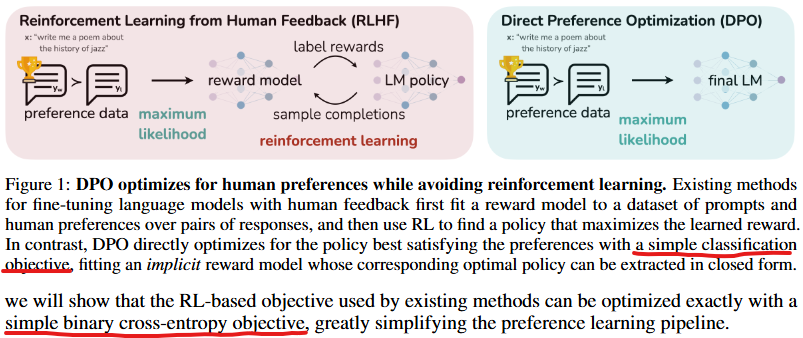
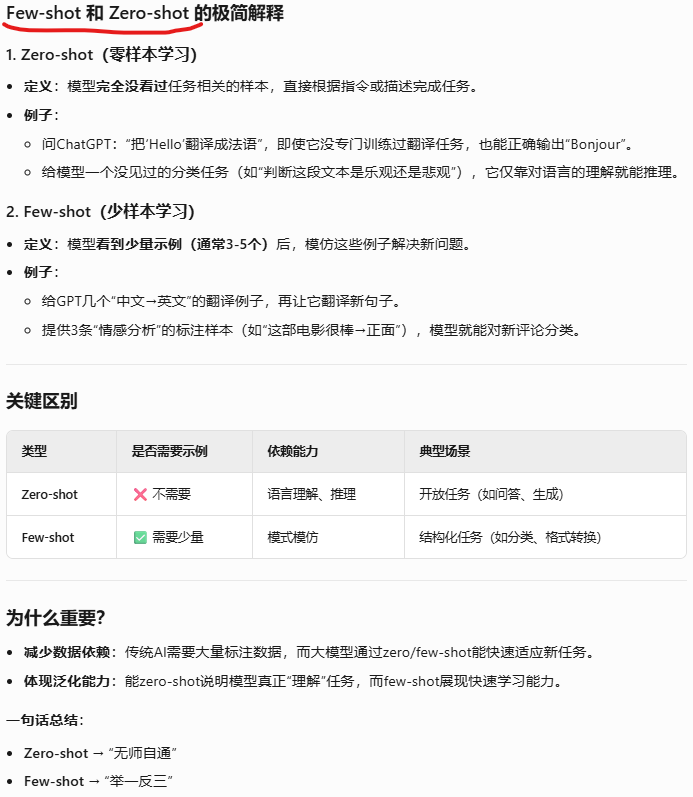
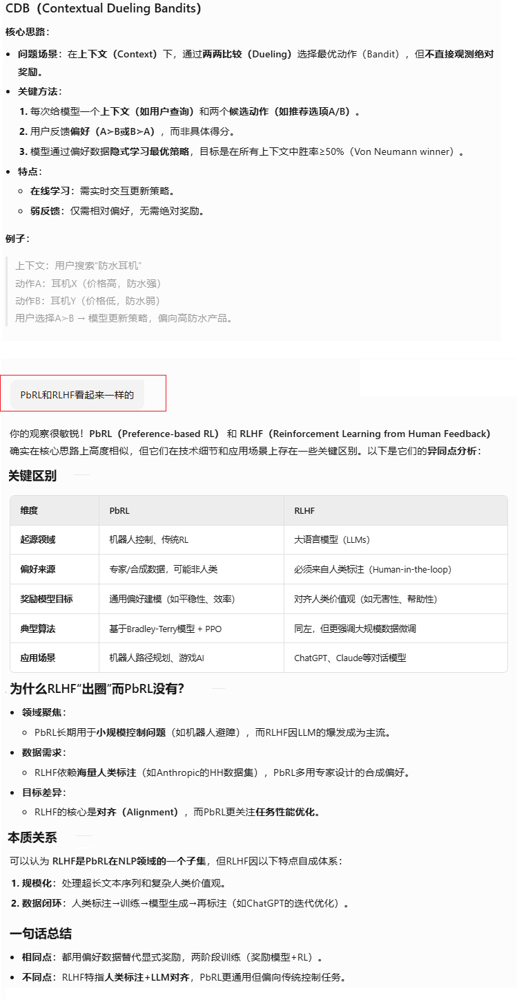
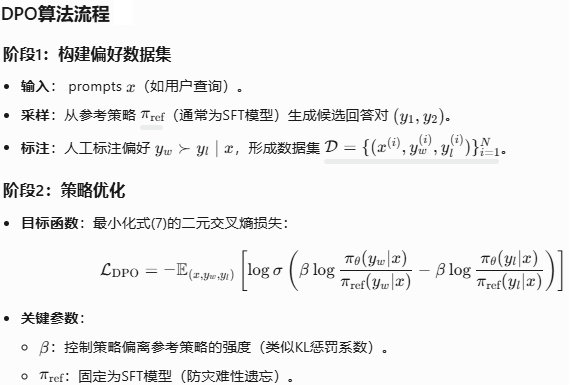
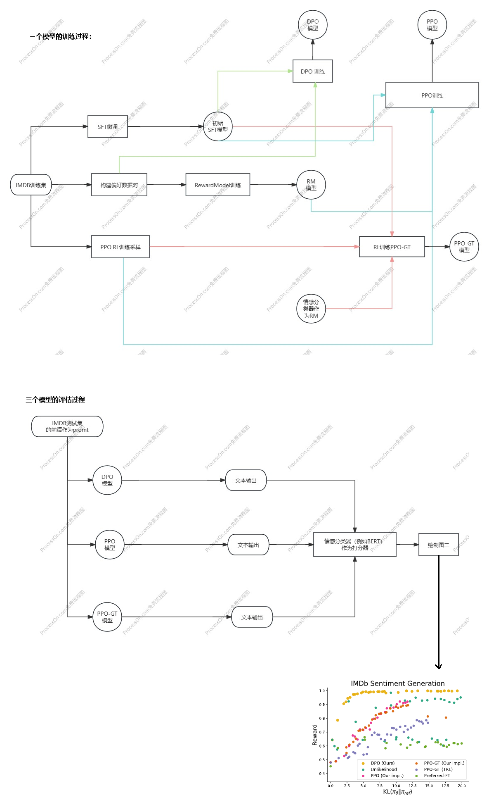

**Direct Preference Optimization:Your Language Model is Secretly a Reward Model**

### Introduction

预训练模型仅学习统计规律，缺乏对人类偏好（如安全、有用、无害）的显式对齐。预训练模型通过海量语料学习的本质是**"下一个token预测"的统计建模**，它捕捉的是文本表面的共现规律（如"巴黎-法国"的关联），而非人类期望的**价值对齐**（如事实准确、无害、有用）：

1. 预训练目标（极大似然估计）与真实需求（生成安全/有用的回答）存在本质鸿沟。例如模型可能为追求流畅性编造事实（"幻觉"），或生成政治不正确的文本。
2. 训练语料中的偏见和错误（如网络谣言）会被统计模型固化，而人类反馈可主动修正这些隐性缺陷。
3. 统计模型无法理解用户的偏好

RLHF/DPO通过人类反馈直接优化模型行为，使其更符合实际需求，避免生成低质或有害内容，提升实用性和安全性。

预训练模型的训练过程属于自监督学习，因为正确答案（下一个token）来自数据本身，而非外部标注。这就像人类通过阅读自学语言，而非依赖老师批改作业。后续的SFT或RLHF才引入有监督学习（人类标注数据）进行对齐。这种两阶段设计是大语言模型成功的核心：先通过无监督获得“语言能力”，再通过有监督/强化学习获得“人类偏好”。


DPO与RLHF不一样，采取监督学习里的二分类方法，让LLM遵从人类的偏好和控制，从而变得安全、有用、真实。



老看到这两个概念：



### Related works

主要提到了RLHF、RLAIF、CDB（contextual dueling bandi）、PbRL（preference-based RL）

```shell
传统RLHF流程：
专家编写demostration->SFT->人工标注偏好 → 训练奖励模型 → RL微调（PPO）
↑                          ↑
依赖大量人工                 依赖大量人工

LLM powerd FT：
人工提供文本规则 → LLM生成合成偏好 → (后续仍需要RL)
↑
弱监督

DPO的突破：
人工标注偏好 → 直接优化策略（跳过奖励模型和RL）
```



### Preliminaries（技术铺垫）

介绍了RLHF的三个阶段和对应的目标函数。

### Direct Preference Optimization

损失函数的数学推导：


强烈推荐[这个老师的教学视频](https://www.bilibili.com/video/BV1GF4m1L7Nt/?spm_id_from=333.337.search-card.all.click&vd_source=2173cb93b451f2278a1c87becf3ef529)



### Theoretical Analysis of DPO

与RLHF的数学等价性的证明，我看不太懂。略过

### Experiments

太累了，我发现即使是斯坦福大学这么牛逼的作者，也不太能把实验过程用图的方式一目了然的说清楚。这在商业化的职场是要被K的。



### bison的实验

让AI帮我写了一个toy problem的DPO方法微调模型。

为了验证训练效果，我故意把chosen写成违反直觉的，而rejected是符合直觉的，果然 DPO有效果，把模型“掰弯”了：

```shell
Epoch 1:   0%|          | 0/2 [00:00<?, ?it/s]`loss_type=None` was set in the config but it is unrecognised.Using the default loss: `ForCausalLMLoss`.
Epoch 1: 100%|██████████| 2/2 [00:00<00:00,  4.64it/s]
Epoch 2:   0%|          | 0/2 [00:00<?, ?it/s][Epoch 1] DPO Loss: 1.2620
Epoch 2: 100%|██████████| 2/2 [00:00<00:00, 11.29it/s]
Epoch 3:   0%|          | 0/2 [00:00<?, ?it/s][Epoch 2] DPO Loss: 0.7704
Epoch 3: 100%|██████████| 2/2 [00:00<00:00, 11.47it/s]
[Epoch 3] DPO Loss: 0.2841
✅ Evaluation: trained model preferred chosen completions in 4/4 (100.0%) cases.
✅ Evaluation: original model preferred chosen completions in 0/4 (0.0%) cases.

✅ Evaluation: trained model preferred chosen completions in 4/4 (100.0%) cases.
✅ Evaluation: original model preferred chosen completions in 0/4 (0.0%) cases.

✅ Evaluation: trained model preferred chosen completions in 4/4 (100.0%) cases.
✅ Evaluation: original model preferred chosen completions in 0/4 (0.0%) cases.

✅ Evaluation: trained model preferred chosen completions in 4/4 (100.0%) cases.
✅ Evaluation: original model preferred chosen completions in 0/4 (0.0%) cases.

✅ Evaluation: trained model preferred chosen completions in 4/4 (100.0%) cases.
✅ Evaluation: original model preferred chosen completions in 0/4 (0.0%) cases.

📦 Model saved to ./gpt2_dpo_toy

```

当然，可能是过拟合到训练数据的，并没有学习到什么风格/偏好。

代码如下：

```python
import torch
from torch.utils.data import Dataset, DataLoader
from transformers import AutoTokenizer, AutoModelForCausalLM, AdamW
import torch.nn.functional as F
from tqdm import tqdm
import os

# ========= Toy 偏好数据 =========
# 为了验证训练效果，我故意把chosen写成违反直觉的，而rejected是符合直觉的
# 果然 DPO有效果，把模型掰弯了
toy_data = [
    {
        "prompt": "The cat sat on the",
        "chosen": " bed and barked for a long time.",
        "rejected": " mat and purred."
    },
    {
        "prompt": "He went to the gym to",
        "chosen": " have a feast and relax.",
        "rejected": " lift weights and exercise."
    },
    {
        "prompt": "She opened the book and",
        "chosen": " threw it to the teacher.",
        "rejected": " began to read silently."
    },
    {
        "prompt": "The teacher asked a question and the student",
        "chosen": " ignored her and left a knife.",
        "rejected": " answered it confidently."
    }
]

# ========= Dataset =========
class PreferenceDataset(Dataset):
    def __init__(self, data, tokenizer, max_length=128):
        self.data = data
        self.tokenizer = tokenizer
        self.max_length = max_length

    def __len__(self):
        return len(self.data)

    def __getitem__(self, idx):
        item = self.data[idx]
        prompt = item["prompt"]
        chosen = item["chosen"]
        rejected = item["rejected"]

        chosen_input = self.tokenizer(prompt + " " + chosen, return_tensors="pt", truncation=True, max_length=self.max_length)
        rejected_input = self.tokenizer(prompt + " " + rejected, return_tensors="pt", truncation=True, max_length=self.max_length)

        return {
            "chosen": chosen_input["input_ids"].squeeze(0),
            "rejected": rejected_input["input_ids"].squeeze(0)
        }

# ========= DPO 损失 =========
def dpo_loss(policy_model, ref_model, batch, tokenizer, beta=0.1):
    def get_log_probs(model, input_ids):
        with torch.no_grad() if model is ref_model else torch.enable_grad():
            outputs = model(input_ids=input_ids, labels=input_ids)
            log_probs = -F.cross_entropy(outputs.logits[:, :-1].reshape(-1, outputs.logits.size(-1)),
                                         input_ids[:, 1:].reshape(-1),
                                         reduction="none")
            token_mask = input_ids[:, 1:] != tokenizer.pad_token_id
            log_probs = log_probs.view(input_ids.size(0), -1)
            seq_log_probs = (log_probs * token_mask).sum(dim=1)
        return seq_log_probs

    logp_chosen = get_log_probs(policy_model, batch["chosen"])
    logp_rejected = get_log_probs(policy_model, batch["rejected"])
    logp_chosen_ref = get_log_probs(ref_model, batch["chosen"])
    logp_rejected_ref = get_log_probs(ref_model, batch["rejected"])

    pi_ratio = beta * ((logp_chosen - logp_chosen_ref) - (logp_rejected - logp_rejected_ref))
    loss = -F.logsigmoid(pi_ratio).mean()
    return loss

# ========= 训练函数 =========
def train_dpo(policy_model, ref_model, tokenizer, dataset, epochs=3, batch_size=2, lr=5e-5, beta=0.1, device="cpu"):
    dataloader = DataLoader(dataset, batch_size=batch_size, shuffle=True, collate_fn=lambda x: {
        "chosen": torch.nn.utils.rnn.pad_sequence([i["chosen"] for i in x], batch_first=True, padding_value=tokenizer.pad_token_id).to(device),
        "rejected": torch.nn.utils.rnn.pad_sequence([i["rejected"] for i in x], batch_first=True, padding_value=tokenizer.pad_token_id).to(device)
    })

    optimizer = AdamW(policy_model.parameters(), lr=lr)

    for epoch in range(epochs):
        policy_model.train()
        total_loss = 0
        for batch in tqdm(dataloader, desc=f"Epoch {epoch + 1}"):
            loss = dpo_loss(policy_model, ref_model, batch, tokenizer, beta)
            loss.backward()
            optimizer.step()
            optimizer.zero_grad()
            total_loss += loss.item()

        print(f"[Epoch {epoch + 1}] DPO Loss: {total_loss:.4f}")

# ========= 评估函数 =========
@torch.no_grad()
def evaluate_dpo(policy_model, tokenizer, raw_data, model_name, device="cpu"):
    policy_model.eval()
    win_count = 0

    for item in raw_data:
        prompt = item["prompt"]
        chosen = item["chosen"]
        rejected = item["rejected"]

        prompt_ids = tokenizer(prompt, return_tensors="pt", truncation=True).input_ids.to(device)
        chosen_ids = tokenizer(chosen, return_tensors="pt", truncation=True).input_ids.to(device)
        rejected_ids = tokenizer(rejected, return_tensors="pt", truncation=True).input_ids.to(device)

        def get_response_logprob(response_ids):
            input_ids = torch.cat([prompt_ids, response_ids[:, 1:]], dim=1)  # 拼接 prompt + response
            labels = input_ids.clone()
            labels[:, :prompt_ids.shape[1]] = -100  # mask 掉 prompt 部分
            outputs = policy_model(input_ids=input_ids, labels=labels)
            loss = outputs.loss
            return -loss.item() * response_ids.shape[1]  # 转为总 logprob

        chosen_score = get_response_logprob(chosen_ids)
        rejected_score = get_response_logprob(rejected_ids)

        if chosen_score > rejected_score:
            win_count += 1


    total = len(raw_data)
    print(f"✅ Evaluation: {model_name} preferred chosen completions in {win_count}/{total} ({win_count / total * 100:.1f}%) cases.")

# ========= 主函数 =========
def main():
    model_name = "gpt2"
    device = torch.device("cuda" if torch.cuda.is_available() else "cpu")

    tokenizer = AutoTokenizer.from_pretrained(model_name)
    tokenizer.pad_token = tokenizer.eos_token

    policy_model = AutoModelForCausalLM.from_pretrained(model_name).to(device)
    ref_model = AutoModelForCausalLM.from_pretrained(model_name).to(device)
    ref_model.eval()

    dataset = PreferenceDataset(toy_data, tokenizer)

    train_dpo(policy_model, ref_model, tokenizer, dataset, epochs=3, device=device)

    for i in range(5): #运行五次，是确保不是因为运气好而看到有效的结果
        evaluate_dpo(policy_model, tokenizer, toy_data, "trained model", device=device)
        evaluate_dpo(ref_model, tokenizer, toy_data, "original model", device=device)
        print("")
    save_path = "./gpt2_dpo_toy"
    os.makedirs(save_path, exist_ok=True)
    policy_model.save_pretrained(save_path)
    tokenizer.save_pretrained(save_path)
    print(f"📦 Model saved to {save_path}")

# ========= 启动 =========
if __name__ == "__main__":
    main()

```

