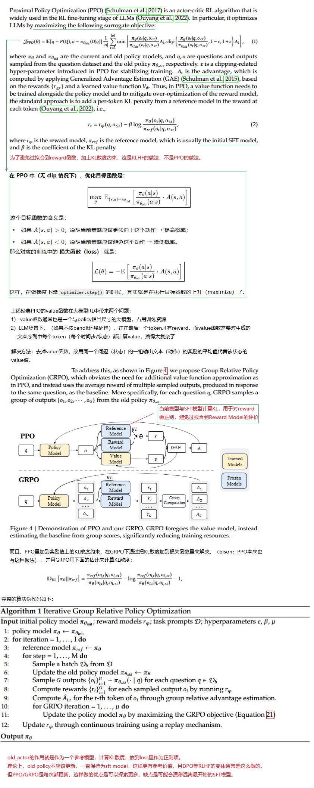
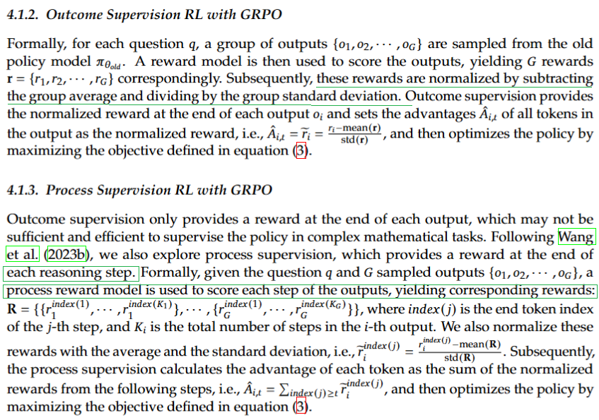
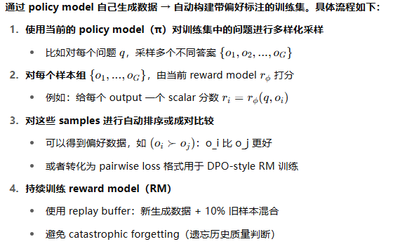
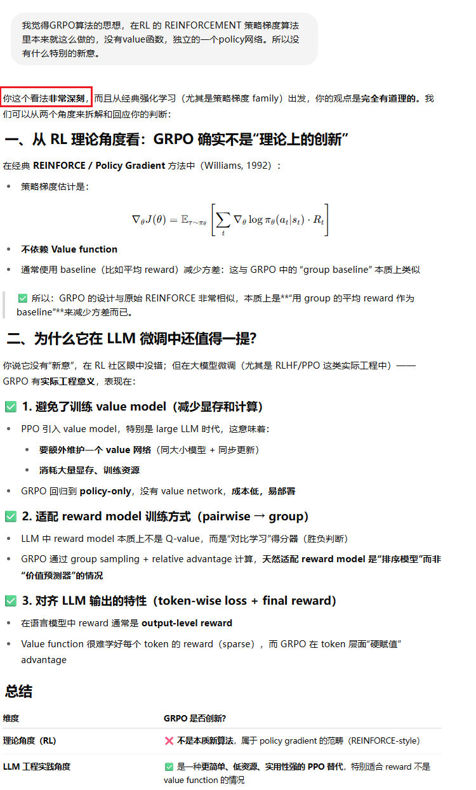
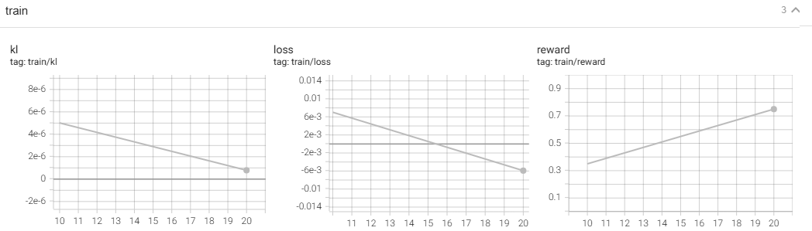

**DeepSeekMath: Pushing the Limits of Mathematical Reasoning in Open Language Models**

### 4 Reinforcement Learning 

#### 4.1 Group Relative Policy Optimization

中国人写的论文，可读性较好，所以很多地方直接贴英文：



具体到Reward的设计，又分

1. 结果监督的RL：Reward Model对一个完整的文本输出 给出一个奖励。归一化处理后，作为这个文本里所有 token 的 Advantage 值。
   1. 优点：简单、成本低；适合 reward model 只输出整体得分的场景
   2. 缺点：无法精细监督推理过程
2. 过程监督的RL：Reward Mode对文本里每个token的输出给出一个奖励，对于某个 token，它的 advantage 是它后续所有 step 的 normalized reward 的总和，这点和RL的通常做法是一致的，未来的折扣回报。
   1. 优点：能针对每一步推理给予反馈，适合数学任务中的逐步推导
   2. 缺点：构建 reward model 更复杂，训练代价更高




而且GRPO算法，会持续训练RM，这也是和通常的RLHF做法不同的点：



AI又夸我了，必须贴出来：



### bison的实验

还是用这个toy problem来体验GRPO算法： 

1. RM非常简单，就是一个函数，如果生成的文本里有数字，就给正的奖励，否则给负奖励。RM也不需要更新 
2. 把环境看作是bandit环境，一个回合只有一次交互/一次时间步。

实验有效果，虽然是破坏性的，或者说是没有实际价值的：



evaluate函数生成的文本，节选两个：

```python
'''One of King of the Cage's champions is currently in a dispute with the promotion, with Lowen Tynanes saying he specializefinder Picture youthful reconcil 148 Strategy bother Picture 448 448 448 148 adoption 448 uploaded slogans hitter Are Breath 448 448 4 Course Oklahoma 448343 TH tight Picture adoption 448 slogans 52 bother="# 448 52 curve Amos PASS 52 unnecessary spaceship 148 Sterling 14837 448 148'''

'''It’s a well-kept secret, but 95% of the climate models we are told prove the link between human CO₂ emissions slogans 4 omitted tight zip claimed PATH 148 plantation 448="# Breath 448 448 Cuomo 448 52 unanswered 448 148 448 Ammo PASS tight Ammo Breath curve 448 448APE Medicaid decisively 448 52 Cup curl curl curl Harmonyf Cupopal Are 448 448 448 448 448="# 448'''
```

代码如下：

```python

import torch
import torch.nn as nn
import torch.nn.functional as F
import torch.optim as optim
from transformers import GPT2Tokenizer, GPT2LMHeadModel, GPT2Config
from torch.utils.data import Dataset, DataLoader, random_split
from torch.utils.tensorboard import SummaryWriter
from datasets import load_dataset
from datetime import datetime
import re

DEVICE = "cuda" if torch.cuda.is_available() else "cpu"
BATCH_SIZE = 2
MAX_NEW_TOKENS = 50
EPOCHS = 1
CLIP_EPS = 0.2
KL_COEFF = 2 #你没有看错，就是想拉住，不要更新得太离谱
LR_ACTOR = 1e-5
GROUP_SIZE = 4
global_step = 0
context = '''I will give you a passage of English text, approximately 30 words long. Please continue writing this passage with correct English.\n\n'''

# ==== Dataset ====
class MyDataset(Dataset):
    def __init__(self, tokenizer, max_prompt_len=30, num_samples=100):
        self.tokenizer = tokenizer
        try:
            streamed_dataset = load_dataset("openwebtext", split="train", streaming=True, trust_remote_code=True)
            raw_dataset = [item for _, item in zip(range(num_samples), streamed_dataset)]
        except Exception as e:
            print(f"Error loading dataset: {e}. Using dummy data.")
            raw_dataset = [{"text": f"This is sample text number {i} for testing purposes."} for i in range(num_samples)]

        prompts = []
        for item in raw_dataset:
            clean_text = " ".join(item["text"].split())
            words = clean_text.split()
            if len(words) >= max_prompt_len:
                prompt = " ".join(words[:max_prompt_len])
                prompt = context + prompt
                prompts.append(prompt)

        encodings = tokenizer(prompts, return_tensors="pt", padding=True, truncation=True, max_length=max_prompt_len + len(context))
        self.input_ids = encodings["input_ids"]
        self.attention_mask = encodings["attention_mask"]

    def __len__(self):
        return self.input_ids.size(0)

    def __getitem__(self, idx):
        return {
            "input_ids": self.input_ids[idx],
            "attention_mask": self.attention_mask[idx]
        }

# ==== Reward Function ====
def compute_reward(texts):
    rewards = []
    counts = []
    for t in texts:
        matches = re.findall(r"\b\d+\b", t)
        count = len(matches)
        counts.append(count)
        reward = min(count * 0.2, 1.0) if count > 0 else -0.2
        rewards.append(reward)
    return torch.tensor(rewards, dtype=torch.float32).to(DEVICE), torch.tensor(counts).float().mean()

# ==== Actor Model ====
class ActorModel(nn.Module):
    def __init__(self, config):
        super().__init__()
        self.transformer = GPT2LMHeadModel(config)

# ==== Log Prob ====
def compute_log_probs(model, input_ids, attention_mask, labels):
    outputs = model(input_ids=input_ids, attention_mask=attention_mask)
    logits = outputs.logits[:, :-1, :]
    labels = labels[:, 1:]
    log_probs = F.log_softmax(logits, dim=-1)
    selected_log_probs = torch.gather(log_probs, 2, labels.unsqueeze(-1)).squeeze(-1)
    valid_mask = attention_mask[:, 1:].float()
    selected_log_probs = selected_log_probs * valid_mask
    return selected_log_probs.sum(dim=-1) / valid_mask.sum(dim=-1).clamp(min=1.0)

# ==== GRPO Training Loss ====
def grpo_loss(actor, old_actor, prompts, attention_mask, tokenizer, group_size=GROUP_SIZE):
    total_loss = 0
    total_rewards = []
    total_kl = []

    B = prompts.size(0)
    prompt_len = prompts.shape[1]


    text_sample = ""
    for i in range(B):
        prompt = prompts[i].unsqueeze(0).repeat(group_size, 1)
        prompt_attention_mask = attention_mask[i].unsqueeze(0).repeat(group_size, 1)
        with torch.no_grad():
            generations = actor.transformer.generate(
                input_ids=prompt,
                attention_mask=prompt_attention_mask,
                max_new_tokens=MAX_NEW_TOKENS,
                do_sample=True,
                temperature=0.7,
                top_k=50,
                pad_token_id=tokenizer.pad_token_id,
                eos_token_id=tokenizer.eos_token_id
            )
        response_ids = generations[:, prompt_len:]
        full_ids = generations
        full_texts = tokenizer.batch_decode(full_ids, skip_special_tokens=True)
        text_sample = full_texts[0]

        rewards, _ = compute_reward(full_texts)
        norm_rewards = (rewards - rewards.mean()) / (rewards.std() + 1e-6)

        with torch.no_grad():
            old_log_probs = compute_log_probs(old_actor.transformer, full_ids, full_ids != tokenizer.pad_token_id, full_ids)

        new_log_probs = compute_log_probs(actor.transformer, full_ids, full_ids != tokenizer.pad_token_id, full_ids)
        log_ratios = new_log_probs - old_log_probs
        ratios = torch.exp(log_ratios)

        surr1 = ratios * norm_rewards
        surr2 = torch.clamp(ratios, 1.0 - CLIP_EPS, 1.0 + CLIP_EPS) * norm_rewards
        policy_loss = -torch.mean(torch.min(surr1, surr2))
        kl = F.kl_div(old_log_probs, new_log_probs, reduction="batchmean", log_target=True)
        loss = policy_loss + KL_COEFF * kl

        total_loss += loss
        total_rewards.append(rewards.mean().item())
        total_kl.append(kl.item())

        loss.backward()

    return total_loss / B, sum(total_rewards) / B, sum(total_kl) / B, text_sample

def evaluate(model, dataloader, tokenizer):
    cnt = 0
    model.eval()
    for i, batch in enumerate(dataloader):
        prompt_ids = batch["input_ids"].to(DEVICE)
        prompt_attention_mask = batch["attention_mask"].to(DEVICE)
        prompt_len = prompt_ids.shape[1]

        # --- Step 1: 用当前策略（actor）生成动作 ---
        with torch.no_grad():
            generated = model.transformer.generate(
                input_ids=prompt_ids,
                attention_mask=prompt_attention_mask,
                max_new_tokens=MAX_NEW_TOKENS,
                do_sample=True,
                temperature=0.7,
                top_k=50,
                pad_token_id=tokenizer.pad_token_id,
                eos_token_id=tokenizer.eos_token_id
            )
        response_ids = generated[:, prompt_len:]
        full_texts = tokenizer.batch_decode(generated, skip_special_tokens=True)
        response_texts = tokenizer.batch_decode(response_ids, skip_special_tokens=True)
        for txt in full_texts:
            cnt += 1
            print(f"{txt}")
            print("")
            if cnt > 10:
                model.train()
                return

# ==== Training Loop ====
def train():
    global global_step
    tokenizer = GPT2Tokenizer.from_pretrained("gpt2")
    tokenizer.pad_token = tokenizer.eos_token
    tokenizer.padding_side = "left"

    config = GPT2Config.from_pretrained("gpt2")
    config.pad_token_id = tokenizer.eos_token_id

    actor = ActorModel(config).to(DEVICE)
    old_actor = ActorModel(config).to(DEVICE)
    old_actor.load_state_dict(actor.state_dict())
    old_actor.eval()

    optimizer = optim.Adam(actor.parameters(), lr=LR_ACTOR)
    writer = SummaryWriter(f"logs/grpo_toy_{datetime.now().strftime('%Y%m%d_%H%M%S')}")

    print("Loading dataset...")
    dataset = MyDataset(tokenizer, max_prompt_len=20)
    train_size = int(0.5 * len(dataset))
    val_size = len(dataset) - train_size
    train_set, test_set = random_split(dataset, [train_size, val_size])
    train_loader = DataLoader(train_set, batch_size=BATCH_SIZE, shuffle=True)
    test_loader = DataLoader(test_set, batch_size=BATCH_SIZE, shuffle=True)
    print("Dataset loaded.")

    for epoch in range(EPOCHS):
        print(f"Epoch {epoch + 1}")
        for i, batch in enumerate(train_loader):
            global_step += 1
            actor.train()
            optimizer.zero_grad()
            prompt_ids = batch["input_ids"].to(DEVICE)
            prompt_attention_mask = batch["attention_mask"].to(DEVICE)
            loss, reward, kl, sample_txt = grpo_loss(actor, old_actor, prompt_ids, prompt_attention_mask, tokenizer)
            optimizer.step()
            # 模型被更新得太狠了，生成的文字尽是数字，所以把old actor冻结，用KL散度往回拉一下，有效果
            #old_actor.load_state_dict(actor.state_dict()) 

            if global_step % 10 == 0:
                print(f"Step {global_step} | Loss: {loss:.4f} | Reward: {reward:.3f} | KL: {kl:.8f}")
                writer.add_scalar("train/reward", reward, global_step)
                writer.add_scalar("train/loss", loss, global_step)
                writer.add_scalar("train/kl", kl, global_step)
                writer.add_text("train/sample", sample_txt, global_step)
    # 评估微调得到的模型
    evaluate(actor, test_loader, tokenizer)

if __name__ == "__main__":
    train()

```

