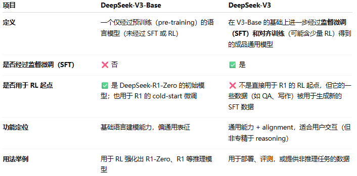
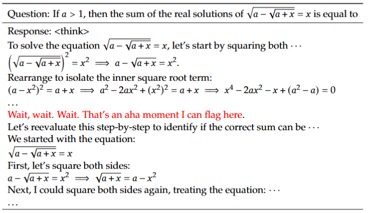
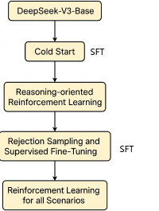
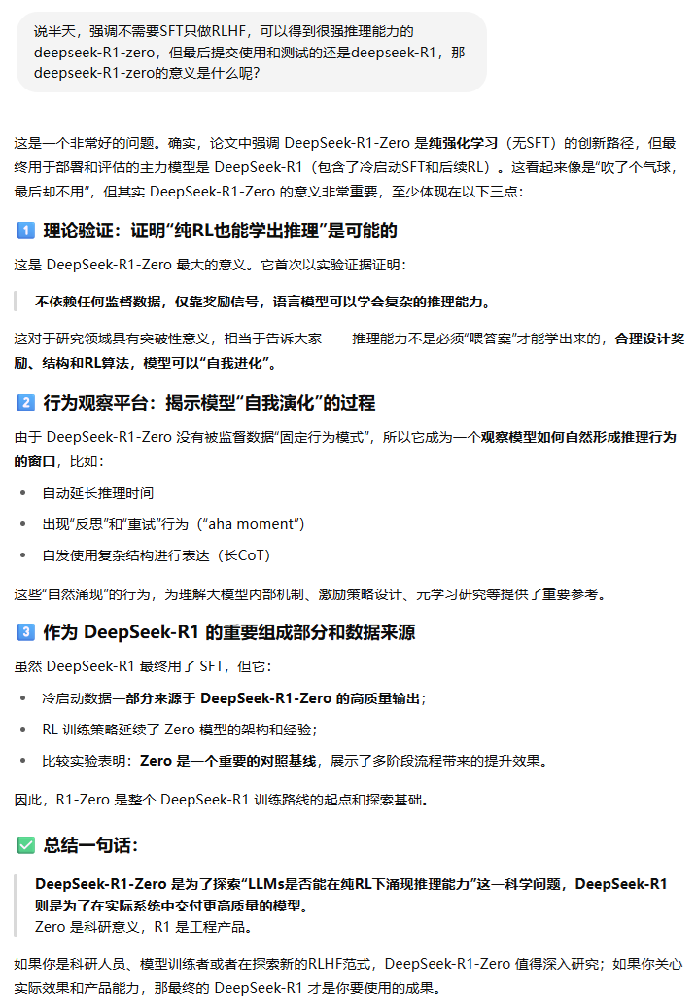
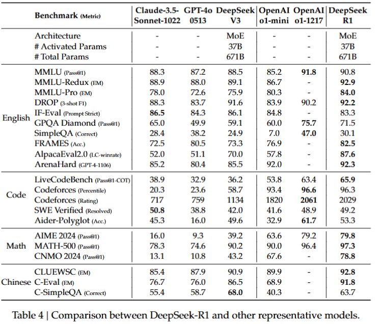
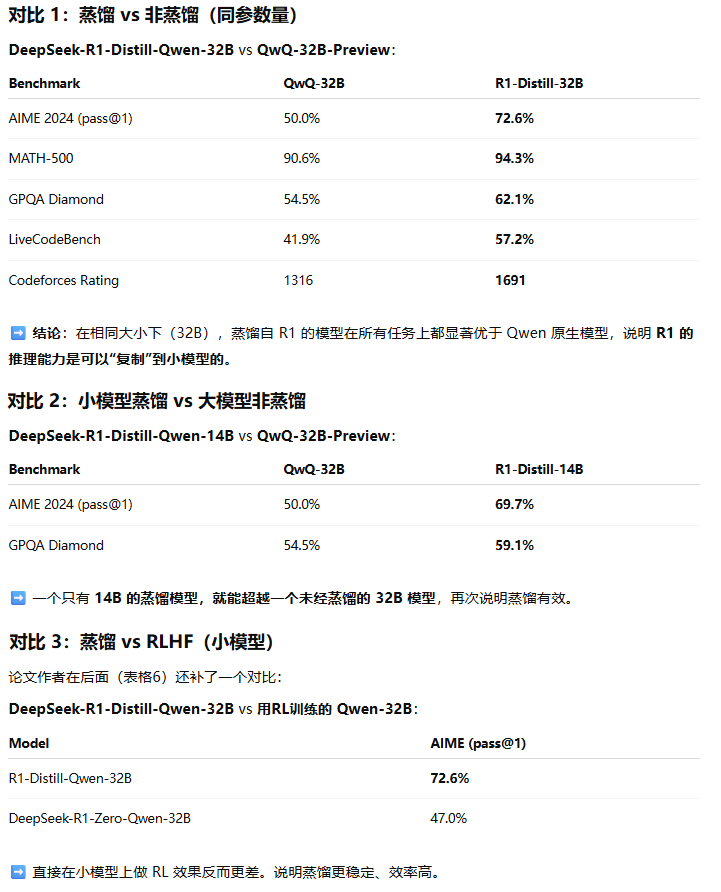

**DeepSeek-R1: Incentivizing Reasoning Capability in LLMs via Reinforcement Learning**

### Introduction

三个主要的工作：

1. 只使用RL，不使用SFT，基于DeepSeek-V3-Base微调出DeepSeek-R1-zero，推理性能超过SOTA，但是出现了一些问题：可读性差、不同语言混合
2. 还是基于DeepSeek-V3-Base，使用少量标注数据进行SFT，外加RL，得到DeepSeek-R1，性能可以对标OpenAI-o1-1217
3. 基于Qwen2.5-32B这样的小模型作为student模型，蒸馏DeepSeek-R1，比对Qwen2.5-32B进行RL得到的性能更好。蒸馏的14B模型的表现比QwQ-32B-Preview还要好
4. 我们开源了上述模型


主要贡献：

1. 将大规模强化学习应用于基础大模型的后训练（Post-Training，对应前期的预训练）。第一次证实了只需要RL不需要SFT也可以获得很好的推理能力
2. 证实了通过蒸馏，小模型也可以很强大。通过从大模型蒸馏小模型，比对小模型进行RL，得到的性能更好。


评估结果：

1. 推理任务：
   1. DeepSeek-R1 achieves a score of 79.8% Pass@1 on AIME 2024, slightly surpassing OpenAI-o1-1217. On MATH-500, it attains an impressive score of 97.3%, performing on par with OpenAI-o1-1217 and significantly outperforming other models.
   2. On coding-related tasks, DeepSeek-R1 demonstrates expert level in code competition tasks,as it achieves 2,029 Elo rating on Codeforces outperforming 96.3% human participants in the competition
   3. For engineering-related tasks, DeepSeek-R1 performs slightly better than DeepSeek-V3, which could help developers in real world tasks.
2. 知识任务：
   1. DeepSeek-R1 achieves outstanding results, significantly outperforming DeepSeek-V3 with scores of 90.8% on MMLU, 84.0% on MMLU-Pro, and 71.5% on GPQA Diamond.While its performance is slightly below that of OpenAI-o1-1217 on these benchmarks, DeepSeek-R1surpasses other closed-source models, demonstrating its competitive edge in educational tasks.
   2. On the factual benchmark SimpleQA, DeepSeek-R1 outperforms DeepSeek-V3
3. 其他领域：
   1. DeepSeek-R1 achieves an impressive length-controlled win-rate of 87.6% on AlpacaEval 2.0 and a win-rate of 92.3% on Are-naHard
   2. DeepSeek-R1 demonstrates outstanding performance on tasks requiring long-context understanding, substantially outperforming DeepSeek-V3 on long-context benchmarks.

我的困惑：

Q：R1是基于DeepSeek-V3做后训练得到的，DeepSeek-R1在很多方面超过了DeepSeek-V3，这不是肯定和理所应当的？

AI：虽然 DeepSeek-R1 是基于 DeepSeek-V3 微调得到的，但其显著超越 V3 的推理能力，并不是“理所当然”的，而是大量设计和 RL 调优工作的成果。论文强调这一点，是为了凸显其 **推理驱动的后训练策略** 的成功。

Q：DeepSeek-V3-Base和DeepSeek-V3是什么关系和区别？

AI：DeepSeek-V3-Base 是预训练阶段的基础模型，而 DeepSeek-V3 是在此基础上经过监督微调（SFT）后的通用对齐模型。




### Approach

想想都觉得神奇，怎么设计reward model，才能对数学推理这样的文本问题做出准确性判断呢，LLM又怎么能学到各式各样的数学推理能力呢。可以说RL让计算机真的自我进化起来了。

论文好几次这样说：

```
This behavior is not only a testament to the model’s growing reasoning abilities but also a captivating example of how reinforcement learning can lead to unexpected and sophisticated outcomes.

This is also an aha moment for us,allowing us to witness the power and beauty of reinforcement learning.
```

LLM似乎具备反思/顿悟的能力，例如当LLM面对下面这个没有实数解的方程：



DeepSeek-R1-Zero只使用RL（GRPO算法优化掉value函数）不使用SFT，后者需要大量的样本标注工作。训练中使用基于规则的奖励函数，包括“准确性奖励”和“格式奖励”。模型逐步学会延长思考过程、进行自我反思，甚至出现“aha moment”（自发性的再思考行为）。

为解决DeepSeek-R1-Zero可读性差/多语言混杂的问题，在RL前引入少量冷启动数据，提升模型初始状态并提升可读性。训练流程包括：冷启动微调、推理导向的RL训练、拒绝采样与SFT扩展多任务能力、再进行覆盖所有场景的RL训练，最终获得兼具强推理能力与通用性、可读性的DeepSeek-R1。



最后将DeepSeek-R1的推理能力迁移至小模型（如Qwen与LLaMA），通过SFT方式训练，证明即使不使用RL，小模型也能通过蒸馏获得强大的推理性能。

### Expertiments






论文中的表格5，不太容易得出结论，下面是AI帮忙提炼的解读，有三个重要的观点：



有两个重要的结论：

1. 将强大的大模型蒸馏出小的模型会产生极好的结果，而使用前面提到的RL微调方法来训练小的模型需要巨大的计算能力，甚至可能无法达到蒸馏出的小模型的性能。
2. 虽然蒸馏策略既经济又有效，但超越智能边界可能仍然需要更强大的基础模型和更大规模的强化学习。

### Discussion

重点列一下作者提到的两个失败的尝试：

1. 尝试过程奖励模型（Process Reward Model, PRM，）。PRM 的初衷是**奖励模型在推理过程中的每一步表现**，而不仅仅是最后答案是否正确。比如模型写一个数学证明，PRM希望在每个中间步骤判断对不对，鼓励“正确的思考路径”。遇到的问题是不好定义每一步的粒度、不好标注用来训练PRM的数据、还容易被actor欺骗。
2. 尝试参考AlphaGo使用MCTS，系统性地探索生成空间，**将推理过程拆成步骤、逐步搜索最优路径**。希望这样能提升模型推理深度和可靠性。遇到的问题是搜索空间过大又不好剪枝、value函数不好训练（难以定义语言生成的每一步的价值）

### Conclusion, Limitations, and Future Work

主要有这些展望：

1. 通用能力：提高DeepSeek-R1的通用能力，目前这些方面还不如V3
2. 语言混用：DeepSeek-R1 目前主要支持中英文，在多语言任务中会出现“语言混用”的问题。未来还支持更多的语言。
3. 提示词工程：DeepSeek-R1对提示语敏感，例如对few-shot（prompt里只有很少的输入输出样例）反而性能不好。所以我们建议用户使用zero-shot方式，直接告诉模型你所要求的输出格式
4. 软件工程任务：软件工程任务的处理方面DeepSeek-R1还有些欠缺，没有很广泛的使用RL对他进行微调。