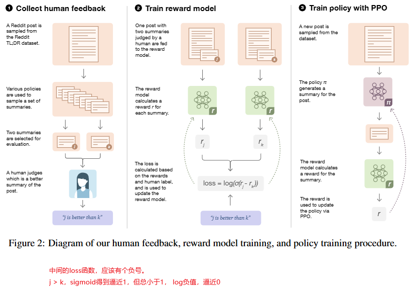
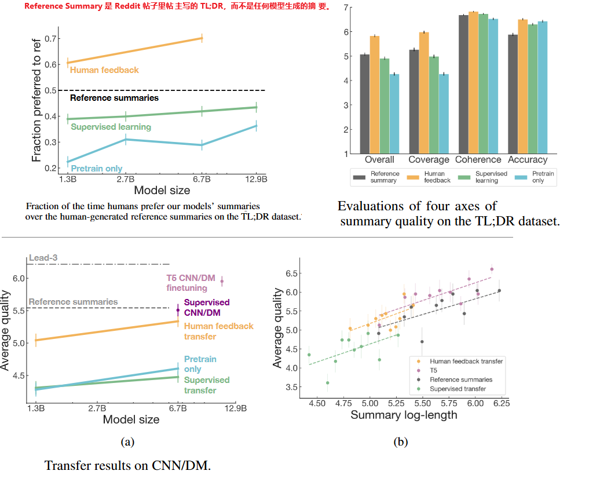
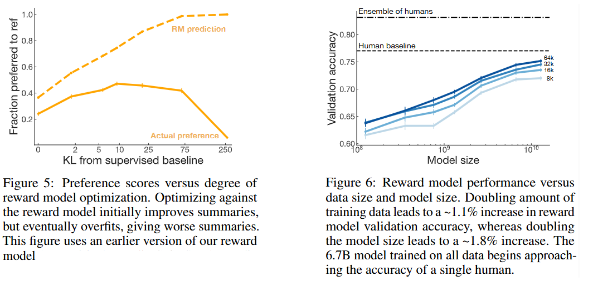
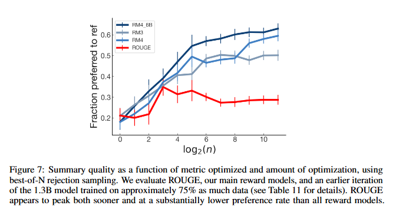

**Learning to summarize from human feedback**

这篇文章写得比较通俗易懂，估计是其中的华人作者写的。很多地方可以直接贴原文，不需要翻译。

### Abstract

We collect a large, high-quality dataset of human comparisons be tween summaries, train a model to predict the human-preferred summary, and use that model as a reward function to fine-tune a summarization policy using reinforce ment learning. 

The policy generates a token of text at each ‘time step’, and is updated using the PPO algorithm [ 58 ] based on the RM ‘reward’ given to the entire generated summary.

We apply our method to a version of the TL;DR dataset of Reddit posts [63] and find that our models significantly outperform both human reference summaries and much larger models fine-tuned with supervised learning alone. 

Our models also transfer to CNN/DM news articles [22], producing summaries nearly as good as the human reference without any news-specific fine-tuning.

可不就是RLHF嘛。

### Introduction

主要的贡献有：

1. We show that training with human feedback significantly outperforms very strong baselines on English summarization.

2. We show human feedback models generalize much better to new domains than supervised models.

3. We confirm that our reward model outperforms other metrics such as ROUGE at predicting human preferences, and that optimizing our reward model directly results in better summaries than optimizing ROUGE according to humans (Section 4.4).

   我们的RM模型，比ROUGE在评价方面做的更好；存在一种“策略模型”，它的训练目标是最大化 ROUGE 分数（比如训练时直接用 ROUGE-L 作为 reward 函数），使用我们的RM训练出来的策略模型，生成的摘要比这种用ROUGE分数做为奖励训练出来的策略模型要好。

4. We publicly release our human feedback dataset for further research  （你倒是给出下载链接啊）

ROUGE（Recall-Oriented Understudy for Gisting Evaluation）是一组自动化指标，用于评估自动摘要或机器生成文本与人工参考摘要之间的相似度。它通过比较重叠的 **n-gram（词序列）**、**长公共子序列（LCS）** 等方式来衡量生成文本是否覆盖了参考中的重要信息。

最常用的有三个指标：

- **ROUGE-1**：统计 unigram（单词）重叠数。
- **ROUGE-2**：统计 bigram（连续两个词）重叠数。
- **ROUGE-L**：计算最长公共子序列，衡量语序一致性。

这些指标可用于比较模型摘要与人工摘要之间在信息覆盖和语言结构上的相似性。

### Related work

介绍了RLHF的典型做法，还有只用ROUGE等静态评价标准作为奖励函数的RL做法，有各种大语言模型应用场景的：例如讲故事、证据提取、翻译等等。

### Method and experiment details

#### 顶层方法

#### 数据集

我们从 TL;DR dataset （来自reddit.com的开放数据集，包括帖子和作者摘要）经过筛选，得到123,169条样本，其中1%用作validation set。

#### 任务

训练一个模型，可以生成尽量好的不超过48个token的摘要。

#### 基础模型

使用预训练的GPT-3，1.3B和6.7B两个版本，进行SFT后得到的模型作为RM的基础和目标模型的基础。

For the PPO value function, we use a Transformer with completely separate parameters from the policy. This prevents updates to the value function from partially destroying the pretrained policy early in training (see ablation in Appendix G.1). We initialize the value function to the parameters of the reward model. 

Value函数网络是完全独立与Policy网络的，他们不共享前半段参数。论文里的数据表明这样效果更好。这三个网络架构和大小相近，都来自SFT模型。

In our experiments, the reward model, policy, and value function are the same size.

### Results

#### 模型的摘要质量对比

#### RM模型本身的打分能力

由于Reward Model的容量有限、训练数据有限，它并不能完美反映标注者对于摘要质量的判断。

从下图左边可以看出，当过于面向reward model的评价做太多RL训练时(越偏离基础模型)，摘要的质量适得其反。

至于RM模型本身：模型越大、训练数据越多，RM的表现越好。如下图右边，纵轴是reward model 在验证集上预测哪一个摘要更好（与人类标注一致）的准确率。

#### RM模型和ROUGE的打分能力对比

进一步考察作者的RM模型和ROUGE作为Reward模型两种方式的对比。

采用**best-of-N rejection sampling方法：**

1. **给定一个原始 Reddit 帖子（post）**；
2. **用模型（policy）生成 N 个不同的摘要候选**：
   - 每次使用不同的随机采样（比如调整采样温度、随机种子等）；
   - 所以每个摘要略有不同，但都是描述这个同一个帖子的；
3. **对这 N 个摘要分别计算分数**（比如 ROUGE 或 reward model 得分）；
4. **选择得分最高的那个摘要**作为最终输出；
5. 记录这个摘要是否比 baseline 更受人类偏好。

为什么对同一个 post 多次采样？这是因为：

- 一个语言模型可能会对同一个输入生成多个“合理但不同”的摘要；
- 而我们关心的是：**如果给你一堆生成结果，你选哪一个？你的评分方法（ROUGE 或 reward model）是否真的能挑出人类喜欢的那个？**

在“从多个摘要中挑出最优”的场景下，**reward model 能更好地代表人类判断标准**，而传统的自动指标（如 ROUGE）表现差且不稳定，如下图：

### Discussion

我们方法的有一定的局限性：时间和计算开销很大，微调一个6.7B的模型需要320GPU-day，前期的数据收集和标注过程也成本很高。

未来的方向：可以扩展到对话、翻译等多场景，尽管收集反馈成本高，但比高质量示范更易扩展，有望在更复杂任务中实现模型对齐。

传统自动指标如 ROUGE 与人类偏好不一致，而基于人类比较训练的 reward model 能更准确地引导模型生成高质量输出。

更强的模型若被用于操纵、生成有害内容或加深依赖，可能带来社会风险；研究者应谨慎定义“好行为”，并让受影响群体参与反馈过程。

