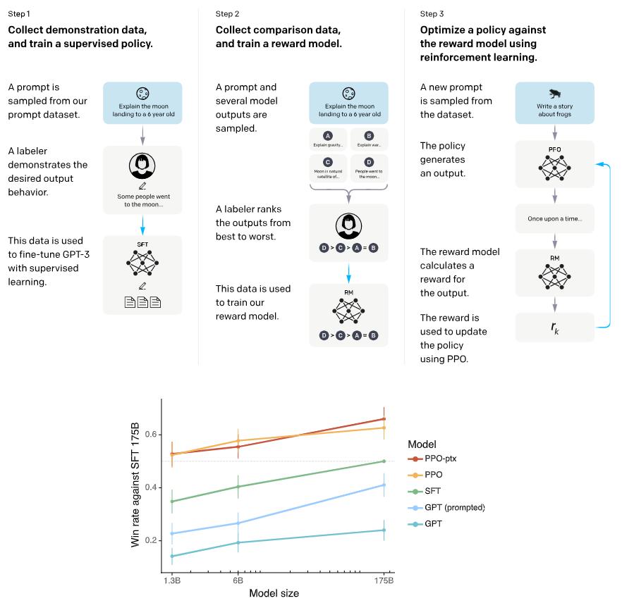
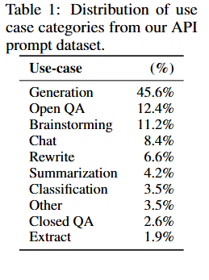
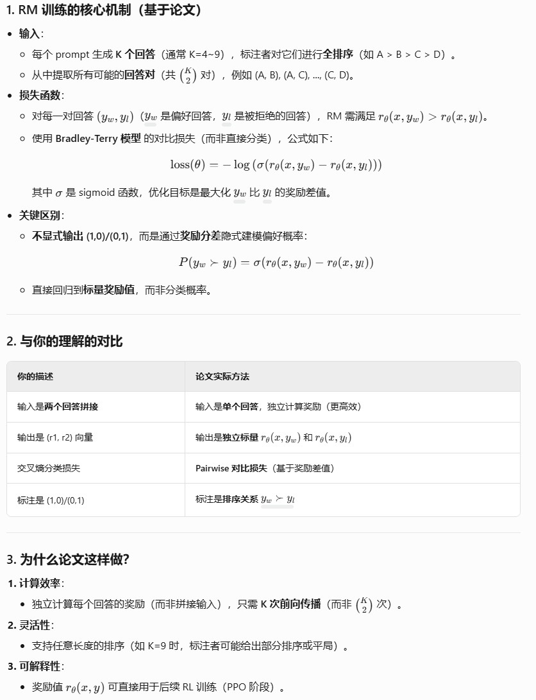
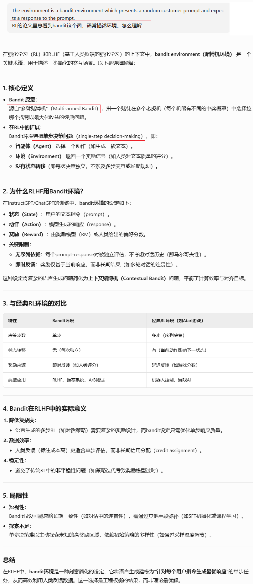
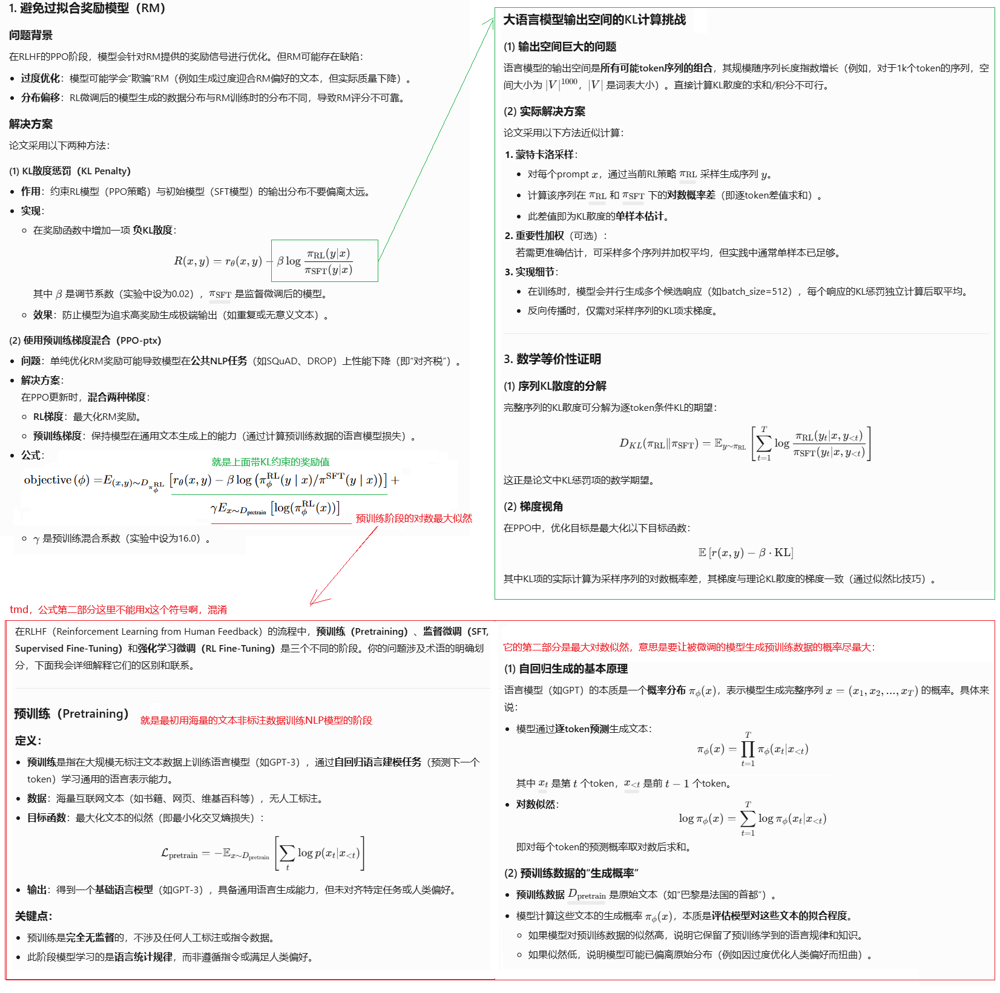
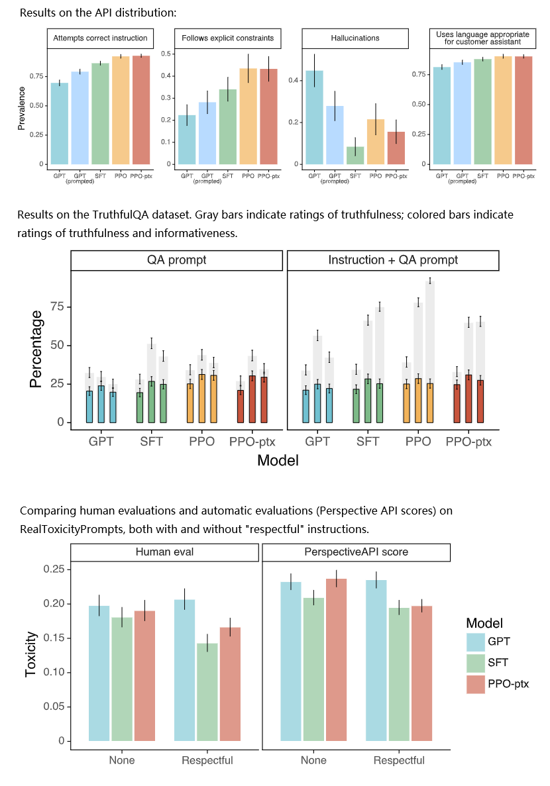
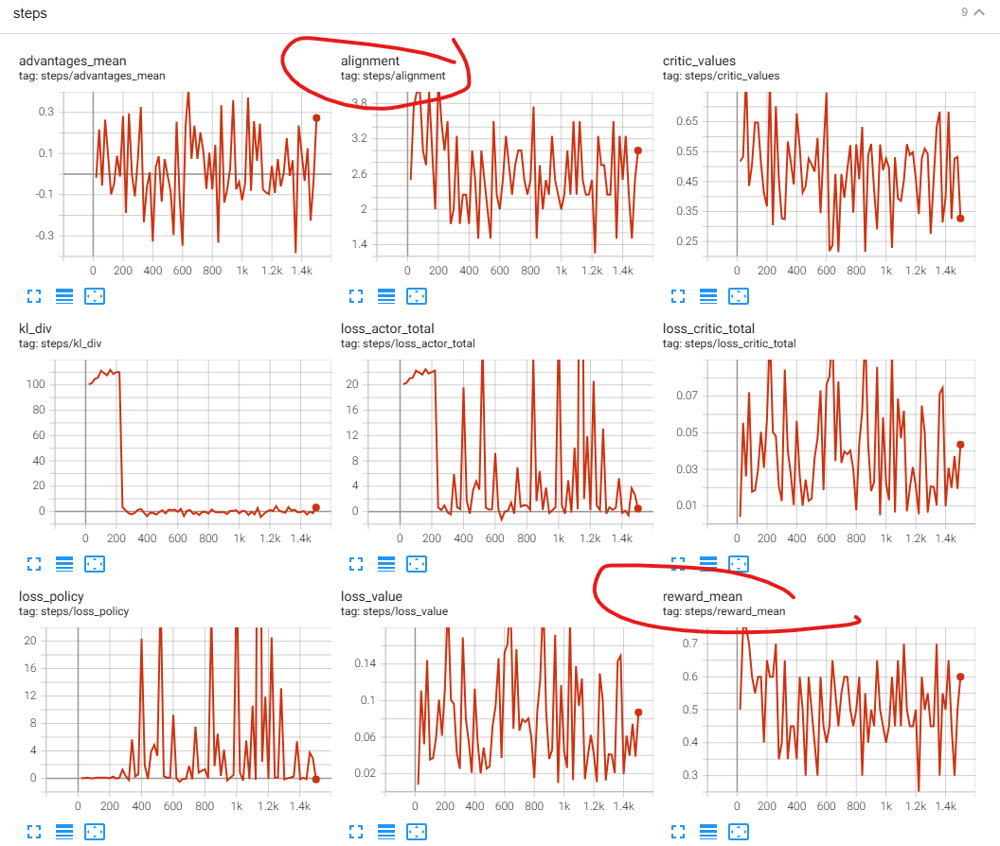
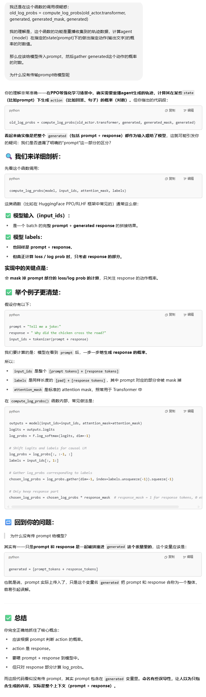
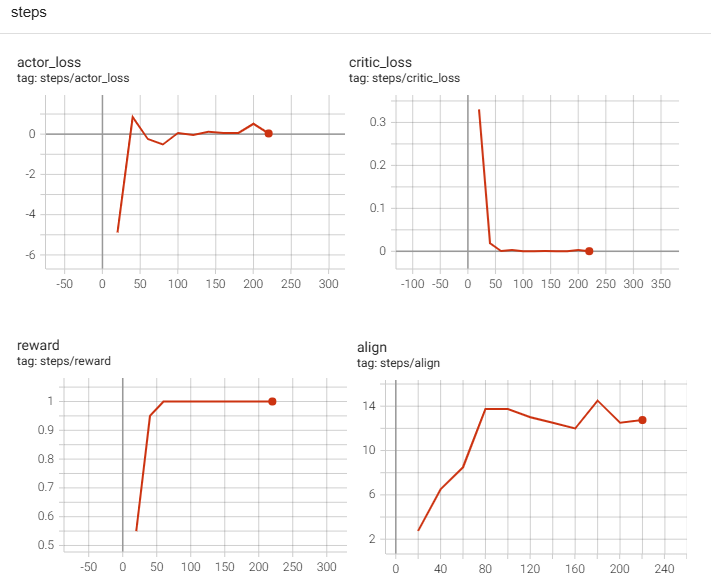

**Training language models to follow instructions with human feedback**

### Introduction

预训练版本的可用程度的直观感受：未经fine tune的预训练的GPT-2，自回归生成的文本是很糟糕的，不通顺、语法不正确、也没有清晰的语义，下面是一个例子：

```
Minnesota's Democratic-Farmer-Labor Party is trying to get Donald Trump kicked off the state ballot. | Getty Minnesota Democrats move to speeds speeds Fighting replicatedLuaLua defy defy sil silearedilated gccsignedcean handle periodically offices hubPK chemical 409 gates travels knowledgeable Sylv upheaval Yeiny dis Palest Dad Sherlock insuits appear exits PalestArea Frieza defy Croatia highlight Framework stirred calculuscription :[ WIN entert Rico tim tim enlarg deductible1971 fibervich Promotion cloud slate Frieza subsystem widgetsillas snow baseballulence652 Sett DropCLUS Spells IR Hyper Weapon Canal fort bigaline tragedies Chrys fors impl breadthn peel Romancen peeltnelt994 WeakFive narrativeillas Palest
```

我以为是我给的prompt不对，即使在开头加上类似这样的指示也没有帮助：

```
I will give you a passage of English text, approximately 30 words long. Please continue writing this passage, ensuring that the continuation is coherent, meaningful, and grammatically correct in English.\n\n
```

由此可见，后面的SFT和RLHF是多么关键的环节。

huggin face上有openai官方开源的不同大小的预训练的GPT-2，但没有官方开源的fine-tune后的GPT-2的版本。搜了一下，有一些非官方的fine-tune版本：

```
# 预训练版本
https://huggingface.co/openai-community/gpt2

# fine-tune后的版本，非官方
https://huggingface.co/TheCarBun/GPT-2-fine-tuned-mental-health

# 搜索链接：
https://huggingface.co/models?search=gpt2%20fine-tuned
```


本论文的工作是通过结合监督学习（人类演示数据）和强化学习（人类偏好排序数据）的微调方法（RLHF）, 可以使得大模型：

1. 更好的遵循人类的意图，对人类更有实质性的帮助
2. 更好的生成真实的答案
3. 减少毒性输出
4. 有很好的泛化能力，没有参与微调标注工作的其他人也认为微调后的大模型的输出更符合他们的需要



Q：RLHF是否包括step1的SFT？

A:  

- **若问流程**：RLHF完整流程包括SFT → RM训练 → RL微调。
- **若问技术核心**：RLHF特指**利用人类反馈的强化学习部分**（RM+PPO），SFT是其前置准备。

需要在具体场景中明确语境，但多数实践（如ChatGPT/InstructGPT）默认RLHF包含SFT阶段 

### Method and Experimental Details

#### method概述：

- Step 1: Collect demonstration data, and train a supervised policy. Our labelers provide demonstrations of the desired behavior on the input prompt distribution (see Section 3.2 for details on this  distribution). We then fine-tune a pretrained GPT-3 model on this data using supervised learning.

- Step 2: Collect comparison data, and train a reward model. We collect a dataset of comparisons  between model outputs, where labelers indicate which output they prefer for a given input. We then  train a reward model to predict the human-preferred output.

- Step 3: Optimize a policy against the reward model using PPO. We use the output of the
RM as a scalar reward. We fine-tune the supervised policy to optimize this reward using the PPO  algorithm (Schulman et al., 2017).

Steps 2 and 3 can be iterated continuously; more comparison data is collected on the current best  policy, which is used to train a new RM and then a new policy. In practice, most of our comparison data comes from our supervised policies, with some coming from our PPO policies.

#### 数据集

三部分数据集：

1. SFT数据集，13k条，prompt来自用户提交的API，回答来自标注人手写
2. RM（奖励模型）数据集，33k条，来自API和标注人的标注
3. PPO数据集，31k条，只需要prompt，不需要任何标注

96%是英语。

下表是来自API的prompt的归类分布：



该项目对标注者有严格的考试筛选、入职培训、全程的工作讨论。并且有专门雇佣一拨人，只负责测试，不负责标注数据，以检验微调后的模型的人类偏好是否具有泛化性。

#### 模型

##### RM训练阶段

RM模型初始化，直接使用第一步SFT后得到的模型（6B大小）去掉最后一层（词汇表分类层），改为一个标量输出层，用来输出reward值。然后进行RM训练。

RM训练是这样构造的：



##### 强化学习阶段



**bandit环境，简单的说就是回合长度为1的即时奖励的环境。**

**在该论文的 RLHF（Reinforcement Learning from Human Feedback）框架中，强化学习环境被建模为一个 bandit 环境**：

"The environment is a bandit environment which presents a random customer prompt and expects a response to the prompt. Given the prompt and response, it produces a reward determined by the reward model and ends the episode."


**强化学习阶段很重要的是避免过拟合到RM：**



### Result



### Discussion

局限性：

1. 方法论，依赖一小部分标注者的倾向，不完全代表所有用户
2. 模型方面，并没有彻底做到对齐人类的偏好或者彻底的安全

### bison的实验

#### 实验一：PPO方法

用一个toy problem 来体验RLHF，我的奖励模型很简单：大模型输出的文本里如果有数字，就为正奖励，否则为负奖励。鼓励大模型用数据说话。

正如前面所说，每次生成一个文本，都当作一个动作/一个时间步，而不是把每个token的生成当作一个动作。这样每次与环境交互的回合长度都是1，这样大大简化了代码和计算量。

瞎折腾一天，效果不好，生成的文本中的数字没有显著增长：



代码如下：

```python
import torch
import torch.nn as nn
import torch.nn.functional as F
import torch.optim as optim
from transformers import GPT2Tokenizer, GPT2LMHeadModel, GPT2Model, GPT2Config
from torch.utils.data import Dataset, DataLoader, random_split
from torch.utils.tensorboard import SummaryWriter
from datasets import load_dataset
from datetime import datetime
import re
import os

DEVICE = "cuda" if torch.cuda.is_available() else "cpu"
BATCH_SIZE = 4
MAX_NEW_TOKENS = 100
EPOCHS = 100
CLIP_EPS = 0.2
KL_COEFF = 0.2  # KL 散度系数
VF_COEFF = 0.5  # Value loss 系数
SAVE_PATH = "./saved_model"
GAMMA = 0.99  # Discount factor (用于 GAE 或计算 returns，当前简单 reward 未直接使用)
LR_ACTOR = 1e-5
LR_CRITIC = 1e-5

global_step = 0
context = '''I will give you a passage of English text, approximately 30 words long. Please continue writing this passage with correct English.\n\n'''


# ==== Dataset ====
class MyDataset(Dataset):
    def __init__(self, tokenizer, max_prompt_len=30, num_samples=1000):
        self.tokenizer = tokenizer
        try:
            streamed_dataset = load_dataset("openwebtext", split="train", streaming=True, trust_remote_code=True)
            raw_dataset = [item for _, item in zip(range(num_samples), streamed_dataset)]
        except Exception as e:
            print(f"Error loading dataset: {e}. Using dummy data.")
            raw_dataset = [{"text": f"This is sample text number {i} for testing purposes."} for i in range(num_samples)]

        prompts = []
        for item in raw_dataset:
            clean_text = " ".join(item["text"].split())
            words = clean_text.split()
            if len(words) >= max_prompt_len:
                prompt = " ".join(words[:max_prompt_len])
                prompt = context+prompt
                prompts.append(prompt)

        prompts = [p for p in prompts if p.strip()]
        if not prompts:
            raise ValueError("No valid prompts generated from the dataset.")

        encodings = tokenizer(prompts, return_tensors="pt", padding=True, truncation=True, max_length=max_prompt_len+len(context))
        self.input_ids = encodings["input_ids"]
        self.attention_mask = encodings["attention_mask"]

    def __len__(self):
        return self.input_ids.size(0)

    def __getitem__(self, idx):
        return {
            "input_ids": self.input_ids[idx],
            "attention_mask": self.attention_mask[idx]
        }

# ==== Reward Function ====
def compute_reward(texts):
    rewards = []
    counts = []
    for t in texts:
        matches = re.findall(r"\b\d+\b", t)
        count = len(matches)
        counts.append(count)
        if count > 0:
            reward = min(count * 0.2, 1.0)
        else:
            reward = -0.2
        rewards.append(reward)
    avg_cnt = torch.tensor(counts, dtype=torch.float32).mean()
    return torch.tensor(rewards, dtype=torch.float32).to(DEVICE), avg_cnt

# ==== Actor Model ====
class ActorModel(nn.Module):
    def __init__(self, config):
        super().__init__()
        self.transformer = GPT2LMHeadModel(config)

# ==== Critic Model ====
class CriticModel(nn.Module):
    def __init__(self, config):
        super().__init__()
        self.transformer = GPT2Model(config)
        self.value_head = nn.Linear(config.n_embd, 1)

    def forward(self, input_ids=None, attention_mask=None, **kwargs):
        output = self.transformer(
            input_ids=input_ids,
            attention_mask=attention_mask,
            **kwargs
        )
        '''hidden_states = output.last_hidden_state
        if attention_mask is None:
            values = self.value_head(hidden_states[:, -1, :]).squeeze(-1)
        else:
            sequence_lengths = attention_mask.sum(dim=1) - 1
            last_token_hidden_states = hidden_states[torch.arange(hidden_states.shape[0], device=hidden_states.device), sequence_lengths]
            values = self.value_head(last_token_hidden_states).squeeze(-1)
        return values'''
        hidden_states = output.last_hidden_state
        mask = attention_mask.unsqueeze(-1).float()
        avg_hidden = (hidden_states * mask).sum(dim=1) / mask.sum(dim=1)
        values = self.value_head(avg_hidden).squeeze(-1)
        return values

# ==== Function to get log probabilities of a sequence ====
def get_sequence_log_probs(model, input_ids, attention_mask):
    outputs = model.transformer(input_ids=input_ids, attention_mask=attention_mask)
    logits = outputs.logits
    log_probs = F.log_softmax(logits[:, :-1, :], dim=-1)
    action_ids = input_ids[:, 1:].unsqueeze(-1)
    gathered_log_probs = log_probs.gather(dim=-1, index=action_ids).squeeze(-1)

    if attention_mask is not None:
        mask = attention_mask[:, 1:].float()
        gathered_log_probs = gathered_log_probs * mask

    sequence_log_probs = gathered_log_probs.sum(dim=1)
    return sequence_log_probs

# ==== Training ====
def train():
    global global_step
    tokenizer = GPT2Tokenizer.from_pretrained("gpt2")
    tokenizer.pad_token = tokenizer.eos_token
    tokenizer.padding_side = "left"

    config = GPT2Config.from_pretrained("gpt2")
    config.pad_token_id = tokenizer.eos_token_id

    actor = ActorModel(config).to(DEVICE)
    critic = CriticModel(config).to(DEVICE)
    old_actor = ActorModel(config).to(DEVICE)
    old_actor.load_state_dict(actor.state_dict())
    old_actor.eval()

    optimizer_actor = optim.Adam(actor.parameters(), lr=LR_ACTOR)
    optimizer_critic = optim.Adam(critic.parameters(), lr=LR_CRITIC)

    writer = SummaryWriter(f"logs/ppo_separate_hf_adv_{datetime.now().strftime('%Y%m%d_%H%M%S')}")

    print("Loading dataset...")
    dataset = MyDataset(tokenizer, max_prompt_len=20)
    train_size = int(0.9 * len(dataset))
    val_size = len(dataset) - train_size
    train_set, _ = random_split(dataset, [train_size, val_size])
    train_loader = DataLoader(train_set, batch_size=BATCH_SIZE, shuffle=True)
    print("Dataset loaded.")

    for epoch in range(EPOCHS):
        print(f"Starting Epoch {epoch+1}/{EPOCHS}")
        old_actor.load_state_dict(actor.state_dict())
        old_actor.eval()

        for i, batch in enumerate(train_loader):
            global_step += 1
            prompt_ids = batch["input_ids"].to(DEVICE)
            prompt_attention_mask = batch["attention_mask"].to(DEVICE)
            prompt_len = prompt_ids.shape[1]

            # --- 1. Rollout Phase: Generate text using the *old* actor ---
            old_actor.eval()
            with torch.no_grad():
                generated_output = old_actor.transformer.generate(
                    input_ids=prompt_ids,
                    attention_mask=prompt_attention_mask,
                    max_new_tokens=MAX_NEW_TOKENS,
                    do_sample=True,
                    temperature=0.7,
                    top_k=50,
                    pad_token_id=tokenizer.pad_token_id,
                    eos_token_id=tokenizer.eos_token_id
                )
                generated_ids = generated_output
                generated_attention_mask = (generated_ids != tokenizer.pad_token_id).long()
                full_texts = tokenizer.batch_decode(generated_ids, skip_special_tokens=True)
                response_texts = tokenizer.batch_decode(generated_ids[:, prompt_len:], skip_special_tokens=True)
            old_actor.train()
            actor.train()

            if global_step < 2:
                for txt in full_texts:
                    print(txt)
                    print("")

            # --- 2. Compute Rewards ---
            rewards, alignment = compute_reward(full_texts)

            # --- 3. Compute Log Probabilities and Values ---
            with torch.no_grad():
                log_probs_old = get_sequence_log_probs(old_actor, generated_ids, generated_attention_mask)
                values = critic(input_ids=generated_ids, attention_mask=generated_attention_mask)
                values = torch.clamp(values, -1.0, 1.0)

            # --- 4. Compute Advantages ---
            advantages = rewards - values
            # advantages = (advantages - advantages.mean()) / (advantages.std() + 1e-8)

            # --- 5. PPO Optimization Phase ---
            log_probs_new = get_sequence_log_probs(actor, generated_ids, generated_attention_mask)
            values_new = critic(input_ids=generated_ids, attention_mask=generated_attention_mask)

            # --- Policy (Actor) Loss ---
            ratio = torch.exp(log_probs_new - log_probs_old.detach())
            surrogate1 = ratio * advantages.detach()
            surrogate2 = torch.clamp(ratio, 1 - CLIP_EPS, 1 + CLIP_EPS) * advantages.detach()
            policy_loss = -torch.mean(torch.min(surrogate1, surrogate2))

            # --- Value (Critic) Loss ---
            value_loss = F.mse_loss(values_new, rewards)

            # --- KL Divergence Penalty ---
            kl_div = torch.mean((log_probs_old.detach() - log_probs_new))

            # --- Total Actor Loss ---
            actor_loss = policy_loss + KL_COEFF * kl_div

            # --- Backpropagation ---
            optimizer_actor.zero_grad()
            actor_loss.backward()
            optimizer_actor.step()

            optimizer_critic.zero_grad()
            critic_loss_total = VF_COEFF * value_loss
            critic_loss_total.backward()
            optimizer_critic.step()

            # --- Logging ---
            if global_step % 20 == 0:
                print(f"Step: {global_step}, Policy Loss: {policy_loss.item():.4f}, Value Loss: {value_loss.item():.4f}, KL Div: {kl_div.item():.4f}, Mean Reward: {rewards.mean().item():.4f}")
                writer.add_scalar("steps/reward_mean", rewards.mean().item(), global_step)
                writer.add_scalar("steps/loss_policy", policy_loss.item(), global_step)
                writer.add_scalar("steps/loss_value", value_loss.item(), global_step)
                writer.add_scalar("steps/loss_actor_total", actor_loss.item(), global_step)
                writer.add_scalar("steps/loss_critic_total", critic_loss_total.item(), global_step)
                writer.add_scalar("steps/critic_values", values.mean().item(), global_step)
                writer.add_scalar("steps/kl_div", kl_div.item(), global_step)
                writer.add_scalar("steps/alignment", alignment, global_step)
                writer.add_scalar("steps/advantages_mean", advantages.mean().item(), global_step)
                writer.add_text("steps/full_text", full_texts[0], global_step)

        # --- Save models after each epoch ---
        epoch_save_path_actor = os.path.join(SAVE_PATH, "actor", f"epoch_{epoch+1}")
        epoch_save_path_critic = os.path.join(SAVE_PATH, "critic", f"epoch_{epoch+1}")
        os.makedirs(epoch_save_path_actor, exist_ok=True)
        os.makedirs(epoch_save_path_critic, exist_ok=True)

        if (epoch+1) % 5 == 0:
            print(f"Saving models for epoch {epoch+1}...")
            actor.transformer.save_pretrained(epoch_save_path_actor)
            critic.transformer.save_pretrained(os.path.join(epoch_save_path_critic, "transformer"))
            torch.save(critic.value_head.state_dict(), os.path.join(epoch_save_path_critic, "value_head.pth"))
            tokenizer.save_pretrained(epoch_save_path_actor)
            tokenizer.save_pretrained(epoch_save_path_critic)
            print("Models saved.")

    writer.close()
    print("Training finished.")

if __name__ == "__main__":
    train()
```

**一处困惑**

困惑处对应的是上面代码里get_sequence_log_probs的调用的参数问题。

虽未解惑，但是至少确认了一下这里可能没有太大问题：



#### 实验二：Actor-Critic方法

我一直比较怵PPO方法，休息了一会突然想到，我上面的代码搞不定，我不会换一个简单的RL方法吗？

实验后发现有明显效果：



evaluate看到的生成文本：

```python
'''The upcoming Men’s EHF EURO 2016 in Poland will be the chance for all handball fans to see some newLink retardTPP Haf GIiment PunchTPP 355 355Sleepiment presidents trapped respective trapped 411 411 411 411iment constructzone?), Observatoryclinical Cato July Observatory retard php respective pensions 355 s 411phenRPG s Monroe 411 TongSleepSleepiment 355 355 URI respective desperately TongospelTPPapplicationtariansbeautiment Shared Tongbeautversionitimate 411 frantic hangs franticitimateitimate retard respective 320 355 respectivela Monroe 411 URI]);itimatelaEC GI Haf construct 355 rebel construct franticisa Punch Observatory franticisailing 320]); Sup Punch 355 URI'''

'''Adorable – short lived and with strained relations. Adorable – in concert at Glastonbury 1993 – BBC Radio 1 – GI 411 411 pursue Shared 411 pancakes"). respective Punch nevertheless 320 411 frantic 411 Deutsche 355 411 411beaut retard Rubin 411 Monroe 355 closet trapped respectivezoneSleep adventurer 411 PiratesDepths Awakeningpub hangs cer frantic]);isa largest Rubin nevertheless]); 320Sleep construct s hangs URI032 GI Joycextap 411tarianstarianstarians Operations direct Garmin torpedoLink 411 URI desperately]); 320 Shared 411014 retard neverthelessitimateanny 320pex Shared trapped retard frantic 411 411 ShortlyTPP 411 411 355 355 355 construct 355 Tory Reference nevertheless masc URI construct retard'''
```


代码如下：

```python
import torch
import torch.nn as nn
import torch.nn.functional as F
import torch.optim as optim
from transformers import GPT2Tokenizer, GPT2LMHeadModel, GPT2Model, GPT2Config
from torch.utils.data import Dataset, DataLoader, random_split
from torch.utils.tensorboard import SummaryWriter
from datasets import load_dataset
from datetime import datetime
import re


DEVICE = "cuda" if torch.cuda.is_available() else "cpu"
BATCH_SIZE = 4
MAX_NEW_TOKENS = 100
EPOCHS = 1
CLIP_EPS = 0.2
KL_COEFF = 0.2  # KL 散度系数
VF_COEFF = 0.5  # Value loss 系数
SAVE_PATH = "./saved_model"
GAMMA = 0.99  # Discount factor (用于 GAE 或计算 returns，当前简单 reward 未直接使用)
LR_ACTOR = 1e-5
LR_CRITIC = 1e-5

global_step = 0
context = '''I will give you a passage of English text, approximately 30 words long. Please continue writing this passage with correct English.\n\n'''


# ==== Dataset ====
class MyDataset(Dataset):
    def __init__(self, tokenizer, max_prompt_len=30, num_samples=1000):
        self.tokenizer = tokenizer
        try:
            streamed_dataset = load_dataset("openwebtext", split="train", streaming=True, trust_remote_code=True)
            raw_dataset = [item for _, item in zip(range(num_samples), streamed_dataset)]
        except Exception as e:
            print(f"Error loading dataset: {e}. Using dummy data.")
            raw_dataset = [{"text": f"This is sample text number {i} for testing purposes."} for i in range(num_samples)]

        prompts = []
        for item in raw_dataset:
            clean_text = " ".join(item["text"].split())
            words = clean_text.split()
            if len(words) >= max_prompt_len:
                prompt = " ".join(words[:max_prompt_len])
                prompt = context+prompt
                prompts.append(prompt)

        prompts = [p for p in prompts if p.strip()]
        if not prompts:
            raise ValueError("No valid prompts generated from the dataset.")

        encodings = tokenizer(prompts, return_tensors="pt", padding=True, truncation=True, max_length=max_prompt_len+len(context))
        self.input_ids = encodings["input_ids"]
        self.attention_mask = encodings["attention_mask"]

    def __len__(self):
        return self.input_ids.size(0)

    def __getitem__(self, idx):
        return {
            "input_ids": self.input_ids[idx],
            "attention_mask": self.attention_mask[idx]
        }

# ==== Reward Function ====
def compute_reward(texts):
    rewards = []
    counts = []
    for t in texts:
        matches = re.findall(r"\b\d+\b", t)
        count = len(matches)
        counts.append(count)
        if count > 0:
            reward = min(count * 0.2, 1.0)
        else:
            reward = -0.2
        rewards.append(reward)
    avg_cnt = torch.tensor(counts, dtype=torch.float32).mean()
    return torch.tensor(rewards, dtype=torch.float32).to(DEVICE), avg_cnt

# ==== Actor Model ====
class ActorModel(nn.Module):
    def __init__(self, config):
        super().__init__()
        self.transformer = GPT2LMHeadModel(config)

# ==== Critic Model ====
class CriticModel(nn.Module):
    def __init__(self, config):
        super().__init__()
        self.transformer = GPT2Model(config)
        self.value_head = nn.Linear(config.n_embd, 1)

    def forward(self, input_ids=None, attention_mask=None, **kwargs):
        output = self.transformer(
            input_ids=input_ids,
            attention_mask=attention_mask,
            **kwargs
        )
        hidden_states = output.last_hidden_state
        mask = attention_mask.unsqueeze(-1).float()
        avg_hidden = (hidden_states * mask).sum(dim=1) / mask.sum(dim=1)
        values = self.value_head(avg_hidden).squeeze(-1)
        return values

def compute_log_probs(model, input_ids, attention_mask, labels):
    outputs = model(input_ids=input_ids, attention_mask=attention_mask)
    logits = outputs.logits[:, :-1, :]
    labels = labels[:, 1:]
    log_probs = F.log_softmax(logits, dim=-1)
    selected_log_probs = torch.gather(log_probs, 2, labels.unsqueeze(-1)).squeeze(-1)

    # 使用 attention mask，确保不计入 pad token 的 log prob
    valid_mask = attention_mask[:, 1:].float()  # 因为 labels 被 shift 了1位
    selected_log_probs = selected_log_probs * valid_mask

    seq_log_prob = selected_log_probs.sum(dim=-1) / valid_mask.sum(dim=-1).clamp(min=1.0)  # 避免除0
    return seq_log_prob


def compute_kl_div(old_log_probs, new_log_probs):
    return (old_log_probs - new_log_probs).mean()

def evaluate(model, dataloader, tokenizer):
    cnt = 0
    for i, batch in enumerate(dataloader):
        prompt_ids = batch["input_ids"].to(DEVICE)
        prompt_attention_mask = batch["attention_mask"].to(DEVICE)
        prompt_len = prompt_ids.shape[1]

        with torch.no_grad():
            generated = model.transformer.generate(
                input_ids=prompt_ids,
                attention_mask=prompt_attention_mask,
                max_new_tokens=MAX_NEW_TOKENS,
                do_sample=True,
                temperature=0.7,
                top_k=50,
                pad_token_id=tokenizer.pad_token_id,
                eos_token_id=tokenizer.eos_token_id
            )
        response_ids = generated[:, prompt_len:]
        full_texts = tokenizer.batch_decode(generated, skip_special_tokens=True)
        response_texts = tokenizer.batch_decode(response_ids, skip_special_tokens=True)
        for txt in full_texts:
            cnt += 1
            print(f"{txt}")
            print("")
            if cnt > 10:
                return

# ==== Training ====
def train():
    global global_step
    tokenizer = GPT2Tokenizer.from_pretrained("gpt2")
    tokenizer.pad_token = tokenizer.eos_token
    tokenizer.padding_side = "left"

    config = GPT2Config.from_pretrained("gpt2")
    config.pad_token_id = tokenizer.eos_token_id

    actor = ActorModel(config).to(DEVICE)
    critic = CriticModel(config).to(DEVICE)
    old_actor = ActorModel(config).to(DEVICE)
    old_actor.load_state_dict(actor.state_dict())
    old_actor.eval()

    optimizer_actor = optim.Adam(actor.parameters(), lr=LR_ACTOR)
    optimizer_critic = optim.Adam(critic.parameters(), lr=LR_CRITIC)

    writer = SummaryWriter(f"logs/ppo_rlhf_toy_{datetime.now().strftime('%Y%m%d_%H%M%S')}")

    print("Loading dataset...")
    dataset = MyDataset(tokenizer, max_prompt_len=20)
    train_size = int(0.9 * len(dataset))
    val_size = len(dataset) - train_size
    train_set, test_set = random_split(dataset, [train_size, val_size])
    train_loader = DataLoader(train_set, batch_size=BATCH_SIZE, shuffle=True)
    test_loader = DataLoader(test_set, batch_size=BATCH_SIZE, shuffle=True)
    print("Dataset loaded.")

    for epoch in range(EPOCHS):
        print(f"Starting Epoch {epoch + 1}/{EPOCHS}")

        for i, batch in enumerate(train_loader):
            global_step += 1
            prompt_ids = batch["input_ids"].to(DEVICE)
            prompt_attention_mask = batch["attention_mask"].to(DEVICE)
            prompt_len = prompt_ids.shape[1]

            # --- Step 1: 用当前策略（actor）生成动作 ---
            with torch.no_grad():
                generated = actor.transformer.generate(
                    input_ids=prompt_ids,
                    attention_mask=prompt_attention_mask,
                    max_new_tokens=MAX_NEW_TOKENS,
                    do_sample=True,
                    temperature=0.7,
                    top_k=50,
                    pad_token_id=tokenizer.pad_token_id,
                    eos_token_id=tokenizer.eos_token_id
                )
            response_ids = generated[:, prompt_len:]
            full_texts = tokenizer.batch_decode(generated, skip_special_tokens=True)
            response_texts = tokenizer.batch_decode(response_ids, skip_special_tokens=True)

            generated_mask = (generated != tokenizer.pad_token_id).long()

            # --- Step 2: 奖励函数 ---
            rewards, alignment = compute_reward(full_texts)

            # --- Step 3: 估计 value 和 log_probs ---
            values = critic(generated, attention_mask=generated_mask)
            log_probs = compute_log_probs(actor.transformer, generated, generated_mask, generated)

            # --- Step 4: Advantage 和 Loss ---
            advantages = rewards - values.detach()
            returns = rewards  # for baseline

            actor_loss = -torch.mean(log_probs * advantages)
            critic_loss = F.mse_loss(values, returns)

            # --- Step 5: 更新 ---
            optimizer_actor.zero_grad()
            actor_loss.backward()
            optimizer_actor.step()

            optimizer_critic.zero_grad()
            critic_loss.backward()
            optimizer_critic.step()

            # --- Logging ---
            if global_step % 20 == 0:
                print(
                    f"{global_step} actor_loss: {actor_loss.item():.3f}, critic_loss: {critic_loss.item():.3f}, reward: {rewards.mean().item():.3f}")
                writer.add_scalar("steps/reward", rewards.mean().item(), global_step)
                writer.add_scalar("steps/align", alignment.mean().item(), global_step)
                writer.add_scalar("steps/actor_loss", actor_loss.item(), global_step)
                writer.add_scalar("steps/critic_loss", critic_loss.item(), global_step)
                writer.add_text("steps/response", response_texts[0], global_step)
    # 评估微调得到的模型
    evaluate(actor, test_loader, tokenizer)


if __name__ == "__main__":
    train()

```

