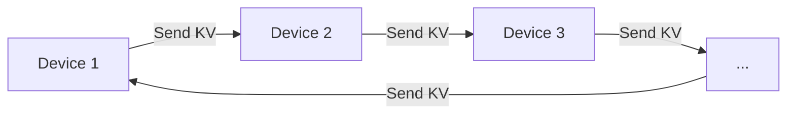

# Ring Attention with Blockwise Transformers for Near-Infinite Context

## 1. 论文解决的核心问题

Transformer模型在处理**超长序列**时面临严重的**内存瓶颈**：

- **根本原因**：标准Transformer的自注意力机制需要 $O(n^2)$ 内存（$n$ 为序列长度），即使采用内存高效计算（blockwise computation），仍需存储每层的完整输出
- **现实困境**：处理1亿token（batch size=1, hidden size=1024）需要 >1000GB内存，而现代GPU/TPU通常仅有 <100GB 高带宽内存（HBM）
- **现有方案局限**：
  - Memory Efficient Attention [30]：降低注意力计算内存，但输出存储仍为瓶颈
  - Blockwise Parallel Transformers (BPT) [23]：将FFN也块级计算，激活内存降至 $2bsh$，但输出存储问题仍未解决

**论文目标**：消除单设备内存限制，使上下文长度能随设备数量**线性扩展**，实现"近无限"上下文（near-infinite context）。

## 2. 解决方案：Ring Attention

### 核心思想

将**块级计算**（blockwise computation）与**环形通信拓扑**（ring topology）结合，实现通信与计算的完全重叠：



### 关键技术

#### (1) 利用排列不变性（Permutation Invariance）
自注意力内层循环中，query block 与多个 key-value blocks 的计算顺序可任意交换，只要正确组合统计量用于重缩放（rescaling）。这使得可在环上顺序传递KV块。

#### (2) 环形通信机制
- 将 $N$ 个设备组织成逻辑环：host-1 → host-2 → ... → host-N → host-1
- 每个设备负责：
  - 外层循环：处理自己的 query block
  - 内层循环：依次与环中所有设备的 KV blocks 计算注意力
  - **关键优化**：计算当前块注意力时，**同时**将本地KV发送给下一设备，并从上一设备接收新KV

#### (3) 通信-计算重叠
当满足以下条件时，通信可被计算完全掩盖，实现**零额外开销**：

$$
\text{计算时间} \geq \text{通信时间} \quad \Rightarrow \quad c \geq \frac{F}{B}
$$

其中：
- $c$ = 块大小（block size）
- $F$ = 设备FLOPS
- $B$ = 设备间带宽

#### (4) 内存需求分析

每个设备需存储6个块：
- 1个 query block
- 2个当前 key/value blocks
- 2个接收中的 key/value blocks
- 1个输出 block

总内存需求（每层）：
```
6bch bytes  （b=batch size, c=block size, h=hidden size）
```

**关键优势**：内存需求与总序列长度 $s$ **无关**，仅与块大小 $c$ 线性相关。

#### (5) 最小序列长度要求
为满足重叠条件，每设备需处理的最小序列长度：
$$
s_{\text{min}} = 6c \quad \text{其中} \quad c \geq \frac{F}{B}
$$

典型硬件要求（见论文Table 2）：
| 硬件              | 最小块大小 | 最小序列长度 |
| ----------------- | ---------- | ------------ |
| A100 (NVLink)     | ~1K        | ~6K          |
| TPUv4             | ~1K        | ~6K          |
| A100 (InfiniBand) | ~24.5K     | ~149.5K      |

## 3. 解决效果

### (1) 上下文长度扩展能力（Table 3）

| 硬件配置   | 模型 | Vanilla | Memory Efficient Attn | BPT (SOTA) | **Ring Attention (Ours)** | **提升倍数** |
| ---------- | ---- | ------- | --------------------- | ---------- | ------------------------- | ------------ |
| 8×A100     | 3B   | 4K      | 32K                   | 64K        | **512K**                  | **8×**       |
| 32×A100    | 7B   | 4K      | 64K                   | 128K       | **4M**                    | **32×**      |
| TPUv4-1024 | 3B   | 8K      | 16K                   | 32K        | **16M**                   | **512×**     |
| TPUv4-1024 | 30B  | 2K      | 4K                    | 8K         | **2M**                    | **256×**     |

**核心结论**：上下文长度与设备数**线性扩展**——使用 $n$ 个设备可处理比单设备长 $n$ 倍的序列。

### (2) 计算效率（MFU）

- 在大幅增加上下文长度（如7B模型从32K→256K）时，MFU与baseline（BPT）**几乎无差异**
- 证明通信被计算完全掩盖，**无额外开销**
- 可训练>100M tokens上下文，且不牺牲吞吐量

### (3) 实际应用效果

#### 语言建模（Line Retrieval Task）
- **设置**：微调LLaMA-13B至512K上下文
- **结果**：在长上下文下保持高准确率，而GPT-3.5-16K/Vicuna-16B-16K/Claude-2-100K在长上下文下性能急剧下降
- **意义**：证明超长上下文对复杂推理任务的实际价值

#### 强化学习（ExoRL Benchmark）
- **设置**：Action Transformer处理128条轨迹（每条1000步）vs baseline的32条
- **结果**：所有6个任务性能提升，平均return从111.13→113.66
- **意义**：更长上下文使模型能利用更多历史经验，提升决策质量

### (4) 核心优势总结

| 特性             | 说明                                   |
| ---------------- | -------------------------------------- |
| **线性扩展**     | 上下文长度 ∝ 设备数量                  |
| **无近似**       | 精确计算注意力，不牺牲模型质量         |
| **零通信开销**   | 通过重叠实现，理论与实测一致           |
| **兼容现有方案** | 可与FSDP、Tensor Parallelism等组合使用 |
| **实用性强**     | 最小序列要求低（~6K tokens），易满足   |

## 4. 局限与展望

- **训练FLOPs增长**：上下文长度增加导致每样本FLOPs上升（但非平方级增长），论文Figure 5详细分析了不同模型规模下的FLOPs增长比例
- **未来方向**：支持超长视频-音频-语言模型、科学数据理解（基因序列）、大规模代码库分析等需要"近无限"上下文的应用场景

> **核心贡献**：首次实现**无近似、零通信开销**的超长上下文Transformer，将上下文长度瓶颈从"单设备内存"转移到"可用设备数量"，为真正的大上下文AI模型铺平道路。

## 5 Ring Attention 的实际应用现状

### 1. **尚未成为主流生产方案**

Ring Attention（论文发表于2023年10月，arXiv:2310.01889）目前**主要停留在学术研究和实验阶段**，**并未被主流大模型平台作为默认方案采用**。原因包括：

| 因素             | 说明                                                         |
| ---------------- | ------------------------------------------------------------ |
| **发布时间较新** | 2023年底提出，工业界大规模部署需要1-2年验证周期              |
| **工程复杂度**   | 需要定制环形通信拓扑 + 与FSDP/Tensor Parallelism组合，集成成本高 |
| **硬件依赖**     | 要求高带宽互联（如NVLink/TPU ICI），普通InfiniBand集群效率受限（见论文Table 2） |
| **替代方案成熟** | 其他长上下文技术已广泛部署且效果足够                         |

### 2. **主流平台的实际长上下文方案**

当前生产环境主要采用**组合策略**，而非Ring Attention：

| 平台/框架           | 长上下文技术方案                                    | 典型上下文长度       |
| ------------------- | --------------------------------------------------- | -------------------- |
| **Meta Llama 2/3**  | FlashAttention-2 + RoPE插值 + 分组查询注意力(GQA)   | 128K (Llama 3)       |
| **vLLM推理引擎**    | PagedAttention（分页KV Cache）+ Continuous Batching | 支持100K+            |
| **DeepSpeed**       | Ulysses序列并行（论文[17]）+ ZeRO优化               | 实验性支持超长上下文 |
| **Mistral/Mixtral** | Sliding Window Attention + RoPE扩展                 | 32K-128K             |
| **Google Gemma**    | GQA + 优化的KV Cache管理                            | 8K-32K               |

> 🔍 **关键区别**：Ring Attention通过**环形通信分发序列维度**消除单设备内存瓶颈；而主流方案主要通过**优化KV Cache存储**（如PagedAttention）和**近似计算**（如MQA）降低内存，仍受限于单设备内存。

### 3. **Ring Attention的实际应用场景**

目前主要在以下场景有探索性应用：

- **学术研究**：UC Berkeley RLL/BAIR团队在ExoRL等RL任务中验证（论文Table 5）
- **超长序列实验**：部分研究机构用其训练>100M token上下文的模型（如基因序列、长视频分析）
- **开源实现**：作者开源的 [llm_large_context](https://github.com/lhao499/llm_large_context) 主要用于JAX/TPU环境实验

### 4. **为什么未被广泛采用？**

1. **边际收益递减**：多数应用128K上下文已足够，百万级上下文需求场景有限
2. **FLOPs成本高**：上下文从4K→1M，训练FLOPs增加20-40倍（论文Figure 5），经济性差
3. **工程替代方案**：FlashAttention-3（2024）+ 位置编码优化已能支持128K-256K，无需复杂通信拓扑
4. **推理瓶颈**：Ring Attention主要解决**训练**内存问题，而生产环境更关注**推理延迟**，此时KV Cache优化更关键

### 5. **未来展望**

Ring Attention的核心思想（**通信-计算重叠 + 序列维度分片**）可能以其他形式融入未来系统：
- 与**MoE架构**结合处理超长上下文
- 在**科学计算**（如蛋白质折叠、气候模拟）等特定领域找到应用场景
- 作为**混合方案**的一部分：短上下文用常规Attention，超长上下文触发Ring模式

> 💡 **总结**：Ring Attention是一项有理论价值的创新，但受限于工程复杂度和实际需求，**目前未被任何主流计算平台（AWS SageMaker、Google Vertex AI、Azure ML等）默认采用**。工业界更倾向于"够用就好"的轻量级方案（如FlashAttention + RoPE扩展）。