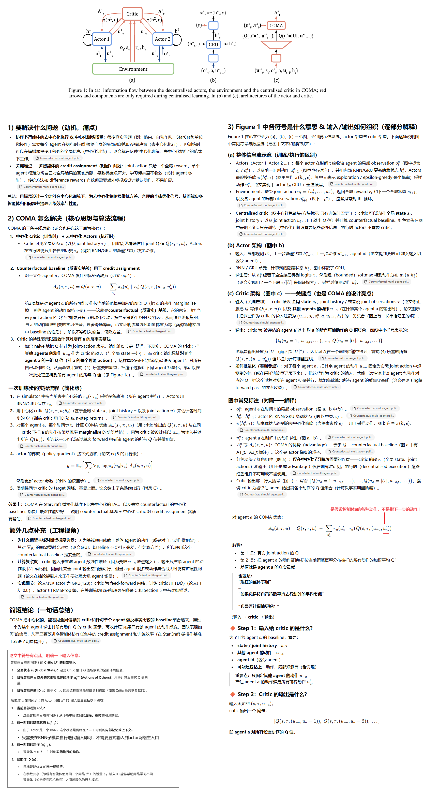
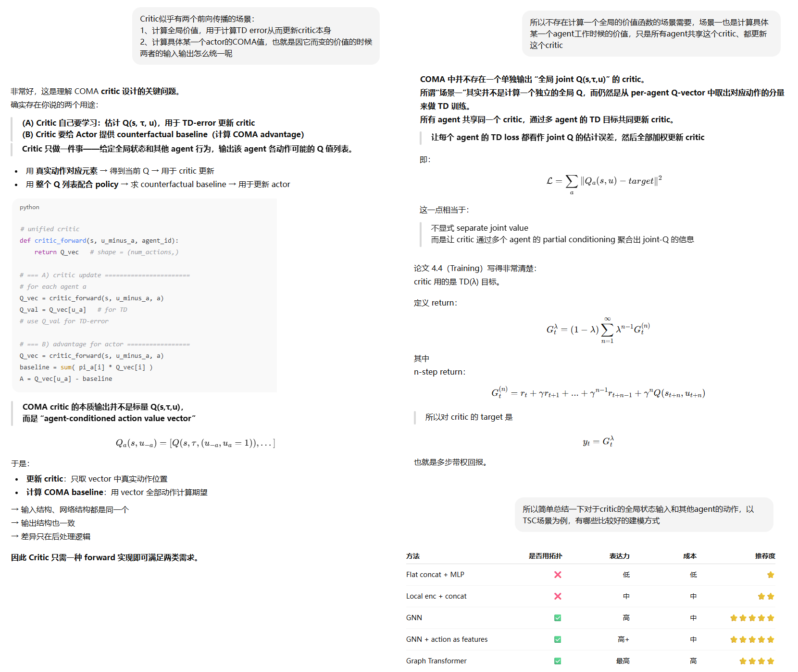
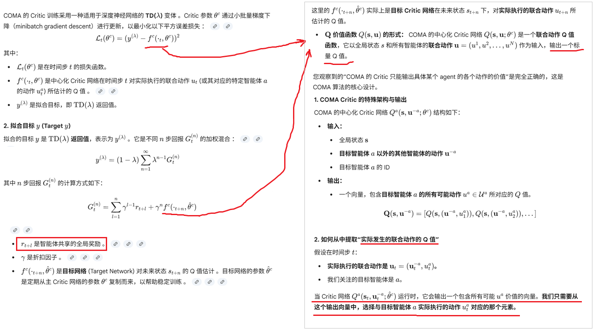
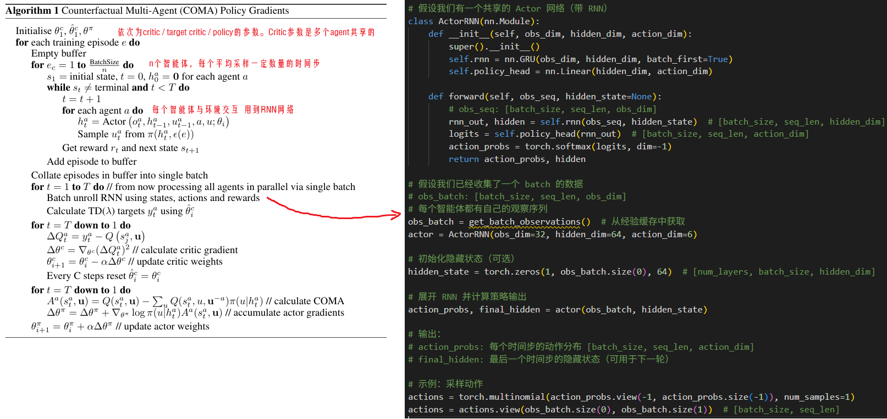
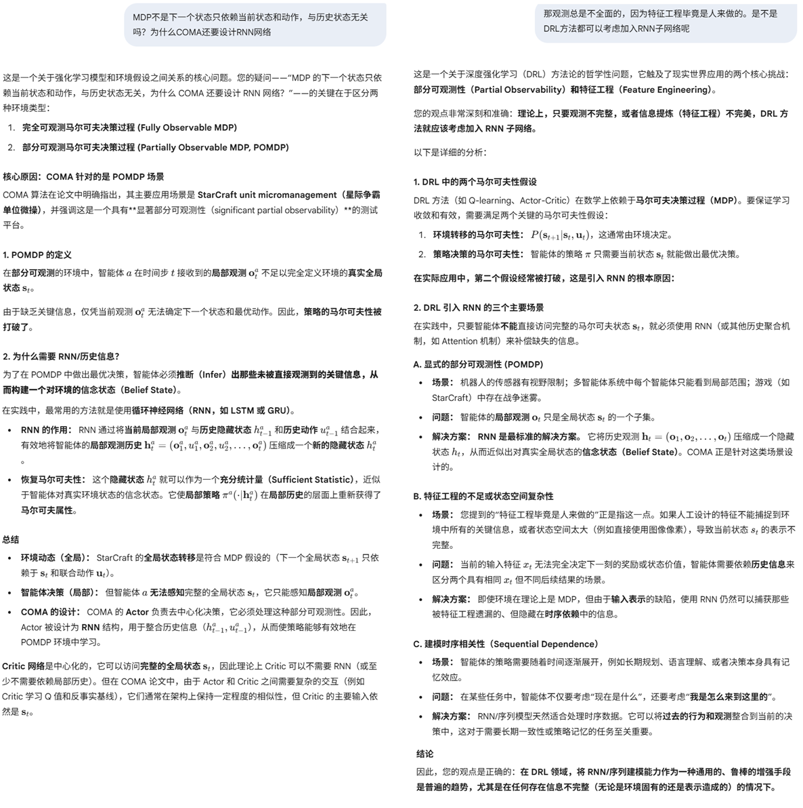
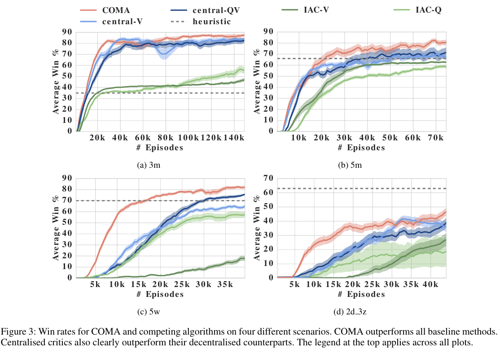

**Counterfactual Multi-Agent Policy Gradients**

### 1 Introduction

多智能体场景下，一个挑战是：credit assignment：各agent的联合动作产生了全局的奖励，难以推导每个agent的动作的独特贡献。一个解决方法是使用独立的reward设计，但是这样不能鼓励agent牺牲局部回报以获得全局最优。

我们提出一个方法：反事实多智能体方法（COMA）：

1. 所有agent共享同一份actor / critic网络。critic是中心化的，它可以在训练阶段拿到全局信息，包括全局观测和全局动作
2. COMA使用反事实基线，作为actor的动作优势
3. COMA巧妙设计了一种critic结构，使得反事实基线的计算和全局Q价值的计算都非常高效

我们在StarCraft环境下评测，COMA取得了SOTA性能。

### 2 Related Work

介绍了业界各种RL多智能体的工作

### 3 Background

介绍了DRL的各种技术/算法。

### 4 Method

我们的方法，只学习一份actor和一份critic参数，所有agent共享这份actor-critic参数。因为他们会收到不同的观测和agent-id信息，所以agent可以有不同的行为。

尽管所有智能体共享**同一套**网络参数，但由于每个智能体执行的操作和接收的信息都是**独立的、去中心化的**，因此它们的 RNN 隐藏状态必须**独立保存和更新**。在每次前向传播时，必须为每个智能体独立地维护和输入其前一时刻的隐藏状态

#### 反事实的思想



#### Critic的巧妙设计



#### Critic网络的损失函数



#### 伪代码描述算法



#### 疑问



### 5 Experiments



### 6 Conclusion

未来的工作，包括扩展COMA以应对数量更多agent的场景，那里中心化的critic更难训练、探索更难协同；我们还将开发样本效率更高的COMA变体，这样对于现实世界应用更有实际意义，例如自动驾驶场景。

### 代码开放

没有找到官方开放的代码，网上有开放代码：

```
https://github.com/jianzhnie/deep-marl-toolkit
https://github.com/matteokarldonati/Counterfactual-Multi-Agent-Policy-Gradients
https://github.com/Bigpig4396/PyTorch-Counterfactual-Multi-Agent-Policy-Gradients-COMA
```

