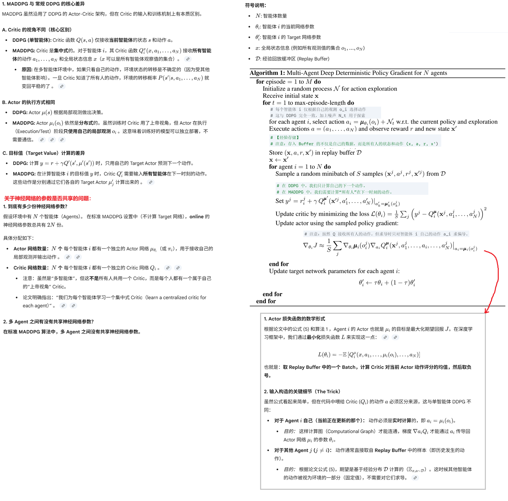
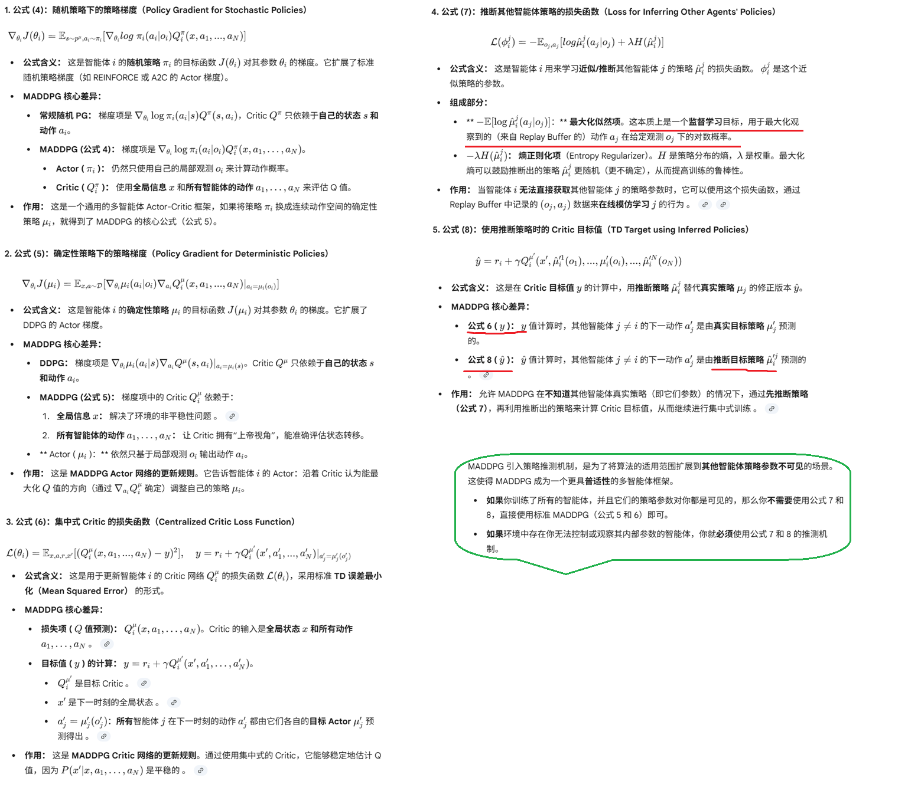
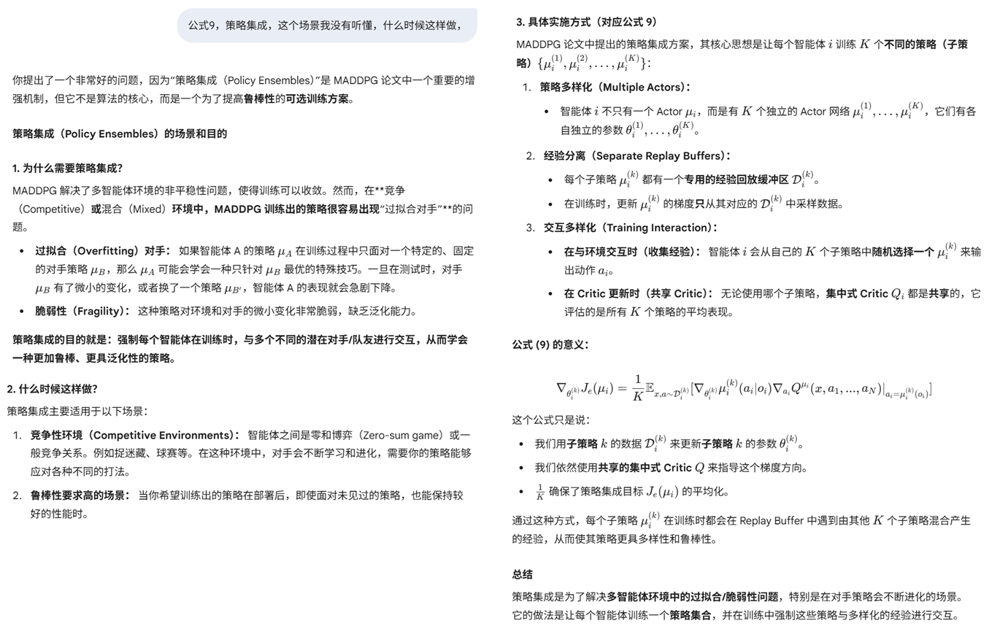
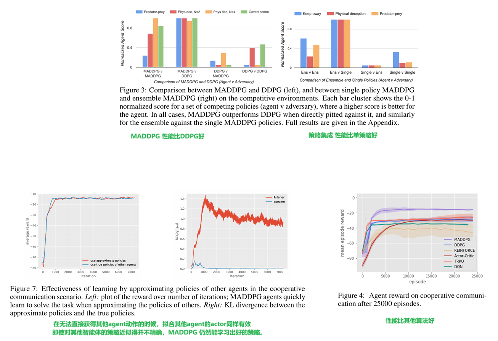

**Multi-Agent Actor-Critic for Mixed Cooperative-Competitive Environments**

### 1、Introduction

有些场景下，涉及到多个agent协同或者对抗，常规的单agent的DRL算法对这类场景适配很差，一个主要原因对于其中一个agent来说，环境会因为其他agent的动作变得不稳定，这导致训练过程不稳定、不能直接使用过去的经验回放，这点对于Q-Learning算法是关键前提。

策略梯度类算法也因此呈现更加高的方差。因为每个agent的奖励会受到其他agent动作的影响，它本来只取决于本agent的动作。因此奖励会呈现更大的方差，从而导致梯度也出现更大的方差。

本论文提出了一个中心化训练、分布式执行的方案，actor只是用局部观测信息，而在训练的时候，critic可以使用来自其他agent的额外的信息，训练完成后，只使用actor。我们的方案不要求任何形式的agent之间的通信机制，只依赖agent之间的物理动作。

我们的方案既可以用于多agent协同场景，也可以用于多agent竞争的场景，或者两者兼备的场景。实验显示在这些场景下，我们的方案比其他常规的单agent方案都表现更好。

### 2、Related Work

多Agent场景下，一个主要的挑战是：训练过程中，每个agent的策略都在变化，导致每个agent看到的环境都是不稳定的，因为对于任何一个agent，其他agent的策略和动作都是环境的随机因素。（回忆一下当时训练agent走FrozenLake迷宫的时候，当环境有一定概率让agent发生随机侧移的时候，训练非常难收敛）。

多Agent场景下，有的需要agent直接协同，有的需要agent之间对抗竞争，有的同时具备协同和竞争，业界大量的工作通常是关注多agent的协同。有的研究通过多agent贡献策略网络的参数来实现协同，但是这要求agent是同构的（回忆一下TSC中多路口异构带来的问题）。这导致应用场景受限。

### 3、Background

介绍了马尔可夫决策过程、DQN、策略梯度算法等等

### 4、Method

#### 4.1 算法

#### 4.2 公式理解

**几个公式其实还是很好理解的，就是常规DRL算法中如何更新Actor和Critic的扩展版本：**

**公式9单独拿出来说**

### 5、Experiments

#### 5.1 实验环境

论文列举了几种典型的game：

1. 合作性任务：听者必须导航到特定颜色的地标，但它不知道目标颜色；说话者知道目标颜色，必须通过通信输出（消息）告诉听者 
2. 捕食者-猎物（竞争任务）：N个较慢的合作型智能体（捕食者）必须追逐一个较快的对手（猎物），环境中还有 L 个大型地标作为障碍物 
3. 合作导航：智能体必须确保每个地标附近至少有一个智能体，同时要避免相互碰撞
4. 物理欺骗 ：N个合作智能体试图到达 N 个地标中的一个目标地标，但一个对手（它不知道哪个是目标地标）会跟踪智能体尝试占领目标。合作智能体必须欺骗对手（adversary）。合作智能体通过分散并覆盖所有地标来迷惑对手，使对手无法确定真正的目标地标 。

#### 5.2 实验结果

这里给出部分结果，详细的见原论文

### 6、Conclusion

我们提出了一种多agent方法：输入所有agent的动作和观测来训练每个agent的critic。在竞争/合作的多agent场景下，我们的方法性能比其他传统的DRL方法都要好。我们通过集合子策略的方式，可以进一步提升MADDPG的性能。集合子策略的方法，是普适的，可以应用于其他多agent算法。

我们的方法的一个缺点就是，critic的输入空间会随着agent的个数增长而线性增长。可能的解决方案是：只关注一定范围内的邻居agent。

### 7、代码开放

在[这里](https://github.com/openai/multiagent-particle-envs)有MADDPG的代码和论文中提到的几款游戏环境，但没有算法的实现。算法可能要参考DDPG论文，或者作者认为这是一个通识算法，没有必要提供。