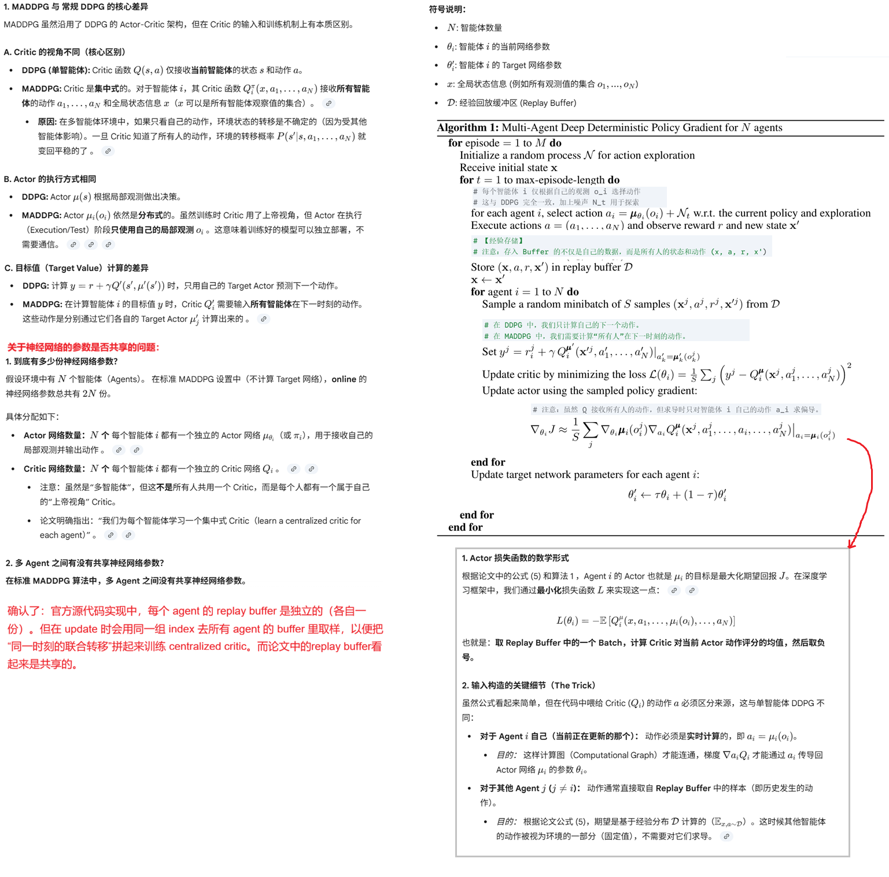
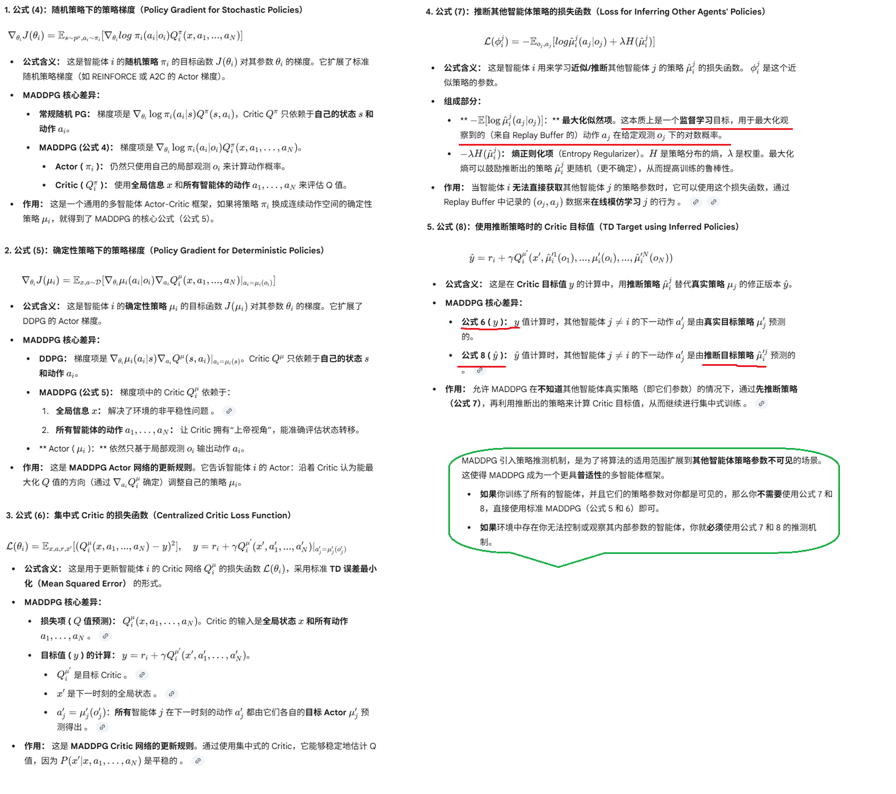
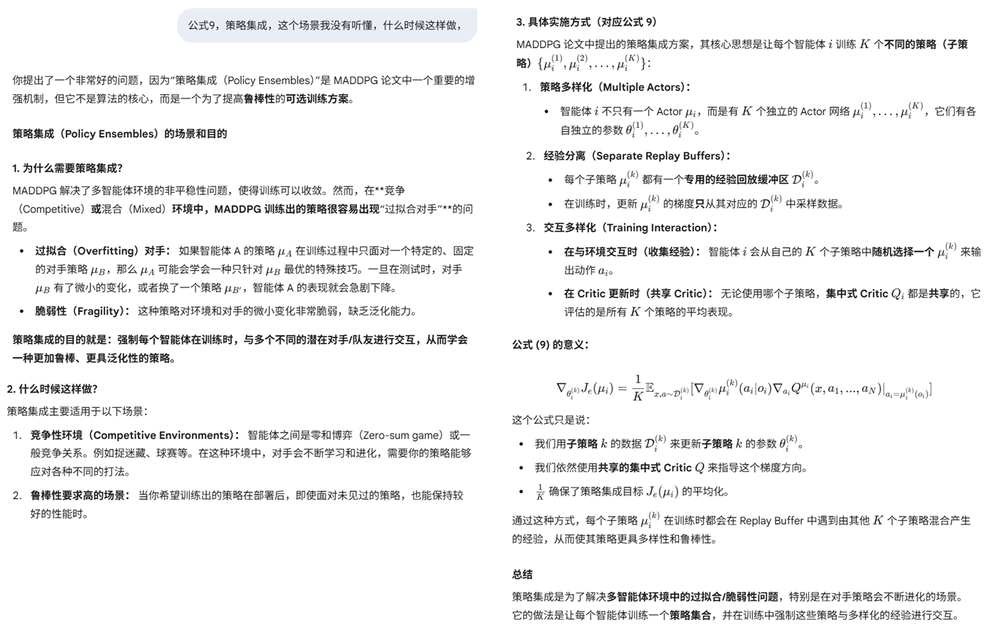
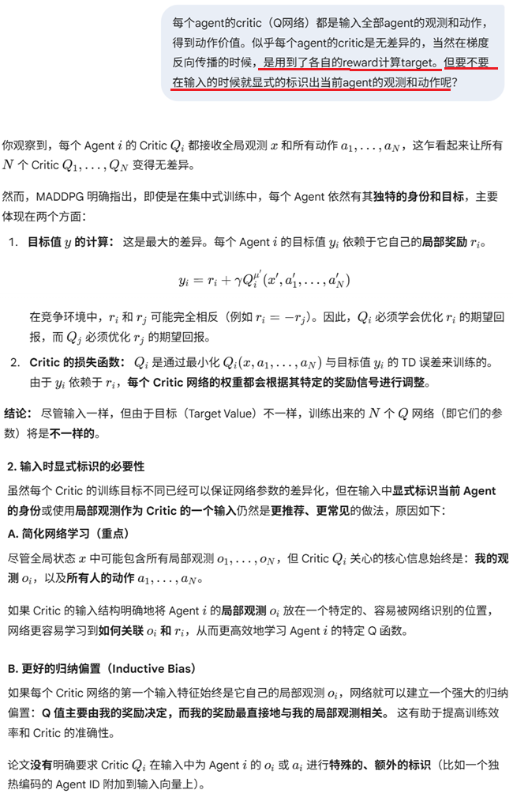
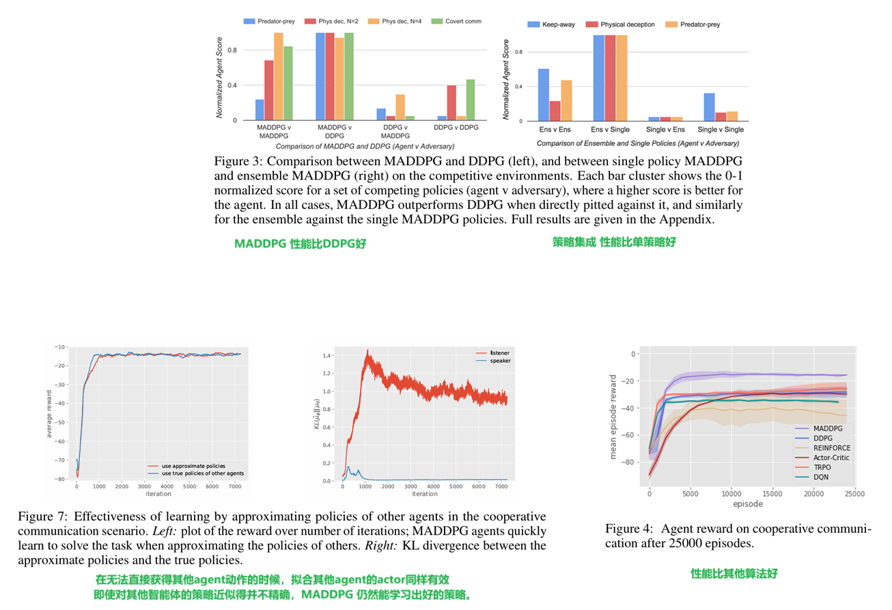

**Multi-Agent Actor-Critic for Mixed Cooperative-Competitive Environments**

### 1、Introduction

有些场景下，涉及到多个agent协同或者对抗，常规的单agent的DRL算法对这类场景适配很差，一个主要原因对于其中一个agent来说，环境会因为其他agent的动作变得不稳定，这导致训练过程不稳定、不能直接使用过去的经验回放，这点对于Q-Learning算法是关键前提。

策略梯度类算法也因此呈现更加高的方差。因为每个agent的奖励会受到其他agent动作的影响，它本来只取决于本agent的动作。因此奖励会呈现更大的方差，从而导致梯度也出现更大的方差。

本论文提出了一个基于DDPG实现的CTDE（中心化训练、分布式执行）方案，actor只是用局部观测信息，而在训练的时候，critic可以使用来自其他agent的额外的信息，训练完成后，只使用actor。我们的方案不要求任何形式的agent之间的通信机制，只依赖agent之间的物理动作。

我们的方案既可以用于多agent协同场景，也可以用于多agent竞争的场景，或者两者兼备的场景。实验显示在这些场景下，我们的方案比其他常规的单agent方案都表现更好。

### 2、Related Work

多Agent场景下，一个主要的挑战是：训练过程中，每个agent的策略都在变化，导致每个agent看到的环境都是不稳定的，因为对于任何一个agent，其他agent的策略和动作都是环境的随机因素。（回忆一下当时训练agent走FrozenLake迷宫的时候，当环境有一定概率让agent发生随机侧移的时候，训练非常难收敛）。

多Agent场景下，有的需要agent直接协同，有的需要agent之间对抗竞争，有的同时具备协同和竞争，业界大量的工作通常是关注多agent的协同。有的研究通过多agent贡献策略网络的参数来实现协同，但是这要求agent是同构的（回忆一下TSC中多路口异构带来的问题）。这导致应用场景受限。

### 3、Background

介绍了马尔可夫决策过程、DQN、策略梯度算法等等

### 4、Method

#### 4.1 算法



#### 4.2 公式理解

**几个公式其实还是很好理解的，就是常规DRL算法中如何更新Actor和Critic的扩展版本：**



**公式9单独拿出来说**



#### 4.3 思考



### 5、Experiments

#### 5.1 实验环境

论文列举了几种典型的game：

1. 合作性任务：听者必须导航到特定颜色的地标，但它不知道目标颜色；说话者知道目标颜色，必须通过通信输出（消息）告诉听者 
2. 捕食者-猎物（竞争任务）：N个较慢的合作型智能体（捕食者）必须追逐一个较快的对手（猎物），环境中还有 L 个大型地标作为障碍物 
3. 合作导航：智能体必须确保每个地标附近至少有一个智能体，同时要避免相互碰撞
4. 物理欺骗 ：N个合作智能体试图到达 N 个地标中的一个目标地标，但一个对手（它不知道哪个是目标地标）会跟踪智能体尝试占领目标。合作智能体必须欺骗对手（adversary）。合作智能体通过分散并覆盖所有地标来迷惑对手，使对手无法确定真正的目标地标 。

#### 5.2 实验结果

这里给出部分结果，详细的见原论文



### 6、Conclusion

我们提出了一种多agent方法：输入所有agent的动作和观测来训练每个agent的critic。在竞争/合作的多agent场景下，我们的方法性能比其他传统的DRL方法都要好。我们通过集合子策略的方式，可以进一步提升MADDPG的性能。集合子策略的方法，是普适的，可以应用于其他多agent算法。

我们的方法的一个缺点就是，critic的输入空间会随着agent的个数增长而线性增长。可能的解决方案是：只关注一定范围内的邻居agent。

### 7、代码开放

在[这里](https://github.com/openai/multiagent-particle-envs)有MADDPG的代码和论文中提到的几款游戏环境

在[这里](https://github.com/openai/maddpg)有MADDPG的代码实现


### 8、MPE 动作空间与 MADDPG 策略网络输出层设计

#### 1. MPE 动作空间（以 simple / simple_spread 为例）

##### 1.1 形式

- **场景**：PettingZoo MPE 的 `simple_spread_v3`（本项目 `--scenario simple` 的默认映射）。
- **每个 agent 的动作空间**：`Box(0.0, 1.0, (5,), float32)`，即 **5 维连续向量**，每维取值 `[0, 1]`。

##### 1.2 5 维的含义

5 维与 5 个“方向/选项”一一对应：

| 维度索引 | 含义        |
|----------|-------------|
| 0        | no_action   |
| 1        | move_left   |
| 2        | move_right  |
| 3        | move_down   |
| 4        | move_up     |

- **离散模式**（`continuous_actions=False`）：从这 5 个里选 1 个，即 `Discrete(5)`。
- **连续模式**（`continuous_actions=True`，本项目所用）：每个维度表示该方向的**强度**（0～1），环境会用这 5 个数做加权或合成，得到实际移动（如 2D 速度）；左、右等可部分抵消。

---

#### 2. MADDPG 策略网络输出层的设计

##### 2.1 设计思路：输出“分布参数”而非“动作本身”

策略网络（Actor / `p_net`）**不直接输出动作**，而是输出**动作分布的参数**；再通过“分布 + 采样”得到动作，必要时再压到环境要求的区间（如 `[0, 1]`）。

- **动作空间**：来自环境，如 `act_space_n[i]` 为第 i 个 agent 的 `Box(low, high, shape)` 或 `Discrete(n)`。
- **分布类型（PdType）**：由 `make_pdtype(ac_space)` 根据动作空间类型决定：
  - `Box(shape=(d,))` → **对角高斯**，需要 `2*d` 个参数（d 个均值 + d 个标准差的对数）；
  - `Discrete(n)` → Softmax（n 个 logits）。
- **输出维度**：`p_param_size = act_pdtype_n[agent_index].param_shape()[0]`。对 `Box(d)` 即为 `2*d`。
- **前向流程**：`obs → p_net → flat (长度 2d) → pdfromflat(flat) → 分布.sample() → [可选] _squash → 环境动作`。

因此，**输出层维度 = 该 agent 动作分布参数的个数**（对角高斯下 = 2×动作维度）。

##### 2.2 与 Q 网络的区分

- **p_net（Actor）**：输入当前 agent 的观测，输出**动作分布参数**（如 mean + logstd）。
- **q_net（Critic）**：输入所有 agent 的 (obs, action) 拼接（或 local 时仅当前 agent），输出标量 Q 值。

---

#### 3. 对角高斯分布（Diagonal Gaussian）

##### 3.1 定义与参数形式

- **对角高斯**：多元高斯的一种，**为动作的每个维度各设一组 (均值, 标准差)**，各维**独立**。
- **协方差矩阵**：为对角阵（非对角元为 0），即各维无协方差、不相关。
- **参数**：d 维动作 → 共 `2*d` 个参数：`[μ_1..μ_d, log(σ_1)..log(σ_d)]`。
- **采样**：对每维独立采样  
  `a_i = μ_i + σ_i * ε_i`，其中 `ε_i ~ N(0,1)` 且各维独立。  
  使用 **logstd** 而非 std，是为了让网络可以无界输出，再通过 `σ = exp(logstd)` 保证 σ > 0。

##### 3.2 与“一般多元高斯”的对比

| 项目         | 一般多元高斯           | 对角高斯                     |
|--------------|------------------------|------------------------------|
| 协方差       | 任意对称正定矩阵 Σ     | 仅对角元，各维独立           |
| 参数个数     | d + d(d+1)/2           | d + d = 2d                    |
| 维度间关系   | 可相关                 | 独立                         |
| 实现与训练   | 需正定参数化，较复杂   | 简单、稳定，常用于连续动作   |

---

#### 4. 维度间的“冲突”与对角假设的理解

##### 4.1 问题

例如“左移”与“右移”在语义上冲突，若各维**独立**采样，理论上可能同时采到左、右都偏大，与直觉不符。

##### 4.2 为何仍用对角（不建模协方差）

1. **均值在起主导作用**  
   策略学习的是每个维度的 **μ**。学好后可以是“左高右低”或“右高左低”，从**期望动作**上就避免同时大力左移+右移。冲突主要通过**学好的均值**来化解，而不是靠协方差。

2. **环境会对多维动作做合成**  
   MPE 会把 5 维强度合成为实际移动（如加权得到速度向量）。因此即使偶尔采到“左、右都偏大”，在物理上往往**部分抵消**，不一定会产生荒谬行为。

3. **实现与稳定性上的折中**  
   对角形式参数少、训练稳定；全协方差需要更多参数和正定约束。探索时各维独立加噪，偶尔出现“左、右都大”可视为探索与稳定性之间的折中。

##### 4.3 若需显式建模互斥

可考虑：
- **全协方差多元高斯**（更多参数，需 Cholesky 等参数化）；
- **其他动作表示**：如输出“方向 + 幅值”而不是 5 个独立强度。

当前实现采用常见做法：**对角高斯 + 让策略学好多维均值**，在多数 MPE 任务中已足够。

---

#### 5. 小结（便于记忆）

- **MPE simple 动作空间**：`Box(0, 1, (5,))`，5 维对应 [no_action, 左, 右, 下, 上] 的强度，连续时由环境合成实际移动。
- **MADDPG 策略输出**：输出的是**动作分布的参数**（对角高斯下为 2×动作维度的 mean + logstd），再经采样与可选的 squash 得到环境动作。
- **对角高斯**：每维一组 (μ, σ)，各维独立；不建模维度间协方差，左/右等“冲突”主要靠学好的均值与环境的合成来化解。

### 9、Multi-Agent Particle Environment 观测构成与源码对照

本文档整理各场景下智能体**观测（observation）**的构成及对应源代码，便于 MARL（如 MADDPG）实验时理解输入维度。  
约定：`world.dim_p=2`（平面位置），`world.dim_color=3`（RGB），`dim_c` 为通信维度，由各场景在 `make_world()` 中设置。  
观测均在**智能体自身参考系**下给出：相对位置为 `entity.state.p_pos - agent.state.p_pos`。

---

#### 1. simple（单智能体调试）

| 项目 | 内容 |
|------|------|
| **场景** | 单智能体、1 个地标，无通信、无竞争 |
| **智能体** | 1 个，无角色区分 |
| **观测构成** | `[自身速度 p_vel]` + `[各地标相对位置]` → 维度：2 + 2×1 = **4** |
| **源码位置** | `multiagent/scenarios/simple.py` 第 45–49 行 |

```python
# 观测 = 自身速度 + 所有地标相对位置
return np.concatenate([agent.state.p_vel] + entity_pos)
```

---

#### 2. simple_adversary（Physical deception）

| 项目 | 内容 |
|------|------|
| **场景** | 1 个 adversary（红）、2 个 good（绿）、2 个地标（其一为目标），好智能体需分散覆盖以欺骗对手 |
| **智能体** | **Good**：知目标；**Adversary**：不知目标 |
| **Good 观测** | `[目标地标相对位置]` + `[各地标相对位置]` + `[其他智能体相对位置]` → 2 + 4 + 4 = **10** |
| **Adversary 观测** | `[各地标相对位置]` + `[其他智能体相对位置]` → 4 + 4 = **8** |
| **源码位置** | `multiagent/scenarios/simple_adversary.py` 第 121–186 行 |

```python
# Good: 含目标相对位置；Adversary: 不含目标
if not agent.adversary:
    return np.concatenate([agent.goal_a.state.p_pos - agent.state.p_pos] + entity_pos + other_pos)
else:
    return np.concatenate(entity_pos + other_pos)
```

---

#### 3. simple_spread（Cooperative navigation）

| 项目 | 内容 |
|------|------|
| **场景** | 3 智能体、3 地标，协作覆盖地标并避免碰撞，无通信语义（有 dim_c 但未在观测中区分用途） |
| **智能体** | 无角色区分 |
| **观测构成** | `[自身速度]` + `[自身位置]` + `[各地标相对位置]` + `[其他智能体相对位置]` + `[其他智能体通信 c]` → 2 + 2 + 6 + 4 + 4 = **18**（dim_c=2） |
| **源码位置** | `multiagent/scenarios/simple_spread.py` 第 84–99 行 |

```python
return np.concatenate([agent.state.p_vel] + [agent.state.p_pos] + entity_pos + other_pos + comm)
```

---

#### 4. simple_push（Keep-away）

| 项目 | 内容 |
|------|------|
| **场景** | 1 个 good、1 个 adversary、2 个地标，good 要靠近目标地标，adversary 要推开 good |
| **智能体** | **Good**：知目标；**Adversary**：不知目标 |
| **Good 观测** | `[自身速度]` + `[目标地标相对位置]` + `[自身颜色]` + `[各地标相对位置]` + `[各地标颜色]` + `[其他智能体相对位置]` → 2 + 2 + 3 + 4 + 6 + 2 = **19** |
| **Adversary 观测** | `[自身速度]` + `[各地标相对位置]` + `[其他智能体相对位置]` → 2 + 4 + 2 = **8** |
| **源码位置** | `multiagent/scenarios/simple_push.py` 第 76–95 行 |

```python
if not agent.adversary:
    return np.concatenate([agent.state.p_vel] + [agent.goal_a.state.p_pos - agent.state.p_pos] + [agent.color] + entity_pos + entity_color + other_pos)
else:
    return np.concatenate([agent.state.p_vel] + entity_pos + other_pos)
```

---

#### 5. simple_speaker_listener（Cooperative communication）

| 项目 | 内容 |
|------|------|
| **场景** | 1 个 speaker（不移动）、1 个 listener，3 个地标；speaker 观察 listener 的目标地标并“说”给 listener |
| **智能体** | **Speaker**：仅目标颜色；**Listener**：地标相对位置 + 通信 |
| **Speaker 观测** | `[目标地标颜色 goal_color]` → **3** |
| **Listener 观测** | `[自身速度]` + `[各地标相对位置]` + `[其他智能体通信]` → 2 + 6 + 3 = **11**（dim_c=3） |
| **源码位置** | `multiagent/scenarios/simple_speaker_listener.py` 第 69–91 行 |

```python
if not agent.movable:   # speaker
    return np.concatenate([goal_color])
if agent.silent:        # listener
    return np.concatenate([agent.state.p_vel] + entity_pos + comm)
```

---

#### 6. simple_reference（双向协作指路）

| 项目 | 内容 |
|------|------|
| **场景** | 2 智能体、3 地标，各自有目标地标且仅对方知道，需通过通信告知对方目标 |
| **智能体** | 无角色区分，均为“说者+听者” |
| **观测构成** | `[自身速度]` + `[各地标相对位置]` + `[自身目标地标颜色]` + `[其他智能体通信]` → 2 + 6 + 3 + 10 = **21**（dim_c=10） |
| **源码位置** | `multiagent/scenarios/simple_reference.py` 第 61–79 行 |

```python
return np.concatenate([agent.state.p_vel] + entity_pos + [goal_color[1]] + comm)
```

---

#### 7. simple_crypto（Covert communication）

| 项目 | 内容 |
|------|------|
| **场景** | Alice（说者）、Bob（听者）、Eve（对手）；Alice 用私钥加密目标传给 Bob，Eve 只能看到密文 |
| **智能体** | **Speaker (Alice)**：目标颜色 + 私钥；**Listener (Bob)**：私钥 + 通信；**Adversary (Eve)**：仅通信 |
| **Speaker 观测** | `[目标地标颜色 goal_color]` + `[私钥 key]` → 4 + 4 = **8**（dim_c=4） |
| **Listener (Bob) 观测** | `[私钥 key]` + `[说者通信]` → 4 + 4 = **8** |
| **Adversary (Eve) 观测** | `[说者通信]` → **4** |
| **源码位置** | `multiagent/scenarios/simple_crypto.py` 第 124–169 行 |

```python
if agent.speaker:
    return np.concatenate([goal_color] + [key])
if not agent.speaker and not agent.adversary:  # Bob
    return np.concatenate([key] + comm)
if not agent.speaker and agent.adversary:      # Eve
    return np.concatenate(comm)
```

---

#### 8. simple_tag（Predator-prey）

| 项目 | 内容 |
|------|------|
| **场景** | 1 个 good（猎物）、3 个 adversary（捕食者）、2 个障碍地标 |
| **智能体** | 无通信；所有智能体观测结构相同 |
| **观测构成** | `[自身速度]` + `[自身位置]` + `[非边界地标相对位置]` + `[其他智能体相对位置]` + `[其他 good 智能体速度]` → 2 + 2 + 4 + 6 + 2 = **16**（1 good + 3 adv，other_vel 仅 good 的 1 个） |
| **源码位置** | `multiagent/scenarios/simple_tag.py` 第 131–146 行 |

```python
return np.concatenate([agent.state.p_vel] + [agent.state.p_pos] + entity_pos + other_pos + other_vel)
```

---

#### 9. simple_world_comm（带食物/森林/领导的 Tag）

| 项目 | 内容 |
|------|------|
| **场景** | 2 good、4 adversary（其中 agent0 为 leader，可通信）、1 地标、2 食物、2 森林；森林内不可见；good 吃食物得分 |
| **智能体** | **Leader (adv)**：全信息 + 通信；**普通 Adversary**：实体/其他智能体 + 森林内可见性 + 领导通信；**Good**：无通信，结构略简 |
| **Adversary（含 Leader）观测** | `[自身速度]` + `[自身位置]` + `[所有实体相对位置]` + `[其他智能体相对位置]`（森林遮挡时为零）+ `[其他 good 速度]` + `[自身是否在森林 in_forest×2]` + `[leader 通信]`；实体含 1 地标+2 食物+2 森林 → 维度随实体与遮挡变化 |
| **Good 观测** | 同上但不含 comm（或仅环境信息），结构为 `p_vel + p_pos + entity_pos + other_pos + in_forest + other_vel` |
| **源码位置** | `multiagent/scenarios/simple_world_comm.py` 第 224–286 行 |

```python
# 森林内仅当同森林或均为森林外时可见其他智能体；leader 的 c 作为 comm
if agent.adversary and not agent.leader:
    return np.concatenate([agent.state.p_vel] + [agent.state.p_pos] + entity_pos + other_pos + other_vel + in_forest + comm)
if agent.leader:
    return np.concatenate([agent.state.p_vel] + [agent.state.p_pos] + entity_pos + other_pos + other_vel + in_forest + comm)
else:  # good
    return np.concatenate([agent.state.p_vel] + [agent.state.p_pos] + entity_pos + other_pos + in_forest + other_vel)
```

---

#### 观测获取流程（环境侧）

观测在环境 `step()` / `reset()` 中统一通过场景的 `observation()` 回调得到：

| 步骤 | 说明 | 源码位置 |
|------|------|----------|
| 1 | 环境将 `observation_callback` 设为场景的 `observation` | `make_env.py` 第 42 行 |
| 2 | 每步/重置时对每个 agent 调用 `_get_obs(agent)` | `multiagent/environment.py` 第 92、114 行 |
| 3 | `_get_obs` 内部调用 `observation_callback(agent, self.world)` | `multiagent/environment.py` 第 125–128 行 |
| 4 | 观测空间维度在构造时由 `len(observation_callback(agent, self.world))` 确定 | `multiagent/environment.py` 第 67–68 行 |

---

#### 符号与维度速查

| 符号 | 含义 | 典型维度 |
|------|------|----------|
| `p_vel` | 自身速度 | 2（dim_p） |
| `p_pos` | 自身位置（全局） | 2 |
| `entity_pos` | 地标/实体相对位置列表 | n_entity × 2 |
| `entity_color` | 地标颜色列表 | n_entity × 3 |
| `other_pos` | 其他智能体相对位置列表 | (n_agent−1) × 2 |
| `other_vel` | 部分其他智能体速度（如 good 的 vel） | 视场景 |
| `comm` | 其他智能体的 `state.c`（通信） | (n_agent−1 或 1) × dim_c |
| `goal_color` / `goal_a` | 目标地标颜色或相对位置 | 3 或 2 |
| `in_forest` | 是否在某个森林内 | 2（两个标量） |

以上表格可直接拷贝到读书笔记中使用；实现细节以仓库内源码为准。

---

#### 速查总表（拷贝用）

| 场景 | 智能体类型 | 观测构成 | 典型维度 | 源码（observation 函数） |
|------|------------|----------|----------|---------------------------|
| **simple** | 通用 | 自身速度 + 地标相对位置 | 4 | `simple.py:45-49` |
| **simple_adversary** | Good | 目标相对位置 + 地标相对位置 + 其他智能体相对位置 | 10 | `simple_adversary.py:121-186` |
| **simple_adversary** | Adversary | 地标相对位置 + 其他智能体相对位置 | 8 | 同上 |
| **simple_spread** | 通用 | 自身速度 + 自身位置 + 地标相对位置 + 其他智能体相对位置 + 其他智能体通信 | 18 | `simple_spread.py:84-99` |
| **simple_push** | Good | 自身速度 + 目标相对位置 + 自身颜色 + 地标相对位置 + 地标颜色 + 其他智能体相对位置 | 19 | `simple_push.py:76-95` |
| **simple_push** | Adversary | 自身速度 + 地标相对位置 + 其他智能体相对位置 | 8 | 同上 |
| **simple_speaker_listener** | Speaker | 目标地标颜色 | 3 | `simple_speaker_listener.py:69-91` |
| **simple_speaker_listener** | Listener | 自身速度 + 地标相对位置 + 说者通信 | 11 | 同上 |
| **simple_reference** | 通用 | 自身速度 + 地标相对位置 + 自身目标颜色 + 其他智能体通信 | 21 | `simple_reference.py:61-79` |
| **simple_crypto** | Speaker (Alice) | 目标颜色 + 私钥 | 8 | `simple_crypto.py:124-169` |
| **simple_crypto** | Listener (Bob) | 私钥 + 说者通信 | 8 | 同上 |
| **simple_crypto** | Adversary (Eve) | 说者通信 | 4 | 同上 |
| **simple_tag** | 通用 | 自身速度 + 自身位置 + 地标相对位置 + 其他智能体相对位置 + 其他 good 速度 | 16 | `simple_tag.py:131-146` |
| **simple_world_comm** | Leader/Adversary | 自身速度 + 自身位置 + 实体相对位置 + 其他智能体相对位置（含森林遮挡）+ 其他 good 速度 + 是否在森林×2 + 领导通信 | 变长 | `simple_world_comm.py:224-286` |
| **simple_world_comm** | Good | 同上但无领导通信 | 变长 | 同上 |
