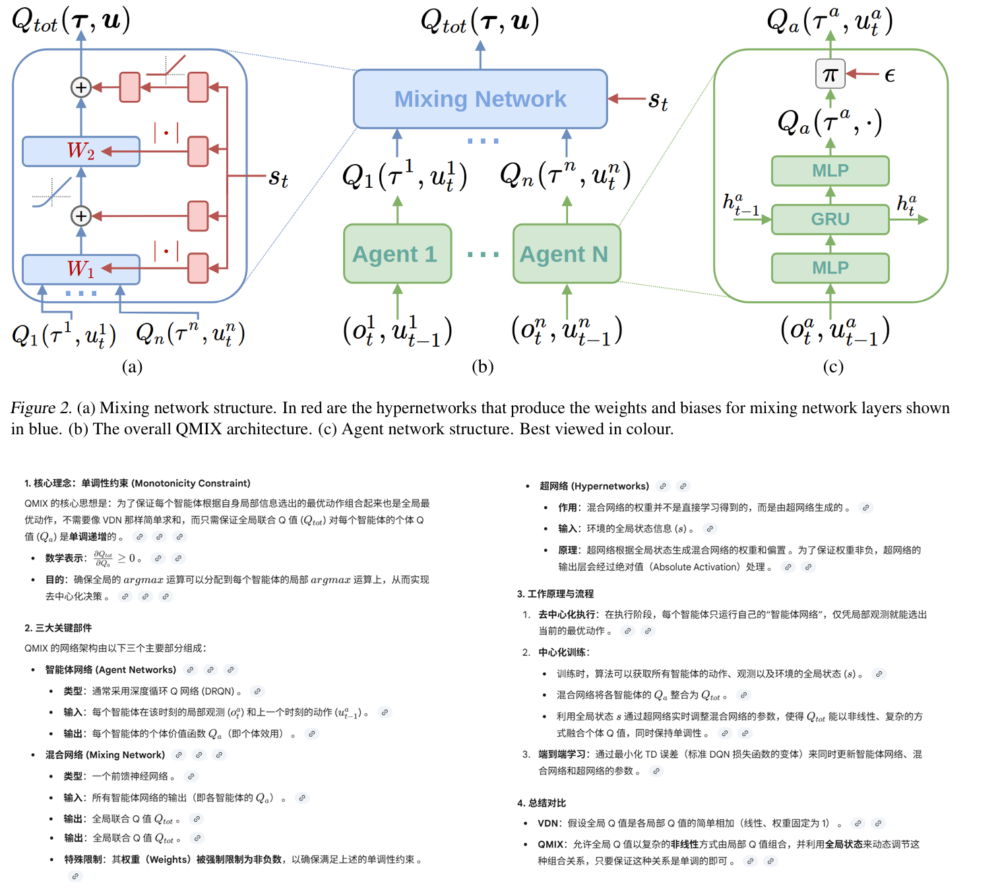
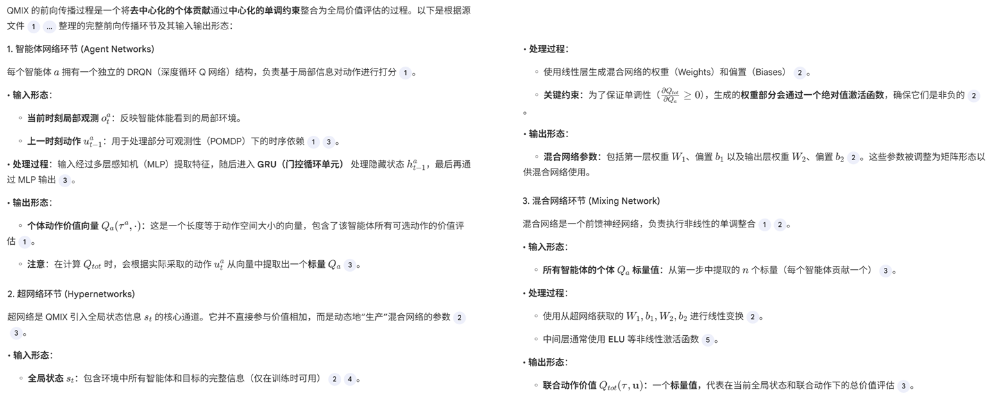
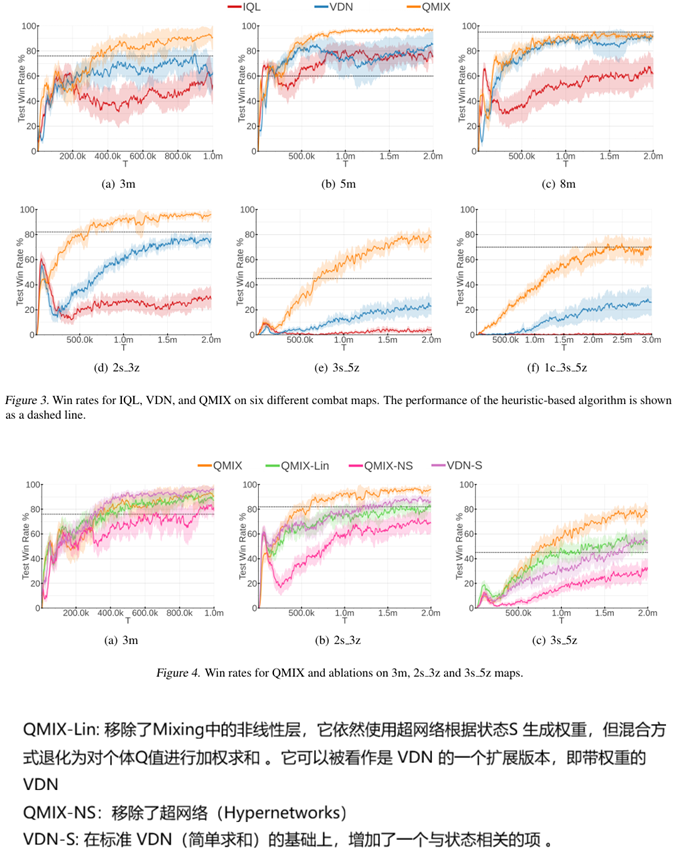

**QMIX:Monotonic Value Function Factorisation for Deep Multi-Agent Reinforcement Learning**

### 1 Introduction

多智能体场景下，由于执行时候会有一些约束（通信限制、全局状态不可得），所以通常采取去中心化执行，也就是agent只根据局部观测采取最优动作。但是在训练的时候，模拟环境或者实验环境下，这些约束可能可以突破，采取中心化的训练方式，以最大化的利用好全局状态信息等。

要正确捕捉智能体动作的效果，需要一个以全局状态和联合动作为输入的集中式（全局的）动作价值函数 Qtot。当智能体数量众多时，这样的函数很难学习，即使能够学习成功，也没有方便的方法来提取出各个agent的去中心化的策略，以方便每个智能体仅基于个体观察选择单独的动作。

一个简单的办法就是，抛弃中心化训练，采取每个agent各自学习独立的动作价值函数（IQL），但这样的方法有可能不收敛，因为每个agent都会收到其他agent的影响，它相当于面临一个不稳定的带有随机性的环境；

COMA这个方法可以使用全局的奖励和状态信息，通过反事实基线计算每个agent动作的优势，引导agent学习，但是它是on-policy方法，样本效率很低。

VDN方法里，每个agent有自己的局部观测和行为，对应一个动作价值函数Q，把这N个动作价值函数加在一起，得到一个全局Q函数。注意这不是一个独立的神经网络，它只是N个局部Q函数的求和。VDN使用统一的损失函数（全局Q函数的TD error公式）进行梯度更新。然而，VDN限制了可表示的集中式动作价值函数的复杂性，并忽略了训练期间可用的任何额外状态信息。

本论文提出了QMIX方法，非常类似VDN。相比VDN的简单相加，QMIX使用了一个mix network将多个agent 的动作价值函数的结果组合起来。和VDN的约束一样：QMIX要求全局Q函数对agent Q函数是单调递增的，即他们的偏导数大于0（而VDN是等于1）。

我们在starcraft游戏的相关任务里相比VDN和IQL，取得了SOTA的回合成功率。

### 2 Related Works

### 3 Background

### 4 QMIX

#### 细节理解

### 5 Two Step Game

### 6 Experiments

### 7 代码开放

无

可以参考[这个](https://github.com/oxwhirl/pymarl)