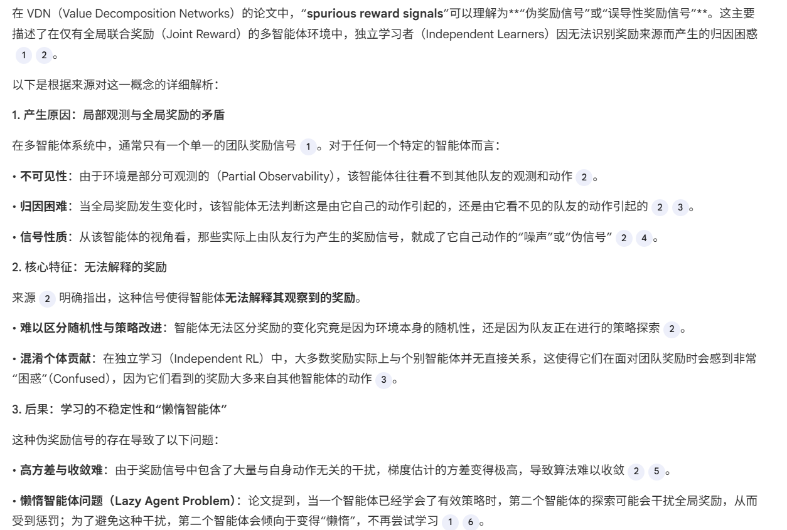
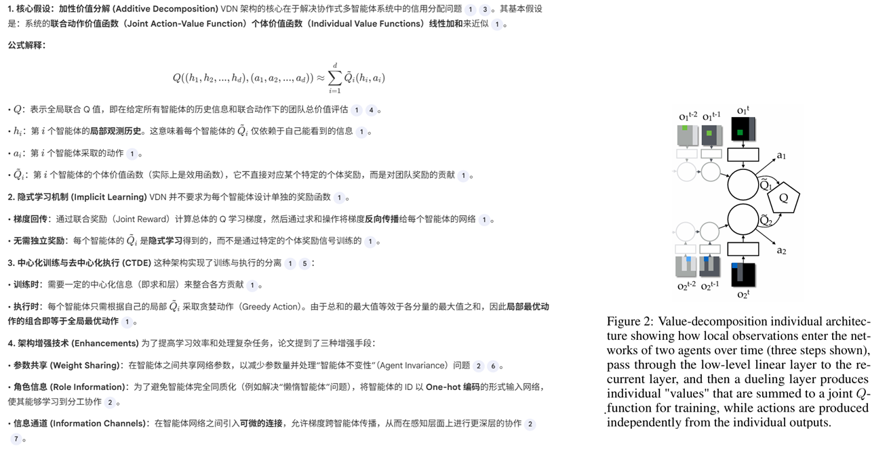
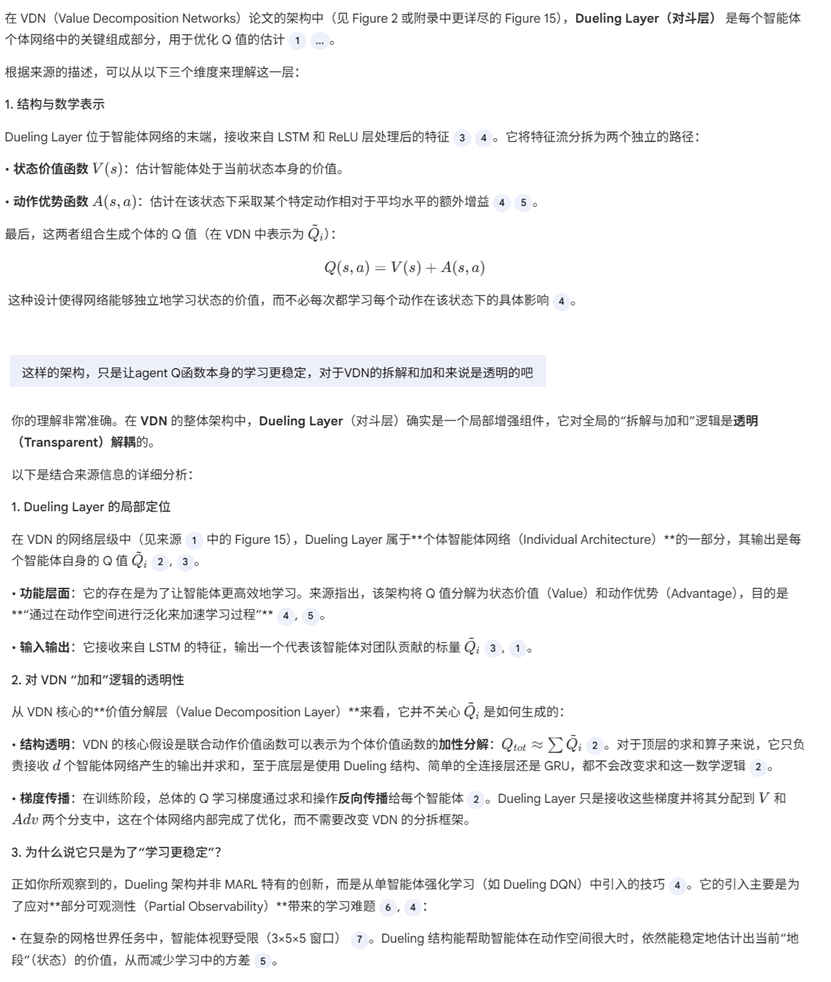
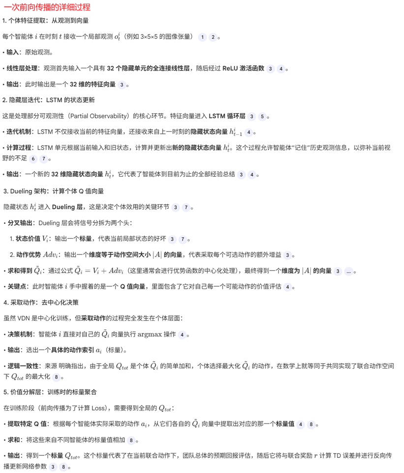

**Value-Decomposition Networks For Cooperative Multi-Agent Learning**

### 1 Introduction

本论文研究合作场景下只提供全局奖励而没有局部奖励的MARL问题。

一种解决方法是，中心化训练，把问题简化为单agent RL问题：所有agent的观测拼接为一个观测，并把所有agent的动作空间组合起来。但这种方法经常失败，即使是在简单的任务里。论文中展现了一种情况：两个agent，只有一个活跃，另外一个“懒惰”。而且动作空间可能因为agent个数增多而爆炸。

还有一种解决方法是，完全独立的多个agent各自学习。这样做法的问题是，每个agent面临的环境是不稳定的，受到其他agent的行为的影响。误导性的奖励信号（奖励和单个智能体的行为没有直接关系，使得智能体面对全局奖励觉得“困惑”）。所以这样的做法也经常不能收敛。想要把全局奖励分解为各个agent局部的奖励、让局部奖励和该智能体的行为形成直接、客观的联系，是比较有困难的工作。

本论文提出了一种可学习的、可加的价值分解网络，它构建一个全局动作价值函数（并无神经网络实体），等于各个agent的动作价值函数的加和。该方法可以避免误导性奖励信号的问题。训练的时候，使用标准DQN的TD error公式作为损失函数，公式里的动作价值函数项为全局的动作价值函数。

关于论文中多次提到的误导性奖励的理解：

### 2 Background

介绍了RL、DQN、MARL等基本概念

### 3 VDN

#### 深入理解

### 4 Experiments

2D迷宫环境下的Switch、Fetch、Checker游戏任务（具体见论文），每个agent的局部视野大小为5X5，RGB 3通道。Agent都是基于target DQN，并带有LSTM进行历史观测的处理。

实验结果比较费解，因为对比的是各种组合的agent。

### 5 Conclusion

该论文研究了奖励为全局奖励的合作式的MARL问题。我们发现完全独立训练多个agent和完全中心化训练一个agent这两种直接了当的解决方案工作得并不好。所以我们提出了价值分解的方案，并且在一众复杂任务下表现突出。

未来的工作可以扩展到个数更大的agent协同场景，还包括非线性聚合方式的全局价值分解。

### 6 代码开放

无