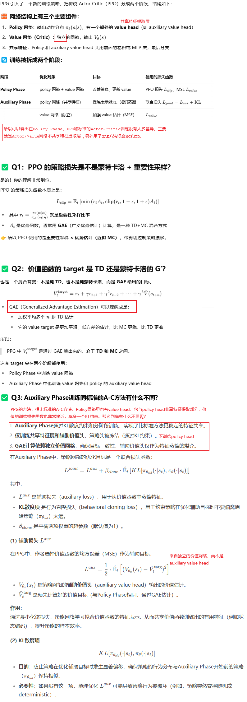
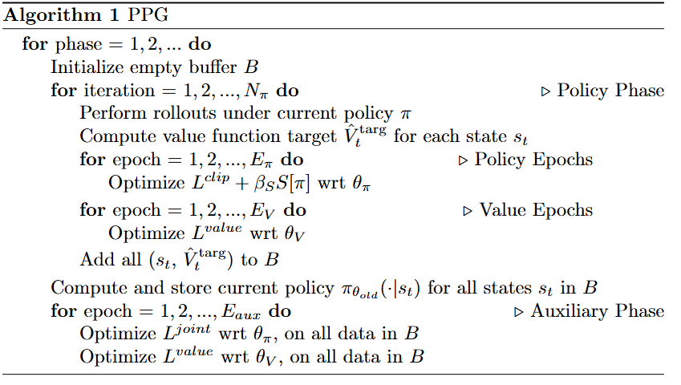
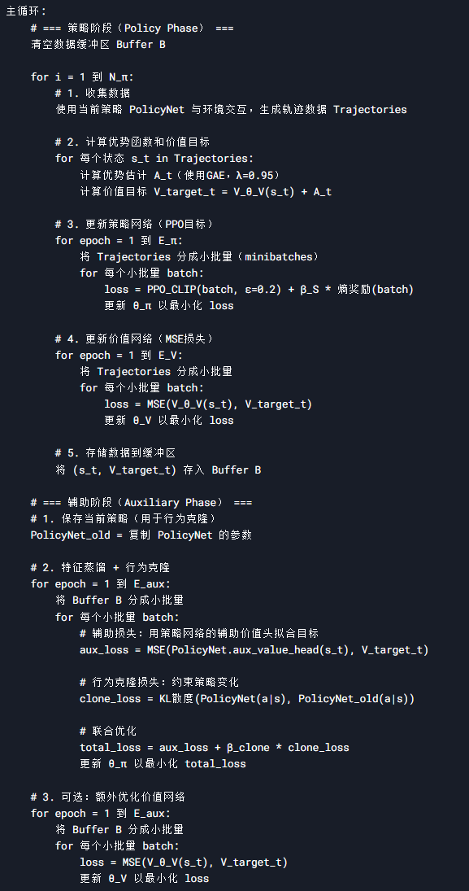
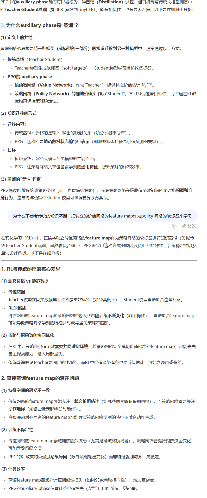

**Phasic Policy Gradient**

### Introduction

标准的actor-critic方法如果共享特征提取网络，那么会面临两个问题：

1. actor网络和crtici网络的优化目标相互干扰，在特征提取网络部分有负面影响
2. 他们对样本数据复用相同的次数，actor比critic网络更容易过拟合

PPG方法把标准的actor-critic方法的训练方式优化为两个交替的阶段：

1. 使用PPO，只训练Policy网络的阶段，允许少量的样本数据重用，保持策略稳定
2. 使用之前收集的数据，反复疯狂多次使用，训练value网络，同时把value网络中的信息蒸馏到policy网络中

### Algorithm

简单的说，PPG就是有两部分和两阶段：

1. 两部分，两部分之间不共享特征提取的CNN或者MLP：
   1. 第一部分：Policy网络（带了一个辅助价值头），可以认为就是一个标准的Actor-Critic网络
   2. 第二部分：独立的Critic网络
2. 两阶段：
   1. 第一阶段，Policy Phase，用GAE方法分别训练Policy网络和Critic网络
   2. 第二阶段，Auxiliary Phase，专门训练Policy网络里的 auxiliary value head和特征提取部分。

换一种形式：

#### 思考

【思考一】

auxiliary phase，通过KL散度来约束，而不是直接冻结policy head，我的理解是：

1. KL散度约束的方式，体现了一种面向结果的方式，策略的输出最终不能有剧烈的变化，倒推policy head和特征提取层都不能被剧烈更新。 
2. 而冻结policy head但是却允许特征提取层自由更新，可能导致两者脱节，最终的结果可能是策略的输出剧烈变化。最后舍本逐末了。
3. KL散度约束的方式更柔性，毕竟policy head做一定的更新也是有必要和有益处的。冻结的方法太刚硬了

【思考二】

### Expertiments

得出了好几个结论：

1. PPG的样本效率明显由于PPO
2. 策略网络，不需要对样本进行复用。复用越多，效果越不好
3. 价值网络的训练，需要高的样本复用次数（9次）
4. 两个阶段的频率配比问题：auxiliary phase频率不宜很高，32次policy phase后一次auxiliary phase比较好
5. policy phase中用到的policy网络的损失函数，默认用clipping来约束重要性采样比值大小。改为KL散度方式得到的效果相当，也就是PPO v1和PPO v2的损失函数效果相当
6. policy phase阶段，通过截断梯度，也可以让两个部分共用特征提取，从而节省内存/显存。效果相当

不截图了，直接看论文原文吧

### Conclusion

通过减少策略和值函数之间的干扰，同时仍然保持共享特征提取层的好处，PPG比PPO显着提高了具有挑战性的Procgen Benchmark上的样本效率。此外，PPG建立了一个框架，能够以稳定的方式在强化学习训练中优化任意辅助损失。本文中我们仅关注值函数误差作为唯一的辅助损失，但未来研究如何利用PPG评估其他辅助损失，将是一个极具吸引力的方向。

