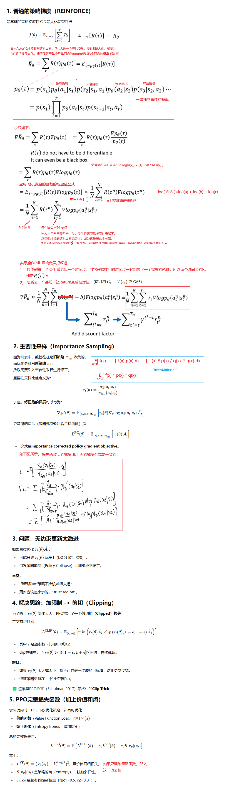
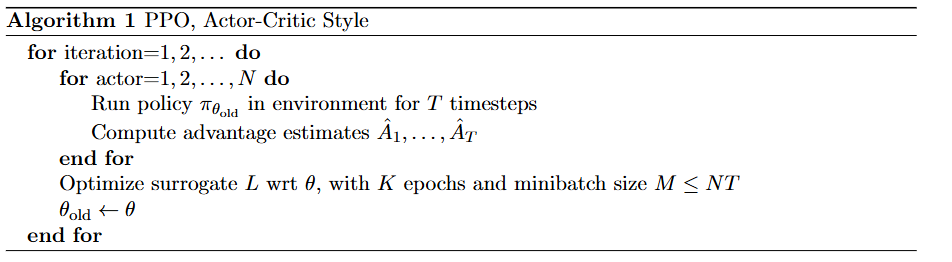
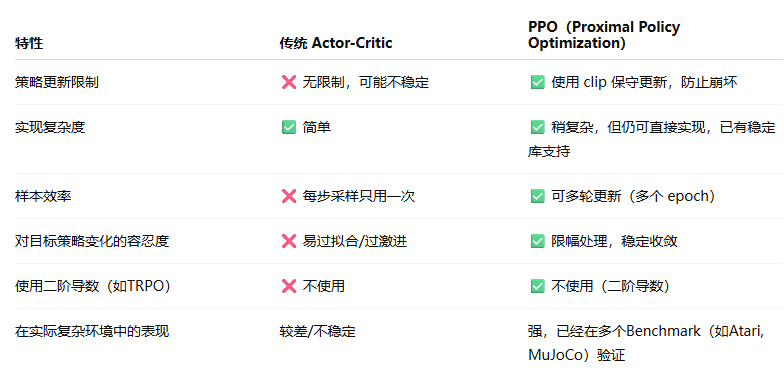
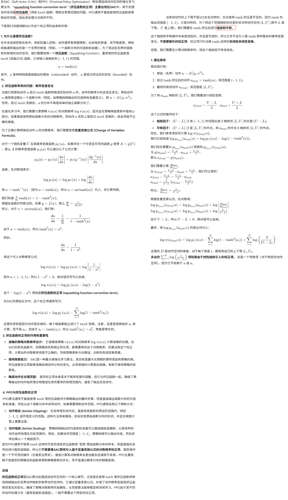
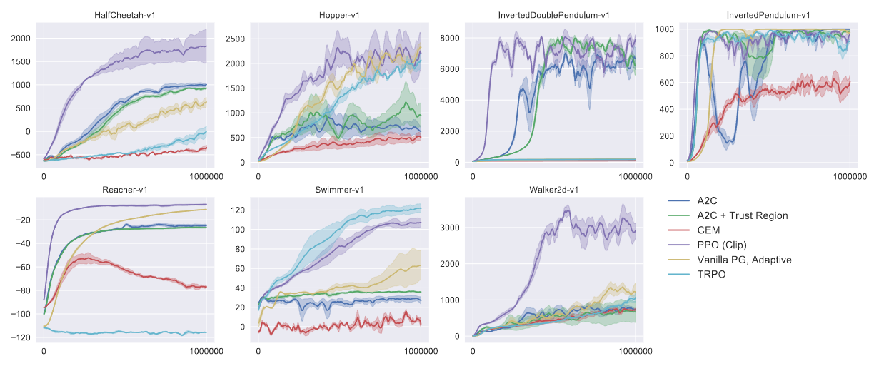
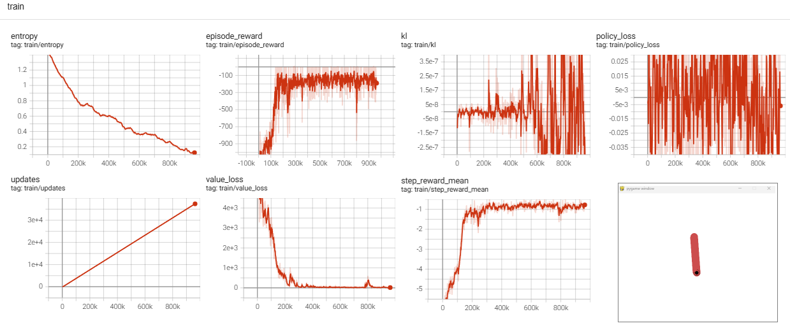
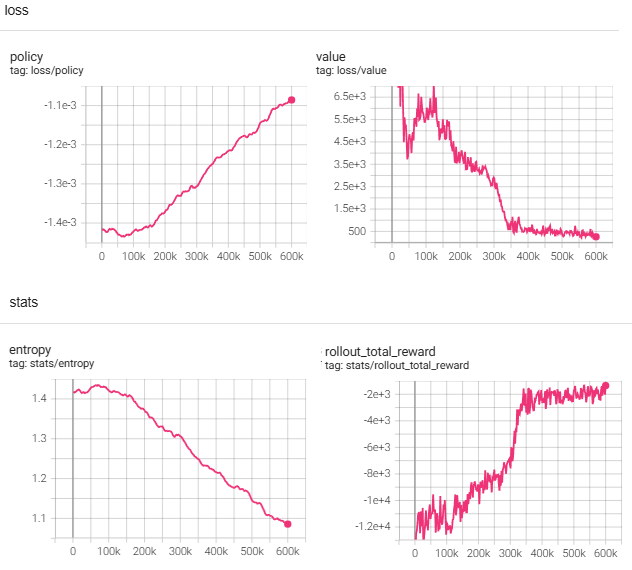
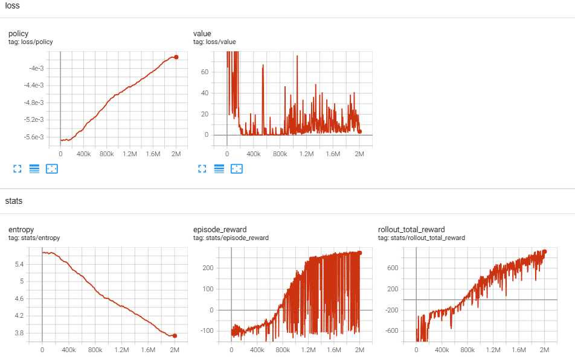

**Proximal Policy Optimization Algorithms**

### Introduction

PPO方法希望解决：

1. RL方法是可扩展的（支持大模型、可以并行的训练）
2. 样本数据利用率高
3. 健壮稳定（能成功处理各种任务而不需要调超参数）

论文把PPO与TRPO做对比：PPO和TRPO一样具备样本的高利用率和可靠的性能，同时又不会像TRPO那样复杂的需要二阶导。


### Algorithm

#### 推导

下图是如何从普通的策略梯度，推出PPO的梯度：



#### 算法伪代码：



在 **PPO 的 Algorithm 1** 中，使用 **N 个并行 Actor（1 到 N）** 的主要目的是 **提高数据收集效率**，从而加速训练。但如果只想用 **1 个 Actor**，仍然可以训练，只需调整部分超参数。下面详细解释：

**并行 Actor 的作用**：

1. 加速数据收集：
   - 多个 Actor 同时与环境交互，能在相同时间内收集更多样本。
   - 例如，N=8，每个 Actor 跑 T=2048 步 → 总数据量 = 8×2048=16,384 步/迭代。
2. 降低样本相关性：
   - 不同 Actor 在不同环境实例（或不同随机种子）中运行，数据更具多样性。
3. 适用于分布式训练：
   - 在 CPU/GPU 集群上，多个 Actor 可以并行执行，提高硬件利用率。

这N个Actor会在每个iterator都对齐参数。


上面的伪代码也是醉了，让AI帮我生成了一版：

```python
Initialize trained_policy with random parameters θ
Initialize value_function with parameters φ

for iteration in range(max_iterations):
    
    # 1. 收集数据，使用 old_policy（即 θ_old = θ）
    # 本质上还是用当前策略与环境交互来收集数据，因为每个回合开始前，都会更新old_policy
    # 所以有的代码这里写的是当前策略与环境交互，是没有问题的。
    θ_old ← θ
    old_policy ← copy of trained_policy with frozen θ_old
    
    trajectories = []
    for actor in range(num_actors):           # 并行收集经验
        trajectory = collect_trajectory(old_policy, env, horizon)
        trajectories.append(trajectory)
    
    # 2. 处理数据，计算 advantage 和目标
    for trajectory in trajectories:
        for t in trajectory:
            # Generalized Advantage Estimation (GAE)
            δ_t = r_t + γ * V_φ(s_{t+1}) - V_φ(s_t)
            A_t = compute_GAE(δ_t, ...)
            R_t = A_t + V_φ(s_t)    # TD目标
    
    # 3. 用 fixed old_policy 和 current trained_policy 训练
    # old_policy在这里主要作用就是用来计算KL散度和重要性采样的比率
    for epoch in range(K_epochs):           # 多次遍历数据，但次数不能太多
        for minibatch in trajectories:
            
            # 当前策略的概率
            π_θ(a_t | s_t) = trained_policy.probability(s_t, a_t)
            # 旧策略的概率（不变）
            π_θ_old(a_t | s_t) = old_policy.probability(s_t, a_t)
            
            # 重要性采样比值
            r_t = π_θ(a_t | s_t) / π_θ_old(a_t | s_t)
            
            # PPO-Clip 损失
            L_clip = min(r_t * A_t, clip(r_t, 1 - ε, 1 + ε) * A_t)
            
            # Value函数损失
            L_value = (V_φ(s_t) - R_t)^2
            
            # 总损失（注意负号）
            loss = -mean(L_clip) + c1 * L_value - c2 * entropy(π_θ(. | s_t))

            # 更新策略参数θ 和价值函数参数φ
            update(trained_policy.parameters, ∇_θ loss)
            update(value_function.parameters, ∇_φ L_value)


```

#### PPO相比传统Actor-Critic方法的优势：



#### 环境初始化的问题：

PPO算法，收集一次固定步数的数据，就利用这些数据若干次；然后又收集新的数据。 我想知道假设是对于bipedalWalker这样的回合任务，两种情况那种好？还是没有区别？ 

1. 情况一：每次收集前都主动reset环境，开始一轮新的回合。收集过程中如果遇到done为True，就reset。
2.  情况二：开始训练的时候reset环境，后面一直按次序收集，不再主动reset，除非遇到done标记为True就reset一下

我从环境鲁棒性的角度，倾向于情况一，如果环境有bug，那么reset可以让环境恢复。但有的环境reset操作的开销很大。

但是情况二的优势是更利于探索，例如一个回合里就是要很多步之后才能到达目标位置。如果每回都reset，不利于深入后续状态。当然，可以要求每轮收集的步数尽量多一些也能弥补这个缺点。

#### 随机打散和分mini batch

在RPO的笔记中做实验发现，随机打散和mini batch对训练效果有明显影响，当然分minibatch会让训练时间变长。

结论是：要做随机打散和分mini batch，不要偷懒。而且要每次更新网络参数前都再随机打散（假设收集一次轨迹，更新10次网络参数，那每次更新前都随机打散样本，再分mini batch更新参数）

另外要特别小心在用GAE或者MTC计算优势函数的时候，done字段的意义和last value的处理。

#### 挤压函数的矫正



**上述逻辑的代码实现，我通常交给AI来做，但是AI也可能实现有隐藏的bug，这种bug不是运行报错，而是导致不收敛，而我们又不确定不收敛是因为这里的bug导致的，所以容易出现耗费一天两天毫无进展的苦恼情况。**

**反正这里要提高警惕，多review，多找几个不同的AI实现几次多实验几次。**

### Experiments

下图是在一系列任务上的与其他算法的性能对比




### show me the code

#### 离散动作空间

我自己写的PPO代码有很多细节不到位，直接贴CleanRL的代码吧：

```python
# docs and experiment results can be found at https://docs.cleanrl.dev/rl-algorithms/ppo/#ppo_ataripy
import os
import random
import time
from dataclasses import dataclass
import ale_py #这个虽然是灰的，也不能删除
import gymnasium as gym
import numpy as np
import torch
import torch.nn as nn
import torch.optim as optim
import tyro
from torch.distributions.categorical import Categorical
from torch.utils.tensorboard import SummaryWriter

from stable_baselines3.common.atari_wrappers import (  # isort:skip
    ClipRewardEnv,
    EpisodicLifeEnv,
    FireResetEnv,
    MaxAndSkipEnv,
    NoopResetEnv,
)


@dataclass
class Args:
    exp_name: str = os.path.basename(__file__)[: -len(".py")]
    """the name of this experiment"""
    seed: int = 1
    """seed of the experiment"""
    torch_deterministic: bool = True
    """if toggled, `torch.backends.cudnn.deterministic=False`"""
    cuda: bool = False
    """if toggled, cuda will be enabled by default"""
    track: bool = False
    """if toggled, this experiment will be tracked with Weights and Biases"""
    wandb_project_name: str = "cleanRL"
    """the wandb's project name"""
    wandb_entity: str = None
    """the entity (team) of wandb's project"""
    capture_video: bool = False
    """whether to capture videos of the agent performances (check out `videos` folder)"""

    # Algorithm specific arguments
    env_id: str = "BreakoutNoFrameskip-v4"
    """the id of the environment"""
    total_timesteps: int = 4000000
    """total timesteps of the experiments"""
    learning_rate: float = 2.5e-4
    """the learning rate of the optimizer"""
    num_envs: int = 8
    """the number of parallel game environments"""
    num_steps: int = 128
    """the number of steps to run in each environment per policy rollout"""
    anneal_lr: bool = True
    """Toggle learning rate annealing for policy and value networks"""
    gamma: float = 0.99
    """the discount factor gamma"""
    gae_lambda: float = 0.95
    """the lambda for the general advantage estimation"""
    num_minibatches: int = 4
    """the number of mini-batches"""
    update_epochs: int = 4
    """the K epochs to update the policy"""
    norm_adv: bool = True
    """Toggles advantages normalization"""
    clip_coef: float = 0.1
    """the surrogate clipping coefficient"""
    clip_vloss: bool = True
    """Toggles whether or not to use a clipped loss for the value function, as per the paper."""
    ent_coef: float = 0.01
    """coefficient of the entropy"""
    vf_coef: float = 0.5
    """coefficient of the value function"""
    max_grad_norm: float = 0.5
    """the maximum norm for the gradient clipping"""
    target_kl: float = None
    """the target KL divergence threshold"""

    # to be filled in runtime
    batch_size: int = 0
    """the batch size (computed in runtime)"""
    minibatch_size: int = 0
    """the mini-batch size (computed in runtime)"""
    num_iterations: int = 0
    """the number of iterations (computed in runtime)"""


def make_env(env_id, idx, capture_video, run_name):
    def thunk():
        if capture_video and idx == 0:
            env = gym.make(env_id, render_mode="rgb_array")
            env = gym.wrappers.RecordVideo(env, f"videos/{run_name}")
        else:
            env = gym.make(env_id)
        env = gym.wrappers.RecordEpisodeStatistics(env)
        env = NoopResetEnv(env, noop_max=30)
        env = MaxAndSkipEnv(env, skip=4)
        env = EpisodicLifeEnv(env)
        if "FIRE" in env.unwrapped.get_action_meanings():
            env = FireResetEnv(env)
        env = ClipRewardEnv(env)
        env = gym.wrappers.ResizeObservation(env, (84, 84))
        env = gym.wrappers.GrayscaleObservation(env)
        env = gym.wrappers.FrameStackObservation(env, 4)
        return env

    return thunk


def layer_init(layer, std=np.sqrt(2), bias_const=0.0):
    torch.nn.init.orthogonal_(layer.weight, std)
    torch.nn.init.constant_(layer.bias, bias_const)
    return layer


class Agent(nn.Module):
    def __init__(self, envs):
        super().__init__()
        self.network = nn.Sequential(
            layer_init(nn.Conv2d(4, 32, 8, stride=4)),
            nn.ReLU(),
            layer_init(nn.Conv2d(32, 64, 4, stride=2)),
            nn.ReLU(),
            layer_init(nn.Conv2d(64, 64, 3, stride=1)),
            nn.ReLU(),
            nn.Flatten(),
            layer_init(nn.Linear(64 * 7 * 7, 512)),
            nn.ReLU(),
        )
        self.actor = layer_init(nn.Linear(512, envs.single_action_space.n), std=0.01)
        self.critic = layer_init(nn.Linear(512, 1), std=1)

    def get_value(self, x):
        return self.critic(self.network(x / 255.0))

    def get_action_and_value(self, x, action=None):
        hidden = self.network(x / 255.0)
        logits = self.actor(hidden)
        probs = Categorical(logits=logits)
        if action is None:
            action = probs.sample()
        return action, probs.log_prob(action), probs.entropy(), self.critic(hidden)


if __name__ == "__main__":
    args = tyro.cli(Args)
    args.batch_size = int(args.num_envs * args.num_steps)
    args.minibatch_size = int(args.batch_size // args.num_minibatches)
    args.num_iterations = args.total_timesteps // args.batch_size
    run_name = f"{args.env_id}__{args.exp_name}__{args.seed}__{int(time.time())}"
    if args.track:
        import wandb

        wandb.init(
            project=args.wandb_project_name,
            entity=args.wandb_entity,
            sync_tensorboard=True,
            config=vars(args),
            name=run_name,
            monitor_gym=True,
            save_code=True,
        )
    writer = SummaryWriter(f"logs/{run_name}")
    writer.add_text(
        "hyperparameters",
        "|param|value|\n|-|-|\n%s" % ("\n".join([f"|{key}|{value}|" for key, value in vars(args).items()])),
    )

    # TRY NOT TO MODIFY: seeding
    random.seed(args.seed)
    np.random.seed(args.seed)
    torch.manual_seed(args.seed)
    torch.backends.cudnn.deterministic = args.torch_deterministic

    device = torch.device("cuda" if torch.cuda.is_available() and args.cuda else "cpu")

    # env setup
    envs = gym.vector.SyncVectorEnv(
        [make_env(args.env_id, i, args.capture_video, run_name) for i in range(args.num_envs)],
    )
    assert isinstance(envs.single_action_space, gym.spaces.Discrete), "only discrete action space is supported"

    agent = Agent(envs).to(device)
    optimizer = optim.Adam(agent.parameters(), lr=args.learning_rate, eps=1e-5)

    # ALGO Logic: Storage setup
    obs = torch.zeros((args.num_steps, args.num_envs) + envs.single_observation_space.shape).to(device)
    actions = torch.zeros((args.num_steps, args.num_envs) + envs.single_action_space.shape).to(device)
    logprobs = torch.zeros((args.num_steps, args.num_envs)).to(device)
    rewards = torch.zeros((args.num_steps, args.num_envs)).to(device)
    dones = torch.zeros((args.num_steps, args.num_envs)).to(device)
    values = torch.zeros((args.num_steps, args.num_envs)).to(device)

    # TRY NOT TO MODIFY: start the game
    global_step = 0
    start_time = time.time()
    next_obs, _ = envs.reset(seed=args.seed)
    next_obs = torch.Tensor(next_obs).to(device)
    next_done = torch.zeros(args.num_envs).to(device)

    total_reward = 0

    for iteration in range(1, args.num_iterations + 1):
        # Annealing the rate if instructed to do so.
        if args.anneal_lr:
            frac = 1.0 - (iteration - 1.0) / args.num_iterations
            lrnow = frac * args.learning_rate
            optimizer.param_groups[0]["lr"] = lrnow

        for step in range(0, args.num_steps):
            global_step += args.num_envs
            obs[step] = next_obs
            dones[step] = next_done

            # ALGO LOGIC: action logic
            with torch.no_grad():
                action, logprob, _, value = agent.get_action_and_value(next_obs)
                values[step] = value.flatten()
            actions[step] = action
            logprobs[step] = logprob

            # TRY NOT TO MODIFY: execute the game and log data.
            next_obs, reward, terminations, truncations, infos = envs.step(action.cpu().numpy())
            #统计环境1交互过程中的每个回合的total reward
            if terminations[0]:
                writer.add_scalar("steps/total_reward_of_env0", total_reward, global_step)
                total_reward = 0
            else:
                total_reward += reward[0]

            next_done = np.logical_or(terminations, truncations)
            rewards[step] = torch.tensor(reward).to(device).view(-1)
            next_obs, next_done = torch.Tensor(next_obs).to(device), torch.Tensor(next_done).to(device)

            if "final_info" in infos:
                print(infos["final_info"])
                for info in infos["final_info"]:
                    if info and "episode" in info:
                        print(f"global_step={global_step}, episodic_return={info['episode']['r']}")
                        writer.add_scalar("steps/episodic_return", info["episode"]["r"], global_step)
                        writer.add_scalar("steps/episodic_length", info["episode"]["l"], global_step)


        # bootstrap value if not done
        with torch.no_grad():
            next_value = agent.get_value(next_obs).reshape(1, -1)
            advantages = torch.zeros_like(rewards).to(device)
            lastgaelam = 0
            for t in reversed(range(args.num_steps)):
                if t == args.num_steps - 1:
                    nextnonterminal = 1.0 - next_done
                    nextvalues = next_value
                else:
                    nextnonterminal = 1.0 - dones[t + 1]
                    nextvalues = values[t + 1]
                delta = rewards[t] + args.gamma * nextvalues * nextnonterminal - values[t]
                advantages[t] = lastgaelam = delta + args.gamma * args.gae_lambda * nextnonterminal * lastgaelam
            returns = advantages + values

        # flatten the batch, remove n_envs dim
        b_obs = obs.reshape((-1,) + envs.single_observation_space.shape)
        b_logprobs = logprobs.reshape(-1)
        b_actions = actions.reshape((-1,) + envs.single_action_space.shape)
        b_advantages = advantages.reshape(-1)
        b_returns = returns.reshape(-1)
        b_values = values.reshape(-1)

        # Optimizing the policy and value network
        b_inds = np.arange(args.batch_size)
        clipfracs = []
        for epoch in range(args.update_epochs):
            np.random.shuffle(b_inds)
            for start in range(0, args.batch_size, args.minibatch_size):
                end = start + args.minibatch_size
                mb_inds = b_inds[start:end]

                _, newlogprob, entropy, newvalue = agent.get_action_and_value(b_obs[mb_inds], b_actions.long()[mb_inds])
                logratio = newlogprob - b_logprobs[mb_inds]
                ratio = logratio.exp()

                with torch.no_grad():
                    # calculate approx_kl http://joschu.net/blog/kl-approx.html
                    old_approx_kl = (-logratio).mean()
                    approx_kl = ((ratio - 1) - logratio).mean()
                    clipfracs += [((ratio - 1.0).abs() > args.clip_coef).float().mean().item()]

                mb_advantages = b_advantages[mb_inds]
                if args.norm_adv:
                    mb_advantages = (mb_advantages - mb_advantages.mean()) / (mb_advantages.std() + 1e-8)

                # Policy loss
                pg_loss1 = -mb_advantages * ratio
                pg_loss2 = -mb_advantages * torch.clamp(ratio, 1 - args.clip_coef, 1 + args.clip_coef)
                pg_loss = torch.max(pg_loss1, pg_loss2).mean()

                # Value loss
                newvalue = newvalue.view(-1)
                if args.clip_vloss:
                    v_loss_unclipped = (newvalue - b_returns[mb_inds]) ** 2
                    v_clipped = b_values[mb_inds] + torch.clamp(
                        newvalue - b_values[mb_inds],
                        -args.clip_coef,
                        args.clip_coef,
                    )
                    v_loss_clipped = (v_clipped - b_returns[mb_inds]) ** 2
                    v_loss_max = torch.max(v_loss_unclipped, v_loss_clipped)
                    v_loss = 0.5 * v_loss_max.mean()
                else:
                    v_loss = 0.5 * ((newvalue - b_returns[mb_inds]) ** 2).mean()

                entropy_loss = entropy.mean()
                loss = pg_loss - args.ent_coef * entropy_loss + v_loss * args.vf_coef

                optimizer.zero_grad()
                loss.backward()
                nn.utils.clip_grad_norm_(agent.parameters(), args.max_grad_norm)
                optimizer.step()

            if args.target_kl is not None and approx_kl > args.target_kl:
                break

        y_pred, y_true = b_values.cpu().numpy(), b_returns.cpu().numpy()
        var_y = np.var(y_true)
        explained_var = np.nan if var_y == 0 else 1 - np.var(y_true - y_pred) / var_y

        # TRY NOT TO MODIFY: record rewards for plotting purposes
        writer.add_scalar("steps/learning_rate", optimizer.param_groups[0]["lr"], global_step)
        writer.add_scalar("losses/value_loss", v_loss.item(), global_step)
        writer.add_scalar("losses/policy_loss", pg_loss.item(), global_step)
        writer.add_scalar("losses/entropy", entropy_loss.item(), global_step)
        writer.add_scalar("losses/old_approx_kl", old_approx_kl.item(), global_step)
        writer.add_scalar("losses/approx_kl", approx_kl.item(), global_step)
        writer.add_scalar("losses/clipfrac", np.mean(clipfracs), global_step)
        writer.add_scalar("losses/explained_variance", explained_var, global_step)
        print("SPS:", int(global_step / (time.time() - start_time)))
        writer.add_scalar("steps/SPS", int(global_step / (time.time() - start_time)), global_step)

    envs.close()
    writer.close()
```

上面的代码，在轨迹收集和保存方面，有很多细节考究：

1. 固定收集n_steps个时间步，这些时间步通常是跨回合的。如果是n_envs个并发环境，那么每个环境都固定收集n_steps个时间步
2. obs / action / logprob / reward / value / done六个字段，必须是指代同一个时刻的：
   1. obs：t 时刻的观测
   2. action / logprob：t 时刻，策略网络针对obs做出的动作和动作概率log
   3. reward：对环境施加action后，获得的奖励
   4. value：t 时刻的观测 obs 对应的价值评估
   5. done：t 时刻的obs是不是一个终止状态。这个字段很容易出问题，step函数返回的done，已经是 t+1 时刻的done了。
3. 固定收集的n_steps个时间步，保存在数组里，相同下标的不同元素有对应关系：
   1. 如果是只有一个单发环境，就保存在二维数组里，维度分别是steps, field_name。
   2. 如果是多个并发环境，就保存在三维数组里。维度分别是 env, steps,  field_name。
4. 计算GAE，最后一个时间步（SARVD信息）依赖的下一个时间步的done和value信息不在buffer里，要额外计算一下放进去。（next_value, next_done）
5. 并发多个环境收集的时间步，一开始保持n_envs这个维度作为批量进行GAE计算、划分minibatch，然后在更新模型参数的时候，把n_envs和n_steps两个维度打平成一个维度了。


环境的reset也很需要考究：

1. 在开始收集前，reset一下，后面不再反复reset而打断回合，让回合一直走下去、收集下去
2. 上面的代码，因为使用了SB3的VecEnv，它会自动reset并继续新的回合，所以后面没有reset了。如果是gym典型的单环境，遇到一个episode结束或者截断，需要显式的reset，修改obs和done字段的。


还有一个问题就是：如果不是环境模拟器，是真实的游戏环境，在收集完num_steps个时间步后，程序就去做GAE计算/模型更新等操作，这个操作可能是很费时的，那这时候环境会不会发生不可控的变化呢？会导致：

- 状态错位：环境已经推进但 agent 不知道；
- 行为延迟：模型更新后的策略要等一轮后才能生效；
- **安全风险**（在机器人控制中）：可能因为控制滞后导致硬件损伤；
- GAE 计算所基于的轨迹与现实错位，性能显著下降。


#### 连续动作空间

##### pendulum 1

能够很好的收敛：


代码还可以改进的地方：

优化网络参数前，做随机打散，并分多个mini batch进行update

```python
import gymnasium as gym
import numpy as np
import torch
import torch.nn as nn
import torch.optim as optim

from torch.distributions import Normal, Independent
from torch.utils.tensorboard import SummaryWriter
from datetime import datetime as dt
import pygame

# 设置随机种子
torch.manual_seed(42)
np.random.seed(42)

device = torch.device("cuda" if torch.cuda.is_available() else "cpu")
writer = SummaryWriter(log_dir=f"logs/Pendulum_PPO_{dt.now().strftime('%y%m%d_%H%M%S')}")


class PolicyNetwork(nn.Module):
    def __init__(self, state_dim, hidden_dim=128):
        super().__init__()
        self.net = nn.Sequential(
            nn.Linear(state_dim, hidden_dim),
            nn.ReLU(),
            nn.Linear(hidden_dim, hidden_dim // 2),
            nn.ReLU()
        )
        self.mean = nn.Linear(hidden_dim // 2, 1)
        self.log_std = nn.Parameter(torch.zeros(1))

    def forward(self, x):
        x = x / torch.tensor([1.0, 1.0, 8.0], device=x.device)  # normalize
        x = self.net(x)
        mean = self.mean(x)
        std = self.log_std.exp().expand_as(mean)
        return mean, std


class ValueNetwork(nn.Module):
    def __init__(self, state_dim, hidden_dim=128):
        super().__init__()
        self.net = nn.Sequential(
            nn.Linear(state_dim, hidden_dim),
            nn.ReLU(),
            nn.Linear(hidden_dim, hidden_dim // 2),
            nn.ReLU(),
            nn.Linear(hidden_dim // 2, 1)
        )

    def forward(self, x):
        x = x / torch.tensor([1.0, 1.0, 8.0], device=x.device)  # normalize
        return self.net(x).squeeze(-1)


def compute_gae(rewards, values, dones, gamma=0.99, lam=0.95):
    gae, returns = 0, []
    for t in reversed(range(len(rewards))):
        delta = rewards[t] + gamma * values[t+1] * (1 - dones[t]) - values[t]
        gae = delta + gamma * lam * (1 - dones[t]) * gae
        returns.insert(0, gae + values[t])
    return torch.tensor(returns, device=device)

def show(filename):

    env = gym.make("Pendulum-v1", render_mode='human')
    state_dim = env.observation_space.shape[0]
    policy = PolicyNetwork(state_dim).to(device)
    policy = torch.load(filename, weights_only=False)
    state, _ = env.reset()
    for i in range(2000):
        state_tensor = torch.tensor(state, dtype=torch.float32).to(device)
        with torch.no_grad():
            mean, std = policy(state_tensor.unsqueeze(0))
        '''dist = Independent(Normal(mean, std), 1)
        action_raw = dist.rsample()'''
        action_raw = mean
        action = torch.tanh(action_raw) * 2.0
        action_np = action.squeeze(0).cpu().numpy()
        next_state, reward, terminated, truncated, _ = env.step(action_np)
        state = next_state
        env.render()


def train():
    env = gym.make("Pendulum-v1")
    state_dim = env.observation_space.shape[0]

    policy = PolicyNetwork(state_dim).to(device)
    value_fn = ValueNetwork(state_dim).to(device)
    optim_policy = optim.Adam(policy.parameters(), lr=3e-4)
    optim_value = optim.Adam(value_fn.parameters(), lr=1e-3)

    step_count = 0

    while step_count < 600_000:
        states, actions, rewards, dones, log_probs, values = [], [], [], [], [], []
        state, _ = env.reset()

        while len(states) < 2048:
            state_tensor = torch.tensor(state, dtype=torch.float32).to(device)
            with torch.no_grad():
                mean, std = policy(state_tensor.unsqueeze(0))
                value = value_fn(state_tensor.unsqueeze(0)).item()
            dist = Independent(Normal(mean, std), 1)
            action_raw = dist.rsample()
            action = torch.tanh(action_raw) * 2.0
            log_prob = dist.log_prob(action_raw)

            action_np = action.cpu().numpy().astype(np.float32) # action.cpu().numpy()[0]

            next_state, reward, terminated, truncated, _ = env.step(action_np[0])
            reward = torch.tensor(reward, dtype=torch.float32)
            done = terminated or truncated

            states.append(state_tensor)
            actions.append(action_raw.squeeze(0))
            rewards.append(reward)
            dones.append(done)
            log_probs.append(log_prob.squeeze(0))
            values.append(value)

            state = next_state
            step_count += 1
            if done:
                state, _ = env.reset()

        with torch.no_grad():
            next_value = value_fn(torch.tensor(next_state, dtype=torch.float32).to(device).unsqueeze(0)).item()
        values.append(next_value)
        returns = compute_gae(rewards, values, dones)
        values = torch.tensor(values[:-1], device=device)
        advantages = returns - values
        advantages = (advantages - advantages.mean()) / (advantages.std() + 1e-8)

        # 转换为张量
        states = torch.stack(states)
        actions = torch.stack(actions)
        log_probs_old = torch.stack(log_probs)

        for _ in range(10):  # PPO更新迭代次数
            mean, std = policy(states)
            dist = Independent(Normal(mean, std), 1)
            log_probs_new = dist.log_prob(actions) #新的分布，但参数确是旧的原始动作！！！
            entropy = dist.entropy().mean()

            ratio = torch.exp(log_probs_new - log_probs_old)
            approx_kl = (log_probs_old - log_probs_new).mean()
            surr1 = ratio * advantages
            surr2 = torch.clamp(ratio, 0.8, 1.2) * advantages
            policy_loss = -torch.min(surr1, surr2).mean() - 0.001 * entropy

            value_preds = value_fn(states)
            value_loss = nn.functional.mse_loss(value_preds, returns)

            optim_policy.zero_grad()
            policy_loss.backward()
            optim_policy.step()

            optim_value.zero_grad()
            value_loss.backward()
            optim_value.step()

        writer.add_scalar("loss/policy", policy_loss.item(), step_count)
        writer.add_scalar("loss/value", value_loss.item(), step_count)
        writer.add_scalar("stats/returns", sum(rewards), step_count)
        writer.add_scalar("stats/kl", approx_kl, step_count)
        writer.add_scalar("stats/entropy", entropy.item(), step_count)
        writer.flush()

        print(f"Step: {step_count}, Return: {sum(rewards):.2f}, Policy Loss: {policy_loss.item():.3f}")

    env.close()
    torch.save(policy, "./checkpoints/Pendulum_RPO.pth")


if __name__ == "__main__":
    train()
    show("./checkpoints/Pendulum_RPO.pth")

```

##### pendulum 2 (失败！)

最近状态跟吃了屎一样的，连pendulum都搞不定，明明代码看着和上面的没有什么区别，就是不收敛，但老子还是把它记录下来，错误和问题尤其值得记录。

之所以重写，是因为在搞ICM + PPO不能收敛，就想着先把PPO搞收敛确保基础算法没有问题，然后就搞了一整天也不收敛，我要被搞哭了。

**后来做了对挤压函数的矫正，才收敛**。但pendulum 1 和 3 都没有做矫正也可以收敛呀。

有问题的代码：

```python
import numpy as np
import torch
import torch.nn as nn
import torch.nn.functional as F
import torch.optim as optim
from torch.distributions import Normal, Independent
from collections import deque
import random
import gymnasium as gym
import gymnasium_robotics
from datetime import datetime
from torch.utils.tensorboard import SummaryWriter
from tqdm import tqdm

# 定义设备
device = torch.device("cuda" if torch.cuda.is_available() else "cpu")
# todo: 这个跟RL环境强相关，需要根据情况修改
writer = SummaryWriter(log_dir=f'logs/pendulum_ppo_{datetime.now().strftime("%y%m%d_%H%M%S")}')

# 设置随机种子
torch.manual_seed(42)
np.random.seed(42)

# 轨迹存储
class TrajectoryBuffer:
    def __init__(self):
        self.states = []
        self.actions = []
        self.rewards = []
        self.dones = []
        self.log_probs = []
        self.values = []
        self.next_states = []

    def clear(self):
        self.states = []
        self.actions = []
        self.rewards = []
        self.dones = []
        self.log_probs = []
        self.values = []
        self.next_states = []

    def store(self, state, action, reward, done, log_prob, value, next_state):
        self.states.append(state)
        self.actions.append(action)
        self.rewards.append(reward)
        self.dones.append(done)
        self.log_probs.append(log_prob)
        self.values.append(value)
        self.next_states.append(next_state)

    def get_trajectory(self):
        return (
            np.array(self.states),
            np.array(self.actions),
            np.array(self.rewards),
            np.array(self.dones),
            np.array(self.log_probs),
            np.array(self.values),
            np.array(self.next_states)
        )


# PPO Actor网络 (保持不变)
class Actor(nn.Module):
    def __init__(self, state_dim, action_dim, max_action, min_action, hidden_dim=128):
        super().__init__()
        self.net = nn.Sequential(
            nn.Linear(state_dim, hidden_dim),
            nn.ReLU(),
            nn.Linear(hidden_dim, hidden_dim // 2),
            nn.ReLU()
        )
        self.max_action = max_action
        self.mean = nn.Linear(hidden_dim // 2, action_dim)
        self.log_std = nn.Parameter(torch.zeros(action_dim))

    def forward(self, x):
        x = x / torch.tensor([1.0, 1.0, 8.0], device=x.device)  # normalize
        x = self.net(x)
        mean = self.mean(x)
        std = self.log_std.exp().expand_as(mean)
        return mean, std

    def get_action(self, state):
        mean, std = self.forward(state)
        dist = Independent(Normal(mean, std), 1)
        action_raw = dist.rsample()
        action = torch.tanh(action_raw) * self.max_action
        log_prob = dist.log_prob(action_raw)

        return action, log_prob, dist.entropy().mean(), action_raw


# PPO Critic网络 (保持不变)
class Critic(nn.Module):
    def __init__(self, state_dim, hidden_dim=128):
        super(Critic, self).__init__()
        self.net = nn.Sequential(
            nn.Linear(state_dim, hidden_dim),
            nn.ReLU(),
            nn.Linear(hidden_dim, hidden_dim // 2),
            nn.ReLU(),
            nn.Linear(hidden_dim // 2, 1)
        )

    def forward(self, state):
        # todo: 这个跟RL环境强相关，需要根据情况修改
        state = state / torch.tensor([1.0, 1.0, 8.0], device=state.device)  # normalize
        return self.net(state)


# 标准PPO算法
class PPO:
    def __init__(self, state_dim, action_dim, max_action, min_action):
        self.max_action = max_action
        self.gamma = 0.99
        self.gae_lambda = 0.95
        self.ppo_eps = 0.2
        self.entropy_coef = 0.001
        self.value_loss_coef = 1.0
        self.max_grad_norm = 0.5
        self.ppo_epochs = 20
        self.mini_batch_size = 256
        # todo: 这个跟RL环境强相关，需要根据情况修改
        self.trajectory_length = 2048  # 每个轨迹收集的步数

        self.actor = Actor(state_dim, action_dim, max_action, min_action).to(device)
        self.critic = Critic(state_dim).to(device)


        self.optimizer_actor = optim.Adam( self.actor.parameters(), lr=3e-4)
        self.optimizer_critic = optim.Adam(self.critic.parameters(), lr=1e-5)

        self.trajectory_buffer = TrajectoryBuffer()
        self.total_step = 1
        self.update_cnt = 0

    def select_action(self, state):
        state = torch.FloatTensor(state).to(device).unsqueeze(0)
        with torch.no_grad():
            action, log_prob, _, action_raw = self.actor.get_action(state)
            value = self.critic(state)
        return action.cpu().numpy().flatten(), log_prob.cpu().item(), value.cpu().item(), action_raw.cpu().numpy().flatten()

    def compute_gae(self, rewards, dones, values):
        '''
        # 输入：
        # - rewards:       [r_0, r_1, ..., r_{T-1}]           当前 episode 或 trajectory 的即时奖励
        # - values:        [V(s_0), V(s_1), ..., V(s_T)]      每个状态的值函数估计，包括最后一个 bootstrap 值
        # - dones:         [done_0, done_1, ..., done_{T-1}]  终止标志，1 表示 episode 结束（用于mask）
        # - gamma:         折扣因子（例如 0.99）
        # - lambda_:       GAE 的平滑参数（例如 0.95）
        # 输出：
        # - returns:       每个时间步的总期望回报，用于训练 Critic
        # - advantages:    每个时间步的优势估计，用于训练 Actor

        T = len(rewards)
        advantages = zeros_like(rewards)
        returns = zeros_like(rewards)
        gae = 0

        for t in reversed(range(T)):
            # 如果当前 step 是终止状态，则未来无回报
            if dones[t]:
                delta = rewards[t] - values[t]
                gae = delta
            else:
                delta = rewards[t] + gamma * values[t+1] - values[t]  # TD误差
                gae = delta + gamma * lambda_ * gae

            advantages[t] = gae
            returns[t] = advantages[t] + values[t]  # return = advantage + value  ==> bootstrapped return
        return returns, advantages
        '''
        returns = torch.zeros_like(rewards)
        advantages = torch.zeros_like(rewards)

        gae = 0.0
        masks = 1 - dones

        for t in reversed(range(len(rewards))):
            delta = rewards[t] + self.gamma * masks[t] * values[t+1] - values[t]
            gae = delta + self.gamma * self.gae_lambda * gae

            returns[t] = gae + values[t]
            advantages[t] = gae

        return returns, advantages

    def update(self, last_state):
        # 获取完整轨迹数据
        states, actions, rewards, dones, old_log_probs, values, next_states = self.trajectory_buffer.get_trajectory()

        # 转换为tensor
        states = torch.FloatTensor(states).to(device)
        actions = torch.FloatTensor(actions).to(device)
        rewards = torch.FloatTensor(rewards).unsqueeze(1).to(device)
        dones = torch.FloatTensor(dones).unsqueeze(1).to(device)
        old_log_probs = torch.FloatTensor(old_log_probs).unsqueeze(1).to(device)
        values = torch.FloatTensor(values).unsqueeze(1).to(device)
        next_states = torch.FloatTensor(next_states).to(device)


        total_rewards = rewards


        # 记录指标
        writer.add_scalar('train/external_reward', rewards.mean().item(), self.total_step)

        # 计算最后一个状态的值
        with torch.no_grad():
            last_state = torch.FloatTensor(last_state).unsqueeze(0).to(device)
            last_values = self.critic(last_state)
            values_for_gae = torch.cat([values, last_values])

        # 计算GAE和returns
        returns, advantages = self.compute_gae(total_rewards, dones, values_for_gae)
        advantages = (advantages - advantages.mean()) / (advantages.std() + 1e-8)

        writer.add_scalar('train/returns_mean', returns.mean(), self.total_step)
        writer.add_scalar('train/advantages_mean', advantages.mean(), self.total_step)
        writer.add_scalar('train/advantages_max', advantages.max(), self.total_step)
        writer.add_scalar('train/advantages_min', advantages.min(), self.total_step)


        # 准备批量数据
        batch_size = states.size(0)
        indices = np.arange(batch_size)

        # PPO多epoch更新
        update_times = 0 # 用于抽样上报tb
        for _ in range(self.ppo_epochs):
            np.random.shuffle(indices)

            for start in range(0, batch_size, self.mini_batch_size):
                update_times += 1
                end = min(batch_size, start + self.mini_batch_size)
                idx = indices[start:end]

                # 获取mini-batch数据
                mb_states = states[idx]
                mb_next_states = next_states[idx]
                mb_actions = actions[idx]
                mb_old_log_probs = old_log_probs[idx]
                mb_advantages = advantages[idx]
                mb_returns = returns[idx]


                # 计算新的动作概率和值
                mean, std = self.actor.forward(mb_states)
                dist = Independent(Normal(mean, std), 1)
                new_log_probs = dist.log_prob(mb_actions)
                entropy = dist.entropy().mean()

                new_values = self.critic(mb_states)

                # 计算比率
                ratio = (new_log_probs - mb_old_log_probs).exp()
                approx_kl = (mb_old_log_probs - new_log_probs).mean()


                # 计算策略损失
                surr1 = ratio * mb_advantages
                surr2 = torch.clamp(ratio, 1.0 - self.ppo_eps, 1.0 + self.ppo_eps) * mb_advantages
                policy_loss = -torch.min(surr1, surr2).mean() - self.entropy_coef * entropy

                self.optimizer_actor.zero_grad()
                policy_loss.backward()
                self.optimizer_actor.step()

                # 计算值函数损失
                value_loss = F.mse_loss(new_values, mb_returns)
                self.optimizer_critic.zero_grad()
                value_loss.backward()
                self.optimizer_critic.step()

                self.update_cnt += 1

                # 记录指标
                if update_times == 1:
                    writer.add_scalar('train/policy_loss', policy_loss.item(), self.total_step)
                    writer.add_scalar('train/value_loss', value_loss.item(), self.total_step)
                    writer.add_scalar('train/entropy', entropy.item(), self.total_step)
                    #writer.add_scalar('train/total_loss', loss.item(), self.total_step)
                    writer.add_scalar('train/kl', approx_kl.item(), self.total_step)
                    writer.add_scalar('train/updates', self.update_cnt, self.total_step)

        self.trajectory_buffer.clear()

    def save(self, filename):
        torch.save({
            'actor': self.actor.state_dict(),
            'critic': self.critic.state_dict(),
            'optimizer': self.optimizer.state_dict(),
        }, filename)

    def load(self, filename):
        checkpoint = torch.load(filename)
        self.actor.load_state_dict(checkpoint['actor'])
        self.critic.load_state_dict(checkpoint['critic'])
        self.optimizer.load_state_dict(checkpoint['optimizer'])


# 训练函数
def train(env, agent, max_epoch, max_steps):
    results = deque(maxlen=100)
    for epoch in tqdm(range(max_epoch), 'train'):
        state, _ = env.reset()
        episode_reward = 0
        episode_steps = 0
        # 收集轨迹数据
        for _ in range(agent.trajectory_length):
            action, log_prob, value, action_raw = agent.select_action(state)
            next_state, reward, terminated, truncated, _ = env.step(action)
            done = terminated or truncated

            agent.trajectory_buffer.store(
                state, action_raw, reward, done, log_prob, value, next_state
            )

            state = next_state
            episode_reward += reward
            episode_steps += 1
            agent.total_step += 1

            # todo: 这个跟RL环境强相关，需要根据情况修改
            if done or episode_steps >= max_steps:
                writer.add_scalar('train/episode_reward', episode_reward, agent.total_step)
                results.append(0)

                state, _ = env.reset()
                episode_reward = 0
                episode_steps = 0


        # 更新网络
        agent.update(next_state)
        # 记录指标
        writer.add_scalar('train/success_rate', results.count(1) / 100, agent.total_step)

        # 定期保存模型
        if (epoch + 1) % 1000 == 0:
            agent.save(f"ppo_icm_checkpoint_{epoch + 1}.pth")


# 主函数
if __name__ == "__main__":
    # 创建环境
    #env = CustomFetchReachEnv()
    env = gym.make('Pendulum-v1')

    # 获取环境参数
    state_dim = env.observation_space.shape[0]
    action_dim = env.action_space.shape[0]
    max_action = float(env.action_space.high[0])
    min_action = float(env.action_space.low[0])
    print(f"action range:{min_action}~{max_action}")

    # 初始化PPO+ICM智能体
    agent = PPO(state_dim, action_dim, max_action, min_action)

    # 训练参数
    max_epoches = 1000
    # todo: 这个跟RL环境强相关，需要根据情况修改
    max_steps = 1000  # 每个episode最大步数

    # 开始训练
    train(env, agent, max_epoches, max_steps)

    # 保存最终模型
    # todo: 这个跟RL环境强相关，需要根据情况修改
    agent.save("ppo_pendulum_final.pth")

    # 关闭环境
    env.close()
```

##### pendulum 2的挤压函数矫正版本



修改后收敛的代码：

```python
import numpy as np
import torch
import torch.nn as nn
import torch.nn.functional as F
import torch.optim as optim
from torch.distributions import Normal, Independent
from collections import deque
import random
import gymnasium as gym
import gymnasium_robotics
from datetime import datetime
from torch.utils.tensorboard import SummaryWriter
from tqdm import tqdm

# 定义设备
device = torch.device("cuda" if torch.cuda.is_available() else "cpu")
# todo: 这个跟RL环境强相关，需要根据情况修改
writer = SummaryWriter(log_dir=f'logs/pendulum_ppo_{datetime.now().strftime("%y%m%d_%H%M%S")}')

# 设置随机种子
torch.manual_seed(42)
np.random.seed(42)

# 轨迹存储
class TrajectoryBuffer:
    def __init__(self):
        self.states = []
        self.actions = []
        self.rewards = []
        self.dones = []
        self.log_probs = []
        self.values = []
        self.next_states = []

    def clear(self):
        self.states = []
        self.actions = []
        self.rewards = []
        self.dones = []
        self.log_probs = []
        self.values = []
        self.next_states = []

    def store(self, state, action, reward, done, log_prob, value, next_state):
        self.states.append(state)
        self.actions.append(action)
        self.rewards.append(reward)
        self.dones.append(done)
        self.log_probs.append(log_prob)
        self.values.append(value)
        self.next_states.append(next_state)

    def get_trajectory(self):
        return (
            np.array(self.states),
            np.array(self.actions),
            np.array(self.rewards),
            np.array(self.dones),
            np.array(self.log_probs),
            np.array(self.values),
            np.array(self.next_states)
        )


# PPO Actor网络 (保持不变)
class Actor(nn.Module):
    def __init__(self, state_dim, action_dim, max_action, min_action, hidden_dim=128):
        super().__init__()
        self.net = nn.Sequential(
            nn.Linear(state_dim, hidden_dim),
            nn.ReLU(),
            nn.Linear(hidden_dim, hidden_dim // 2),
            nn.ReLU()
        )
        self.max_action = max_action
        self.mean = nn.Linear(hidden_dim // 2, action_dim)
        self.log_std = nn.Parameter(torch.zeros(action_dim))

    def forward(self, x):
        x = x / torch.tensor([1.0, 1.0, 8.0], device=x.device)  # normalize
        x = self.net(x)
        mean = self.mean(x)
        std = self.log_std.exp().expand_as(mean)
        return mean, std

    def get_distribution(self, state):
        """
        返回一个被 Independent 包装的多元正态分布
        """
        mean, std = self.forward(state)
        normal = Normal(mean, std)
        # 将最后一个维度（action_dim）解释为事件维度
        return Independent(normal, 1)

    def sample(self, state):
        dist = self.get_distribution(state)

        # 原始高斯分布采样值 x
        x = dist.rsample()  # x 的形状是 (batch_size, action_dim)

        # 1. 经过 tanh 变换的动作 (范围在 (-1, 1))
        action_tanh = torch.tanh(x)

        # 2. 经过缩放的最终动作 (范围在 (-max_action, max_action))
        action_scaled = action_tanh * self.max_action

        # 3. 计算 log_prob (注意：这里的 log_prob 是 P(x) 的对数概率)
        # dist.log_prob(x) 已经对 action_dim 进行了求和，形状为 (batch_size,)
        log_prob_x_summed = dist.log_prob(x).unsqueeze(-1)  # 增加一个维度，使其形状为 (batch_size, 1)

        # 4. 计算修正项 (针对 A = C * tanh(X))
        # 修正项的每个部分也需要对 action_dim 求和
        # 修正项1: -log(C)
        correction_term_C = torch.log(torch.tensor(self.max_action, device=state.device))  # log(C)

        # 修正项2: -log(1 - (a/C)^2)
        # 注意这里使用的是 action_tanh, 因为 action_tanh = a/C
        correction_term_tanh_part = torch.log(1 - action_tanh.pow(2) + 1e-6)  # 形状是 (batch_size, action_dim)

        # 对修正项求和（因为 log_prob_x_summed 已经求和了）
        # 修正项的总和是 -log(C) * action_dim - sum(log(1 - tanh_val^2))
        # 简化：可以直接用 log(1 - action_tanh.pow(2)) 对每个维度求和。
        # 最终的修正项为： log(1 - (action_scaled / self.max_action).pow(2) + 1e-6)
        # 这就是 tanh(x) 的导数修正项。

        # 重新整理修正项的逻辑
        # log P(action_scaled) = log P(x) - log |d(action_scaled)/dx|
        # action_scaled = C * tanh(x)
        # d(action_scaled)/dx = C * (1 - tanh^2(x))
        # log |d(action_scaled)/dx| = log(C) + log(1 - tanh^2(x))
        # = log(C) + log(1 - (action_scaled/C)^2)

        # 所以：
        # log P(action_scaled) = log P(x) - (log(C) + log(1 - (action_scaled/C)^2))
        #                     = log P(x) - log(C) - log(1 - (action_scaled/C)^2)

        log_prob_scaled_action = log_prob_x_summed \
                                 - torch.log(torch.tensor(self.max_action, device=state.device)) \
                                 - torch.log(1 - (action_scaled / self.max_action).pow(2) + 1e-6).sum(dim=-1,
                                                                                                      keepdim=True)

        # Entropy 也应该使用 dist.entropy()，它会返回整个多元分布的熵
        return action_scaled, log_prob_scaled_action, dist.entropy().mean()

    def get_new_log_prob(self, state, old_action_scaled):
        """
        计算给定状态下，指定动作（old_action_scaled，已缩放）在当前策略下的对数概率。
        Args:
            state (torch.Tensor): 输入状态。
            old_action_scaled (torch.Tensor): 在旧策略下采样的、已缩放的动作。
                                               这些动作的范围在 (-max_action, max_action)。
        Returns:
            torch.Tensor: 指定动作在当前策略下的对数概率，形状为 (batch_size, 1)。
        """
        dist = self.get_distribution(state)

        # 1. 将已缩放的动作反向缩放回 (-1, 1) 范围
        action_tanh = old_action_scaled / self.max_action

        # 2. 将 tanh 变换后的动作反向变换回原始高斯分布的值 x
        # 注意：这里的 action_tanh 也需要裁剪，因为 atanh 的定义域是 (-1, 1)
        action_tanh_clipped = torch.clamp(action_tanh, -0.999999, 0.999999)
        x_from_action = torch.atanh(action_tanh_clipped)

        # 3. 计算 log_prob P(x)
        log_prob_x_summed = dist.log_prob(x_from_action).unsqueeze(-1)

        # 4. 计算修正项 (与 sample 函数中相同)
        log_prob_scaled_action = log_prob_x_summed \
                                 - torch.log(torch.tensor(self.max_action, device=state.device)) \
                                 - torch.log(1 - action_tanh.pow(2) + 1e-6).sum(dim=-1, keepdim=True)

        return log_prob_scaled_action, dist.entropy().mean()


# PPO Critic网络 (保持不变)
class Critic(nn.Module):
    def __init__(self, state_dim, hidden_dim=128):
        super(Critic, self).__init__()
        self.net = nn.Sequential(
            nn.Linear(state_dim, hidden_dim),
            nn.ReLU(),
            nn.Linear(hidden_dim, hidden_dim // 2),
            nn.ReLU(),
            nn.Linear(hidden_dim // 2, 1)
        )

    def forward(self, state):
        # todo: 这个跟RL环境强相关，需要根据情况修改
        state = state / torch.tensor([1.0, 1.0, 8.0], device=state.device)  # normalize
        return self.net(state)


# 标准PPO算法
class PPO:
    def __init__(self, state_dim, action_dim, max_action, min_action):
        self.max_action = max_action
        self.gamma = 0.99
        self.gae_lambda = 0.95
        self.ppo_eps = 0.2
        self.entropy_coef = 0.001
        self.value_loss_coef = 1.0
        self.max_grad_norm = 0.5
        self.ppo_epochs = 10
        self.mini_batch_size = 256
        # todo: 这个跟RL环境强相关，需要根据情况修改
        self.trajectory_length = 2048  # 每个轨迹收集的步数

        self.actor = Actor(state_dim, action_dim, max_action, min_action).to(device)
        self.critic = Critic(state_dim).to(device)


        self.optimizer_actor = optim.Adam( self.actor.parameters(), lr=3e-4)
        self.optimizer_critic = optim.Adam(self.critic.parameters(), lr=1e-3)

        self.trajectory_buffer = TrajectoryBuffer()
        self.total_step = 1
        self.update_cnt = 0

    def select_action(self, state):
        state = torch.FloatTensor(state).to(device).unsqueeze(0)
        with torch.no_grad():
            action, log_prob, _ = self.actor.sample(state)
            value = self.critic(state)
        return action.cpu().numpy().flatten(), log_prob.cpu().item(), value.cpu().item()

    def compute_gae(self, rewards, dones, values):
        '''
        # 输入：
        # - rewards:       [r_0, r_1, ..., r_{T-1}]           当前 episode 或 trajectory 的即时奖励
        # - values:        [V(s_0), V(s_1), ..., V(s_T)]      每个状态的值函数估计，包括最后一个 bootstrap 值
        # - dones:         [done_0, done_1, ..., done_{T-1}]  终止标志，1 表示 episode 结束（用于mask）
        # - gamma:         折扣因子（例如 0.99）
        # - lambda_:       GAE 的平滑参数（例如 0.95）
        # 输出：
        # - returns:       每个时间步的总期望回报，用于训练 Critic
        # - advantages:    每个时间步的优势估计，用于训练 Actor

        T = len(rewards)
        advantages = zeros_like(rewards)
        returns = zeros_like(rewards)
        gae = 0

        for t in reversed(range(T)):
            # 如果当前 step 是终止状态，则未来无回报
            if dones[t]:
                delta = rewards[t] - values[t]
                gae = delta
            else:
                delta = rewards[t] + gamma * values[t+1] - values[t]  # TD误差
                gae = delta + gamma * lambda_ * gae

            advantages[t] = gae
            returns[t] = advantages[t] + values[t]  # return = advantage + value  ==> bootstrapped return
        return returns, advantages
        '''
        returns = torch.zeros_like(rewards)
        advantages = torch.zeros_like(rewards)

        gae = 0.0
        masks = 1 - dones

        for t in reversed(range(len(rewards))):
            delta = rewards[t] + self.gamma * masks[t] * values[t+1] - values[t]
            gae = delta + self.gamma * self.gae_lambda * gae

            returns[t] = gae + values[t]
            advantages[t] = gae

        return returns, advantages

    def update(self, last_state):
        # 获取完整轨迹数据
        states, actions, rewards, dones, old_log_probs, values, next_states = self.trajectory_buffer.get_trajectory()

        # 转换为tensor
        states = torch.FloatTensor(states).to(device)
        actions = torch.FloatTensor(actions).to(device)
        rewards = torch.FloatTensor(rewards).unsqueeze(1).to(device)
        dones = torch.FloatTensor(dones).unsqueeze(1).to(device)
        old_log_probs = torch.FloatTensor(old_log_probs).unsqueeze(1).to(device)
        values = torch.FloatTensor(values).unsqueeze(1).to(device)
        next_states = torch.FloatTensor(next_states).to(device)


        total_rewards = rewards


        # 记录指标
        writer.add_scalar('train/step_reward_mean', rewards.mean().item(), self.total_step)

        # 计算最后一个状态的值
        with torch.no_grad():
            last_state = torch.FloatTensor(last_state).unsqueeze(0).to(device)
            last_values = self.critic(last_state)
            values_for_gae = torch.cat([values, last_values])

        # 计算GAE和returns
        returns, advantages = self.compute_gae(total_rewards, dones, values_for_gae)
        advantages = (advantages - advantages.mean()) / (advantages.std() + 1e-8)

        #writer.add_scalar('train/returns_mean', returns.mean(), self.total_step)
        #writer.add_scalar('train/advantages_mean', advantages.mean(), self.total_step)
        #writer.add_scalar('train/advantages_max', advantages.max(), self.total_step)
        #writer.add_scalar('train/advantages_min', advantages.min(), self.total_step)


        # 准备批量数据
        batch_size = states.size(0)
        indices = np.arange(batch_size)

        # PPO多epoch更新
        update_times = 0 # 用于抽样上报tb
        for _ in range(self.ppo_epochs):
            np.random.shuffle(indices)

            for start in range(0, batch_size, self.mini_batch_size):
                update_times += 1
                end = min(batch_size, start + self.mini_batch_size)
                idx = indices[start:end]

                # 获取mini-batch数据
                mb_states = states[idx]
                mb_next_states = next_states[idx]
                mb_actions = actions[idx]
                mb_old_log_probs = old_log_probs[idx]
                mb_advantages = advantages[idx]
                mb_returns = returns[idx]


                # 计算新的动作概率和值

                new_log_probs, entropy = self.actor.get_new_log_prob(mb_states, mb_actions)

                new_values = self.critic(mb_states)

                # 计算比率
                ratio = (new_log_probs - mb_old_log_probs).exp()
                approx_kl = (mb_old_log_probs - new_log_probs).mean()


                # 计算策略损失
                surr1 = ratio * mb_advantages
                surr2 = torch.clamp(ratio, 1.0 - self.ppo_eps, 1.0 + self.ppo_eps) * mb_advantages
                policy_loss = -torch.min(surr1, surr2).mean() - self.entropy_coef * entropy

                self.optimizer_actor.zero_grad()
                policy_loss.backward()
                self.optimizer_actor.step()

                # 计算值函数损失
                value_loss = F.mse_loss(new_values, mb_returns)
                self.optimizer_critic.zero_grad()
                value_loss.backward()
                self.optimizer_critic.step()

                self.update_cnt += 1

                # 记录指标
                if update_times == 1:
                    writer.add_scalar('train/policy_loss', policy_loss.item(), self.total_step)
                    writer.add_scalar('train/value_loss', value_loss.item(), self.total_step)
                    writer.add_scalar('train/entropy', entropy.item(), self.total_step)
                    writer.add_scalar('train/kl', approx_kl.item(), self.total_step)
                    writer.add_scalar('train/updates', self.update_cnt, self.total_step)

        self.trajectory_buffer.clear()


# 训练函数
def train(env, agent, max_epoch, max_steps):

    for epoch in tqdm(range(max_epoch), 'train'):
        state, _ = env.reset()
        episode_reward = 0
        episode_steps = 0
        # 收集轨迹数据
        for _ in range(agent.trajectory_length):
            action, log_prob, value = agent.select_action(state)
            next_state, reward, terminated, truncated, _ = env.step(action)
            done = terminated or truncated

            agent.trajectory_buffer.store(
                state, action, reward, done, log_prob, value, next_state
            )

            state = next_state
            episode_reward += reward
            episode_steps += 1
            agent.total_step += 1

            # todo: 这个跟RL环境强相关，需要根据情况修改
            if done or episode_steps >= max_steps:
                writer.add_scalar('train/episode_reward', episode_reward, agent.total_step)
                state, _ = env.reset()
                episode_reward = 0
                episode_steps = 0
        # 更新网络
        agent.update(next_state)

    torch.save(agent.actor, "./ppo_pendulum.pth")
def show(filename="./ppo_pendulum.pth"):

    env = gym.make("Pendulum-v1", render_mode='human')
    state_dim = env.observation_space.shape[0]
    action_dim = env.action_space.shape[0]
    max_action = float(env.action_space.high[0])
    min_action = float(env.action_space.low[0])

    policy = Actor(state_dim, action_dim,max_action, min_action).to(device)
    policy = torch.load(filename, weights_only=False)
    policy.eval()
    state, _ = env.reset()
    for i in range(2000):
        state_tensor = torch.tensor(state, dtype=torch.float32).to(device)
        with torch.no_grad():
            mean, std = policy(state_tensor.unsqueeze(0))
        '''dist = Independent(Normal(mean, std), 1)
        action_raw = dist.rsample()'''
        action_raw = mean
        action = torch.tanh(action_raw) * env.action_space.high[0]
        action_np = action.squeeze(0).cpu().numpy()
        next_state, reward, terminated, truncated, _ = env.step(action_np)
        state = next_state
        env.render()


# 主函数
if __name__ == "__main__":
    # 创建环境
    #env = CustomFetchReachEnv()
    env = gym.make('Pendulum-v1')

    # 获取环境参数
    state_dim = env.observation_space.shape[0]
    action_dim = env.action_space.shape[0]
    max_action = float(env.action_space.high[0])
    min_action = float(env.action_space.low[0])
    print(f"action range:{min_action}~{max_action}")

    # 初始化PPO+ICM智能体
    agent = PPO(state_dim, action_dim, max_action, min_action)

    # 训练参数
    max_epoches = 400
    # todo: 这个跟RL环境强相关，需要根据情况修改
    max_steps = 1000  # 每个episode最大步数

    # 开始训练
    train(env, agent, max_epoches, max_steps)

    # 保存最终模型
    # todo: 这个跟RL环境强相关，需要根据情况修改


    # 关闭环境
    env.close()

    show()
```


##### pendulum 3

把上面的pendulum 1 和pendulum 2 的代码让gemini AI比对了一下，它也没有发现问题。

所以我让它参考pendulum 2的代码风格改写pendulum 1，得到下面的代码，可以收敛：



```python
import gymnasium as gym
import numpy as np
import torch
import torch.nn as nn
import torch.optim as optim
import torch.nn.functional as F  # For F.mse_loss
import pygame  # For rendering
from torch.distributions import Normal, Independent
from torch.utils.tensorboard import SummaryWriter
from datetime import datetime as dt
from collections import deque  # For storing recent episode rewards

# --- Configuration and Setup ---
# 设置随机种子，确保结果可复现性
torch.manual_seed(42)
np.random.seed(42)

# 自动检测并使用可用的设备 (GPU 或 CPU)
device = torch.device("cuda" if torch.cuda.is_available() else "cpu")

# TensorBoard SummaryWriter 用于记录训练过程中的指标
# 日志文件将保存在 logs/ 目录下，并以当前日期时间命名
writer = SummaryWriter(log_dir=f"logs/Pendulum_PPO_Refactored_{dt.now().strftime('%y%m%d_%H%M%S')}")


# --- Network Definitions ---

class PolicyNetwork(nn.Module):
    """
    策略网络 (Actor): 根据状态预测动作的均值和标准差。
    Pendulum-v1 的观测空间是 (cos(theta), sin(theta), theta_dot)
    cos(theta) 和 sin(theta) 范围是 [-1, 1]
    theta_dot (角速度) 范围是 [-8, 8]
    为了帮助网络学习，对 theta_dot 进行归一化。
    """

    def __init__(self, state_dim, action_dim, hidden_dim=128):
        super().__init__()
        # 定义网络层，输出动作均值
        self.net = nn.Sequential(
            nn.Linear(state_dim, hidden_dim),
            nn.ReLU(),
            nn.Linear(hidden_dim, hidden_dim // 2),
            nn.ReLU()
        )
        self.mean = nn.Linear(hidden_dim // 2, action_dim)  # Pendulum-v1 动作空间是 1 维

        # log_std 是一个可学习的参数，通常初始化为 0 或一个较小的值。
        # exp(log_std) 得到标准差。
        self.log_std = nn.Parameter(torch.zeros(1))

    def forward(self, x):
        # 状态归一化 (根据 pendulum3.py 的逻辑)
        # 注意：这里假设 x 是已经处理过的原始环境观测，且我们知道其范围。
        # cos/sin(theta) 在 [-1, 1]，theta_dot 在 [-8, 8]。
        # 将 theta_dot 除以 8.0 进行归一化。
        # x 形状应为 (batch_size, 3)
        normalized_x = x / torch.tensor([1.0, 1.0, 8.0], device=x.device)  #

        # 喂入网络获取均值
        net_output = self.net(normalized_x)
        mean = self.mean(net_output)

        # 标准差由 log_std 经过 exp 得到，并扩展到与均值相同的形状
        std = self.log_std.exp().expand_as(mean)
        return mean, std


class ValueNetwork(nn.Module):
    """
    值函数网络 (Critic): 根据状态预测其预期回报。
    同样需要对输入状态进行归一化。
    """

    def __init__(self, state_dim, hidden_dim=128):
        super().__init__()
        self.net = nn.Sequential(
            nn.Linear(state_dim, hidden_dim),
            nn.ReLU(),
            nn.Linear(hidden_dim, hidden_dim // 2),
            nn.ReLU(),
            nn.Linear(hidden_dim // 2, 1)  # 输出一个标量值
        )

    def forward(self, x):
        # 状态归一化 (与 PolicyNetwork 保持一致)
        normalized_x = x / torch.tensor([1.0, 1.0, 8.0], device=x.device)  #
        return self.net(normalized_x).squeeze(-1)  # 移除最后一个维度，使其成为 (batch_size,)


# --- PPO Core Algorithm ---

class PPOAgent:
    """
    PPO (Proximal Policy Optimization) 智能体实现。
    封装了 Actor 和 Critic 网络，以及训练和更新逻辑。
    """

    def __init__(self, state_dim, action_dim, max_action, min_action,
                 gamma=0.99, lam=0.95, ppo_eps=0.2, entropy_coef=0.001,
                 policy_lr=3e-4, value_lr=1e-3, ppo_epochs=10, rollout_length=2048):

        self.state_dim = state_dim
        self.action_dim = action_dim
        self.max_action = max_action  # Pendulum-v1 max action is 2.0
        self.min_action = min_action  # Pendulum-v1 min action is -2.0

        # PPO 超参数
        self.gamma = gamma  # 折扣因子
        self.lam = lam  # GAE lambda 参数
        self.ppo_eps = ppo_eps  # PPO 剪切参数
        self.entropy_coef = entropy_coef  # 熵正则化系数
        self.ppo_epochs = ppo_epochs  # 每次收集数据后，PPO 更新的迭代次数
        self.rollout_length = rollout_length  # 每次收集的轨迹长度

        # 网络初始化
        self.policy = PolicyNetwork(state_dim, action_dim).to(device)  #
        self.value_fn = ValueNetwork(state_dim).to(device)  #

        # 优化器
        # 策略网络的学习率与 pendulum3.py 相同
        self.optim_policy = optim.Adam(self.policy.parameters(), lr=policy_lr)
        # 值函数网络的学习率与 pendulum3.py 相同，这是关键的修正
        self.optim_value = optim.Adam(self.value_fn.parameters(), lr=value_lr)

        # 用于存储收集到的轨迹数据
        self.states = []
        self.actions_raw = []  # 存储未经 tanh 转换的原始动作，用于 log_prob 计算
        self.rewards = []
        self.dones = []
        self.log_probs_old = []  # 存储旧策略下的动作对数概率
        self.values_old = []  # 存储旧策略下的值估计

        self.total_steps = 0  # 记录总训练步数

    def collect_rollout(self, env, current_state):
        """
        与环境交互，收集一条指定长度的轨迹。
        """
        # 清空之前的轨迹数据
        self.states.clear()
        self.actions_raw.clear()
        self.rewards.clear()
        self.dones.clear()
        self.log_probs_old.clear()
        self.values_old.clear()

        state = current_state
        # 在收集数据时，Policy 和 Value 网络都应处于评估模式，避免梯度计算，提高效率。
        # 这是 `PPO_pendulum.py` 的正确做法，也是 `pendulum3.py` 理论上应该做的，
        # 但 `pendulum3.py` 即使不加 `no_grad` 也收敛，说明它没有利用这些梯度。
        with torch.no_grad():
            while len(self.states) < self.rollout_length:
                state_tensor = torch.tensor(state, dtype=torch.float32).to(device)

                # 策略网络前向传播获取均值和标准差
                mean, std = self.policy(state_tensor.unsqueeze(0))
                dist = Independent(Normal(mean, std), 1)  # 构建高斯分布

                # 从分布中采样原始动作 (未经 tanh 转换)
                action_raw = dist.rsample()
                # 计算采样动作的对数概率
                log_prob = dist.log_prob(action_raw)

                # 将原始动作通过 tanh 转换并缩放到环境的动作范围 [-max_action, max_action]
                action = torch.tanh(action_raw) * self.max_action

                # 获取当前状态的值估计
                value = self.value_fn(state_tensor.unsqueeze(0)).item()

                # 将动作从 PyTorch 张量转换为 NumPy 数组，以便与环境交互
                action_np = action.squeeze(0).cpu().numpy().astype(np.float32)

                # 与环境交互
                next_state, reward, terminated, truncated, _ = env.step(action_np)
                done = terminated or truncated  # 任何一种终止都视为 episode 结束

                # 存储数据
                self.states.append(state_tensor)
                self.actions_raw.append(action_raw.squeeze(0))  # 存储 (1,) 形状
                self.rewards.append(torch.tensor(reward, dtype=torch.float32))
                self.dones.append(done)
                self.log_probs_old.append(log_prob.squeeze(0))  # 存储 (1,) 形状
                self.values_old.append(value)

                state = next_state
                self.total_steps += 1

                # 如果 episode 结束，重置环境
                if done:
                    state, _ = env.reset()

        return state  # 返回下一个 episode 的初始状态 (如果当前 episode 没结束则为 next_state)

    def compute_gae_returns(self, rewards, values, dones, next_state_value):
        """
        计算广义优势估计 (GAE) 和回报 (Returns)。
        参考 pendulum3.py 的实现逻辑。
        """
        # 将最后一个状态的值添加到 values 列表中用于 bootstrapping
        # 这是 pendulum3.py 的做法，并被证实有效
        values_with_bootstrap = values + [next_state_value]  #

        gae = 0
        returns = []
        # 从后向前遍历计算 GAE 和 Returns
        for t in reversed(range(len(rewards))):
            # TD 误差
            # (1 - dones[t]) 用于在 episode 结束时截断未来回报
            delta = rewards[t] + self.gamma * values_with_bootstrap[t + 1] * (1 - int(dones[t])) - \
                    values_with_bootstrap[t]  #
            # GAE 计算
            gae = delta + self.gamma * self.lam * (1 - int(dones[t])) * gae  #
            returns.insert(0, gae + values_with_bootstrap[t])  #

        # 转换为 PyTorch 张量
        return torch.tensor(returns, device=device)

    def update(self, last_state_of_rollout):
        """
        使用收集到的轨迹数据更新 Actor 和 Critic 网络。
        """
        # 获取最后一个状态的值，用于 GAE 的 bootstrapping
        with torch.no_grad():  # 确保不跟踪梯度
            last_state_tensor = torch.tensor(last_state_of_rollout, dtype=torch.float32).to(device)
            next_value = self.value_fn(last_state_tensor.unsqueeze(0)).item()  #

        # 将收集到的数据转换为 PyTorch 张量
        # `stack` 用于将列表中的张量堆叠成一个大张量
        states = torch.stack(self.states)
        actions_raw = torch.stack(self.actions_raw)
        rewards = torch.stack(self.rewards)  # rewards 是 (N,)
        dones = self.dones  # dones 是 list of booleans
        log_probs_old = torch.stack(self.log_probs_old)  # log_probs_old 是 (N,)

        # 计算回报和优势
        returns = self.compute_gae_returns(rewards, self.values_old, dones, next_value)  #
        # 优势估计
        advantages = returns - torch.tensor(self.values_old, device=device)  #

        # 优势归一化，通常有助于稳定训练
        advantages = (advantages - advantages.mean()) / (advantages.std() + 1e-8)  #

        # --- PPO 更新循环 ---
        # `pendulum3.py` 是全批次更新，为了保持一致性，这里也采用全批次。
        # 如果需要 Mini-batch，可以像 `PPO_pendulum.py` 那样添加索引和循环。
        for i in range(self.ppo_epochs):  # PPO_epochs = 10
            # 获取新策略下的均值和标准差
            mean, std = self.policy(states)
            dist = Independent(Normal(mean, std), 1)

            # 计算新策略下原始动作的对数概率
            log_probs_new = dist.log_prob(actions_raw)  #
            # 计算熵
            entropy = dist.entropy().mean()  #

            # 计算 PPO 比例
            ratio = torch.exp(log_probs_new - log_probs_old)  #

            # PPO 策略损失的两个项
            surr1 = ratio * advantages  #
            surr2 = torch.clamp(ratio, 1.0 - self.ppo_eps, 1.0 + self.ppo_eps) * advantages  #

            # PPO 策略损失 (带熵正则化)
            policy_loss = -torch.min(surr1, surr2).mean() - self.entropy_coef * entropy  #

            # 值函数损失 (MSE Loss)
            value_preds = self.value_fn(states)  #
            value_loss = F.mse_loss(value_preds, returns)  #

            # 策略网络更新
            self.optim_policy.zero_grad()
            policy_loss.backward()
            # 注意：pendulum3.py 没有梯度裁剪，我们这里也暂时不加，以保持一致性。
            self.optim_policy.step()

            # 值函数网络更新
            self.optim_value.zero_grad()
            value_loss.backward()
            self.optim_value.step()

            # (Optional) For logging, only log for the first PPO epoch to avoid redundant entries
            if i == 0:
                writer.add_scalar("loss/policy", policy_loss.item(), self.total_steps)
                writer.add_scalar("loss/value", value_loss.item(), self.total_steps)
                writer.add_scalar("stats/entropy", entropy.item(), self.total_steps)

    def save(self, filename="./checkpoints/Pendulum_PPO_Refactored.pth"):
        """保存策略网络的模型权重。"""
        # 注意：这里只保存 policy 网络，与 pendulum3.py 保持一致。
        # 如果需要保存整个 agent 的状态，可以保存 policy 和 value_fn 的 state_dict。
        torch.save(self.policy, filename)
        print(f"Model saved to {filename}")

    def load(self, filename):
        """加载策略网络的模型权重。"""
        self.policy = torch.load(filename, weights_only=False).to(device)
        print(f"Model loaded from {filename}")


# --- Training and Showing Functions ---

def train(agent: PPOAgent, env_name="Pendulum-v1", max_total_steps=600_000):
    """
    训练 PPO 智能体的主要函数。
    """
    env = gym.make(env_name)
    state, _ = env.reset()

    print(f"Starting training on {env_name} for {max_total_steps} steps...")

    # 用于记录最近 100 个 episode 的回报，以便计算平均回报
    episode_rewards_history = deque(maxlen=100)
    current_episode_reward = 0
    current_episode_steps = 0

    while agent.total_steps < max_total_steps:
        # 收集一条轨迹 (rollout)
        # collect_rollout 会返回当前 episode 结束后的下一个初始状态，
        # 如果当前 episode 未结束，则为 rollout 结束时的 next_state。
        # 这样可以确保即使 rollout 跨越多个 episode 边界也能正确开始下一个 episode。
        state = agent.collect_rollout(env, state)

        # 记录本次 rollout 的总奖励
        # 这里计算的是当前整个 rollout 中所有奖励的总和，而不是单个 episode 的奖励。
        # 也可以在 collect_rollout 内部跟踪 episode 奖励并在这里记录。
        rollout_total_reward = sum(r.item() for r in agent.rewards)
        writer.add_scalar("stats/rollout_total_reward", rollout_total_reward, agent.total_steps)

        # 执行 PPO 更新
        agent.update(state)  # state 是 collect_rollout 返回的下一个初始状态
        writer.flush()  # 确保 TensorBoard 日志及时写入

    env.close()
    agent.save()  # 训练结束后保存模型
    print("Training finished.")


def show(filename, env_name="Pendulum-v1", num_steps=2000):
    """
    加载训练好的模型并在环境中进行演示。
    """
    env = gym.make(env_name, render_mode='human')
    state_dim = env.observation_space.shape[0]

    # 实例化一个空的 PolicyNetwork，然后加载权重
    policy = PolicyNetwork(state_dim).to(device)
    policy = torch.load(filename, weights_only=False)  #
    policy.eval()  # 设置为评估模式，关闭 dropout 等

    state, _ = env.reset()
    for i in range(num_steps):
        state_tensor = torch.tensor(state, dtype=torch.float32).to(device)
        with torch.no_grad():  # 推理时禁用梯度
            mean, std = policy(state_tensor.unsqueeze(0))
            # 在展示时，通常直接使用均值作为确定性动作，效果更好
            action_raw = mean  #
            action = torch.tanh(action_raw) * 2.0  # 动作缩放到 [-2, 2]

        action_np = action.squeeze(0).cpu().numpy()  #
        next_state, reward, terminated, truncated, _ = env.step(action_np)  #
        state = next_state
        env.render()  #

        if terminated or truncated:
            state, _ = env.reset()

    env.close()


# --- Main Execution ---
if __name__ == "__main__":
    # 环境参数
    env_name = "Pendulum-v1"
    env = gym.make(env_name)
    state_dim = env.observation_space.shape[0]
    action_dim = env.action_space.shape[0]
    max_action = float(env.action_space.high[0])  # 2.0
    min_action = float(env.action_space.low[0])  # -2.0
    env.close()  # 临时关闭，因为 gym.make 可能会创建多个环境实例

    # PPO Agent 初始化，使用与 pendulum3.py 相同的超参数
    agent = PPOAgent(state_dim=state_dim,
                     action_dim=action_dim,
                     max_action=max_action,
                     min_action=min_action,
                     gamma=0.99,
                     lam=0.95,
                     ppo_eps=0.2,
                     entropy_coef=0.001,
                     policy_lr=3e-4,
                     value_lr=1e-3,  # 确保这里是 1e-3，这是关键修正点
                     ppo_epochs=10,
                     rollout_length=2048)  # 与 pendulum3.py 相同

    # 训练智能体
    train(agent, env_name=env_name, max_total_steps=600_000)

    # 演示训练好的模型
    show("./checkpoints/Pendulum_PPO_Refactored.pth", env_name=env_name)
```

##### BipedalWalker

照抄上面pendulum 3的代码，能够收敛：



```python
import gymnasium as gym
import numpy as np
import torch
import torch.nn as nn
import torch.optim as optim
import torch.nn.functional as F  # For F.mse_loss
import pygame  # For rendering
from torch.distributions import Normal, Independent
from torch.utils.tensorboard import SummaryWriter
from datetime import datetime as dt
from collections import deque  # For storing recent episode rewards

# --- Configuration and Setup ---
# 设置随机种子，确保结果可复现性
torch.manual_seed(42)
np.random.seed(42)

# 自动检测并使用可用的设备 (GPU 或 CPU)
device = torch.device("cuda" if torch.cuda.is_available() else "cpu")

# TensorBoard SummaryWriter 用于记录训练过程中的指标
# 日志文件将保存在 logs/ 目录下，并以当前日期时间命名
# todo:这里需要按任务实际情况修改
writer = SummaryWriter(log_dir=f"logs/Walker_PPO_{dt.now().strftime('%y%m%d_%H%M%S')}")


# --- Network Definitions ---

class PolicyNetwork(nn.Module):


    def __init__(self, state_dim, action_dim, hidden_dim=256):
        super().__init__()
        # 定义网络层，输出动作均值
        self.net = nn.Sequential(
            nn.Linear(state_dim, hidden_dim),
            nn.ReLU(),
            nn.Linear(hidden_dim, hidden_dim // 2),
            nn.ReLU()
        )
        self.mean = nn.Linear(hidden_dim // 2, action_dim)

        # log_std 是一个可学习的参数，通常初始化为 0 或一个较小的值。
        # exp(log_std) 得到标准差。
        self.log_std = nn.Parameter(torch.zeros(action_dim,))

    def forward(self, x):

        # todo:这里需要按任务实际情况修改
        normalized_x = x / torch.tensor([3.1415927, 5.0, 5.0, 5.0, 3.1415927, 5.0, 3.1415927, 5.0, 5.0, 3.1415927, 5.0, 3.1415927, 5.0, 5.0, 1.0, 1.0, 1.0, 1.0, 1.0, 1.0, 1.0, 1.0, 1.0, 1.0 ], device=x.device)  #

        # 喂入网络获取均值
        net_output = self.net(normalized_x)
        mean = self.mean(net_output)

        # 标准差由 log_std 经过 exp 得到，并扩展到与均值相同的形状
        std = self.log_std.exp().expand_as(mean)
        return mean, std


class ValueNetwork(nn.Module):
    """
    值函数网络 (Critic): 根据状态预测其预期回报。
    同样需要对输入状态进行归一化。
    """

    def __init__(self, state_dim, hidden_dim=256):
        super().__init__()
        self.net = nn.Sequential(
            nn.Linear(state_dim, hidden_dim),
            nn.ReLU(),
            nn.Linear(hidden_dim, hidden_dim // 2),
            nn.ReLU(),
            nn.Linear(hidden_dim // 2, 1)  # 输出一个标量值
        )

    def forward(self, x):
        # 状态归一化 (与 PolicyNetwork 保持一致)
        # todo:这里需要按任务实际情况修改
        normalized_x = x / torch.tensor([3.1415927, 5.0, 5.0, 5.0, 3.1415927, 5.0, 3.1415927, 5.0, 5.0, 3.1415927, 5.0, 3.1415927, 5.0, 5.0, 1.0, 1.0, 1.0, 1.0, 1.0, 1.0, 1.0, 1.0, 1.0, 1.0 ], device=x.device)  #
        return self.net(normalized_x).squeeze(-1)  # 移除最后一个维度，使其成为 (batch_size,)


# --- PPO Core Algorithm ---

class PPOAgent:
    """
    PPO (Proximal Policy Optimization) 智能体实现。
    封装了 Actor 和 Critic 网络，以及训练和更新逻辑。
    """

    def __init__(self, state_dim, action_dim, max_action, min_action,
                 gamma=0.99, lam=0.95, ppo_eps=0.2, entropy_coef=0.001,
                 policy_lr=3e-4, value_lr=1e-3, ppo_epochs=10, rollout_length=4096, max_episode_steps=1000):

        self.state_dim = state_dim
        self.action_dim = action_dim
        self.max_action = max_action  # Pendulum-v1 max action is 2.0
        self.min_action = min_action  # Pendulum-v1 min action is -2.0


        # PPO 超参数
        self.gamma = gamma  # 折扣因子
        self.lam = lam  # GAE lambda 参数
        self.ppo_eps = ppo_eps  # PPO 剪切参数
        self.entropy_coef = entropy_coef  # 熵正则化系数
        self.ppo_epochs = ppo_epochs  # 每次收集数据后，PPO 更新的迭代次数
        self.rollout_length = rollout_length  # 每次收集的轨迹长度

        # 网络初始化
        self.policy = PolicyNetwork(state_dim, action_dim).to(device)  #
        self.value_fn = ValueNetwork(state_dim).to(device)  #

        # 优化器
        self.optim_policy = optim.Adam(self.policy.parameters(), lr=policy_lr)
        self.optim_value = optim.Adam(self.value_fn.parameters(), lr=value_lr)

        # 用于存储收集到的轨迹数据
        self.states = []
        self.actions_raw = []  # 存储未经 tanh 转换的原始动作，用于 log_prob 计算
        self.rewards = []
        self.dones = []
        self.log_probs_old = []  # 存储旧策略下的动作对数概率
        self.values_old = []  # 存储旧策略下的值估计

        self.total_steps = 0  # 记录总训练步数
        self.episode_reward = 0


    def collect_rollout(self, env, current_state):
        """
        与环境交互，收集一条指定长度的轨迹。
        """
        # 清空之前的轨迹数据
        self.states.clear()
        self.actions_raw.clear()
        self.rewards.clear()
        self.dones.clear()
        self.log_probs_old.clear()
        self.values_old.clear()


        state = current_state


        with torch.no_grad():
            while len(self.states) < self.rollout_length:
                state_tensor = torch.tensor(state, dtype=torch.float32).to(device)

                with torch.no_grad():
                    # 策略网络前向传播获取均值和标准差
                    mean, std = self.policy(state_tensor.unsqueeze(0))
                    # 获取当前状态的值估计
                    value = self.value_fn(state_tensor.unsqueeze(0)).item()
                dist = Independent(Normal(mean, std), 1)  # 构建高斯分布

                # 从分布中采样原始动作 (未经 tanh 转换)
                action_raw = dist.rsample()
                # 计算采样动作的对数概率
                log_prob = dist.log_prob(action_raw)

                # 将原始动作通过 tanh 转换并缩放到环境的动作范围 [-max_action, max_action]
                action = torch.tanh(action_raw) * self.max_action


                # 将动作从 PyTorch 张量转换为 NumPy 数组，以便与环境交互
                action_np = action.squeeze(0).cpu().numpy().astype(np.float32)

                # 与环境交互
                next_state, reward, terminated, truncated, _ = env.step(action_np)
                done = terminated or truncated  # 任何一种终止都视为 episode 结束
                self.episode_reward += reward


                # 存储数据
                self.states.append(state_tensor)
                self.actions_raw.append(action_raw.squeeze(0))  # 存储 (1,) 形状
                self.rewards.append(torch.tensor(reward, dtype=torch.float32))
                self.dones.append(done)
                self.log_probs_old.append(log_prob.squeeze(0))  # 存储 (1,) 形状
                self.values_old.append(value)

                state = next_state
                self.total_steps += 1

                # 如果 episode 结束，重置环境
                if done:
                    state, _ = env.reset()
                    writer.add_scalar('stats/episode_reward', self.episode_reward, self.total_steps)
                    self.episode_reward = 0

        return state  # 返回下一个 episode 的初始状态 (如果当前 episode 没结束则为 next_state)

    def compute_gae_returns(self, rewards, values, dones, next_state_value):
        """
        计算广义优势估计 (GAE) 和回报 (Returns)。
        参考 pendulum.py 的实现逻辑。
        """
        # 将最后一个状态的值添加到 values 列表中用于 bootstrapping
        values_with_bootstrap = values + [next_state_value]  #

        gae = 0
        returns = []
        # 从后向前遍历计算 GAE 和 Returns
        for t in reversed(range(len(rewards))):
            # TD 误差
            # (1 - dones[t]) 用于在 episode 结束时截断未来回报
            delta = rewards[t] + self.gamma * values_with_bootstrap[t + 1] * (1 - int(dones[t])) - \
                    values_with_bootstrap[t]  #
            # GAE 计算
            gae = delta + self.gamma * self.lam * (1 - int(dones[t])) * gae  #
            returns.insert(0, gae + values_with_bootstrap[t])  #

        # 转换为 PyTorch 张量
        return torch.tensor(returns, device=device)

    def update(self, last_state_of_rollout):
        """
        使用收集到的轨迹数据更新 Actor 和 Critic 网络。
        """
        # 获取最后一个状态的值，用于 GAE 的 bootstrapping
        with torch.no_grad():  # 确保不跟踪梯度
            last_state_tensor = torch.tensor(last_state_of_rollout, dtype=torch.float32).to(device)
            next_value = self.value_fn(last_state_tensor.unsqueeze(0)).item()  #

        # 将收集到的数据转换为 PyTorch 张量
        # `stack` 用于将列表中的张量堆叠成一个大张量
        states = torch.stack(self.states)
        actions_raw = torch.stack(self.actions_raw)
        rewards = torch.stack(self.rewards)  # rewards 是 (N,)
        dones = self.dones  # dones 是 list of booleans
        log_probs_old = torch.stack(self.log_probs_old)  # log_probs_old 是 (N,)

        # 计算回报和优势
        returns = self.compute_gae_returns(rewards, self.values_old, dones, next_value)  #
        # 优势估计
        advantages = returns - torch.tensor(self.values_old, device=device)  #

        # 优势归一化，通常有助于稳定训练
        advantages = (advantages - advantages.mean()) / (advantages.std() + 1e-8)  #

        # --- PPO 更新循环 ---
        # 采用全批次。
        # todo:如果需要 Mini-batch，可以添加索引和循环。
        for i in range(self.ppo_epochs):  # PPO_epochs = 10
            # 获取新策略下的均值和标准差
            mean, std = self.policy(states)
            dist = Independent(Normal(mean, std), 1)

            # 计算新策略下原始动作的对数概率
            log_probs_new = dist.log_prob(actions_raw)  #
            # 计算熵
            entropy = dist.entropy().mean()  #

            # 计算 PPO 比例
            ratio = torch.exp(log_probs_new - log_probs_old)  #

            # PPO 策略损失的两个项
            surr1 = ratio * advantages  #
            surr2 = torch.clamp(ratio, 1.0 - self.ppo_eps, 1.0 + self.ppo_eps) * advantages  #

            # PPO 策略损失 (带熵正则化)
            policy_loss = -torch.min(surr1, surr2).mean() - self.entropy_coef * entropy  #

            # 值函数损失 (MSE Loss)
            value_preds = self.value_fn(states)  #
            value_loss = F.mse_loss(value_preds, returns)  #

            # 策略网络更新
            self.optim_policy.zero_grad()
            policy_loss.backward()
            # 注意：pendulum.py 没有梯度裁剪，我们这里也暂时不加，以保持一致性。
            self.optim_policy.step()

            # 值函数网络更新
            self.optim_value.zero_grad()
            value_loss.backward()
            self.optim_value.step()

            # (Optional) For logging, only log for the first PPO epoch to avoid redundant entries
            if i == 0:
                writer.add_scalar("loss/policy", policy_loss.item(), self.total_steps)
                writer.add_scalar("loss/value", value_loss.item(), self.total_steps)
                writer.add_scalar("stats/entropy", entropy.item(), self.total_steps)

    # todo:这里需要按任务实际情况修改
    def save(self, filename="./checkpoints/Walker_PPO.pth"):
        """保存策略网络的模型权重。"""

        torch.save(self.policy, filename)
        print(f"Model saved to {filename}")

    def load(self, filename):
        """加载策略网络的模型权重。"""
        self.policy = torch.load(filename, weights_only=False).to(device)
        print(f"Model loaded from {filename}")


# --- Training and Showing Functions ---

def train(agent: PPOAgent, env_name="BipedalWalker-v3", max_total_steps=2_000_000):
    """
    训练 PPO 智能体的主要函数。
    """
    env = gym.make(env_name)
    state, _ = env.reset()

    print(f"Starting training on {env_name} for {max_total_steps} steps...")


    while agent.total_steps < max_total_steps:
        # 收集一条轨迹 (rollout)
        # collect_rollout 会返回当前 episode 结束后的下一个初始状态，
        # 如果当前 episode 未结束，则为 rollout 结束时的 next_state。
        # 这样可以确保即使 rollout 跨越多个 episode 边界也能正确开始下一个 episode。
        state = agent.collect_rollout(env, state)

        # 记录本次 rollout 的总奖励
        # 这里计算的是当前整个 rollout 中所有奖励的总和，而不是单个 episode 的奖励。
        # 也可以在 collect_rollout 内部跟踪 episode 奖励并在这里记录。
        rollout_total_reward = sum(r.item() for r in agent.rewards)
        writer.add_scalar("stats/rollout_total_reward", rollout_total_reward, agent.total_steps)

        # 执行 PPO 更新
        agent.update(state)  # state 是 collect_rollout 返回的下一个初始状态
        writer.flush()  # 确保 TensorBoard 日志及时写入

    env.close()
    agent.save()  # 训练结束后保存模型
    print("Training finished.")


def show(filename, env_name="BipedalWalker-v3", num_steps=2000):
    """
    加载训练好的模型并在环境中进行演示。
    """
    env = gym.make(env_name, render_mode='human')
    state_dim = env.observation_space.shape[0]
    action_dim = env.action_space.shape[0]

    # 实例化一个空的 PolicyNetwork，然后加载权重
    policy = PolicyNetwork(state_dim, action_dim).to(device)
    policy = torch.load(filename, weights_only=False)  #
    policy.eval()  # 设置为评估模式，关闭 dropout 等

    state, _ = env.reset()
    for i in range(num_steps):
        state_tensor = torch.tensor(state, dtype=torch.float32).to(device)
        with torch.no_grad():  # 推理时禁用梯度
            mean, std = policy(state_tensor.unsqueeze(0))
            # 在展示时，通常直接使用均值作为确定性动作，效果更好
            action_raw = mean  #
            action = torch.tanh(action_raw) * 2.0  # 动作缩放到 [-2, 2]

        action_np = action.squeeze(0).cpu().numpy()  #
        next_state, reward, terminated, truncated, _ = env.step(action_np)  #
        state = next_state
        env.render()  #

        if terminated or truncated:
            state, _ = env.reset()

    env.close()


# --- Main Execution ---
if __name__ == "__main__":
    # 环境参数
    env_name = "BipedalWalker-v3" # todo:这里需要按任务实际情况修改
    env = gym.make(env_name)
    state_dim = env.observation_space.shape[0]
    action_dim = env.action_space.shape[0]
    max_action = float(env.action_space.high[0])  # todo:这里需要按任务实际情况修改
    min_action = float(env.action_space.low[0])
    env.close()  # 临时关闭，因为 gym.make 可能会创建多个环境实例

    # PPO Agent 初始化，使用与 pendulum.py 相同的超参数
    agent = PPOAgent(state_dim=state_dim,
                     action_dim=action_dim,
                     max_action=max_action,
                     min_action=min_action,
                     gamma=0.99,
                     lam=0.95,
                     ppo_eps=0.2,
                     entropy_coef=0.001,
                     policy_lr=3e-4,
                     value_lr=1e-3,  # 确保这里是 1e-3，这是关键修正点
                     ppo_epochs=10,
                     rollout_length=4096, # # todo:这里需要按任务实际情况修改
                     max_episode_steps=1600)  # todo:这里需要按任务实际情况修改

    # 训练智能体
    train(agent, env_name=env_name)

    # 演示训练好的模型
    show("./checkpoints/Walker_PPO.pth", env_name=env_name)
```

