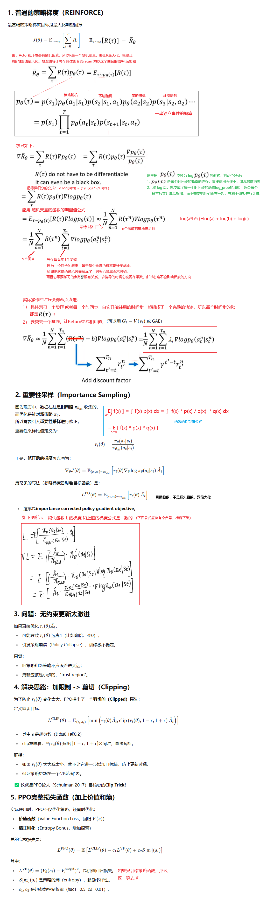

**Proximal Policy Optimization Algorithms**

### Introduction

PPO方法希望解决：

1. RL方法是可扩展的（支持大模型、可以并行的训练）
2. 样本数据利用率高
3. 健壮稳定（能成功处理各种任务而不需要调超参数）

论文把PPO与TRPO做对比：PPO和TRPO一样具备样本的高利用率和可靠的性能，同时又不会像TRPO那样复杂的需要二阶导。

### Algorithm

下图是如何从普通的策略梯度，推出PPO的梯度：

算法如下：

在 **PPO 的 Algorithm 1** 中，使用 **N 个并行 Actor（1 到 N）** 的主要目的是 **提高数据收集效率**，从而加速训练。但如果只想用 **1 个 Actor**，仍然可以训练，只需调整部分超参数。下面详细解释：

**并行 Actor 的作用**：

1. 加速数据收集：
   - 多个 Actor 同时与环境交互，能在相同时间内收集更多样本。
   - 例如，N=8，每个 Actor 跑 T=2048 步 → 总数据量 = 8×2048=16,384 步/迭代。
2. 降低样本相关性：
   - 不同 Actor 在不同环境实例（或不同随机种子）中运行，数据更具多样性。
3. 适用于分布式训练：
   - 在 CPU/GPU 集群上，多个 Actor 可以并行执行，提高硬件利用率。

这N个Actor会在每个iterator都对齐参数。

### Experiments

下图是在一系列任务上的与其他算法的性能对比

