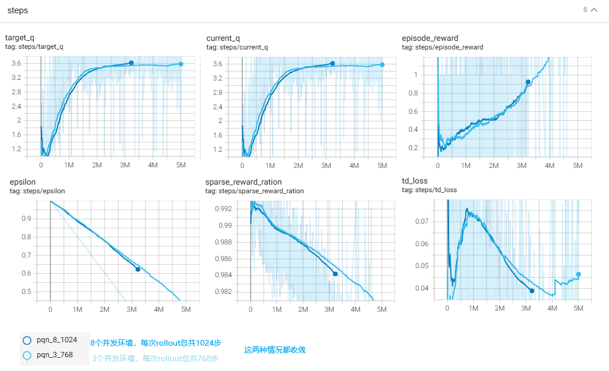

**SIMPLIFYING DEEP TEMPORAL DIFFERENCE LEARNING**

### Introduction

DQN主要被诟病的是：

1. TD不稳定，尤其使用off-policy和深度神经网络后

业界有做一些改进，例如：

1. batch learning
2. target network
3. double Q network
4. 熵正则


本论文通过以下手段简化和改进DQN标准算法：

1. 去掉target Q价值网络
2. 去掉replay buffer
3. 改off-policy为on-policy (bison:这不是导致更低的样本利用率？)

采取的手段有：

1. 增加LayerNorm 层来稳定训练
2. 并行环境交互

效果号称：

1. 和Rainbow、PPO这样的复杂算法一样有竞争力
2. 比标准DQN算法快50倍


论文的贡献：

1. 理论贡献
   1. TD算法的稳定性分析
   2. 理论证明在Q函数近似网络中引入LayNorm和L2正则，使得网络可收敛，这样使得TD算法可以不需要target network
2. 经验贡献
   1. 提出了PQN，一种简化、并发的DQN版本，它不需要replay buffer和target network
   2. 展示了PQN更好实现、更有利于GPU并行计算（因为没有很占内存的replay buffer）
   3. PQN比很多现有的先进算法花费更少的墙上时钟时间


### PRELIMINARIES

介绍了RL的基本原理、TD算法、并发环境，我都会 ：）

特意澄清一个概念：


### ANALYSIS OF REGULARISED TD

看不懂，但我也把AI的分析摘抄下来，也许哪天又看懂了呢：


### PARALLELISED Q-LEARNING


### Experiments

效果：


### bison的实验



从上图可以看出：

1. 使用TD(0)算法，reward稀疏也是可以训练的。一开始每次收集到的轨迹里面，99%的时间步的reward都是0
2. cleanRL的示例代码，是用的TD(lambda)，我的代码是用的TD(0)，在breakout这种奖励稀疏的环境下，TD(lambda)会更好，而且融合了MTC的优势，也就是能更好的克服TD(0)的有偏的问题，当然方差就大一点。
3. 3个并行的环境共计完成2百万步，耗时51分。但是这个其实不太好与DQN比较墙上时钟的效率，毕竟实现细节可以有很多出入

代码如下：

```python
import os
import random
from random import shuffle

import numpy as np
from typing import Optional
import ale_py

from stable_baselines3.common.env_util import make_atari_env
from stable_baselines3.common.vec_env import VecFrameStack

import torch
import torch.nn as nn
import torch.optim as optim
import torch.nn.functional as F
from torch.utils.tensorboard import SummaryWriter
from datetime import datetime


# 设备配置
device = torch.device("cuda" if torch.cuda.is_available() else "cpu")


class CNN_PQN(nn.Module):
    def __init__(self, stack_size: int, action_dim: int):
        super(CNN_PQN, self).__init__()
        self.conv1 = nn.Conv2d(stack_size, 32, kernel_size=8, stride=4)
        self.ln1 = nn.LayerNorm([32, 20, 20])
        self.conv2 = nn.Conv2d(32, 64, kernel_size=4, stride=2)
        self.ln2 = nn.LayerNorm([64, 9, 9])
        self.conv3 = nn.Conv2d(64, 64, kernel_size=3, stride=1)
        self.ln3 = nn.LayerNorm([64, 7, 7])
        self.fc1 = nn.Linear(64 * 7 * 7, 512)
        self.ln_fc = nn.LayerNorm(512)
        self.fc2 = nn.Linear(512, action_dim)

    def forward(self, x):
        x = F.relu(self.ln1(self.conv1(x)))
        x = F.relu(self.ln2(self.conv2(x)))
        x = F.relu(self.ln3(self.conv3(x)))
        x = x.view(x.size(0), -1)
        x = F.relu(self.ln_fc(self.fc1(x)))
        return self.fc2(x)


class PQNAgent:
    def __init__(self, env, stack_size=4, gamma=0.99, lr=1e-4,
                 initial_epsilon=1.0, final_epsilon=0.01, n_envs=4):
        self.env = env
        self.n_envs = n_envs
        self.stack_size = stack_size
        self.action_dim = env.action_space.n
        self.gamma = gamma
        self.epsilon = initial_epsilon
        self.final_epsilon = final_epsilon

        self.policy_net = CNN_PQN(stack_size, self.action_dim).to(device)
        self.optimizer = optim.Adam(self.policy_net.parameters(), lr=lr)

        dt = datetime.now().strftime("%Y%m%d_%H%M%S")
        self.writer = SummaryWriter(log_dir=f"logs/pqn_{dt}")
        self.steps_cnt = 1

    def select_action(self, state, evaluate=False):
        if not evaluate and random.random() < self.epsilon:
            return np.random.randint(0, self.action_dim, size=self.n_envs)

        state_tensor = torch.FloatTensor(state).to(device)
        with torch.no_grad():
            q_values = self.policy_net(state_tensor)
        return q_values.argmax(dim=1).cpu().numpy()

    def update_model(self, s, a, r, s_, done):
        batch_sz = 64
        total_samples = len(s)
        indices = list(range(total_samples))
        random.shuffle(indices)

        # 划分批次
        for start_idx in range(0, total_samples, batch_sz):
            end_idx = min(start_idx + batch_sz, total_samples)
            batch_idx = indices[start_idx:end_idx]

            batch_s = s[batch_idx]
            batch_s_next = s_[batch_idx]
            batch_a = a[batch_idx]
            batch_r = r[batch_idx]
            batch_done = done[batch_idx]

            current_q = self.policy_net(batch_s).gather(1, batch_a).squeeze()
            with torch.no_grad():
                next_q = self.policy_net(batch_s_next).max(1)[0] # max()函数返回tuple，包含max_values, max_indices
                target_q = batch_r + self.gamma * (1 - batch_done) * next_q


            loss = F.mse_loss(current_q, target_q)

            self.optimizer.zero_grad()
            loss.backward()
            torch.nn.utils.clip_grad_norm_(self.policy_net.parameters(), 10.0)
            self.optimizer.step()

        return loss.item(), current_q.mean().item(), target_q.mean().item()

    def decay_epsilon(self, episode, total_episodes):
        self.epsilon = self.final_epsilon + (1.0 - self.final_epsilon) * max(0, (1 - episode / total_episodes))

    def calc_returns(self, states, next_states, rewards, dones):
        # Compute Q(lambda) targets
        num_steps = states.shape[0]
        with torch.no_grad():
            returns = torch.zeros_like(rewards).to(device)
            for t in reversed(range(num_steps)):
                next_value, _ = torch.max(self.policy_net(next_states[t].unsqueeze(0)), dim=-1)
                nextnonterminal = 1.0 - dones[t]
                returns[t] = rewards[t] + 0.99 * next_value * nextnonterminal
        return returns


    def train(self, total_steps=2_000_000):
        episode_cnt = 0 #统计evn#0经历的回合个数，用于控制训练的次数

        max_reward = -float('inf')
        states = self.env.reset()
        states = states.transpose(0, 3, 1, 2)
        total_reward = 0  # env#0 的回合回报

        steps_per_batch = 256
        batch_size = self.n_envs * steps_per_batch

        # 提前分配好 numpy 数组. 类似PPO，收集一轮固定长度的轨迹信息
        processed_states = np.empty((batch_size, 4, 84, 84), dtype=np.uint8)
        processed_next_states = np.empty((batch_size, 4, 84, 84), dtype=np.uint8)
        processed_actions = np.empty((batch_size,), dtype=np.int64)
        processed_rewards = np.empty((batch_size,), dtype=np.float32)
        processed_dones = np.empty((batch_size,), dtype=np.float32)

        while self.steps_cnt < total_steps:
            index = 0
            for _ in range(steps_per_batch):
                actions = self.select_action(states)
                next_states, rewards, dones, infos = self.env.step(actions)
                next_states = next_states.transpose(0, 3, 1, 2)
                self.steps_cnt += self.n_envs
                total_reward += rewards[0]

                if dones[0]:
                    self.writer.add_scalar("steps/episode_reward", total_reward, self.steps_cnt)
                    if total_reward > max_reward:
                        max_reward = total_reward
                        torch.save(self.policy_net.state_dict(), f"best_model.pth")
                    total_reward = 0
                    episode_cnt += 1

                for env_idx in range(self.n_envs):
                    processed_states[index] = states[env_idx]

                    if dones[env_idx]:
                        if infos[env_idx].get("TimeLimit.truncated", False):
                            processed_dones[index] = 0.0  # False
                            processed_next_states[index] = next_states[env_idx]
                        else:
                            next_stt = infos[env_idx]["terminal_observation"]
                            processed_next_states[index] = next_stt.transpose(2, 0, 1)
                            processed_dones[index] = 1.0
                    else:
                        processed_next_states[index] = next_states[env_idx]
                        processed_dones[index] = 0.0

                    processed_actions[index] = actions[env_idx]
                    processed_rewards[index] = rewards[env_idx]
                    index += 1

                states = next_states

            # 训练阶段（只转换一次）
            s_tensor = torch.from_numpy(processed_states).float().to(device)
            s_next_tensor = torch.from_numpy(processed_next_states).float().to(device)
            a_tensor = torch.from_numpy(processed_actions).long().unsqueeze(1).to(device)
            r_tensor = torch.from_numpy(processed_rewards).float().to(device)
            done_tensor = torch.from_numpy(processed_dones).float().to(device)
            #统计一下reward == 0 的时间步的比例
            self.writer.add_scalar("steps/sparse_reward_ration", (r_tensor==0).long().sum().item() / r_tensor.shape[0], self.steps_cnt)

            for _ in range(4):
                loss, current_q, target_q = self.update_model(s_tensor, a_tensor, r_tensor, s_next_tensor, done_tensor )
            self.writer.add_scalar("steps/td_loss", loss, self.steps_cnt)
            self.writer.add_scalar("steps/current_q", current_q, self.steps_cnt)
            self.writer.add_scalar("steps/target_q", target_q, self.steps_cnt)
            self.decay_epsilon(self.steps_cnt, total_steps)
            self.writer.add_scalar("steps/epsilon", self.epsilon, self.steps_cnt)
            print(f"Episode {episode_cnt} | Epsilon: {self.epsilon:.3f}")
        torch.save(self.policy_net, "./pqn_breakout.pth")
        self.writer.close()

    def evaluate(self, vec_env, num_episodes=5, model_path="best_model.pth"):
        self.policy_net.load_state_dict(torch.load(model_path))
        self.policy_net.eval()

        total_rewards = []
        for ep in range(num_episodes):
            states = vec_env.reset()
            states = states.transpose(0, 3, 1, 2)
            done = False
            total_reward = 0

            while not done:
                actions = self.select_action(states, evaluate=True)
                states, rewards, dones, _ = vec_env.step(actions)
                vec_env.render("human")
                states = states.transpose(0, 3, 1, 2)
                total_reward += rewards[0]
                done = dones[0]

            total_rewards.append(total_reward)
            print(f"Evaluation Episode {ep+1} | Reward: {total_reward:.2f}")

        print(f"Average Reward: {np.mean(total_rewards):.2f}")


if __name__ == "__main__":
    n_envs = 3
    vec_env = make_atari_env('BreakoutNoFrameskip-v4', n_envs=n_envs, seed=0)
    vec_env = VecFrameStack(vec_env, n_stack=4)

    agent = PQNAgent(vec_env, n_envs=n_envs)
    agent.train()

    n_envs = 1  # 用于演示，所以一个就够
    vec_env = make_atari_env('BreakoutNoFrameskip-v4', n_envs=n_envs, seed=0)
    vec_env = VecFrameStack(vec_env, n_stack=4)
    agent.evaluate(vec_env, 5)

```

#### python程序性能分析

一开始，我的PQN代码性能很差，慢的无法忍受。我用下面的命令很方便就分析出来瓶颈所在：

```
# 加上-m cProfile -s time -o pqn_profile.prof这几个参数
python3 -m cProfile -s time -o pqn_profile.prof   ./PQN_Breakout.py

#安装分析工具
pip3 install snakeviz

#查看性能分析
snakeviz pqn_profile.prof
```


性能开销主要就是在update_model函数里临时把list转tensor开销非常大，让这个函数占了整个程序执行时间的95%。优化方法就是一开始就创建指定大小的numpy数组，收集轨迹的过程对号入座的插入数据，然后预先转tensor后传给update_model函数。