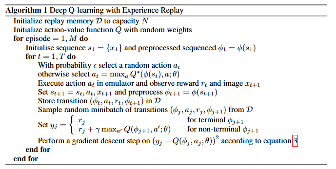
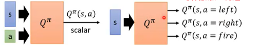
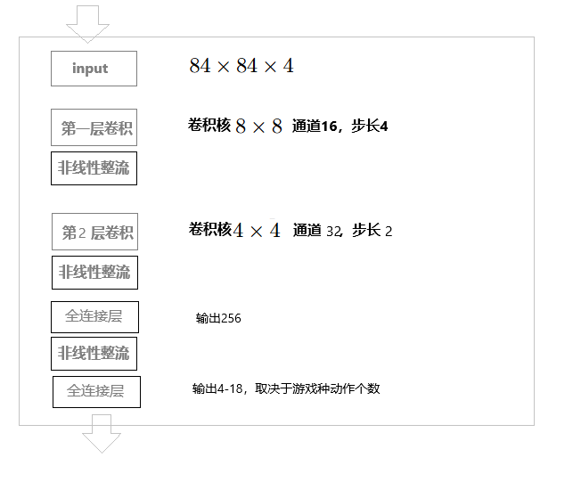
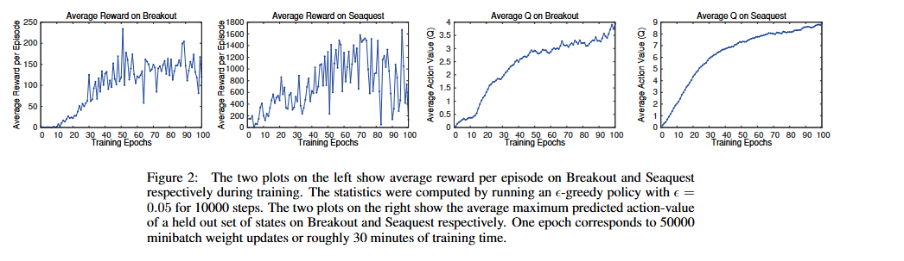
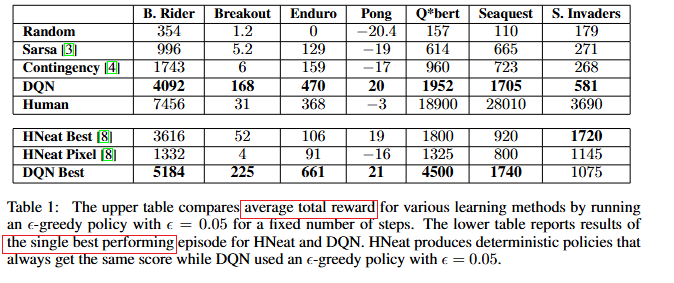

**Playing Atari with Deep Reinforcement Learning**

#### Abstract

bison:这居然是 2013年的论文。

提出了第一个深度学习模型，成功地使用强化学习从高维感官的原始数据中中直接学习控制策略。

这个模型是一个卷积神经网络模型，使用Q learning变种算法进行训练，输入是原始的像素信息，输出是未来奖励的估计。

我们对7个Atari游戏应用了该模型，在其中6款游戏上超出了以往所有方法，在三款游戏上超出了人类专家。

#### 1. Introduction

直接使用高维感官输入来训练控制agent，例如视觉或者语音，是RL长期以来的挑战。大多数成功的RL都依赖手工的特征工程。这些系统的表现都强依赖特征表示的质量。

近期在深度学习方面的进展，使得直接从感官数据提取高维特征成为可能。自然而然的就会思考：这样的技术是否对需要处理原始数据的RL有帮助。

但是RL从深度学习的角度提出了好几个挑战：

1. 深度学习要求大量的手工标注的训练数据，RL必须从标量奖励中学习，这些信号通常都是稀疏、有噪声、延迟的。action和结果奖励之间的延迟是特别使人气馁的。
2. 深度学习通常假定样本之间是独立分布的，而RL面对的是强相关的数据序列。而且在RL中，当机器学会新的行为后，数据分布会发生变化，这对于假定底层数据分布是固定的深度学习来说是特别成问题的

该论文成功的使用CNN克服了上述挑战。为了缓解数据相关和变化的数据分布问题，我们使用了回放机制，随机采样之前的状态转换，对来自过去大量行为的训练数据的分布起到了平滑的作用。

Atari 2600是一个有挑战的RL测试环境，它给agent输入高维的视觉原始数据，并呈现对人类来说很有挑战的多样且有趣的游戏任务。我们的目标是用单一的CNN网络让agent学习玩尽量多的游戏。我们不给CNN网络提供任何游戏特有的信息或者人工设计的视觉特征，也不能访问到游戏模拟器内部的状态，提供给RL的只有视频输入、奖励信息、终止信号、动作集合，就像人类玩家感知到的一样。并且游戏过程中，网络架构和训练用的超参数保持不变。

#### 2. Background

...此处省略一堆有关强化学习的术语解释和过程解释...

仅仅基于当下的屏幕画面来对游戏局势进行正确的理解不太可能，所以我们考虑输入 画面和动作交替的时间序列并基于该序列来学习游戏策略，这样就形成了马尔可夫决策过程，在这个过程中，每个序列就是一个明确的状态，这样我们就可以对MDP实施标准的RL方法。

...此处省略大量关于贝尔曼方程的解释，教材里讲得比较清楚，就不另外摘抄...

注意：在Q-learning中，target值依赖于要学习的网络参数seta，这个跟深度神经网络里通常的标注是不一样的，DL中标注在开始训练前就确定了。

#### 3. Related Work

双陆棋是RL的一个成功案例，使用模型无关的近似Q-learning的RL算法，用包含一层隐藏层的多层感知机拟合出了状态价值函数。

但是随后在国际象棋、围棋、西洋棋中尝试模仿双陆棋进行RL，都没有那么成功。所以大家一度认为双陆棋是一个特例，双陆棋中掷色子的环节引入的随机有利于探索更多空间，让价值函数特别平滑。

而且，有显示把模型无关的RL与非线性函数拟合 组合在一起，通常导致Q-network发散不收敛。所以一段时间内，RL主要集中在线性函数的拟合，以保证更好的收敛。

最近，把深度神经网络和RL结合在一起的方法又有复兴。深度神经网络被用来估计环境。而且，Q-Learning算法发散的问题，已经被梯度时间差分算法部分的解决了。使用非线性拟合来评估一个固定的策略，或者当使用Q学习的受限变体学习具有线性函数逼近的控制策略时，被证明这些做法是收敛的。但这些方法都没有被扩展到非线性的控制中。

可能和我们最类似的先驱工作，是神经网络拟合Q-Learning（NFQ）。...这里省略大把介绍NFQ的文字...NFQ也已成功应用于使用纯视觉输入的简单现实世界控制任务。不同的是，我们的方法是端到端的应用RL。Q-Learning之前也有结合回放和简单神经网络的做法，但还是从低维的状态开始，而不是原始的视觉信息。

之前也有人用Atari 2600模拟器作为RL平台，通过使用大量的特征来改进结果，并使用拔河hash方法把特征投影到低维空间。例如HyperNEAT 。

#### 4. Deep Reinforcement Learning

论文的算法如下：

该论文算法比标准Q Learning算法有如下优势：

1. 每一步的与环境交互的经验，可用于多次深度网络的权重更新，这样数据效能大大提升了
2. 由于连续的时间步之间有强相关性，随机采样的minibatch方式的训练打破了这样的相关性，降低了参数更新的方差
3. 经验回放可以防止陷入局部最优或者发散的灾难，平滑了我们的训练过程，避免振荡和发散。需要特别注意的是：经验回放的方式，是off-policy方法，因为模型当前的参数与产生训练样本的参数是不同的。

实际操作过程中，我们只存储最近的N条经验元组（s, a, r, s'）并做均匀随机抽样，这样做有一定的局限性，没有考虑不同经验元组的重要程度不同，且受限于回放缓存的空间，最近的经验会覆盖旧的经验。一个更精妙的抽样方法可能是更多的重视那些能让我们学习得更多的经验元组（bison：类似按优先级的经验回放DQN），区分不同的优先级。

##### 4.1 预处理和模型架构

直接输入原始的Atari游戏视频帧是计算复杂度很高的，因为每帧是210 x 160 尺寸的图片，带有128种颜色的调色板。所以进行预处理，包括：

1. RGB转灰度图
2. 图片尺寸下采样为110 x 84 
3. 裁剪出 84 x 84 大小的游戏区域（因为GPU实现2D卷积需要正方形输入）

算法1种的Φ函数，负责对输入做上述预处理，并把时间步历史种的最近4帧数据叠加在一起，作为卷积Q网络的输入

把预处理后的图片与动作输入到Q网络，输出scalar类型的价值，这样做一个弊端就是：有多少个action，就要进行多少次前向传播。更好的网络架构是：输入预处理后的图片，输出一组标量价值，每个价值对应一个action，有几个可能的action就输出几个价值。这样就只需要一次前向传播，就可以计算出所有action的价值。

网络内部结构如下：

bison:  论文中 a rectifier nonlinearit 应该是指ReLU这样的非线性激活函数吧

#### 5. Experiments

##### 5.1 训练与稳定性

有监督的深度神经网络的训练，可以通过评估模型在测试集上的表现来监控模型性能的提升和训练收敛，但在RL中，评估模型的性能提升是有挑战的。一个评估指标是用平均每个回合的回报（折扣奖励加和），我们训练的时候会定期用这个指标对模型做评估，通常这个指标会有比较多的噪声，因为模型参数的微小改变，可能引发策略访问到的状态的分布的巨大变化。

另外也给相对稳定的评估指标是模型Q函数输出的平均值，它表明模型在指定的状态下每个动作可以获得的未来所有折扣奖励加和。

我们在训练过程中虽然经历了噪声和抖动，但没有发现发散的问题。这表明：尽管缺乏理论性的收敛保障，我们的方法可以使用RL和随机梯度下降来稳定的训练较大的深度神经网络。

下面是使用两个指标监控训练过程是否收敛的图：

##### 5.2 价值函数可视化

这里用一个例子说明了价值函数的平均值是如何正确反映游戏画面的。说明论文中的方法可以训练一个Q网络，以正确的针对相当复杂的游戏事件做出演变。

##### 5.3 主要评价

与几个state-of-the-art的行业算法相比较：

1. Sarsa：线性策略 + 手工设计特征
2. Contingency：类似Sarsa，增强了特征
3. HNeat Best分数反映了通过使用手工设计的物体检测器算法获得的结果，该算法输出屏幕上的物体位置和物体类型
4. HNeat Pixel分数是通过使用Atari仿真器的特殊8色通道表示来获得的，该通道表示每个通道的对象标签图。这种方法在很大程度上依赖于找到代表成功利用的确定性状态序列。

请注意，这两种方法都通过使用背景减法，将128种颜色中的每一种视为单独的通道，这样结合有关视觉问题的重要先验知识：因为很多Atari游戏都是用独特的颜色来绘制不同的物体。而我们的方法没有使用这种先验知识，模型必须自己学会检测物体。

此外，我们还与随机策略、人类专业玩家做了对比。

可以看到我们的方法在Breakout  Enduro Pong三个游戏上超过了人类玩家。而其他几个款游戏人类玩家表现更好，是因为这些游戏需要基于更长时间的策略。

#### 6. 结论

本论文介绍了一种新的强化学习模型，并展示了它仅使用原始像素作为输入来掌握Atari 2600电脑游戏的复杂控制策略的能力。

我们还提出了一种在线Q学习的变体，它将随机小批量更新与经验回放记忆相结合，以简化RL深度网络的训练。

我们的方法在测试的七款游戏中的六款中给出了最好的结果，不需要调整架构或超参数。