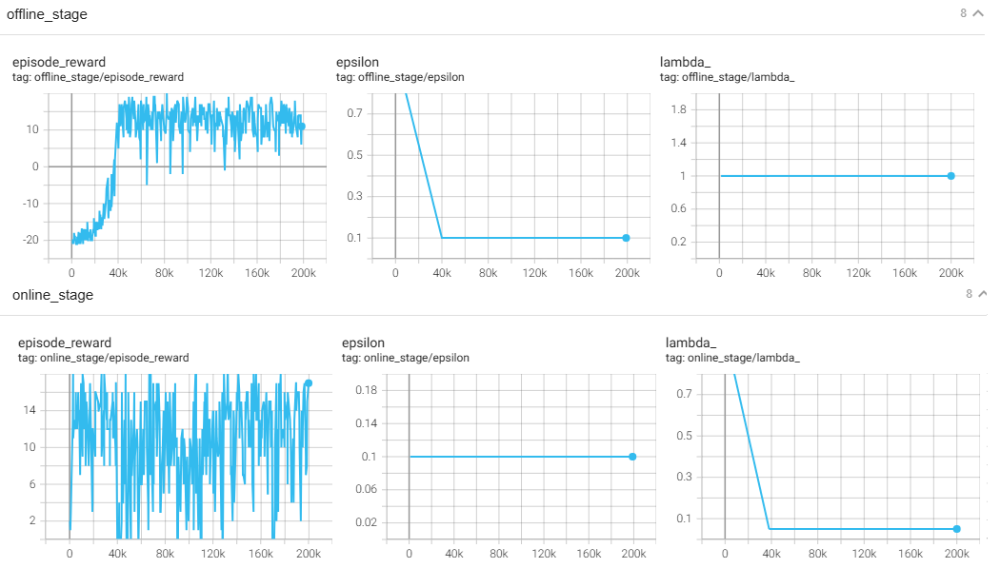

**Reincarnating Reinforcement Learning:Reusing Prior Computation to Accelerate Progress**

### Introduction

1. 在大型任务场景下，从头训练agent是一个计算密集、耗时长久的事情。而且通常随着模型和参数的调整导致反复从头训练，费时费力。例如训练一个agent玩转50款atari游戏，需要1000GPU天的训练；训练一个打星际争霸的agent，需要数百万美金的开销。
2. 重生RL（Reincarnating RL ）的思路是尽量利用已经训练的网络参数或者已经收集的环境交互数据，来加速训练的一种工作流模式。
3. 根据前期不同的数据形态（log下来的数据、已经训练的策略...），RRL有不同的方法。论文的工作关注的是从已经训练的策略网络迁移到价值网络的RRL方法（PVRL) 。
4. 为了从已有的策略网络“断奶”（断开依赖），我们使用QDagger方法，它结合了Dagger和n-steps Q-learning方法。


效果：


几个词汇：

1. tabula rasa：白板、从草稿开始的意思。a situation in which nothing has yet been planned or decided, so that someone is free to decide what should happen or be done
2. ad hoc: 临时起意的，不具有通用性的。made or happening only for a particular purpose or need, not planned before it happens。作者用来形容OpenAI等很多为每个项目专门做的重生RL方案
3. Reincarnating RL 指的是在已有策略、模型、数据、知识的基础上启动新的 RL 训练，以避免从头开始训练，提升样本效率。包含：
   1. 重用旧策略（pretrained policy）
   2. 利用旧环境收集的数据（offline data reuse）
   3. 从旧模型中提取知识（如 distillation、迁移学习）
   4. 替代 warm-start 或 cold-start 的方法

### Preliminaries

介绍了RL的基本概念，包括策略、价值函数、贝尔曼方程等等

### Related Work

介绍了行业前辈们做的偏临时起意的重生RL方案：

1. OpenAI训练agent打dota的时候，使用了net2net的迁移学习方案
2. AlphaStar使用了population-based training (PBT)
3. Akkaya 使用了 behavior cloning via on-policy distillation
4. AlphaGo使用了 behavior cloning on human replays for initializing the policy

我们的方案对比类似方案的优势：

1. behavior cloning is only applicable for policy to policy transfer，但我们的方案可以做policy to value function迁移
2. fine-tuning is often constrained to use the same architecture ，但我们的方案可以实现异构间的迁移

还提到了offline RL, imitation learning, transfer in RL,continual RL，learning from demonstrations (LfD)这些概念。

### Case Study: Policy to Value Reincarnating RL

通篇论文没有具体介绍某个RRL算法。我找AI整理了QDagger算法：


### Conclusion

RRL 不是一个新的算法，而是一种训练方法论：别再每次从零训练，用好历史模型、数据和策略，带着‘前世记忆’开始新一轮强化学习。


### bison的实验

根据前面的经验知道，用DQN算法难以训练出agent玩转Pong任务，因为这个任务的奖励太稀疏了。

所以这次的实验，特意挑战一下：就以Gym的Pong为任务，以[CleanRL训练的PPO模型](https://github.com/vwxyzjn/cleanrl/blob/master/cleanrl/ppo_atari.py)为teacher，蒸馏学习DQN，看看有teacher的帮助，能否训练出好的DQN模型来。

通过一些取巧的超参数调整，最终让DQN学习到了正确的策略：

1. offline阶段，loss全部由distill_loss组成，TD loss被忽略，而且epsilon很快降低到0.1，让replaybuffer里大量的teacher的action，相当于teacher进行标注，然后对DQN做有监督学习。学习的时间步要足够多：20万步
2. online阶段，teacher要尽快退场，让DQN凭借在上一阶段学习到的本领，去环境中搏杀，获得正面和负面的回报，使用RL的方式进行学习，这时候TD loss是主要的。也保证足够多的时间步：20万步

showcase效果如下（可惜不能渲染出画面，我记得SB3的VecEnv是可以同时输出rgb_array同时渲染出画面的）：

```
episode reward:20.0
episode reward:20.0
episode reward:20.0
episode reward:20.0
episode reward:20.0
```

teacher模型可是用了400万步才获得这样的能力，student只用了40万步就学习到了。可见QDagger算法有明显的作用。




代码如下：

```python
import torch
import torch.nn as nn
import torch.nn.functional as F
import torch.optim as optim
from torch.utils.tensorboard import SummaryWriter

import gymnasium as gym
import numpy as np
import random
import os
from collections import deque, namedtuple
from datetime import datetime
from torch.distributions.categorical import Categorical
from stable_baselines3.common.atari_wrappers import (  # isort:skip
    ClipRewardEnv,
    EpisodicLifeEnv,
    FireResetEnv,
    MaxAndSkipEnv,
    NoopResetEnv,
)
from tqdm import tqdm
import ale_py

# ----------- 超参数 -----------
BATCH_SIZE = 32
GAMMA = 0.99
LEARNING_RATE = 1e-4
BUFFER_SIZE = int(1e5)
MIN_REPLAY_SIZE = 5000
TARGET_UPDATE_FREQ = 1000
TAU = 1.0   # temperature for softmax
LAMBDA = 1.0  # distillation loss weight
EPSILON_START = 1.0
EPSILON_END = 0.1
OFFLINE_PHASE_STEPS = 200_000
ONLINE_PHASE_STEPS = 200_000
env_id = "PongNoFrameskip-v4"
num_envs=4
model_saving="./Pong_DQN_QDagger.pth"

DEVICE = torch.device("cuda" if torch.cuda.is_available() else "cpu")

# todo:
# LAMBDA 要衰减
# 两阶段的replay_buffer应该要分开

#----------------------environments--------------------
def make_env(env_id, idx, capture_video, run_name):
    def thunk():
        if capture_video and idx == 0:
            env = gym.make(env_id, render_mode="rgb_array")
            env = gym.wrappers.RecordVideo(env, f"videos/{run_name}")
        else:
            env = gym.make(env_id)
        env = gym.wrappers.RecordEpisodeStatistics(env)
        env = NoopResetEnv(env, noop_max=30)
        env = MaxAndSkipEnv(env, skip=4)
        env = EpisodicLifeEnv(env)
        if "FIRE" in env.unwrapped.get_action_meanings():
            env = FireResetEnv(env)
        env = ClipRewardEnv(env)
        env = gym.wrappers.ResizeObservation(env, (84, 84))
        env = gym.wrappers.GrayscaleObservation(env)
        env = gym.wrappers.FrameStackObservation(env, 4)
        return env

    return thunk

# -------------------- teacher -----------------------
def layer_init(layer, std=np.sqrt(2), bias_const=0.0):
    torch.nn.init.orthogonal_(layer.weight, std)
    torch.nn.init.constant_(layer.bias, bias_const)
    return layer

class Agent(nn.Module):
    def __init__(self, envs):
        super().__init__()
        self.network = nn.Sequential(
            layer_init(nn.Conv2d(4, 32, 8, stride=4)),
            nn.ReLU(),
            layer_init(nn.Conv2d(32, 64, 4, stride=2)),
            nn.ReLU(),
            layer_init(nn.Conv2d(64, 64, 3, stride=1)),
            nn.ReLU(),
            nn.Flatten(),
            layer_init(nn.Linear(64 * 7 * 7, 512)),
            nn.ReLU(),
        )
        self.actor = layer_init(nn.Linear(512, envs.single_action_space.n), std=0.01)
        self.critic = layer_init(nn.Linear(512, 1), std=1)

    def get_value(self, x):
        return self.critic(self.network(x / 255.0))

    def get_action_and_value(self, x, action=None):
        hidden = self.network(x / 255.0)
        logits = self.actor(hidden)
        probs = Categorical(logits=logits)
        if action is None:
            action = probs.sample()
        return action, probs.log_prob(action), probs.entropy(), self.critic(hidden)
    def get_action_prob(self, x):
        hidden = self.network(x / 255.0)
        logits = self.actor(hidden)
        return torch.nn.functional.softmax(logits, dim=1)


# ----------- Replay Buffer -----------
Transition = namedtuple('Transition', ['state', 'action', 'reward', 'next_state', 'done'])

class ReplayBuffer:
    def __init__(self, capacity):
        self.buffer = deque(maxlen=capacity)

    def push(self, *args):
        self.buffer.append(Transition(*args))

    def sample(self, batch_size):
        transitions = random.sample(self.buffer, batch_size)
        return Transition(*zip(*transitions))

    def __len__(self):
        return len(self.buffer)
    def clear(self):
        self.buffer.clear()

# ----------- DQN 网络 -----------
class DQN(nn.Module):
    def __init__(self, input_shape, n_actions):
        super(DQN, self).__init__()
        self.net = nn.Sequential(
            nn.Conv2d(input_shape[0], 32, kernel_size=8, stride=4),
            nn.ReLU(),
            nn.Conv2d(32, 64, kernel_size=4, stride=2),
            nn.ReLU(),
            nn.Conv2d(64, 64, kernel_size=3, stride=1),
            nn.ReLU(),
            nn.Flatten(),
            nn.Linear(3136, 512),
            nn.ReLU(),
            nn.Linear(512, n_actions)
        )

    def forward(self, x):
        return self.net(x / 255.0)  # normalize pixel values

# ----------- QDagger Trainer -----------
class QDaggerTrainer:
    def __init__(self, envs, teacher, run_name, log_dir='logs'):
        self.envs = envs
        self.teacher = teacher
        obs_shape = envs.single_observation_space.shape
        n_actions = envs.single_action_space.n

        self.q_net = DQN(obs_shape, n_actions).to(DEVICE)
        self.target_q_net = DQN(obs_shape, n_actions).to(DEVICE)
        self.target_q_net.load_state_dict(self.q_net.state_dict())

        self.optimizer = optim.Adam(self.q_net.parameters(), lr=LEARNING_RATE)
        self.replay_buffer = ReplayBuffer(BUFFER_SIZE)
        self.writer = SummaryWriter(os.path.join(log_dir, run_name))

        self.n_actions = n_actions
        self.global_step = 0
        self.run_name = run_name

    def softmax_policy(self, q_values):
        return F.softmax(q_values / TAU, dim=-1)

    def epsilon_greedy_action(self, q_values, epsilon):
        if random.random() < epsilon:
            return random.randint(0, self.n_actions - 1)
        else:
            return q_values.argmax().item()

    def update(self, stage:str, lambda_: float):
        if len(self.replay_buffer) < MIN_REPLAY_SIZE:
            return

        batch = self.replay_buffer.sample(BATCH_SIZE)

        state = torch.tensor(np.array(batch.state), dtype=torch.float32).to(DEVICE)
        action = torch.tensor(batch.action).to(DEVICE)
        reward = torch.tensor(batch.reward, dtype=torch.float32).to(DEVICE)
        next_state = torch.tensor(np.array(batch.next_state), dtype=torch.float32).to(DEVICE)
        done = torch.tensor(batch.done, dtype=torch.float32).to(DEVICE)

        # TD Loss
        q_values = self.q_net(state)
        q_value = q_values.gather(1, action.unsqueeze(1)).squeeze(1)

        with torch.no_grad():
            next_q_values = self.target_q_net(next_state)
            max_next_q = next_q_values.max(1)[0]
            target_q = reward + GAMMA * (1 - done) * max_next_q

        td_loss = F.mse_loss(q_value, target_q)

        # Distillation Loss（仅 teacher 阶段有效）
        with torch.no_grad():
            teacher_prob = self.teacher.get_action_prob(state).to(dtype=torch.float32)
        student_logits = self.q_net(state)
        student_prob = self.softmax_policy(student_logits)
        distill_loss = F.kl_div(student_prob.log(), teacher_prob, reduction='batchmean')

        loss = td_loss * (1-lambda_) + lambda_ * distill_loss #todo: 我自己给td_loss加上了系数，要去掉
        loss = loss.to(dtype=torch.float32)

        self.optimizer.zero_grad()
        loss.backward()
        self.optimizer.step()

        # loggin
        if random.randint(0, 10) < 5: #避免写日志的开销太大
            self.writer.add_scalar(f"{stage}/loss_td", td_loss.item(), self.global_step)
            self.writer.add_scalar(f"{stage}/loss_distill", distill_loss.item(), self.global_step)
            self.writer.add_scalar(f"{stage}/loss_total", loss.item(), self.global_step)
            self.writer.add_scalar(f"{stage}/lambda_", lambda_, self.global_step)

        # Update target
        if self.global_step % TARGET_UPDATE_FREQ == 0:
            self.writer.add_scalar(f"{stage}/update_target", 1, self.global_step)
            self.target_q_net.load_state_dict(self.q_net.state_dict())


    def linear_schedule(self,  duration: int, t: int):
        start_e = EPSILON_START
        end_e = EPSILON_END
        slope = (end_e - start_e) / duration
        return max(slope * t + start_e, end_e)

    def train(self):

        # -----------------------------------------------------------
        # offline learning
        self.global_step = 1
        self.replay_buffer.clear()
        obs,_ = self.envs.reset()
        episode_rewards = [0.0 for _ in range(self.envs.num_envs)]
        lambda_ = LAMBDA
        stage = "offline_stage"
        print(f"start {stage}")
        for self.global_step in tqdm(range(1, OFFLINE_PHASE_STEPS), stage):
            epsilon = self.linear_schedule(OFFLINE_PHASE_STEPS // 5, self.global_step)
            if self.global_step % 1000 == 0:self.writer.add_scalar(f"{stage}/epsilon", epsilon, self.global_step)
            obs_tensor = torch.tensor(obs, dtype=torch.float32).to(DEVICE)

            with torch.no_grad():
                if random.random() < epsilon: #cleanRL的实现是对于offline阶段也做epsilon greedy todo:值得商榷，是不是尽快用上teacher比较好
                    action = np.array([envs.single_action_space.sample() for _ in range(envs.num_envs)])
                else:
                    # 用teacher作为行动策略（epsilon-greedy）
                    action_probs = self.teacher.get_action_prob(obs_tensor) # obs是每个环境一个观测，所以action_prob也是每个环境一个分布
                    action = [np.random.choice(self.n_actions, p=probs.cpu().numpy()) for probs in action_probs] #每个环境一个动作，根据对应的动作分布抽样


            next_obs, reward, done, truncated, info = self.envs.step(action)
            for i in range(self.envs.num_envs):
                terminal = done[i] or truncated[i]
                if done[i] and not truncated[i]: #如果回合正常终止了， 并发环境会自动reset
                    final_next_obs = obs[i] #没办法的事情，会有误差，但比直接使用reset后的下个回合的第一帧强。 gym的并发环境没有在info字段里存放真正的下一帧
                    self.writer.add_scalar(f"{stage}/obs_as_terminal_observation", 1, self.global_step)
                else:
                    final_next_obs = next_obs[i]
                self.replay_buffer.push(obs[i], action[i], reward[i], final_next_obs, terminal)
                episode_rewards[i] += reward[i]

                if done[i] or truncated[i]:
                    self.writer.add_scalar(f"{stage}/episode_reward", episode_rewards[i], self.global_step)
                    episode_rewards[i] = 0.0

            obs = next_obs
            # 这个4，要能整除 TARGET_UPDATE_FREQ， 否则update函数里不会命中TARGET_UPDATE_FREQ
            if self.global_step % 4 == 0:
                self.update(stage, lambda_)
            self.global_step += 1
        #-----------------------------------------------------------
        #online learning
        self.global_step = 1
        self.replay_buffer.clear()
        obs, _ = self.envs.reset()
        episode_rewards = [0.0 for _ in range(self.envs.num_envs)]
        lambda_ = LAMBDA
        stage = "online_stage"
        print(f"start {stage}")
        for self.global_step in tqdm(range(1, ONLINE_PHASE_STEPS), stage):
            epsilon = self.linear_schedule( 0.5 * ONLINE_PHASE_STEPS, self.global_step)
            epsilon = 0.1
            if self.global_step % 1000 == 0: self.writer.add_scalar(f"{stage}/epsilon", epsilon, self.global_step)
            obs_tensor = torch.tensor(obs, dtype=torch.float32).to(DEVICE)

            with torch.no_grad():
                # 用 student 策略（epsilon-greedy）
                q_values = self.q_net(obs_tensor) # obs是每个环境一个观测，所以q_values是每个环境一组数据，每组数据里包括多个动作的回报值大小
                action = [self.epsilon_greedy_action(q, epsilon) for q in q_values] #每个环境得到一个动作

            next_obs, reward, done, truncated, info = self.envs.step(action)
            for i in range(self.envs.num_envs):
                terminal = done[i] or truncated[i]
                if done[i] and not truncated[i]: #如果回合正常终止了， 并发环境会自动reset
                    final_next_obs = obs[i] #没办法的事情，会有误差，但比直接使用reset后的下个回合的第一帧强。 gym的并发环境没有在info字段里存放真正的下一帧
                    self.writer.add_scalar(f"{stage}/obs_as_terminal_observation", 1, self.global_step)
                else:
                    final_next_obs = next_obs[i]
                self.replay_buffer.push(obs[i], action[i], reward[i], final_next_obs, terminal)

                episode_rewards[i] += reward[i]

                if done[i] or truncated[i]:
                    self.writer.add_scalar(f"{stage}/episode_reward", episode_rewards[i], self.global_step)
                    episode_rewards[i] = 0.0

            obs = next_obs
            # 这个4，要能整除 TARGET_UPDATE_FREQ， 否则update函数里不会命中TARGET_UPDATE_FREQ
            if self.global_step % 4 == 0:
                self.update(stage, lambda_)
            self.global_step += 1
            lambda_ = max(0.05, 1.0 - float(self.global_step*5) / ONLINE_PHASE_STEPS)

        torch.save(self.q_net, model_saving)

        self.writer.close()

    def show(self):
        self.q_net = torch.load(model_saving, weights_only=False)
        self.q_net = self.q_net.to(DEVICE)
        self.q_net.eval()

        envs = gym.vector.SyncVectorEnv(
            [make_env(env_id, 0, False, "")],
        )

        for _ in range(5):
            obs, _ = envs.reset()
            episode_reward = 0

            while True:

                obs_tensor = torch.tensor(obs, dtype=torch.float32).to(DEVICE)

                with torch.no_grad():
                    q_values = self.q_net(obs_tensor)  # obs是每个环境一个观测，所以q_values是每个环境一组数据，每组数据里包括多个动作的回报值大小
                action = [q.argmax().item() for q in q_values]

                next_obs, reward, done, truncated, info = envs.step(action)
                #envs.render() #不知道怎么把图片画出来
                episode_reward += reward[0]
                if done[0] or truncated[0]:
                    break
                obs = next_obs
            print(f"episode reward:{episode_reward}")
        self.q_net.train()


if __name__ == "__main__":
    # env setup
    envs = gym.vector.AsyncVectorEnv(
        [make_env(env_id, i, False, "") for i in range(num_envs)],
    )
    assert isinstance(envs.single_action_space, gym.spaces.Discrete), "only discrete action space is supported"

    teacher = torch.load("./models/agent_cleanrl_pong.pth", weights_only=False)
    teacher = teacher.to(DEVICE)
    teacher.eval()
    print("teacher loaded")


    trainer = QDaggerTrainer(envs, teacher, run_name=f'qdagger_dqn_pong_{datetime.now().strftime("%y%m%d_%H%M%S")}')
    trainer.train()
    trainer.show()

```

