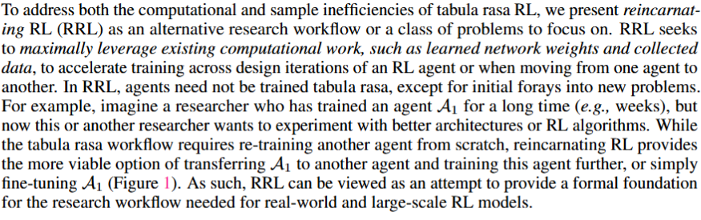
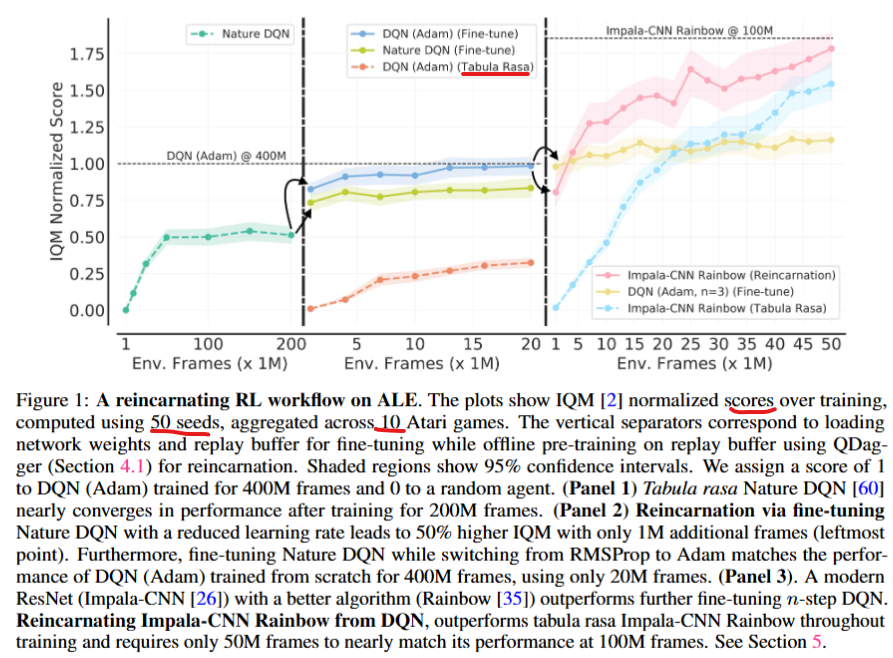
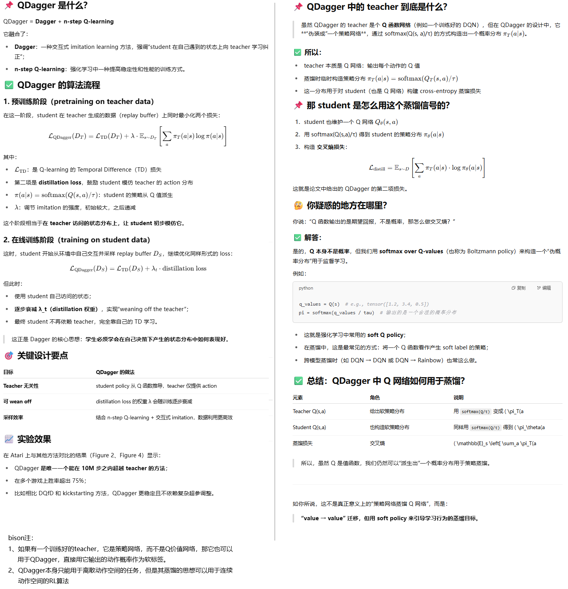
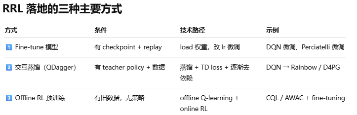

**Reincarnating Reinforcement Learning:Reusing Prior Computation to Accelerate Progress**

### Introduction

1. 在大型任务场景下，从头训练agent是一个计算密集、耗时长久的事情。而且通常随着模型和参数的调整导致反复从头训练，费时费力。例如训练一个agent玩转50款atari游戏，需要1000GPU天的训练；训练一个打星际争霸的agent，需要数百万美金的开销。
2. 重生RL（Reincarnating RL ）的思路是尽量利用已经训练的网络参数或者已经收集的环境交互数据，来加速训练的一种工作流模式。
3. 根据前期不同的数据形态（log下来的数据、已经训练的策略...），RRL有不同的方法。论文的工作关注的是从已经训练的策略网络迁移到价值网络的RRL方法（PVRL) 。
4. 为了从已有的策略网络“断奶”（断开依赖），我们使用QDagger方法，它结合了Dagger和n-steps Q-learning方法。

效果：

几个词汇：

1. tabula rasa：白板、从草稿开始的意思。a situation in which nothing has yet been planned or decided, so that someone is free to decide what should happen or be done
2. ad hoc: 临时起意的，不具有通用性的。made or happening only for a particular purpose or need, not planned before it happens。作者用来形容OpenAI等很多为每个项目专门做的重生RL方案
3. Reincarnating RL 指的是在已有策略、模型、数据、知识的基础上启动新的 RL 训练，以避免从头开始训练，提升样本效率。包含：
   1. 重用旧策略（pretrained policy）
   2. 利用旧环境收集的数据（offline data reuse）
   3. 从旧模型中提取知识（如 distillation、迁移学习）
   4. 替代 warm-start 或 cold-start 的方法

### Preliminaries

介绍了RL的基本概念，包括策略、价值函数、贝尔曼方程等等

### Related Work

介绍了行业前辈们做的偏临时起意的重生RL方案：

1. OpenAI训练agent打dota的时候，使用了net2net的迁移学习方案
2. AlphaStar使用了population-based training (PBT)
3. Akkaya 使用了 behavior cloning via on-policy distillation
4. AlphaGo使用了 behavior cloning on human replays for initializing the policy

我们的方案对比类似方案的优势：

1. behavior cloning is only applicable for policy to policy transfer，但我们的方案可以做policy to value function迁移
2. fine-tuning is often constrained to use the same architecture ，但我们的方案可以实现异构间的迁移

还提到了offline RL, imitation learning, transfer in RL,continual RL，learning from demonstrations (LfD)这些概念。

### Case Study: Policy to Value Reincarnating RL

通篇论文没有具体介绍某个RRL算法。我找AI整理了QDagger算法：

### Conclusion

RRL 不是一个新的算法，而是一种训练方法论：别再每次从零训练，用好历史模型、数据和策略，带着‘前世记忆’开始新一轮强化学习。

### bison的实验