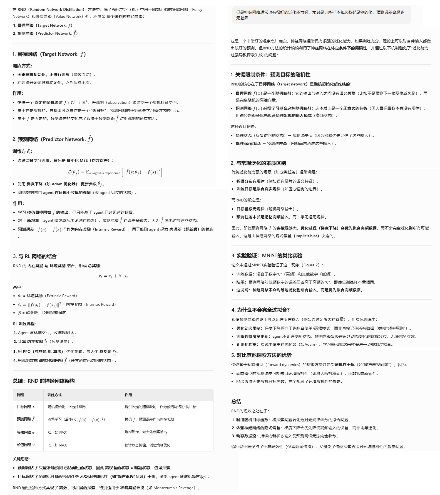
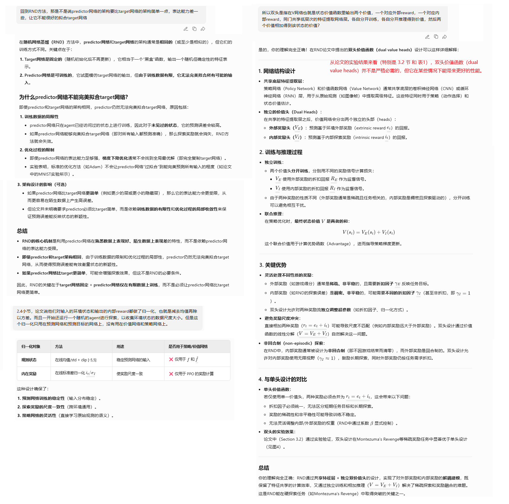
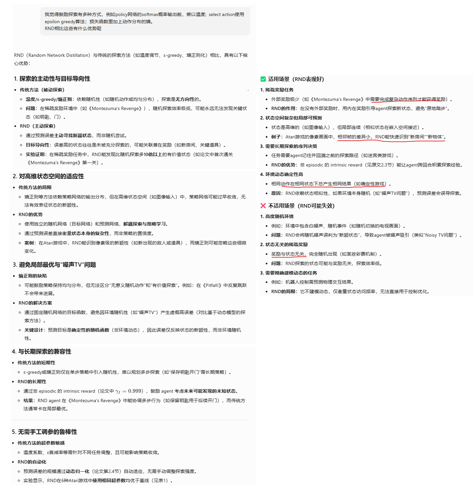
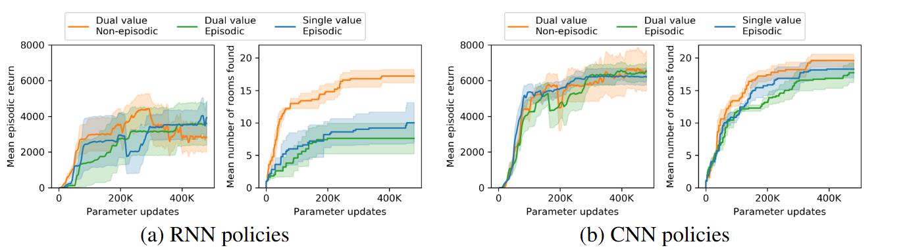
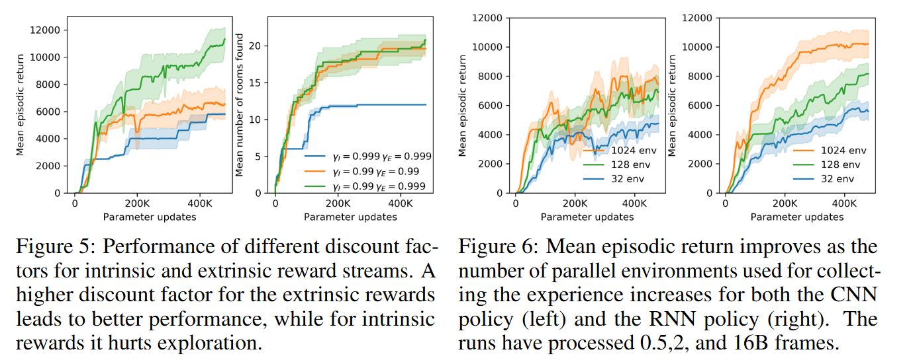
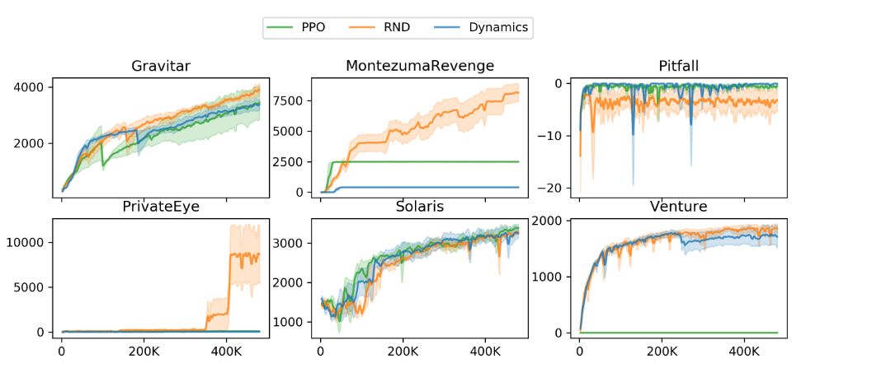

**EXPLORATION BY RANDOM NETWORK DISTILLATION**

### Introduction

环境的稀疏奖励，对于强化学习来说是个挑战，尤其是当人工设计额外的奖励也不切实际的时候。这种情况下，以直接方式探索环境的方法是必要的。

该论文创造了一种方法：

1. 容易实现
2. 对高维观测友好
3. 对各种策略优化算法适用
4. 计算高效

### Method

### Experiments

不同的奖励组合方式下的表现：

1. 黄色（把内部奖励作为非回合的，并且使用双头价值输出）性能更好
2. 如果内外部奖励都作为回合性的奖励对待，单头的价值输出比双头的要稍微好一些

折扣率和环境并发收集数据对性能的影响：

1. 绿色高于蓝色：对内部奖励折扣越多，性能越好
2. 绿色高于橘色：对外部奖励折扣越少，性能越好

bison：我总觉得这个就简单的对比一下，没有说服力

与其他算法的对比，分别是橘色（PPO+RND探索补偿）、绿色（没有探索补偿的PPO）、蓝色（PPO+dynamics探索补偿）。6个有挑战的游戏中，4个RND都胜出。

### Discussion