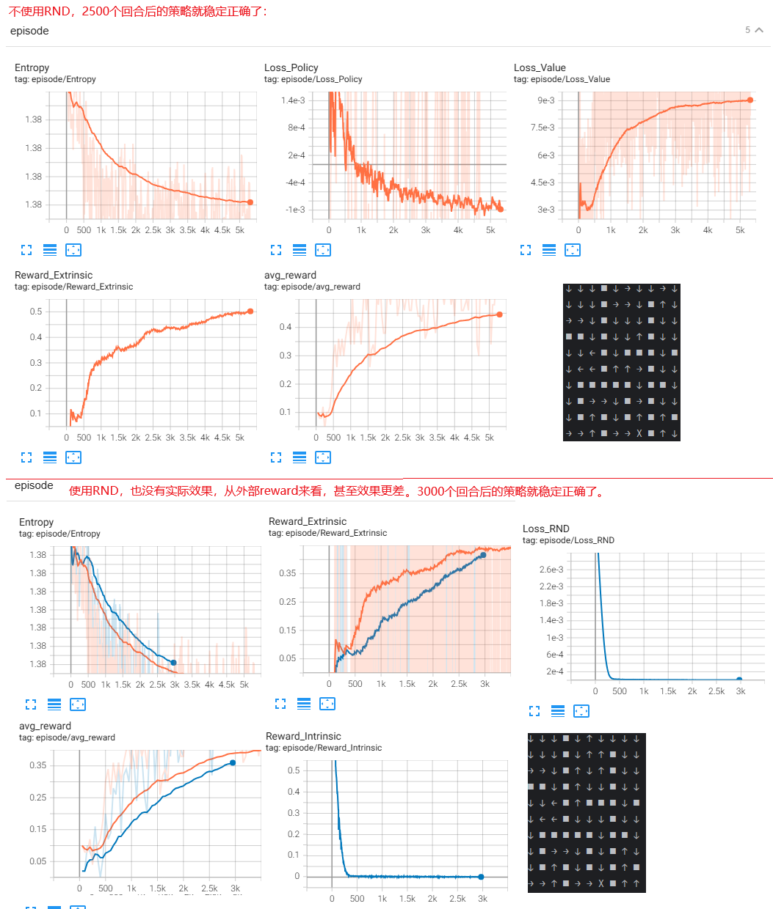

**EXPLORATION BY RANDOM NETWORK DISTILLATION**

### Introduction

环境的稀疏奖励，对于强化学习来说是个挑战，尤其是当人工设计额外的奖励也不切实际的时候。这种情况下，以直接方式探索环境的方法是必要的。

该论文创造了一种鼓励探索的方法：

1. 容易实现
2. 对高维观测友好
3. 对各种策略优化算法适用
4. 计算高效（论文说只需要前向传播，我认为不正确，它还是会后向传播更新预测网络的权重）

亲自玩一下这个游戏就有切身体会：特别有必要对不一样的局面进行额外奖励才行，否则Agent会被困在原地：

1. 奖励稀疏、长时间没有奖励的问题：Agent必须想办法进入到另外的区域（不是简单游走就能实现，得尝试各种技巧）拿到钥匙，然后干点啥（我还没有做到），而在原地转圈、跳动、比较简单的跳走到旁边的平台，都不能实现最终目的、不能获得奖励。。
2. 部分可观测的问题：很多房间在地图上看不到，需要探索（星际争霸里地图一开始是黑的，观测野很小）
3. 奖励延迟巨大的问题：就算离开一个房间进入新房间是由奖励的，但在第几千步时刻拿到的钥匙，可能在第百万步的时候用来开门。很多游戏都有这个问题，例如简单的breakout，击中砖块可能是好多步之前托盘成功托举小球的结果


到目前为止，我见过的鼓励探索的方法有：

1. epsilon greedy方法

2. 对于输出概率的模型，在softmax之前，对logits乘以一个温度

3. 在损失函数里，加上 输出的动作分布的熵的正则项

4. 对输出的动作的概率分布，做随机抽样，而不是argmax

5. 对输出加上一个噪声，或者对神经网络的参数加噪声

6. 表格法或者MCTS中，访问计数字段用作分母，也是鼓励探索

7. alphaGo里用到的对抗自博弈也是一种探索

8. 专家演示经验用于训练是一种让探索更有效的工作，例如alphaGo的前期的监督学习就使用了专家棋谱

9. 网络输出一个概率分布而不是确定性的价值/动作，也是一种鼓励探索，例如C51

10. 本文RND方法提到的随机网络蒸馏的方法

    


### Method

openai提供了配套的[代码](https://github.com/openai/random-network-distillation)


论文提到：RND obviates factors 2 and 3 since the target network can be chosen to be deterministic and inside  the model-class of the predictor network

也就是说，目标网络和预测网络需要是相同类型的深度神经网络，拟合的函数属于相同的函数族。这样避免不同的函数族之间的差距引入误差，保证用作内部奖励的误差主要是因为样本之前没有见过引入的。

**Model-class:** In machine learning, a "model-class" refers to the set of all possible functions that a particular type of model can represent.  For example, all possible neural networks with a specific architecture (e.g., a 3-layer fully connected network with 100 units per layer, using ReLU activations) belong to the same model-class.  By choosing a model-class, you're defining the family of functions that your learning algorithm can potentially learn.


算法伪代码：


### Experiments

不同的奖励组合方式下的表现：

1. 黄色（把内部奖励作为非回合的，并且使用双头价值输出）性能更好
2. 如果内外部奖励都作为回合性的奖励对待，单头的价值输出比双头的要稍微好一些


折扣率和环境并发收集数据对性能的影响：

1. 绿色高于蓝色：对内部奖励折扣越多，性能越好
2. 绿色高于橘色：对外部奖励折扣越少，性能越好

bison：我总觉得这个就简单的对比一下，没有说服力


与其他算法的对比，分别是橘色（PPO+RND探索补偿）、绿色（没有探索补偿的PPO）、蓝色（PPO+dynamics探索补偿）。6个有挑战的游戏中，4个RND都胜出。


### Discussion

RND方法适合局部探索，例如短期决策带来的后果，它不适合涉及到协同决策的全局探索。

另外，有个场景是4把钥匙6扇门，每开一扇门就会消耗一把钥匙。为了打开最后的两扇门，必须延迟满足，不要在当下就把四把钥匙都消耗了，尽管打开眼下的门可以立即获得奖励。为了鼓励agent延迟满足，必须对保存钥匙（而不是消耗钥匙）做足够多的内部奖励。这是未来重要的一个研究方向。

### bison的实验

#### 1、基于策略网络的强化学习

暂时还没有信心训练agent玩蒙特祖玛的复仇，搞个简单的：一个迷宫有6个房间，房间之间只有一个小通道，移动的时候没有奖励，找到截至位置奖励1。

对比有无RND方法的帮助，训练收敛速度和最优路径（步数最少）

##### 问题一：

下面的代码，光说不适用RND的方式下，就搞了我一整天，出发点所在的第一个“房间”里的策略总是不正确，后面的房间里的策略都正确，哪怕训练5万个回合。我想了又想，可能和回报的归一化有关：我把回报减去均值再除以标准差，这样导致一个回合下早期时间步对应的回报总是负数，后期时间步的回报总是正数，不合理。

所以我干脆不做归一化处理，因为最后终点的奖励是1，所以如果某个时间步的策略不正确，会导致回合长度变大，折扣下会使得该时间步的回报变小，相当于惩罚，反之是奖励。

这样修改后，发现1200个回合就能很好的收敛了：

```shell
policy at 1163
→ → ↓ ■ ↓ ↓ ↓ ↓ ↓ ↓ 
→ → ↓ ■ ↓ ↓ ↓ ■ ↓ ↓ 
→ → ↓ ■ ↓ ↓ ↓ ■ ↓ ↓ 
■ ■ ↓ ■ ↓ ↓ ↓ ■ ↓ ↓ 
↓ ↓ ← ■ ↓ ■ ■ ■ ↓ ■ 
↓ ← ← ■ ↓ ↓ ↓ ■ ↓ ↓ 
↓ ■ ■ ■ ■ ■ ↓ ■ ■ ↓ 
↓ ■ ↓ ↓ ↓ ■ ↓ ■ ↓ ↓ 
↓ ■ ↓ ■ ↓ ■ ↓ ■ ↓ ■ 
→ X ↓ ■ ↓ ↓ ↓ ■ ↓ ↓ 
```


代码如下：

```python
from collections import deque

import numpy
import torch
import torch.nn as nn
from torch.distributions import Categorical
from torch.utils.tensorboard import  SummaryWriter
import torch.nn.functional as F
from datetime import datetime
from tqdm import tqdm

# 10 x 10 maze, 1-start, 2-end, 3-obstacle
# 目标放在右下角藏太深，难以训练，所以放在左下角...
g_map = torch.tensor([
    [1, 0, 0, 3, 0, 0, 0, 0, 0, 0],
    [0, 0, 0, 3, 0, 0, 0, 3, 0, 0],
    [0, 0, 0, 3, 0, 0, 0, 3, 0, 0],
    [3, 3, 0, 3, 0, 0, 0, 3, 0, 0],
    [0, 0, 0, 3, 0, 3, 3, 3, 0, 3],
    [0, 0, 0, 3, 0, 0, 0, 3, 0, 0],
    [0, 3, 3, 3, 3, 3, 0, 3, 3, 0],
    [0, 3, 0, 0, 0, 3, 0, 3, 0, 0],
    [0, 3, 0, 3, 0, 3, 0, 3, 0, 3],
    [0, 2, 0, 3, 0, 0, 0, 3, 0, 0]
])

device = "cuda:0" if torch.cuda.is_available() else "cpu"
dt = datetime.now().strftime("%Y%m%d_%H%M%S")
writer = SummaryWriter(log_dir=f"logs/rnd_maze_{dt}")

class Args:
    MAP_SIZE:int = 10
    ACTION_DIM:int = 4
    ACTION_LIST:torch.Tensor = torch.tensor([[0, -1], [0, 1], [-1, 0], [1, 0]])  # 上,下,左,右
    MAP_START_VALUE:int=1
    MAP_END_VALUE: int = 2
    MAP_OBS_VALUE: int = 3
    MAP_HUMAN_VALUE:int = 4
    MAP_MAX_VALUE: int = 4
    USE_RND:bool = False
    REWARD_HIT_WALL:float = 0 #撞墙的奖励
    REWARD_HIT_OBST:float = 0 #撞障碍物的奖励
    REWARD_GOAL:float = 1 # 达到目的地的奖励
    REWARD_MOVE:float = 0 # 移动一步的奖励
    MAX_EPISODES= 5000
    MAX_STEPS_PER_EPISODE = 500
    GAMMA = 0.98
    INNER_R_SCALE = 0.1
    ENTROPY_COEF = 0.1


class PolicyNet(torch.nn.Module):
    def __init__(self):
        super().__init__()
        self.conv1 = nn.Conv2d(1, 32, kernel_size=3, padding=1)
        self.conv2 = nn.Conv2d(32, 64, kernel_size=3, padding=1)


        t = torch.ones((1, 1, Args.MAP_SIZE, Args.MAP_SIZE), device=self.conv1.weight.device)
        t = self.conv1(t)
        t = self.conv2(t) #type:torch.Tensor
        t = t.view(t.shape[0], -1)
        feature_dim = t.shape[1]

        self.actor = nn.Sequential(
            nn.Linear(feature_dim, 128),
            nn.ReLU(),
            nn.Linear(128, Args.ACTION_DIM))

    def forward(self, x):
        x = F.relu(self.conv1(x))
        x = F.relu(self.conv2(x))
        x = x.view(x.shape[0], -1)
        logits = self.actor(x)

        return logits

class RND(torch.nn.Module):
    def __init__(self):
        super().__init__()
        # 空间下采样模块
        self.downsample = nn.Sequential(
            nn.AdaptiveMaxPool2d((3, 3)),  # 10x10 → 3x3
            nn.Conv2d(1, 16, kernel_size=3, padding=1),  # 保持3x3
            nn.ReLU()
        )

        # 房间特征编码器
        self.room_encoder = nn.Sequential(
            nn.Conv2d(16, 32, kernel_size=3, padding=1),
            nn.ReLU(),
            nn.Flatten(),
            nn.Linear(32 * 3 * 3, 256),
            nn.LayerNorm(256)
        )

        # 房间特征蒸馏器
        self.distill = nn.Sequential(
            nn.Linear(256, 128),
            nn.Tanh()
        )

    def forward(self, x):
        x = self.downsample(x)  # [B,1,10,10] → [B,16,3,3]
        x = self.room_encoder(x)  # [B,256]
        return self.distill(x)  # [B,128]

class Agent:
    def __init__(self):
        self.actor = PolicyNet().to(device)
        self.optimizer = torch.optim.Adam(self.actor.parameters(), lr=1e-4)
        self.steps = 1

        self.rnd_predictor = RND().to(device)
        self.rnd_target = RND().to(device)
        self.rnd_target.eval()
        self.rnd_optimizer = torch.optim.Adam(self.rnd_predictor.parameters(), lr=1e-4)

    def step(self, action_delta:torch.Tensor, state:torch.Tensor):
        assert len(state.shape) == 4 and state.shape[0] == 1
        self.steps += 1
        dx, dy = action_delta[0].item(), action_delta[1].item()
        next_state = state.clone()
        mask = (state == Args.MAP_HUMAN_VALUE).float()
        flat_idx = torch.argmax(mask).item()
        y, x = flat_idx // Args.MAP_SIZE, flat_idx % Args.MAP_SIZE  # 计算2D坐标
        #撞墙
        if x+dx < 0 or y+dy <0 or  x+dx >= Args.MAP_SIZE or  y+dy >= Args.MAP_SIZE:
            if self.steps % 1000 == 0: writer.add_scalar("steps/move", 0, self.steps)
            return next_state, Args.REWARD_HIT_WALL, False, x, y
        #撞障碍物
        if g_map[y+dy, x+dx].item() == Args.MAP_OBS_VALUE:
            if self.steps % 1000 == 0: writer.add_scalar("steps/move", 0, self.steps)
            return next_state, Args.REWARD_HIT_OBST, False, x, y

        next_state[0, 0, y, x] = 0
        y += dy
        x += dx
        if self.steps % 1000 == 0:  writer.add_scalar("steps/move", 1, self.steps)
        if next_state[0, 0, y, x].item() == Args.MAP_END_VALUE:
            return next_state, Args.REWARD_GOAL, True, x, y
        next_state[0, 0, y, x] = Args.MAP_HUMAN_VALUE
        return next_state, Args.REWARD_MOVE, False, x, y

    def compute_returns(self, rewards):
        returns = []
        R = 0
        for r in reversed(rewards):
            R = r + Args.GAMMA * R
            returns.insert(0, R)
        returns = torch.tensor(returns, device=device)
        # 让权重有正有负，如果正的，我们就要增大在这个状态采取这个动作的概率；如果是负的，我们就要减小在这个状态采取这个动作的概率
        # 但似乎也有问题，当前迷宫任务下，会导致一个回合里，早期的时间步的回报总是负数，后期的时间步的回报总是整数。实验证明，去掉下面这行是更好的，否则
        # 出发点所在的第一个房间里的策略总是不正确。
        #regular_returns = (returns - returns.mean()) / (returns.std() + 1e-9)
        return returns, returns

    def check_grad(self, writer, net:nn.Module, tag):
        # 检查梯度是否存在
        for name, param in net.named_parameters():
            if param.grad is None:
                writer.add_scalar(f"{tag}/{name}", 0, self.steps)
            else:
                writer.add_scalar(f"{tag}/{name}", param.grad.abs().mean().item(), self.steps)

    def update_policy(self, returns, states, actions):
        states = torch.stack(states)  # [T, 1, 10, 10]
        actions = torch.stack(actions)  # [T]
        returns = returns.detach()  # 确保不计算梯度

        logits = self.actor(states)  # [T, 4]
        m = Categorical(logits=logits)
        log_probs = m.log_prob(actions)  # [T]

        # 添加熵正则化
        entropy = m.entropy().mean()
        loss = -(log_probs * returns).mean() - Args.ENTROPY_COEF * entropy

        self.optimizer.zero_grad()
        loss.backward()
        # 可添加梯度裁剪
        torch.nn.utils.clip_grad_norm_(self.actor.parameters(), 0.5)
        if self.steps % 1000== 0:
            self.check_grad(writer, self.actor, "actor_grad")
        self.optimizer.step()

        ######### update predictor ##############
        predictor_loss = torch.tensor(0.0)
        if Args.USE_RND:
            predictor_loss = self.calc_inner_reward(states).mean()
            self.rnd_optimizer.zero_grad()
            predictor_loss.backward()
            if self.steps % 1000 == 0:
                self.check_grad(writer, self.rnd_predictor, "predict_grad")
            self.rnd_optimizer.step()

        return loss.item(), predictor_loss.item()

    def calc_inner_reward(self, state:torch.Tensor):
        assert len(state.shape) == 4
        input = (state==Args.MAP_HUMAN_VALUE).float()

        y = self.rnd_target(input).detach()
        yy = self.rnd_predictor(input)
        distance =  F.mse_loss(yy, y, reduce=False)
        mean = distance.mean(dim=1, keepdim=True)
        std = distance.std(dim=1, keepdim=True) + 1e-6
        distance = (distance - mean).abs() / std
        distance = F.tanh(distance) # 归一化
        distance = distance.mean(dim=1)
        return distance

    def print_trajectory(self, positions:list):
        print("")
        pos_dict = {}
        for id, p in enumerate(positions):
            pos_dict[p] = id+1
        for row in range(Args.MAP_SIZE):
            for col in range(Args.MAP_SIZE):
                id = -1
                if (row, col) in pos_dict:
                    id = pos_dict[(row, col)]

                if g_map[row, col] == 3:
                    print("■ ", end="")
                    continue
                if g_map[row, col] == 2:
                    print("X ", end="")
                    continue
                if id > -1:
                    print("h ", end="")
                    continue
                else:
                    print("  ", end="")
            print("")


    def train(self):
        entropy_list = deque(maxlen=100)
        for episode in tqdm(range(Args.MAX_EPISODES), "train"):
            state = g_map.clone().float().to(device)
            state[0, 0] = Args.MAP_HUMAN_VALUE # human flag
            state = state.unsqueeze(0).unsqueeze(0)

            states = []
            rewards = []
            actions = []
            positions = []
            inner_rewards = []
            total_reward = 0
            goal = False
            for step in range(Args.MAX_STEPS_PER_EPISODE):
                with torch.no_grad():
                    logits = self.actor(state)
                m = Categorical(logits=logits)
                action_idx = m.sample()
                entropy = m.entropy()
                entropy_list.append(entropy.cpu())

                action_delta = Args.ACTION_LIST[action_idx[0]]  # 直接索引

                next_state, r, done, newx, newy = self.step(action_delta, state)
                if Args.USE_RND:
                    inner_reward = self.calc_inner_reward(next_state)
                    if self.steps % 1000 == 0:
                        writer.add_scalar("steps/inner_reward", inner_reward.item(), self.steps)
                    r += Args.INNER_R_SCALE *  inner_reward.item()
                states.append(state[0])
                rewards.append(r)
                actions.append(action_idx[0])
                positions.append((newy, newx))
                total_reward += r

                if done:
                    goal = True
                    break

                state = next_state

            if (episode+1) % 97 == 0:
                self.print_trajectory(positions)
                self.print_policy(f"policy at {episode}")
            #没有获得有效回报
            if total_reward == 0:
                writer.add_scalar("episode/action_entropy", numpy.array(entropy_list).mean(), episode)
                writer.add_scalar("episode/goal", int(goal), episode)
                writer.add_scalar("episode/len", len(states), episode)
                continue
            # 计算回报
            returns,raw_returns = self.compute_returns(rewards)
            loss1, loss2 = self.update_policy(returns, states, actions)

            writer.add_scalar("episode/return", raw_returns[0].item(), episode)
            writer.add_scalar("episode/loss1", loss1, episode)
            writer.add_scalar("episode/loss2", loss2, episode)
            writer.add_scalar("episode/action_entropy", numpy.array(entropy_list).mean(), episode)
            writer.add_scalar("episode/goal", int(goal), episode)
            writer.add_scalar("episode/len", len(states), episode)

        self.print_policy("policy at end")
    def print_policy(self, msg=""):
        print(f"{msg}")
        for row in range(Args.MAP_SIZE):
            for col in range(Args.MAP_SIZE):
                input = g_map.clone().unsqueeze(0).unsqueeze(0).float().to(device)
                input[0,0, row, col] = Args.MAP_HUMAN_VALUE
                with torch.no_grad():
                    logits = self.actor(input) #type:torch.Tensor
                action = F.softmax(logits, dim=1).argmax(dim=1)
                action = action[0].item()
                if g_map[row, col] == 3:
                    print("■ ", end="")
                    continue
                if g_map[row, col] == 2:
                    print("X ", end="")
                    continue
                if action == 2:
                    print("← ", end="")
                    continue
                if action == 3:
                    print("→ ", end="")
                    continue
                if action == 0:
                    print("↑ ", end="")
                    continue
                if action == 1:
                    print("↓ ", end="")
                    continue
            print("")

def main(mode="train"):
    if mode == "train":
        agent = Agent()
        agent.train()

main()
writer.close()

```

##### 问题二：

终点位置太过“隐蔽”不能探索到，导致每个回合的奖励和回报都是全0，不能形成有效梯度，也就无法更新模型。

也正是RND要解决的问题。但截止到目前，我还没有搞定。

**我总觉得RND不能解决这个问题，例如蒙特祖玛复仇游戏里，人类玩家不断探索，多次进入一个新房间进行尝试，就会导致RND对“处于新房间”这个状态不再“新鲜”，内部奖励变小，在取得真正的游戏进展（例如在新房间找到了宝剑）之前，不再鼓励agent对该房间做探索。**

##### 问题三：

我上面的代码，没有把RND带来的内部奖励实现为跨回合的非回合制方式，这可能是**RND没有效果**的原因。通过和AI简单的讨论，可能需要添加价值网络才能实现跨回合的内部奖励。

#### 2、Actor-Critic方式

由于上面的问题二、问题三，所以我还是只能回到Actor-Critic的方式。但其实RND也没有起到什么积极作用。



代码如下：

```python
import torch
import torch.nn as nn
import torch.optim as optim
from torch.utils.tensorboard import SummaryWriter
from torch.distributions import Categorical
import numpy as np
import os
import time
from collections import deque
from tqdm import tqdm
from datetime import datetime

# ========================== 环境配置 ==========================
MAP = [
    [1, 0, 0, 3, 0, 0, 0, 0, 0, 0],
    [0, 0, 0, 3, 0, 0, 0, 3, 0, 0],
    [0, 0, 0, 3, 0, 0, 0, 3, 0, 0],
    [3, 3, 0, 3, 0, 0, 0, 3, 0, 0],
    [0, 0, 0, 3, 0, 3, 3, 3, 0, 3],
    [0, 0, 0, 3, 0, 0, 0, 3, 0, 0],
    [0, 3, 3, 3, 3, 3, 0, 3, 3, 0],
    [0, 3, 0, 0, 0, 3, 0, 3, 0, 0],
    [0, 3, 0, 3, 0, 3, 0, 3, 0, 3],
    [0, 0, 0, 3, 0, 0, 2, 3, 0, 0]
]

# ========================== 超参数配置 ==========================
config = {
    'use_rnd': True,  # 是否启用RND探索
    'seed': 42,
    'device': 'cuda' if torch.cuda.is_available() else 'cpu',

    # 环境参数
    'max_steps': 200,  # 单次episode最大步数
    'action_dim': 4,  # 动作空间维度

    # 网络参数
    'state_channels': 3,  # 输入通道数（障碍物、代理、目标）
    'cnn_features': 64,  # CNN特征维度
    'rnd_embed_dim': 128,  # RND嵌入维度
    'hidden_dim': 256,  # 全连接层维度

    # 训练参数
    'total_episodes': 10000,  # 总训练episode数
    'gamma_ext': 0.99,  # 外在奖励折扣
    'gamma_int': 0.99,  # 内在奖励折扣（非回合制）
    'clip_eps': 0.2,  # PPO截断参数
    'entropy_coef': 0.01,  # 熵正则化系数
    'lr_actor': 3e-4,  # Actor学习率
    'lr_critic': 1e-3,  # Critic学习率
    'lr_rnd': 1e-4,  # RND学习率
    'batch_size': 1024,  # 训练批次大小
    'update_epochs': 4,  # PPO更新轮数

    # 系统参数
    'log_interval': 50,  # 日志记录间隔
    'save_interval': 500,  # 模型保存间隔
    'log_dir': 'logs',
    'save_dir': 'checkpoints'
}


# ========================== 迷宫环境类 ==========================
class MazeEnv:
    def __init__(self):
        self.raw_map = torch.tensor(MAP, dtype=torch.float32)
        self.start_pos = (0, 0)
        self.end_pos = (9, 6)
        self.actions = [(-1, 0), (1, 0), (0, -1), (0, 1)]  # 上下左右
        self.reset()

    def reset(self):
        """重置环境，返回三通道图像状态"""
        self.agent_pos = self.start_pos
        return self._get_state()

    def step(self, action):
        """执行动作，返回(next_state, reward, done)"""
        x, y = self.agent_pos
        dx, dy = self.actions[action]
        new_x = max(0, min(9, x + dx))
        new_y = max(0, min(9, y + dy))

        # 碰撞检测
        if self.raw_map[new_x, new_y] == 3:
            new_x, new_y = x, y  # 保持原位

        self.agent_pos = (new_x, new_y)
        done = (self.agent_pos == self.end_pos)
        return self._get_state(), 1.0 if done else 0.0, done

    def _get_state(self):
        """构建三通道状态张量：(障碍物, 代理位置, 目标位置)"""
        state = torch.zeros((3, 10, 10))
        state[0] = (self.raw_map == 3).float()  # 障碍物通道
        state[1, self.agent_pos[0], self.agent_pos[1]] = 1.0  # 代理位置
        state[2, self.end_pos[0], self.end_pos[1]] = 1.0  # 目标位置
        return state


    def get_state(self, agent_pos):
        assert len(agent_pos) == 2
        """根据指定的agent_pos构建三通道状态张量：(障碍物, 代理位置, 目标位置)"""
        state = torch.zeros((3, 10, 10))
        state[0] = (self.raw_map == 3).float()  # 障碍物通道
        state[1, agent_pos[0], agent_pos[1]] = 1.0  # 代理位置
        state[2, self.end_pos[0], self.end_pos[1]] = 1.0  # 目标位置
        return state

    def render(self):
        """可视化当前状态"""
        grid = self.raw_map.clone().numpy().astype(int)
        x, y = self.agent_pos
        grid[x, y] = 8  # 代理位置标记
        print('\n'.join([' '.join(map(str, row)) for row in grid]))


# ========================== 网络定义 ==========================
class CNNEncoder(nn.Module):
    """共享的CNN特征提取器"""

    def __init__(self, in_channels, out_dim):
        super().__init__()
        self.net = nn.Sequential(
            nn.Conv2d(in_channels, 32, 3, stride=2, padding=1),
            nn.ReLU(),
            nn.Conv2d(32, 64, 3, stride=2, padding=1),
            nn.ReLU(),
            nn.Flatten(),
            nn.Linear(64 * 3 * 3, out_dim)  # 10x10 -> 5x5 -> 3x3
        )

        self.out_dim = out_dim

    def forward(self, x):
        return self.net(x)


class ActorCritic(nn.Module):
    """双头价值网络"""

    def __init__(self, encoder:CNNEncoder, action_dim, hidden_dim):
        super().__init__()
        self.encoder = encoder

        # 策略网络
        self.actor = nn.Sequential(
            nn.Linear(encoder.out_dim, hidden_dim),
            nn.ReLU(),
            nn.Linear(hidden_dim, action_dim),
            nn.Softmax(dim=-1)
        )

        # 双价值头
        self.critic_ext = nn.Sequential(
            nn.Linear(encoder.out_dim, hidden_dim),
            nn.ReLU(),
            nn.Linear(hidden_dim, 1)
        )
        self.critic_int = nn.Sequential(
            nn.Linear(encoder.out_dim, hidden_dim),
            nn.ReLU(),
            nn.Linear(hidden_dim, 1)
        )

    def forward(self, x):
        features = self.encoder(x)
        return self.actor(features), self.critic_ext(features), self.critic_int(features)


class RNDNetwork(nn.Module):
    """RND网络（目标网络+预测网络）"""

    def __init__(self, encoder:CNNEncoder, embed_dim):
        super().__init__()
        self.target = CNNEncoder(3, embed_dim)
        self.predictor = nn.Sequential(
            encoder,
            nn.Linear(encoder.out_dim, embed_dim)
        )

        # 冻结目标网络参数
        for param in self.target.parameters():
            param.requires_grad = False

    def forward(self, x):
        return self.predictor(x), self.target(x)


# ========================== 代理类 ==========================
class PPORNDAgent:
    def __init__(self, config):
        self.cfg = config
        self.env = MazeEnv()
        self._init_components()
        self._reset_training_state()

        os.makedirs(config['save_dir'], exist_ok=True)
        dt = datetime.now().strftime("%Y%m%d_%H%M%S")
        self.writer = SummaryWriter(f"{config['log_dir']}/maze_v2_{dt}")

    def _init_components(self):
        """初始化网络组件"""
        # 共享编码器
        self.encoder = CNNEncoder(self.cfg['state_channels'], self.cfg['hidden_dim']).to(self.cfg['device'])

        # Actor-Critic网络
        self.actor_critic = ActorCritic(
            self.encoder,
            self.cfg['action_dim'],
            self.cfg['hidden_dim']
        ).to(self.cfg['device'])

        # RND组件
        if self.cfg['use_rnd']:
            self.rnd = RNDNetwork(
                CNNEncoder(self.cfg['state_channels'], self.cfg['rnd_embed_dim']),
                self.cfg['rnd_embed_dim']
            ).to(self.cfg['device'])
            self.optim_rnd = optim.Adam(self.rnd.predictor.parameters(), lr=self.cfg['lr_rnd'])

        # 共享编码器参数应同时被Actor和Critic优化
        shared_params = list(self.encoder.parameters())

        # Actor优化器
        self.optim_actor = optim.Adam(
            shared_params + list(self.actor_critic.actor.parameters()),
            lr=self.cfg['lr_actor']
        )

        # Critic优化器
        self.optim_critic = optim.Adam(
            shared_params + list(self.actor_critic.critic_ext.parameters())+ list(self.actor_critic.critic_int.parameters()),
            lr=self.cfg['lr_critic']
        )

    def _reset_training_state(self):
        """重置训练状态"""
        self.buffer = []
        self.episode_rewards = []
        self.step_count = 0
        self.last_intrinsic_value = 0.0  # 跨episode保留

    def select_action(self, state, greedy=False):
        """选择动作并返回相关信息"""
        state_tensor = state.unsqueeze(0).to(self.cfg['device'])
        with torch.no_grad():
            probs, value_ext, value_int = self.actor_critic(state_tensor)# type: (torch.Tensor, torch.Tensor, torch.Tensor)

        dist = Categorical(probs)
        if greedy:
            action = probs.argmax(dim=1)
        else:
            action = dist.sample()
        return {
            'action': action.item(),
            'log_prob': dist.log_prob(action),
            'value_ext': value_ext.squeeze(),
            'value_int': value_int.squeeze()
        }

    def collect_experience(self, ep):
        """收集经验数据（非回合制）"""
        state = self.env.reset()
        episode_reward = 0
        intrinsic_return = 0.0

        for _ in range(self.cfg['max_steps']):
            # 选择动作
            action_info = self.select_action(state)

            # 执行动作
            next_state, reward_ext, done = self.env.step(action_info['action'])

            # 计算内在奖励
            reward_int = 0.0
            if self.cfg['use_rnd']:
                with torch.no_grad():
                    state_tensor = state.unsqueeze(0).to(self.cfg['device'])
                    pred, target = self.rnd(state_tensor)
                    reward_int = torch.mean((pred - target) ** 2).item()

            # 保存经验
            self.buffer.append((
                state,
                action_info['action'],
                reward_ext,
                reward_int,
                action_info['log_prob'],
                action_info['value_ext'],
                action_info['value_int'],
                done
            ))

            # 更新统计
            episode_reward += reward_ext
            intrinsic_return += reward_int
            self.step_count += 1
            state = next_state

            if done:
                break

        # 记录episode信息
        self.episode_rewards.append(episode_reward)
        self.writer.add_scalar('episode/Reward_Extrinsic', episode_reward, ep)
        if self.cfg['use_rnd']:
            self.writer.add_scalar('episode/Reward_Intrinsic', intrinsic_return, ep)

    def compute_advantages(self):
        """计算GAE（非回合制）"""
        states = torch.stack([t[0] for t in self.buffer]).to(self.cfg['device'])
        dones = torch.tensor([t[7] for t in self.buffer]).float().to(self.cfg['device'])

        # 获取价值估计
        with torch.no_grad():
            _, values_ext, values_int = self.actor_critic(states)

        # 计算外在优势
        advantages_ext, returns_ext = self._compute_gae(
            torch.tensor([t[2] for t in self.buffer]).to(self.cfg['device']),
            values_ext.squeeze(),
            dones,
            self.cfg['gamma_ext']
        )

        # 计算内在优势（非回合制）
        advantages_int, returns_int = self._compute_gae(
            torch.tensor([t[3] for t in self.buffer]).to(self.cfg['device']),
            values_int.squeeze(),
            torch.zeros_like(dones),  # 忽略done信号
            self.cfg['gamma_int']
        )

        return advantages_ext + advantages_int, returns_ext + returns_int

    def _compute_gae(self, rewards, values, dones, gamma):
        """通用GAE计算"""
        advantages = torch.zeros_like(rewards)
        last_advantage = 0

        # 逆序计算
        for t in reversed(range(len(rewards))):
            if t == len(rewards) - 1:
                next_value = self.last_intrinsic_value if gamma == self.cfg['gamma_int'] else 0
            else:
                next_value = values[t + 1]

            delta = rewards[t] + gamma * (1 - dones[t]) * next_value - values[t]
            advantages[t] = delta + gamma * 0.95 * (1 - dones[t]) * last_advantage
            last_advantage = advantages[t]

        returns = advantages + values
        return advantages, returns

    def update_networks(self,ep):
        """更新网络参数"""
        # 准备数据
        states = torch.stack([t[0] for t in self.buffer]).to(self.cfg['device'])
        actions = torch.tensor([t[1] for t in self.buffer]).to(self.cfg['device'])
        old_log_probs = torch.stack([t[4] for t in self.buffer]).to(self.cfg['device'])
        advantages, returns = self.compute_advantages()

        # 更新RND
        if self.cfg['use_rnd']:
            pred, target = self.rnd(states)
            rnd_loss = nn.functional.mse_loss(pred, target.detach())
            self.optim_rnd.zero_grad()
            rnd_loss.backward()
            self.optim_rnd.step()
            self.writer.add_scalar('episode/Loss_RND', rnd_loss.item(), ep)

        # PPO更新
        for idx in range(self.cfg['update_epochs']):
            # 随机采样
            indices = torch.randperm(len(self.buffer))[:self.cfg['batch_size']]

            batch_states = states[indices]
            batch_actions = actions[indices]
            batch_old_log_probs = old_log_probs[indices]
            batch_advantages = advantages[indices]
            batch_returns = returns[indices]

            # 计算新策略
            probs, values_ext, values_int = self.actor_critic(batch_states)
            dist = Categorical(probs)
            new_log_probs = dist.log_prob(batch_actions)
            entropy = dist.entropy().mean()

            # 策略损失
            ratio = (new_log_probs - batch_old_log_probs).exp()
            surr1 = ratio * batch_advantages
            surr2 = torch.clamp(ratio, 1 - self.cfg['clip_eps'], 1 + self.cfg['clip_eps']) * batch_advantages
            policy_loss = -torch.min(surr1, surr2).mean()

            # 价值损失
            value_loss = nn.functional.mse_loss(values_ext.squeeze() + values_int.squeeze(), batch_returns)

            # 总损失
            total_loss = policy_loss + 0.5 * value_loss - self.cfg['entropy_coef'] * entropy

            # 反向传播
            self.optim_actor.zero_grad()
            self.optim_critic.zero_grad()
            total_loss.backward()
            torch.nn.utils.clip_grad_norm_(self.actor_critic.parameters(), 0.5)
            self.optim_actor.step()
            self.optim_critic.step()

            # 记录日志
            if idx == 0:
                self.writer.add_scalar('episode/Loss_Policy', policy_loss.item(), ep)
                self.writer.add_scalar('episode/Loss_Value', value_loss.item(), ep)
                self.writer.add_scalar('episode/Entropy', entropy.item(), ep)

        # 清空缓冲区
        self.buffer = []

    def train(self):
        """主训练循环"""
        start_time = time.time()

        for ep in tqdm(range(1, self.cfg['total_episodes'] + 1), "train"):
            self.collect_experience(ep)

            if len(self.buffer) >= self.cfg['batch_size']:
                self.update_networks(ep)

            # 记录日志
            if ep % self.cfg['log_interval'] == 0:
                avg_reward = np.mean(self.episode_rewards[-self.cfg['log_interval']:])
                self.writer.add_scalar('episode/avg_reward', avg_reward, ep)

            # 保存检查点
            if ep % self.cfg['save_interval'] == 0:
                self.save_checkpoint(ep)
                self.print_policy()

        print(f"Training completed in {time.time() - start_time:.1f}s")
        self.writer.close()

    def save_checkpoint(self, episode):
        """保存模型状态"""
        state = {
            'episode': episode,
            'actor_critic': self.actor_critic.state_dict(),
            'optim_actor': self.optim_actor.state_dict(),
            'optim_critic': self.optim_critic.state_dict(),
        }
        if self.cfg['use_rnd']:
            state.update({
                'rnd': self.rnd.state_dict(),
                'optim_rnd': self.optim_rnd.state_dict()
            })
        path = os.path.join(self.cfg['save_dir'], f"checkpoint_ep{episode}.pth")
        torch.save(state, path)
        print(f"Saved checkpoint to {path}")

    def load_checkpoint(self, path):
        """加载模型状态"""
        state = torch.load(path, map_location=self.cfg['device'])
        self.actor_critic.load_state_dict(state['actor_critic'])
        self.optim_actor.load_state_dict(state['optim_actor'])
        self.optim_critic.load_state_dict(state['optim_critic'])
        if self.cfg['use_rnd'] and 'rnd' in state:
            self.rnd.load_state_dict(state['rnd'])
            self.optim_rnd.load_state_dict(state['optim_rnd'])
        print(f"Loaded checkpoint from {path}")

    def print_policy(self):

        for x in range(10):
            for y in range(10):
                if self.env.raw_map[x, y] == 3:
                    print("■ ", end="")
                    continue
                if self.env.raw_map[x, y] == 2:
                    print("X ", end="")
                    continue
                state = self.env.get_state((x, y))
                action_info = self.select_action(state, True)
                action = action_info['action']
                if action == 2:
                    print("← ", end="")
                    continue
                if action == 3:
                    print("→ ", end="")
                    continue
                if action == 0:
                    print("↑ ", end="")
                    continue
                if action == 1:
                    print("↓ ", end="")
                    continue
            print("")


# ========================== 主程序 ==========================
if __name__ == "__main__":
    torch.manual_seed(config['seed'])
    np.random.seed(config['seed'])

    agent = PPORNDAgent(config)

    # 可选：加载现有模型
    # agent.load_checkpoint('checkpoints_v2/checkpoint_ep500.pth')

    # 开始训练
    agent.train()

```

