**ROBUST POLICY OPTIMIZATION IN DEEP REINFORCEMENT LEARNING**

### Introduction

针对连续动作空间的梯度策略算法，面临两个问题：

1. 表达问题：策略网络通常输出高斯分布的均值和方差来表征动作的分布（高维动作空间，每个维度一个高斯分布）。但这不是普适的，有的task都要考虑用高斯分布以外的方式更合适
2. 探索问题：训练过程中策略网络会逐步减少动作选择的方差，也就是让动作更加的确定，这样会阻碍探索，使得陷入次优解

我们的方法尝试对动作分布的均值加上一个随机扰动来解决上面的问题。结果：

1. 输出的动作分布为正态分布的时候，在很多控制任务和benchmark上，我们的方法相比改动前有更好的表现，尤其在高维环境中（动作空间/状态空间高维）
2. 比两个基于数据增强的RL方法（RAD、DRAC）效果也要好
3. 对于其他参数化分布，例如s Laplace and Gumbe分布，在很多任务下，我们的方法效果更好
4. 相比在损失函数里加上entropy正则的方法，我们的方法表现更好。entropy正则的方法，有些系数下可能导致更差的表现。

bison：标准正态分布的entropy是一个常数，大约2.05 bit。

效果如下：

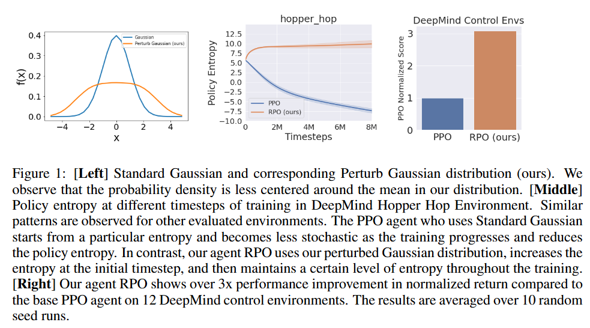

### Preliminaries

介绍了MDP、RL、PPO等预备知识


我特意补充一下我没有了解过的RL相关的数据增强的方法。

RAD（**Reinforcement Learning with Augmented Data**）和 DrAC（**Data-regularized Actor-Critic**）是用于增强视觉输入类强化学习（如图像输入）中agent泛化能力的方法，它们通过**数据增强（data augmentation）**提高样本利用效率和泛化性能。具体思路：

1. RAD：在使用图像作为输入的RL中，直接对观测图像应用数据增强（如crop、flip、color jitter等），增强后的图像作为神经网络的输入。网络训练过程和标准RL（如SAC）相同。
2. DrAC：不仅增强图像输入，还引入一个正则项，鼓励网络在原图和增强图之间预测的一致性：正则项 = 原图和增强图在策略概率分布或价值估计上的差异，这样引导Actor和Critic在图像增强前后的概率和值比较一致。

### ROBUST POLICY OPTIMIZATION (RPO)

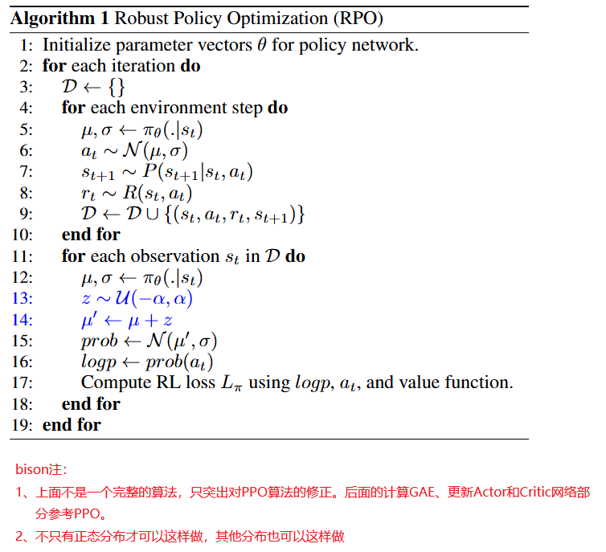

### Results

#### 与PPO的对比

看了下面的数据，不禁想问：PPO真的表现这么差吗？不怕人踢馆吗？

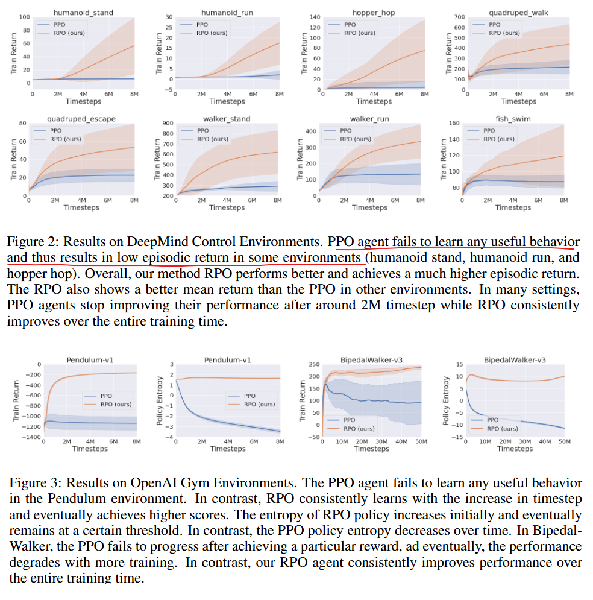


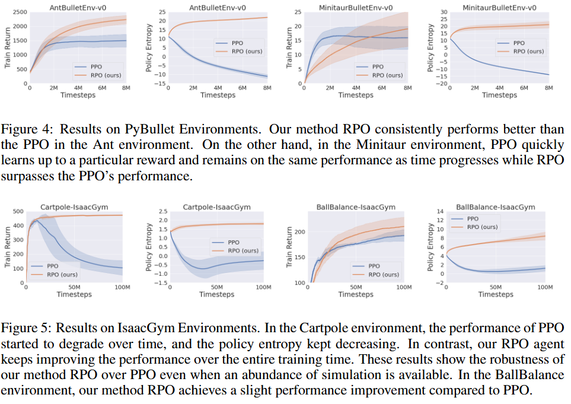

#### 与熵正则方法的对比

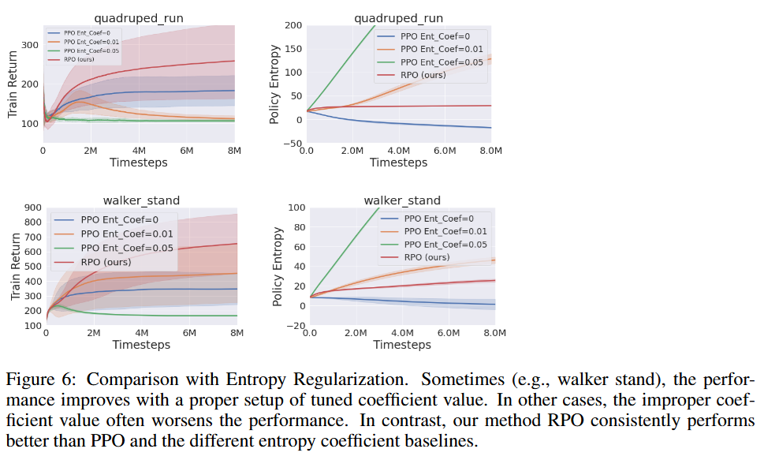

#### 其他分布下的效果

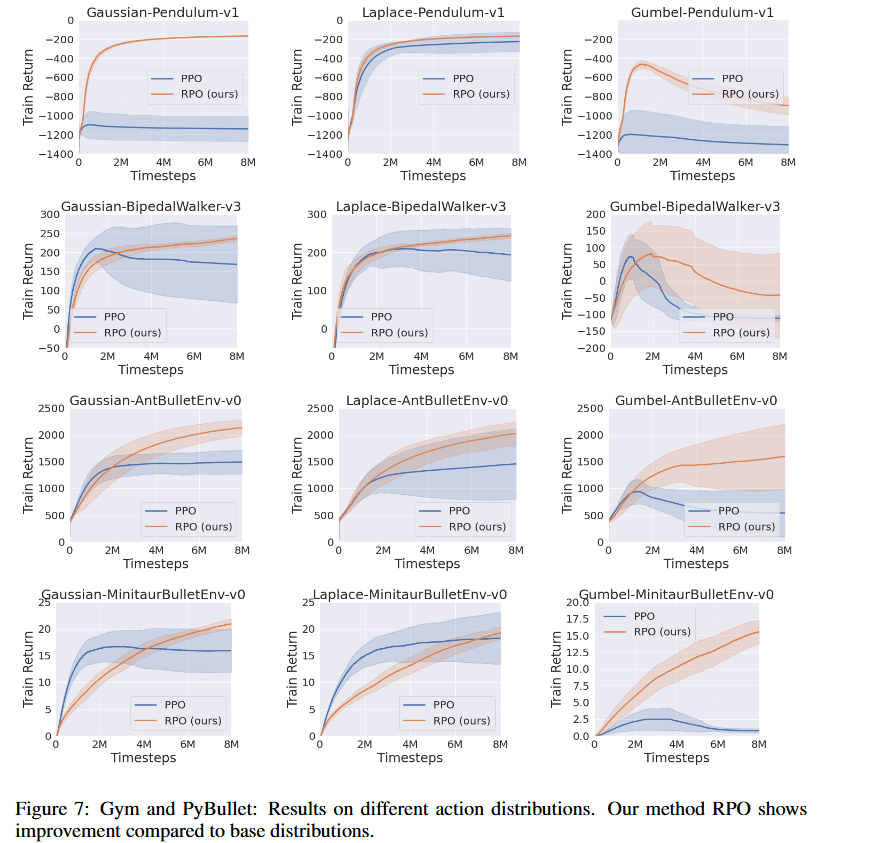

#### 与数据增强方法的对比

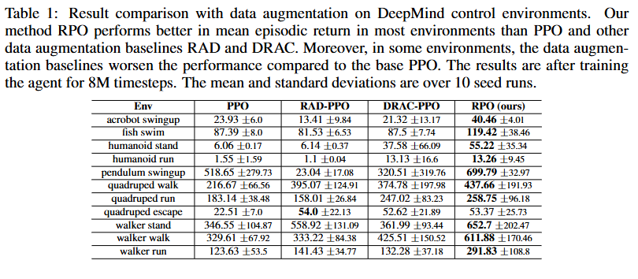


#### 随机噪音范围的对比

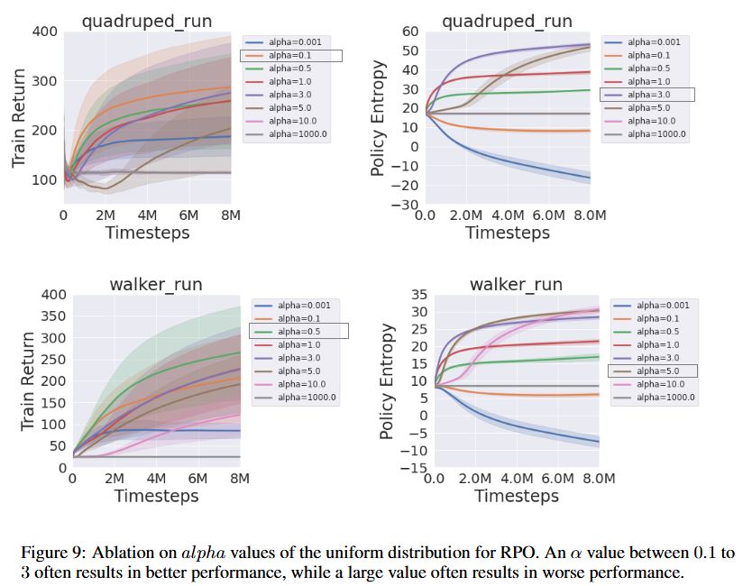

### Related Work

提到了Entropy Regularization、输出高斯分布的策略方法、数据增强、GAE、clipped objective

### Conclusion


### bison的实验

#### pendulum

下面的PPO和RPO都能够很好的收敛。由于pendulum任务比较简单，也没有体现RPO的明显优势：

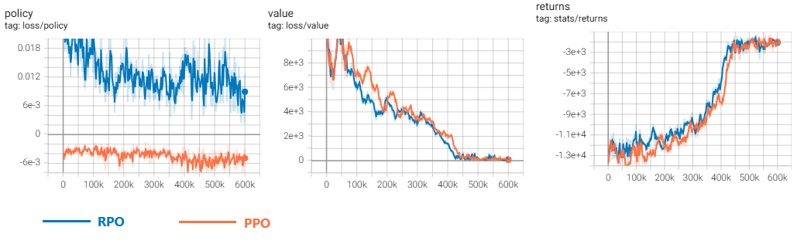

2048次交互的returns为-1500左右的时候，agent已经表现很好了，钟摆屹立不倒。所以论文里说的RPO比PPO在pendulum上表现好很多不知道是怎么做的。

代码如下：

```python
import gymnasium as gym
import numpy as np
import torch
import torch.nn as nn
import torch.optim as optim

from torch.distributions import Normal, Independent
from torch.utils.tensorboard import SummaryWriter
from datetime import datetime as dt
import pygame

# 设置随机种子
torch.manual_seed(42)
np.random.seed(42)

device = torch.device("cuda" if torch.cuda.is_available() else "cpu")
writer = SummaryWriter(log_dir=f"logs/Pendulum_PPO_{dt.now().strftime('%y%m%d_%H%M%S')}")

alpha = 0.3

def perturb_mean(mean):
    noise = torch.rand_like(mean)*2-1.0
    noise = (noise * alpha).to(device)
    return mean+noise


class PolicyNetwork(nn.Module):
    def __init__(self, state_dim, hidden_dim=128):
        super().__init__()
        self.net = nn.Sequential(
            nn.Linear(state_dim, hidden_dim),
            nn.ReLU(),
            nn.Linear(hidden_dim, hidden_dim // 2),
            nn.ReLU()
        )
        self.mean = nn.Linear(hidden_dim // 2, 1)
        self.log_std = nn.Parameter(torch.zeros(1))

    def forward(self, x):
        x = x / torch.tensor([1.0, 1.0, 8.0], device=x.device)  # normalize
        x = self.net(x)
        mean = self.mean(x)
        std = self.log_std.exp().expand_as(mean)
        return mean, std


class ValueNetwork(nn.Module):
    def __init__(self, state_dim, hidden_dim=128):
        super().__init__()
        self.net = nn.Sequential(
            nn.Linear(state_dim, hidden_dim),
            nn.ReLU(),
            nn.Linear(hidden_dim, hidden_dim // 2),
            nn.ReLU(),
            nn.Linear(hidden_dim // 2, 1)
        )

    def forward(self, x):
        return self.net(x).squeeze(-1)


def compute_gae(rewards, values, dones, gamma=0.99, lam=0.95):
    values = values + [0.0]  # bootstrap
    gae, returns = 0, []
    for t in reversed(range(len(rewards))):
        delta = rewards[t] + gamma * values[t+1] * (1 - dones[t]) - values[t]
        gae = delta + gamma * lam * (1 - dones[t]) * gae
        returns.insert(0, gae + values[t])
    return torch.tensor(returns, device=device)

def show(filename):

    env = gym.make("Pendulum-v1", render_mode='human')
    state_dim = env.observation_space.shape[0]
    policy = PolicyNetwork(state_dim).to(device)
    policy = torch.load(filename, weights_only=False)
    state, _ = env.reset()
    for i in range(2000):
        state_tensor = torch.tensor(state, dtype=torch.float32).to(device)
        with torch.no_grad():
            mean, std = policy(state_tensor.unsqueeze(0))
        action_raw = mean
        action = torch.tanh(action_raw) * 2.0
        action_np = action.squeeze(0).cpu().numpy()
        next_state, reward, terminated, truncated, _ = env.step(action_np)
        env.render()
        state = next_state


def train():
    env = gym.make("Pendulum-v1")
    state_dim = env.observation_space.shape[0]

    policy = PolicyNetwork(state_dim).to(device)
    value_fn = ValueNetwork(state_dim).to(device)
    optim_policy = optim.Adam(policy.parameters(), lr=3e-4)
    optim_value = optim.Adam(value_fn.parameters(), lr=1e-3)

    step_count = 0
    while step_count < 600_000:
        states, actions, rewards, dones, log_probs, values = [], [], [], [], [], []
        state, _ = env.reset() #每次都从一个新的回合开始收集
        while len(states) < 2048:
            state_tensor = torch.tensor(state, dtype=torch.float32).to(device)
            with torch.no_grad():
                mean, std = policy(state_tensor.unsqueeze(0))
            mean = perturb_mean(mean)

            dist = Independent(Normal(mean, std), 1)
            action_raw = dist.rsample()
            action = torch.tanh(action_raw) * 2.0
            log_prob = dist.log_prob(action_raw)

            value = value_fn(state_tensor.unsqueeze(0)).item()

            action_np = action.cpu().numpy().astype(np.float32) # action.cpu().numpy()[0]

            next_state, reward, terminated, truncated, _ = env.step(action_np[0])
            reward = torch.tensor(reward, dtype=torch.float32)
            done = terminated or truncated

            states.append(state_tensor)
            actions.append(action_raw.squeeze(0))
            rewards.append(reward)
            dones.append(done)
            log_probs.append(log_prob.squeeze(0))
            values.append(value)

            state = next_state
            step_count += 1
            if done:
                state, _ = env.reset()

        with torch.no_grad():
            next_value = value_fn(torch.tensor(state, dtype=torch.float32).to(device).unsqueeze(0)).item()
        values.append(next_value)
        returns = compute_gae(rewards, values, dones)
        values = torch.tensor(values[:-1], device=device)
        advantages = returns - values
        advantages = (advantages - advantages.mean()) / (advantages.std() + 1e-8)

        # 转换为张量
        states = torch.stack(states)
        actions = torch.stack(actions)
        log_probs_old = torch.stack(log_probs)
		#todo:忘了打乱顺序，进一步的还可以搞成多个minibatch
        for _ in range(10):  # PPO更新迭代次数
            mean, std = policy(states)
            mean = perturb_mean(mean)
            dist = Independent(Normal(mean, std), 1)
            log_probs_new = dist.log_prob(actions)
            entropy = dist.entropy().mean()

            ratio = torch.exp(log_probs_new - log_probs_old)
            surr1 = ratio * advantages
            surr2 = torch.clamp(ratio, 0.8, 1.2) * advantages
            policy_loss = -torch.min(surr1, surr2).mean() - 0.001 * entropy

            value_preds = value_fn(states)
            value_loss = nn.functional.mse_loss(value_preds, returns)

            optim_policy.zero_grad()
            policy_loss.backward()
            optim_policy.step()

            optim_value.zero_grad()
            value_loss.backward()
            optim_value.step()

        writer.add_scalar("loss/policy", policy_loss.item(), step_count)
        writer.add_scalar("loss/value", value_loss.item(), step_count)
        writer.add_scalar("stats/returns", sum(rewards), step_count)
        writer.flush()

        print(f"Step: {step_count}, Return: {sum(rewards):.2f}, Policy Loss: {policy_loss.item():.3f}")

    env.close()
    torch.save(policy, "./checkpoints/Pendulum_RPO.pth")


if __name__ == "__main__":
    train()
    show("./checkpoints/Pendulum_RPO.pth")

```

#### BipedalWalker

这个任务确实就很好的展示了RPO相对PPO的优势。虽然前半段PPO表现比RPO好，但是RPO后来居上。实际动画显示RPO训练的两足机器人行走也很稳。

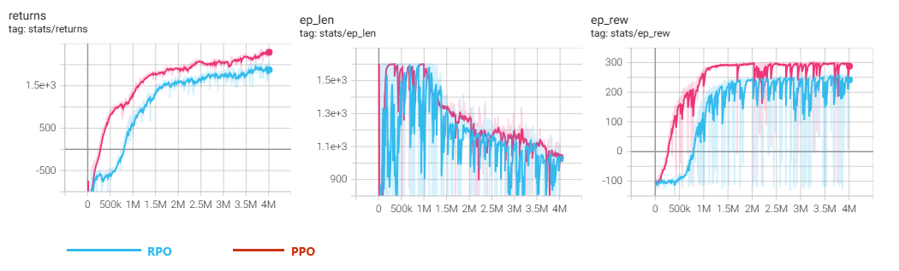

代码如下：


```python
import gymnasium as gym
import numpy as np
import torch
import torch.nn as nn
import torch.optim as optim

from torch.distributions import Normal, Independent
from torch.utils.tensorboard import SummaryWriter
from datetime import datetime as dt
import pygame

# 设置随机种子
torch.manual_seed(42)
np.random.seed(42)

device = torch.device("cuda" if torch.cuda.is_available() else "cpu")
writer = SummaryWriter(log_dir=f"logs/BipedalWalker_PPO_{dt.now().strftime('%y%m%d_%H%M%S')}")

alpha = 1.0

def perturb_mean(mean):
    noise = torch.rand_like(mean)*2-1.0
    noise = (noise * alpha).to(device)
    return mean+noise


class PolicyNetwork(nn.Module):
    def __init__(self, state_dim, hidden_dim=128):
        super().__init__()
        self.net = nn.Sequential(
            nn.Linear(state_dim, hidden_dim),
            nn.ReLU(),
            nn.Linear(hidden_dim, hidden_dim // 2),
            nn.ReLU()
        )
        # 动作空间是 4个连续的浮点数，各代表一个关节，所以mean / std都要输出4个
        self.mean = nn.Linear(hidden_dim // 2, 4)
        self.log_std = nn.Linear(hidden_dim // 2, 4)

    def forward(self, x):
        x = x / torch.tensor([[3.14, 5., 5., 5., 3.14, 5., 3.14, 5., 5., 3.14, 5., 3.14, 5., 5., 1., 1., 1., 1., 1., 1., 1., 1., 1., 1. ]], device=x.device)  # normalize
        x = self.net(x)
        mean = self.mean(x)
        std = self.log_std(x).exp() # type:torch.Tensor
        return mean, std


class ValueNetwork(nn.Module):
    def __init__(self, state_dim, hidden_dim=128):
        super().__init__()
        self.net = nn.Sequential(
            nn.Linear(state_dim, hidden_dim),
            nn.ReLU(),
            nn.Linear(hidden_dim, hidden_dim // 2),
            nn.ReLU(),
            nn.Linear(hidden_dim // 2, 1)
        )

    def forward(self, x):
        x = x / torch.tensor([[3.14, 5., 5., 5., 3.14, 5., 3.14, 5., 5., 3.14, 5., 3.14, 5., 5., 1., 1., 1., 1., 1., 1.,
                               1., 1., 1., 1.]], device=x.device)  # normalize
        return self.net(x).squeeze(-1)


def compute_gae(rewards, values, dones, gamma=0.99, lam=0.95):
    #values = values + [0.0]  # bootstrap
    gae, returns = 0, []
    for t in reversed(range(len(rewards))):
        delta = rewards[t] + gamma * values[t+1] * (1 - dones[t]) - values[t]
        gae = delta + gamma * lam * (1 - dones[t]) * gae
        returns.insert(0, gae + values[t])
    return torch.tensor(returns, device=device)

def show(filename):

    env = gym.make("BipedalWalker-v3", render_mode='human')
    #state_dim = env.observation_space.shape[0]
    #policy = PolicyNetwork(state_dim).to(device)
    policy = torch.load(filename, weights_only=False).to(device)
    policy.eval()
    state, _ = env.reset()
    for i in range(2000):
        state_tensor = torch.tensor(state, dtype=torch.float32).to(device)
        with torch.no_grad():
            mean, std = policy(state_tensor.unsqueeze(0))
        #mean = perturb_mean(mean)

        dist = Independent(Normal(mean, std), 1)
        action_raw = dist.rsample()
        #action_raw = mean
        action = torch.tanh(action_raw)
        action_np = action.squeeze(0).cpu().numpy()
        next_state, reward, terminated, truncated, _ = env.step(action_np)
        env.render()
        if terminated or truncated:
            break
        state = next_state
    policy.train()


def train():
    env = gym.make("BipedalWalker-v3")
    state_dim = env.observation_space.shape[0]

    policy = PolicyNetwork(state_dim).to(device)
    value_fn = ValueNetwork(state_dim).to(device)
    optim_policy = optim.Adam(policy.parameters(), lr=3e-4)
    optim_value = optim.Adam(value_fn.parameters(), lr=1e-3)

    step_count = 0

    while step_count < 4_000_000:
        states, actions, rewards, dones, log_probs, values = [], [], [], [], [], []

        # 每次都是开始一个新的回合收集，但是可能不止一个回合，遇到done就再开一个回合，直到步数满足
        # 如果下面三行移动到 while step_count < 4_000_000上面，应该也是可以的，但是实际运行效果不好，还没有想清楚
        state, _ = env.reset()
        ep_len = 0
        ep_rew = 0
        while len(states) < 2048:
            state_tensor = torch.tensor(state, dtype=torch.float32).to(device)
            with torch.no_grad():
                mean, std = policy(state_tensor.unsqueeze(0))
            mean = perturb_mean(mean)

            dist = Independent(Normal(mean, std), 1)
            action_raw = dist.rsample()
            action = torch.tanh(action_raw)
            # log_prob.shape == (1,) 是因为 Independent(Normal(...), 1) 把动作视为一个多维事件，并对每个维度的 log_prob 做了求和。
            log_prob = dist.log_prob(action_raw)

            value = value_fn(state_tensor.unsqueeze(0)).item()

            action_np = action.cpu().numpy().astype(np.float32) # action.cpu().numpy()[0]

            next_state, reward, terminated, truncated, _ = env.step(action_np[0])
            ep_rew += reward
            reward = torch.tensor(reward, dtype=torch.float32)
            done = terminated or truncated

            states.append(state_tensor)
            actions.append(action_raw.squeeze(0))
            rewards.append(reward)
            dones.append(done)
            log_probs.append(log_prob.squeeze(0))
            values.append(value)

            state = next_state
            step_count += 1
            ep_len += 1
            if done:
                state, _ = env.reset()
                writer.add_scalar("stats/ep_len", ep_len, step_count)
                writer.add_scalar("stats/ep_rew", ep_rew, step_count)
                ep_len = 0
                ep_rew = 0

        with torch.no_grad():
            next_value = value_fn(torch.tensor(state, dtype=torch.float32).to(device).unsqueeze(0)).item()
        values.append(next_value)
        returns = compute_gae(rewards, values, dones)
        values = torch.tensor(values[:-1], device=device)
        advantages = returns - values
        advantages = (advantages - advantages.mean()) / (advantages.std() + 1e-8)

        # 转换为张量
        states = torch.stack(states)
        actions = torch.stack(actions)
        log_probs_old = torch.stack(log_probs)

        # 打乱样本顺序
        perm = torch.randperm(states.size(0))
        states = states[perm]
        actions = actions[perm]
        log_probs_old = log_probs_old[perm]
        advantages = advantages[perm]
        returns = returns[perm]

        for _ in range(10):  # PPO更新迭代次数
            mean, std = policy(states)
            mean = perturb_mean(mean)
            dist = Independent(Normal(mean, std), 1)
            log_probs_new = dist.log_prob(actions)
            entropy = dist.entropy().mean()

            ratio = torch.exp(log_probs_new - log_probs_old)
            surr1 = ratio * advantages
            surr2 = torch.clamp(ratio, 0.8, 1.2) * advantages
            policy_loss = -torch.min(surr1, surr2).mean() - 0.001 * entropy

            value_preds = value_fn(states)
            value_loss = nn.functional.mse_loss(value_preds, returns)

            optim_policy.zero_grad()
            policy_loss.backward()
            optim_policy.step()

            optim_value.zero_grad()
            value_loss.backward()
            optim_value.step()

        writer.add_scalar("loss/policy", policy_loss.item(), step_count)
        writer.add_scalar("loss/value", value_loss.item(), step_count)
        writer.add_scalar("stats/returns", sum(rewards), step_count)
        writer.flush()

        print(f"Step: {step_count}, Return: {sum(rewards):.2f}, Policy Loss: {policy_loss.item():.3f}")

    env.close()
    torch.save(policy, "./checkpoints/BipedalWalker_RPO.pth")


if __name__ == "__main__":
    train()
    show("./checkpoints/BipedalWalker_RPO.pth")

```

#### 并发多环境的BipedalWalker

为了训练更快，引入SB3的SubprocVecEnv，最后的效果挺好。

但是有两个现象比较奇怪

1. PPO的效果比RPO还要好，
2. 相比单环境，多环境并发的不到100万步就出现回合回报大于0了，而单环境需要250万步

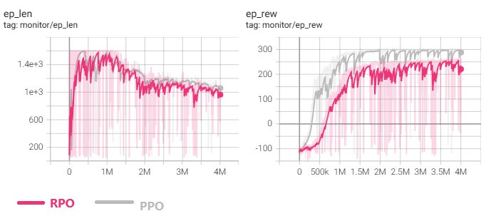

过程中犯了两个错误，导致并发环境版本搞了差不多一天：

1. 没有打散样本，没有分minibatch
2. env.reset()位置不对，导致每收集一次就重新reset，使得环境0的统计出现了问题

showcase的得分：

```
# RPO的showcase得分
total reward:254.74
total reward:255.43
total reward:254.93
total reward:254.91
total reward:257.61

#PPO的showcase得分：
total reward:295.93
total reward:299.79
total reward:298.14
total reward:296.85
total reward:296.34
```

代码如下：

```python
import gymnasium as gym
import numpy
import numpy as np
import torch
import torch.nn as nn
import torch.optim as optim
from stable_baselines3.common.vec_env import SubprocVecEnv
from stable_baselines3.common.monitor import Monitor

from torch.distributions import Normal, Independent
from torch.utils.tensorboard import SummaryWriter
from datetime import datetime as dt
import pygame


# 设置随机种子
torch.manual_seed(42)
np.random.seed(42)

device = torch.device("cuda" if torch.cuda.is_available() else "cpu")
writer = SummaryWriter(log_dir=f"logs/BipedalWalker_PPO_{dt.now().strftime('%y%m%d_%H%M%S')}")
n_envs = 4


def perturb_mean(mean, alpha):
    noise = torch.rand_like(mean)*2-1.0
    noise = (noise * alpha).to(device)
    return mean+noise


def make_env(n_envs):
    def make_single_env(seed):
        def _init():
            env = gym.make("BipedalWalker-v3", render_mode=None)  # 不渲染图形
            env = Monitor(env) #记录回合的统计信息到info字段
            env.reset(seed=seed)
            return env
        return _init

    env_fns = [make_single_env(seed=100 + i) for i in range(n_envs)]
    return SubprocVecEnv(env_fns)


class PolicyNetwork(nn.Module):
    def __init__(self, state_dim, hidden_dim=128):
        super().__init__()
        self.net = nn.Sequential(
            nn.Linear(state_dim, hidden_dim),
            nn.ReLU(),
            nn.Linear(hidden_dim, hidden_dim // 2),
            nn.ReLU()
        )
        # 动作空间是 4个连续的浮点数，各代表一个关节，所以mean / std都要输出4个
        self.mean = nn.Linear(hidden_dim // 2, 4)
        self.log_std = nn.Linear(hidden_dim // 2, 4)

    def forward(self, x):
        x = x / torch.tensor([[3.14, 5., 5., 5., 3.14, 5., 3.14, 5., 5., 3.14, 5., 3.14, 5., 5., 1., 1., 1., 1., 1., 1., 1., 1., 1., 1. ]], device=x.device, dtype=x.dtype)  # normalize
        x = self.net(x)
        mean = self.mean(x)
        std = self.log_std(x)
        std = torch.clamp(std, min=-10, max=10) #限制一下，避免下来的exp(x)爆炸
        std = std.exp() # type:torch.Tensor
        return mean, std


class ValueNetwork(nn.Module):
    def __init__(self, state_dim, hidden_dim=128):
        super().__init__()
        self.net = nn.Sequential(
            nn.Linear(state_dim, hidden_dim),
            nn.ReLU(),
            nn.Linear(hidden_dim, hidden_dim // 2),
            nn.ReLU(),
            nn.Linear(hidden_dim // 2, 1)
        )

    def forward(self, x):
        x = x / torch.tensor([[3.14, 5., 5., 5., 3.14, 5., 3.14, 5., 5., 3.14, 5., 3.14, 5., 5., 1., 1., 1., 1., 1., 1.,
                               1., 1., 1., 1.]], device=x.device, dtype=x.dtype)  # normalize
        return self.net(x).squeeze(-1)


def compute_gae(rewards, values, dones, gamma=0.99, lam=0.95):
    gae, returns = 0, []
    for t in reversed(range(len(rewards))):
        delta = rewards[t] + gamma * values[t+1] * (1 - dones[t]) - values[t]
        gae = delta + gamma * lam * (1 - dones[t]) * gae
        returns.insert(0, gae + values[t])
    returns = torch.stack(returns).to(device)
    return returns

def show(filename):

    env = gym.make("BipedalWalker-v3", render_mode='human')

    #state_dim = env.observation_space.shape[0]
    #policy = PolicyNetwork(state_dim).to(device)
    policy = torch.load(filename, weights_only=False).to(device)
    policy.eval()
    for _ in range(5):# 多实验几次
        state, _= env.reset()
        total_reward = 0
        for i in range(3000):
            state_tensor = torch.tensor(state, dtype=torch.float32).to(device)
            with torch.no_grad():
                mean, std = policy(state_tensor.unsqueeze(0))
            #mean = perturb_mean(mean)

            dist = Independent(Normal(mean, std), 1)
            action_raw = dist.rsample()
            #action_raw = mean
            action = torch.tanh(action_raw)
            action_np = action.squeeze(0).cpu().numpy()
            next_state, reward, terminated, truncated, _ = env.step(action_np)
            total_reward += reward
            env.render()
            if terminated or truncated:
                break
            state = next_state
        print(f"total reward:{total_reward}")
    policy.train()


def train():
    #env = gym.make("BipedalWalker-v3")
    env = make_env(n_envs) #SubprocVecEnv
    state_dim = env.observation_space.shape[0]

    policy = PolicyNetwork(state_dim).to(device)
    value_fn = ValueNetwork(state_dim).to(device)
    optim_policy = optim.Adam(policy.parameters(), lr=3e-4)
    optim_value = optim.Adam(value_fn.parameters(), lr=1e-3)

    step_count = 0
    ep_len = 0
    ep_rew = 0
    alpha_first = 0.7
    alpha_last = 0.05
    alpha = alpha_first

    max_steps = 4_000_000

    state = env.reset()

    while step_count < max_steps:
        states, actions, rewards, dones, log_probs, values = [], [], [], [], [], []
        # 要确保 每个环境平均分到2048个时间步才好，因为这个游戏一个回合通常有1600步。
        while len(states) < 8192//n_envs:
            state_tensor = torch.tensor(state, dtype=torch.float32).to(device)
            with torch.no_grad():
                mean, std = policy(state_tensor)
            mean = perturb_mean(mean, alpha)

            dist = Independent(Normal(mean, std), 1)
            action_raw = dist.rsample()
            action = torch.tanh(action_raw)
            # log_prob.shape == (1,) 是因为 Independent(Normal(...), 1) 把动作视为一个多维事件，并对每个维度的 log_prob 做了求和。
            log_prob = dist.log_prob(action_raw)

            value = value_fn(state_tensor)

            action_np = action.cpu().numpy().astype(np.float32)

            next_state, reward, done, info = env.step(action_np)

            ep_rew += reward[0]
            reward = torch.tensor(reward, dtype=torch.float32)
            done = torch.tensor(done, dtype=torch.float32)

            #记录真正的最后一个状态
            next_stt = next_state.copy()
            for env_idx in range(n_envs):
                if done[env_idx]:
                    if info[env_idx]["TimeLimit.truncated"]: #发生了截断
                        writer.add_scalar("stats/truncate", 1, step_count)
                    else: # 是真的一个回合结束了, 不是被截断导致结束，由于环境自动reset，所以next_states并不是真的随后一个状态，而是reset后下一回合的新状态
                        next_stt[env_idx] = info[env_idx]["terminal_observation"]

            states.append(state_tensor)
            actions.append(action_raw)
            rewards.append(reward)
            dones.append(done)
            log_probs.append(log_prob)
            values.append(value)

            state = next_state
            step_count += n_envs
            ep_len += 1


            if "episode" in info[0]:
                ep_rew_0 = info[0]["episode"]["r"]
                ep_len_0 = info[0]["episode"]["l"]
                writer.add_scalar("monitor/ep_rew", ep_rew_0, step_count)
                writer.add_scalar("monitor/ep_len", ep_len_0, step_count)
                writer.add_scalar("monitor/done", done[0], step_count) #应该是1/True才对
                if done[0]:
                    writer.add_scalar("monitor/my_ep_len", ep_len, step_count)
                    writer.add_scalar("monitor/my_ep_rew", ep_rew, step_count)

            if done[0]: #我手动统计的env#0的信息，跟上面monitor里记录的信息一致了。一开始不一致，困惑了好久，原来是不恰当的reset导致的
                writer.add_scalar("stats/ep_len", ep_len, step_count)
                writer.add_scalar("stats/ep_rew", ep_rew, step_count)
                ep_len = 0
                ep_rew = 0


        # 为了bootstrap, value要多一个
        with torch.no_grad():
            next_value = value_fn(torch.tensor(next_stt, dtype=torch.float32).to(device))
        values.append(next_value)
        returns = compute_gae(rewards, values, dones).detach()

        #恢复value的长度
        values = torch.stack(values[:-1]).to(device).detach()
        advantages = returns - values
        advantages = (advantages - advantages.mean()) / (advantages.std() + 1e-8)

        # 转换为张量
        states = torch.stack(states)
        actions = torch.stack(actions)
        log_probs_old = torch.stack(log_probs)

        # 把多个环境打平
        states = states.reshape((-1,)+env.observation_space.shape)
        actions = actions.reshape((-1,)+env.action_space.shape)
        log_probs_old = log_probs_old.reshape(-1)
        advantages = advantages.reshape(-1)
        returns = returns.reshape(-1)
        values = values.reshape(-1)

        batch_size = states.shape[0]
        minibatch_size = 256


        for _ in range(10):  # PPO更新轮数
            perm = torch.randperm(batch_size, device=states.device)
            for i in range(0, batch_size, minibatch_size):
                idx = perm[i:i + minibatch_size]

                mb_states = states[idx]
                mb_actions = actions[idx]
                mb_log_probs_old = log_probs_old[idx]
                mb_advantages = advantages[idx]
                mb_returns = returns[idx]

                # 计算当前策略分布
                mean, std = policy(mb_states)
                mean = perturb_mean(mean, alpha)
                dist = Independent(Normal(mean, std), 1)

                log_probs_new = dist.log_prob(mb_actions)
                entropy = dist.entropy().mean()

                ratio = torch.exp(log_probs_new - mb_log_probs_old)
                surr1 = ratio * mb_advantages
                surr2 = torch.clamp(ratio, 0.8, 1.2) * mb_advantages
                policy_loss = -torch.min(surr1, surr2).mean() - 0.001 * entropy

                value_preds = value_fn(mb_states)
                value_loss = nn.functional.mse_loss(value_preds, mb_returns)

                optim_policy.zero_grad()
                policy_loss.backward()
                optim_policy.step()

                optim_value.zero_grad()
                value_loss.backward()
                optim_value.step()


        alpha = decay_alpha(alpha_first, alpha_last, step_count, max_steps)
        writer.add_scalar("stats/alpha", alpha, step_count)
        writer.add_scalar("loss/policy", policy_loss.item(), step_count)
        writer.add_scalar("loss/value", value_loss.item(), step_count)
        writer.flush()

        print(f"Step: {step_count}, Policy Loss: {policy_loss.item():.3f}")

    env.close()
    torch.save(policy, "./checkpoints/BipedalWalker_RPO.pth")


def decay_alpha(alpha_first, alpha_last, step_count, max_steps):
    dec_per_step = (alpha_first - alpha_last) / max_steps
    return alpha_first - dec_per_step * step_count


if __name__ == "__main__":
    train()
    show("./checkpoints/BipedalWalker_RPO.pth")

```

