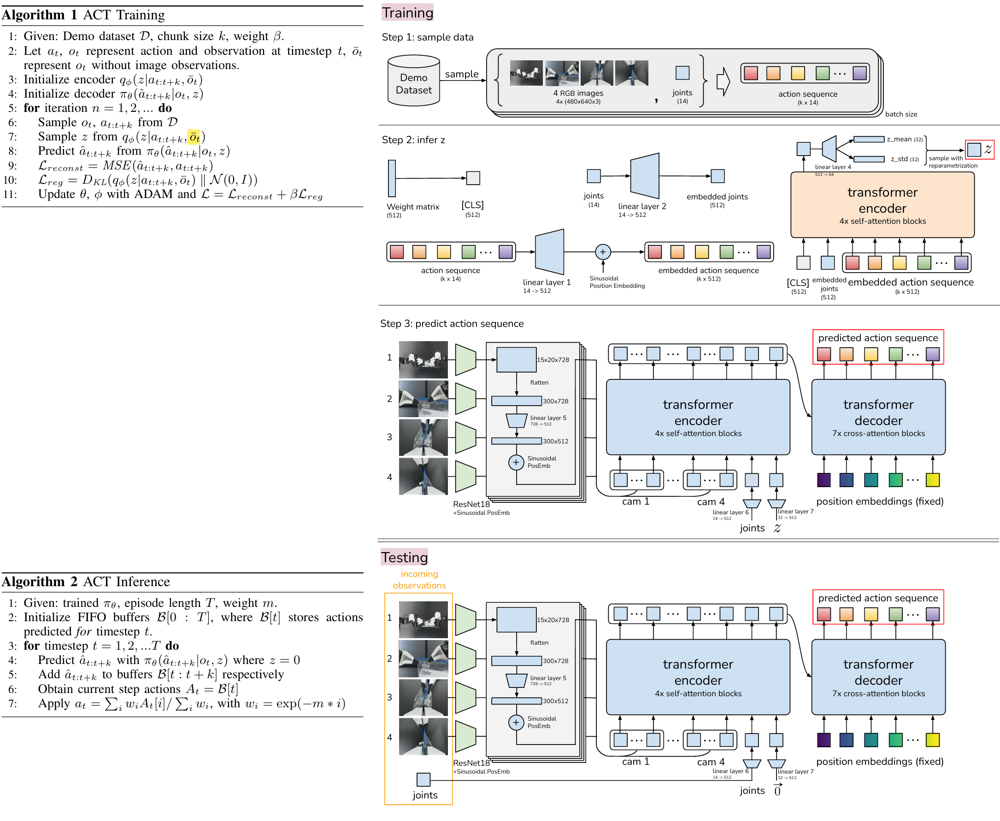
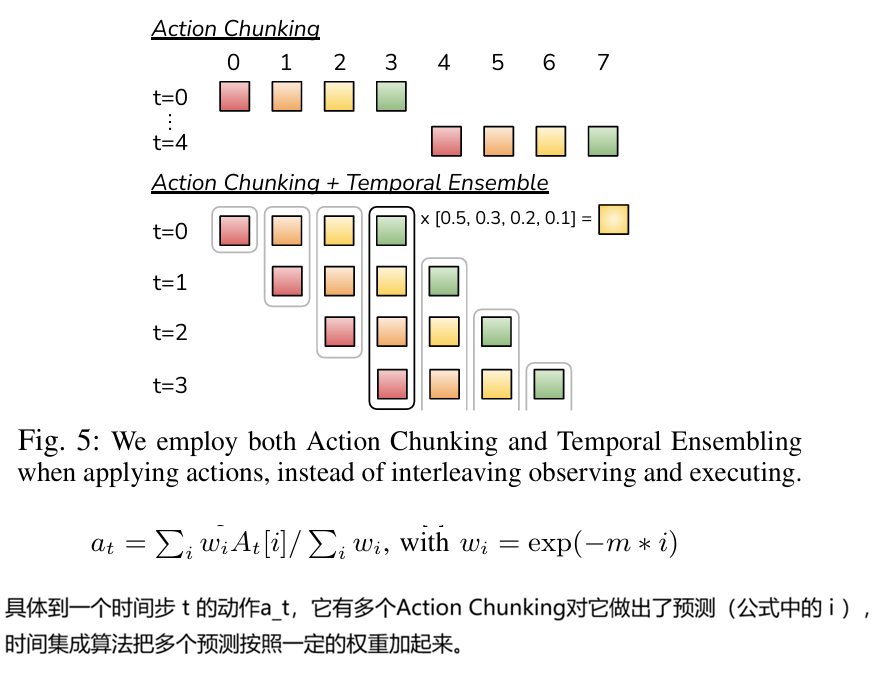
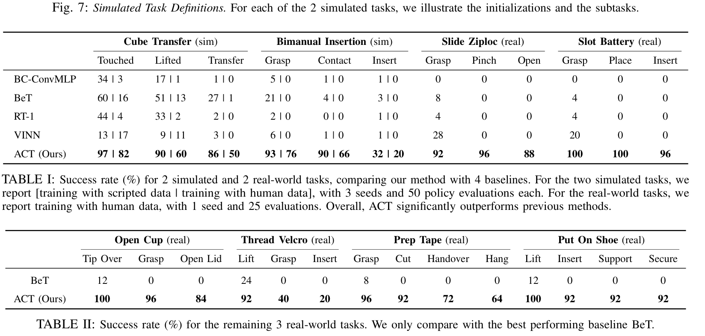

**Learning Fine-Grained Bimanual Manipulation with Low-Cost Hardware**

Robotics: Science and Systems (**RSS**) '2023, from  Stanford University  UC Berkeley  Meta

### 1 Introduction

精细操作任务涉及精确的闭环反馈，需要高度的手眼协调能力，以便在环境变化时进行调整和重新规划。这样的操作任务的例子包括打开调味品杯的盖子或插入电池，这些都需要像捏、撬、撕这样的小动作，而不是像抓取和放置这样的粗大动作。哪怕只有几毫米的误差也会导致任务失败。

训练一个端到端的策略本身也有挑战。策略的表现很大程度上取决于训练数据的分布，在精细操作的情况下，高质量的人类演示能提供巨大价值，让系统从人类的灵巧中学习。模仿学习允许机器人直接从专家那里学习。例如行为克隆（BC）是最简单的模仿学习算法之一，把模仿当作从观察到动作的监督学习。模仿学习主要缺点是错误会累积，以前时间步的错误会积累，导致机器人偏离它的训练分布，从而进入很难恢复的状态。减轻累积误差的一种方法是允许额外的策略内交互和专家修正，比如 DAgger和它的各种变种。

我们搭建了一个低成本但灵巧的远程操作系统用于数据收集，并提出了一种新的模仿学习算法，能够有效地从示范中学习。即使有高质量的示范，那些需要精确操作和视觉反馈的任务对模仿学习来说仍然是一个重大挑战。预测动作中的小错误可能会导致状态的巨大差异，加剧了模仿学习中的“错误累积”问题。

为了解决这个问题，我们从心理学中的“动作切块”概念中获得灵感，这个概念描述了动作序列如何被组合成一个整体，并作为一个单元来执行。在我们的例子中，策略会预测接下来 k 个时间步的目标关节位置，而不仅仅是每次一步。这将任务的有效时间范围缩短了 k 倍，从而减少了误差的累积。我们提出了时间集成方法，它可以更频繁地查询策略，并对重叠的动作块进行平均处理。我们使用 Transformer [ 实现了动作分块策略，这是一种为序列建模设计的架构，并将其作为条件 VAE (CVAE)来训练，以捕捉人类数据的多样性。我们把这种方法命名为使用 Transformer 的动作分块（ACT），并发现它在一系列模拟和真实世界的精细操作任务中，都明显优于之前的模仿学习算法。

### 2 Method

我们首先使用ALOHA收集人类示范。我们记录领导机器人（即人类操作者的输入）的关节位置，并将它们用作动作。观测由跟随机器人当前的关节位置以及来自四个摄像头的图像数据组成。接下来，我们训练ACT根据当前观测预测未来动作的序列。这里的一个动作对应下一时间步双臂的目标关节位置。直观地，ACT 尝试在给定当前观察的情况下，模仿人类操作员在接下来的时间步骤中会做什么。

Agent接收到一个观察，然后生成接下来的动作，并按顺序执行这些动作。



####  Action Chunking and Temporal Ensemble

为了提高流畅性并避免在执行和观察之间出现离散切换，我们在每个时间步都查询策略。这会导致不同的动作片段相互重叠，并且在某个时间步可能会有多个预测动作。我们提出了一个时间集成方法来结合这些预测。我们的时间集成对这些预测做加权平均，采用指数加权方案。我们发现动作分块和时间集成对ACT的成功都很重要，这能产生精准流畅的动作。



#### Modeling Human Data

在精细操作（如空中交接胶带、打开杯子）中，人类演示是**多模态 (multi-modal)、多条轨迹** 的。也就是说，面对同一个视觉画面，人类每次采取的动作轨迹可能都不一样（比如交接胶带的位置每次都有几毫米的偏差）。如果模仿学习中用普通的回归网络（如直接预测动作的MSE损失），网络为了最小化误差，会预测所有可能轨迹的 “平均值”。这会导致动作变得模糊、不精确，甚至发生碰撞。

我们采取CVAE（条件变分自编码器），将策略建模为条件生成模型。它允许模型学习到一个多模态的概率分布，从而能够捕捉人类数据中的变异性（Variability），在需要高精度的地方给出确定的动作，而不是求平均。

```
背景知识：
VAE的通常作用是对输入的图片生成摘要，训练方法：输入图片，encode为一个隐藏层（正态分布的均值方差）然后decode出新的图片，有监督学习要求输入输出的图片距离越小越好。训练损失函数还会用KL散度正则，它强制要求编码器输出的分布，尽量接近标准正态分布N(0,I)。这使得潜空间（Latent Space）变得连续且平滑。
普通自编码器 (AE)：把图片压缩成一个固定的向量（隐藏层），再解压还原。VAE：把图片编码为一个概率分布（通常是高斯分布，输出均值 
和方差。然后从这个分布中随机采样一个向量z，再用解码器还原图片。
```

CVAE encoder 是一个只含 Transformer encoder 的 BERT-like 模块，主要负责把一段专家动作压缩成潜变量 z的分布。它根据当前本体状态和专家动作 chunk 推断 style variable z的分布。训练时，CVAE encoder 实际输入的是专家动作序列和当前 joint positions；论文实现中为了加快训练，去掉了图像输入。例如面对同一个观测，人类可能都能完成抓取，但有人从左侧接近，有人从右侧接近。\(z\) 用来表示这种行为多样性。

CVAE decoder 是一个 policy 网络，内部由图像 CNN、Transformer encoder 和 Transformer decoder 组成；它根据当前多视角观测、当前关节位置和 \(z\)，生成未来一段 action chunk。

训练的损失函数通CVAE的损失函数，由动作序列重建损失 + KL正则项两部分构成：

1. 动作序列重建损失要求 decoder预测的动作序列尽量接近专家的动作序列，是行为克隆
2. KL 正则项迫使 \(z\) 接近标准高斯，这样即使测试时不再看到专家动作，decoder 也能正常工作。

CVAE encoder 在测试/推理时会被丢弃，只使用CVAE decoder。所以 ACT 没有：

- transition model；
- reward model；
- environment simulator；
- imagined trajectory；
- critic；
- actor-critic RL。

它是 imitation learning。

#### ACT Implimenting

总体架构采用条件变分自编码器（CVAE），并用 Transformer 同时实现 CVAE encoder 和 decoder，以便建模动作序列、融合多源观测并生成连续动作序列。

CVAE encoder 使用类似 BERT 的 Transformer encoder：

- 输入包括当前关节位置和示范数据中的长度为 k 的目标动作序列。
- 在输入序列前添加一个可学习的 `[CLS]` token。
- 总输入长度为 k+2。
- Transformer 输出中的 `[CLS]` 特征用于预测风格变量 z 的均值和方差。

风格变量 z 用于表示人类示范中的动作风格或随机性；它作为 CVAE decoder 的条件输入。CVAE encoder 主要用于训练阶段，推理时不再需要。

CVAE decoder，也就是实际执行的策略，由三部分组成：

- ResNet 图像编码器；
- Transformer encoder；
- Transformer decoder。
- Transformer encoder 融合多相机图像、当前关节位置和风格变量 z。
- Transformer decoder 根据融合后的信息生成连贯的未来动作序列。

视觉输入由 4 个 RGB 相机构成，每幅图像分辨率为 480×640×3。

每幅图像首先经过 ResNet18，得到 15×20×512 的特征图：

- 展平空间维度后变为 300×512 的特征序列。
- 加入二维正弦位置编码，以保留图像空间位置信息。
- 4 个相机的特征拼接后得到 1200×512 的视觉特征序列。

当前关节位置和风格变量 z 分别经过线性层投影到 512 维，并作为额外的两个特征加入视觉序列，因此 Transformer encoder 的输入尺寸为 1202×512。

Transformer decoder 使用交叉注意力读取 Transformer encoder 的输出：

- decoder 输入是固定的位置嵌入，尺寸为 k×512。
- encoder 的输出作为 cross-attention 的 key 和 value。
- decoder 输出尺寸为 k×512。
- 最后通过 MLP 投影为 k×14，对应未来 k 步的 14 维动作序列。

动作空间使用两台机械臂的绝对关节位置：

- 每台机械臂有 7 个自由度，总计 14 个自由度。
- 策略输出为 k×14 的目标关节位置张量。
- 论文发现使用关节位置增量作为动作会导致性能下降，因此采用绝对目标关节位置。

重建损失使用 L1 loss，而不是更常见的 L2 loss。作者观察到 L1 loss 能够更精确地拟合动作序列，适合精细操作任务。

模型规模和计算开销：

- 每个任务单独从头训练。
- 模型约有 8000 万个参数。
- 在单张 11GB RTX 2080 Ti 上训练约需 5 小时。
- 同一硬件上的推理时间约为 0.01 秒。

### 3 Experiments



### 4 代码

官方代码在[这里](https://tonyzhaozh.github.io/aloha/)，其中ACT在[这里](https://github.com/tonyzhaozh/act)